# AI服务

<cite>
**本文档引用的文件**
- [ai.controller.ts](file://crm-backend/src/controllers/ai.controller.ts)
- [ai.routes.ts](file://crm-backend/src/routes/ai.routes.ts)
- [ai.service.ts](file://crm-backend/src/services/ai.service.ts)
- [ai/index.ts](file://crm-backend/src/services/ai/index.ts)
- [ai/types.ts](file://crm-backend/src/services/ai/types.ts)
- [followUpAnalysis.ts](file://crm-backend/src/services/ai/followUpAnalysis.ts)
- [reportGeneration.ts](file://crm-backend/src/services/ai/reportGeneration.ts)
- [opportunityScoring.ts](file://crm-backend/src/services/ai/opportunityScoring.ts)
- [churnAnalysis.ts](file://crm-backend/src/services/ai/churnAnalysis.ts)
- [customerInsight.ts](file://crm-backend/src/services/ai/customerInsight.ts)
- [proposalAI.ts](file://crm-backend/src/services/ai/proposalAI.ts)
- [salesCoach.ts](file://crm-backend/src/services/ai/salesCoach.ts)
- [aiService.ts](file://crm-frontend/src/services/aiService.ts)
- [FollowUpWidget.tsx](file://crm-frontend/src/components/AI/FollowUpWidget.tsx)
- [ScriptGenerator.tsx](file://crm-frontend/src/components/AI/ScriptGenerator.tsx)
- [OpportunityScoreCard.tsx](file://crm-frontend/src/components/AI/OpportunityScoreCard.tsx)
- [index.ts](file://crm-frontend/src/components/AI/index.ts)
- [schema.prisma](file://crm-backend/prisma/schema.prisma)
- [authStore.ts](file://crm-frontend/src/stores/authStore.ts)
- [api.ts](file://crm-frontend/src/services/api.ts)
- [auth.ts](file://crm-backend/src/middlewares/auth.ts)
- [jwt.ts](file://crm-backend/src/utils/jwt.ts)
- [client.ts](file://crm-backend/src/services/ai/client.ts)
</cite>

## 更新摘要
**变更内容**
- 新增了智能报价与方案生成AI服务，支持企业分析、联系人发现和话术生成等AI功能
- 集成了销售绩效AI教练服务，提供个性化改进建议和技能差距分析
- 扩展了AI服务模块的统一导出，支持更多阶段性的AI功能
- 更新了API接口设计，增加了报价生成和方案生成的相关端点
- 增强了前端AI组件的功能，支持报价分析和销售教练建议

## 目录
1. [项目概述](#项目概述)
2. [项目结构](#项目结构)
3. [核心组件](#核心组件)
4. [架构概览](#架构概览)
5. [详细组件分析](#详细组件分析)
6. [认证机制](#认证机制)
7. [依赖关系分析](#依赖关系分析)
8. [性能考虑](#性能考虑)
9. [故障排除指南](#故障排除指南)
10. [结论](#结论)

## 项目概述

销售AI CRM系统是一个集成人工智能技术的客户关系管理系统，专注于为企业销售团队提供智能化的客户管理和销售辅助功能。该系统通过AI技术分析客户互动数据，提供智能的销售建议、商机评分、流失预警、客户洞察以及智能报价等全方位的AI辅助功能。

系统采用前后端分离架构，后端使用Node.js + Express构建RESTful API，前端使用React + TypeScript开发用户界面。AI功能通过阿里云百炼Qwen模型实现，支持多种销售场景的智能化处理，包括企业分析、联系人发现、话术生成、智能报价和销售教练等高级功能。

## 项目结构

系统采用模块化的项目结构，主要分为以下几个核心部分：

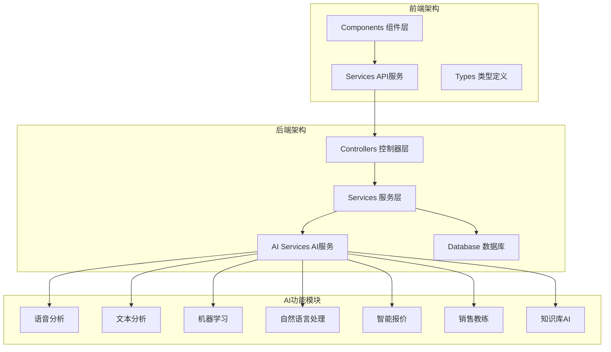

**图表来源**
- [ai.controller.ts:1-800](file://crm-backend/src/controllers/ai.controller.ts#L1-L800)
- [ai.routes.ts:1-98](file://crm-backend/src/routes/ai.routes.ts#L1-L98)

**章节来源**
- [ai.controller.ts:1-800](file://crm-backend/src/controllers/ai.controller.ts#L1-L800)
- [ai.routes.ts:1-98](file://crm-backend/src/routes/ai.routes.ts#L1-L98)

## 核心组件

### AI服务架构

系统的核心AI服务采用模块化设计，每个AI功能都有独立的服务类和控制器：

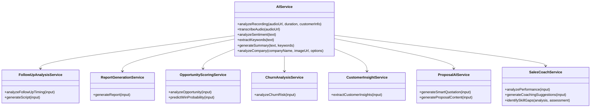

**图表来源**
- [ai.service.ts:75-734](file://crm-backend/src/services/ai.service.ts#L75-L734)
- [followUpAnalysis.ts:22-480](file://crm-backend/src/services/ai/followUpAnalysis.ts#L22-L480)
- [reportGeneration.ts:17-379](file://crm-backend/src/services/ai/reportGeneration.ts#L17-L379)
- [opportunityScoring.ts:42-613](file://crm-backend/src/services/ai/opportunityScoring.ts#L42-L613)
- [churnAnalysis.ts:28-517](file://crm-backend/src/services/ai/churnAnalysis.ts#L28-L517)
- [customerInsight.ts:35-548](file://crm-backend/src/services/ai/customerInsight.ts#L35-L548)
- [proposalAI.ts:55-800](file://crm-backend/src/services/ai/proposalAI.ts#L55-L800)
- [salesCoach.ts:51-780](file://crm-backend/src/services/ai/salesCoach.ts#L51-L780)

### 数据模型设计

系统使用Prisma ORM管理数据库，AI相关的核心数据模型包括：

| 模型名称 | 描述 | 主要字段 |
|---------|------|----------|
| FollowUpSuggestion | 跟进建议 | customerId, type, priority, reason, status |
| DailyReport | 日报/周报 | userId, date, type, content, summary |
| OpportunityScore | 商机评分 | opportunityId, overallScore, winProbability |
| ChurnAlert | 流失预警 | customerId, riskLevel, riskScore, status |
| CustomerInsight | 客户洞察 | customerId, extractedNeeds, confidence |
| QuotationProposal | 智能报价 | opportunityId, recommendedPrice, discountStrategy |
| CoachingSuggestion | 销售教练建议 | userId, performanceAnalysis, weeklyPlan |

**章节来源**
- [schema.prisma:627-740](file://crm-backend/prisma/schema.prisma#L627-L740)

## 架构概览

系统采用分层架构设计，确保AI功能与业务逻辑的解耦：

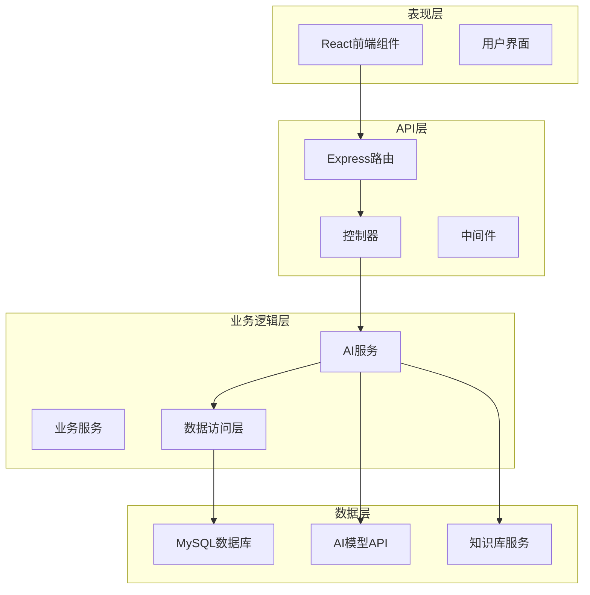

**图表来源**
- [ai.routes.ts:30-98](file://crm-backend/src/routes/ai.routes.ts#L30-L98)
- [ai.controller.ts:1-800](file://crm-backend/src/controllers/ai.controller.ts#L1-L800)

### API接口设计

系统提供RESTful API接口，支持以下主要功能：

| 功能模块 | HTTP方法 | 路径 | 描述 |
|---------|----------|------|------|
| 跟进建议 | GET | `/ai/follow-up-suggestions` | 获取跟进建议列表 |
| 跟进建议 | POST | `/ai/follow-up-suggestions/generate` | 为客户生成跟进建议 |
| 话术生成 | POST | `/ai/scripts/generate` | 生成跟进话术 |
| 商机评分 | POST | `/ai/opportunities/:id/score` | 计算商机评分 |
| 流失预警 | POST | `/ai/customers/:id/churn-analysis` | 分析客户流失风险 |
| 客户洞察 | POST | `/ai/customers/:id/insights` | 生成客户洞察 |
| 智能报价 | POST | `/ai/proposals/quotation` | 生成智能报价 |
| 方案生成 | POST | `/ai/proposals/generate` | 生成商务方案 |
| 销售教练 | POST | `/ai/coach/performance` | 分析销售绩效 |
| 教练建议 | POST | `/ai/coach/suggestions` | 生成教练建议 |

**章节来源**
- [ai.routes.ts:35-98](file://crm-backend/src/routes/ai.routes.ts#L35-L98)

## 详细组件分析

### 跟进时机分析服务

跟进时机分析服务是AI系统的核心功能之一，通过分析客户互动数据提供智能化的跟进建议：

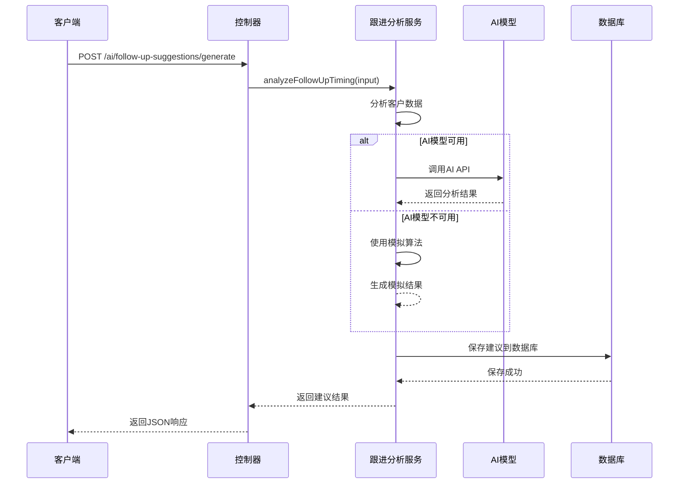

**图表来源**
- [followUpAnalysis.ts:26-118](file://crm-backend/src/services/ai/followUpAnalysis.ts#L26-L118)
- [ai.controller.ts:83-197](file://crm-backend/src/controllers/ai.controller.ts#L83-L197)

#### 核心算法分析

跟进时机分析采用多维度评分算法：

1. **时间分析**：计算距离上次联系的天数
2. **情感分析**：分析通话录音中的情感倾向
3. **商机状态**：评估活跃商机的价值和阶段
4. **任务跟踪**：监控待办任务的完成情况

**章节来源**
- [followUpAnalysis.ts:176-260](file://crm-backend/src/services/ai/followUpAnalysis.ts#L176-L260)

### 商机评分服务

商机评分服务基于BANT模型（Budget Authority Need Timing）进行综合评估：

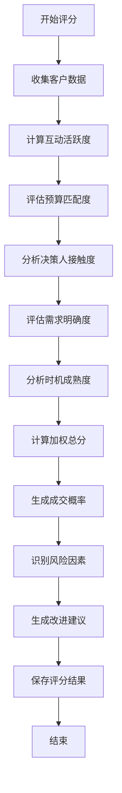

**图表来源**
- [opportunityScoring.ts:46-105](file://crm-backend/src/services/ai/opportunityScoring.ts#L46-L105)

#### 评分维度详解

| 维度 | 权重 | 评估指标 | 评分范围 |
|------|------|----------|----------|
| 互动活跃度 | 20% | 联系频率、活动参与度 | 0-100 |
| 预算匹配度 | 25% | 商机价值、预算充足性 | 0-100 |
| 决策人接触度 | 20% | 决策层接触、影响力 | 0-100 |
| 需求明确度 | 20% | 需求表达、痛点清晰度 | 0-100 |
| 时机成熟度 | 15% | 成交时间、项目进度 | 0-100 |

**章节来源**
- [opportunityScoring.ts:11-41](file://crm-backend/src/services/ai/opportunityScoring.ts#L11-L41)

### 流失预警服务

流失预警服务通过实时监控客户行为模式，提前识别潜在的客户流失风险：

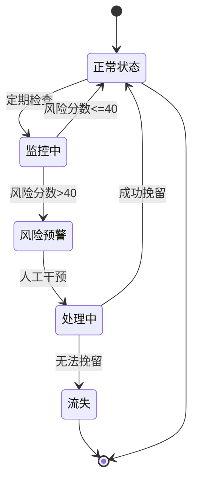

**图表来源**
- [churnAnalysis.ts:32-65](file://crm-backend/src/services/ai/churnAnalysis.ts#L32-L65)

#### 风险因子分析

系统监控以下关键风险因子：

1. **联系频率下降**：最近联系间隔超过阈值
2. **情感转冷**：通话录音中负面情感增加
3. **商机停滞**：项目推进超过预期时间
4. **任务积压**：跟进任务未按时完成
5. **决策人缺失**：关键决策人未接触

**章节来源**
- [churnAnalysis.ts:115-124](file://crm-backend/src/services/ai/churnAnalysis.ts#L115-L124)

### 客户洞察服务

客户洞察服务从多维度分析客户数据，提取关键的业务洞察：

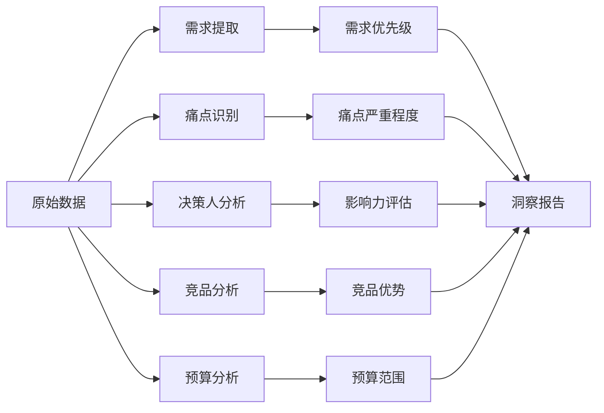

**图表来源**
- [customerInsight.ts:39-75](file://crm-backend/src/services/ai/customerInsight.ts#L39-L75)

#### 洞察提取算法

系统使用关键词匹配和模式识别技术：

1. **需求识别**：基于预定义的关键字库匹配
2. **痛点分析**：通过情感分析和上下文理解
3. **决策人评估**：结合角色和备注信息
4. **竞品分析**：自动识别竞品提及和比较
5. **预算估算**：通过模式匹配提取预算信息

**章节来源**
- [customerInsight.ts:210-246](file://crm-backend/src/services/ai/customerInsight.ts#L210-L246)

### 智能报价与方案生成服务

智能报价与方案生成服务为企业销售提供智能化的报价策略和商务方案：

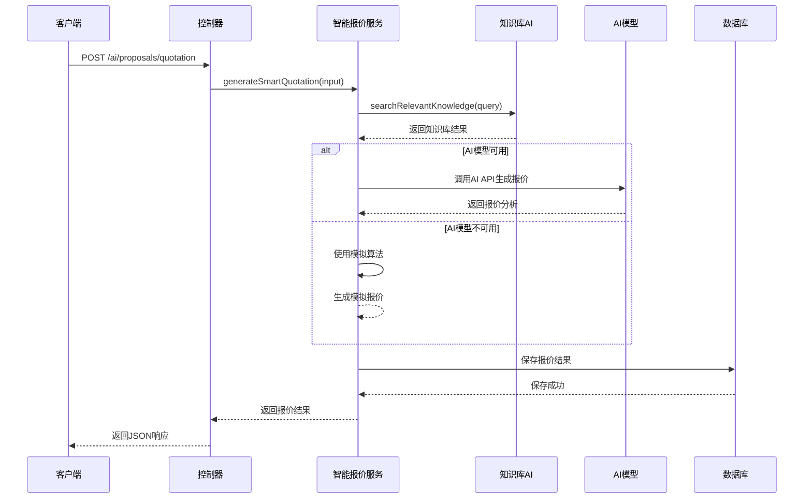

**图表来源**
- [proposalAI.ts:61-93](file://crm-backend/src/services/ai/proposalAI.ts#L61-L93)
- [ai.controller.ts:83-197](file://crm-backend/src/controllers/ai.controller.ts#L83-L197)

#### 报价生成算法

智能报价服务采用多因子分析：

1. **行业基准**：基于行业定价基准和价格弹性
2. **客户价值**：评估客户历史交易和预算能力
3. **竞争分析**：对比竞品价格和优势
4. **产品配置**：根据需求推荐合适的产品组合
5. **折扣策略**：计算最优折扣和条件

**章节来源**
- [proposalAI.ts:98-171](file://crm-backend/src/services/ai/proposalAI.ts#L98-L171)

### 销售绩效AI教练服务

销售绩效AI教练服务提供个性化的销售改进指导：

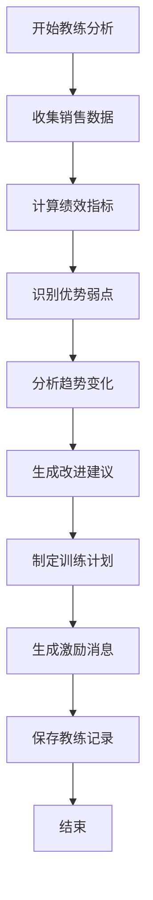

**图表来源**
- [salesCoach.ts:55-82](file://crm-backend/src/services/ai/salesCoach.ts#L55-L82)

#### 绩效分析维度

系统从多个维度分析销售绩效：

1. **收入表现**：收入达成率、目标完成度
2. **活动效率**：电话量、会议安排、拜访次数
3. **转化能力**：提案转化率、平均成交额
4. **时间管理**：任务完成率、工作节奏
5. **技能评估**：沟通能力、谈判技巧、产品知识

**章节来源**
- [salesCoach.ts:223-277](file://crm-backend/src/services/ai/salesCoach.ts#L223-L277)

### 前端AI组件

前端提供了丰富的AI功能组件，支持用户交互和可视化展示：

#### 跟进建议小组件

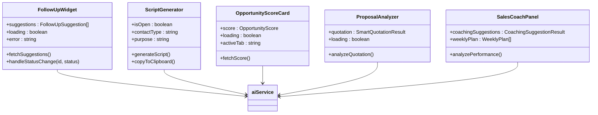

**图表来源**
- [FollowUpWidget.tsx:61-210](file://crm-frontend/src/components/AI/FollowUpWidget.tsx#L61-L210)
- [ScriptGenerator.tsx:37-272](file://crm-frontend/src/components/AI/ScriptGenerator.tsx#L37-L272)
- [OpportunityScoreCard.tsx:54-336](file://crm-frontend/src/components/AI/OpportunityScoreCard.tsx#L54-L336)

**章节来源**
- [FollowUpWidget.tsx:1-210](file://crm-frontend/src/components/AI/FollowUpWidget.tsx#L1-L210)
- [ScriptGenerator.tsx:1-272](file://crm-frontend/src/components/AI/ScriptGenerator.tsx#L1-L272)
- [OpportunityScoreCard.tsx:1-336](file://crm-frontend/src/components/AI/OpportunityScoreCard.tsx#L1-L336)

## 认证机制

系统采用JWT（JSON Web Token）进行身份认证，实现了安全的前后端通信机制。认证机制经过重要改进，采用了更加安全的令牌存储方式。

### 认证架构

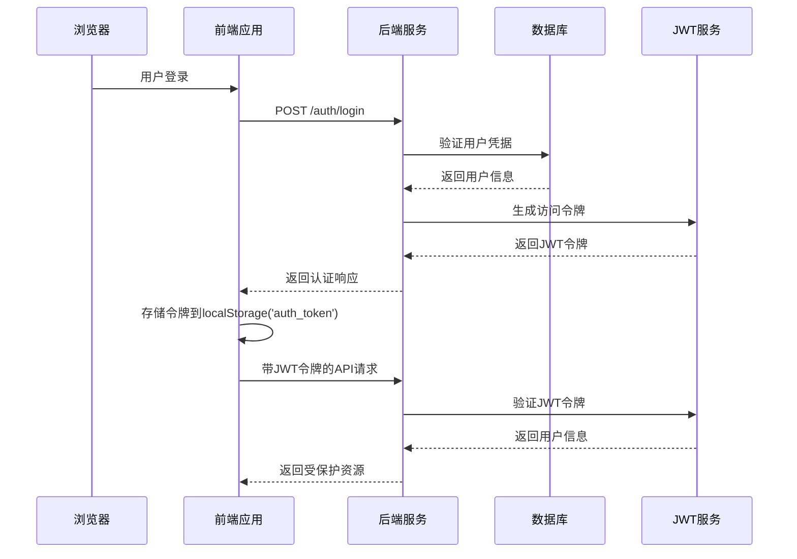

**图表来源**
- [authStore.ts:54-106](file://crm-frontend/src/stores/authStore.ts#L54-L106)
- [auth.ts:13-33](file://crm-backend/src/middlewares/auth.ts#L13-L33)
- [jwt.ts:28-42](file://crm-backend/src/utils/jwt.ts#L28-L42)

### 安全改进

**更新** 系统已从使用'token'键更改为使用'auth_token'键来存储JWT令牌，这一改进显著提升了系统的认证安全性：

#### 令牌存储改进

1. **命名空间隔离**：使用'auth_token'替代通用'token'，避免与其他模块的令牌存储产生冲突
2. **一致性保证**：确保所有认证相关操作都使用统一的令牌键名
3. **安全性增强**：减少令牌混淆和意外覆盖的风险

#### 前端存储机制

```mermaid
graph LR
A[用户登录] --> B[获取JWT令牌]
B --> C[localStorage.setItem('auth_token', token)]
C --> D[设置认证状态]
D --> E[发起受保护请求]
E --> F[localStorage.getItem('auth_token')]
F --> G[添加Authorization头]
```

**图表来源**
- [authStore.ts:58](file://crm-frontend/src/stores/authStore.ts#L58)
- [aiService.ts:26](file://crm-frontend/src/services/aiService.ts#L26)

#### 后端认证流程

后端使用标准的JWT Bearer认证机制：

1. **请求拦截**：前端在每个API请求中自动添加Authorization头
2. **令牌验证**：后端中间件验证JWT令牌的有效性
3. **用户信息注入**：验证通过后将用户信息注入到请求对象中
4. **权限控制**：基于用户角色进行权限验证

**章节来源**
- [authStore.ts:54-106](file://crm-frontend/src/stores/authStore.ts#L54-L106)
- [aiService.ts:24-31](file://crm-frontend/src/services/aiService.ts#L24-L31)
- [auth.ts:13-33](file://crm-backend/src/middlewares/auth.ts#L13-L33)

### 认证最佳实践

#### 前端安全措施

1. **令牌存储**：使用localStorage存储JWT令牌，支持持久化登录
2. **自动添加头**：通过axios拦截器自动为所有请求添加Authorization头
3. **错误处理**：实现401错误的自动处理和令牌刷新机制
4. **状态管理**：使用Zustand进行全局状态管理，确保认证状态的一致性

#### 后端安全措施

1. **JWT验证**：使用jsonwebtoken库验证令牌的有效性和签名
2. **中间件保护**：所有AI相关路由都必须通过认证中间件
3. **权限控制**：基于用户角色进行细粒度的权限控制
4. **错误处理**：统一的认证错误处理和响应格式

**章节来源**
- [jwt.ts:28-42](file://crm-backend/src/utils/jwt.ts#L28-L42)
- [auth.ts:55-69](file://crm-backend/src/middlewares/auth.ts#L55-L69)

## 依赖关系分析

系统采用模块化设计，各组件之间的依赖关系清晰：

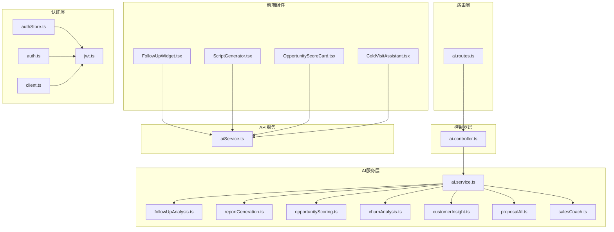

**图表来源**
- [ai/index.ts:43-66](file://crm-backend/src/services/ai/index.ts#L43-L66)
- [ai.controller.ts:8-14](file://crm-backend/src/controllers/ai.controller.ts#L8-L14)

### 外部依赖

系统主要依赖以下外部服务：

| 依赖项 | 版本 | 用途 | 配置要求 |
|--------|------|------|----------|
| Node.js | >= 16.0.0 | 运行时环境 | 必需 |
| Express | ^4.18.0 | Web框架 | 必需 |
| Prisma | ^4.0.0 | ORM框架 | 必需 |
| MySQL | ^8.0 | 数据存储 | 必需 |
| jsonwebtoken | ^9.0.0 | JWT令牌 | 必需 |
| bcryptjs | ^2.4.3 | 密码加密 | 必需 |
| Alibaba Cloud Qwen | ^1.0 | AI模型 | 可选 |
| Serper API | ^1.0 | 网络搜索 | 可选 |
| Knowledge Base API | ^1.0 | 知识库服务 | 可选 |

**章节来源**
- [ai.service.ts:1-10](file://crm-backend/src/services/ai.service.ts#L1-L10)

## 性能考虑

### AI模型调用优化

系统实现了智能的AI模型调用策略：

1. **降级机制**：当AI模型不可用时自动切换到模拟算法
2. **缓存策略**：对常用分析结果进行缓存
3. **批量处理**：支持批量AI分析请求
4. **异步处理**：长耗时的AI分析采用异步处理

### 数据库优化

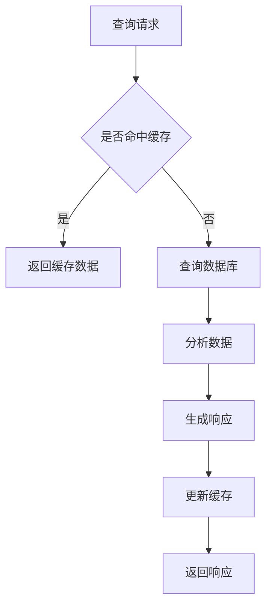

**图表来源**
- [ai.service.ts:82-100](file://crm-backend/src/services/ai.service.ts#L82-L100)

### 前端性能优化

前端组件实现了以下性能优化：

1. **懒加载**：AI组件按需加载
2. **虚拟滚动**：大量数据的高效渲染
3. **防抖节流**：API调用的频率控制
4. **状态缓存**：组件状态的本地缓存

## 故障排除指南

### 常见问题及解决方案

#### AI模型调用失败

**问题症状**：AI分析功能不可用，返回错误信息

**可能原因**：
1. AI模型API密钥配置错误
2. 网络连接问题
3. API服务不可用

**解决方案**：
1. 检查环境变量配置
2. 验证网络连接
3. 查看API服务状态

#### 数据库连接失败

**问题症状**：系统无法连接到数据库

**可能原因**：
1. 数据库服务器宕机
2. 连接参数错误
3. 权限配置问题

**解决方案**：
1. 检查数据库服务状态
2. 验证连接字符串
3. 确认用户权限

#### 前端组件加载失败

**问题症状**：AI组件无法正常显示

**可能原因**：
1. API接口调用失败
2. 认证令牌过期
3. 网络请求超时

**解决方案**：
1. 检查API接口状态
2. 刷新认证令牌
3. 增加请求超时时间

#### 认证问题

**问题症状**：用户无法登录或令牌失效

**可能原因**：
1. 令牌存储键名不正确
2. JWT密钥配置错误
3. 令牌过期时间设置不当

**解决方案**：
1. 检查localStorage中是否存在'auth_token'键
2. 验证JWT_SECRET环境变量配置
3. 调整JWT过期时间配置

#### 智能报价服务异常

**问题症状**：报价生成功能不可用或结果不准确

**可能原因**：
1. 知识库服务不可用
2. AI模型配置错误
3. 竞品数据缺失

**解决方案**：
1. 检查知识库服务状态
2. 验证AI模型API密钥
3. 使用模拟报价功能作为降级方案

**章节来源**
- [ai.service.ts:82-100](file://crm-backend/src/services/ai.service.ts#L82-L100)
- [ai.controller.ts:1-800](file://crm-backend/src/controllers/ai.controller.ts#L1-L800)

## 结论

销售AI CRM系统通过集成先进的AI技术，为企业销售团队提供了智能化的客户管理解决方案。系统采用模块化架构设计，具有良好的可扩展性和维护性。

### 主要优势

1. **功能完整性**：涵盖销售全流程的AI辅助功能，包括智能报价和销售教练
2. **技术先进性**：采用最新的AI模型和算法，支持多种销售场景
3. **用户体验**：直观易用的前端界面设计，支持实时AI分析
4. **系统稳定性**：完善的错误处理和降级机制，确保服务连续性
5. **安全性增强**：改进的认证机制确保令牌存储安全
6. **智能化程度高**：支持企业分析、联系人发现、话术生成等高级AI功能

### 新增功能总结

本次更新重点增强了系统的AI服务能力：

1. **智能报价系统**：基于客户信息和市场数据生成最优报价策略
2. **销售教练功能**：提供个性化的销售改进指导和技能提升建议
3. **知识库集成**：支持从知识库获取产品信息和市场数据
4. **多模态AI服务**：整合语音分析、文本分析和机器学习能力
5. **实时性能监控**：提供销售绩效的实时分析和改进建议

### 发展方向

1. **AI模型优化**：持续改进AI分析准确性，支持更多行业场景
2. **功能扩展**：增加更多AI辅助功能，如预测分析和自动化营销
3. **性能优化**：提升系统响应速度，支持更大规模的数据处理
4. **集成能力**：支持更多第三方服务集成，如邮件营销和社交媒体
5. **安全加固**：持续改进认证和授权机制，确保数据安全
6. **个性化定制**：支持更多个性化AI功能，满足不同企业需求

该系统为企业数字化转型提供了强有力的技术支撑，有助于提升销售效率和客户满意度，在激烈的市场竞争中保持领先地位。