# AIAudioAnalysis AI音频分析组件

<cite>
**本文档引用的文件**
- [AIAudioAnalysis.tsx](file://crm-frontend/src/components/AIAudioAnalysis.tsx)
- [App.tsx](file://crm-frontend/src/App.tsx)
- [index.css](file://crm-frontend/src/index.css)
- [main.tsx](file://crm-frontend/src/main.tsx)
- [package.json](file://crm-frontend/package.json)
- [vite.config.ts](file://crm-frontend/vite.config.ts)
- [postcss.config.js](file://crm-frontend/postcss.config.js)
</cite>

## 目录
1. [简介](#简介)
2. [项目结构](#项目结构)
3. [核心组件](#核心组件)
4. [架构概览](#架构概览)
5. [详细组件分析](#详细组件分析)
6. [依赖关系分析](#依赖关系分析)
7. [性能考虑](#性能考虑)
8. [故障排除指南](#故障排除指南)
9. [结论](#结论)
10. [附录](#附录)

## 简介

AIAudioAnalysis 是一个专门用于展示AI音频分析结果的React组件，主要面向销售CRM系统的用户界面。该组件负责展示从语音通话中提取的关键信息，包括客户发现电话、跟进沟通和合同关闭等场景的分析结果。

该组件采用现代化的前端技术栈构建，使用React 19、TypeScript、Tailwind CSS和Vite进行开发。组件设计遵循响应式布局原则，提供直观的用户界面来展示AI分析的音频内容。

## 项目结构

AIAudioAnalysis 组件位于CRM前端项目的组件目录中，与其它业务组件共同构成完整的销售管理系统界面。

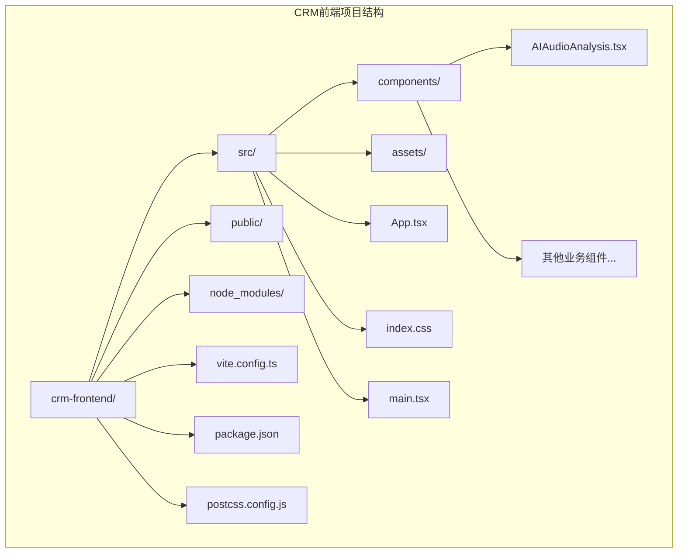

**图表来源**
- [AIAudioAnalysis.tsx:1-82](file://crm-frontend/src/components/AIAudioAnalysis.tsx#L1-L82)
- [App.tsx:1-58](file://crm-frontend/src/App.tsx#L1-L58)

**章节来源**
- [AIAudioAnalysis.tsx:1-82](file://crm-frontend/src/components/AIAudioAnalysis.tsx#L1-L82)
- [App.tsx:1-58](file://crm-frontend/src/App.tsx#L1-L58)

## 核心组件

### AnalysisItemProps 接口定义

AnalysisItemProps 是AIAudioAnalysis组件的核心数据模型接口，定义了单个音频分析结果的数据结构。

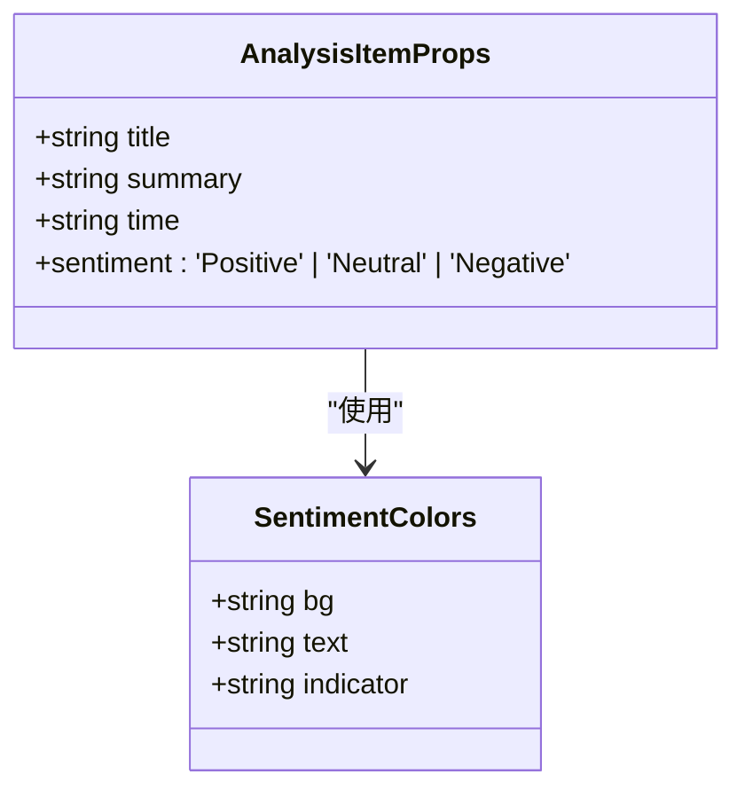

**图表来源**
- [AIAudioAnalysis.tsx:3-8](file://crm-frontend/src/components/AIAudioAnalysis.tsx#L3-L8)
- [AIAudioAnalysis.tsx:11-15](file://crm-frontend/src/components/AIAudioAnalysis.tsx#L11-L15)

#### 字段详细说明

| 字段名 | 类型 | 必填 | 描述 | 示例值 |
|--------|------|------|------|--------|
| title | string | 是 | 音频分析的标题或主题 | "Discovery Call: TechNova Corp" |
| summary | string | 是 | 分析结果的简要摘要 | "Client expressed high interest in AI integration capabilities" |
| time | string | 是 | 时间戳或相对时间描述 | "10:24 AM", "09:15 AM", "Yesterday" |
| sentiment | 'Positive' \| 'Neutral' \| 'Negative' | 是 | 情感分析结果 | 'Positive', 'Neutral', 'Negative' |

**章节来源**
- [AIAudioAnalysis.tsx:3-8](file://crm-frontend/src/components/AIAudioAnalysis.tsx#L3-L8)

### AnalysisItem 子组件

AnalysisItem 是AIAudioAnalysis的子组件，负责渲染单个分析结果条目。

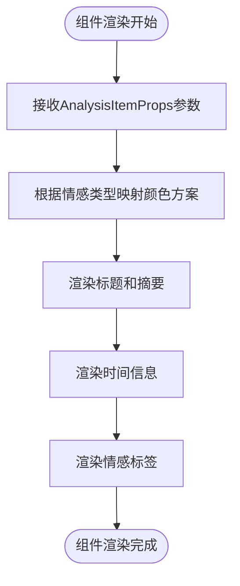

**图表来源**
- [AIAudioAnalysis.tsx:10-36](file://crm-frontend/src/components/AIAudioAnalysis.tsx#L10-L36)

**章节来源**
- [AIAudioAnalysis.tsx:10-36](file://crm-frontend/src/components/AIAudioAnalysis.tsx#L10-L36)

### 主组件 AIAudioAnalysis

主组件负责管理整个音频分析区域的布局和数据展示。

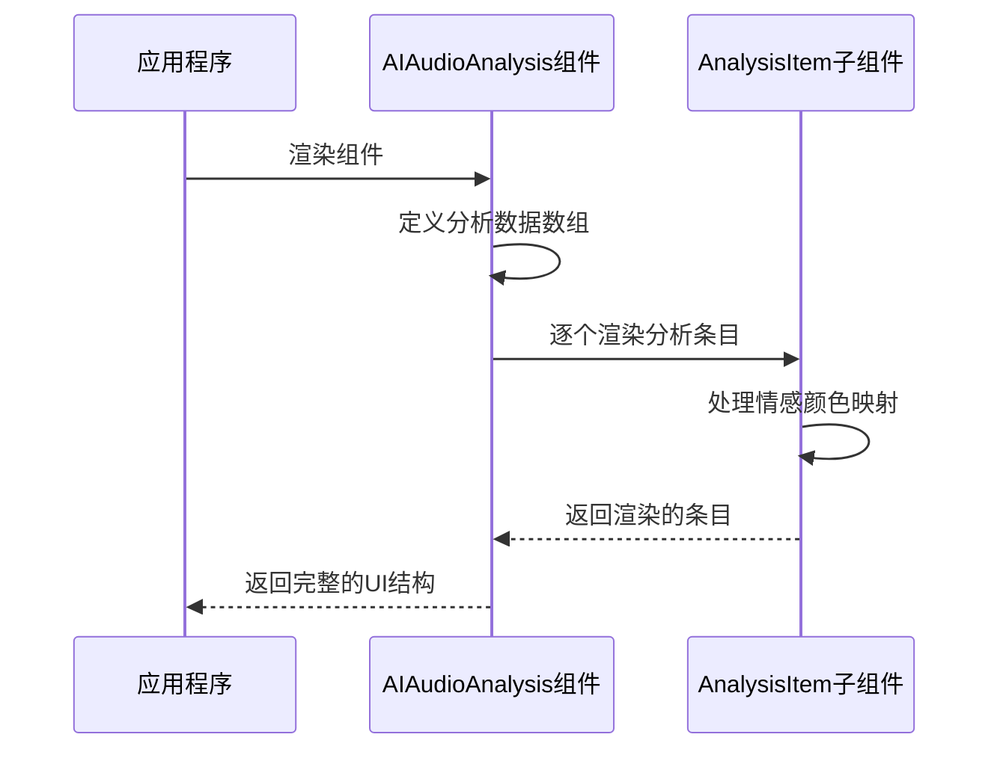

**图表来源**
- [AIAudioAnalysis.tsx:38-79](file://crm-frontend/src/components/AIAudioAnalysis.tsx#L38-L79)

**章节来源**
- [AIAudioAnalysis.tsx:38-79](file://crm-frontend/src/components/AIAudioAnalysis.tsx#L38-L79)

## 架构概览

AIAudioAnalysis 组件在整个CRM应用中的位置和作用如下：

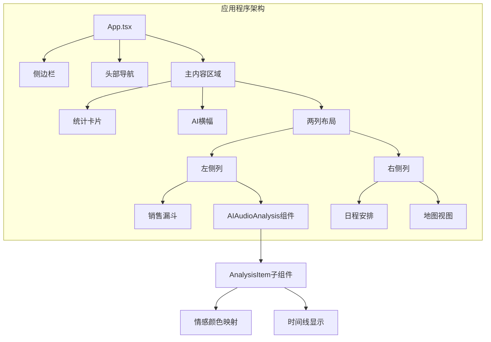

**图表来源**
- [App.tsx:10-55](file://crm-frontend/src/App.tsx#L10-L55)
- [AIAudioAnalysis.tsx:38-79](file://crm-frontend/src/components/AIAudioAnalysis.tsx#L38-L79)

**章节来源**
- [App.tsx:10-55](file://crm-frontend/src/App.tsx#L10-L55)

## 详细组件分析

### 数据模型分析

#### 音频分析数据结构

组件当前使用静态数据演示模式，但其接口设计支持动态数据源：

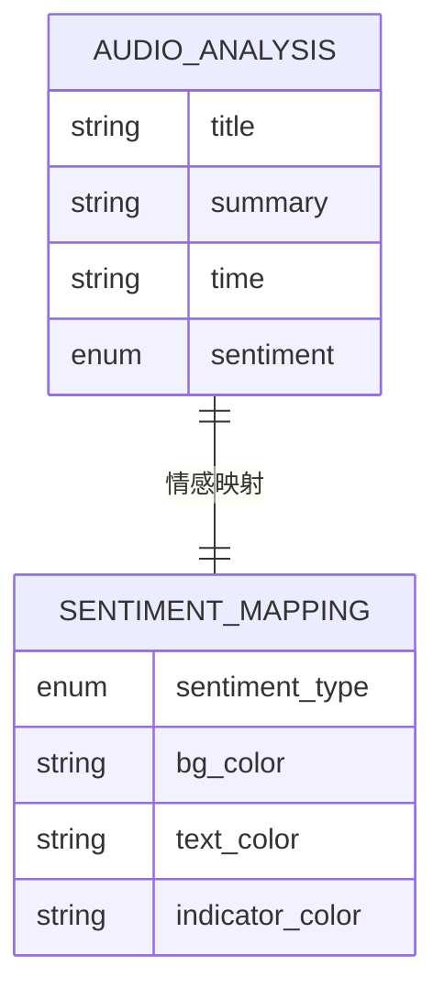

**图表来源**
- [AIAudioAnalysis.tsx:3-8](file://crm-frontend/src/components/AIAudioAnalysis.tsx#L3-L8)
- [AIAudioAnalysis.tsx:11-15](file://crm-frontend/src/components/AIAudioAnalysis.tsx#L11-L15)

#### 情感分析算法实现

组件实现了简单而有效的情感分析颜色映射机制：

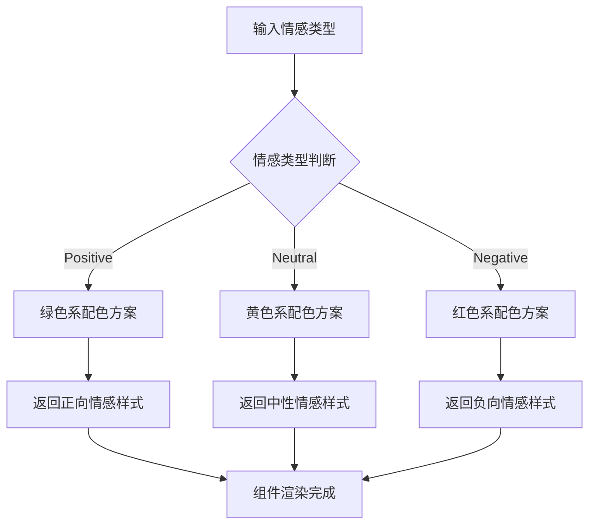

**图表来源**
- [AIAudioAnalysis.tsx:11-15](file://crm-frontend/src/components/AIAudioAnalysis.tsx#L11-L15)

**章节来源**
- [AIAudioAnalysis.tsx:11-15](file://crm-frontend/src/components/AIAudioAnalysis.tsx#L11-L15)

### UI组件设计

#### 布局结构分析

组件采用卡片式设计，每个分析条目都封装在一个圆角矩形容器中：

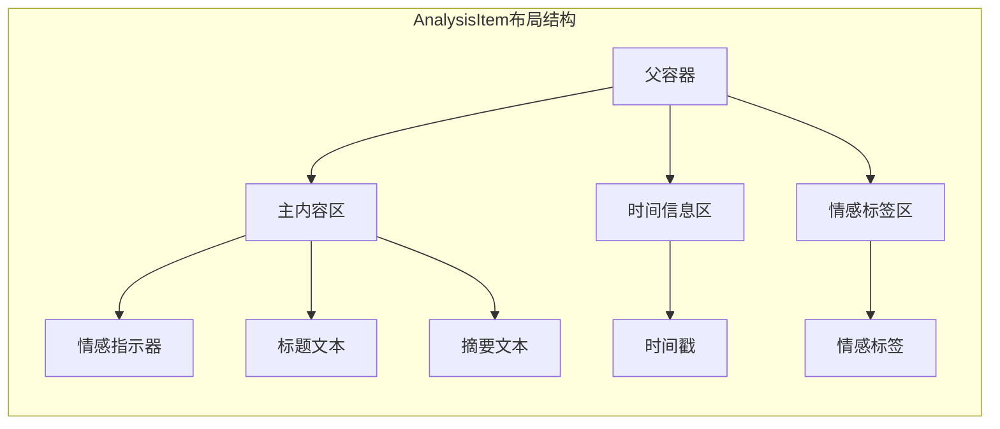

**图表来源**
- [AIAudioAnalysis.tsx:19-35](file://crm-frontend/src/components/AIAudioAnalysis.tsx#L19-L35)

#### 样式系统集成

组件充分利用Tailwind CSS的原子化设计原则：

| 样式类 | 功能用途 | 颜色方案 |
|--------|----------|----------|
| bg-gray-50 | 卡片背景色 | 浅灰色 |
| text-gray-900 | 标题文字色 | 深灰色 |
| text-gray-500 | 摘要文字色 | 中等灰色 |
| text-xs | 字体大小 | 超小号字体 |
| rounded-lg | 圆角半径 | 大圆角 |
| border border-gray-100 | 边框样式 | 浅灰色边框 |

**章节来源**
- [AIAudioAnalysis.tsx:19-35](file://crm-frontend/src/components/AIAudioAnalysis.tsx#L19-L35)

### 用户交互功能

#### 导航交互

组件提供了"查看全部"按钮，支持用户跳转到完整的分析页面：

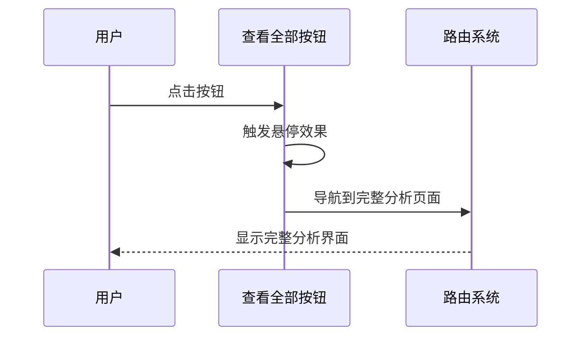

**图表来源**
- [AIAudioAnalysis.tsx:60-69](file://crm-frontend/src/components/AIAudioAnalysis.tsx#L60-L69)

**章节来源**
- [AIAudioAnalysis.tsx:60-69](file://crm-frontend/src/components/AIAudioAnalysis.tsx#L60-L69)

## 依赖关系分析

### 技术栈依赖

AIAudioAnalysis 组件的技术栈依赖关系如下：

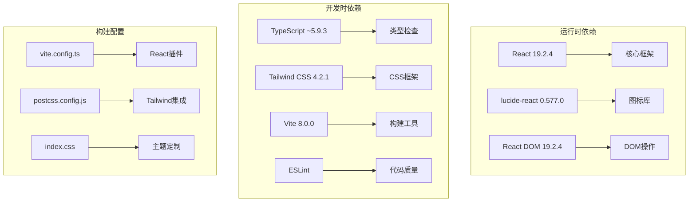

**图表来源**
- [package.json:12-34](file://crm-frontend/package.json#L12-L34)
- [vite.config.ts:1-8](file://crm-frontend/vite.config.ts#L1-L8)
- [postcss.config.js:1-6](file://crm-frontend/postcss.config.js#L1-L6)

### 组件间依赖

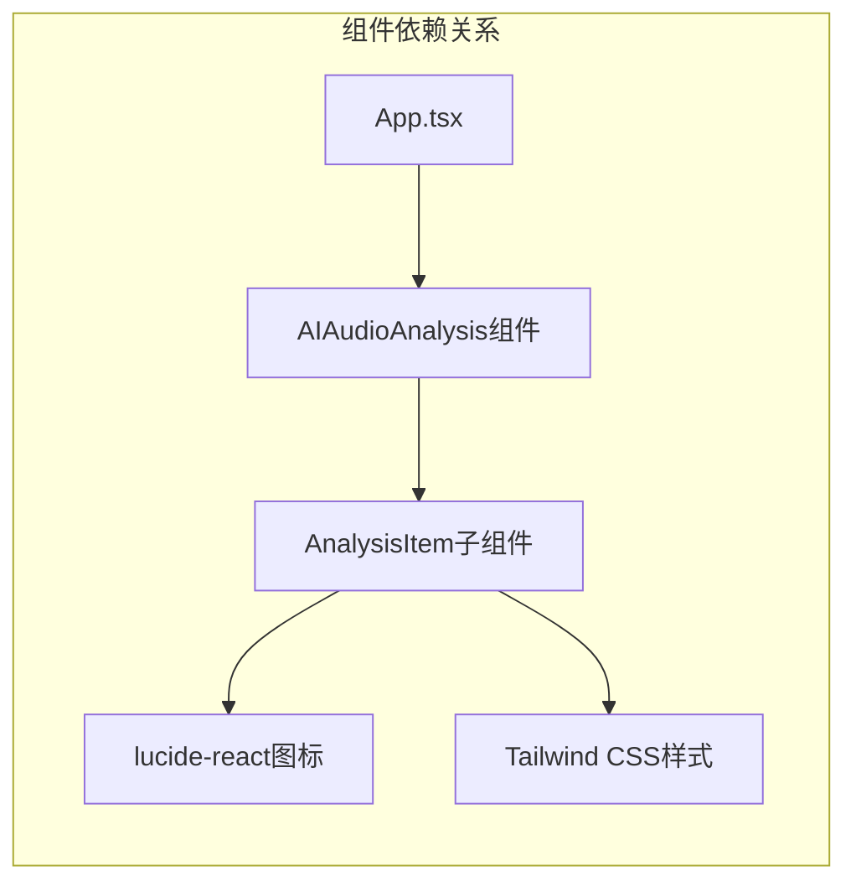

**图表来源**
- [App.tsx:6](file://crm-frontend/src/App.tsx#L6)
- [AIAudioAnalysis.tsx:1](file://crm-frontend/src/components/AIAudioAnalysis.tsx#L1)

**章节来源**
- [package.json:12-34](file://crm-frontend/package.json#L12-L34)
- [App.tsx:6](file://crm-frontend/src/App.tsx#L6)

## 性能考虑

### 渲染优化

组件采用了高效的渲染策略：

1. **无状态函数组件**：使用纯函数组件减少内存开销
2. **静态数据缓存**：分析数据在组件外部定义，避免重复计算
3. **条件渲染**：根据情感类型动态选择样式，无需额外的条件判断逻辑

### 样式优化

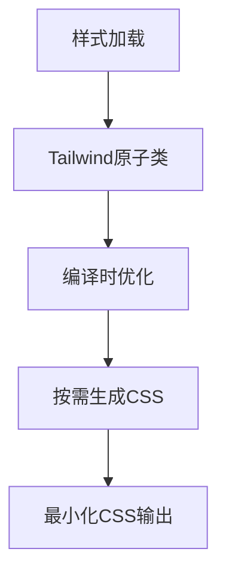

**图表来源**
- [index.css:1-66](file://crm-frontend/src/index.css#L1-L66)

### 构建优化

- **Tree Shaking**：TypeScript和ES模块系统支持按需导入
- **代码分割**：Vite支持动态导入和懒加载
- **压缩优化**：生产环境自动压缩JavaScript和CSS

## 故障排除指南

### 常见问题及解决方案

#### 图标不显示问题

**问题描述**：lucide-react图标无法正常显示

**可能原因**：
- 依赖包未正确安装
- 版本兼容性问题

**解决方案**：
1. 检查package.json中的依赖版本
2. 运行npm install重新安装依赖
3. 确认lucide-react版本与React版本兼容

#### 样式不生效问题

**问题描述**：Tailwind CSS样式未正确应用

**可能原因**：
- Tailwind配置文件缺失
- CSS文件导入顺序问题

**解决方案**：
1. 确认PostCSS配置正确
2. 检查index.css文件的导入顺序
3. 验证Tailwind指令的正确使用

#### TypeScript类型错误

**问题描述**：TypeScript编译时报错

**可能原因**：
- 类型定义不匹配
- 缺少必要的类型声明

**解决方案**：
1. 检查AnalysisItemProps接口定义
2. 确认枚举类型的正确使用
3. 验证组件属性的类型匹配

**章节来源**
- [package.json:12-34](file://crm-frontend/package.json#L12-L34)
- [index.css:1-66](file://crm-frontend/src/index.css#L1-L66)

## 结论

AIAudioAnalysis 组件是一个设计精良的React组件，具有以下特点：

1. **清晰的架构设计**：采用父子组件分离的模式，职责明确
2. **类型安全**：完整的TypeScript类型定义确保代码质量
3. **响应式设计**：基于Tailwind CSS的现代化UI设计
4. **可扩展性**：接口设计支持未来功能扩展
5. **性能优化**：采用多种优化策略提升用户体验

该组件为销售CRM系统提供了直观的AI音频分析结果展示功能，通过情感色彩编码和时间线标注帮助销售人员快速理解客户沟通的关键信息。

## 附录

### 开发环境配置

#### 依赖安装

```bash
npm install
```

#### 开发服务器启动

```bash
npm run dev
```

#### 生产构建

```bash
npm run build
```

### 组件使用示例

#### 基本使用方式

```typescript
import AIAudioAnalysis from './components/AIAudioAnalysis';

function App() {
  return (
    <div>
      <AIAudioAnalysis />
    </div>
  );
}
```

#### 自定义数据传递

虽然当前组件使用静态数据，但其接口设计支持动态数据：

```typescript
interface CustomAnalysisItemProps extends AnalysisItemProps {
  id?: string;
  metadata?: Record<string, any>;
}

const CustomAIAudioAnalysis = ({ data }: { data: CustomAnalysisItemProps[] }) => {
  return (
    <div>
      {data.map((item, index) => (
        <AnalysisItem key={item.id || index} {...item} />
      ))}
    </div>
  );
};
```

### 主题定制

组件支持通过Tailwind CSS进行主题定制：

```css
/* 在index.css中添加自定义主题变量 */
@theme {
  --color-primary-500: #your-custom-color;
}
```