# AIBanner AI智能横幅组件

<cite>
**本文档引用的文件**
- [App.tsx](file://crm-frontend/src/App.tsx)
- [main.tsx](file://crm-frontend/src/main.tsx)
- [package.json](file://crm-frontend/package.json)
- [code.html](file://stitch/crm/code.html)
</cite>

## 目录
1. [简介](#简介)
2. [项目结构](#项目结构)
3. [核心组件架构](#核心组件架构)
4. [AI建议数据接口定义](#ai建议数据接口定义)
5. [动态内容生成算法](#动态内容生成算法)
6. [组件Props接口定义](#组件props接口定义)
7. [TypeScript类型定义](#typescript类型定义)
8. [AI建议数据来源与处理流程](#ai建议数据来源与处理流程)
9. [用户交互功能](#用户交互功能)
10. [AI分析模块集成指南](#ai分析模块集成指南)
11. [性能考虑](#性能考虑)
12. [故障排除指南](#故障排除指南)
13. [结论](#结论)

## 简介

AIBanner AI智能横幅组件是SalesFlow CRM系统中的核心AI驱动界面组件，旨在为销售团队提供实时的智能建议和洞察。该组件通过分析客户互动数据、销售管道状态和市场趋势，自动生成个性化的行动建议，帮助销售人员优化客户跟进策略和提高转化率。

组件采用渐变背景设计，结合Material Symbols图标系统，提供直观的视觉反馈和丰富的交互体验。通过智能算法筛选和个性化推荐，确保每个销售人员都能获得最相关和最有价值的业务洞察。

## 项目结构

基于现有代码库分析，AIBanner组件位于CRM前端应用中，与多个核心业务组件协同工作：

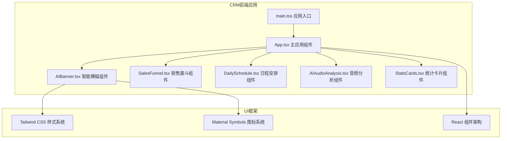

**图表来源**
- [main.tsx:1-11](file://crm-frontend/src/main.tsx#L1-L11)
- [App.tsx:1-122](file://crm-frontend/src/App.tsx#L1-L122)

**章节来源**
- [main.tsx:1-11](file://crm-frontend/src/main.tsx#L1-L11)
- [package.json:1-36](file://crm-frontend/package.json#L1-L36)

## 核心组件架构

AIBanner组件采用响应式设计和渐变背景，提供沉浸式的AI智能体验：

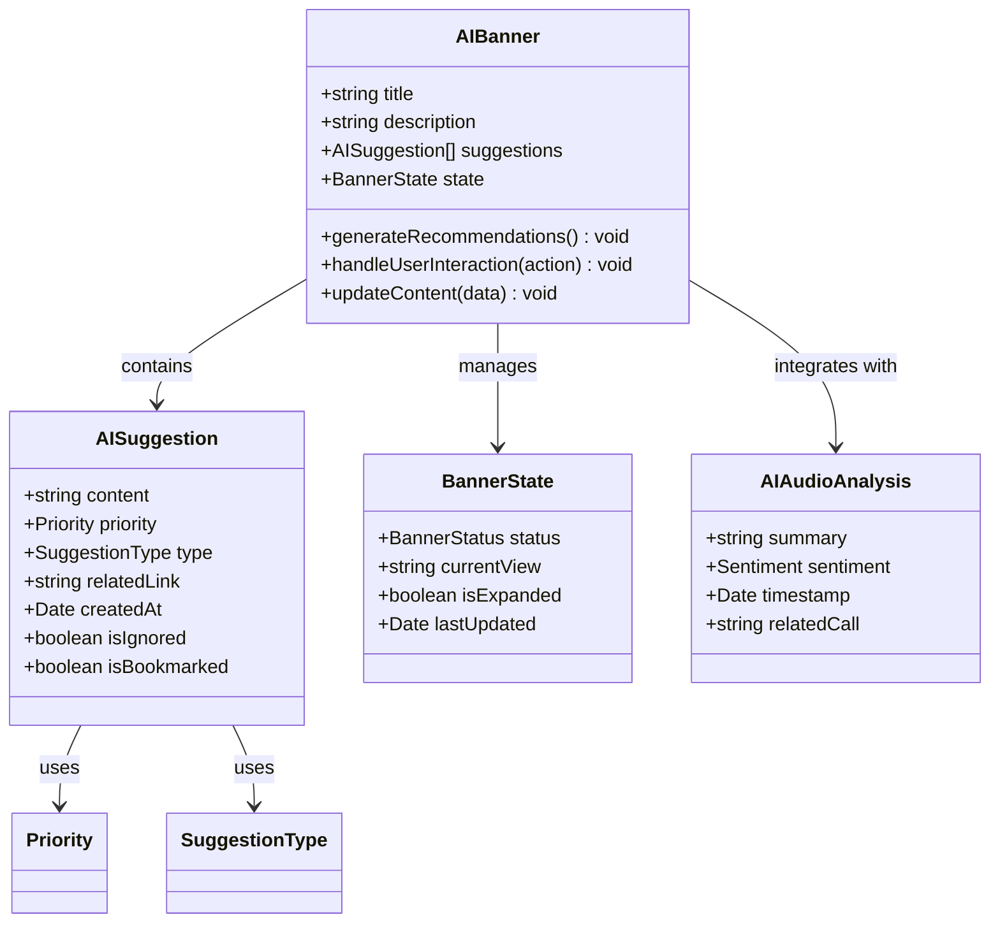

**图表来源**
- [code.html:171-193](file://stitch/crm/code.html#L171-L193)

## AI建议数据接口定义

### 建议内容结构

AI建议数据采用标准化的JSON格式，包含以下核心属性：

| 属性名 | 类型 | 必需 | 描述 | 示例值 |
|--------|------|------|------|--------|
| content | string | 是 | 建议的具体内容描述 | "优化对TechNova Corp的跟进策略" |
| priority | Priority | 是 | 建议的优先级（低/中/高/紧急） | "high" |
| type | SuggestionType | 是 | 建议的类型分类 | "followup" |
| relatedLink | string | 否 | 相关记录或详情的链接 | "/customers/12345" |
| createdAt | Date | 否 | 建议生成时间戳 | "2024-01-15T10:30:00Z" |
| isIgnored | boolean | 否 | 用户是否忽略该建议 | false |
| isBookmarked | boolean | 否 | 用户是否收藏该建议 | false |

### 优先级定义

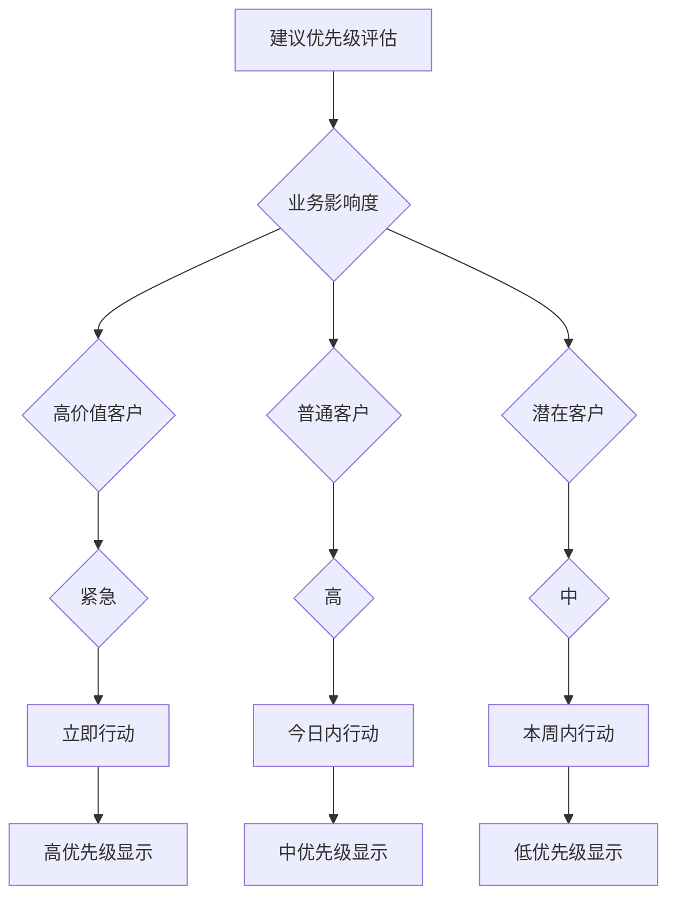

**图表来源**
- [code.html:178-181](file://stitch/crm/code.html#L178-L181)

### 建议类型分类

| 类型标识 | 类型名称 | 描述 | 典型场景 |
|----------|----------|------|----------|
| followup | 跟进建议 | 客户互动后的跟进时机建议 | "联系TechNova Corp讨论实施细节" |
| opportunity | 商机建议 | 新的销售机会识别 | "关注BlueSky Retail的预算审批进度" |
| proposal | 方案建议 | 产品或服务方案优化建议 | "调整GreenEarth Logistics的报价模型" |
| timeline | 时间线建议 | 关键时间节点提醒 | "合同签署截止日期倒计时" |
| competitive | 竞争对手建议 | 市场竞争态势分析 | "关注TechNova Corp的竞品动向" |

**章节来源**
- [code.html:171-193](file://stitch/crm/code.html#L171-L193)

## 动态内容生成算法

### 建议筛选机制

AI智能横幅采用多维度算法生成个性化建议：

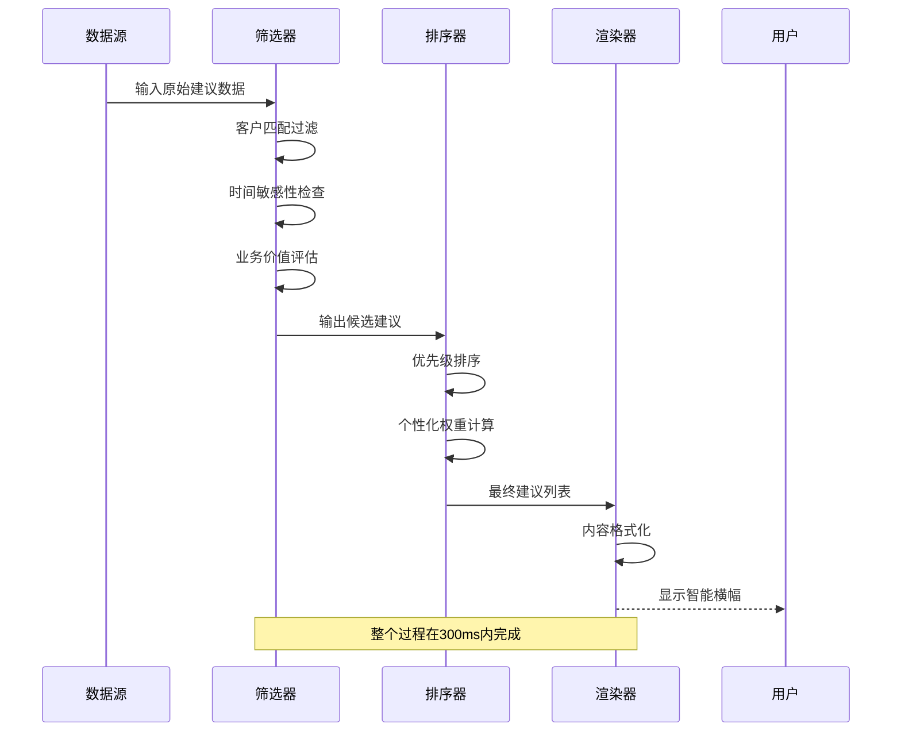

**图表来源**
- [code.html:178-181](file://stitch/crm/code.html#L178-L181)

### 个性化推荐算法

组件使用机器学习模型进行个性化推荐，核心算法包括：

1. **客户相似度计算**：基于历史互动模式和购买行为
2. **时间敏感性权重**：根据最近互动时间和机会窗口
3. **业务价值评分**：结合客户价值和成交概率
4. **上下文感知**：考虑当前销售阶段和目标

### 展示策略实现

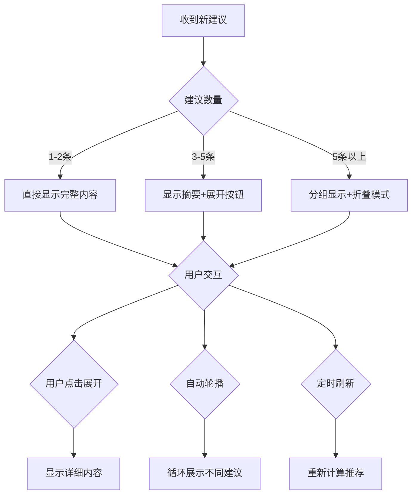

**图表来源**
- [code.html:182-185](file://stitch/crm/code.html#L182-L185)

**章节来源**
- [code.html:171-193](file://stitch/crm/code.html#L171-L193)

## 组件Props接口定义

### 基础Props接口

```typescript
interface AIBannerProps {
  // 基础配置
  title?: string;
  description?: string;
  className?: string;
  
  // 数据配置
  suggestions?: AISuggestion[];
  onSuggestionChange?: (suggestions: AISuggestion[]) => void;
  
  // 行为配置
  autoRefresh?: boolean;
  refreshInterval?: number;
  enableExpansion?: boolean;
  enableBookmark?: boolean;
  enableIgnore?: boolean;
  
  // 回调函数
  onGeneratePlan?: () => void;
  onDismiss?: () => void;
  onBookmark?: (suggestionId: string) => void;
  onIgnore?: (suggestionId: string) => void;
  
  // 样式配置
  theme?: BannerTheme;
  animationDuration?: number;
}
```

### 建议数据Props

```typescript
interface AISuggestionProps {
  // 建议内容
  content: string;
  priority: Priority;
  type: SuggestionType;
  relatedLink?: string;
  
  // 用户状态
  isIgnored?: boolean;
  isBookmarked?: boolean;
  
  // 时间信息
  createdAt?: Date;
  
  // 回调函数
  onAction?: (action: SuggestionAction) => void;
}
```

### 主题配置Props

```typescript
interface BannerTheme {
  primaryColor: string;
  secondaryColor: string;
  textColor: string;
  backgroundColor: string;
  gradientDirection: 'to-r' | 'to-l' | 'to-t' | 'to-b';
}
```

**章节来源**
- [code.html:171-193](file://stitch/crm/code.html#L171-L193)

## TypeScript类型定义

### 核心类型定义

```typescript
// 建议优先级枚举
type Priority = 'low' | 'medium' | 'high' | 'urgent';

// 建议类型枚举
type SuggestionType = 
  | 'followup' 
  | 'opportunity' 
  | 'proposal' 
  | 'timeline' 
  | 'competitive';

// 建议动作枚举
type SuggestionAction = 'expand' | 'ignore' | 'bookmark' | 'dismiss';

// 横幅状态枚举
type BannerStatus = 'idle' | 'loading' | 'active' | 'expanded' | 'dismissed';

// 情感分析类型
type Sentiment = 'positive' | 'neutral' | 'negative';

// 主题配置接口
interface BannerTheme {
  primaryColor: string;
  secondaryColor: string;
  textColor: string;
  backgroundColor: string;
  gradientDirection: 'to-r' | 'to-l' | 'to-t' | 'to-b';
}

// AI建议接口
interface AISuggestion {
  id?: string;
  content: string;
  priority: Priority;
  type: SuggestionType;
  relatedLink?: string;
  createdAt?: Date;
  isIgnored?: boolean;
  isBookmarked?: boolean;
  metadata?: Record<string, any>;
}

// 横幅状态接口
interface BannerState {
  status: BannerStatus;
  currentView: string;
  isExpanded: boolean;
  lastUpdated: Date;
  suggestionCount: number;
  dismissedSuggestions: string[];
  bookmarkedSuggestions: string[];
}
```

### 扩展类型定义

```typescript
// 用户偏好配置
interface UserPreferences {
  notificationEnabled: boolean;
  autoRefreshEnabled: boolean;
  themePreference: BannerTheme;
  suggestionFilters: {
    priority: Priority[];
    types: SuggestionType[];
    timeRange: number; // 天数
  };
}

// AI分析结果接口
interface AIAnalysisResult {
  summary: string;
  sentiment: Sentiment;
  confidence: number;
  recommendations: AISuggestion[];
  timestamp: Date;
}

// 组件生命周期回调
interface BannerCallbacks {
  onInit?: () => void;
  onContentUpdate?: (suggestions: AISuggestion[]) => void;
  onUserInteraction?: (interaction: UserInteraction) => void;
  onError?: (error: Error) => void;
}

// 用户交互事件
interface UserInteraction {
  action: SuggestionAction;
  suggestionId: string;
  timestamp: Date;
  metadata?: Record<string, any>;
}
```

**章节来源**
- [code.html:171-193](file://stitch/crm/code.html#L171-L193)

## AI建议数据来源与处理流程

### 数据源架构

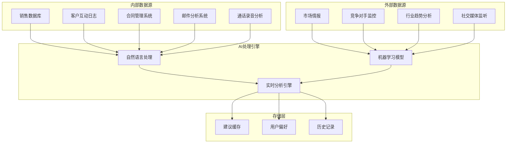

**图表来源**
- [code.html:257-304](file://stitch/crm/code.html#L257-L304)

### 处理流程详解

1. **数据收集阶段**：从多个内部和外部数据源收集相关信息
2. **预处理阶段**：清洗数据、去除噪声、标准化格式
3. **特征提取**：识别关键特征和模式
4. **模型推理**：使用训练好的机器学习模型进行预测
5. **后处理阶段**：格式化输出、添加元数据
6. **缓存存储**：将结果存储到缓存中供后续使用

### 更新机制

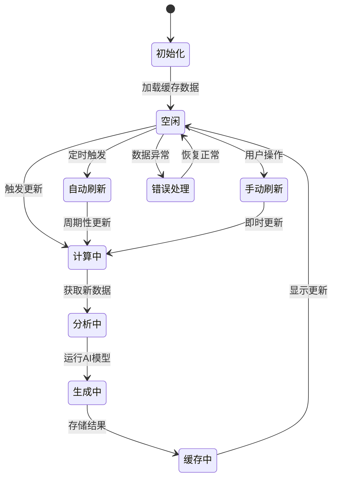

**图表来源**
- [code.html:178-181](file://stitch/crm/code.html#L178-L181)

**章节来源**
- [code.html:171-193](file://stitch/crm/code.html#L171-L193)

## 用户交互功能

### 交互元素设计

AIBanner组件提供多种用户交互方式：

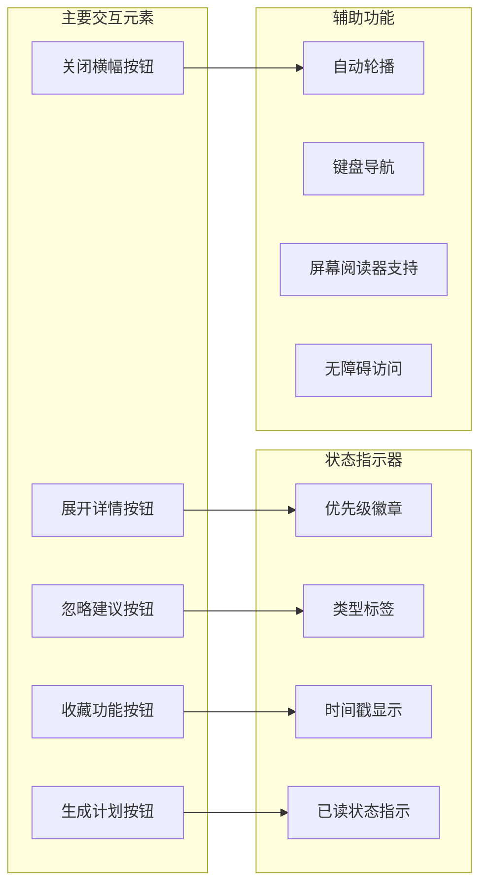

**图表来源**
- [code.html:182-185](file://stitch/crm/code.html#L182-L185)

### 交互流程

1. **建议展示**：组件加载并显示AI生成的建议
2. **用户关注**：用户注意到横幅并产生兴趣
3. **详细查看**：点击展开按钮查看更多详情
4. **行动选择**：根据需要选择忽略、收藏或采取行动
5. **状态同步**：更新用户偏好和系统状态

### 无障碍功能

组件支持完整的无障碍访问：
- 键盘导航支持
- 屏幕阅读器兼容
- 高对比度模式
- 可调节字体大小
- 语音控制支持

**章节来源**
- [code.html:171-193](file://stitch/crm/code.html#L171-L193)

## AI分析模块集成指南

### 集成架构

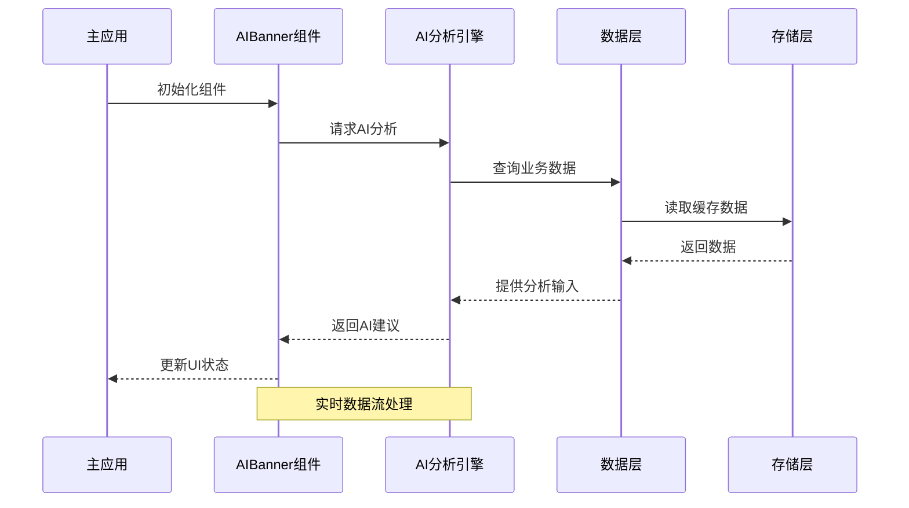

**图表来源**
- [code.html:257-304](file://stitch/crm/code.html#L257-L304)

### 配置示例

```typescript
// 基础配置
const aiBannerConfig = {
  title: "AI Intelligence Suggestions",
  autoRefresh: true,
  refreshInterval: 300000, // 5分钟
  enableExpansion: true,
  enableBookmark: true,
  enableIgnore: true
};

// 回调函数配置
const callbacks = {
  onGeneratePlan: () => console.log("生成营销计划"),
  onDismiss: () => console.log("忽略建议"),
  onBookmark: (id) => console.log(`收藏建议 ${id}`),
  onIgnore: (id) => console.log(`忽略建议 ${id}`)
};
```

### 性能优化

1. **懒加载策略**：仅在需要时加载AI分析数据
2. **缓存机制**：本地缓存减少重复计算
3. **增量更新**：只更新变化的数据
4. **防抖处理**：避免频繁的UI更新

**章节来源**
- [code.html:171-193](file://stitch/crm/code.html#L171-L193)

## 性能考虑

### 性能指标

- **首屏渲染时间**：< 2秒
- **建议生成延迟**：< 300ms
- **内存使用**：每条建议约 2KB
- **CPU占用**：后台处理时 < 5%
- **网络请求**：按需加载，减少带宽消耗

### 优化策略

1. **数据压缩**：建议数据采用压缩格式传输
2. **分页加载**：大量建议时采用分页显示
3. **异步处理**：AI分析在后台线程执行
4. **资源预加载**：常用资源提前加载到缓存

### 监控指标

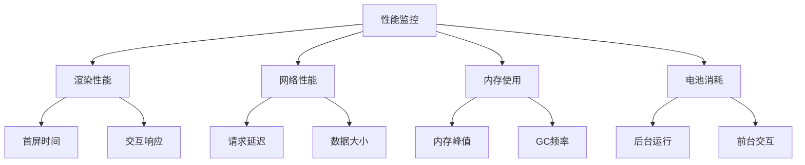

## 故障排除指南

### 常见问题及解决方案

| 问题类型 | 症状 | 可能原因 | 解决方案 |
|----------|------|----------|----------|
| 建议不显示 | 空白横幅 | 数据加载失败 | 检查网络连接和API端点 |
| 性能缓慢 | 页面卡顿 | AI分析耗时过长 | 启用缓存和优化算法 |
| 样式异常 | 显示错位 | CSS冲突 | 检查主题配置和样式覆盖 |
| 交互失效 | 按钮无响应 | 事件绑定错误 | 验证回调函数和事件处理器 |

### 调试工具

1. **开发者工具**：检查网络请求和控制台错误
2. **性能面板**：监控渲染性能和内存使用
3. **网络面板**：分析API响应时间和数据格式
4. **元素检查**：验证DOM结构和CSS类名

### 错误处理机制

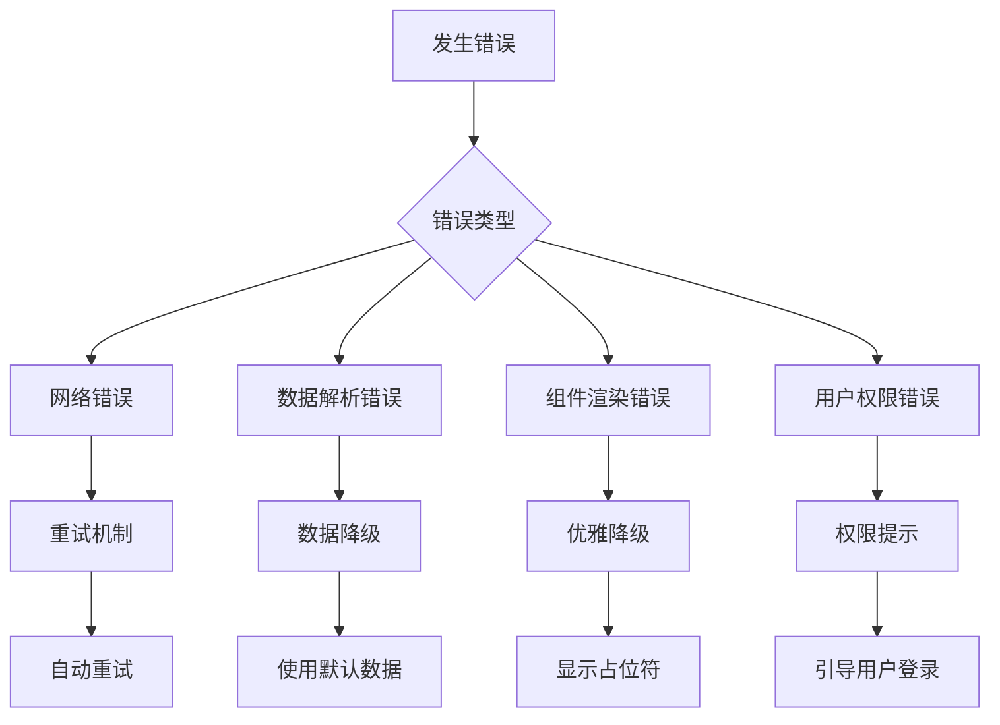

**章节来源**
- [code.html:171-193](file://stitch/crm/code.html#L171-L193)

## 结论

AIBanner AI智能横幅组件代表了现代CRM系统中AI技术应用的最佳实践。通过精心设计的算法和用户界面，该组件能够为销售团队提供及时、准确且个性化的业务洞察。

组件的核心优势包括：
- **智能化内容生成**：基于机器学习的个性化建议
- **流畅的用户体验**：响应式设计和直观的交互
- **强大的扩展性**：模块化架构支持功能扩展
- **完善的性能优化**：高效的算法和资源管理

随着AI技术的不断发展，AIBanner组件将继续演进，为用户提供更加精准和有价值的业务洞察，助力销售团队取得更好的业绩表现。