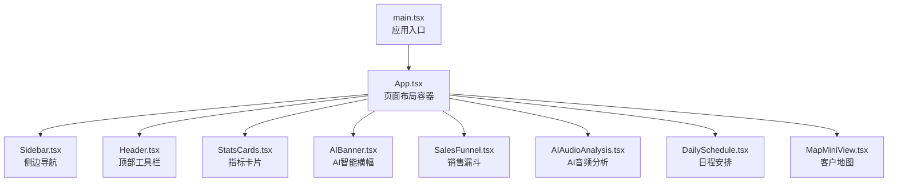
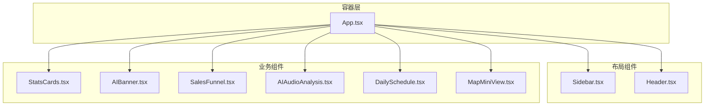
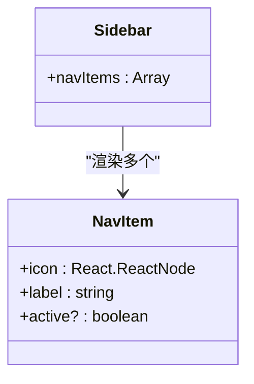
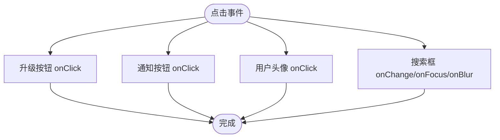
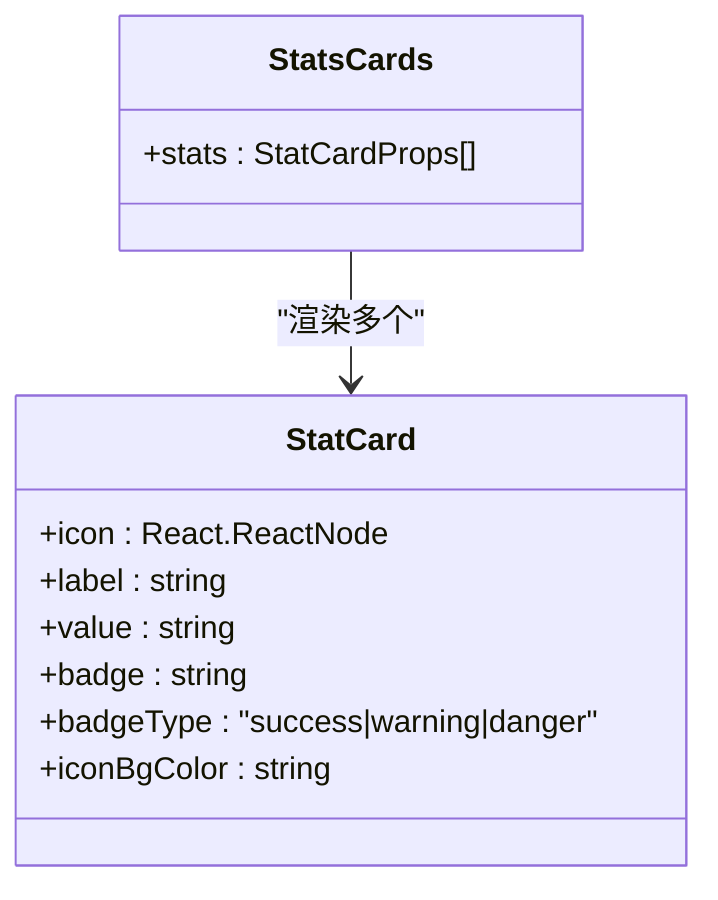
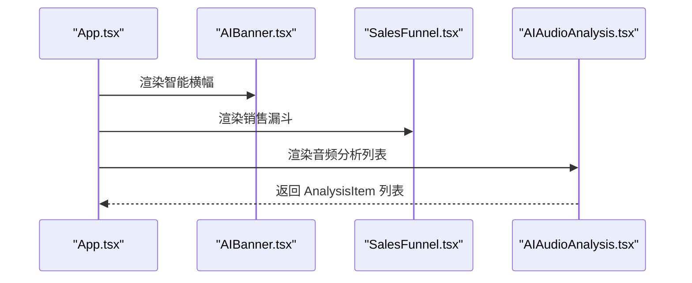
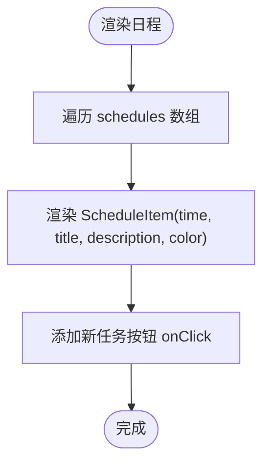
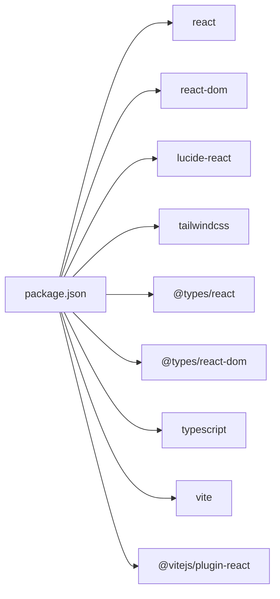

# API参考

<cite>
**本文引用的文件**
- [AIAudioAnalysis.tsx](file://crm-frontend/src/components/AIAudioAnalysis.tsx)
- [AIBanner.tsx](file://crm-frontend/src/components/AIBanner.tsx)
- [DailySchedule.tsx](file://crm-frontend/src/components/DailySchedule.tsx)
- [Header.tsx](file://crm-frontend/src/components/Header.tsx)
- [MapMiniView.tsx](file://crm-frontend/src/components/MapMiniView.tsx)
- [SalesFunnel.tsx](file://crm-frontend/src/components/SalesFunnel.tsx)
- [Sidebar.tsx](file://crm-frontend/src/components/Sidebar.tsx)
- [StatsCards.tsx](file://crm-frontend/src/components/StatsCards.tsx)
- [App.tsx](file://crm-frontend/src/App.tsx)
- [main.tsx](file://crm-frontend/src/main.tsx)
- [package.json](file://crm-frontend/package.json)
- [tsconfig.app.json](file://crm-frontend/tsconfig.app.json)
- [vite.config.ts](file://crm-frontend/vite.config.ts)
</cite>

## 目录
1. [简介](#简介)
2. [项目结构](#项目结构)
3. [核心组件](#核心组件)
4. [架构总览](#架构总览)
5. [详细组件分析](#详细组件分析)
6. [依赖关系分析](#依赖关系分析)
7. [性能考虑](#性能考虑)
8. [故障排查指南](#故障排查指南)
9. [结论](#结论)
10. [附录](#附录)

## 简介
本文件为销售AI CRM系统的前端组件API参考文档，覆盖工作台布局与业务组件的接口定义、属性说明、方法签名、事件处理机制、Props类型、生命周期与状态管理建议、组件间通信协议与数据传递格式，并提供实际使用场景与错误处理建议。所有内容均基于仓库中现有源码进行归纳与总结。

## 项目结构
该前端采用React + TypeScript + Vite构建，TailwindCSS用于样式，组件位于src/components目录下，入口在src/main.tsx中挂载App根组件。

图表来源
- [main.tsx:1-11](file://crm-frontend/src/main.tsx#L1-L11)
- [App.tsx:1-58](file://crm-frontend/src/App.tsx#L1-L58)
- [Sidebar.tsx:1-86](file://crm-frontend/src/components/Sidebar.tsx#L1-L86)
- [Header.tsx:1-53](file://crm-frontend/src/components/Header.tsx#L1-L53)
- [StatsCards.tsx:1-81](file://crm-frontend/src/components/StatsCards.tsx#L1-L81)
- [AIBanner.tsx:1-47](file://crm-frontend/src/components/AIBanner.tsx#L1-L47)
- [SalesFunnel.tsx:1-66](file://crm-frontend/src/components/SalesFunnel.tsx#L1-L66)
- [AIAudioAnalysis.tsx:1-82](file://crm-frontend/src/components/AIAudioAnalysis.tsx#L1-L82)
- [DailySchedule.tsx:1-70](file://crm-frontend/src/components/DailySchedule.tsx#L1-L70)
- [MapMiniView.tsx:1-58](file://crm-frontend/src/components/MapMiniView.tsx#L1-L58)

章节来源
- [main.tsx:1-11](file://crm-frontend/src/main.tsx#L1-L11)
- [App.tsx:1-58](file://crm-frontend/src/App.tsx#L1-L58)
- [package.json:1-36](file://crm-frontend/package.json#L1-L36)
- [tsconfig.app.json:1-29](file://crm-frontend/tsconfig.app.json#L1-L29)
- [vite.config.ts:1-8](file://crm-frontend/vite.config.ts#L1-L8)

## 核心组件
本节对各组件的Props接口、方法签名、事件处理、状态管理与数据流进行说明。

- 组件命名与职责
  - Sidebar：左侧导航菜单，支持图标与标签展示，当前激活项高亮。
  - Header：顶部搜索、通知与用户信息区域。
  - StatsCards：四个指标卡片，展示关键业务指标与趋势。
  - AIBanner：AI智能建议横幅，包含操作按钮。
  - SalesFunnel：销售漏斗阶段可视化，含百分比与进度条。
  - AIAudioAnalysis：AI音频分析结果列表，按情绪分类展示。
  - DailySchedule：当日日程时间轴，支持添加任务。
  - MapMiniView：客户位置小地图占位，显示标记点与跳转按钮。

- Props接口与类型
  - Sidebar.NavItemProps
    - 属性
      - icon: React.ReactNode
      - label: string
      - active?: boolean（默认false）
    - 事件
      - 点击切换导航项（组件内部通过按钮元素实现交互）
    - 使用示例
      - 参考路径：[Sidebar.tsx:37-82](file://crm-frontend/src/components/Sidebar.tsx#L37-L82)
  - Header
    - 属性：无（内部包含输入框、按钮等交互元素）
    - 事件
      - 搜索框：onFocus/onBlur/onChange（示例中未绑定具体回调，可按需扩展）
      - 升级按钮：onClick
      - 通知按钮：onClick
      - 用户头像下拉：onClick（示例中未绑定回调）
    - 使用示例
      - 参考路径：[Header.tsx:3-53](file://crm-frontend/src/components/Header.tsx#L3-L53)
  - StatsCards.StatCardProps
    - 属性
      - icon: React.ReactNode
      - label: string
      - value: string
      - badge: string
      - badgeType: 'success' | 'warning' | 'danger'
      - iconBgColor: string
    - 使用示例
      - 参考路径：[StatsCards.tsx:35-81](file://crm-frontend/src/components/StatsCards.tsx#L35-L81)
  - SalesFunnel.FunnelStageProps
    - 属性
      - label: string
      - percentage: number
      - color: string
    - 使用示例
      - 参考路径：[SalesFunnel.tsx:29-66](file://crm-frontend/src/components/SalesFunnel.tsx#L29-L66)
  - AIAudioAnalysis.AnalysisItemProps
    - 属性
      - title: string
      - summary: string
      - time: string
      - sentiment: 'Positive' | 'Neutral' | 'Negative'
    - 使用示例
      - 参考路径：[AIAudioAnalysis.tsx:38-82](file://crm-frontend/src/components/AIAudioAnalysis.tsx#L38-L82)
  - DailySchedule.ScheduleItemProps
    - 属性
      - time: string
      - title: string
      - description: string
      - color: string
    - 使用示例
      - 参考路径：[DailySchedule.tsx:26-70](file://crm-frontend/src/components/DailySchedule.tsx#L26-L70)
  - MapMiniView
    - 属性：无（内部包含SVG网格与定位标记）
    - 事件
      - 全图查看按钮：onClick
    - 使用示例
      - 参考路径：[MapMiniView.tsx:3-58](file://crm-frontend/src/components/MapMiniView.tsx#L3-L58)
  - AIBanner
    - 属性：无（内部包含标题、描述与两个按钮）
    - 事件
      - 生成推广计划：onClick
      - 关闭：onClick
    - 使用示例
      - 参考路径：[AIBanner.tsx:3-47](file://crm-frontend/src/components/AIBanner.tsx#L3-L47)

- 方法签名与返回值
  - 所有组件均为函数式组件，不包含类方法或生命周期钩子；返回JSX元素。
  - 若需扩展交互，可在组件内声明箭头函数或使用React Hooks（如useState/useEffect）以实现状态与副作用。

- 事件处理机制
  - 多数组件通过<button>元素触发onClick事件，部分包含图标渲染（lucide-react）。
  - 示例中未绑定具体回调函数，建议在上层容器或自定义Hook中实现业务逻辑。

- 状态管理接口
  - 当前组件未使用外部状态库（如Redux/Zustand），状态多为本地UI状态。
  - 建议在App层级或自定义Hook中集中管理全局状态，组件间通过props与回调传递数据。

- 组件间通信协议与数据传递格式
  - 父子通信：App作为容器，向子组件传递静态数据（数组/对象）。
  - 子到父：当前未实现回调上行，建议通过回调函数或Context模式传递事件。
  - 数据格式：字符串、数字、颜色类名、React节点等。

章节来源
- [Sidebar.tsx:16-35](file://crm-frontend/src/components/Sidebar.tsx#L16-L35)
- [Header.tsx:3-53](file://crm-frontend/src/components/Header.tsx#L3-L53)
- [StatsCards.tsx:3-33](file://crm-frontend/src/components/StatsCards.tsx#L3-L33)
- [SalesFunnel.tsx:3-27](file://crm-frontend/src/components/SalesFunnel.tsx#L3-L27)
- [AIAudioAnalysis.tsx:3-8](file://crm-frontend/src/components/AIAudioAnalysis.tsx#L3-L8)
- [DailySchedule.tsx:3-24](file://crm-frontend/src/components/DailySchedule.tsx#L3-L24)
- [MapMiniView.tsx:3-58](file://crm-frontend/src/components/MapMiniView.tsx#L3-L58)
- [AIBanner.tsx:3-47](file://crm-frontend/src/components/AIBanner.tsx#L3-L47)

## 架构总览
整体采用“容器组件 + 展示组件”的分层设计：App负责布局与数据聚合，各功能组件负责独立视图与交互。

图表来源
- [App.tsx:10-55](file://crm-frontend/src/App.tsx#L10-L55)
- [Sidebar.tsx:37-82](file://crm-frontend/src/components/Sidebar.tsx#L37-L82)
- [Header.tsx:3-53](file://crm-frontend/src/components/Header.tsx#L3-L53)
- [StatsCards.tsx:35-81](file://crm-frontend/src/components/StatsCards.tsx#L35-L81)
- [AIBanner.tsx:3-47](file://crm-frontend/src/components/AIBanner.tsx#L3-L47)
- [SalesFunnel.tsx:29-66](file://crm-frontend/src/components/SalesFunnel.tsx#L29-L66)
- [AIAudioAnalysis.tsx:38-82](file://crm-frontend/src/components/AIAudioAnalysis.tsx#L38-L82)
- [DailySchedule.tsx:26-70](file://crm-frontend/src/components/DailySchedule.tsx#L26-L70)
- [MapMiniView.tsx:3-58](file://crm-frontend/src/components/MapMiniView.tsx#L3-L58)

## 详细组件分析

### Sidebar 导航组件
- 接口定义
  - NavItemProps
    - icon: React.ReactNode
    - label: string
    - active?: boolean（默认false）
- 方法与事件
  - 内部通过button元素实现点击态切换，active控制高亮样式
- 使用示例
  - 参考路径：[Sidebar.tsx:37-82](file://crm-frontend/src/components/Sidebar.tsx#L37-L82)
- 生命周期与状态
  - 无内部状态，仅根据传入active控制UI
- 错误处理
  - 未见显式错误处理，建议在路由切换时校验active合法性

图表来源
- [Sidebar.tsx:16-35](file://crm-frontend/src/components/Sidebar.tsx#L16-L35)
- [Sidebar.tsx:37-82](file://crm-frontend/src/components/Sidebar.tsx#L37-L82)

章节来源
- [Sidebar.tsx:16-35](file://crm-frontend/src/components/Sidebar.tsx#L16-L35)
- [Sidebar.tsx:37-82](file://crm-frontend/src/components/Sidebar.tsx#L37-L82)

### Header 顶部工具栏
- 接口定义
  - 无Props
- 事件
  - 升级按钮：onClick
  - 通知按钮：onClick
  - 用户头像下拉：onClick
  - 搜索框：示例中未绑定回调，可扩展onFocus/onBlur/onChange
- 使用示例
  - 参考路径：[Header.tsx:3-53](file://crm-frontend/src/components/Header.tsx#L3-L53)
- 生命周期与状态
  - 无内部状态
- 错误处理
  - 未见显式错误处理，建议在搜索与通知点击时增加空值检查

图表来源
- [Header.tsx:3-53](file://crm-frontend/src/components/Header.tsx#L3-L53)

章节来源
- [Header.tsx:3-53](file://crm-frontend/src/components/Header.tsx#L3-L53)

### StatsCards 指标卡片
- 接口定义
  - StatCardProps
    - icon: React.ReactNode
    - label: string
    - value: string
    - badge: string
    - badgeType: 'success' | 'warning' | 'danger'
    - iconBgColor: string
- 使用示例
  - 参考路径：[StatsCards.tsx:35-81](file://crm-frontend/src/components/StatsCards.tsx#L35-L81)
- 生命周期与状态
  - 无内部状态
- 错误处理
  - 未见显式错误处理，建议在badgeType枚举外时降级为默认类型

图表来源
- [StatsCards.tsx:3-33](file://crm-frontend/src/components/StatsCards.tsx#L3-L33)
- [StatsCards.tsx:35-81](file://crm-frontend/src/components/StatsCards.tsx#L35-L81)

章节来源
- [StatsCards.tsx:3-33](file://crm-frontend/src/components/StatsCards.tsx#L3-L33)
- [StatsCards.tsx:35-81](file://crm-frontend/src/components/StatsCards.tsx#L35-L81)

### SalesFunnel 销售漏斗
- 接口定义
  - FunnelStageProps
    - label: string
    - percentage: number
    - color: string
- 使用示例
  - 参考路径：[SalesFunnel.tsx:29-66](file://crm-frontend/src/components/SalesFunnel.tsx#L29-L66)
- 生命周期与状态
  - 无内部状态
- 错误处理
  - 未见显式错误处理，建议在percentage越界时限制范围

图表来源
- [SalesFunnel.tsx:29-66](file://crm-frontend/src/components/SalesFunnel.tsx#L29-L66)

章节来源
- [SalesFunnel.tsx:3-27](file://crm-frontend/src/components/SalesFunnel.tsx#L3-L27)
- [SalesFunnel.tsx:29-66](file://crm-frontend/src/components/SalesFunnel.tsx#L29-L66)

### AIAudioAnalysis AI音频分析
- 接口定义
  - AnalysisItemProps
    - title: string
    - summary: string
    - time: string
    - sentiment: 'Positive' | 'Neutral' | 'Negative'
- 使用示例
  - 参考路径：[AIAudioAnalysis.tsx:38-82](file://crm-frontend/src/components/AIAudioAnalysis.tsx#L38-L82)
- 生命周期与状态
  - 无内部状态
- 错误处理
  - 未见显式错误处理，建议在sentiment枚举外时降级为Neutral

图表来源
- [App.tsx:27-39](file://crm-frontend/src/App.tsx#L27-L39)
- [AIAudioAnalysis.tsx:38-82](file://crm-frontend/src/components/AIAudioAnalysis.tsx#L38-L82)

章节来源
- [AIAudioAnalysis.tsx:3-8](file://crm-frontend/src/components/AIAudioAnalysis.tsx#L3-L8)
- [AIAudioAnalysis.tsx:38-82](file://crm-frontend/src/components/AIAudioAnalysis.tsx#L38-L82)

### DailySchedule 日程安排
- 接口定义
  - ScheduleItemProps
    - time: string
    - title: string
    - description: string
    - color: string
- 使用示例
  - 参考路径：[DailySchedule.tsx:26-70](file://crm-frontend/src/components/DailySchedule.tsx#L26-L70)
- 生命周期与状态
  - 无内部状态
- 错误处理
  - 未见显式错误处理，建议在color类名校验时做兜底

图表来源
- [DailySchedule.tsx:26-70](file://crm-frontend/src/components/DailySchedule.tsx#L26-L70)

章节来源
- [DailySchedule.tsx:3-24](file://crm-frontend/src/components/DailySchedule.tsx#L3-L24)
- [DailySchedule.tsx:26-70](file://crm-frontend/src/components/DailySchedule.tsx#L26-L70)

### MapMiniView 客户地图
- 接口定义
  - 无Props
- 事件
  - 全图查看：onClick
- 使用示例
  - 参考路径：[MapMiniView.tsx:3-58](file://crm-frontend/src/components/MapMiniView.tsx#L3-L58)
- 生命周期与状态
  - 无内部状态
- 错误处理
  - 未见显式错误处理，建议在地图数据为空时显示占位提示

图表来源
- [App.tsx:42-48](file://crm-frontend/src/App.tsx#L42-L48)
- [MapMiniView.tsx:3-58](file://crm-frontend/src/components/MapMiniView.tsx#L3-L58)

章节来源
- [MapMiniView.tsx:3-58](file://crm-frontend/src/components/MapMiniView.tsx#L3-L58)

### AIBanner AI智能横幅
- 接口定义
  - 无Props
- 事件
  - 生成推广计划：onClick
  - 关闭：onClick
- 使用示例
  - 参考路径：[AIBanner.tsx:3-47](file://crm-frontend/src/components/AIBanner.tsx#L3-L47)
- 生命周期与状态
  - 无内部状态
- 错误处理
  - 未见显式错误处理，建议在网络请求失败时显示重试按钮

章节来源
- [AIBanner.tsx:3-47](file://crm-frontend/src/components/AIBanner.tsx#L3-L47)

## 依赖关系分析
- 运行时依赖
  - react、react-dom：框架基础
  - lucide-react：图标库
  - tailwindcss：样式工具
- 开发时依赖
  - @types/react、@types/react-dom：类型定义
  - typescript、vite、@vitejs/plugin-react：构建与类型检查
- 配置要点
  - tsconfig.app.json启用严格模式与JSX转换
  - vite.config.ts启用React插件

图表来源
- [package.json:12-34](file://crm-frontend/package.json#L12-L34)

章节来源
- [package.json:12-34](file://crm-frontend/package.json#L12-L34)
- [tsconfig.app.json:2-26](file://crm-frontend/tsconfig.app.json#L2-L26)
- [vite.config.ts:1-8](file://crm-frontend/vite.config.ts#L1-L8)

## 性能考虑
- 组件渲染
  - 所有组件为纯函数组件，避免不必要的重渲染；可通过React.memo包装展示型组件。
- 列表渲染
  - 使用稳定的key（如索引）可能导致列表重排问题，建议改为唯一ID。
- 图标与样式
  - lucide-react按需引入，减少打包体积；TailwindCSS建议在生产环境开启purge。
- 状态提升
  - 将高频更新的状态提升至App或Context，避免多处重复计算。

## 故障排查指南
- 控制台报错
  - Props类型不匹配：检查枚举值（如sentiment/badgeType）是否超出定义范围。
  - 事件未绑定：确认onClick回调是否在上层容器实现。
- 样式异常
  - Tailwind类名拼写错误或冲突，检查颜色类名与背景色映射。
- 数据为空
  - 列表数据为空时，建议提供空状态占位组件，避免空白渲染。
- 性能问题
  - 列表过长时启用虚拟滚动或分页；避免在渲染函数中执行耗时计算。

## 结论
本CRM前端组件库采用清晰的分层设计，组件职责明确、接口简洁。建议后续增强：
- 在App层集中管理状态与事件回调，完善父子通信协议
- 引入类型安全的事件回调与错误边界
- 对列表渲染优化key与虚拟化策略
- 补充单元测试与集成测试用例

## 附录
- 快速开始
  - 启动开发服务器：npm run dev
  - 构建生产包：npm run build
- 类型定义
  - 严格模式已启用，建议在新增组件时补充完整Props类型
- 构建配置
  - Vite + React + TypeScript组合，适合快速迭代与热更新