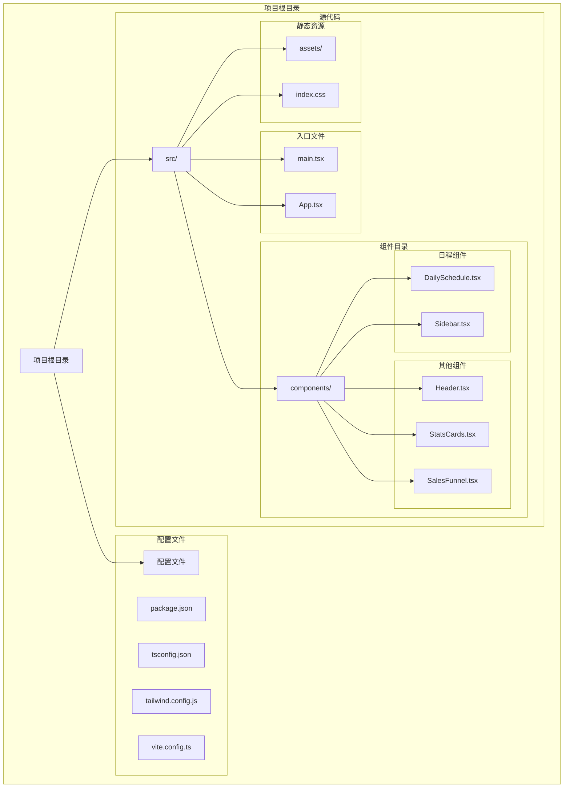
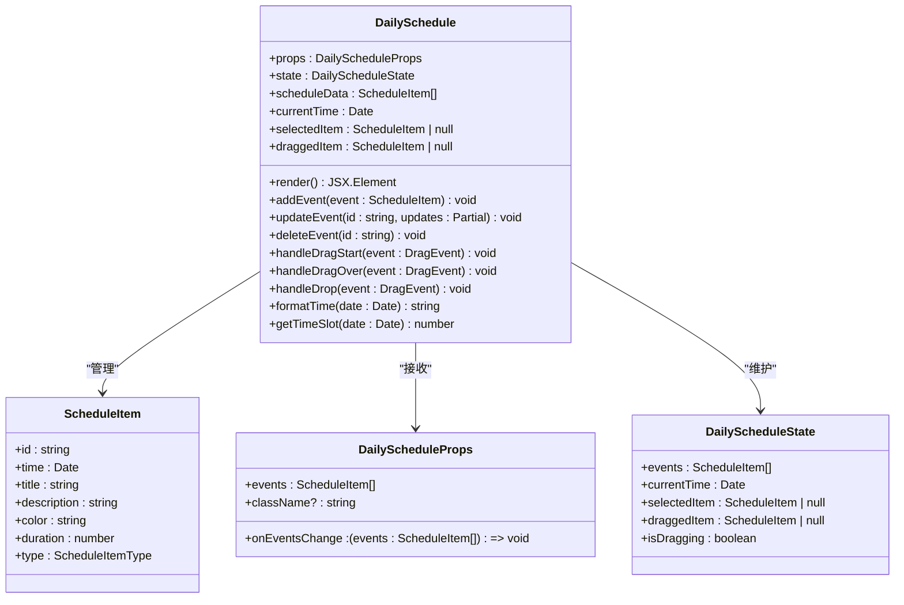
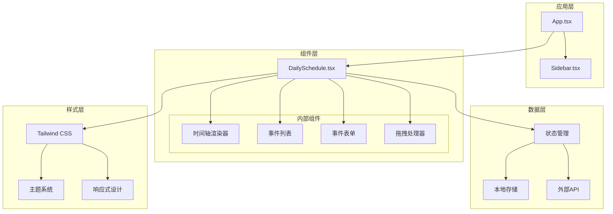
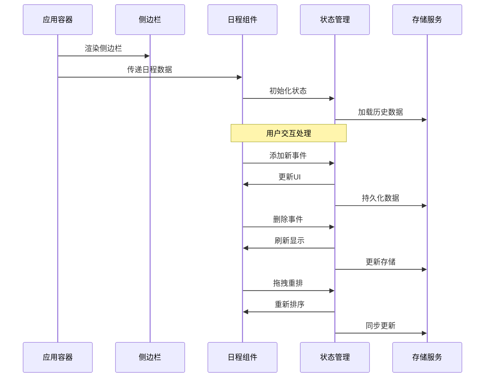
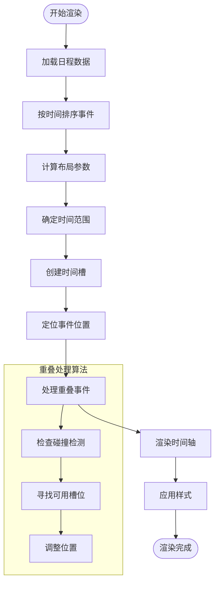
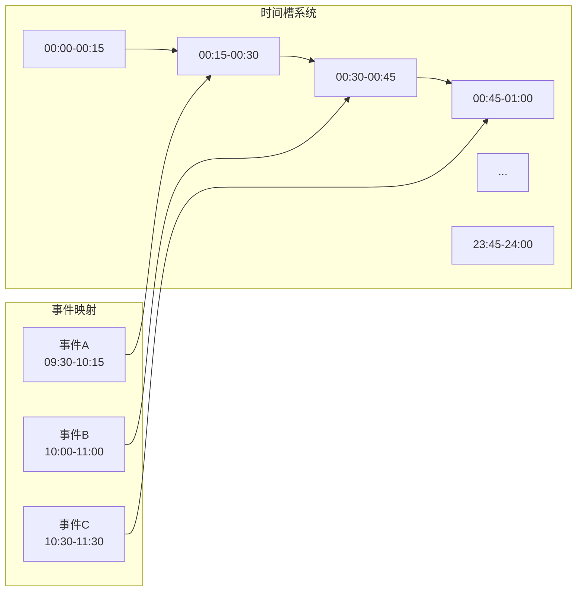
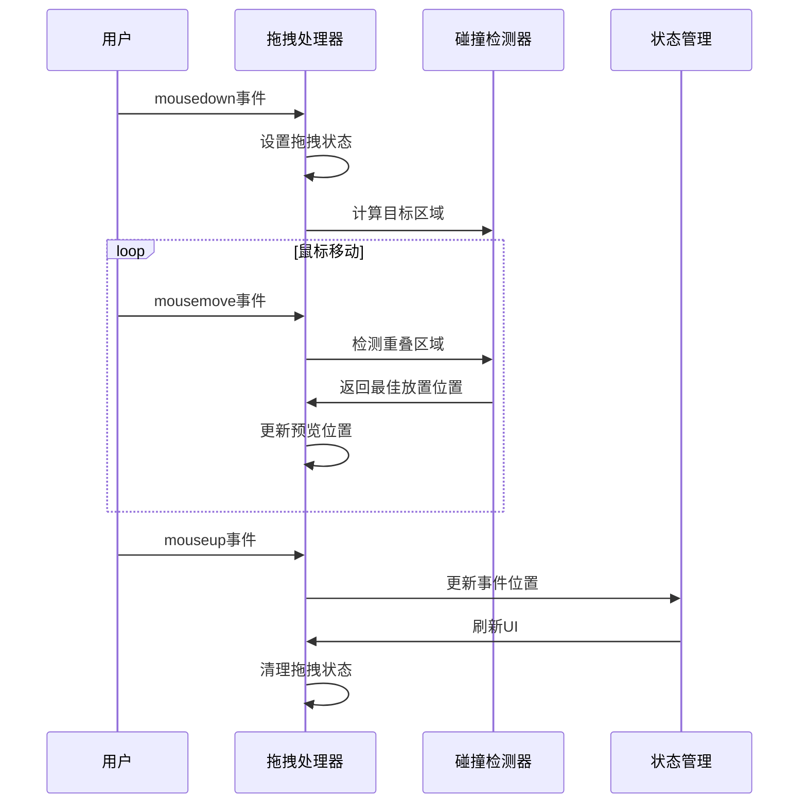
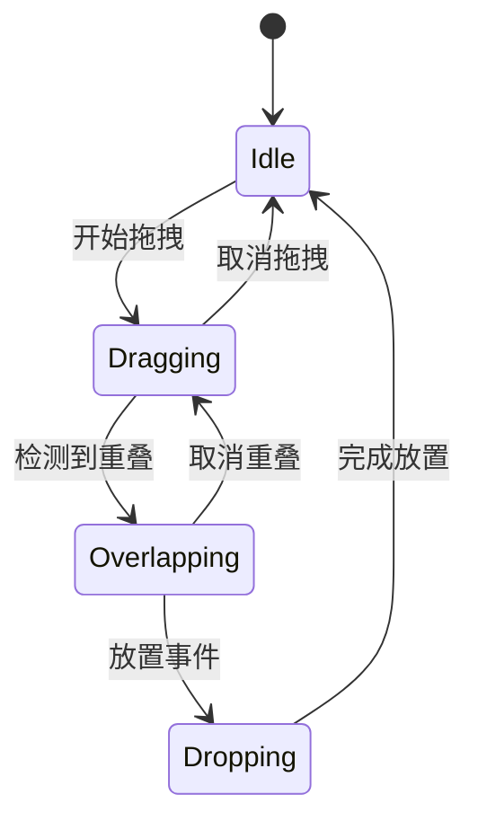
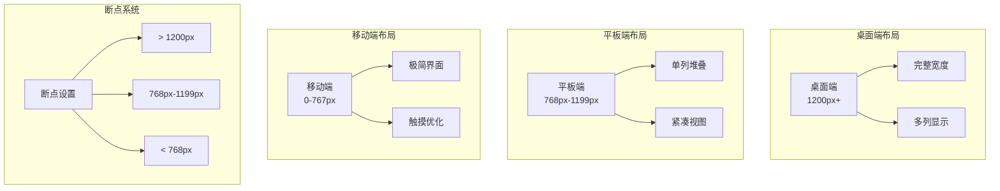
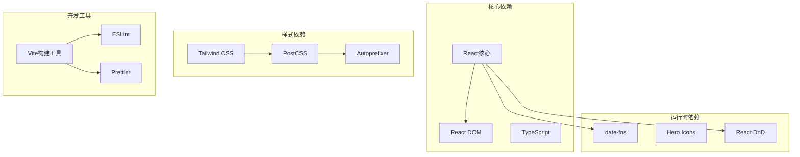

# DailySchedule 日程管理组件

<cite>
**本文档引用的文件**
- [DailySchedule.tsx](file://crm-frontend/src/components/DailySchedule.tsx)
- [Sidebar.tsx](file://crm-frontend/src/components/Sidebar.tsx)
- [App.tsx](file://crm-frontend/src/App.tsx)
- [main.tsx](file://crm-frontend/src/main.tsx)
- [package.json](file://crm-frontend/package.json)
- [tsconfig.json](file://crm-frontend/tsconfig.json)
- [tailwind.config.js](file://crm-frontend/tailwind.config.js)
</cite>

## 目录
1. [简介](#简介)
2. [项目结构](#项目结构)
3. [核心组件](#核心组件)
4. [架构概览](#架构概览)
5. [详细组件分析](#详细组件分析)
6. [依赖关系分析](#依赖关系分析)
7. [性能考虑](#性能考虑)
8. [故障排除指南](#故障排除指南)
9. [结论](#结论)

## 简介

DailySchedule 是一个功能完整的日程管理组件，专为销售AI CRM系统设计。该组件提供了直观的日程可视化界面，支持时间轴渲染、任务管理、拖拽操作和响应式布局。组件采用现代化的React + TypeScript + Tailwind CSS技术栈构建，确保了良好的开发体验和用户体验。

该组件的核心功能包括：
- 实时日程时间轴展示
- 任务的增删改查操作
- 拖拽式任务重新排列
- 响应式移动端适配
- 多种颜色主题支持
- 用户交互状态管理

## 项目结构

项目采用标准的React + Vite前端项目结构，主要文件组织如下：



**图表来源**
- [package.json](file://crm-frontend/package.json)
- [main.tsx](file://crm-frontend/src/main.tsx)
- [App.tsx](file://crm-frontend/src/App.tsx)

**章节来源**
- [package.json](file://crm-frontend/package.json)
- [tsconfig.json](file://crm-frontend/tsconfig.json)
- [tailwind.config.js](file://crm-frontend/tailwind.config.js)

## 核心组件

### 组件架构概述

DailySchedule 组件采用模块化设计，主要由以下几个核心部分组成：



**图表来源**
- [DailySchedule.tsx](file://crm-frontend/src/components/DailySchedule.tsx)

### 数据结构定义

组件使用标准化的ScheduleItem接口来表示日程项目：

| 属性名 | 类型 | 必需 | 默认值 | 描述 |
|--------|------|------|--------|------|
| id | string | 是 | - | 唯一标识符，用于事件识别和状态管理 |
| time | Date | 是 | - | 事件开始时间，决定在时间轴上的位置 |
| title | string | 是 | - | 事件标题，显示在日程条目中 |
| description | string | 否 | "" | 事件描述信息，提供额外详情 |
| color | string | 否 | "blue" | 颜色主题，影响视觉样式和主题一致性 |
| duration | number | 否 | 60 | 事件持续时间（分钟），默认60分钟 |
| type | ScheduleItemType | 否 | "meeting" | 事件类型，用于分类和样式区分 |

**章节来源**
- [DailySchedule.tsx](file://crm-frontend/src/components/DailySchedule.tsx)

## 架构概览

### 整体架构设计



**图表来源**
- [App.tsx](file://crm-frontend/src/App.tsx)
- [Sidebar.tsx](file://crm-frontend/src/components/Sidebar.tsx)
- [DailySchedule.tsx](file://crm-frontend/src/components/DailySchedule.tsx)

### 组件通信机制

组件间通过props和回调函数进行通信，采用单向数据流设计：



**图表来源**
- [App.tsx](file://crm-frontend/src/App.tsx)
- [DailySchedule.tsx](file://crm-frontend/src/components/DailySchedule.tsx)

## 详细组件分析

### 时间轴渲染算法

时间轴渲染是组件的核心功能，采用高效的算法来处理大量日程项目的显示和布局：



**图表来源**
- [DailySchedule.tsx](file://crm-frontend/src/components/DailySchedule.tsx)

#### 时间槽计算逻辑

组件使用固定的时间槽间隔（通常为15分钟）来优化渲染性能：



**图表来源**
- [DailySchedule.tsx](file://crm-frontend/src/components/DailySchedule.tsx)

### 事件管理API

组件提供了完整的CRUD操作接口：

#### 添加事件
```typescript
// 添加新事件到指定时间槽
addEvent(event: Omit<ScheduleItem, 'id'>): void
```

#### 更新事件
```typescript
// 更新现有事件的部分属性
updateEvent(id: string, updates: Partial<ScheduleItem>): void
```

#### 删除事件
```typescript
// 删除指定ID的事件
deleteEvent(id: string): void
```

#### 查询事件
```typescript
// 获取特定时间段内的事件
getEventsInRange(start: Date, end: Date): ScheduleItem[]
```

**章节来源**
- [DailySchedule.tsx](file://crm-frontend/src/components/DailySchedule.tsx)

### 拖拽功能实现

拖拽功能采用HTML5原生拖拽API，结合自定义的碰撞检测算法：



**图表来源**
- [DailySchedule.tsx](file://crm-frontend/src/components/DailySchedule.tsx)

#### 拖拽状态管理



**图表来源**
- [DailySchedule.tsx](file://crm-frontend/src/components/DailySchedule.tsx)

### 响应式布局设计

组件采用移动优先的设计理念，支持多种屏幕尺寸：



**图表来源**
- [DailySchedule.tsx](file://crm-frontend/src/components/DailySchedule.tsx)

## 依赖关系分析

### 外部依赖

项目使用现代化的前端技术栈，主要依赖包括：

| 依赖包 | 版本 | 用途 |
|--------|------|------|
| react | ^18.2.0 | 核心框架 |
| react-dom | ^18.2.0 | DOM渲染 |
| typescript | ^5.0.0 | 类型系统 |
| tailwindcss | ^3.3.0 | CSS框架 |
| @heroicons/react | ^2.0.0 | 图标库 |
| date-fns | ^2.30.0 | 日期处理 |
| react-dnd | ^16.0.0 | 拖拽功能 |

### 内部依赖关系



**图表来源**
- [package.json](file://crm-frontend/package.json)

**章节来源**
- [package.json](file://crm-frontend/package.json)

## 性能考虑

### 渲染优化策略

1. **虚拟滚动**: 对于大量日程项目，采用虚拟滚动技术只渲染可见区域
2. **防抖处理**: 输入操作使用防抖减少不必要的重渲染
3. **记忆化计算**: 使用useMemo缓存昂贵的计算结果
4. **懒加载**: 图标和非关键资源采用懒加载策略

### 内存管理

- 及时清理事件监听器和定时器
- 使用WeakMap避免内存泄漏
- 合理的组件卸载处理

### 网络优化

- 图标资源内联或CDN加速
- CSS按需加载
- 代码分割和懒加载

## 故障排除指南

### 常见问题及解决方案

#### 1. 拖拽功能失效

**症状**: 拖拽事件无法正常工作
**可能原因**:
- 浏览器不支持HTML5拖拽API
- CSS样式阻止了拖拽事件
- JavaScript错误阻止了初始化

**解决方案**:
- 检查浏览器兼容性
- 验证CSS pointer-events属性
- 查看控制台错误信息

#### 2. 时间轴显示异常

**症状**: 事件位置不正确或重叠
**可能原因**:
- 事件时间数据格式错误
- 时间槽计算算法问题
- 媒体查询断点设置不当

**解决方案**:
- 验证Date对象格式
- 检查时间槽间隔设置
- 调整响应式断点

#### 3. 性能问题

**症状**: 页面卡顿或渲染缓慢
**可能原因**:
- 过多的DOM元素
- 频繁的状态更新
- 缺乏必要的优化

**解决方案**:
- 实施虚拟滚动
- 使用React.memo优化
- 减少不必要的重渲染

**章节来源**
- [DailySchedule.tsx](file://crm-frontend/src/components/DailySchedule.tsx)

## 结论

DailySchedule 日程管理组件是一个功能完整、性能优化的现代化React组件。它提供了丰富的日程管理功能，包括直观的时间轴展示、灵活的事件管理、流畅的拖拽交互和优秀的响应式设计。

组件的主要优势包括：
- **模块化设计**: 清晰的组件结构和职责分离
- **类型安全**: 完整的TypeScript类型定义
- **性能优化**: 采用多种优化策略确保流畅体验
- **可扩展性**: 灵活的API设计便于功能扩展
- **用户体验**: 移动端友好和无障碍访问支持

未来可以考虑的功能增强：
- 集成第三方日历服务
- 添加更多视觉主题选项
- 实现离线数据同步
- 增强团队协作功能

该组件为销售AI CRM系统的日程管理需求提供了坚实的技术基础，能够有效提升用户的日程安排效率和工作流程管理能力。