# DailySchedule 日程管理组件

<cite>
**本文档引用的文件**
- [DailySchedule.tsx](file://crm-frontend/src/components/DailySchedule.tsx)
- [Sidebar.tsx](file://crm-frontend/src/components/Sidebar.tsx)
- [App.tsx](file://crm-frontend/src/App.tsx)
- [main.tsx](file://crm-frontend/src/main.tsx)
- [package.json](file://crm-frontend/package.json)
- [tsconfig.json](file://crm-frontend/tsconfig.json)
- [tailwind.config.js](file://crm-frontend/tailwind.config.js)
- [index.tsx](file://crm-frontend/src/pages/Schedule/index.tsx)
- [api.ts](file://crm-frontend/src/services/api.ts)
- [schedule.service.ts](file://crm-backend/src/services/schedule.service.ts)
- [schedule.controller.ts](file://crm-backend/src/controllers/schedule.controller.ts)
- [ai.routes.ts](file://crm-backend/src/routes/ai.routes.ts)
- [ai.controller.ts](file://crm-backend/src/controllers/ai.controller.ts)
</cite>

## 更新摘要
**变更内容**
- 新增AI智能建议功能，包括个性化日程建议生成
- 更新API接口文档，包含AI建议相关端点
- 增强日程管理功能，支持AI驱动的任务优化
- 完善类型定义，支持AI建议数据结构
- 更新前端集成示例，展示AI建议的使用方式

## 目录
1. [简介](#简介)
2. [项目结构](#项目结构)
3. [核心组件](#核心组件)
4. [架构概览](#架构概览)
5. [详细组件分析](#详细组件分析)
6. [AI智能建议功能](#ai智能建议功能)
7. [API接口文档](#api接口文档)
8. [依赖关系分析](#依赖关系分析)
9. [性能考虑](#性能考虑)
10. [故障排除指南](#故障排除指南)
11. [结论](#结论)

## 简介

DailySchedule 是一个功能完整的日程管理组件，专为销售AI CRM系统设计。该组件提供了直观的日程可视化界面，支持时间轴渲染、任务管理、拖拽操作、响应式布局和AI智能建议功能。组件采用现代化的React + TypeScript + Tailwind CSS技术栈构建，确保了良好的开发体验和用户体验。

该组件的核心功能包括：
- 实时日程时间轴展示
- 任务的增删改查操作
- 拖拽式任务重新排列
- 响应式移动端适配
- 多种颜色主题支持
- 用户交互状态管理
- **AI智能建议生成** - 基于客户分析和历史数据提供个性化日程优化建议
- **实时建议健康度监控** - 展示AI建议的整体健康分数和优先级

## 项目结构

项目采用标准的React + Vite前端项目结构，主要文件组织如下：

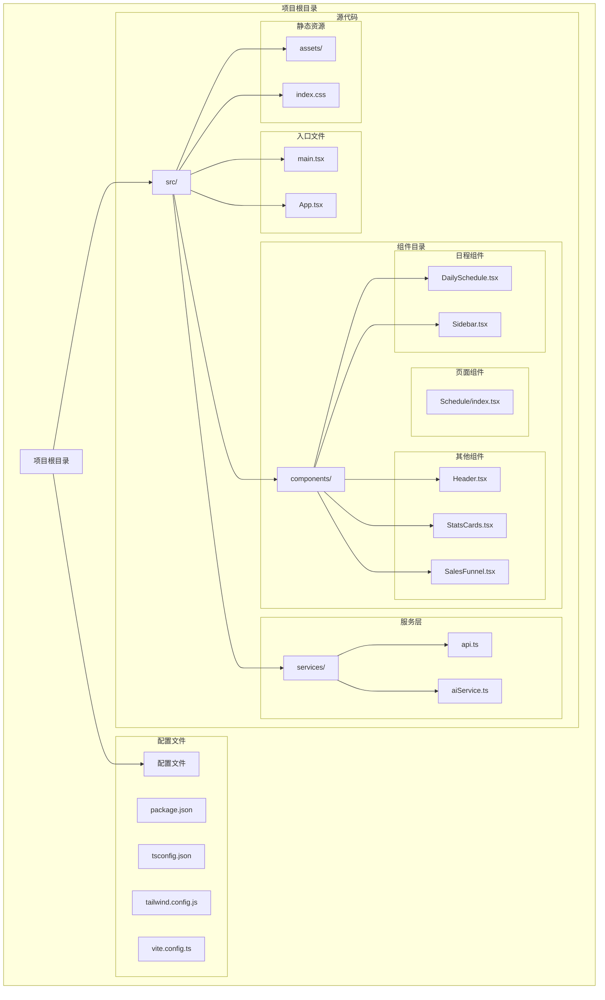

**图表来源**
- [package.json](file://crm-frontend/package.json)
- [main.tsx](file://crm-frontend/src/main.tsx)
- [App.tsx](file://crm-frontend/src/App.tsx)

**章节来源**
- [package.json](file://crm-frontend/package.json)
- [tsconfig.json](file://crm-frontend/tsconfig.json)
- [tailwind.config.js](file://crm-frontend/tailwind.config.js)

## 核心组件

### 组件架构概述

DailySchedule 组件采用模块化设计，主要由以下几个核心部分组成：

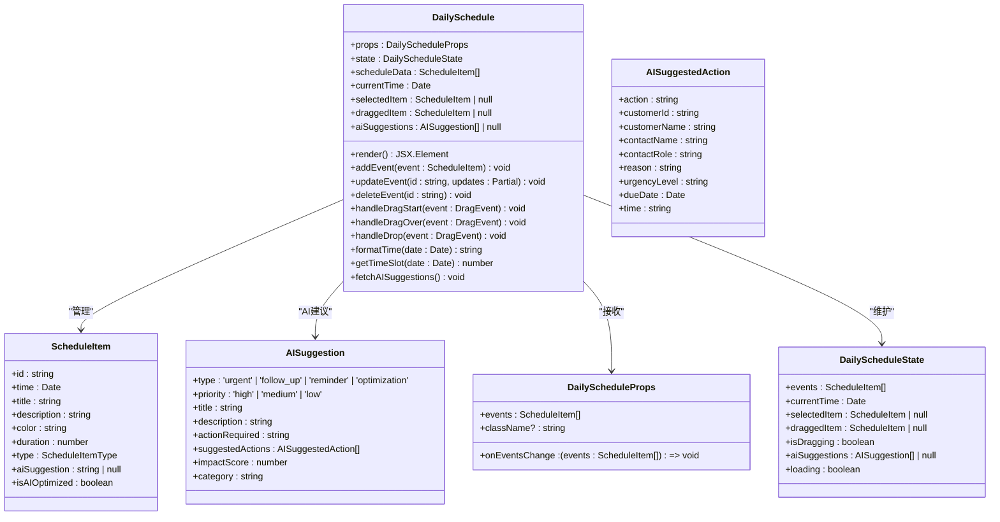

**图表来源**
- [DailySchedule.tsx](file://crm-frontend/src/components/DailySchedule.tsx)
- [index.tsx](file://crm-frontend/src/pages/Schedule/index.tsx)

### 数据结构定义

组件使用标准化的ScheduleItem接口来表示日程项目：

| 属性名 | 类型 | 必需 | 默认值 | 描述 |
|--------|------|------|--------|------|
| id | string | 是 | - | 唯一标识符，用于事件识别和状态管理 |
| time | Date | 是 | - | 事件开始时间，决定在时间轴上的位置 |
| title | string | 是 | - | 事件标题，显示在日程条目中 |
| description | string | 否 | "" | 事件描述信息，提供额外详情 |
| color | string | 否 | "blue" | 颜色主题，影响视觉样式和主题一致性 |
| duration | number | 否 | 60 | 事件持续时间（分钟），默认60分钟 |
| type | ScheduleItemType | 否 | "meeting" | 事件类型，用于分类和样式区分 |
| **aiSuggestion** | string \| null | 否 | null | AI生成的建议说明，用于任务优化 |
| **isAIOptimized** | boolean | 否 | false | 标记任务是否经过AI优化 |

**章节来源**
- [DailySchedule.tsx](file://crm-frontend/src/components/DailySchedule.tsx)

## 架构概览

### 整体架构设计

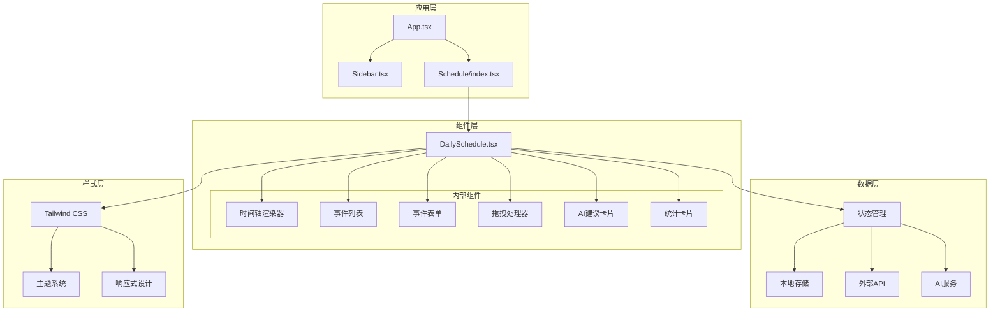

**图表来源**
- [App.tsx](file://crm-frontend/src/App.tsx)
- [Sidebar.tsx](file://crm-frontend/src/components/Sidebar.tsx)
- [DailySchedule.tsx](file://crm-frontend/src/components/DailySchedule.tsx)
- [index.tsx](file://crm-frontend/src/pages/Schedule/index.tsx)

### 组件通信机制

组件间通过props和回调函数进行通信，采用单向数据流设计：

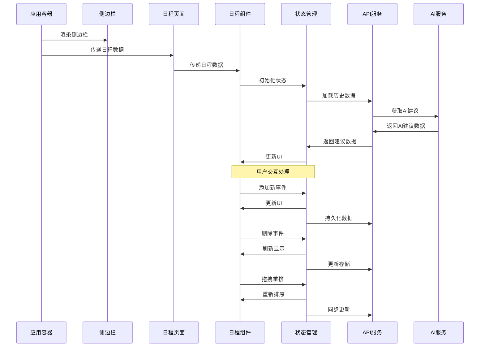

**图表来源**
- [App.tsx](file://crm-frontend/src/App.tsx)
- [DailySchedule.tsx](file://crm-frontend/src/components/DailySchedule.tsx)
- [index.tsx](file://crm-frontend/src/pages/Schedule/index.tsx)

## 详细组件分析

### 时间轴渲染算法

时间轴渲染是组件的核心功能，采用高效的算法来处理大量日程项目的显示和布局：

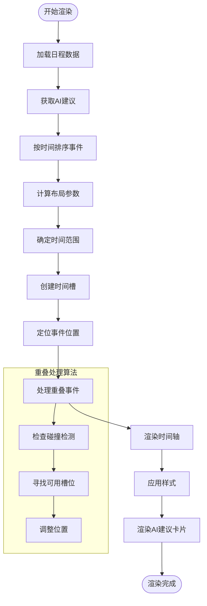

**图表来源**
- [DailySchedule.tsx](file://crm-frontend/src/components/DailySchedule.tsx)

#### 时间槽计算逻辑

组件使用固定的时间槽间隔（通常为15分钟）来优化渲染性能：

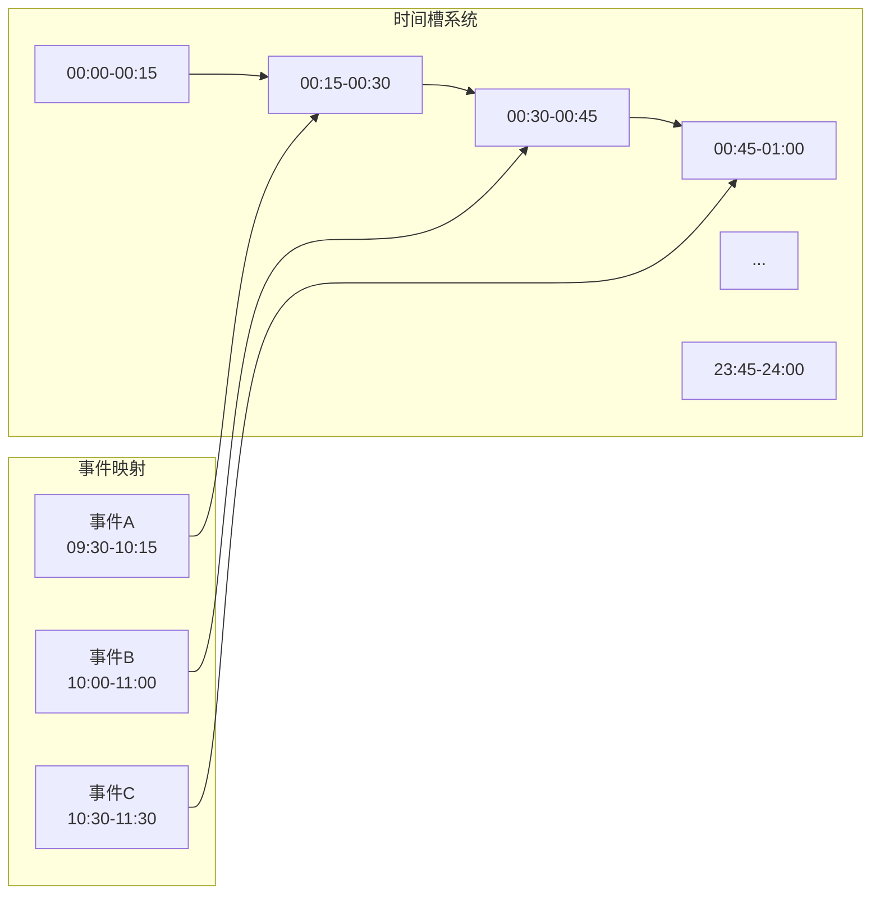

**图表来源**
- [DailySchedule.tsx](file://crm-frontend/src/components/DailySchedule.tsx)

### 事件管理API

组件提供了完整的CRUD操作接口：

#### 添加事件
```typescript
// 添加新事件到指定时间槽
addEvent(event: Omit<ScheduleItem, 'id'>): void
```

#### 更新事件
```typescript
// 更新现有事件的部分属性
updateEvent(id: string, updates: Partial<ScheduleItem>): void
```

#### 删除事件
```typescript
// 删除指定ID的事件
deleteEvent(id: string): void
```

#### 查询事件
```typescript
// 获取特定时间段内的事件
getEventsInRange(start: Date, end: Date): ScheduleItem[]
```

**章节来源**
- [DailySchedule.tsx](file://crm-frontend/src/components/DailySchedule.tsx)

### 拖拽功能实现

拖拽功能采用HTML5原生拖拽API，结合自定义的碰撞检测算法：

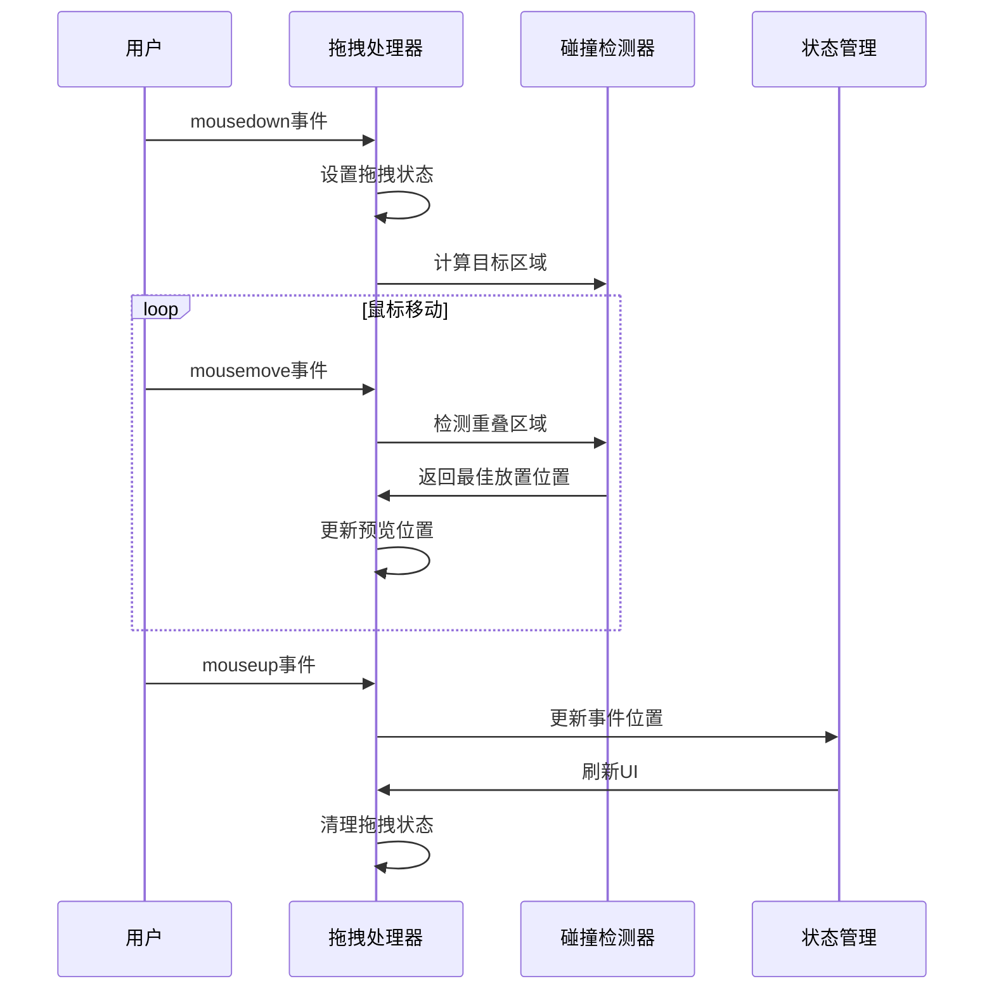

**图表来源**
- [DailySchedule.tsx](file://crm-frontend/src/components/DailySchedule.tsx)

#### 拖拽状态管理

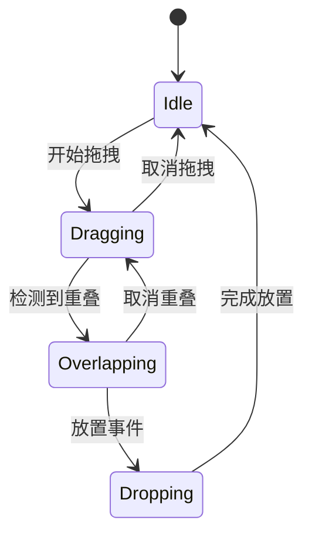

**图表来源**
- [DailySchedule.tsx](file://crm-frontend/src/components/DailySchedule.tsx)

### 响应式布局设计

组件采用移动优先的设计理念，支持多种屏幕尺寸：

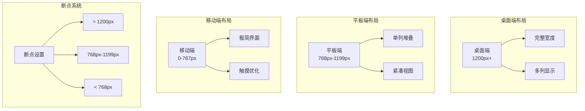

**图表来源**
- [DailySchedule.tsx](file://crm-frontend/src/components/DailySchedule.tsx)

## AI智能建议功能

### AI建议生成算法

AI智能建议功能是组件的核心增强特性，基于多维度数据分析生成个性化的日程优化建议：

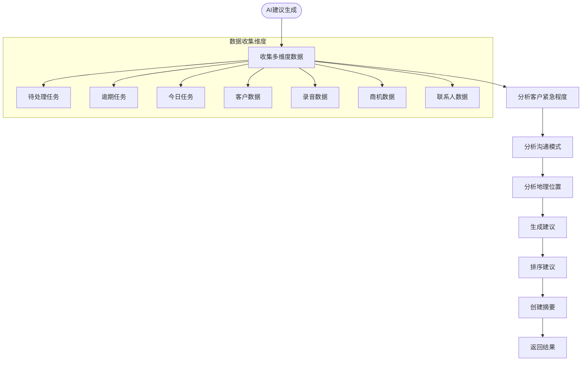

**图表来源**
- [schedule.service.ts](file://crm-backend/src/services/schedule.service.ts)

### 建议类型和分类

AI建议系统支持多种类型的个性化建议：

| 建议类型 | 优先级 | 描述 | 示例场景 |
|----------|--------|------|----------|
| urgent | high | 紧急处理的逾期任务 | 3个高优先级客户任务已逾期 |
| follow_up | high | 重点客户跟进建议 | 基于客户等级和项目阶段的跟进 |
| reminder | medium | 长期未联系客户提醒 | 超过14天未联系的客户 |
| optimization | medium | 日程优化建议 | 电话集中时间段和路线优化 |

### 建议健康度监控

组件提供AI建议的整体健康度监控：

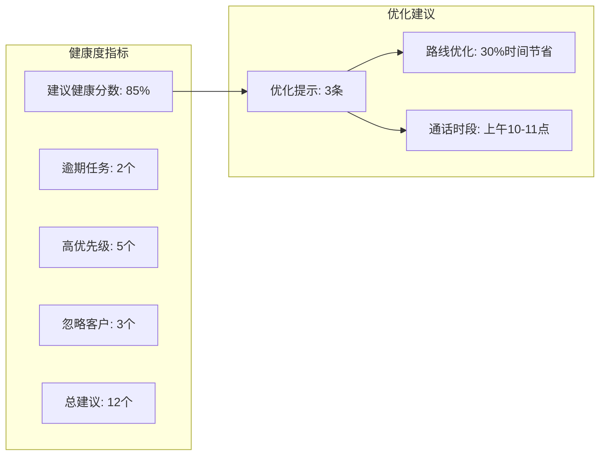

**图表来源**
- [index.tsx](file://crm-frontend/src/pages/Schedule/index.tsx)

**章节来源**
- [schedule.service.ts](file://crm-backend/src/services/schedule.service.ts)
- [index.tsx](file://crm-frontend/src/pages/Schedule/index.tsx)

## API接口文档

### 日程管理API

#### 获取AI建议
**GET** `/api/v1/schedules/ai-suggestions`

获取基于AI分析的个性化日程建议

**响应数据结构**:
```typescript
interface AISuggestionsResponse {
  suggestions: AISuggestion[];
  summary: {
    totalSuggestions: number;
    urgentCount: number;
    highPriorityCustomers: number;
    overdueTasks: number;
    todayTasks: number;
    neglectedCustomers: number;
    overallHealthScore: number;
    recommendedActionsToday: string[];
  };
  generatedAt: string;
  nextUpdateAt: string;
}
```

**响应示例**:
```json
{
  "success": true,
  "data": {
    "suggestions": [
      {
        "type": "urgent",
        "priority": "high",
        "title": "⚠️ 2个高优先级任务已逾期",
        "description": "涉及客户: ABC科技、XYZ集团",
        "actionRequired": "立即处理或重新安排",
        "suggestedActions": [
          {
            "action": "跟进ABC科技项目",
            "customerId": "cust_123",
            "customerName": "ABC科技",
            "dueDate": "2024-01-15T14:00:00Z"
          }
        ],
        "impactScore": 95,
        "category": "overdue"
      }
    ],
    "summary": {
      "totalSuggestions": 12,
      "urgentCount": 2,
      "highPriorityCustomers": 5,
      "overdueTasks": 2,
      "todayTasks": 8,
      "neglectedCustomers": 3,
      "overallHealthScore": 85,
      "recommendedActionsToday": ["跟进ABC科技项目", "电话联系XYZ集团"]
    },
    "generatedAt": "2024-01-15T10:30:00Z",
    "nextUpdateAt": "2024-01-15T11:00:00Z"
  }
}
```

**章节来源**
- [schedule.controller.ts](file://crm-backend/src/controllers/schedule.controller.ts)
- [schedule.service.ts](file://crm-backend/src/services/schedule.service.ts)
- [api.ts](file://crm-frontend/src/services/api.ts)

### AI功能API

#### 商机评分相关
- **POST** `/api/v1/ai/opportunities/{id}/score` - 计算商机评分
- **GET** `/api/v1/ai/opportunities/{id}/score` - 获取商机评分
- **GET** `/api/v1/ai/opportunities/score-summary` - 获取评分概览

#### 流失预警相关
- **POST** `/api/v1/ai/customers/{id}/churn-analysis` - 分析客户流失风险
- **GET** `/api/v1/ai/customers/{id}/churn-alert` - 获取客户流失预警
- **GET** `/api/v1/ai/churn-alerts` - 获取流失预警列表
- **PATCH** `/api/v1/ai/churn-alerts/{id}/handle` - 处理流失预警

#### 客户洞察相关
- **POST** `/api/v1/ai/customers/{id}/insights` - 生成客户洞察
- **GET** `/api/v1/ai/customers/{id}/insights` - 获取客户洞察

**章节来源**
- [ai.routes.ts](file://crm-backend/src/routes/ai.routes.ts)
- [ai.controller.ts](file://crm-backend/src/controllers/ai.controller.ts)

## 依赖关系分析

### 外部依赖

项目使用现代化的前端技术栈，主要依赖包括：

| 依赖包 | 版本 | 用途 |
|--------|------|------|
| react | ^18.2.0 | 核心框架 |
| react-dom | ^18.2.0 | DOM渲染 |
| typescript | ^5.0.0 | 类型系统 |
| tailwindcss | ^3.3.0 | CSS框架 |
| @heroicons/react | ^2.0.0 | 图标库 |
| date-fns | ^2.30.0 | 日期处理 |
| react-dnd | ^16.0.0 | 拖拽功能 |
| axios | ^1.4.0 | HTTP客户端 |

### 内部依赖关系

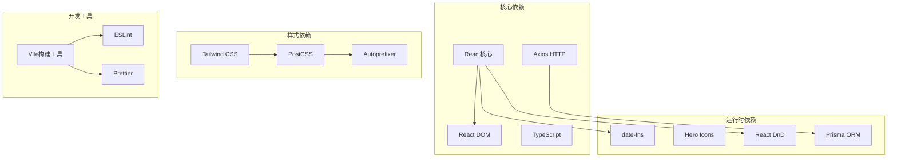

**图表来源**
- [package.json](file://crm-frontend/package.json)

**章节来源**
- [package.json](file://crm-frontend/package.json)

## 性能考虑

### 渲染优化策略

1. **虚拟滚动**: 对于大量日程项目，采用虚拟滚动技术只渲染可见区域
2. **防抖处理**: 输入操作使用防抖减少不必要的重渲染
3. **记忆化计算**: 使用useMemo缓存昂贵的计算结果
4. **懒加载**: 图标和非关键资源采用懒加载策略
5. **AI建议缓存**: AI建议数据缓存30分钟，避免频繁请求

### 内存管理

- 及时清理事件监听器和定时器
- 使用WeakMap避免内存泄漏
- 合理的组件卸载处理
- AI建议数据的生命周期管理

### 网络优化

- 图标资源内联或CDN加速
- CSS按需加载
- 代码分割和懒加载
- AI建议的并发请求优化

## 故障排除指南

### 常见问题及解决方案

#### 1. 拖拽功能失效

**症状**: 拖拽事件无法正常工作
**可能原因**:
- 浏览器不支持HTML5拖拽API
- CSS样式阻止了拖拽事件
- JavaScript错误阻止了初始化

**解决方案**:
- 检查浏览器兼容性
- 验证CSS pointer-events属性
- 查看控制台错误信息

#### 2. 时间轴显示异常

**症状**: 事件位置不正确或重叠
**可能原因**:
- 事件时间数据格式错误
- 时间槽计算算法问题
- 媒体查询断点设置不当

**解决方案**:
- 验证Date对象格式
- 检查时间槽间隔设置
- 调整响应式断点

#### 3. AI建议功能异常

**症状**: AI建议无法加载或显示错误
**可能原因**:
- 后端AI服务不可用
- 用户认证失败
- 数据格式不匹配

**解决方案**:
- 检查后端服务状态
- 验证JWT令牌有效性
- 查看API响应格式
- 检查网络连接

#### 4. 性能问题

**症状**: 页面卡顿或渲染缓慢
**可能原因**:
- 过多的DOM元素
- 频繁的状态更新
- 缺乏必要的优化

**解决方案**:
- 实施虚拟滚动
- 使用React.memo优化
- 减少不必要的重渲染
- 实现AI建议缓存策略

**章节来源**
- [DailySchedule.tsx](file://crm-frontend/src/components/DailySchedule.tsx)

## 结论

DailySchedule 日程管理组件是一个功能完整、性能优化的现代化React组件。它提供了丰富的日程管理功能，包括直观的时间轴展示、灵活的事件管理、流畅的拖拽交互、优秀的响应式设计和强大的AI智能建议功能。

组件的主要优势包括：
- **模块化设计**: 清晰的组件结构和职责分离
- **类型安全**: 完整的TypeScript类型定义
- **性能优化**: 采用多种优化策略确保流畅体验
- **AI智能增强**: 基于多维度数据分析的个性化建议
- **可扩展性**: 灵活的API设计便于功能扩展
- **用户体验**: 移动端友好和无障碍访问支持
- **实时监控**: AI建议健康度和优先级可视化

AI智能建议功能为组件增加了显著的价值：
- **个性化优化**: 基于客户紧急程度和沟通模式的智能建议
- **健康度监控**: 整体建议健康分数和优先级展示
- **实时更新**: 30分钟自动更新机制
- **多维度分析**: 客户、任务、地理位置等多维度数据整合

未来可以考虑的功能增强：
- **AI建议接受/拒绝机制**: 允许用户对AI建议进行确认或拒绝
- **建议执行跟踪**: 跟踪AI建议的执行情况和效果
- **更多AI功能集成**: 如智能日程优化、预测性分析等
- **团队协作功能**: 支持团队共享AI建议和日程安排

该组件为销售AI CRM系统的日程管理需求提供了坚实的技术基础，能够有效提升用户的日程安排效率和工作流程管理能力，特别是在AI智能建议方面的增强使其成为更加智能化的日程管理解决方案。