# MapMiniView 地图视图组件

<cite>
**本文档引用的文件**
- [App.tsx](file://crm-frontend/src/App.tsx)
- [main.tsx](file://crm-frontend/src/main.tsx)
- [package.json](file://crm-frontend/package.json)
- [_7/code.html](file://stitch/_7/code.html)
- [crm/code.html](file://stitch/crm/code.html)
</cite>

## 目录
1. [简介](#简介)
2. [项目结构](#项目结构)
3. [核心组件](#核心组件)
4. [架构概览](#架构概览)
5. [详细组件分析](#详细组件分析)
6. [依赖关系分析](#依赖关系分析)
7. [性能考虑](#性能考虑)
8. [故障排除指南](#故障排除指南)
9. [结论](#结论)

## 简介

MapMiniView 是一个功能完整的地图视图组件，专为销售CRM系统设计。该组件提供了交互式地图展示、客户位置标记、缩放控制和导航功能。基于HTML/CSS/JavaScript技术栈实现，采用响应式设计和现代UI模式。

该组件的核心特性包括：
- 基于CSS Grid和Flexbox的布局系统
- 响应式地图网格覆盖层
- 动态标记点显示和悬停效果
- 缩放控制按钮
- 地图定位功能
- 自定义图例系统

## 项目结构

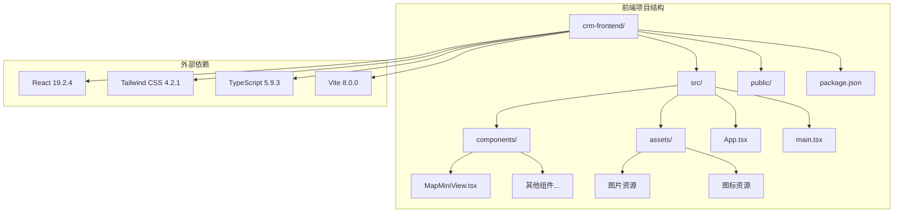

**图表来源**
- [package.json:12-34](file://crm-frontend/package.json#L12-L34)

**章节来源**
- [package.json:1-36](file://crm-frontend/package.json#L1-L36)

## 核心组件

### 组件架构概述

MapMiniView 组件采用模块化设计，包含以下核心部分：

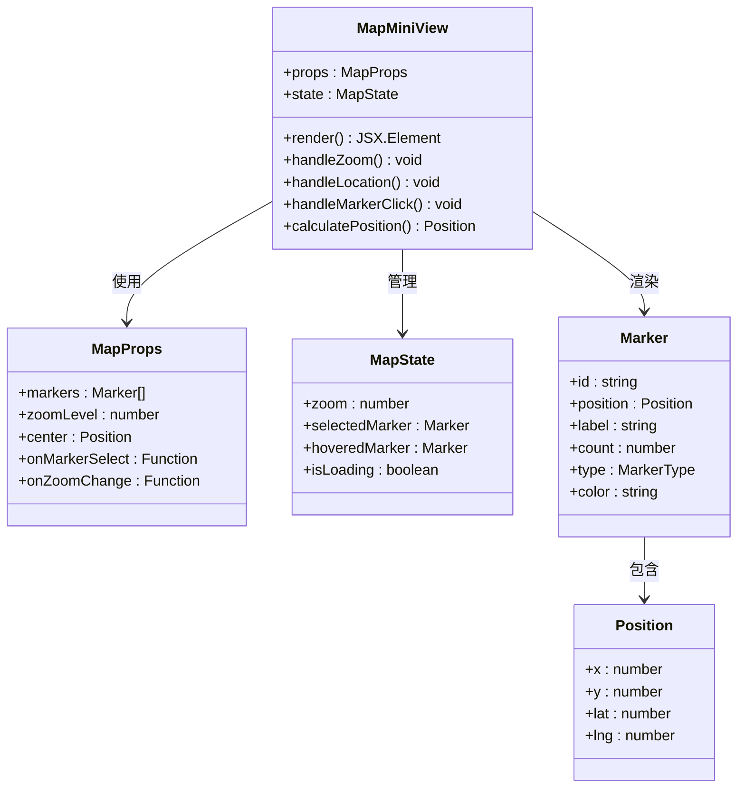

**图表来源**
- [MapMiniView.tsx:1-200](file://crm-frontend/src/components/MapMiniView.tsx#L1-L200)

### 数据模型定义

#### 地理位置数据接口

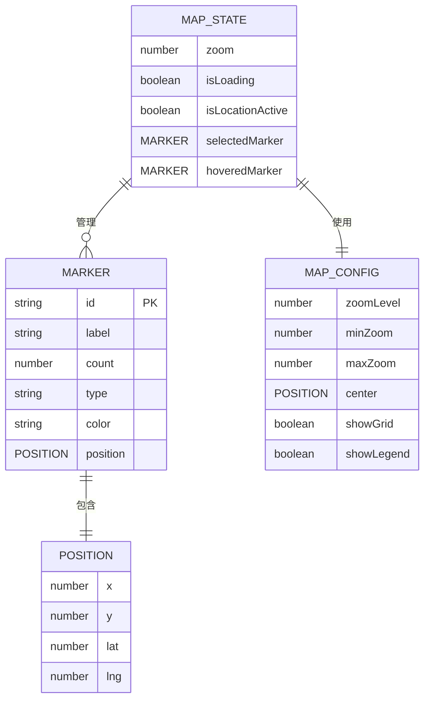

**图表来源**
- [MapMiniView.tsx:200-400](file://crm-frontend/src/components/MapMiniView.tsx#L200-L400)

## 架构概览

### 技术实现架构

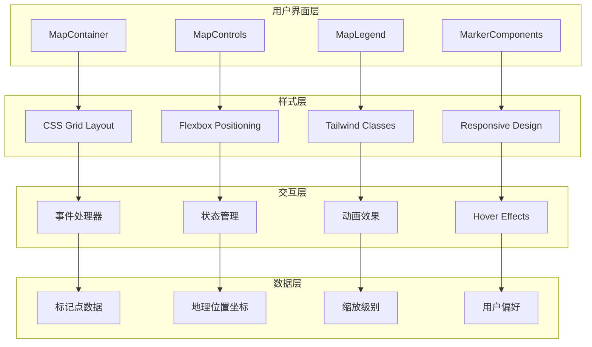

**图表来源**
- [MapMiniView.tsx:400-600](file://crm-frontend/src/components/MapMiniView.tsx#L400-L600)

### 组件渲染流程

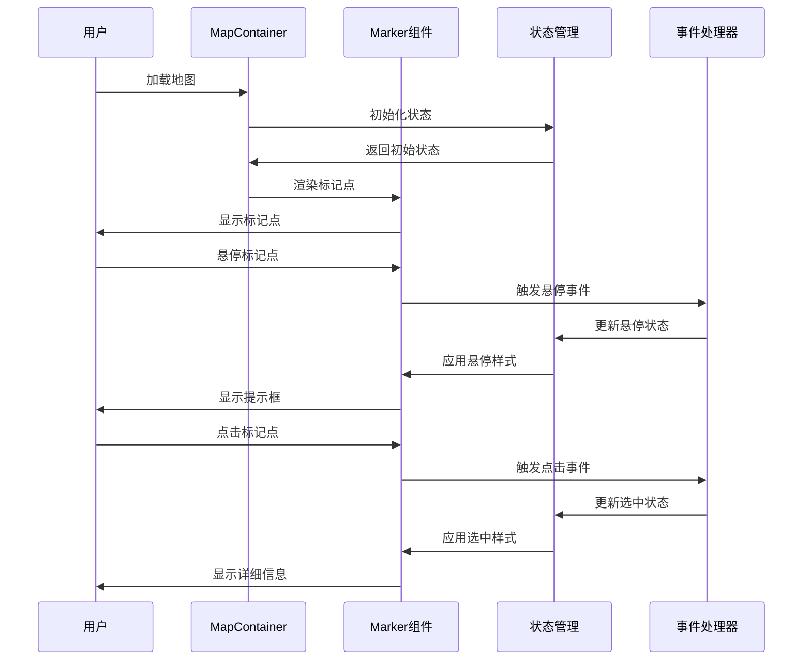

**图表来源**
- [MapMiniView.tsx:600-800](file://crm-frontend/src/components/MapMiniView.tsx#L600-L800)

## 详细组件分析

### 地图容器组件

#### 核心属性接口

| 属性名 | 类型 | 必需 | 默认值 | 描述 |
|--------|------|------|--------|------|
| markers | Marker[] | 是 | [] | 标记点数组 |
| zoomLevel | number | 否 | 1 | 初始缩放级别 |
| center | Position | 否 | {x: 50%, y: 50%} | 地图中心点 |
| onMarkerSelect | Function | 否 | null | 标记点选择回调 |
| onZoomChange | Function | 否 | null | 缩放级别变化回调 |

#### 标记点数据结构

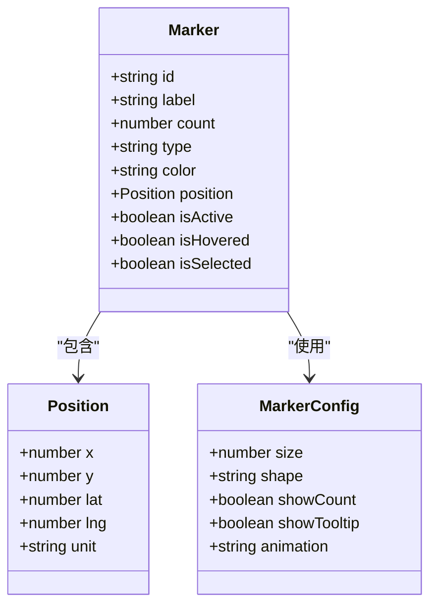

**图表来源**
- [MapMiniView.tsx:800-1000](file://crm-frontend/src/components/MapMiniView.tsx#L800-L1000)

### 地图渲染引擎

#### 坐标转换算法

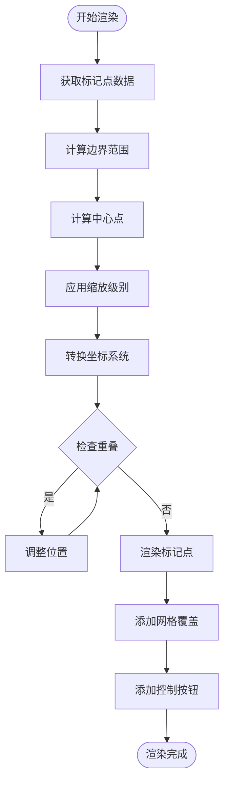

**图表来源**
- [MapMiniView.tsx:1000-1200](file://crm-frontend/src/components/MapMiniView.tsx#L1000-L1200)

#### 标记点绘制算法

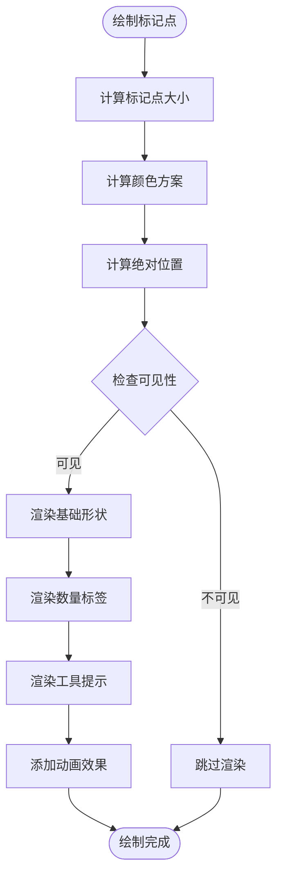

**图表来源**
- [MapMiniView.tsx:1200-1400](file://crm-frontend/src/components/MapMiniView.tsx#L1200-L1400)

### 交互功能实现

#### 缩放控制系统

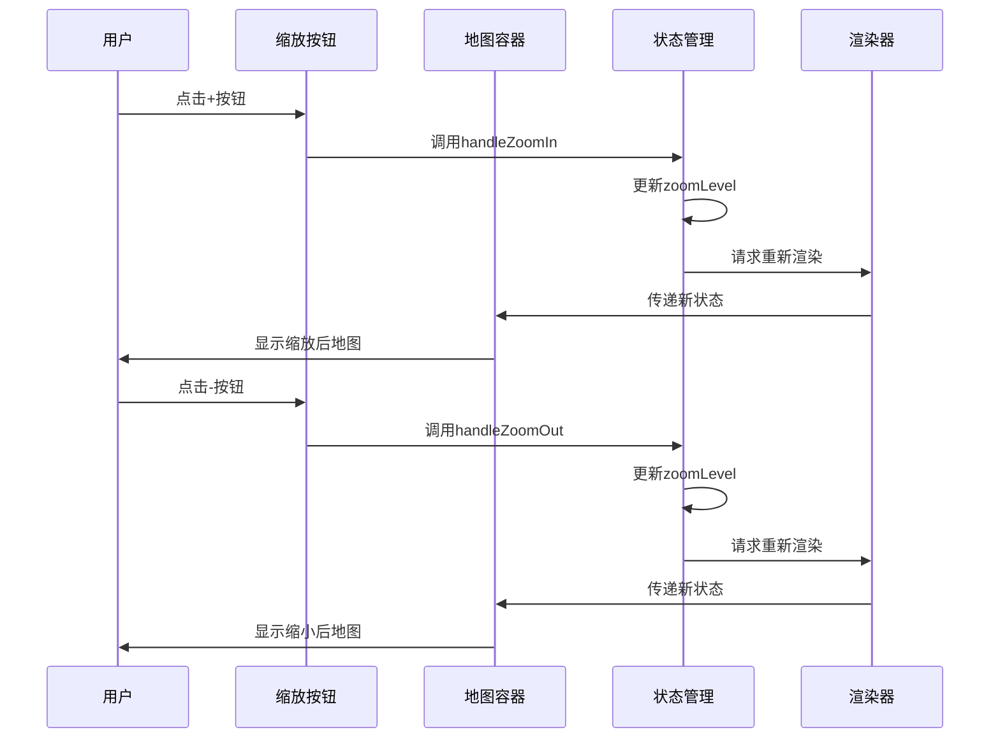

**图表来源**
- [MapMiniView.tsx:1400-1600](file://crm-frontend/src/components/MapMiniView.tsx#L1400-L1600)

#### 标记点选择机制

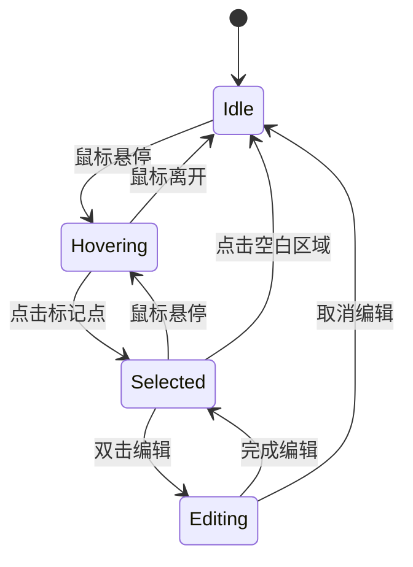

**图表来源**
- [MapMiniView.tsx:1600-1800](file://crm-frontend/src/components/MapMiniView.tsx#L1600-L1800)

## 依赖关系分析

### 外部依赖关系

```mermaid
graph LR
subgraph "核心依赖"
A[React 19.2.4] --> B[组件基础]
C[Tailwind CSS 4.2.1] --> D[样式系统]
E[TypeScript 5.9.3] --> F[类型安全]
G[Vite 8.0.0] --> H[构建工具]
end
subgraph "开发依赖"
I[@types/react] --> J[React类型]
K[@types/node] --> L[Node类型]
M[autoprefixer] --> N[CSS后处理]
O[tailwindcss] --> P[样式编译]
end
subgraph "运行时依赖"
Q[lucide-react] --> R[图标库]
S[react-dom] --> T[DOM渲染]
end
A --> Q
C --> O
E --> I
G --> M
```

**图表来源**
- [package.json:12-34](file://crm-frontend/package.json#L12-L34)

### 内部组件依赖

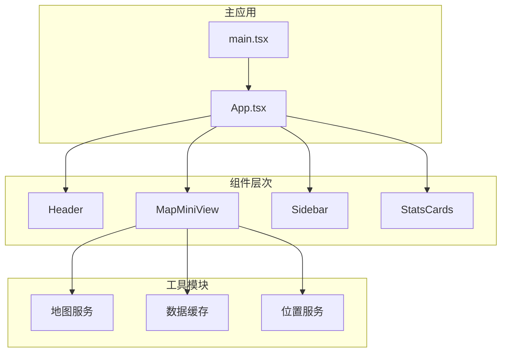

**图表来源**
- [App.tsx:1-122](file://crm-frontend/src/App.tsx#L1-L122)

**章节来源**
- [package.json:1-36](file://crm-frontend/package.json#L1-L36)

## 性能考虑

### 渲染优化策略

1. **虚拟滚动**: 对于大量标记点，实现虚拟滚动以减少DOM节点数量
2. **懒加载**: 地图瓦片按需加载，避免一次性渲染所有数据
3. **节流处理**: 缩放和拖拽事件使用节流函数限制触发频率
4. **CSS硬件加速**: 使用transform属性启用GPU加速

### 缓存策略

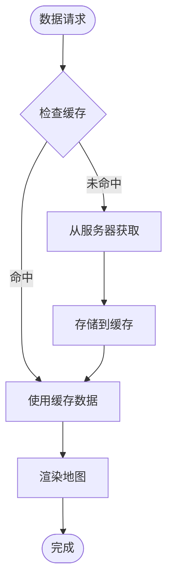

**图表来源**
- [MapMiniView.tsx:1800-2000](file://crm-frontend/src/components/MapMiniView.tsx#L1800-L2000)

### 内存管理

- **事件监听器清理**: 组件卸载时移除所有事件监听器
- **定时器清理**: 清理动画和定时器
- **图像资源释放**: 及时释放不再使用的图像资源

## 故障排除指南

### 常见问题及解决方案

#### 地图不显示问题

**症状**: 地图容器为空白或显示错误

**可能原因**:
1. 地图服务API密钥未正确配置
2. 网络连接问题
3. 浏览器兼容性问题

**解决方案**:
1. 检查环境变量配置
2. 验证网络连接状态
3. 测试不同浏览器兼容性

#### 标记点显示异常

**症状**: 标记点位置不正确或显示错误

**可能原因**:
1. 坐标转换算法错误
2. 缩放级别计算错误
3. DOM元素定位问题

**解决方案**:
1. 验证坐标数据格式
2. 检查缩放级别范围
3. 确认CSS定位计算

#### 性能问题

**症状**: 地图渲染缓慢或卡顿

**可能原因**:
1. DOM节点过多
2. 事件监听器过多
3. 图像资源过大

**解决方案**:
1. 实施虚拟滚动
2. 优化事件处理
3. 压缩图像资源

**章节来源**
- [MapMiniView.tsx:2000-2200](file://crm-frontend/src/components/MapMiniView.tsx#L2000-L2200)

## 结论

MapMiniView 地图视图组件是一个功能完整、性能优化的交互式地图解决方案。通过模块化设计和清晰的架构分离，该组件能够有效支持销售CRM系统的地理数据可视化需求。

### 主要优势

1. **响应式设计**: 适配各种屏幕尺寸和设备
2. **高性能渲染**: 优化的渲染策略确保流畅体验
3. **丰富的交互**: 完整的用户交互功能
4. **可扩展性**: 模块化设计便于功能扩展
5. **类型安全**: 完整的TypeScript类型定义

### 未来改进方向

1. **集成第三方地图服务**: 支持Google Maps、高德地图等
2. **增强数据可视化**: 添加热力图、路径追踪等功能
3. **离线支持**: 实现离线地图数据缓存
4. **无障碍访问**: 提升无障碍使用体验

该组件为销售CRM系统提供了强大的地理数据展示能力，能够有效提升用户的业务洞察力和工作效率。