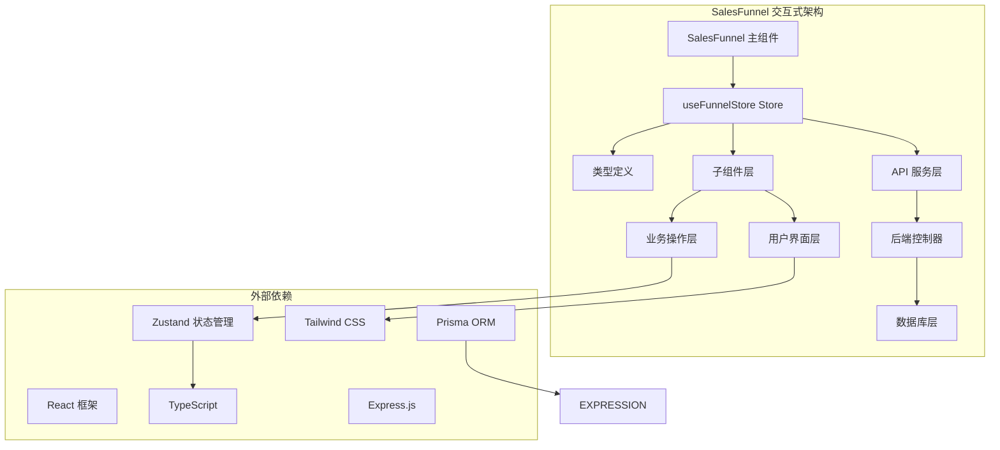
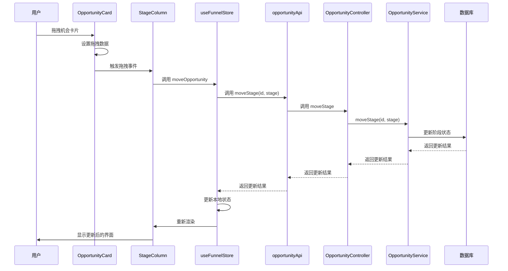
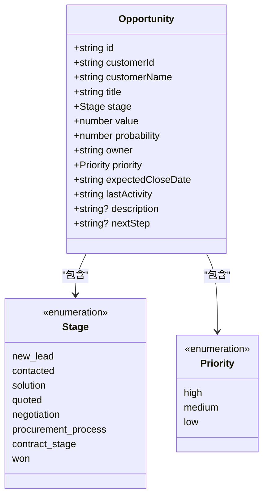

# 销售漏斗组件

<cite>
**本文档引用的文件**
- [SalesFunnel/index.tsx](file://crm-frontend/src/pages/SalesFunnel/index.tsx)
- [funnelStore.ts](file://crm-frontend/src/stores/funnelStore.ts)
- [types/index.ts](file://crm-frontend/src/types/index.ts)
- [opportunities.ts](file://crm-frontend/src/data/opportunities.ts)
- [api.ts](file://crm-frontend/src/services/api.ts)
- [opportunity.controller.ts](file://crm-backend/src/controllers/opportunity.controller.ts)
- [opportunity.service.ts](file://crm-backend/src/services/opportunity.service.ts)
- [opportunity.validator.ts](file://crm-backend/src/validators/opportunity.validator.ts)
- [Dashboard/index.tsx](file://crm-frontend/src/pages/Dashboard/index.tsx)
</cite>

## 更新摘要
**变更内容**
- 更新了完整的CRUD API操作实现，包括获取、创建、更新、删除机会
- 新增了跨阶段拖拽移动功能的后端支持
- 完善了数据验证规则和边界条件处理
- 增强了错误处理和性能优化策略

## 目录
1. [简介](#简介)
2. [架构概览](#架构概览)
3. [核心组件](#核心组件)
4. [Store 架构](#store-架构)
5. [交互式功能](#交互式功能)
6. [数据模型](#数据模型)
7. [组件API参考](#组件api参考)
8. [类型定义](#类型定义)
9. [性能优化](#性能优化)
10. [使用示例](#使用示例)
11. [故障排除](#故障排除)

## 简介

SalesFunnel 销售漏斗组件是一个完整的交互式销售管理界面，基于现代化的前端架构构建。该组件不仅提供销售阶段的可视化展示，更重要的是实现了完整的数据操作能力，包括拖拽操作、实时编辑、删除确认等交互功能。

**更新** 该组件已从简单的静态展示升级为完整的交互式API，基于Zustand状态管理库实现，提供完整的数据操作能力。后端API已完全实现，支持RESTful CRUD操作和实时数据同步。

## 架构概览

SalesFunnel 采用分层架构设计，实现了清晰的关注点分离：



**图表来源**
- [SalesFunnel/index.tsx:542-676](file://crm-frontend/src/pages/SalesFunnel/index.tsx#L542-L676)
- [funnelStore.ts:18-76](file://crm-frontend/src/stores/funnelStore.ts#L18-L76)
- [api.ts:158-178](file://crm-frontend/src/services/api.ts#L158-L178)

## 核心组件

### SalesFunnel 主组件

SalesFunnel 是一个功能完整的交互式组件，负责渲染整个销售漏斗界面。它包含以下主要功能：
- 实时销售机会看板视图
- 拖拽操作支持（跨阶段移动）
- 实时编辑功能
- 删除确认对话框
- 添加客户表单
- 统计卡片展示

### 子组件体系

组件采用模块化设计，包含多个专用子组件：

```mermaid
graph LR
subgraph "子组件层次结构"
OPPORTUNITYCARD[OpportunityCard]
DELETECONFIRMDIALOG[DeleteConfirmDialog]
EDITOPPORTUNITYMODAL[EditOpportunityModal]
ADDCUSTOMERFORM[AddCustomerForm]
STAGECOLUMN[StageColumn]
FUNNELSTATS[FunnelStats]
END
```

**图表来源**
- [SalesFunnel/index.tsx:244-342](file://crm-frontend/src/pages/SalesFunnel/index.tsx#L244-L342)
- [SalesFunnel/index.tsx:26-67](file://crm-frontend/src/pages/SalesFunnel/index.tsx#L26-L67)

**章节来源**
- [SalesFunnel/index.tsx:542-676](file://crm-frontend/src/pages/SalesFunnel/index.tsx#L542-L676)

## Store 架构

### useFunnelStore 状态管理

```mermaid
graph TD
subgraph "Store 状态结构"
STATE[FunnelState]
OPPORTUNITIES[opportunities: Opportunity[]]
SELECTEDSTAGE[selectedStage: Stage | 'all']
LOADING[loading: boolean]
ERROR[error: string | null]
ACTIONS[ACTIONS]
FETCH[fetchOpportunities]
ADD[addOpportunity]
UPDATE[updateOpportunity]
DELETE[deleteOpportunity]
MOVE[moveOpportunity]
STATS[getStageStats]
END
```

**图表来源**
- [funnelStore.ts:6-16](file://crm-frontend/src/stores/funnelStore.ts#L6-L16)

Store 提供以下核心功能：
- **数据持久化**：使用 Zustand persist 中间件实现本地存储
- **CRUD 操作**：完整的销售机会数据操作能力（通过API）
- **统计计算**：自动计算各阶段统计数据
- **状态选择**：支持按阶段筛选和全量显示
- **错误处理**：统一的错误捕获和处理机制

**章节来源**
- [funnelStore.ts:18-163](file://crm-frontend/src/stores/funnelStore.ts#L18-L163)

## 交互式功能

### 拖拽操作

组件实现了完整的拖拽功能，支持将销售机会在不同阶段间移动：



**图表来源**
- [SalesFunnel/index.tsx:561-580](file://crm-frontend/src/pages/SalesFunnel/index.tsx#L561-L580)
- [funnelStore.ts:124-137](file://crm-frontend/src/stores/funnelStore.ts#L124-L137)

### 实时编辑

EditOpportunityModal 提供完整的编辑功能：
- 实时表单验证
- 支持所有 Opportunity 字段编辑
- 保存时的数据校验
- 取消编辑功能

### 删除确认

DeleteConfirmDialog 实现安全的删除操作：
- 确认对话框防止误删
- 显示即将删除的项目信息
- 二次确认机制

**章节来源**
- [SalesFunnel/index.tsx:69-242](file://crm-frontend/src/pages/SalesFunnel/index.tsx#L69-L242)

## 数据模型

### Opportunity 数据结构



**图表来源**
- [types/index.ts:39-55](file://crm-frontend/src/types/index.ts#L39-L55)

### Mock 数据

系统包含丰富的测试数据，涵盖各种销售场景：
- 9个完整的销售机会案例
- 覆盖所有销售阶段
- 不同金额级别的项目
- 各种优先级分布

**章节来源**
- [opportunities.ts:4-140](file://crm-frontend/src/data/opportunities.ts#L4-L140)

## 组件API参考

### SalesFunnel Props 接口

```typescript
interface SalesFunnelProps {
  /**
   * 是否启用动画效果
   * @default true
   */
  animate?: boolean;
  
  /**
   * 自定义样式类名
   * @default ""
   */
  className?: string;
  
  /**
   * 回调函数 - 阶段点击事件
   */
  onStageClick?: (stage: Stage, index: number) => void;
}
```

### OpportunityCard Props 接口

```typescript
interface OpportunityCardProps {
  /**
   * 销售机会对象
   */
  opportunity: Opportunity;
  
  /**
   * 拖拽开始回调
   */
  onDragStart: (e: React.DragEvent, opportunity: Opportunity) => void;
  
  /**
   * 拖拽结束回调
   */
  onDragEnd: () => void;
  
  /**
   * 编辑回调
   */
  onEdit: (opportunity: Opportunity) => void;
  
  /**
   * 删除回调
   */
  onDelete: (opportunity: Opportunity) => void;
}
```

### StageColumn Props 接口

```typescript
interface StageColumnProps {
  /**
   * 销售阶段
   */
  stage: Stage;
  
  /**
   * 该阶段的机会列表
   */
  opportunities: Opportunity[];
  
  /**
   * 该阶段的总价值
   */
  totalValue: number;
  
  /**
   * 拖拽覆盖处理
   */
  onDragOver: (e: React.DragEvent) => void;
  
  /**
   * 拖拽释放处理
   */
  onDrop: (e: React.DragEvent, stage: Stage) => void;
  
  /**
   * 添加客户回调
   */
  onAddCustomer: (stage: Stage, customerName: string, title: string, value: number) => void;
  
  /**
   * 编辑机会回调
   */
  onEditOpportunity: (opportunity: Opportunity) => void;
  
  /**
   * 删除机会回调
   */
  onDeleteOpportunity: (opportunity: Opportunity) => void;
  
  /**
   * 当前拖拽的机会
   */
  draggedOpportunity: Opportunity | null;
}
```

**章节来源**
- [SalesFunnel/index.tsx:244-509](file://crm-frontend/src/pages/SalesFunnel/index.tsx#L244-L509)

## 类型定义

### 阶段枚举

```typescript
type Stage = 
  | 'new_lead'
  | 'contacted'
  | 'solution'
  | 'quoted'
  | 'negotiation'
  | 'procurement_process'
  | 'contract_stage'
  | 'won';
```

### 优先级枚举

```typescript
type Priority = 'high' | 'medium' | 'low';
```

### 颜色映射

```typescript
const STAGE_COLORS: Record<Stage, { bg: string; text: string; ring: string }> = {
  new_lead: { bg: 'bg-slate-100 dark:bg-slate-800', text: 'text-slate-600 dark:text-slate-400', ring: 'ring-slate-500/10' },
  contacted: { bg: 'bg-cyan-50 dark:bg-cyan-900/30', text: 'text-cyan-600 dark:text-cyan-400', ring: 'ring-cyan-500/10' },
  solution: { bg: 'bg-violet-50 dark:bg-violet-900/30', text: 'text-violet-600 dark:text-violet-400', ring: 'ring-violet-500/10' },
  quoted: { bg: 'bg-indigo-50 dark:bg-indigo-900/30', text: 'text-indigo-600 dark:text-indigo-400', ring: 'ring-indigo-500/10' },
  negotiation: { bg: 'bg-blue-50 dark:bg-blue-900/30', text: 'text-blue-600 dark:text-blue-400', ring: 'ring-blue-500/10' },
  procurement_process: { bg: 'bg-amber-50 dark:bg-amber-900/30', text: 'text-amber-600 dark:text-amber-400', ring: 'ring-amber-500/10' },
  contract_stage: { bg: 'bg-orange-50 dark:bg-orange-900/30', text: 'text-orange-600 dark:text-orange-400', ring: 'ring-orange-500/10' },
  won: { bg: 'bg-emerald-50 dark:bg-emerald-900/30', text: 'text-emerald-600 dark:text-emerald-400', ring: 'ring-emerald-500/10' }
};
```

**章节来源**
- [types/index.ts:1-677](file://crm-frontend/src/types/index.ts#L1-L677)

## 性能优化

### 状态管理优化

1. **局部状态提升**：将拖拽状态提升到父组件，避免子组件重复渲染
2. **回调函数记忆化**：使用 useCallback 优化事件处理器
3. **条件渲染**：空状态时显示占位符而非空列表

### 渲染优化策略

1. **虚拟滚动**：对于大量数据时可考虑使用 React Window
2. **懒加载**：模态框组件按需加载
3. **CSS 动画**：使用硬件加速的 transform 属性

### 数据处理优化

1. **计算属性缓存**：缓存阶段统计数据
2. **批量更新**：使用批量状态更新减少重渲染
3. **防抖处理**：对频繁触发的操作添加防抖

### API 调用优化

1. **请求去重**：避免重复的API调用
2. **错误重试**：网络错误时自动重试
3. **缓存策略**：合理使用缓存减少服务器压力

## 使用示例

### 基本使用

```typescript
import SalesFunnel from '@/pages/SalesFunnel';

function App() {
  return (
    <div className="p-6">
      <SalesFunnel />
    </div>
  );
}
```

### 高级配置

```typescript
<SalesFunnel 
  animate={true}
  className="custom-class"
  onStageClick={(stage, index) => {
    console.log(`点击了第${index}个阶段:`, stage);
  }}
/>
```

### 集成到路由

```typescript
import { createBrowserRouter } from 'react-router-dom';
import SalesFunnel from '@/pages/SalesFunnel';

const router = createBrowserRouter([
  {
    path: '/sales-funnel',
    element: <SalesFunnel />
  }
]);
```

**章节来源**
- [SalesFunnel/index.tsx:542-676](file://crm-frontend/src/pages/SalesFunnel/index.tsx#L542-L676)

## 故障排除

### 常见问题及解决方案

#### 拖拽功能失效

**问题**：拖拽操作无法正常工作
**原因**：事件处理器未正确绑定或数据传输失败
**解决方案**：
1. 检查 onDragStart 和 onDrop 事件处理器
2. 确认 dataTransfer 数据格式正确
3. 验证拖拽效果设置

#### 编辑功能异常

**问题**：编辑模态框无法打开或保存失败
**原因**：状态管理或表单验证问题
**解决方案**：
1. 检查 useFunnelStore 的 updateOpportunity 方法
2. 验证表单字段的受控组件状态
3. 确认数据验证逻辑

#### API 调用失败

**问题**：CRUD操作无法正常执行
**原因**：网络连接或后端服务问题
**解决方案**：
1. 检查网络连接状态
2. 验证 API 基础URL配置
3. 查看控制台错误日志
4. 确认后端服务运行状态

#### 样式显示问题

**问题**：组件样式错乱或颜色不正确
**原因**：Tailwind CSS 类名冲突或主题配置问题
**解决方案**：
1. 检查颜色类名是否符合 Tailwind 规范
2. 验证深色模式支持
3. 确认 CSS 优先级设置

#### 数据同步问题

**问题**：界面显示与实际数据不一致
**原因**：状态管理或数据持久化问题
**解决方案**：
1. 检查 Zustand store 的状态更新
2. 验证数据持久化配置
3. 确认组件重新渲染逻辑

**章节来源**
- [SalesFunnel/index.tsx:561-624](file://crm-frontend/src/pages/SalesFunnel/index.tsx#L561-L624)
- [funnelStore.ts:18-163](file://crm-frontend/src/stores/funnelStore.ts#L18-L163)