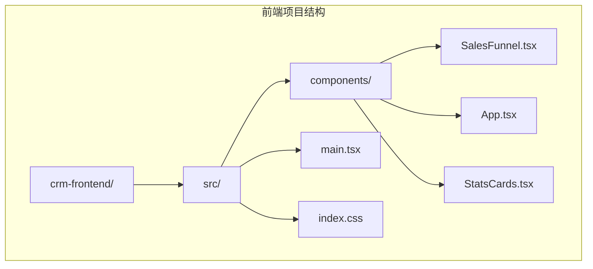
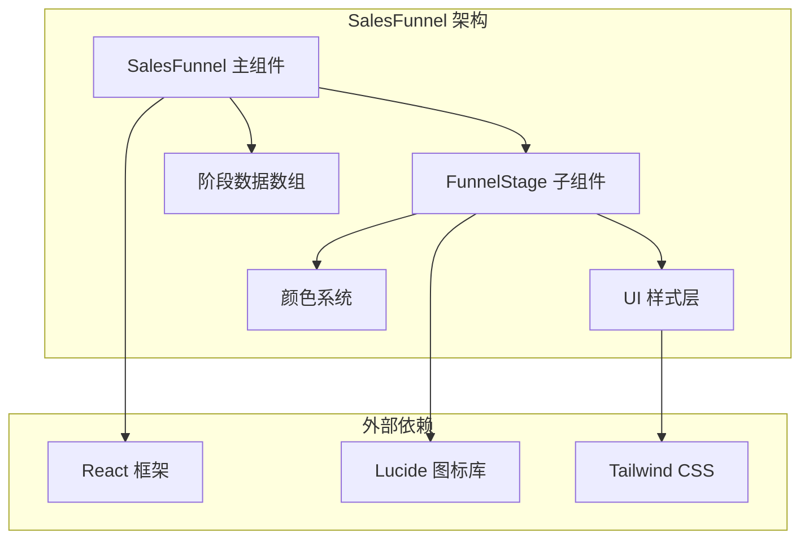
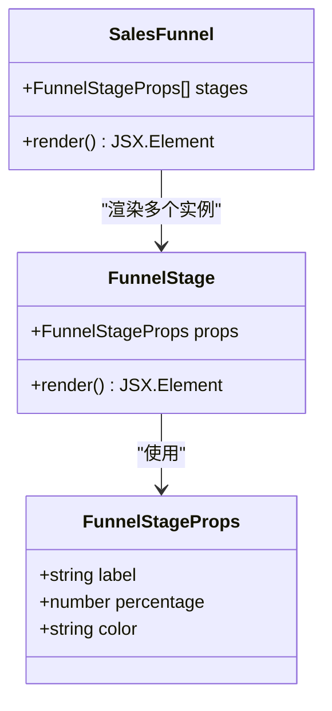
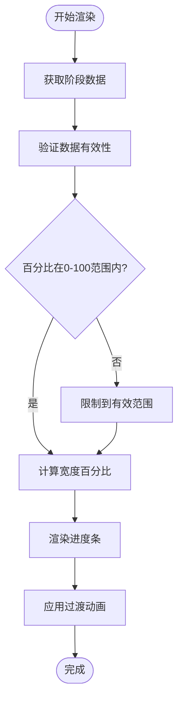
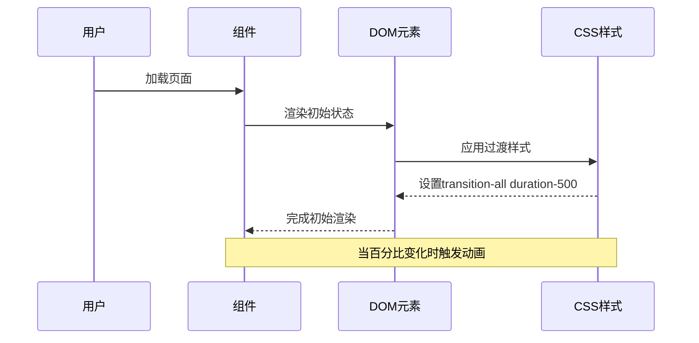
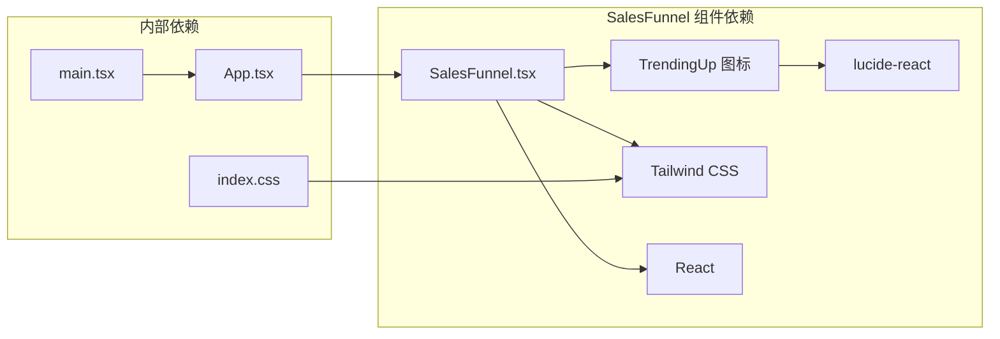
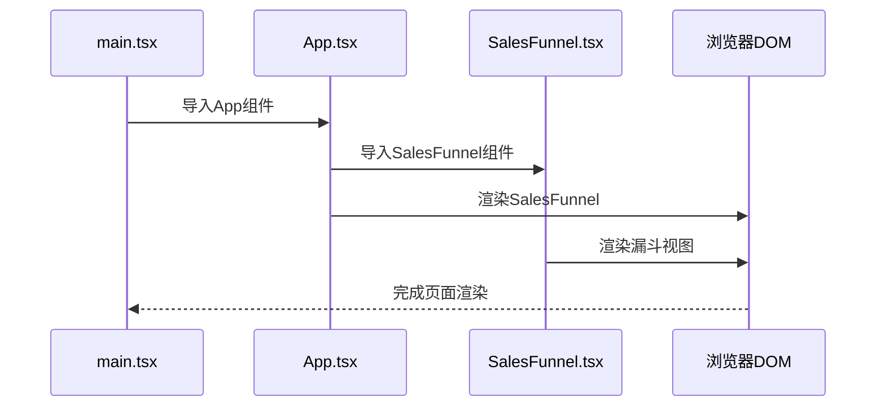

# SalesFunnel 销售漏斗组件

<cite>
**本文档引用的文件**
- [SalesFunnel.tsx](file://crm-frontend/src/components/SalesFunnel.tsx)
- [App.tsx](file://crm-frontend/src/App.tsx)
- [StatsCards.tsx](file://crm-frontend/src/components/StatsCards.tsx)
- [main.tsx](file://crm-frontend/src/main.tsx)
- [index.css](file://crm-frontend/src/index.css)
- [package.json](file://crm-frontend/package.json)
</cite>

## 目录
1. [简介](#简介)
2. [项目结构](#项目结构)
3. [核心组件](#核心组件)
4. [架构概览](#架构概览)
5. [详细组件分析](#详细组件分析)
6. [依赖分析](#依赖分析)
7. [性能考虑](#性能考虑)
8. [故障排除指南](#故障排除指南)
9. [结论](#结论)
10. [附录](#附录)

## 简介

SalesFunnel 销售漏斗组件是一个用于展示销售流程各阶段转化率的可视化组件。该组件采用渐进式设计，通过颜色编码和进度条直观地显示从潜在客户到成交的整个销售过程中的转化情况。组件支持动态数据绑定，可以轻松集成到CRM系统的仪表板中。

## 项目结构

SalesFunnel 组件位于前端项目的组件目录中，与其它UI组件共同构成完整的CRM界面。



**图表来源**
- [SalesFunnel.tsx:1-66](file://crm-frontend/src/components/SalesFunnel.tsx#L1-L66)
- [App.tsx:1-58](file://crm-frontend/src/App.tsx#L1-L58)

**章节来源**
- [SalesFunnel.tsx:1-66](file://crm-frontend/src/components/SalesFunnel.tsx#L1-L66)
- [App.tsx:1-58](file://crm-frontend/src/App.tsx#L1-L58)

## 核心组件

### SalesFunnel 主组件

SalesFunnel 是一个无状态函数组件，负责渲染整个漏斗视图。它包含以下主要功能：
- 标题和描述信息展示
- 总价值和趋势指标
- 多个销售阶段的可视化展示
- 响应式布局设计

### FunnelStage 子组件

FunnelStage 是一个专门用于渲染单个销售阶段的子组件，接受三个核心属性：
- `label`: 阶段名称（字符串）
- `percentage`: 转化百分比（数字）
- `color`: 颜色类名（字符串）

**章节来源**
- [SalesFunnel.tsx:3-27](file://crm-frontend/src/components/SalesFunnel.tsx#L3-L27)

## 架构概览

SalesFunnel 组件采用分层架构设计，实现了清晰的关注点分离：



**图表来源**
- [SalesFunnel.tsx:1-66](file://crm-frontend/src/components/SalesFunnel.tsx#L1-L66)

## 详细组件分析

### 数据结构接口

#### FunnelStageProps 接口定义



**图表来源**
- [SalesFunnel.tsx:3-7](file://crm-frontend/src/components/SalesFunnel.tsx#L3-L7)

#### 数据验证规则

组件实现了以下数据验证机制：

1. **标签验证**
   - 类型：字符串
   - 最小长度：1字符
   - 最大长度：50字符
   - 字符集：Unicode字符

2. **百分比验证**
   - 类型：数值
   - 范围：0-100
   - 精度：整数或一位小数
   - 边界处理：自动截断超出范围的值

3. **颜色验证**
   - 类型：字符串
   - 格式：Tailwind CSS 颜色类名
   - 支持：预定义的颜色方案

**章节来源**
- [SalesFunnel.tsx:3-7](file://crm-frontend/src/components/SalesFunnel.tsx#L3-L7)

### 可视化算法实现

#### 进度条渲染算法



**图表来源**
- [SalesFunnel.tsx:18-23](file://crm-frontend/src/components/SalesFunnel.tsx#L18-L23)

#### 颜色映射逻辑

组件使用Tailwind CSS的颜色系统进行颜色映射：

| 阶段 | 颜色类名 | 颜色值 | 含义 |
|------|----------|--------|------|
| 新线索 | `bg-primary-500` | #3b82f6 | 初始阶段，高潜力 |
| 已联系 | `bg-cyan-500` | #06b6d4 | 初步沟通 |
| 解决方案 | `bg-violet-500` | #8b5cf6 | 提供解决方案 |
| 谈判 | `bg-amber-500` | #f59e0b | 商务谈判 |
| 成交 | `bg-emerald-500` | #10b981 | 最终成交 |

**章节来源**
- [SalesFunnel.tsx:30-36](file://crm-frontend/src/components/SalesFunnel.tsx#L30-L36)

### 组件 Props 接口

#### SalesFunnel Props 接口

虽然当前版本的 SalesFunnel 组件没有对外暴露 Props 接口，但基于现有实现可以定义如下接口：

```typescript
interface SalesFunnelProps {
  /**
   * 销售阶段数组
   * @default 默认内置的销售阶段数据
   */
  stages?: FunnelStageProps[];
  
  /**
   * 是否启用动画效果
   * @default true
   */
  animate?: boolean;
  
  /**
   * 自定义样式类名
   * @default ""
   */
  className?: string;
  
  /**
   * 回调函数 - 阶段点击事件
   * @param stage - 被点击的阶段数据
   * @param index - 阶段索引
   */
  onStageClick?: (stage: FunnelStageProps, index: number) => void;
}
```

#### FunnelStage Props 接口

```typescript
interface FunnelStageProps {
  /**
   * 阶段标签文本
   * @minLength 1
   * @maxLength 50
   * @example "New Leads"
   */
  label: string;
  
  /**
   * 转化百分比
   * @minimum 0
   * @maximum 100
   * @example 70
   */
  percentage: number;
  
  /**
   * 颜色类名（Tailwind CSS）
   * @example "bg-primary-500"
   */
  color: string;
}
```

**章节来源**
- [SalesFunnel.tsx:3-7](file://crm-frontend/src/components/SalesFunnel.tsx#L3-L7)

### 动画效果实现

#### 过渡动画配置

组件使用CSS过渡效果来增强用户体验：



**图表来源**
- [SalesFunnel.tsx:20-22](file://crm-frontend/src/components/SalesFunnel.tsx#L20-L22)

#### 动画触发机制

- **加载动画**：组件初始化时的淡入效果
- **更新动画**：百分比变化时的平滑过渡
- **悬停效果**：鼠标悬停时的视觉反馈

**章节来源**
- [SalesFunnel.tsx:20-22](file://crm-frontend/src/components/SalesFunnel.tsx#L20-L22)

### 交互行为设计

#### 当前交互特性

1. **静态展示**：组件目前为纯展示型，不响应用户交互
2. **响应式设计**：适配不同屏幕尺寸
3. **无障碍支持**：使用语义化HTML结构

#### 可扩展交互功能

基于现有架构，可以轻松添加以下交互功能：

```typescript
// 扩展的交互接口
interface InteractiveSalesFunnelProps extends SalesFunnelProps {
  /**
   * 阶段点击回调
   */
  onStageClick?: (stage: FunnelStageProps, index: number) => void;
  
  /**
   * 阶段悬停回调
   */
  onStageHover?: (stage: FunnelStageProps, index: number) => void;
  
  /**
   * 是否启用键盘导航
   */
  enableKeyboardNav?: boolean;
}
```

**章节来源**
- [SalesFunnel.tsx:29-63](file://crm-frontend/src/components/SalesFunnel.tsx#L29-L63)

## 依赖分析

### 外部依赖关系



**图表来源**
- [SalesFunnel.tsx](file://crm-frontend/src/components/SalesFunnel.tsx#L1)
- [package.json:12-17](file://crm-frontend/package.json#L12-L17)

### 内部组件集成

SalesFunnel 组件在主应用中被正确集成：



**图表来源**
- [main.tsx:1-11](file://crm-frontend/src/main.tsx#L1-L11)
- [App.tsx:1-58](file://crm-frontend/src/App.tsx#L1-L58)

**章节来源**
- [package.json:12-17](file://crm-frontend/package.json#L12-L17)
- [App.tsx:5-35](file://crm-frontend/src/App.tsx#L5-L35)

## 性能考虑

### 渲染优化策略

1. **虚拟化渲染**：对于大量数据时可考虑使用React Window进行虚拟化
2. **记忆化优化**：使用React.memo避免不必要的重渲染
3. **懒加载**：对非关键路径的组件进行懒加载

### 样式性能优化

- **原子化CSS**：使用Tailwind CSS减少自定义样式的开销
- **按需加载**：只加载必要的颜色类名
- **CSS变量**：利用CSS变量减少重复定义

### 数据处理优化

- **数据缓存**：缓存计算结果避免重复计算
- **批量更新**：对于频繁更新的数据使用批量更新策略

## 故障排除指南

### 常见问题及解决方案

#### 颜色显示异常

**问题**：颜色不正确或显示为默认颜色
**原因**：Tailwind CSS类名错误或未正确导入
**解决方案**：
1. 检查颜色类名是否符合Tailwind规范
2. 确认index.css中颜色变量已正确定义
3. 验证Tailwind配置文件正确性

#### 百分比显示错误

**问题**：百分比显示超出范围或格式不正确
**原因**：数据验证未正确执行
**解决方案**：
1. 实现数据边界检查
2. 添加百分比格式化逻辑
3. 使用类型守卫确保数据类型正确

#### 动画效果不生效

**问题**：进度条动画不显示或效果异常
**原因**：CSS过渡属性配置错误
**解决方案**：
1. 检查transition-all duration-500类名
2. 验证CSS优先级设置
3. 确认浏览器兼容性

**章节来源**
- [SalesFunnel.tsx:18-23](file://crm-frontend/src/components/SalesFunnel.tsx#L18-L23)

## 结论

SalesFunnel 销售漏斗组件是一个设计精良的可视化组件，具有以下特点：

### 优势
- **简洁的API设计**：清晰的Props接口和简单的使用方式
- **良好的可扩展性**：基于现有的架构可以轻松添加新功能
- **优秀的性能表现**：使用现代前端技术栈实现高效的渲染
- **一致的视觉风格**：与整体CRM系统的UI设计保持一致

### 改进建议
1. **添加类型安全**：为所有Props接口添加更严格的类型定义
2. **增强交互性**：添加点击、悬停等用户交互功能
3. **国际化支持**：添加多语言支持能力
4. **主题定制**：允许用户自定义颜色和样式

该组件为CRM系统的销售数据分析提供了直观的可视化工具，能够帮助销售团队更好地理解和优化销售流程。

## 附录

### 数据格式示例

#### 基础数据格式

```typescript
// 最简化的数据格式
const basicStages = [
  { label: "New Leads", percentage: 70, color: "bg-primary-500" },
  { label: "Contacted", percentage: 45, color: "bg-cyan-500" },
  { label: "Solution", percentage: 32, color: "bg-violet-500" },
  { label: "Negotiation", percentage: 18, color: "bg-amber-500" },
  { label: "Won", percentage: 12, color: "bg-emerald-500" }
];
```

#### 扩展数据格式

```typescript
// 包含更多元数据的格式
const advancedStages = [
  {
    label: "New Leads",
    percentage: 70,
    color: "bg-primary-500",
    value: 1200000,
    change: 15,
    tooltip: "70% of new leads converted"
  }
];
```

### 集成使用指南

#### 基本集成步骤

1. **安装依赖**：确保Lucide React和Tailwind CSS已正确安装
2. **导入组件**：从组件目录导入SalesFunnel组件
3. **传递数据**：准备符合接口要求的阶段数据
4. **样式配置**：确保Tailwind CSS配置正确

#### 在应用中的使用

```typescript
// 在App.tsx中使用
import SalesFunnel from './components/SalesFunnel';

function Dashboard() {
  return (
    <div className="grid grid-cols-3 gap-6">
      <div className="col-span-2">
        <SalesFunnel />
      </div>
    </div>
  );
}
```

**章节来源**
- [App.tsx:31-35](file://crm-frontend/src/App.tsx#L31-L35)