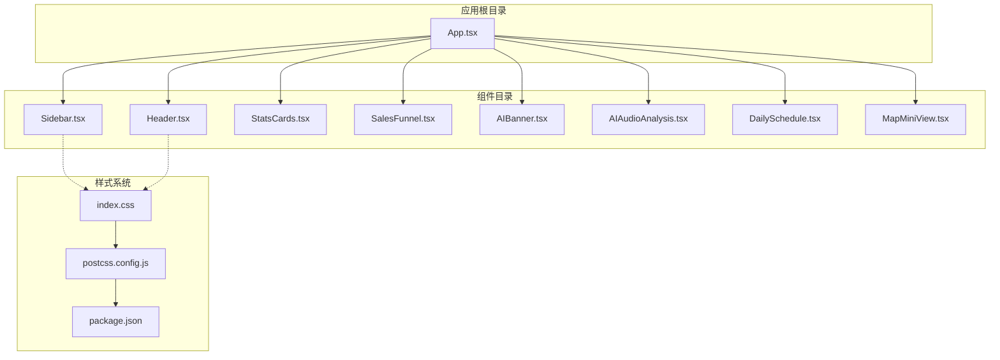
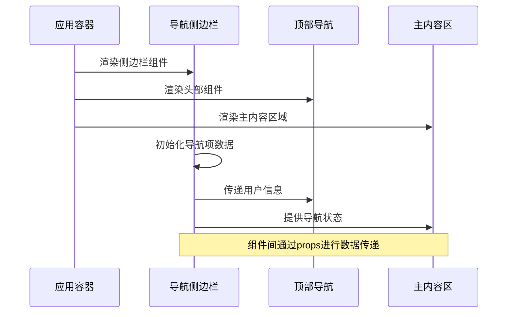
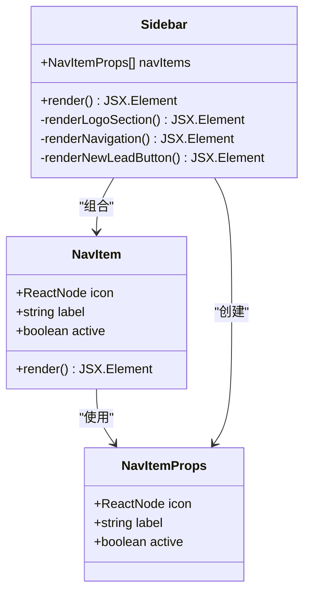
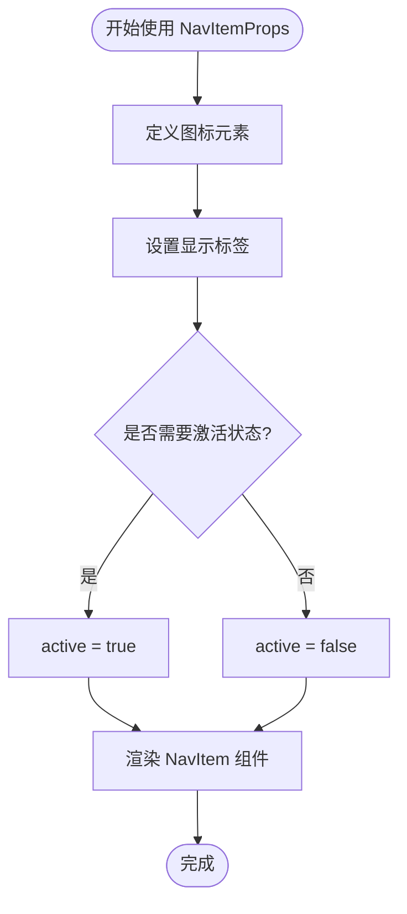
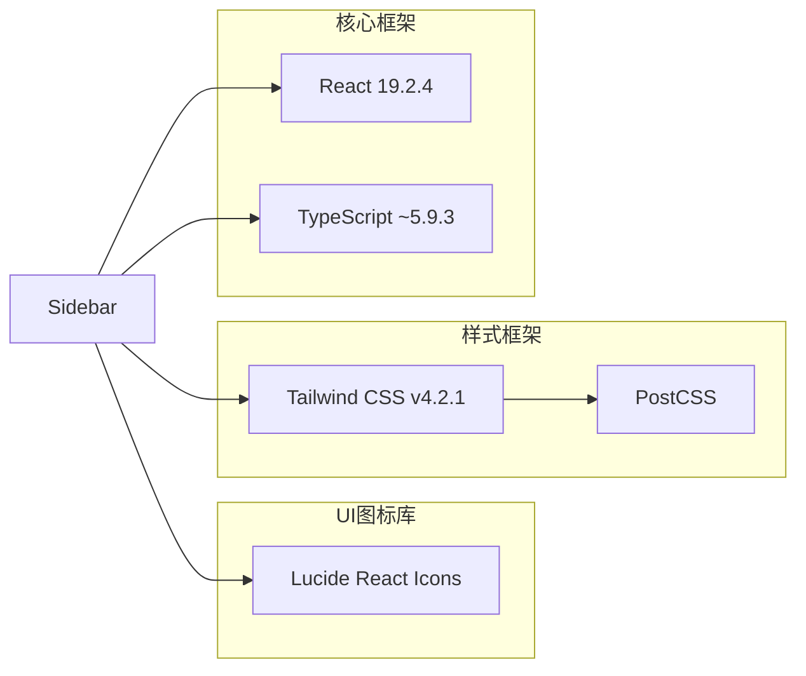

# Sidebar 导航组件

<cite>
**本文档引用的文件**
- [Sidebar.tsx](file://crm-frontend/src/components/Sidebar.tsx)
- [App.tsx](file://crm-frontend/src/App.tsx)
- [Header.tsx](file://crm-frontend/src/components/Header.tsx)
- [index.css](file://crm-frontend/src/index.css)
- [package.json](file://crm-frontend/package.json)
- [postcss.config.js](file://crm-frontend/postcss.config.js)
</cite>

## 目录
1. [简介](#简介)
2. [项目结构](#项目结构)
3. [核心组件](#核心组件)
4. [架构概览](#架构概览)
5. [详细组件分析](#详细组件分析)
6. [依赖关系分析](#依赖关系分析)
7. [性能考虑](#性能考虑)
8. [故障排除指南](#故障排除指南)
9. [结论](#结论)

## 简介

Sidebar导航组件是SalesFlow AI CRM系统中的核心导航界面，采用现代化的React + TypeScript + Tailwind CSS技术栈构建。该组件提供了企业级CRM系统的完整导航解决方案，包括Logo区域、多层级导航菜单和新线索创建功能。

本组件具有以下关键特性：
- 响应式设计，支持桌面端和移动端访问
- 主题化样式系统，基于蓝色主色调的企业视觉识别
- 流畅的动画过渡效果和交互反馈
- 完整的TypeScript类型安全保证
- 模块化的组件架构设计

## 项目结构

Sidebar组件位于前端项目的组件目录中，与应用的主要布局紧密集成：

**图表来源**
- [App.tsx:10-55](file://crm-frontend/src/App.tsx#L10-L55)
- [Sidebar.tsx:37-83](file://crm-frontend/src/components/Sidebar.tsx#L37-L83)

**章节来源**
- [App.tsx:1-58](file://crm-frontend/src/App.tsx#L1-L58)
- [Sidebar.tsx:1-86](file://crm-frontend/src/components/Sidebar.tsx#L1-L86)

## 核心组件

### NavItemProps 接口定义

NavItemProps是Sidebar组件的核心接口，定义了导航项的基本属性结构：

| 属性名 | 类型 | 必需 | 默认值 | 描述 |
|--------|------|------|--------|------|
| icon | React.ReactNode | 是 | - | 导航图标元素，支持所有React节点类型 |
| label | string | 是 | - | 导航项显示文本 |
| active | boolean | 否 | false | 导航项激活状态标志 |

**代码片段路径**
- [NavItemProps接口定义:16-20](file://crm-frontend/src/components/Sidebar.tsx#L16-L20)

### NavItem 子组件实现

NavItem组件实现了完整的导航项渲染逻辑，包含以下特性：

- **动态样式类名**：根据active状态动态切换样式
- **图标容器**：固定尺寸的图标显示区域
- **标签文本**：清晰的导航文本展示
- **过渡动画**：200ms的平滑状态切换效果

**代码片段路径**
- [NavItem组件实现:22-35](file://crm-frontend/src/components/Sidebar.tsx#L22-L35)

### Sidebar 主组件结构

Sidebar组件采用三段式布局设计：

1. **Logo区域**（顶部）：品牌标识和企业名称展示
2. **导航菜单**（中部）：滚动式导航项列表
3. **操作按钮**（底部）：新线索创建入口

**代码片段路径**
- [Sidebar主组件结构:37-83](file://crm-frontend/src/components/Sidebar.tsx#L37-L83)

**章节来源**
- [Sidebar.tsx:16-35](file://crm-frontend/src/components/Sidebar.tsx#L16-L35)
- [Sidebar.tsx:37-83](file://crm-frontend/src/components/Sidebar.tsx#L37-L83)

## 架构概览

Sidebar组件在整个应用架构中扮演着导航中枢的角色，与主应用布局形成完整的用户体验：

**图表来源**
- [App.tsx:10-55](file://crm-frontend/src/App.tsx#L10-L55)
- [Sidebar.tsx:37-83](file://crm-frontend/src/components/Sidebar.tsx#L37-L83)

### 组件关系图

**图表来源**
- [Sidebar.tsx:16-35](file://crm-frontend/src/components/Sidebar.tsx#L16-L35)
- [Sidebar.tsx:37-83](file://crm-frontend/src/components/Sidebar.tsx#L37-L83)

**章节来源**
- [Sidebar.tsx:16-83](file://crm-frontend/src/components/Sidebar.tsx#L16-L83)

## 详细组件分析

### NavItemProps 接口详解

NavItemProps接口提供了完整的导航项类型定义，确保类型安全的开发体验：

#### 类型定义分析

- **icon属性**：使用React.ReactNode类型，支持SVG、图片、自定义组件等所有React节点
- **label属性**：标准字符串类型，用于显示导航文本
- **active属性**：可选布尔值，默认false，控制导航项的激活状态

#### 使用模式

**图表来源**
- [Sidebar.tsx:16-20](file://crm-frontend/src/components/Sidebar.tsx#L16-L20)

**代码片段路径**
- [NavItemProps完整定义:16-20](file://crm-frontend/src/components/Sidebar.tsx#L16-L20)

### NavItem 子组件实现细节

NavItem组件实现了响应式的导航项渲染逻辑：

#### 样式类名系统

组件使用条件渲染的方式动态切换样式类名：

- **激活状态**：`bg-primary-500 text-white`
- **非激活状态**：`text-gray-600 hover:bg-gray-100`

#### 交互行为

- **点击事件**：作为button元素提供点击交互
- **悬停效果**：hover状态下背景色变化
- **过渡动画**：200ms的平滑状态切换

**代码片段路径**
- [NavItem样式逻辑:24-34](file://crm-frontend/src/components/Sidebar.tsx#L24-L34)

### Sidebar 组件整体结构

Sidebar组件采用Flexbox布局，实现了完整的侧边栏UI结构：

#### Logo区域设计

- **品牌标识**：深蓝色背景的圆形徽标
- **标题文本**：白色粗体字显示"SalesFlow"
- **副标题**：浅蓝色字体显示"AI CRM Enterprise"

#### 导航菜单实现

- **滚动容器**：支持大量导航项的垂直滚动
- **间距控制**：每个导航项之间1单位的垂直间距
- **溢出处理**：超出高度时自动显示滚动条

#### 新线索按钮

- **位置固定**：始终位于侧边栏底部
- **视觉强调**：使用主色调的阴影效果
- **交互反馈**：悬停时颜色加深

**代码片段路径**
- [Logo区域实现:52-60](file://crm-frontend/src/components/Sidebar.tsx#L52-L60)
- [导航菜单实现:62-72](file://crm-frontend/src/components/Sidebar.tsx#L62-L72)
- [新线索按钮实现:74-80](file://crm-frontend/src/components/Sidebar.tsx#L74-L80)

**章节来源**
- [Sidebar.tsx:37-83](file://crm-frontend/src/components/Sidebar.tsx#L37-L83)

## 依赖关系分析

### 外部依赖

Sidebar组件依赖于以下关键外部库：

**图表来源**
- [package.json:12-17](file://crm-frontend/package.json#L12-L17)
- [Sidebar.tsx:1-14](file://crm-frontend/src/components/Sidebar.tsx#L1-L14)

### 内部依赖关系

Sidebar组件在应用中的依赖关系：

- **App.tsx**：主要的应用容器组件，负责布局组织
- **Header.tsx**：顶部导航组件，与Sidebar形成完整的界面布局
- **样式系统**：通过index.css和Tailwind配置提供统一的样式基础

**代码片段路径**
- [应用布局集成:10-55](file://crm-frontend/src/App.tsx#L10-L55)

**章节来源**
- [package.json:12-35](file://crm-frontend/package.json#L12-L35)
- [Sidebar.tsx:1-14](file://crm-frontend/src/components/Sidebar.tsx#L1-L14)

## 性能考虑

### 渲染优化

- **组件拆分**：将NavITem拆分为独立组件，提高渲染效率
- **条件渲染**：根据active状态动态选择样式，避免不必要的DOM操作
- **固定尺寸**：图标容器使用固定宽高，减少布局重排

### 样式优化

- **原子化设计**：使用Tailwind的原子类，减少CSS文件大小
- **主题变量**：通过CSS自定义属性实现主题的一致性
- **过渡动画**：仅对必要的属性添加过渡效果

### 可访问性

- **语义化标签**：使用button元素提供正确的语义
- **键盘导航**：原生button支持键盘操作
- **颜色对比度**：确保激活状态的颜色对比度符合标准

## 故障排除指南

### 常见问题及解决方案

#### 图标不显示问题

**症状**：导航项图标显示为空白或错误

**可能原因**：
- Lucide图标导入错误
- 图标尺寸设置不当
- SVG渲染问题

**解决方案**：
- 确认图标从'lucide-react'正确导入
- 检查图标size属性设置
- 验证SVG元素的兼容性

#### 样式不生效问题

**症状**：组件样式显示异常或主题不一致

**可能原因**：
- Tailwind CSS配置问题
- CSS优先级冲突
- 主题变量未正确设置

**解决方案**：
- 检查postcss.config.js配置
- 验证index.css中的主题变量定义
- 确认Tailwind版本兼容性

#### 响应式布局问题

**症状**：在不同屏幕尺寸下布局错乱

**可能原因**：
- Flexbox属性设置不当
- 移动端断点配置缺失
- 容器高度计算错误

**解决方案**：
- 检查flex-direction和align-items属性
- 添加适当的移动端断点
- 验证vh/vw单位的使用

**章节来源**
- [index.css:1-66](file://crm-frontend/src/index.css#L1-L66)
- [postcss.config.js:1-6](file://crm-frontend/postcss.config.js#L1-L6)

## 结论

Sidebar导航组件是一个设计精良、功能完整的React组件，具备以下优势：

### 技术优势
- **类型安全**：完整的TypeScript接口定义，确保开发时的类型安全
- **模块化设计**：清晰的组件分离，便于维护和扩展
- **样式一致性**：基于Tailwind的原子化设计，保证视觉统一性
- **响应式支持**：完善的移动端适配方案

### 设计特色
- **企业级外观**：专业的蓝色主题，符合企业CRM系统的定位
- **流畅交互**：精心设计的过渡动画和状态反馈
- **可扩展性**：良好的架构设计支持功能扩展

### 最佳实践建议
- 在生产环境中建议添加状态管理机制
- 考虑添加路由集成以支持页面导航
- 实现本地化支持以适应多语言环境
- 添加加载状态和错误边界以提升用户体验

该组件为SalesFlow AI CRM系统提供了坚实的基础导航框架，为后续的功能扩展和界面优化奠定了良好的技术基础。