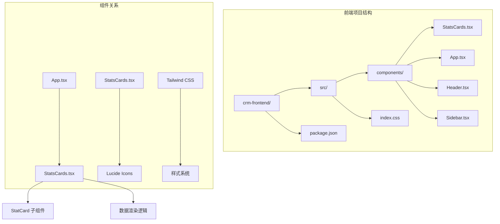
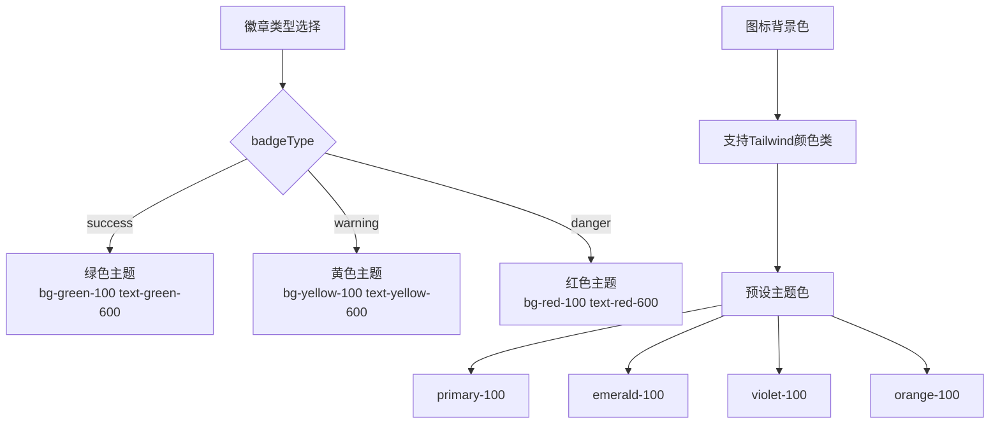
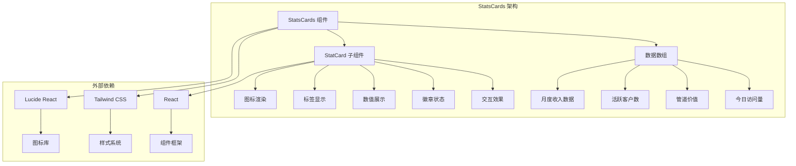
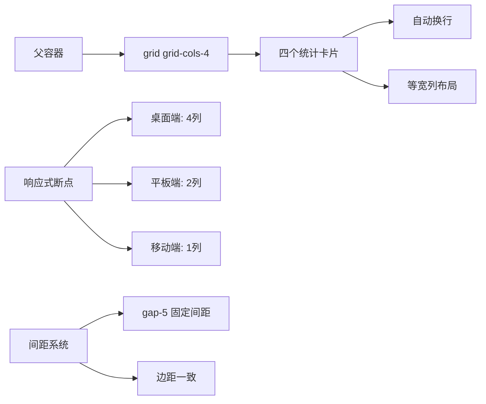
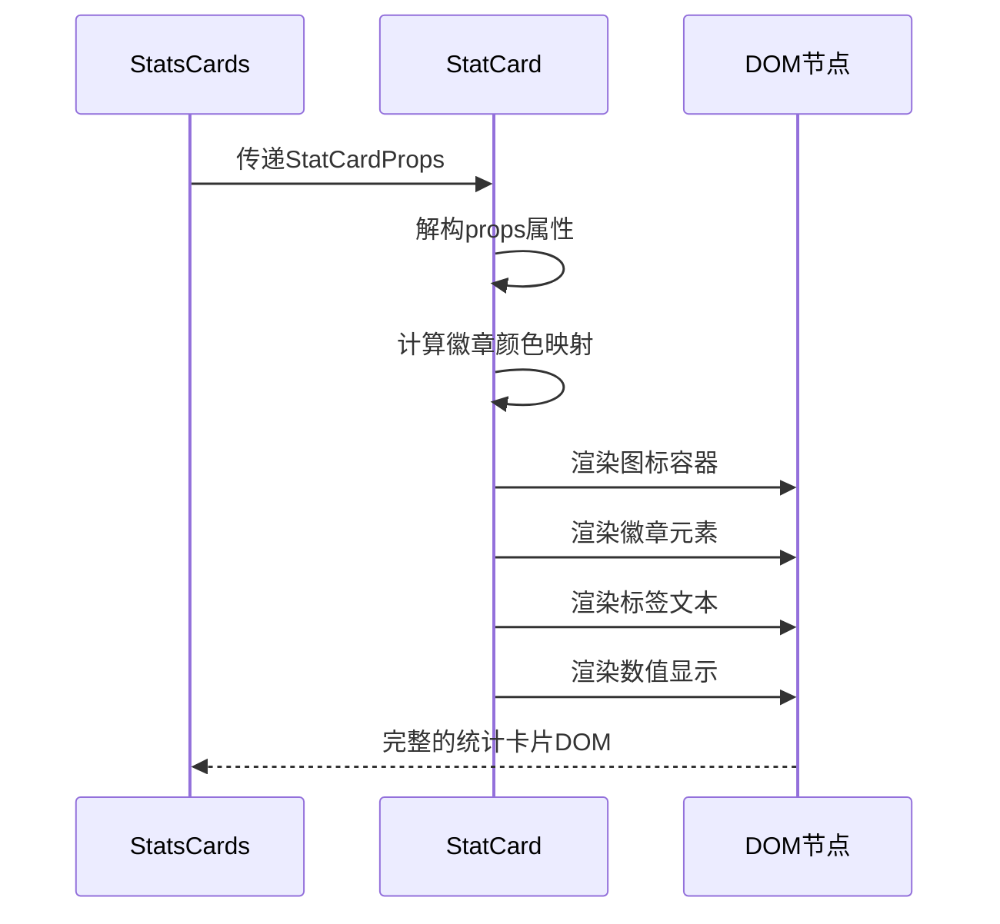
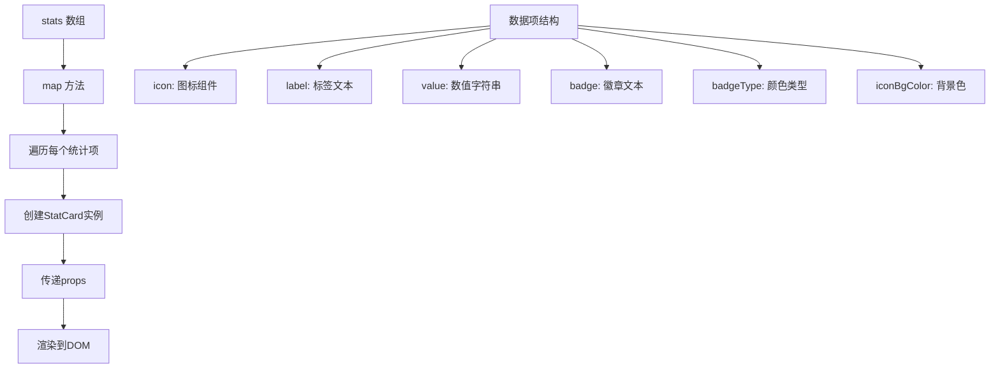
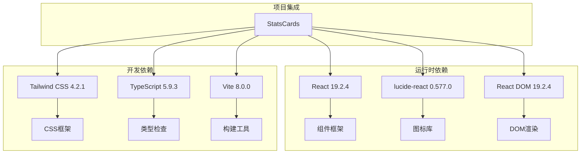
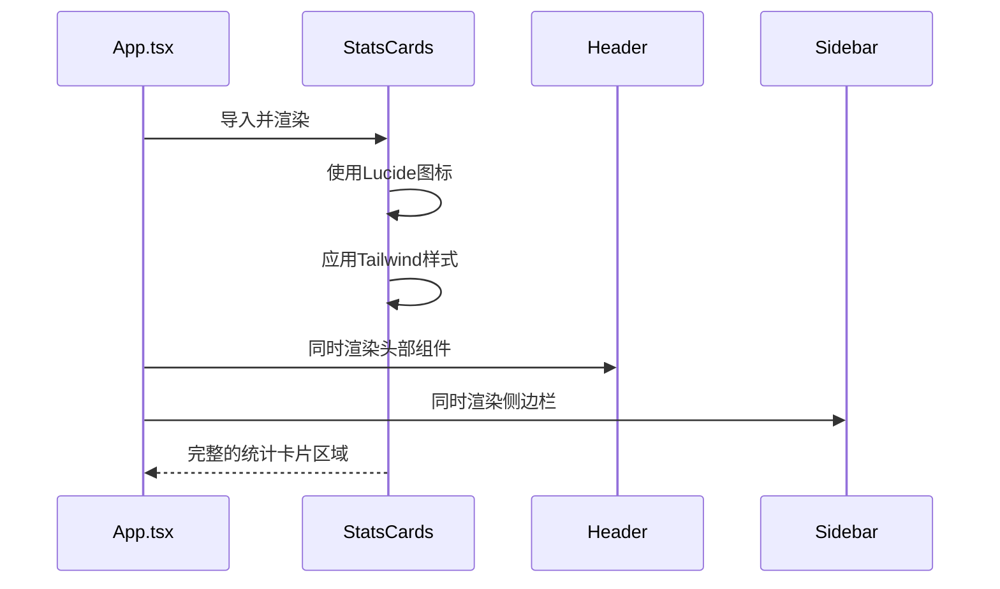

# StatsCards 统计卡片组件

<cite>
**本文档引用的文件**
- [StatsCards.tsx](file://crm-frontend/src/components/StatsCards.tsx)
- [App.tsx](file://crm-frontend/src/App.tsx)
- [package.json](file://crm-frontend/package.json)
- [index.css](file://crm-frontend/src/index.css)
- [Header.tsx](file://crm-frontend/src/components/Header.tsx)
- [Sidebar.tsx](file://crm-frontend/src/components/Sidebar.tsx)
</cite>

## 目录
1. [简介](#简介)
2. [项目结构](#项目结构)
3. [核心组件](#核心组件)
4. [架构概览](#架构概览)
5. [详细组件分析](#详细组件分析)
6. [依赖关系分析](#依赖关系分析)
7. [性能考虑](#性能考虑)
8. [故障排除指南](#故障排除指南)
9. [结论](#结论)

## 简介

StatsCards 是一个用于展示关键业务指标的统计卡片组件，采用现代化的设计理念和响应式布局。该组件提供了统一的数据模型接口，支持多种图标、标签、数值和徽章类型的组合展示，适用于销售CRM系统的仪表板界面。

组件基于React和TypeScript构建，使用Tailwind CSS进行样式设计，并集成了Lucide React图标库来提供丰富的视觉元素。每个统计卡片都包含图标区域、标签文本、数值显示和状态徽章，形成完整的数据可视化界面。

## 项目结构

StatsCards组件位于前端项目的组件目录中，与应用的主要入口文件协同工作，形成完整的用户界面架构。



**图表来源**
- [StatsCards.tsx:1-81](file://crm-frontend/src/components/StatsCards.tsx#L1-L81)
- [App.tsx:1-58](file://crm-frontend/src/App.tsx#L1-L58)

**章节来源**
- [StatsCards.tsx:1-81](file://crm-frontend/src/components/StatsCards.tsx#L1-L81)
- [App.tsx:1-58](file://crm-frontend/src/App.tsx#L1-L58)

## 核心组件

### 数据模型接口

StatsCards组件的核心是其数据模型接口，定义了统计卡片所需的所有属性。以下是完整的接口定义：

```mermaid
classDiagram
class StatCardProps {
+React.ReactNode icon
+string label
+string value
+string badge
+BadgeType badgeType
+string iconBgColor
}
class BadgeType {
<<enumeration>>
"success"
"warning"
"danger"
}
class StatCard {
+render() JSX.Element
-badgeColors : object
}
StatCardProps --> BadgeType : uses
StatCard --> StatCardProps : renders
```

**图表来源**
- [StatsCards.tsx:3-10](file://crm-frontend/src/components/StatsCards.tsx#L3-L10)

### 接口属性详解

| 属性名 | 类型 | 必需 | 默认值 | 描述 |
|--------|------|------|--------|------|
| icon | React.ReactNode | 是 | - | 图标组件，支持所有Lucide React图标 |
| label | string | 是 | - | 卡片标题文本，描述数据含义 |
| value | string | 是 | - | 主要数值显示，支持货币符号和格式化 |
| badge | string | 是 | - | 徽章文本，显示变化趋势或状态 |
| badgeType | 'success' \| 'warning' \| 'danger' | 是 | - | 徽章颜色主题类型 |
| iconBgColor | string | 是 | - | 图标背景色类名，使用Tailwind颜色系统 |

### 颜色主题系统

组件实现了完整的颜色主题系统，通过badgeType属性控制徽章的颜色：



**图表来源**
- [StatsCards.tsx:13-17](file://crm-frontend/src/components/StatsCards.tsx#L13-L17)

**章节来源**
- [StatsCards.tsx:3-10](file://crm-frontend/src/components/StatsCards.tsx#L3-L10)
- [StatsCards.tsx:13-17](file://crm-frontend/src/components/StatsCards.tsx#L13-L17)

## 架构概览

StatsCards组件采用了清晰的分层架构，将数据展示逻辑与业务逻辑分离：



**图表来源**
- [StatsCards.tsx:35-78](file://crm-frontend/src/components/StatsCards.tsx#L35-L78)

### 布局算法

组件使用CSS Grid布局算法实现响应式排列：



**图表来源**
- [StatsCards.tsx:72](file://crm-frontend/src/components/StatsCards.tsx#L72)

**章节来源**
- [StatsCards.tsx:35-78](file://crm-frontend/src/components/StatsCards.tsx#L35-L78)

## 详细组件分析

### StatCard 子组件

StatCard是StatsCards的核心子组件，负责单个统计卡片的渲染：



**图表来源**
- [StatsCards.tsx:12-33](file://crm-frontend/src/components/StatsCards.tsx#L12-L33)

### 数据渲染流程

组件采用map方法遍历数据数组，动态生成多个统计卡片：



**图表来源**
- [StatsCards.tsx:36-69](file://crm-frontend/src/components/StatsCards.tsx#L36-L69)

**章节来源**
- [StatsCards.tsx:12-33](file://crm-frontend/src/components/StatsCards.tsx#L12-L33)
- [StatsCards.tsx:36-69](file://crm-frontend/src/components/StatsCards.tsx#L36-L69)

### 样式系统分析

组件的样式系统基于Tailwind CSS，实现了完整的响应式设计：

| 样式类 | 功能 | 响应式行为 |
|--------|------|------------|
| `bg-white` | 白色背景 | 固定 |
| `rounded-xl` | 圆角边框 | 固定 |
| `border border-gray-200` | 边框样式 | 固定 |
| `p-5` | 内边距 | 固定 |
| `shadow-sm` | 浅阴影 | 固定 |
| `hover:shadow-md` | 悬停阴影 | 固定 |
| `transition-shadow` | 过渡动画 | 固定 |
| `grid grid-cols-4` | 四列网格 | 固定 |
| `gap-5` | 间距 | 固定 |

**章节来源**
- [StatsCards.tsx:19-31](file://crm-frontend/src/components/StatsCards.tsx#L19-L31)
- [StatsCards.tsx:72](file://crm-frontend/src/components/StatsCards.tsx#L72)

## 依赖关系分析

### 外部依赖

StatsCards组件依赖于以下外部库：



**图表来源**
- [package.json:12-35](file://crm-frontend/package.json#L12-L35)

### 内部集成

组件在应用中的集成方式：



**图表来源**
- [App.tsx:3](file://crm-frontend/src/App.tsx#L3)
- [App.tsx:25](file://crm-frontend/src/App.tsx#L25)

**章节来源**
- [package.json:12-35](file://crm-frontend/package.json#L12-L35)
- [App.tsx:1-58](file://crm-frontend/src/App.tsx#L1-L58)

## 性能考虑

### 渲染优化

组件采用了高效的渲染策略：
- 使用React的key属性确保列表项的稳定更新
- 采用函数式组件减少不必要的状态管理
- 利用Tailwind CSS的原子化设计避免样式计算开销

### 内存管理

组件的内存使用特点：
- 每个StatCard实例占用少量内存
- 图标组件按需加载，不使用时不会占用内存
- 颜色映射对象在组件初始化时创建一次

### 响应式性能

布局算法的性能特征：
- CSS Grid布局由浏览器原生优化
- 响应式断点切换无JavaScript计算开销
- 悬停效果使用纯CSS实现，性能优异

## 故障排除指南

### 常见问题及解决方案

| 问题类型 | 症状 | 可能原因 | 解决方案 |
|----------|------|----------|----------|
| 图标不显示 | 统计卡片空白 | lucide-react未正确安装 | 检查package.json依赖 |
| 颜色异常 | 徽章颜色错误 | Tailwind颜色类名错误 | 验证iconBgColor属性 |
| 布局错乱 | 卡片位置不对 | CSS类名冲突 | 检查全局样式影响 |
| 性能问题 | 页面卡顿 | 数据量过大 | 考虑虚拟滚动或分页 |

### 错误处理机制

组件的错误处理策略：
- 类型检查：通过TypeScript确保props类型正确
- 默认值：badgeType枚举限制有效值范围
- 边界情况：空数据时优雅降级显示

**章节来源**
- [StatsCards.tsx:3-10](file://crm-frontend/src/components/StatsCards.tsx#L3-L10)

## 结论

StatsCards统计卡片组件是一个设计精良、功能完整的数据可视化组件。它通过清晰的接口设计、灵活的颜色主题系统和响应式的布局算法，为销售CRM系统提供了优秀的数据展示能力。

组件的主要优势包括：
- **类型安全**：完整的TypeScript接口定义
- **主题灵活**：支持多种颜色主题和自定义样式
- **响应式设计**：适应不同屏幕尺寸的布局
- **易于扩展**：模块化的组件结构便于功能扩展

该组件可以作为其他类似统计卡片组件的参考实现，其设计理念和代码结构体现了现代前端开发的最佳实践。