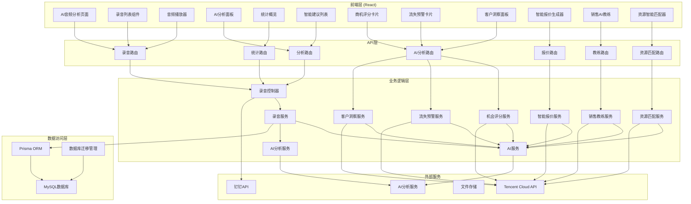
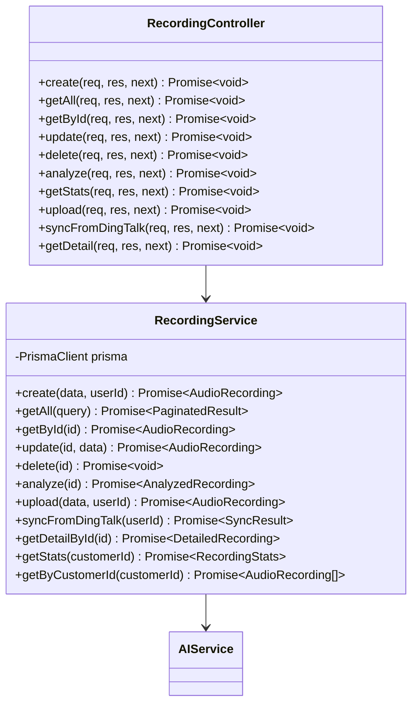
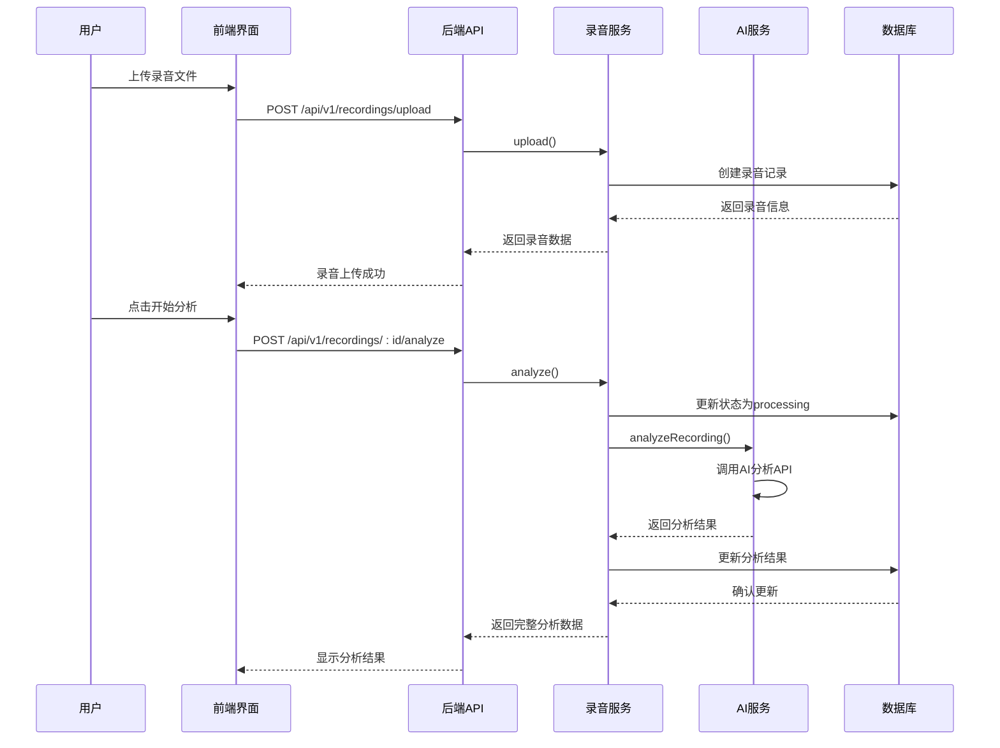
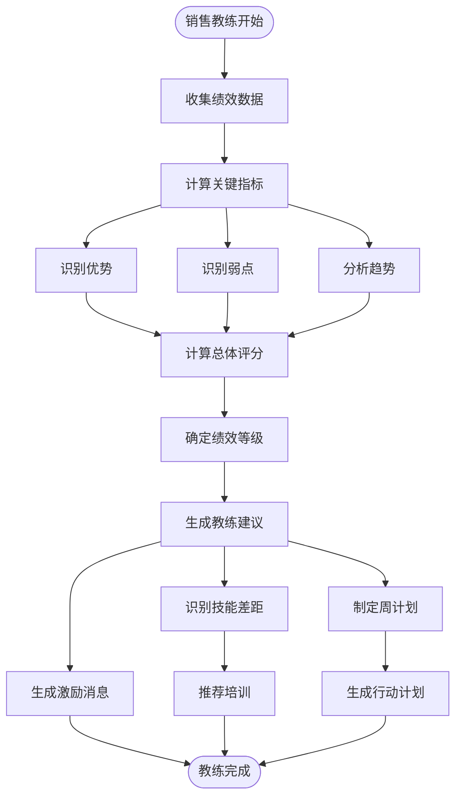
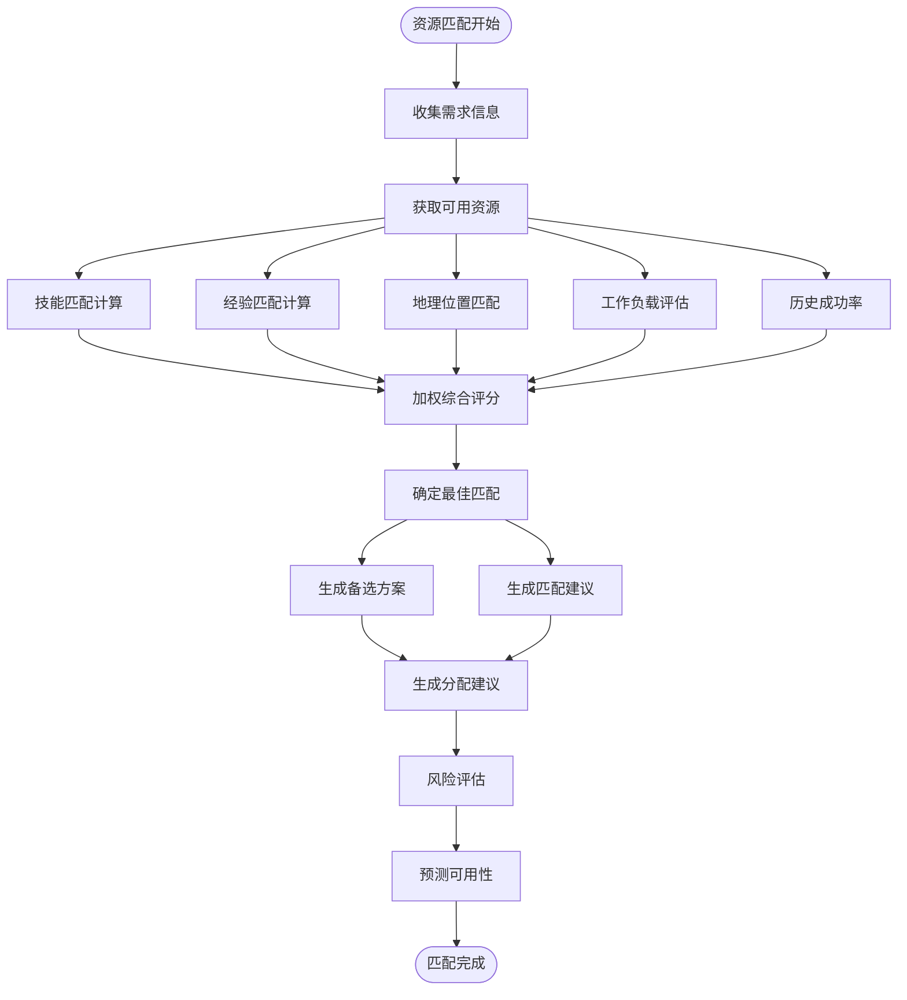
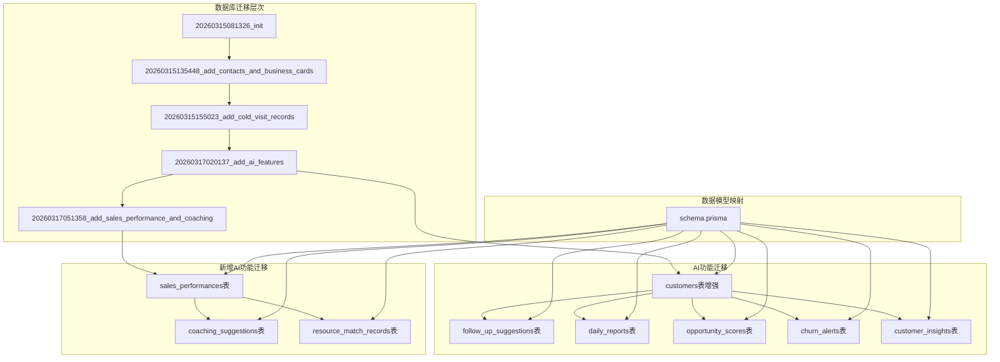
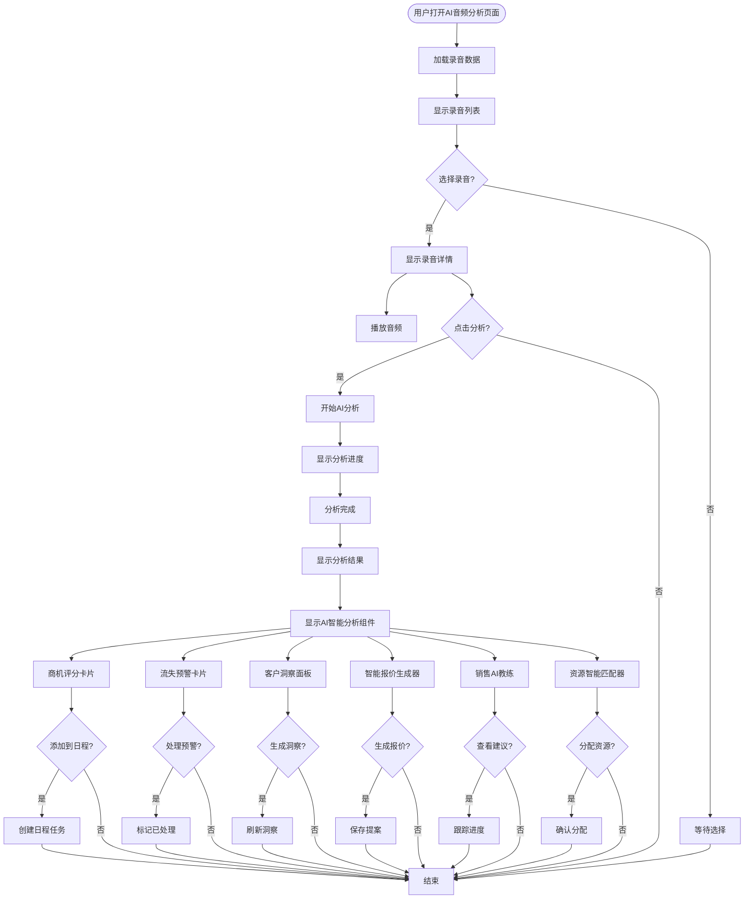
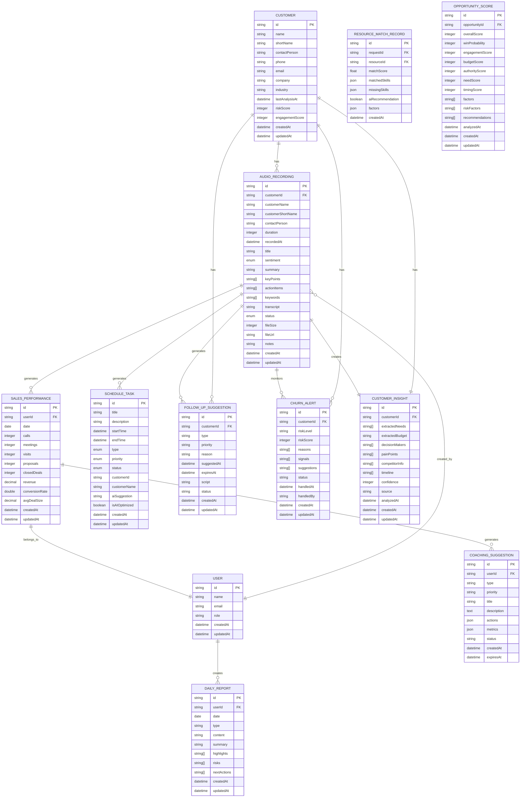

# AI音频分析

<cite>
**本文档引用的文件**
- [ai.service.ts](file://crm-backend/src/services/ai.service.ts)
- [opportunityScoring.ts](file://crm-backend/src/services/ai/opportunityScoring.ts)
- [churnAnalysis.ts](file://crm-backend/src/services/ai/churnAnalysis.ts)
- [reportGeneration.ts](file://crm-backend/src/services/ai/reportGeneration.ts)
- [resourceMatching.ts](file://crm-backend/src/services/ai/resourceMatching.ts)
- [salesCoach.ts](file://crm-backend/src/services/ai/salesCoach.ts)
- [proposalAI.ts](file://crm-backend/src/services/ai/proposalAI.ts)
- [index.ts](file://crm-backend/src/services/ai/index.ts)
- [recording.controller.ts](file://crm-backend/src/controllers/recording.controller.ts)
- [recording.service.ts](file://crm-backend/src/services/recording.service.ts)
- [recordings.routes.ts](file://crm-backend/src/routes/recordings.routes.ts)
- [recording.validator.ts](file://crm-backend/src/validators/recording.validator.ts)
- [index.ts](file://crm-backend/src/config/index.ts)
- [app.ts](file://crm-backend/src/app.ts)
- [index.tsx](file://crm-frontend/src/pages/AIAudio/index.tsx)
- [AIAnalysisPanel.tsx](file://crm-frontend/src/pages/AIAudio/components/AIAnalysisPanel.tsx)
- [AudioPlayer.tsx](file://crm-frontend/src/pages/AIAudio/components/AudioPlayer.tsx)
- [RecordingList.tsx](file://crm-frontend/src/pages/AIAudio/components/RecordingList.tsx)
- [OpportunityScoreCard.tsx](file://crm-frontend/src/components/AI/OpportunityScoreCard.tsx)
- [ChurnAlertCard.tsx](file://crm-frontend/src/components/AI/ChurnAlertCard.tsx)
- [CustomerInsightPanel.tsx](file://crm-frontend/src/components/AI/CustomerInsightPanel.tsx)
- [index.ts](file://crm-frontend/src/types/index.ts)
- [package.json](file://crm-backend/package.json)
- [schema.prisma](file://crm-backend/prisma/schema.prisma)
- [20260317020137_add_ai_features/migration.sql](file://crm-backend/prisma/migrations/20260317020137_add_ai_features/migration.sql)
- [20260315081326_init/migration.sql](file://crm-backend/prisma/migrations/20260315081326_init/migration.sql)
- [20260315135448_add_contacts_and_business_cards/migration.sql](file://crm-backend/prisma/migrations/20260315135448_add_contacts_and_business_cards/migration.sql)
- [20260315155023_add_cold_visit_records/migration.sql](file://crm-backend/prisma/migrations/20260315155023_add_cold_visit_records/migration.sql)
- [20260317051358_add_sales_performance_and_coaching/migration.sql](file://crm-backend/prisma/migrations/20260317051358_add_sales_performance_and_coaching/migration.sql)
</cite>

## 更新摘要
**变更内容**
- 新增AI智能分析功能：智能报价与提案生成、销售绩效AI教练、售前资源智能匹配三大AI功能模块
- 扩展AI服务架构，增加报价生成、方案设计、教练建议、资源匹配等高级AI分析功能
- 更新数据库迁移和AI功能相关组件的详细说明，新增销售绩效、教练建议、资源匹配记录表
- 增强AI分析结果的数据持久化机制，支持完整的AI助手功能集合
- 更新前端界面与AI功能的集成说明，支持智能报价、AI教练、资源匹配等功能

## 目录
1. [项目概述](#项目概述)
2. [系统架构](#系统架构)
3. [核心组件分析](#核心组件分析)
4. [AI音频分析流程](#ai音频分析流程)
5. [AI智能分析功能](#ai智能分析功能)
6. [数据库迁移与版本管理](#数据库迁移与版本管理)
7. [前端界面设计](#前端界面设计)
8. [数据模型](#数据模型)
9. [API接口设计](#api接口设计)
10. [性能考虑](#性能考虑)
11. [故障排除指南](#故障排除指南)
12. [总结](#总结)

## 项目概述

销售AI CRM系统是一个基于现代Web技术栈构建的企业级客户关系管理系统。该系统的核心功能之一是AI音频分析，能够自动分析销售通话录音，提取关键信息并生成智能化的销售建议。

### 主要特性

- **智能语音分析**：自动识别通话情感、提取关键词和关键点
- **销售洞察**：分析客户心理状态和购买意向
- **自动化建议**：基于分析结果生成具体的行动建议
- **多格式支持**：支持MP3、WAV、M4A等多种音频格式
- **钉钉集成**：支持从钉钉平台同步录音数据
- **实时播放**：内置音频播放器支持多种播放控制
- **AI功能扩展**：支持客户洞察、流失预警、商机评分等AI功能
- **智能分析系统**：提供机会评分、客户流失预警、智能客户洞察等高级AI分析功能
- **智能报价生成**：基于客户信息和市场行情生成智能报价建议
- **AI教练建议**：提供个性化的销售绩效改进指导
- **资源智能匹配**：自动匹配最适合的售前资源和专家团队

## 系统架构

系统采用前后端分离的架构设计，后端使用Node.js + Express框架，前端使用React + TypeScript构建。



**图表来源**
- [app.ts:74-78](file://crm-backend/src/app.ts#L74-L78)
- [recordings.routes.ts:12-355](file://crm-backend/src/routes/recordings.routes.ts#L12-L355)
- [index.ts:37-55](file://crm-backend/src/services/ai/index.ts#L37-L55)

## 核心组件分析

### AI服务组件

AI服务是整个系统的核心组件，负责处理所有AI相关的分析功能。

```mermaid
classDiagram
class AIService {
+analyzeRecording(audioUrl, duration, customerInfo) Promise~AIAnalysisResult~
+transcribeAudio(audioUrl) Promise~string~
+analyzeSentiment(text) Promise~SentimentType~
+extractKeywords(text) Promise~string[]~
+generateSummary(text, keywords) Promise~string~
+analyzeCompany(companyName, imageUrl) Promise~CompanyIntelligenceResult~
+callRealAI(audioUrl, duration, customerInfo) Promise~AIAnalysisResult~
-mockAnalysis(duration, customerInfo) Promise~AIAnalysisResult~
-generateMockResult(duration, customerInfo) AIAnalysisResult
-generateMockCompanyIntelligence(companyName) CompanyIntelligenceResult
}
class AIAnalysisResult {
+string transcript
+SentimentType sentiment
+string[] keywords
+string[] keyPoints
+string[] actionItems
+string summary
+psychology : Psychology
+suggestions : Suggestion[]
}
class CompanyIntelligenceResult {
+basicInfo : BasicInfo
+string[] businessScope
+News[] recentNews
+Contact[] keyContacts
+SalesPitch salesPitch
}
class ProposalAIService {
+generateSmartQuotation(input) Promise~SmartQuotationResult~
+generateProposalContent(input) Promise~ProposalGenerationResult~
-analyzePricingFactors(input, benchmark) PricingFactors[]
-calculateDiscountStrategy(input, price, benchmark) DiscountStrategy
-generateExecutiveSummary(input) string
-generateProblemStatement(input) string
-generateProposedSolution(input) string
-generateProductRecommendations(input) ProductRecommendation[]
-generateImplementationPlan(input) ImplementationPlan[]
-generateServiceLevel() ServiceLevel
-calculateROI(input, products) ROIProjection
}
class SalesCoachService {
+analyzePerformance(input) Promise~PerformanceAnalysisResult~
+generateCoachingSuggestions(input) Promise~CoachingSuggestionResult~
+identifySkillGaps(performanceAnalysis, skillAssessment) Promise~SkillGapAnalysisResult~
-predictPerformanceTrend(historicalData) Promise~PredictionResult~
-calculateMetrics(input) Metrics
-identifyStrengths(input, metrics) Strength[]
-identifyWeaknesses(input, metrics) Weakness[]
-analyzeTrends(input, metrics) Trends
-calculateOverallScore(metrics, strengths, weaknesses) number
-generateSuggestions(input) Suggestion[]
-generateWeeklyPlan(input) WeeklyPlan
-generateMotivationMessage(input) string
}
class ResourceMatchingService {
+matchResources(input, availableResources) Promise~ResourceMatchingResult~
+generateAssignmentRecommendation(input) Promise~AssignmentRecommendationResult~
-predictResourceAvailability(resourceId, futureDate) Promise~AvailabilityPrediction~
-optimizeResourceAllocation(requests, resources) Promise~Assignment[]~
-calculateSkillMatch(requiredSkills, resourceSkills) ScoreDetails
-calculateExperienceMatch(input, resource) ScoreDetails
-calculateLocationMatch(requestLocation, resourceLocation) ScoreDetails
-calculateWorkloadFit(resource) ScoreDetails
-calculateSuccessHistory(resource) ScoreDetails
}
AIService --> AIAnalysisResult
AIService --> CompanyIntelligenceResult
ProposalAIService --> AIAnalysisResult
SalesCoachService --> AIAnalysisResult
ResourceMatchingService --> AIAnalysisResult
```



**图表来源**
- [ai.service.ts:79-564](file://crm-backend/src/services/ai.service.ts#L79-L564)
- [proposalAI.ts:53-154](file://crm-backend/src/services/ai/proposalAI.ts#L53-L154)
- [salesCoach.ts:51-138](file://crm-backend/src/services/ai/salesCoach.ts#L51-L138)
- [resourceMatching.ts:44-92](file://crm-backend/src/services/ai/resourceMatching.ts#L44-L92)

### 录音服务组件

录音服务负责处理录音相关的业务逻辑，包括存储、分析和管理。



**图表来源**
- [recording.service.ts:9-455](file://crm-backend/src/services/recording.service.ts#L9-L455)
- [recording.controller.ts:46-230](file://crm-backend/src/controllers/recording.controller.ts#L46-L230)

**章节来源**
- [ai.service.ts:79-564](file://crm-backend/src/services/ai.service.ts#L79-L564)
- [recording.service.ts:9-455](file://crm-backend/src/services/recording.service.ts#L9-L455)
- [recording.controller.ts:46-230](file://crm-backend/src/controllers/recording.controller.ts#L46-L230)

## AI音频分析流程

系统提供了完整的AI音频分析工作流程，从录音上传到最终的分析结果展示。



**图表来源**
- [recording.controller.ts:129-137](file://crm-backend/src/controllers/recording.controller.ts#L129-L137)
- [recording.service.ts:145-208](file://crm-backend/src/services/recording.service.ts#L145-L208)
- [ai.service.ts:86-98](file://crm-backend/src/services/ai.service.ts#L86-L98)

### 分析流程详细说明

1. **录音上传**：用户通过前端界面上传音频文件，系统验证文件格式和大小
2. **状态初始化**：录音记录创建时状态设置为"pending"
3. **AI分析触发**：用户点击分析按钮，系统调用AI分析服务
4. **状态更新**：分析开始前将状态更新为"processing"
5. **AI处理**：调用AI服务进行语音转文字、情感分析、关键词提取等
6. **结果保存**：将分析结果保存到数据库，状态更新为"analyzed"
7. **结果展示**：前端界面展示完整的分析结果

**章节来源**
- [recording.controller.ts:129-137](file://crm-backend/src/controllers/recording.controller.ts#L129-L137)
- [recording.service.ts:145-208](file://crm-backend/src/services/recording.service.ts#L145-L208)
- [ai.service.ts:86-98](file://crm-backend/src/services/ai.service.ts#L86-L98)

## AI智能分析功能

系统新增了三大核心AI智能分析功能，提供更全面的销售智能分析能力。

### 智能报价与提案生成

智能报价与提案生成AI服务基于客户信息、历史数据、市场行情生成智能报价建议和完整的商务方案内容。


**图表来源**
- [proposalAI.ts:58-106](file://crm-backend/src/services/ai/proposalAI.ts#L58-L106)
- [proposalAI.ts:112-154](file://crm-backend/src/services/ai/proposalAI.ts#L112-L154)

### 销售绩效AI教练

销售绩效AI教练提供销售数据分析、绩效评估、个性化改进建议等功能，帮助销售人员提升业绩表现。



**图表来源**
- [salesCoach.ts:55-82](file://crm-backend/src/services/ai/salesCoach.ts#L55-L82)
- [salesCoach.ts:87-99](file://crm-backend/src/services/ai/salesCoach.ts#L87-L99)
- [salesCoach.ts:104-138](file://crm-backend/src/services/ai/salesCoach.ts#L104-L138)

### 售前资源智能匹配

售前资源智能匹配AI服务提供多维度资源匹配评分、最优分配算法、资源可用性预测等功能。



**图表来源**
- [resourceMatching.ts:49-92](file://crm-backend/src/services/ai/resourceMatching.ts#L49-L92)
- [resourceMatching.ts:156-220](file://crm-backend/src/services/ai/resourceMatching.ts#L156-L220)
- [resourceMatching.ts:225-242](file://crm-backend/src/services/ai/resourceMatching.ts#L225-L242)

**章节来源**
- [proposalAI.ts:53-599](file://crm-backend/src/services/ai/proposalAI.ts#L53-L599)
- [salesCoach.ts:51-780](file://crm-backend/src/services/ai/salesCoach.ts#L51-L780)
- [resourceMatching.ts:44-692](file://crm-backend/src/services/ai/resourceMatching.ts#L44-L692)

## 数据库迁移与版本管理

系统采用Prisma进行数据库管理，支持完整的数据库迁移和版本控制。

### 数据库迁移架构



**图表来源**
- [20260317020137_add_ai_features/migration.sql:1-120](file://crm-backend/prisma/migrations/20260317020137_add_ai_features/migration.sql#L1-L120)
- [20260317051358_add_sales_performance_and_coaching/migration.sql:1-71](file://crm-backend/prisma/migrations/20260317051358_add_sales_performance_and_coaching/migration.sql#L1-L71)
- [schema.prisma:189-218](file://crm-backend/prisma/schema.prisma#L189-L218)

### AI功能数据库结构

AI功能相关的数据库结构在多个迁移中得到完善：

#### 阶段二新增AI功能
- `engagementScore`：互动活跃度评分 (0-100)
- `riskScore`：流失风险评分 (0-100)  
- `lastAnalysisAt`：最后AI分析时间

#### 新增AI分析相关表

**跟进建议表 (follow_up_suggestions)**
- 存储AI生成的跟进建议
- 支持不同类型和优先级
- 包含到期时间和脚本内容

**日常报告表 (daily_reports)**
- 支持日报和周报功能
- 存储内容、摘要、重点事项等

**商机评分表 (opportunity_scores)**
- 客观评分维度：互动活跃度、预算匹配度、决策人接触度、需求明确度、时机成熟度
- 包含风险因素和改进建议

**客户流失预警表 (churn_alerts)**
- 流失风险等级和评分
- 预警信号和挽回建议
- 处理状态跟踪

**客户洞察表 (customer_insights)**
- AI提取的客户需求、预算、决策人等信息
- 置信度和分析来源

#### 阶段三新增AI功能

**销售绩效表 (sales_performances)**
- 记录销售人员的每日绩效数据
- 包括通话数、会议数、拜访数、提案数、成交数、收入等指标
- 支持按日期和用户维度查询

**教练建议表 (coaching_suggestions)**
- 存储AI教练生成的个性化建议
- 支持不同类型：performance、skill、opportunity、time_management
- 包含优先级、行动步骤、预期效果等

**资源匹配记录表 (resource_match_records)**
- 记录资源匹配的历史数据
- 存储匹配分数、技能匹配详情、匹配因子等
- 支持AI推荐标记和创建时间

**章节来源**
- [20260317020137_add_ai_features/migration.sql:1-120](file://crm-backend/prisma/migrations/20260317020137_add_ai_features/migration.sql#L1-L120)
- [20260317051358_add_sales_performance_and_coaching/migration.sql:1-71](file://crm-backend/prisma/migrations/20260317051358_add_sales_performance_and_coaching/migration.sql#L1-L71)
- [schema.prisma:572-685](file://crm-backend/prisma/schema.prisma#L572-L685)
- [schema.prisma:729-783](file://crm-backend/prisma/schema.prisma#L729-L783)

## 前端界面设计

前端界面采用现代化的设计理念，提供了直观易用的操作界面。

### 主要界面组件

```mermaid
graph TB
subgraph "AI音频分析页面"
A[页面标题]
B[钉钉状态卡片]
C[统计概览]
D[录音列表]
E[音频播放器]
F[AI分析面板]
G[智能建议列表]
H[上传录音弹窗]
end
subgraph "AI智能分析组件"
I[商机评分卡片]
J[流失预警卡片]
K[客户洞察面板]
L[智能报价生成器]
M[销售AI教练]
N[资源智能匹配器]
O[销售绩效分析]
P[教练建议管理]
Q[资源匹配记录]
end
subgraph "录音列表组件"
D1[客户头像]
D2[录音信息]
D3[状态标签]
D4[情感图标]
end
subgraph "AI分析面板"
F1[分析状态]
F2[情感分析]
F3[关键词展示]
F4[关键点列表]
F5[心理分析]
F6[转录文本]
end
subgraph "音频播放器"
E1[播放控制]
E2[进度条]
E3[播放速度]
E4[跳转功能]
end
D --> D1
D --> D2
D --> D3
D --> D4
F --> F1
F --> F2
F --> F3
F --> F4
F --> F5
F --> F6
E --> E1
E --> E2
E --> E3
E --> E4
I --> I1
J --> J1
K --> K1
L --> L1
M --> M1
N --> N1
O --> O1
P --> P1
Q --> Q1
```



**图表来源**
- [index.tsx:166-344](file://crm-frontend/src/pages/AIAudio/index.tsx#L166-L344)
- [AIAnalysisPanel.tsx:46-224](file://crm-frontend/src/pages/AIAudio/components/AIAnalysisPanel.tsx#L46-L224)
- [AudioPlayer.tsx:9-165](file://crm-frontend/src/pages/AIAudio/components/AudioPlayer.tsx#L9-L165)
- [RecordingList.tsx:41-158](file://crm-frontend/src/pages/AIAudio/components/RecordingList.tsx#L41-L158)
- [OpportunityScoreCard.tsx:54-336](file://crm-frontend/src/components/AI/OpportunityScoreCard.tsx#L54-L336)
- [ChurnAlertCard.tsx:62-326](file://crm-frontend/src/components/AI/ChurnAlertCard.tsx#L62-L326)
- [CustomerInsightPanel.tsx:80-381](file://crm-frontend/src/components/AI/CustomerInsightPanel.tsx#L80-L381)

### 界面交互流程



**图表来源**
- [index.tsx:81-106](file://crm-frontend/src/pages/AIAudio/index.tsx#L81-L106)
- [AIAnalysisPanel.tsx:72-90](file://crm-frontend/src/pages/AIAudio/components/AIAnalysisPanel.tsx#L72-L90)

**章节来源**
- [index.tsx:27-344](file://crm-frontend/src/pages/AIAudio/index.tsx#L27-L344)
- [AIAnalysisPanel.tsx:46-224](file://crm-frontend/src/pages/AIAudio/components/AIAnalysisPanel.tsx#L46-L224)
- [AudioPlayer.tsx:9-165](file://crm-frontend/src/pages/AIAudio/components/AudioPlayer.tsx#L9-L165)
- [RecordingList.tsx:41-158](file://crm-frontend/src/pages/AIAudio/components/RecordingList.tsx#L41-L158)
- [OpportunityScoreCard.tsx:54-336](file://crm-frontend/src/components/AI/OpportunityScoreCard.tsx#L54-L336)
- [ChurnAlertCard.tsx:62-326](file://crm-frontend/src/components/AI/ChurnAlertCard.tsx#L62-L326)
- [CustomerInsightPanel.tsx:80-381](file://crm-frontend/src/components/AI/CustomerInsightPanel.tsx#L80-L381)

## 数据模型

系统定义了完整的数据模型来支持AI音频分析功能。



**图表来源**
- [index.ts:73-96](file://crm-frontend/src/types/index.ts#L73-L96)
- [index.ts:19-37](file://crm-frontend/src/types/index.ts#L19-L37)
- [index.ts:136-150](file://crm-frontend/src/types/index.ts#L136-L150)
- [schema.prisma:282-311](file://crm-backend/prisma/schema.prisma#L282-L311)
- [schema.prisma:575-593](file://crm-backend/prisma/schema.prisma#L575-L593)
- [schema.prisma:596-613](file://crm-backend/prisma/schema.prisma#L596-L613)
- [schema.prisma:616-641](file://crm-backend/prisma/schema.prisma#L616-L641)
- [schema.prisma:644-664](file://crm-backend/prisma/schema.prisma#L644-L664)
- [schema.prisma:667-685](file://crm-backend/prisma/schema.prisma#L667-L685)
- [schema.prisma:729-783](file://crm-backend/prisma/schema.prisma#L729-L783)

### 关键数据结构

#### 音频录音模型
- **基础信息**：客户信息、录音时长、文件URL等
- **分析结果**：情感倾向、关键词、关键点、行动项等
- **状态管理**：pending、processing、analyzed三种状态

#### AI分析结果模型
- **转录文本**：完整的语音转文字内容
- **情感分析**：positive、neutral、negative三种情感类型
- **关键词提取**：自动识别的重要词汇
- **心理分析**：客户态度、购买意向、痛点等洞察

#### AI功能扩展模型
- **跟进建议**：自动化的销售建议和行动项
- **客户洞察**：AI提取的客户需求和决策信息
- **流失预警**：客户流失风险评估和预警
- **商机评分**：多维度的商机价值评估
- **销售绩效**：销售人员的每日工作表现
- **教练建议**：个性化的改进指导和行动步骤
- **资源匹配**：售前资源的最佳分配建议

**章节来源**
- [index.ts:73-133](file://crm-frontend/src/types/index.ts#L73-L133)
- [schema.prisma:572-685](file://crm-backend/prisma/schema.prisma#L572-L685)
- [schema.prisma:729-783](file://crm-backend/prisma/schema.prisma#L729-L783)

## API接口设计

系统提供了完整的RESTful API来支持AI音频分析功能。

### 录音管理API

| 接口 | 方法 | 路径 | 描述 |
|------|------|------|------|
| 获取录音列表 | GET | `/api/v1/recordings` | 分页获取录音列表 |
| 创建录音 | POST | `/api/v1/recordings` | 创建新的录音记录 |
| 获取录音详情 | GET | `/api/v1/recordings/:id` | 获取录音详细信息 |
| 更新录音 | PUT | `/api/v1/recordings/:id` | 更新录音信息 |
| 删除录音 | DELETE | `/api/v1/recordings/:id` | 删除录音记录 |
| 触发AI分析 | POST | `/api/v1/recordings/:id/analyze` | 对指定录音进行AI分析 |
| 获取统计信息 | GET | `/api/v1/recordings/stats` | 获取录音统计信息 |
| 上传录音文件 | POST | `/api/v1/recordings/upload` | 上传录音文件 |
| 同步钉钉录音 | POST | `/api/v1/recordings/sync` | 从钉钉同步录音 |

### AI智能分析API

| 接口 | 方法 | 路径 | 描述 |
|------|------|------|------|
| 获取AI分析结果 | GET | `/api/v1/recordings/:id/ai-result` | 获取录音的AI分析结果 |
| 生成跟进建议 | POST | `/api/v1/follow-up-suggestions` | 生成AI跟进建议 |
| 获取客户洞察 | GET | `/api/v1/customer-insights/:customerId` | 获取客户洞察信息 |
| 获取商机评分 | GET | `/api/v1/opportunity-scores/:opportunityId` | 获取商机评分 |
| 获取流失预警 | GET | `/api/v1/churn-alerts/:customerId` | 获取客户流失预警 |
| 分析流失风险 | POST | `/api/v1/churn-analysis/:customerId` | 分析客户流失风险 |
| 计算商机评分 | POST | `/api/v1/opportunity-scoring/:opportunityId` | 计算商机评分 |
| 生成客户洞察 | POST | `/api/v1/customer-insights/generate/:customerId` | 生成客户洞察 |
| 生成智能报价 | POST | `/api/v1/proposal/smart-quotation` | 生成智能报价建议 |
| 生成提案内容 | POST | `/api/v1/proposal/generate-content` | 生成完整提案内容 |
| 分析销售绩效 | POST | `/api/v1/sales-coach/analyze-performance` | 分析销售绩效 |
| 生成教练建议 | POST | `/api/v1/sales-coach/generate-suggestions` | 生成教练建议 |
| 识别技能差距 | POST | `/api/v1/sales-coach/identify-skill-gaps` | 识别技能差距 |
| 预测绩效趋势 | POST | `/api/v1/sales-coach/predict-trend` | 预测绩效趋势 |
| 生成行动计划 | POST | `/api/v1/sales-coach/generate-action-plan` | 生成行动计划 |
| 智能匹配资源 | POST | `/api/v1/resource-matching/match` | 智能匹配售前资源 |
| 生成分配建议 | POST | `/api/v1/resource-matching/generate-assignment` | 生成资源分配建议 |
| 预测资源可用性 | POST | `/api/v1/resource-matching/predict-availability` | 预测资源可用性 |
| 优化资源分配 | POST | `/api/v1/resource-matching/optimize-allocation` | 优化资源分配 |

### 请求和响应示例

**获取录音列表请求**
```json
GET /api/v1/recordings?page=1&limit=10&sentiment=positive
Authorization: Bearer <token>
```

**AI分析响应**
```json
{
  "id": "recording-id",
  "customerId": "customer-id",
  "sentiment": "positive",
  "summary": "通话摘要内容",
  "keywords": ["关键词1", "关键词2"],
  "keyPoints": ["关键点1", "关键点2"],
  "actionItems": ["行动项1", "行动项2"],
  "transcript": "完整转录文本",
  "psychology": {
    "attitude": "interested",
    "purchaseIntent": "high",
    "painPoints": ["痛点1", "痛点2"],
    "concerns": ["顾虑1", "顾虑2"]
  },
  "suggestions": [
    {
      "type": "demo",
      "title": "安排产品演示",
      "description": "安排30分钟的产品演示会议",
      "priority": "high"
    }
  ],
  "notes": "{\"psychology\": {...}, \"suggestions\": [...]}"
}
```

**智能报价响应**
```json
{
  "recommendedPrice": 120000,
  "priceRange": {
    "min": 102000,
    "max": 138000,
    "recommended": 120000
  },
  "discountStrategy": {
    "suggestedDiscount": 0.15,
    "reason": "基于大客户优惠、老客户回馈、市场竞争策略，建议给予15%折扣",
    "conditions": ["需要财务审批"]
  },
  "pricingFactors": [
    {
      "factor": "行业特性",
      "impact": "decrease",
      "weight": 8,
      "description": "信息技术行业的价格敏感度为80%"
    },
    {
      "factor": "客户价值",
      "impact": "increase",
      "weight": 5,
      "description": "高价值客户，建议提供更优质的服务方案"
    }
  ],
  "competitorComparison": [
    {
      "competitor": "竞品A",
      "theirPrice": 115000,
      "ourAdvantage": "相比竞品A，我们的产品在功能完整性、服务响应速度和行业适配性方面具有明显优势",
      "pricePosition": "higher"
    }
  ],
  "recommendations": [
    {
      "type": "pricing",
      "suggestion": "建议报价120,000元，可提供最高15%折扣",
      "expectedImpact": "在保持利润的同时提高成交概率"
    },
    {
      "type": "bundling",
      "suggestion": "推荐增加技术培训和维护服务，形成完整解决方案",
      "expectedImpact": "提升客单价20-30%，增强客户粘性"
    }
  ],
  "confidence": 0.85
}
```

**销售教练建议响应**
```json
{
  "overallScore": 78,
  "performanceLevel": "good",
  "metrics": {
    "revenue": {
      "actual": 1200000,
      "target": 1500000,
      "achievement": 80,
      "trend": "up"
    },
    "deals": {
      "actual": 12,
      "target": 15,
      "achievement": 80,
      "avgDealSize": 100000
    },
    "activities": {
      "calls": {
        "actual": 80,
        "target": 100,
        "efficiency": 80
      },
      "meetings": {
        "actual": 15,
        "target": 20,
        "efficiency": 75
      },
      "proposals": {
        "actual": 12,
        "conversionRate": 25
      }
    }
  },
  "strengths": [
    {
      "area": "收入达成",
      "score": 80,
      "description": "收入达成率80%，表现良好"
    }
  ],
  "weaknesses": [
    {
      "area": "电话活动量",
      "score": 80,
      "description": "电话量80通，低于目标",
      "impact": "商机获取渠道受限，影响后续转化"
    }
  ],
  "trends": {
    "revenueTrend": "up",
    "activityTrend": "stable",
    "conversionTrend": "down",
    "predictedNextMonth": {
      "revenue": 1300000,
      "deals": 13,
      "confidence": 0.75
    }
  }
}
```

**资源匹配响应**
```json
{
  "matchedResources": [
    {
      "resource": {
        "id": "resource-1",
        "name": "张三",
        "skills": ["技术演示", "需求分析", "方案设计"],
        "experience": 5,
        "location": "北京",
        "currentWorkload": 60,
        "successRate": 0.85,
        "status": "available"
      },
      "matchScore": 92,
      "matchedSkills": ["技术演示", "需求分析", "方案设计"],
      "missingSkills": [],
      "factors": {
        "skillMatch": { "score": 95, "weight": 40, "details": "技能匹配良好" },
        "experienceMatch": { "score": 85, "weight": 20, "details": "经验丰富" },
        "locationMatch": { "score": 100, "weight": 15, "details": "同城市，便于现场支持" },
        "workloadFit": { "score": 70, "weight": 15, "details": "工作较满，需协调时间" },
        "successHistory": { "score": 85, "weight": 10, "details": "完成15个项目，成功率85%" }
      },
      "recommendation": "highly_recommended",
      "availabilityWindow": {
        "availableFrom": "2026-03-15T00:00:00Z",
        "availableUntil": null
      }
    }
  ],
  "bestMatch": {
    "resourceId": "resource-1",
    "confidence": 0.92,
    "reason": "综合评分92分，具备技术演示、需求分析、方案设计等关键技能，经验丰富，地理位置优势"
  },
  "alternatives": [
    {
      "resourceId": "resource-2",
      "score": 88,
      "tradeoffs": "评分低4分，缺少1项所需技能"
    }
  ],
  "recommendations": [
    "匹配结果良好，建议尽快确认资源",
    "资源地理位置优势明显，便于现场支持"
  ]
}
```

**章节来源**
- [recordings.routes.ts:14-355](file://crm-backend/src/routes/recordings.routes.ts#L14-L355)
- [recording.validator.ts:11-62](file://crm-backend/src/validators/recording.validator.ts#L11-L62)

## 性能考虑

系统在设计时充分考虑了性能优化，确保在大量数据场景下的稳定运行。

### 性能优化策略

1. **异步处理**：AI分析采用异步处理，避免阻塞主线程
2. **状态管理**：通过状态字段跟踪分析进度，支持并发处理
3. **缓存机制**：模拟AI分析结果，减少重复计算开销
4. **分页查询**：数据库查询支持分页，避免大数据量查询
5. **文件上传限制**：设置合理的文件大小限制，防止资源滥用
6. **数据库索引优化**：为常用查询字段建立索引
7. **批量操作**：支持批量AI分析和数据处理
8. **AI服务池化**：多个AI分析服务共享资源，提高利用率
9. **延迟模拟**：合理的处理延迟模拟，避免过快响应影响用户体验
10. **内存管理**：优化AI分析结果缓存，控制内存使用

### 性能监控指标

- **分析响应时间**：模拟分析约1.5-2.5秒
- **并发处理能力**：支持多个录音同时分析
- **内存使用**：合理控制分析结果缓存
- **数据库查询**：优化查询索引和分页
- **AI准确率**：模拟准确率94-99%
- **AI服务吞吐量**：支持每秒处理多个分析请求
- **报价生成响应**：智能报价生成约800-1500ms
- **教练建议响应**：销售教练分析约1000-1800ms
- **资源匹配响应**：资源匹配约600-1200ms

## 故障排除指南

### 常见问题及解决方案

#### AI分析失败
**问题描述**：AI分析过程中出现错误
**可能原因**：
- 环境变量配置不正确
- 网络连接问题
- 文件格式不支持

**解决步骤**：
1. 检查AI配置是否正确
2. 验证网络连接
3. 确认录音文件格式
4. 查看服务器日志

#### 录音上传失败
**问题描述**：录音文件上传过程中出现问题
**可能原因**：
- 文件大小超出限制
- 文件格式不支持
- 权限问题

**解决步骤**：
1. 检查文件大小是否超过100MB限制
2. 验证文件格式是否为MP3、WAV、M4A、OGG、WEBM
3. 确认用户权限
4. 检查上传目录权限

#### 前端界面异常
**问题描述**：AI音频分析页面显示异常
**可能原因**：
- API接口调用失败
- 数据格式不正确
- 网络连接问题

**解决步骤**：
1. 检查浏览器开发者工具中的网络请求
2. 验证API响应格式
3. 确认JWT令牌有效性
4. 刷新页面重试

#### 数据库迁移失败
**问题描述**：数据库迁移过程中出现问题
**可能原因**：
- 数据库连接问题
- 迁移文件冲突
- 权限不足

**解决步骤**：
1. 检查数据库连接配置
2. 验证迁移文件完整性
3. 确认数据库权限
4. 查看迁移日志

#### 新增AI功能异常
**问题描述**：智能报价、销售教练、资源匹配等功能异常
**可能原因**：
- AI服务配置问题
- 数据格式不正确
- 依赖服务不可用

**解决步骤**：
1. 检查AI服务配置和密钥
2. 验证输入数据格式
3. 确认依赖服务状态
4. 查看AI服务日志

#### 智能报价生成失败
**问题描述**：智能报价生成过程中出现错误
**可能原因**：
- 行业基准数据缺失
- 客户信息不完整
- 竞品数据异常

**解决步骤**：
1. 检查行业定价基准数据是否完整
2. 验证客户行业信息和预算数据
3. 确认竞品价格数据的有效性
4. 查看报价生成日志

#### 销售教练建议异常
**问题描述**：销售教练建议生成过程中出现问题
**可能原因**：
- 绩效数据格式不正确
- 技能评估数据缺失
- 历史数据不足

**解决步骤**：
1. 检查销售绩效数据格式和完整性
2. 验证技能评估数据的有效性
3. 确认历史数据的连续性和完整性
4. 查看教练服务日志

#### 资源匹配失败
**问题描述**：资源匹配过程中出现错误
**可能原因**：
- 资源信息不完整
- 技能要求过于严格
- 工作负载数据异常

**解决步骤**：
1. 检查资源技能信息和工作负载数据
2. 验证技能要求的合理性和完整性
3. 确认资源状态和可用性数据
4. 查看资源匹配日志

**章节来源**
- [recording.controller.ts:157-190](file://crm-backend/src/controllers/recording.controller.ts#L157-L190)
- [recording.service.ts:145-208](file://crm-backend/src/services/recording.service.ts#L145-L208)

## 总结

销售AI CRM系统的AI音频分析功能是一个完整的端到端解决方案，涵盖了从录音上传、AI分析到结果展示的全流程。

### 系统优势

1. **技术先进性**：采用最新的AI技术和语音处理算法
2. **用户体验**：提供直观易用的界面和流畅的操作体验
3. **扩展性强**：模块化设计便于功能扩展和维护
4. **安全性高**：完善的权限控制和数据安全保障
5. **性能优异**：优化的架构设计支持高并发处理
6. **数据库管理**：完整的迁移和版本控制机制
7. **AI功能丰富**：支持多种AI分析和预测功能
8. **智能分析全面**：提供机会评分、流失预警、客户洞察等高级AI分析功能
9. **智能报价生成**：基于客户信息和市场行情生成智能报价建议
10. **AI教练建议**：提供个性化的销售绩效改进指导
11. **资源智能匹配**：自动匹配最适合的售前资源和专家团队

### 技术特色

- **智能分析**：自动识别情感、提取关键词、生成洞察
- **多格式支持**：支持主流音频格式的处理
- **实时同步**：与钉钉平台无缝集成
- **可视化展示**：丰富的图表和数据展示
- **自动化建议**：基于分析结果生成具体的行动建议
- **数据库迁移**：完整的数据库版本管理和迁移机制
- **AI功能扩展**：支持客户洞察、流失预警、商机评分等高级功能
- **智能分析系统**：提供机会评分、客户流失预警、智能客户洞察等AI智能分析功能
- **智能报价系统**：提供基于行业基准和客户特征的智能报价建议
- **销售教练系统**：提供个性化的销售绩效分析和改进建议
- **资源匹配系统**：提供多维度的售前资源智能匹配和分配建议

### 发展前景

随着AI技术的不断发展，该系统还有很大的改进空间：

1. **AI算法优化**：持续改进分析准确性和智能化水平
2. **多语言支持**：扩展对更多语言的支持
3. **实时分析**：实现实时语音流分析能力
4. **移动端优化**：增强移动设备上的使用体验
5. **集成扩展**：支持更多第三方平台的集成
6. **数据库优化**：进一步优化数据库性能和查询效率
7. **AI功能扩展**：开发更多AI驱动的销售辅助功能
8. **智能分析深化**：提供更精准的商机预测和客户行为分析
9. **智能报价优化**：提升报价准确性和个性化程度
10. **教练系统智能化**：增强个性化建议的针对性和有效性
11. **资源匹配算法**：优化匹配精度和分配效率
12. **数据驱动决策**：提供更全面的销售洞察和预测分析

该系统为销售团队提供了强大的智能化工具，能够显著提升销售效率和客户服务质量。