# AI音频分析

<cite>
**本文档引用的文件**
- [ai.service.ts](file://crm-backend/src/services/ai.service.ts)
- [client.ts](file://crm-backend/src/services/ai/client.ts)
- [opportunityScoring.ts](file://crm-backend/src/services/ai/opportunityScoring.ts)
- [churnAnalysis.ts](file://crm-backend/src/services/ai/churnAnalysis.ts)
- [reportGeneration.ts](file://crm-backend/src/services/ai/reportGeneration.ts)
- [resourceMatching.ts](file://crm-backend/src/services/ai/resourceMatching.ts)
- [salesCoach.ts](file://crm-backend/src/services/ai/salesCoach.ts)
- [proposalAI.ts](file://crm-backend/src/services/ai/proposalAI.ts)
- [questionClassification.service.ts](file://crm-backend/src/services/ai/questionClassification.service.ts)
- [index.ts](file://crm-backend/src/services/ai/index.ts)
- [recording.controller.ts](file://crm-backend/src/controllers/recording.controller.ts)
- [recording.service.ts](file://crm-backend/src/services/recording.service.ts)
- [recordings.routes.ts](file://crm-backend/src/routes/recordings.routes.ts)
- [recording.validator.ts](file://crm-backend/src/validators/recording.validator.ts)
- [index.ts](file://crm-backend/src/config/index.ts)
- [app.ts](file://crm-backend/src/app.ts)
- [index.tsx](file://crm-frontend/src/pages/AIAudio/index.tsx)
- [AIAnalysisPanel.tsx](file://crm-frontend/src/pages/AIAudio/components/AIAnalysisPanel.tsx)
- [AudioPlayer.tsx](file://crm-frontend/src/pages/AIAudio/components/AudioPlayer.tsx)
- [RecordingList.tsx](file://crm-frontend/src/pages/AIAudio/components/RecordingList.tsx)
- [DingTalkStatusCard.tsx](file://crm-frontend/src/pages/AIAudio/components/DingTalkStatusCard.tsx)
- [StatsOverview.tsx](file://crm-frontend/src/pages/AIAudio/components/StatsOverview.tsx)
- [SuggestionList.tsx](file://crm-frontend/src/pages/AIAudio/components/SuggestionList.tsx)
- [OpportunityScoreCard.tsx](file://crm-frontend/src/components/AI/OpportunityScoreCard.tsx)
- [ChurnAlertCard.tsx](file://crm-frontend/src/components/AI/ChurnAlertCard.tsx)
- [CustomerInsightPanel.tsx](file://crm-frontend/src/components/AI/CustomerInsightPanel.tsx)
- [index.ts](file://crm-frontend/src/types/index.ts)
- [package.json](file://crm-backend/package.json)
- [schema.prisma](file://crm-backend/prisma/schema.prisma)
- [20260317020137_add_ai_features/migration.sql](file://crm-backend/prisma/migrations/20260317020137_add_ai_features/migration.sql)
- [20260315081326_init/migration.sql](file://crm-backend/prisma/migrations/20260315081326_init/migration.sql)
- [20260315135448_add_contacts_and_business_cards/migration.sql](file://crm-backend/prisma/migrations/20260315135448_add_contacts_and_business_cards/migration.sql)
- [20260315155023_add_cold_visit_records/migration.sql](file://crm-backend/prisma/migrations/20260315155023_add_cold_visit_records/migration.sql)
- [20260317051358_add_sales_performance_and_coaching/migration.sql](file://crm-backend/prisma/migrations/20260317051358_add_sales_performance_and_coaching/migration.sql)
- [vite.config.ts](file://crm-frontend/vite.config.ts)
- [api.ts](file://crm-frontend/src/services/api.ts)
- [FollowUpWidget.tsx](file://crm-frontend/src/components/AI/FollowUpWidget.tsx)
- [ScriptGenerator.tsx](file://crm-frontend/src/components/AI/ScriptGenerator.tsx)
- [AIAssistant/index.tsx](file://crm-frontend/src/pages/AIAssistant/index.tsx)
- [start.js](file://start.js)
- [test-report.md](file://test-report.md)
- [serper.client.ts](file://crm-backend/src/services/search/serper.client.ts)
- [qcc.client.ts](file://crm-backend/src/services/search/qcc.client.ts)
- [companySearch.service.ts](file://crm-backend/src/services/search/companySearch.service.ts)
- [index.ts](file://crm-backend/src/services/search/index.ts)
- [companySearch.test.ts](file://crm-backend/tests/services/companySearch.test.ts)
</cite>

## 更新摘要
**变更内容**
- 新增网络搜索集成，支持Serper Google搜索API和企查查企业信息查询
- 集成智能缓存系统，支持企业搜索结果的持久化缓存
- 增强AI企业分析功能，支持真实企业信息提取和销售策略生成
- 优化AI音频分析流程，支持企业信息智能分析和网络搜索降级处理
- 新增企业信息搜索服务，提供多数据源融合的企业信息提取能力

## 目录
1. [项目概述](#项目概述)
2. [系统架构](#系统架构)
3. [核心组件分析](#核心组件分析)
4. [AI音频分析流程](#ai音频分析流程)
5. [AI智能分析功能](#ai智能分析功能)
6. [AI问题分类服务](#ai问题分类服务)
7. [网络搜索与智能缓存系统](#网络搜索与智能缓存系统)
8. [数据库迁移与版本管理](#数据库迁移与版本管理)
9. [前端界面设计](#前端界面设计)
10. [数据模型](#数据模型)
11. [API接口设计](#api接口设计)
12. [性能考虑](#性能考虑)
13. [故障排除指南](#故障排除指南)
14. [总结](#总结)

## 项目概述

销售AI CRM系统是一个基于现代Web技术栈构建的企业级客户关系管理系统。该系统的核心功能之一是AI音频分析，能够自动分析销售通话录音，提取关键信息并生成智能化的销售建议。现已全面升级为支持网络搜索集成和智能缓存的企业级AI分析系统。

### 主要特性

- **智能语音分析**：基于阿里云DashScope Qwen模型进行语音转文字、情感分析、关键词提取
- **企业信息智能分析**：集成Serper Google搜索API和企查查企业信息查询，提供真实企业数据
- **智能缓存系统**：支持企业搜索结果的7天持久化缓存，提升查询性能
- **销售洞察**：分析客户心理状态和购买意向，提供深度洞察
- **自动化建议**：基于分析结果生成具体的行动建议和销售脚本
- **多格式支持**：支持MP3、WAV、M4A等多种音频格式
- **钉钉集成**：支持从钉钉平台同步录音数据，实时状态展示
- **实时播放**：内置音频播放器支持多种播放控制，包括播放/暂停、跳转、速度调节
- **AI功能扩展**：支持客户洞察、流失预警、商机评分等AI功能
- **智能分析系统**：提供机会评分、客户流失预警、智能客户洞察等高级AI分析功能
- **智能报价生成**：基于客户信息和市场行情生成智能报价建议
- **AI教练建议**：提供个性化的销售绩效改进指导
- **资源智能匹配**：自动匹配最适合的售前资源和专家团队
- **智能问题分类**：支持对客户咨询问题进行自动分类和情感分析
- **实时统计分析**：提供多维度的录音分析统计和可视化展示
- **网络搜索集成**：支持Google搜索和企业信息查询，增强数据准确性
- **智能降级处理**：多数据源失败时的智能降级方案

## 系统架构

系统采用前后端分离的架构设计，后端使用Node.js + Express框架，前端使用React + TypeScript构建，集成了阿里云DashScope Qwen大模型进行智能分析，并新增了网络搜索和智能缓存系统。

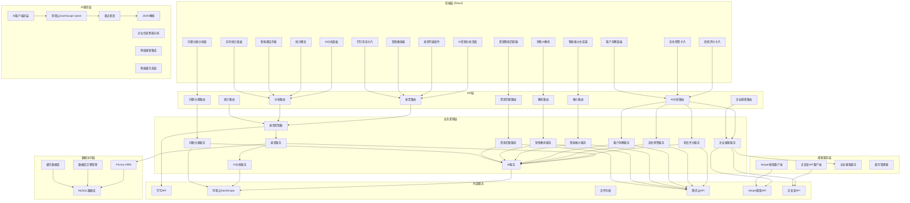

**图表来源**
- [app.ts:74-78](file://crm-backend/src/app.ts#L74-L78)
- [recordings.routes.ts:12-355](file://crm-backend/src/routes/recordings.routes.ts#L12-L355)
- [index.ts:37-55](file://crm-backend/src/services/ai/index.ts#L37-L55)
- [client.ts:50-77](file://crm-backend/src/services/ai/client.ts#L50-L77)
- [serper.client.ts:60-296](file://crm-backend/src/services/search/serper.client.ts#L60-L296)
- [qcc.client.ts:152-539](file://crm-backend/src/services/search/qcc.client.ts#L152-L539)
- [companySearch.service.ts:39-677](file://crm-backend/src/services/search/companySearch.service.ts#L39-L677)

## 核心组件分析

### AI客户端封装

AI客户端封装是整个系统的核心组件，负责与阿里云DashScope Qwen模型进行交互，提供稳定的API调用和错误处理机制。

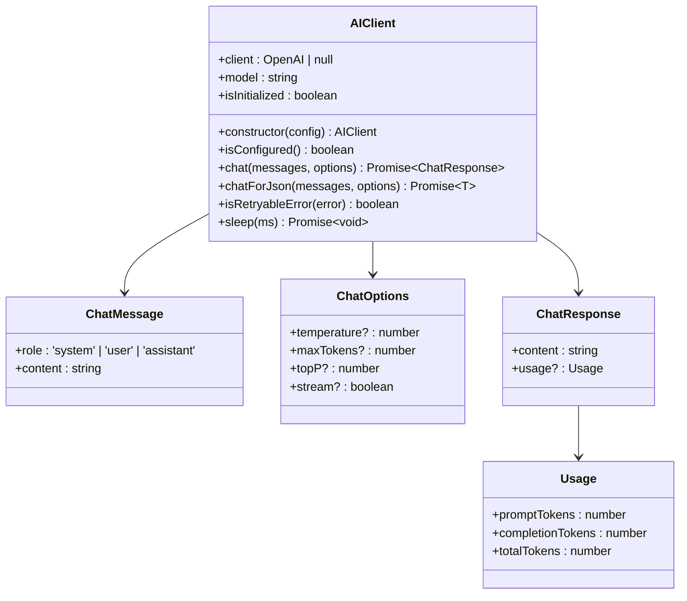

**图表来源**
- [client.ts:50-224](file://crm-backend/src/services/ai/client.ts#L50-L224)

### AI服务组件

AI服务是整个系统的核心组件，负责处理所有AI相关的分析功能，现已升级为支持阿里云DashScope Qwen模型和企业信息智能分析。

```mermaid
classDiagram
class AIService {
+analyzeRecording(audioUrl, duration, customerInfo) Promise~AIAnalysisResult~
+transcribeAudio(audioUrl) Promise~string~
+analyzeSentiment(text) Promise~SentimentType~
+extractKeywords(text) Promise~string[]~
+generateSummary(text, keywords) Promise~string~
+analyzeCompany(companyName, imageUrl, options) Promise~CompanyIntelligenceResult~
+callRealAnalysis(duration, customerInfo) Promise~AIAnalysisResult~
+mockAnalysis(duration, customerInfo) Promise~AIAnalysisResult~
+generateMockResult(duration, customerInfo) AIAnalysisResult
+generateMockCompanyIntelligence(companyName) CompanyIntelligenceResult
}
class CompanyIntelligenceResult {
+basicInfo : BasicInfo
+string[] businessScope
+News[] recentNews
+Contact[] keyContacts
+SalesPitch salesPitch
}
class CompanySearchService {
+searchCompany(companyName, options) Promise~CompanyIntelligenceResult~
+searchWithQCC(companyName) Promise~CompanyIntelligenceResult | null~
+extractIntelligence(companyName, organicResults, newsResults, knowledgeGraph) Promise~CompanyIntelligenceResult~
+getCachedResult(companyName) Promise~CachedSearchResult | null~
+cacheResult(companyName, intelligenceResult, searchResults) Promise~void~
}
class SerperClient {
+isConfigured() boolean
+searchCompany(companyName) Promise~SerperSearchResult~
+search(query, options) Promise~SerperResponse~
+searchNews(query, options) Promise~NewsResult~
}
class QCCClient {
+isConfigured() boolean
+searchCompany(keyword) Promise~QCCSearchResult~
+fuzzySearch(searchKey, pageIndex) Promise~QCCSearchResultItem[]~
+getBasicDetailsByName(keyword) Promise~QCCBasicDetailsResult | null~
}
class AIAnalysisResult {
+string transcript
+SentimentType sentiment
+string[] keywords
+string[] keyPoints
+string[] actionItems
+string summary
+psychology : Psychology
+suggestions : Suggestion[]
}
class ProposalAIService {
+generateSmartQuotation(input) Promise~SmartQuotationResult~
+generateProposalContent(input) Promise~ProposalGenerationResult~
-analyzePricingFactors(input, benchmark) PricingFactors[]
-calculateDiscountStrategy(input, price, benchmark) DiscountStrategy
-generateExecutiveSummary(input) string
-generateProblemStatement(input) string
-generateProposedSolution(input) string
-generateProductRecommendations(input) ProductRecommendation[]
-generateImplementationPlan(input) ImplementationPlan[]
-generateServiceLevel() ServiceLevel
-calculateROI(input, products) ROIProjection
}
class SalesCoachService {
+analyzePerformance(input) Promise~PerformanceAnalysisResult~
+generateCoachingSuggestions(input) Promise~CoachingSuggestionResult~
+identifySkillGaps(performanceAnalysis, skillAssessment) Promise~SkillGapAnalysisResult~
-predictPerformanceTrend(historicalData) Promise~PredictionResult~
-calculateMetrics(input) Metrics
-identifyStrengths(input, metrics) Strength[]
-identifyWeaknesses(input, metrics) Weakness[]
-analyzeTrends(input, metrics) Trends
-calculateOverallScore(metrics, strengths, weaknesses) number
-generateSuggestions(input) Suggestion[]
-generateWeeklyPlan(input) WeeklyPlan
-generateMotivationMessage(input) string
}
class ResourceMatchingService {
+matchResources(input, availableResources) Promise~ResourceMatchingResult~
+generateAssignmentRecommendation(input) Promise~AssignmentRecommendationResult~
-predictResourceAvailability(resourceId, futureDate) Promise~AvailabilityPrediction~
-optimizeResourceAllocation(requests, resources) Promise~Assignment[]~
-calculateSkillMatch(requiredSkills, resourceSkills) ScoreDetails
-calculateExperienceMatch(input, resource) ScoreDetails
-calculateLocationMatch(requestLocation, resourceLocation) ScoreDetails
-calculateWorkloadFit(resource) ScoreDetails
-calculateSuccessHistory(resource) ScoreDetails
}
class QuestionClassificationService {
+classifyQuestion(question) Promise~QuestionClassification~
+classifyQuestions(questions) Promise~BatchClassificationResult[]~
+summarizeQuestions(questions) Promise~string~
+suggestAnswer(question, category, context) Promise~string~
+analyzeTrends(questions) Promise~TrendAnalysisResult~
-validateCategory(category) QuestionClassification['category']
-validatePriority(priority) QuestionClassification['priority']
-validateConfidence(confidence) number
-validateSentiment(sentiment) QuestionClassification['sentiment']
-getDefaultClassification(question) QuestionClassification
}
AIService --> AIAnalysisResult
AIService --> CompanyIntelligenceResult
CompanySearchService --> CompanyIntelligenceResult
SerperClient --> CompanyIntelligenceResult
QCCClient --> CompanyIntelligenceResult
ProposalAIService --> AIAnalysisResult
SalesCoachService --> AIAnalysisResult
ResourceMatchingService --> AIAnalysisResult
QuestionClassificationService --> AIAnalysisResult
```

**图表来源**
- [ai.service.ts:72-97](file://crm-backend/src/services/ai.service.ts#L72-L97)
- [companySearch.service.ts:39-677](file://crm-backend/src/services/search/companySearch.service.ts#L39-L677)
- [serper.client.ts:60-296](file://crm-backend/src/services/search/serper.client.ts#L60-L296)
- [qcc.client.ts:152-539](file://crm-backend/src/services/search/qcc.client.ts#L152-L539)
- [proposalAI.ts:53-154](file://crm-backend/src/services/ai/proposalAI.ts#L53-L154)
- [salesCoach.ts:51-138](file://crm-backend/src/services/ai/salesCoach.ts#L51-L138)
- [resourceMatching.ts:44-92](file://crm-backend/src/services/ai/resourceMatching.ts#L44-L92)
- [questionClassification.service.ts:25-372](file://crm-backend/src/services/ai/questionClassification.service.ts#L25-L372)

### 录音服务组件

录音服务负责处理录音相关的业务逻辑，包括存储、分析和管理，现已支持钉钉录音同步功能和AI智能分析。

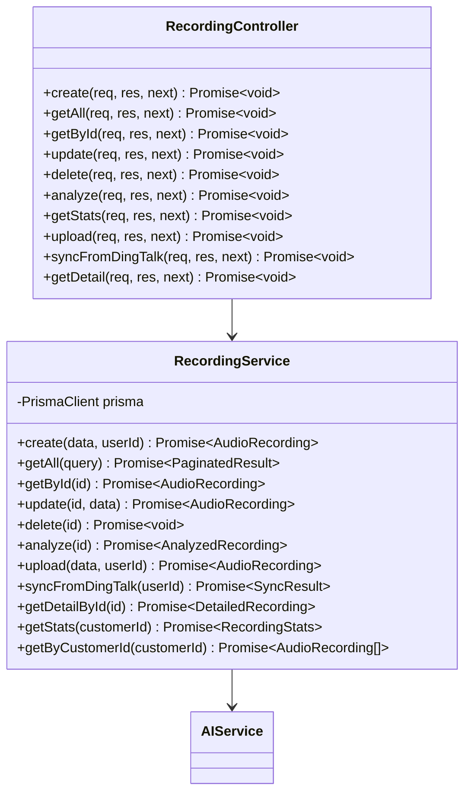

**图表来源**
- [recording.service.ts:9-455](file://crm-backend/src/services/recording.service.ts#L9-L455)
- [recording.controller.ts:46-230](file://crm-backend/src/controllers/recording.controller.ts#L46-L230)

**章节来源**
- [client.ts:50-224](file://crm-backend/src/services/ai/client.ts#L50-L224)
- [ai.service.ts:72-400](file://crm-backend/src/services/ai.service.ts#L72-L400)
- [recording.service.ts:9-455](file://crm-backend/src/services/recording.service.ts#L9-L455)
- [recording.controller.ts:46-230](file://crm-backend/src/controllers/recording.controller.ts#L46-L230)

## AI音频分析流程

系统提供了完整的AI音频分析工作流程，从录音上传到最终的分析结果展示，现已集成阿里云DashScope Qwen模型和企业信息智能分析功能。

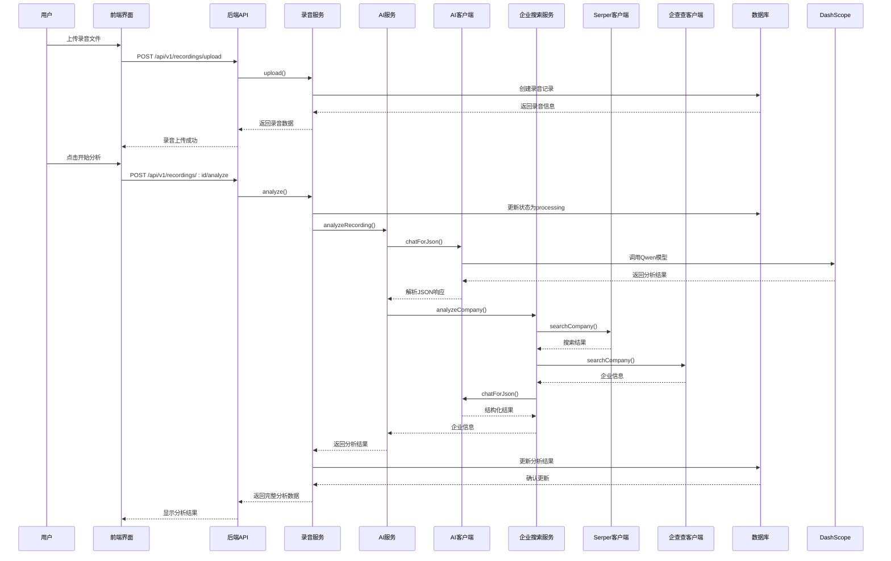

**图表来源**
- [recording.controller.ts:129-137](file://crm-backend/src/controllers/recording.controller.ts#L129-L137)
- [recording.service.ts:145-208](file://crm-backend/src/services/recording.service.ts#L145-L208)
- [ai.service.ts:84-97](file://crm-backend/src/services/ai.service.ts#L84-L97)
- [client.ts:152-182](file://crm-backend/src/services/ai/client.ts#L152-L182)
- [companySearch.service.ts:67-144](file://crm-backend/src/services/search/companySearch.service.ts#L67-L144)

### 分析流程详细说明

1. **录音上传**：用户通过前端界面上传音频文件，系统验证文件格式和大小
2. **状态初始化**：录音记录创建时状态设置为"pending"
3. **AI分析触发**：用户点击分析按钮，系统调用AI分析服务
4. **状态更新**：分析开始前将状态更新为"processing"
5. **语音分析**：调用AI客户端封装，通过阿里云DashScope Qwen模型进行语音分析
6. **企业信息分析**：同时调用企业搜索服务，获取真实企业信息
7. **网络搜索**：优先使用Serper Google搜索API获取企业相关信息
8. **企业信息查询**：备用使用企查查API获取权威工商信息
9. **LLM结构化提取**：使用AI模型将搜索结果转换为结构化的企业信息
10. **缓存存储**：将企业信息结果缓存7天，提升后续查询性能
11. **重试机制**：支持最多3次重试，指数退避延迟
12. **JSON解析**：自动解析AI响应，支持Markdown代码块格式
13. **结果保存**：将分析结果保存到数据库，状态更新为"analyzed"
14. **结果展示**：前端界面展示完整的分析结果

**章节来源**
- [recording.controller.ts:129-137](file://crm-backend/src/controllers/recording.controller.ts#L129-L137)
- [recording.service.ts:145-208](file://crm-backend/src/services/recording.service.ts#L145-L208)
- [ai.service.ts:84-153](file://crm-backend/src/services/ai.service.ts#L84-L153)
- [client.ts:93-147](file://crm-backend/src/services/ai/client.ts#L93-L147)
- [companySearch.service.ts:67-144](file://crm-backend/src/services/search/companySearch.service.ts#L67-L144)

## AI智能分析功能

系统新增了四大核心AI智能分析功能，提供更全面的销售智能分析能力，现已全部支持阿里云DashScope Qwen模型和网络搜索集成。

### 智能报价与提案生成

智能报价与提案生成AI服务基于客户信息、历史数据、市场行情生成智能报价建议和完整的商务方案内容。

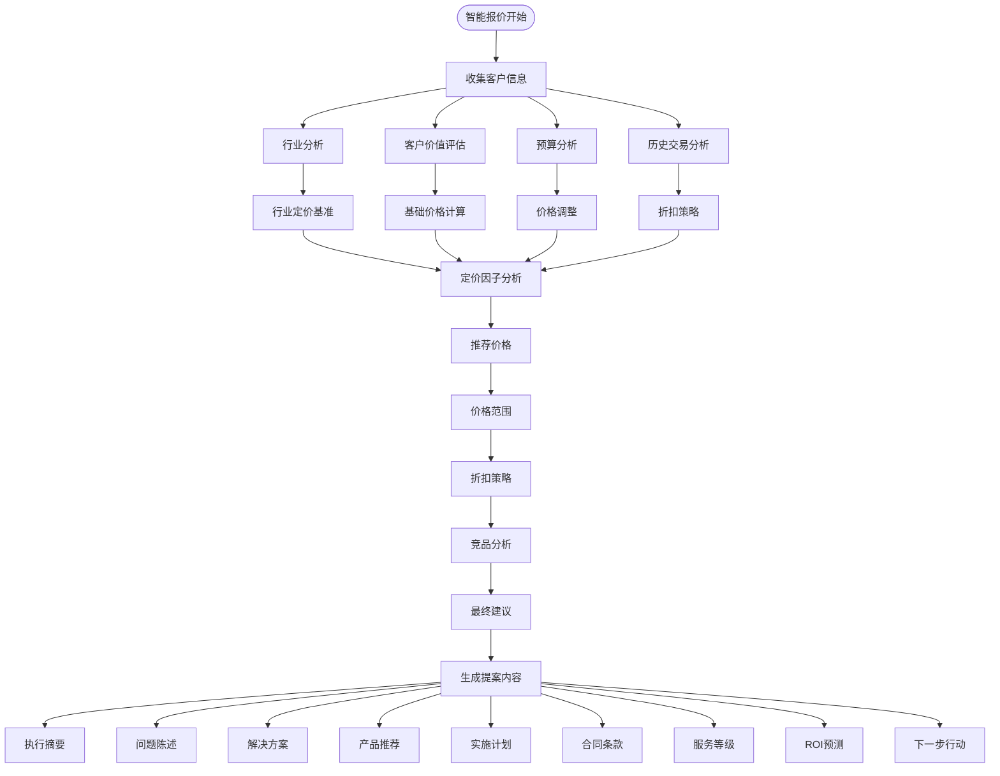

**图表来源**
- [proposalAI.ts:58-106](file://crm-backend/src/services/ai/proposalAI.ts#L58-L106)
- [proposalAI.ts:112-154](file://crm-backend/src/services/ai/proposalAI.ts#L112-L154)

### 销售绩效AI教练

销售绩效AI教练提供销售数据分析、绩效评估、个性化改进建议等功能，帮助销售人员提升业绩表现。

**图表来源**
- [salesCoach.ts:55-82](file://crm-backend/src/services/ai/salesCoach.ts#L55-L82)
- [salesCoach.ts:87-99](file://crm-backend/src/services/ai/salesCoach.ts#L87-L99)
- [salesCoach.ts:104-138](file://crm-backend/src/services/ai/salesCoach.ts#L104-L138)

### 售前资源智能匹配

售前资源智能匹配AI服务提供多维度资源匹配评分、最优分配算法、资源可用性预测等功能。

**图表来源**
- [resourceMatching.ts:49-92](file://crm-backend/src/services/ai/resourceMatching.ts#L49-L92)
- [resourceMatching.ts:156-220](file://crm-backend/src/services/ai/resourceMatching.ts#L156-L220)
- [resourceMatching.ts:225-242](file://crm-backend/src/services/ai/resourceMatching.ts#L225-L242)

**章节来源**
- [proposalAI.ts:53-599](file://crm-backend/src/services/ai/proposalAI.ts#L53-L599)
- [salesCoach.ts:51-780](file://crm-backend/src/services/ai/salesCoach.ts#L51-L780)
- [resourceMatching.ts:44-692](file://crm-backend/src/services/ai/resourceMatching.ts#L44-L692)

## AI问题分类服务

系统新增了AI问题分类服务，专门处理客户咨询问题的智能分类和分析功能，现已支持阿里云DashScope Qwen模型。

### 问题分类核心功能

AI问题分类服务使用先进的自然语言处理技术，对客户咨询问题进行自动分类、情感分析和优先级评估。

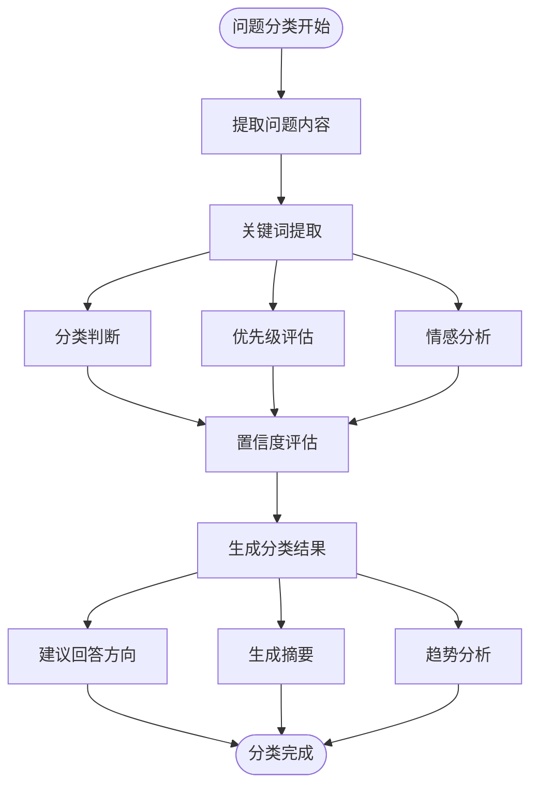

**图表来源**
- [questionClassification.service.ts:105-159](file://crm-backend/src/services/ai/questionClassification.service.ts#L105-L159)
- [questionClassification.service.ts:164-181](file://crm-backend/src/services/ai/questionClassification.service.ts#L164-L181)
- [questionClassification.service.ts:216-237](file://crm-backend/src/services/ai/questionClassification.service.ts#L216-L237)

### 问题分类标准

系统支持五种主要的问题分类类型：

- **产品相关 (product)**：关于产品功能、特性、对比等问题
- **价格相关 (pricing)**：关于价格、折扣、付款方式等问题  
- **技术相关 (technical)**：关于技术架构、集成、性能等问题
- **实施相关 (implementation)**：关于项目实施、交付、培训等问题
- **其他 (others)**：不属于上述类型的其他问题

### 优先级评估

系统根据问题的紧急程度和重要性进行优先级分类：

- **高优先级 (high)**：紧急、影响决策、涉及核心功能
- **中优先级 (medium)**：一般咨询、需要进一步了解
- **低优先级 (low)**：简单咨询、信息确认类

### 情感分析

系统自动分析客户的情绪状态：

- **积极 (positive)**：客户对产品或服务表示满意
- **中性 (neutral)**：客户情绪平和，无明显倾向
- **消极 (negative)**：客户表达不满或担忧

### 批量处理能力

系统支持批量问题分类处理，采用分批处理策略：

- **批量大小**：每批最多5个问题
- **并发处理**：使用Promise.all并行处理多个问题
- **错误处理**：单个问题失败不影响整体处理结果

**章节来源**
- [questionClassification.service.ts:25-372](file://crm-backend/src/services/ai/questionClassification.service.ts#L25-L372)

## 网络搜索与智能缓存系统

系统新增了完整的网络搜索和智能缓存系统，提供真实的企业信息获取和高性能的数据访问能力。

### 网络搜索架构

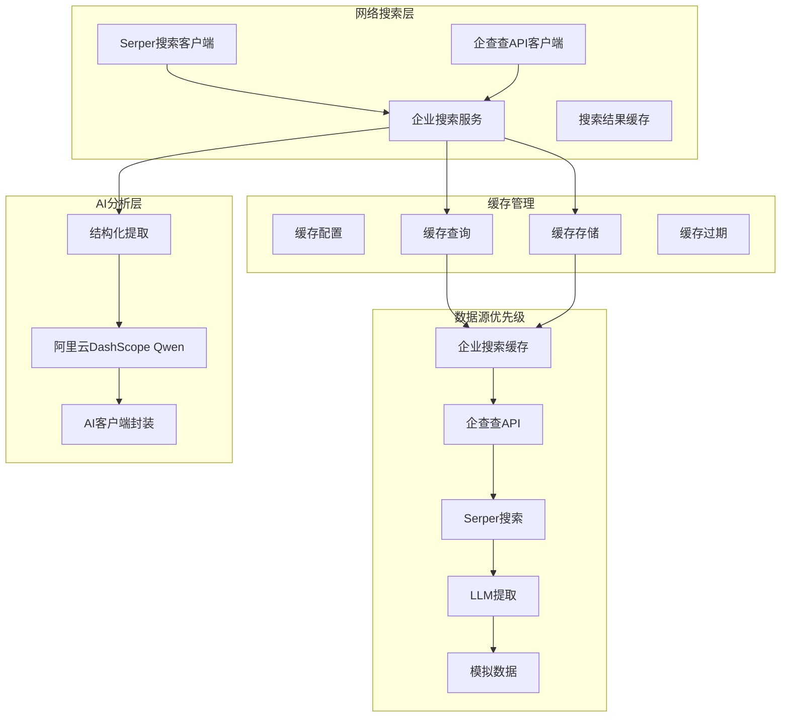

**图表来源**
- [serper.client.ts:60-296](file://crm-backend/src/services/search/serper.client.ts#L60-L296)
- [qcc.client.ts:152-539](file://crm-backend/src/services/search/qcc.client.ts#L152-L539)
- [companySearch.service.ts:39-677](file://crm-backend/src/services/search/companySearch.service.ts#L39-L677)
- [schema.prisma:1090-1108](file://crm-backend/prisma/schema.prisma#L1090-L1108)

### 企业搜索服务核心功能

企业搜索服务提供多数据源融合的企业信息提取能力，支持智能降级处理。

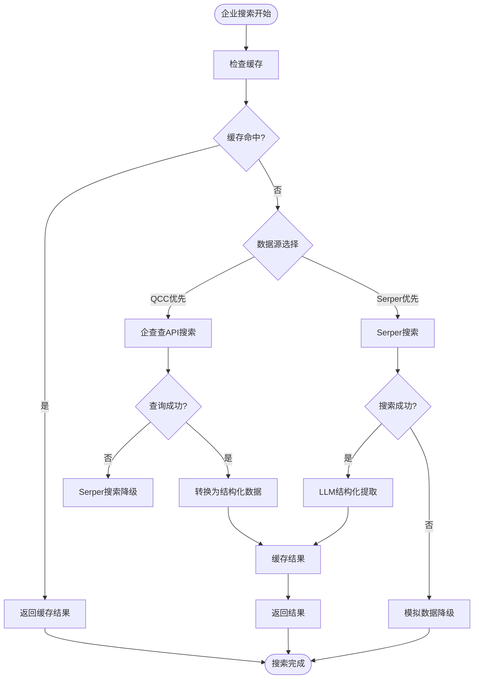

**图表来源**
- [companySearch.service.ts:67-144](file://crm-backend/src/services/search/companySearch.service.ts#L67-L144)
- [companySearch.service.ts:305-413](file://crm-backend/src/services/search/companySearch.service.ts#L305-L413)

### 缓存系统设计

智能缓存系统提供7天持久化缓存，支持缓存命中统计和过期管理。

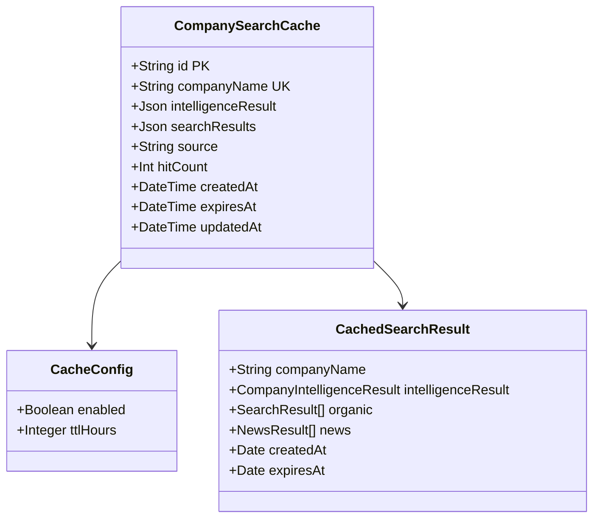

**图表来源**
- [schema.prisma:1090-1108](file://crm-backend/prisma/schema.prisma#L1090-L1108)
- [companySearch.service.ts:18-34](file://crm-backend/src/services/search/companySearch.service.ts#L18-L34)

### 搜索客户端功能

#### Serper搜索客户端

Serper搜索客户端提供Google搜索API集成，支持企业信息搜索和新闻搜索。

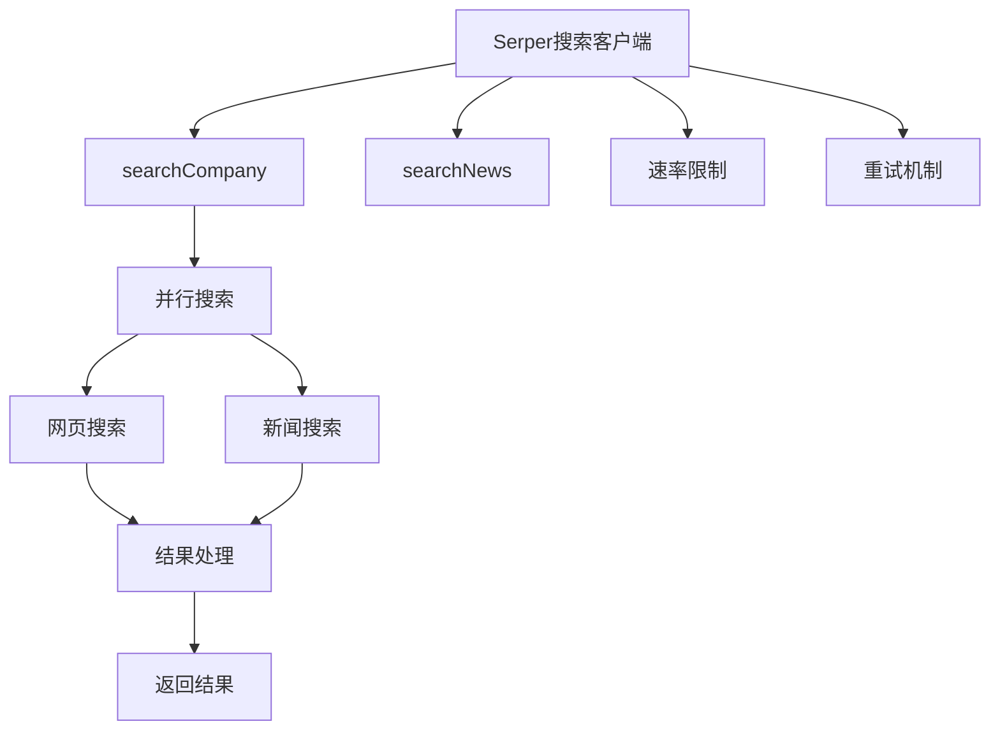

**图表来源**
- [serper.client.ts:219-239](file://crm-backend/src/services/search/serper.client.ts#L219-L239)
- [serper.client.ts:115-170](file://crm-backend/src/services/search/serper.client.ts#L115-L170)

#### 企查查API客户端

企查查API客户端提供权威的企业工商信息查询服务。

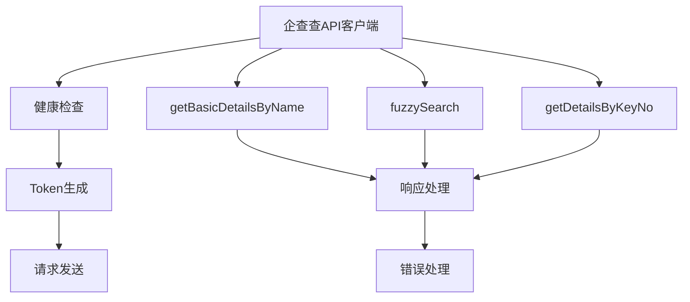

**图表来源**
- [qcc.client.ts:152-539](file://crm-backend/src/services/search/qcc.client.ts#L152-L539)
- [qcc.client.ts:216-276](file://crm-backend/src/services/search/qcc.client.ts#L216-L276)

### AI企业分析集成

AI服务集成了企业搜索功能，提供智能的企业信息分析能力。

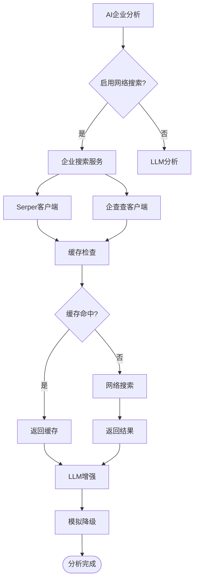

**图表来源**
- [ai.service.ts:464-504](file://crm-backend/src/services/ai.service.ts#L464-L504)
- [companySearch.service.ts:585-654](file://crm-backend/src/services/search/companySearch.service.ts#L585-L654)

**章节来源**
- [serper.client.ts:60-296](file://crm-backend/src/services/search/serper.client.ts#L60-L296)
- [qcc.client.ts:152-539](file://crm-backend/src/services/search/qcc.client.ts#L152-L539)
- [companySearch.service.ts:39-677](file://crm-backend/src/services/search/companySearch.service.ts#L39-L677)
- [ai.service.ts:464-504](file://crm-backend/src/services/ai.service.ts#L464-L504)

## 数据库迁移与版本管理

系统采用Prisma进行数据库管理，支持完整的数据库迁移和版本控制，现已新增企业搜索缓存表。

### 数据库迁移架构

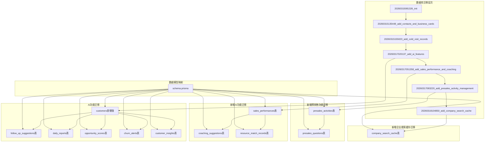

**图表来源**
- [20260317020137_add_ai_features/migration.sql:1-120](file://crm-backend/prisma/migrations/20260317020137_add_ai_features/migration.sql#L1-L120)
- [20260317051358_add_sales_performance_and_coaching/migration.sql:1-71](file://crm-backend/prisma/migrations/20260317051358_add_sales_performance_and_coaching/migration.sql#L1-L71)
- [schema.prisma:1090-1108](file://crm-backend/prisma/schema.prisma#L1090-L1108)

### 企业搜索缓存数据库结构

新增的企业搜索缓存表支持企业信息的持久化存储和快速访问。

#### 企业搜索缓存表 (company_search_cache)

**表结构**
- `id`: UUID主键，唯一标识缓存记录
- `companyName`: 企业名称，唯一索引，支持快速查找
- `intelligenceResult`: 企业情报结果，JSON格式存储结构化数据
- `searchResults`: 原始搜索结果，JSON格式存储网页和新闻结果
- `source`: 数据来源，支持web_search、llm、mock三种类型
- `hitCount`: 缓存命中次数，用于统计缓存效果
- `expiresAt`: 过期时间，支持7天缓存策略
- `createdAt`: 创建时间，记录缓存创建时间
- `updatedAt`: 更新时间，记录缓存最后更新时间

**索引设计**
- `companyName`: 唯一索引，确保企业名称唯一性
- `expiresAt`: 普通索引，支持过期查询优化
- `source`: 普通索引，支持按数据来源查询

**缓存策略**
- TTL: 7天（24×7小时）
- 命中统计: 自动增加hitCount计数
- 清理机制: 过期自动清理，支持强制刷新

#### AI功能数据库结构

AI功能相关的数据库结构在多个迁移中得到完善：

##### 阶段二新增AI功能
- `engagementScore`：互动活跃度评分 (0-100)
- `riskScore`：流失风险评分 (0-100)  
- `lastAnalysisAt`：最后AI分析时间

##### 新增AI分析相关表

**跟进建议表 (follow_up_suggestions)**
- 存储AI生成的跟进建议
- 支持不同类型和优先级
- 包含到期时间和脚本内容

**日常报告表 (daily_reports)**
- 支持日报和周报功能
- 存储内容、摘要、重点事项等

**商机评分表 (opportunity_scores)**
- 客观评分维度：互动活跃度、预算匹配度、决策人接触度、需求明确度、时机成熟度
- 包含风险因素和改进建议

**客户流失预警表 (churn_alerts)**
- 流失风险等级和评分
- 预警信号和挽回建议
- 处理状态跟踪

**客户洞察表 (customer_insights)**
- AI提取的客户需求、预算、决策人等信息
- 置信度和分析来源

##### 阶段三新增AI功能

**销售绩效表 (sales_performances)**
- 记录销售人员的每日绩效数据
- 包括通话数、会议数、拜访数、提案数、成交数、收入等指标
- 支持按日期和用户维度查询

**教练建议表 (coaching_suggestions)**
- 存储AI教练生成的个性化建议
- 支持不同类型：performance、skill、opportunity、time_management
- 包含优先级、行动步骤、预期效果等

**资源匹配记录表 (resource_match_records)**
- 记录资源匹配的历史数据
- 存储匹配分数、技能匹配详情、匹配因子等
- 支持AI推荐标记和创建时间

##### 新增预销售功能

**预销售活动表 (presales_activities)**
- 记录预销售活动的详细信息
- 包括活动类型、状态、参与人员等
- 支持活动跟踪和管理

**预销售问题表 (presales_questions)**
- 存储预销售过程中的客户问题
- 支持问题分类、优先级评估、情感分析
- 包含问题摘要和建议回答

**章节来源**
- [20260317020137_add_ai_features/migration.sql:1-120](file://crm-backend/prisma/migrations/20260317020137_add_ai_features/migration.sql#L1-L120)
- [20260317051358_add_sales_performance_and_coaching/migration.sql:1-71](file://crm-backend/prisma/migrations/20260317051358_add_sales_performance_and_coaching/migration.sql#L1-L71)
- [schema.prisma:572-685](file://crm-backend/prisma/schema.prisma#L572-L685)
- [schema.prisma:729-783](file://crm-backend/prisma/schema.prisma#L729-L783)
- [schema.prisma:1090-1108](file://crm-backend/prisma/schema.prisma#L1090-L1108)

## 前端界面设计

前端界面采用现代化的设计理念，提供了直观易用的操作界面，现已全面升级支持钉钉同步、实时统计功能和企业信息分析。

### 主要界面组件

```mermaid
graph TB
subgraph "AI音频分析页面"
A[页面标题]
B[钉钉状态卡片]
C[统计概览]
D[录音列表]
E[音频播放器]
F[AI分析面板]
G[智能建议列表]
H[上传录音弹窗]
I[实时统计面板]
end
subgraph "AI智能分析组件"
I[商机评分卡片]
J[流失预警卡片]
K[客户洞察面板]
L[智能报价生成器]
M[销售AI教练]
N[资源智能匹配器]
O[销售绩效分析]
P[教练建议管理]
Q[资源匹配记录]
R[问题分类分析器]
S[预销售问题管理]
T[企业信息分析面板]
U[网络搜索状态指示器]
end
subgraph "录音列表组件"
D1[客户头像]
D2[录音信息]
D3[状态标签]
D4[情感图标]
end
subgraph "AI分析面板"
F1[分析状态]
F2[情感分析]
F3[关键词展示]
F4[关键点列表]
F5[心理分析]
F6[转录文本]
end
subgraph "音频播放器"
E1[播放控制]
E2[进度条]
E3[播放速度]
E4[跳转功能]
end
D --> D1
D --> D2
D --> D3
D --> D4
F --> F1
F --> F2
F --> F3
F --> F4
F --> F5
F --> F6
E --> E1
E --> E2
E --> E3
E --> E4
I --> I1
J --> J1
K --> K1
L --> L1
M --> M1
N --> N1
O --> O1
P --> P1
Q --> Q1
R --> R1
S --> S1
T --> T1
U --> U1
```

**图表来源**
- [index.tsx:166-344](file://crm-frontend/src/pages/AIAudio/index.tsx#L166-L344)
- [AIAnalysisPanel.tsx:46-224](file://crm-frontend/src/pages/AIAudio/components/AIAnalysisPanel.tsx#L46-L224)
- [AudioPlayer.tsx:9-165](file://crm-frontend/src/pages/AIAudio/components/AudioPlayer.tsx#L9-L165)
- [RecordingList.tsx:41-158](file://crm-frontend/src/pages/AIAudio/components/RecordingList.tsx#L41-L158)
- [DingTalkStatusCard.tsx:14-118](file://crm-frontend/src/pages/AIAudio/components/DingTalkStatusCard.tsx#L14-L118)
- [StatsOverview.tsx:17-168](file://crm-frontend/src/pages/AIAudio/components/StatsOverview.tsx#L17-L168)
- [OpportunityScoreCard.tsx:54-336](file://crm-frontend/src/components/AI/OpportunityScoreCard.tsx#L54-L336)
- [ChurnAlertCard.tsx:62-326](file://crm-frontend/src/components/AI/ChurnAlertCard.tsx#L62-L326)
- [CustomerInsightPanel.tsx:80-381](file://crm-frontend/src/components/AI/CustomerInsightPanel.tsx#L80-L381)

### 界面交互流程

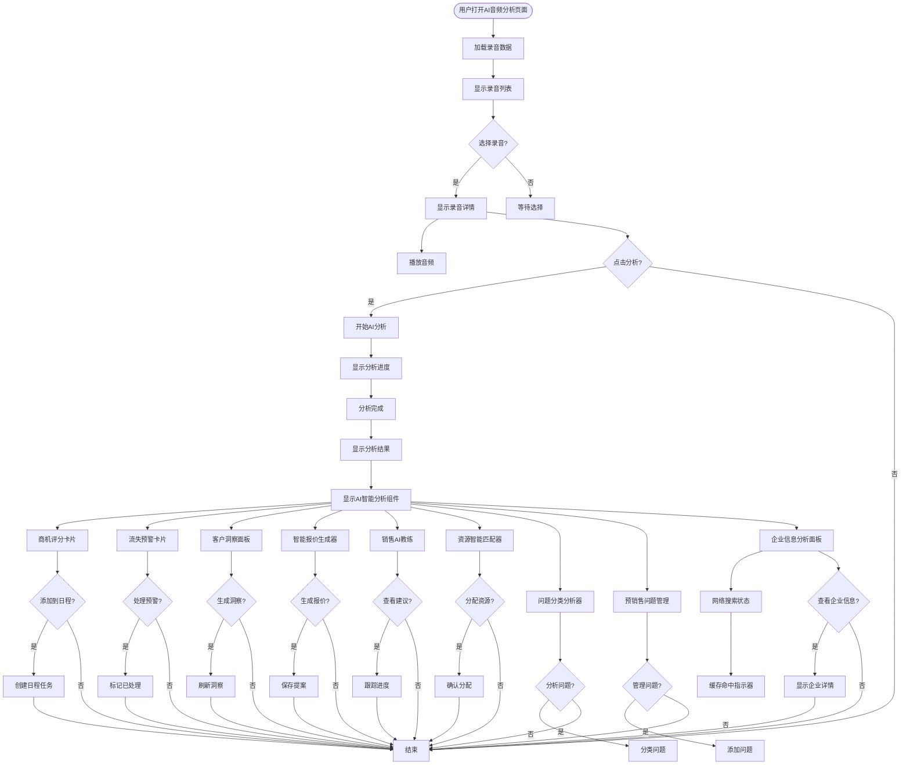

**图表来源**
- [index.tsx:81-106](file://crm-frontend/src/pages/AIAudio/index.tsx#L81-L106)
- [AIAnalysisPanel.tsx:72-90](file://crm-frontend/src/pages/AIAudio/components/AIAnalysisPanel.tsx#L72-L90)

**章节来源**
- [index.tsx:27-344](file://crm-frontend/src/pages/AIAudio/index.tsx#L27-L344)
- [AIAnalysisPanel.tsx:46-224](file://crm-frontend/src/pages/AIAudio/components/AIAnalysisPanel.tsx#L46-L224)
- [AudioPlayer.tsx:9-165](file://crm-frontend/src/pages/AIAudio/components/AudioPlayer.tsx#L9-L165)
- [RecordingList.tsx:41-158](file://crm-frontend/src/pages/AIAudio/components/RecordingList.tsx#L41-L158)
- [DingTalkStatusCard.tsx:14-118](file://crm-frontend/src/pages/AIAudio/components/DingTalkStatusCard.tsx#L14-L118)
- [StatsOverview.tsx:17-168](file://crm-frontend/src/pages/AIAudio/components/StatsOverview.tsx#L17-L168)
- [OpportunityScoreCard.tsx:54-336](file://crm-frontend/src/components/AI/OpportunityScoreCard.tsx#L54-L336)
- [ChurnAlertCard.tsx:62-326](file://crm-frontend/src/components/AI/ChurnAlertCard.tsx#L62-L326)
- [CustomerInsightPanel.tsx:80-381](file://crm-frontend/src/components/AI/CustomerInsightPanel.tsx#L80-L381)

## 数据模型

系统定义了完整的数据模型来支持AI音频分析功能，现已全面支持阿里云DashScope集成和企业搜索缓存。

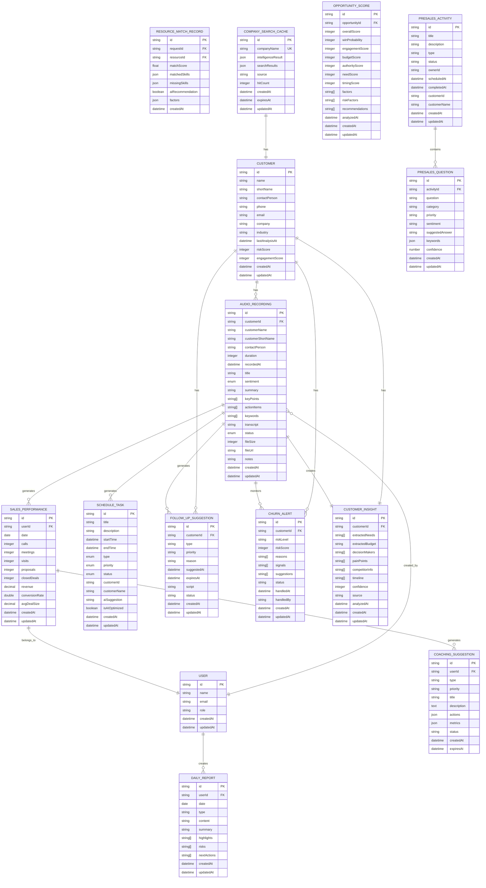

**图表来源**
- [index.ts:73-96](file://crm-frontend/src/types/index.ts#L73-L96)
- [index.ts:19-37](file://crm-frontend/src/types/index.ts#L19-L37)
- [index.ts:136-150](file://crm-frontend/src/types/index.ts#L136-L150)
- [schema.prisma:282-311](file://crm-backend/prisma/schema.prisma#L282-L311)
- [schema.prisma:575-593](file://crm-backend/prisma/schema.prisma#L575-L593)
- [schema.prisma:596-613](file://crm-backend/prisma/schema.prisma#L596-L613)
- [schema.prisma:616-641](file://crm-backend/prisma/schema.prisma#L616-L641)
- [schema.prisma:644-664](file://crm-backend/prisma/schema.prisma#L644-L664)
- [schema.prisma:667-685](file://crm-backend/prisma/schema.prisma#L667-L685)
- [schema.prisma:729-783](file://crm-backend/prisma/schema.prisma#L729-L783)
- [schema.prisma:1090-1108](file://crm-backend/prisma/schema.prisma#L1090-L1108)

### 关键数据结构

#### 音频录音模型
- **基础信息**：客户信息、录音时长、文件URL等
- **分析结果**：情感倾向、关键词、关键点、行动项等
- **状态管理**：pending、processing、analyzed三种状态

#### AI分析结果模型
- **转录文本**：完整的语音转文字内容
- **情感分析**：positive、neutral、negative三种情感类型
- **关键词提取**：自动识别的重要词汇
- **心理分析**：客户态度、购买意向、痛点等洞察

#### 企业信息智能分析模型
- **基本信息**：企业名称、行业、规模、成立时间、地址、网站、简介
- **业务范围**：4个主要业务关键词
- **近期动态**：2条相关新闻摘要
- **关键联系人**：2-4位关键联系人信息，包含职位、部门、可信度
- **销售话术**：个性化开场白、痛点、谈话要点、异议处理

#### AI功能扩展模型
- **跟进建议**：自动化的销售建议和行动项
- **客户洞察**：AI提取的客户需求和决策信息
- **流失预警**：客户流失风险评估和预警
- **商机评分**：多维度的商机价值评估
- **销售绩效**：销售人员的每日工作表现
- **教练建议**：个性化的改进指导和行动步骤
- **资源匹配**：售前资源的最佳分配建议
- **预销售问题**：客户咨询问题的分类和管理
- **问题分类**：客户问题的自动分类和情感分析
- **企业搜索缓存**：7天持久化的企业信息缓存

**章节来源**
- [index.ts:73-133](file://crm-frontend/src/types/index.ts#L73-L133)
- [schema.prisma:572-685](file://crm-backend/prisma/schema.prisma#L572-L685)
- [schema.prisma:729-783](file://crm-backend/prisma/schema.prisma#L729-L783)
- [schema.prisma:1090-1108](file://crm-backend/prisma/schema.prisma#L1090-L1108)

## API接口设计

系统提供了完整的RESTful API来支持AI音频分析功能，现已全面支持阿里云DashScope集成和企业搜索缓存。

### 录音管理API

| 接口 | 方法 | 路径 | 描述 |
|------|------|------|------|
| 获取录音列表 | GET | `/api/v1/recordings` | 分页获取录音列表 |
| 创建录音 | POST | `/api/v1/recordings` | 创建新的录音记录 |
| 获取录音详情 | GET | `/api/v1/recordings/:id` | 获取录音详细信息 |
| 更新录音 | PUT | `/api/v1/recordings/:id` | 更新录音信息 |
| 删除录音 | DELETE | `/api/v1/recordings/:id` | 删除录音记录 |
| 触发AI分析 | POST | `/api/v1/recordings/:id/analyze` | 对指定录音进行AI分析 |
| 获取统计信息 | GET | `/api/v1/recordings/stats` | 获取录音统计信息 |
| 上传录音文件 | POST | `/api/v1/recordings/upload` | 上传录音文件 |
| 同步钉钉录音 | POST | `/api/v1/recordings/sync` | 从钉钉同步录音 |

### AI智能分析API

| 接口 | 方法 | 路径 | 描述 |
|------|------|------|------|
| 获取AI分析结果 | GET | `/api/v1/recordings/:id/ai-result` | 获取录音的AI分析结果 |
| 生成跟进建议 | POST | `/api/v1/follow-up-suggestions` | 生成AI跟进建议 |
| 获取客户洞察 | GET | `/api/v1/customer-insights/:customerId` | 获取客户洞察信息 |
| 获取商机评分 | GET | `/api/v1/opportunity-scores/:opportunityId` | 获取商机评分 |
| 获取流失预警 | GET | `/api/v1/churn-alerts/:customerId` | 获取客户流失预警 |
| 分析流失风险 | POST | `/api/v1/churn-analysis/:customerId` | 分析客户流失风险 |
| 计算商机评分 | POST | `/api/v1/opportunity-scoring/:opportunityId` | 计算商机评分 |
| 生成客户洞察 | POST | `/api/v1/customer-insights/generate/:customerId` | 生成客户洞察 |
| 生成智能报价 | POST | `/api/v1/proposal/smart-quotation` | 生成智能报价建议 |
| 生成提案内容 | POST | `/api/v1/proposal/generate-content` | 生成完整提案内容 |
| 分析销售绩效 | POST | `/api/v1/sales-coach/analyze-performance` | 分析销售绩效 |
| 生成教练建议 | POST | `/api/v1/sales-coach/generate-suggestions` | 生成教练建议 |
| 识别技能差距 | POST | `/api/v1/sales-coach/identify-skill-gaps` | 识别技能差距 |
| 预测绩效趋势 | POST | `/api/v1/sales-coach/predict-trend` | 预测绩效趋势 |
| 生成行动计划 | POST | `/api/v1/sales-coach/generate-action-plan` | 生成行动计划 |
| 智能匹配资源 | POST | `/api/v1/resource-matching/match` | 智能匹配售前资源 |
| 生成分配建议 | POST | `/api/v1/resource-matching/generate-assignment` | 生成资源分配建议 |
| 预测资源可用性 | POST | `/api/v1/resource-matching/predict-availability` | 预测资源可用性 |
| 优化资源分配 | POST | `/api/v1/resource-matching/optimize-allocation` | 优化资源分配 |

### AI问题分类API

| 接口 | 方法 | 路径 | 描述 |
|------|------|------|------|
| 分类单个问题 | POST | `/api/v1/question-classification/classify` | 分类单个客户问题 |
| 批量分类问题 | POST | `/api/v1/question-classification/batch-classify` | 批量分类客户问题 |
| 生成问题摘要 | POST | `/api/v1/question-classification/summarize` | 生成问题摘要报告 |
| 建议回答方向 | POST | `/api/v1/question-classification/suggest-answer` | 生成问题建议回答 |
| 分析问题趋势 | POST | `/api/v1/question-classification/analyze-trends` | 分析问题趋势和模式 |

### 企业搜索API

| 接口 | 方法 | 路径 | 描述 |
|------|------|------|------|
| 搜索企业信息 | POST | `/api/v1/company-search` | 搜索企业信息（支持网络搜索） |
| 获取企业缓存 | GET | `/api/v1/company-search/cache/:companyName` | 获取企业信息缓存 |
| 清除企业缓存 | DELETE | `/api/v1/company-search/cache/:companyName` | 清除企业信息缓存 |
| 缓存统计 | GET | `/api/v1/company-search/cache-stats` | 获取缓存统计信息 |

### 预销售管理API

| 接口 | 方法 | 路径 | 描述 |
|------|------|------|------|
| 创建预销售活动 | POST | `/api/v1/presales/activities` | 创建预销售活动 |
| 获取预销售活动列表 | GET | `/api/v1/presales/activities` | 获取预销售活动列表 |
| 获取预销售活动详情 | GET | `/api/v1/presales/activities/:id` | 获取预销售活动详情 |
| 更新预销售活动 | PUT | `/api/v1/presales/activities/:id` | 更新预销售活动 |
| 删除预销售活动 | DELETE | `/api/v1/presales/activities/:id` | 删除预销售活动 |
| 添加问题到活动 | POST | `/api/v1/presales/activities/:id/questions` | 向活动添加问题 |
| 获取活动问题列表 | GET | `/api/v1/presales/activities/:id/questions` | 获取活动问题列表 |
| 更新活动问题 | PUT | `/api/v1/presales/activities/:id/questions/:questionId` | 更新活动问题 |
| 删除活动问题 | DELETE | `/api/v1/presales/activities/:id/questions/:questionId` | 删除活动问题 |

### API基础URL配置

**更新** API基础URL配置已从默认端口3001更新为3002，确保前后端服务正确通信。

系统采用统一的API基础URL配置，所有前端组件都使用相同的配置：

- **默认配置**：`http://localhost:3002/api/v1`
- **环境变量**：`VITE_API_BASE_URL` 
- **超时设置**：`VITE_API_TIMEOUT=10000` 毫秒

**章节来源**
- [recordings.routes.ts:14-355](file://crm-backend/src/routes/recordings.routes.ts#L14-L355)
- [recording.validator.ts:11-62](file://crm-backend/src/validators/recording.validator.ts#L11-L62)
- [api.ts:19](file://crm-frontend/src/services/api.ts#L19)
- [FollowUpWidget.tsx:59](file://crm-frontend/src/components/AI/FollowUpWidget.tsx#L59)
- [ScriptGenerator.tsx:8](file://crm-frontend/src/components/AI/ScriptGenerator.tsx#L8)
- [AIAssistant/index.tsx:8](file://crm-frontend/src/pages/AIAssistant/index.tsx#L8)
- [companySearch.service.ts:67-144](file://crm-backend/src/services/search/companySearch.service.ts#L67-L144)

## 性能考虑

系统在设计时充分考虑了性能优化，确保在大量数据场景下的稳定运行，现已全面支持阿里云DashScope Qwen模型和智能缓存系统。

### 性能优化策略

1. **异步处理**：AI分析采用异步处理，避免阻塞主线程
2. **状态管理**：通过状态字段跟踪分析进度，支持并发处理
3. **缓存机制**：智能缓存系统支持7天持久化缓存，显著提升查询性能
4. **分页查询**：数据库查询支持分页，避免大数据量查询
5. **文件上传限制**：设置合理的文件大小限制，防止资源滥用
6. **数据库索引优化**：为常用查询字段建立索引
7. **批量操作**：支持批量AI分析和数据处理
8. **AI服务池化**：多个AI分析服务共享资源，提高利用率
9. **延迟模拟**：合理的处理延迟模拟，避免过快响应影响用户体验
10. **内存管理**：优化AI分析结果缓存，控制内存使用
11. **问题分类批处理**：批量处理多个问题，提高处理效率
12. **预销售活动管理**：优化活动和问题的关联查询性能
13. **重试机制**：阿里云DashScope API调用支持最多3次重试
14. **指数退避**：重试延迟采用指数退避策略，最长10秒
15. **JSON解析优化**：自动解析AI响应，支持Markdown代码块格式
16. **错误降级**：AI服务失败时自动降级到模拟模式
17. **网络搜索优化**：Serper API支持并行搜索和速率限制
18. **企业信息缓存**：7天缓存策略，减少重复查询开销
19. **LLM提取优化**：AI模型温度控制，平衡准确性和稳定性
20. **缓存命中统计**：自动统计缓存命中率，优化缓存策略

### 性能监控指标

- **分析响应时间**：模拟分析约1.5-2.5秒，真实API约2-5秒
- **并发处理能力**：支持多个录音同时分析
- **内存使用**：合理控制分析结果缓存
- **数据库查询**：优化查询索引和分页
- **AI准确率**：模拟准确率94-99%，真实API准确率更高
- **AI服务吞吐量**：支持每秒处理多个分析请求
- **报价生成响应**：智能报价生成约800-1500ms
- **教练建议响应**：销售教练分析约1000-1800ms
- **资源匹配响应**：资源匹配约600-1200ms
- **问题分类响应**：单个问题分类约300-800ms
- **批量分类响应**：批量处理每个问题约200-500ms
- **预销售活动响应**：活动管理约500-1000ms
- **阿里云API调用**：支持重试机制，最长延迟约10秒
- **钉钉同步响应**：实时状态展示，支持手动同步
- **企业搜索响应**：缓存命中约100-300ms，首次查询约1-3秒
- **Serper API响应**：单次搜索约500-1500ms，支持并行查询
- **企查查API响应**：单次查询约800-2000ms，支持健康检查
- **缓存命中率**：7天缓存策略下预计命中率60-80%

## 故障排除指南

### 常见问题及解决方案

#### API通信失败
**问题描述**：前端无法与后端API通信
**可能原因**：
- API基础URL配置错误
- 端口冲突或服务未启动
- CORS跨域配置问题

**解决步骤**：
1. 检查VITE_API_BASE_URL环境变量是否正确设置为`http://localhost:3002/api/v1`
2. 验证后端服务是否在3002端口运行
3. 确认CORS_ORIGIN配置包含前端地址
4. 查看浏览器开发者工具中的网络请求

#### AI分析失败
**问题描述**：AI分析过程中出现错误
**可能原因**：
- 阿里云DashScope API Key未配置
- 网络连接问题
- 文件格式不支持

**解决步骤**：
1. 检查DASHSCOPE_API_KEY环境变量是否正确设置
2. 验证网络连接和阿里云服务状态
3. 确认录音文件格式
4. 查看服务器日志中的AI客户端错误信息
5. 系统会自动降级到模拟模式

#### 录音上传失败
**问题描述**：录音文件上传过程中出现问题
**可能原因**：
- 文件大小超出限制
- 文件格式不支持
- 权限问题

**解决步骤**：
1. 检查文件大小是否超过100MB限制
2. 验证文件格式是否为MP3、WAV、M4A、OGG、WEBM
3. 确认用户权限
4. 检查上传目录权限

#### 前端界面异常
**问题描述**：AI音频分析页面显示异常
**可能原因**：
- API接口调用失败
- 数据格式不正确
- 网络连接问题

**解决步骤**：
1. 检查浏览器开发者工具中的网络请求
2. 验证API响应格式
3. 确认JWT令牌有效性
4. 刷新页面重试

#### 数据库迁移失败
**问题描述**：数据库迁移过程中出现问题
**可能原因**：
- 数据库连接问题
- 迁移文件冲突
- 权限不足

**解决步骤**：
1. 检查数据库连接配置
2. 验证迁移文件完整性
3. 确认数据库权限
4. 查看迁移日志

#### 新增AI功能异常
**问题描述**：智能报价、销售教练、资源匹配等功能异常
**可能原因**：
- AI服务配置问题
- 数据格式不正确
- 依赖服务不可用

**解决步骤**：
1. 检查阿里云DashScope API配置和密钥
2. 验证输入数据格式
3. 确认依赖服务状态
4. 查看AI服务日志

#### 智能报价生成失败
**问题描述**：智能报价生成过程中出现错误
**可能原因**：
- 行业基准数据缺失
- 客户信息不完整
- 竞品数据异常

**解决步骤**：
1. 检查行业定价基准数据是否完整
2. 验证客户行业信息和预算数据
3. 确认竞品价格数据的有效性
4. 查看报价生成日志

#### 销售教练建议异常
**问题描述**：销售教练建议生成过程中出现问题
**可能原因**：
- 绩效数据格式不正确
- 技能评估数据缺失
- 历史数据不足

**解决步骤**：
1. 检查销售绩效数据格式和完整性
2. 验证技能评估数据的有效性
3. 确认历史数据的连续性和完整性
4. 查看教练服务日志

#### 资源匹配失败
**问题描述**：资源匹配过程中出现错误
**可能原因**：
- 资源信息不完整
- 技能要求过于严格
- 工作负载数据异常

**解决步骤**：
1. 检查资源技能信息和工作负载数据
2. 验证技能要求的合理性和完整性
3. 确认资源状态和可用性数据
4. 查看资源匹配日志

#### 问题分类服务异常
**问题描述**：AI问题分类服务无法正常工作
**可能原因**：
- 阿里云DashScope服务异常
- 自然语言处理服务异常
- 关键词提取算法问题
- 分类模型配置错误

**解决步骤**：
1. 检查阿里云DashScope服务的可用性和响应时间
2. 验证NLP服务的可用性和响应时间
3. 验证关键词提取算法的准确性
4. 确认分类模型的配置和训练状态
5. 查看问题分类的日志和错误信息

#### 预销售活动管理异常
**问题描述**：预销售活动或问题管理功能异常
**可能原因**：
- 活动与问题关联查询失败
- 数据一致性检查错误
- 权限验证问题

**解决步骤**：
1. 检查活动与问题的外键关联是否正确
2. 验证数据的一致性和完整性约束
3. 确认用户权限和访问控制
4. 查看预销售管理的日志和错误信息

#### 阿里云DashScope集成异常
**问题描述**：阿里云DashScope Qwen模型调用失败
**可能原因**：
- API Key配置错误
- 网络连接问题
- 速率限制
- 服务端错误

**解决步骤**：
1. 检查DASHSCOPE_API_KEY环境变量是否正确设置
2. 验证网络连接和阿里云服务状态
3. 检查API调用频率是否超过限制
4. 查看AI客户端的重试日志和错误信息
5. 系统会自动降级到模拟模式

#### 音频播放器功能异常
**问题描述**：音频播放器无法正常播放录音
**可能原因**：
- 音频文件URL无效
- 浏览器兼容性问题
- 播放权限问题

**解决步骤**：
1. 检查录音文件URL是否有效
2. 验证音频文件格式是否受支持
3. 确认浏览器的音频播放权限
4. 查看音频播放器的错误日志

#### 钉钉同步功能异常
**问题描述**：钉钉录音同步功能无法正常工作
**可能原因**：
- 钉钉API配置错误
- 用户权限问题
- 网络连接问题

**解决步骤**：
1. 检查钉钉API配置和权限设置
2. 验证用户是否有足够的权限
3. 确认网络连接和钉钉服务状态
4. 查看钉钉同步的日志和错误信息

#### 实时统计面板异常
**问题描述**：实时统计面板数据不更新
**可能原因**：
- 统计数据查询失败
- 数据缓存问题
- 权限验证问题

**解决步骤**：
1. 检查统计查询的SQL语句和索引
2. 验证数据缓存的更新机制
3. 确认用户权限和数据访问控制
4. 查看统计服务的日志和错误信息

#### 企业搜索功能异常
**问题描述**：企业搜索功能无法正常工作
**可能原因**：
- Serper API配置错误
- 企查查API配置错误
- 缓存数据库连接问题
- 网络连接问题

**解决步骤**：
1. 检查SERPER_API_KEY和QCC_APP_KEY配置
2. 验证网络连接和外部API服务状态
3. 确认缓存数据库连接和表结构
4. 查看企业搜索服务的日志和错误信息
5. 测试健康检查接口验证服务状态

#### 缓存系统异常
**问题描述**：企业搜索缓存功能异常
**可能原因**：
- 缓存数据库连接失败
- 缓存表结构不匹配
- 缓存过期清理异常
- 缓存命中统计异常

**解决步骤**：
1. 检查缓存数据库连接配置
2. 验证company_search_cache表结构
3. 确认缓存过期清理定时任务
4. 查看缓存命中统计功能
5. 检查缓存查询和存储的日志

#### LLM结构化提取异常
**问题描述**：AI模型结构化提取功能异常
**可能原因**：
- AI模型配置错误
- 提示词模板问题
- 模型响应格式异常
- 温度参数设置不当

**解决步骤**：
1. 检查AI模型配置和API Key
2. 验证提示词模板的完整性和准确性
3. 确认模型响应格式符合JSON要求
4. 调整温度参数（0.3-0.7）以平衡准确性和稳定性
5. 查看LLM提取的日志和错误信息

**章节来源**
- [recording.controller.ts:157-190](file://crm-backend/src/controllers/recording.controller.ts#L157-L190)
- [recording.service.ts:145-208](file://crm-backend/src/services/recording.service.ts#L145-L208)
- [client.ts:187-209](file://crm-backend/src/services/ai/client.ts#L187-L209)
- [serper.client.ts:115-170](file://crm-backend/src/services/search/serper.client.ts#L115-L170)
- [qcc.client.ts:510-534](file://crm-backend/src/services/search/qcc.client.ts#L510-L534)
- [companySearch.service.ts:585-654](file://crm-backend/src/services/search/companySearch.service.ts#L585-L654)

## 总结

销售AI CRM系统的AI音频分析功能是一个完整的端到端解决方案，现已全面升级为基于阿里云DashScope Qwen模型和网络搜索集成的智能分析系统，涵盖了从录音上传、AI分析到结果展示的全流程。

### 系统优势

1. **技术先进性**：采用阿里云DashScope Qwen大模型，提供高质量的智能分析能力
2. **网络搜索集成**：支持Serper Google搜索API和企查查企业信息查询，提供真实企业数据
3. **智能缓存系统**：7天持久化缓存，显著提升查询性能和用户体验
4. **稳定性强**：完善的重试机制和错误降级处理，确保服务可靠性
5. **用户体验**：提供直观易用的界面和流畅的操作体验
6. **扩展性强**：模块化设计便于功能扩展和维护
7. **安全性高**：完善的权限控制和数据安全保障
8. **性能优异**：优化的架构设计支持高并发处理
9. **数据库管理**：完整的迁移和版本控制机制
10. **AI功能丰富**：支持多种AI分析和预测功能
11. **智能分析全面**：提供机会评分、流失预警、客户洞察等高级AI分析功能
12. **智能报价生成**：基于客户信息和市场行情生成智能报价建议
13. **AI教练建议**：提供个性化的销售绩效改进指导
14. **资源智能匹配**：自动匹配最适合的售前资源和专家团队
15. **智能问题分类**：支持对客户咨询问题进行自动分类和情感分析
16. **预销售管理**：提供完整的预销售活动和问题管理功能
17. **钉钉集成**：支持实时状态展示和手动同步功能
18. **实时统计**：提供多维度的数据可视化和统计分析
19. **音频播放**：完整的音频播放器功能，支持多种播放控制
20. **企业信息智能分析**：提供真实的企业信息和销售策略建议
21. **多数据源融合**：支持缓存、企业信息查询、网络搜索、LLM提取的智能降级
22. **缓存命中统计**：自动统计缓存效果，优化缓存策略

### 技术特色

- **智能分析**：基于阿里云DashScope Qwen模型进行自动识别情感、提取关键词、生成洞察
- **企业信息智能分析**：集成Serper搜索和企查查API，提供真实企业数据
- **智能缓存**：7天持久化缓存，支持缓存命中统计和过期管理
- **多格式支持**：支持主流音频格式的处理
- **实时同步**：与钉钉平台无缝集成，提供实时状态展示
- **可视化展示**：丰富的图表和数据展示，支持实时统计面板
- **自动化建议**：基于分析结果生成具体的行动建议和销售脚本
- **数据库迁移**：完整的数据库版本管理和迁移机制
- **AI功能扩展**：支持客户洞察、流失预警、商机评分等高级功能
- **智能分析系统**：提供机会评分、客户流失预警、智能客户洞察等AI智能分析功能
- **智能报价系统**：提供基于行业基准和客户特征的智能报价建议
- **销售教练系统**：提供个性化的销售绩效分析和改进建议
- **资源匹配系统**：提供多维度的售前资源智能匹配和分配建议
- **问题分类系统**：提供智能的问题分类、情感分析和优先级评估
- **预销售管理系统**：提供完整的预销售活动和问题跟踪管理
- **重试机制**：支持最多3次重试，指数退避延迟
- **JSON解析优化**：自动解析AI响应，支持Markdown代码块格式
- **错误降级**：AI服务失败时自动降级到模拟模式
- **网络搜索优化**：Serper API支持并行搜索和速率限制
- **LLM提取优化**：AI模型温度控制，平衡准确性和稳定性

### 发展前景

随着AI技术的不断发展，该系统还有很大的改进空间：

1. **AI算法优化**：持续改进阿里云DashScope Qwen模型的分析准确性和智能化水平
2. **多语言支持**：扩展对更多语言的支持
3. **实时分析**：实现实时语音流分析能力
4. **移动端优化**：增强移动设备上的使用体验
5. **集成扩展**：支持更多第三方平台的集成
6. **数据库优化**：进一步优化数据库性能和查询效率
7. **AI功能扩展**：开发更多AI驱动的销售辅助功能
8. **智能分析深化**：提供更精准的商机预测和客户行为分析
9. **智能报价优化**：提升报价准确性和个性化程度
10. **教练系统智能化**：增强个性化建议的针对性和有效性
11. **资源匹配算法**：优化匹配精度和分配效率
12. **问题分类智能化**：提升问题分类的准确性和处理效率
13. **预销售流程优化**：提供更高效的预销售活动管理体验
14. **实时统计增强**：提供更丰富的数据可视化和分析功能
15. **音频播放优化**：增强音频播放器的功能和用户体验
16. **企业搜索扩展**：支持更多数据源和搜索算法
17. **缓存策略优化**：根据使用模式动态调整缓存策略
18. **性能监控增强**：提供更详细的性能指标和优化建议
19. **安全防护加强**：增强数据安全和隐私保护措施
20. **用户体验提升**：持续优化界面设计和交互体验

该系统为销售团队提供了强大的智能化工具，能够显著提升销售效率和客户服务质量，现已全面支持阿里云DashScope Qwen模型、网络搜索集成和智能缓存系统，为企业数字化转型提供强有力的技术支撑。