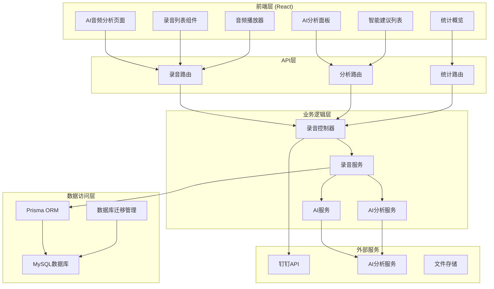
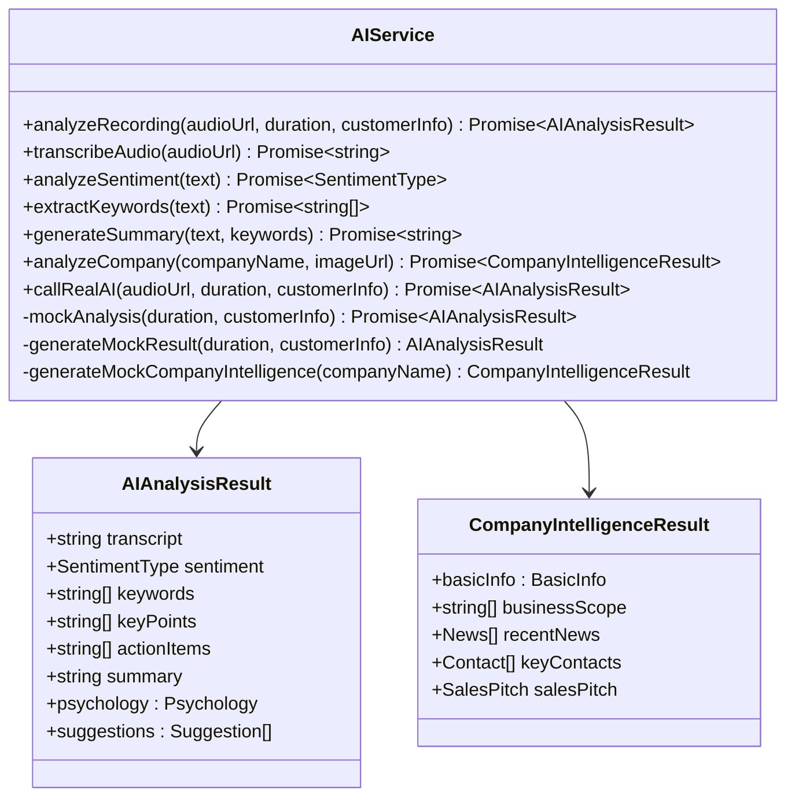
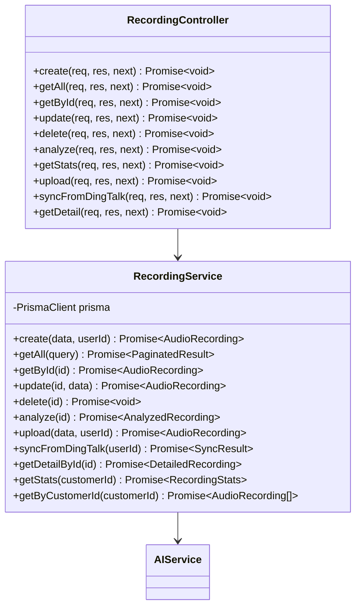
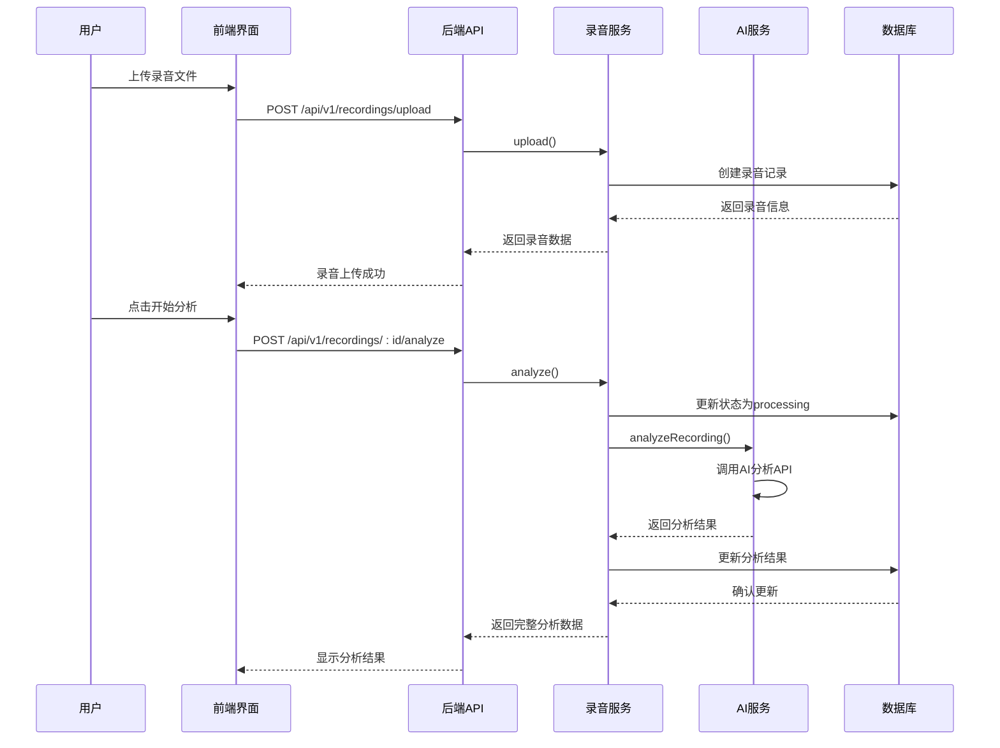
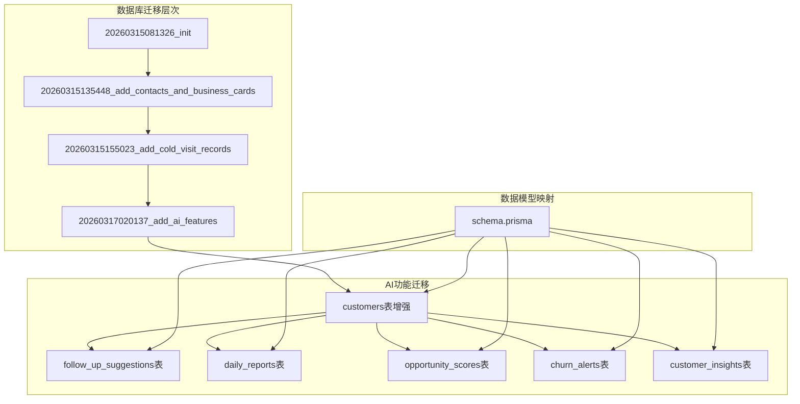
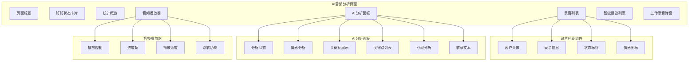
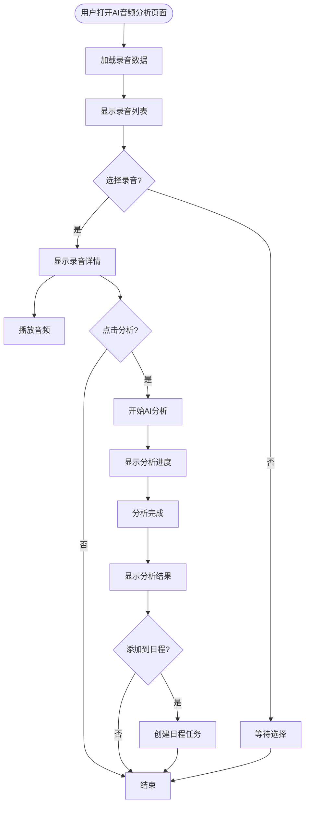
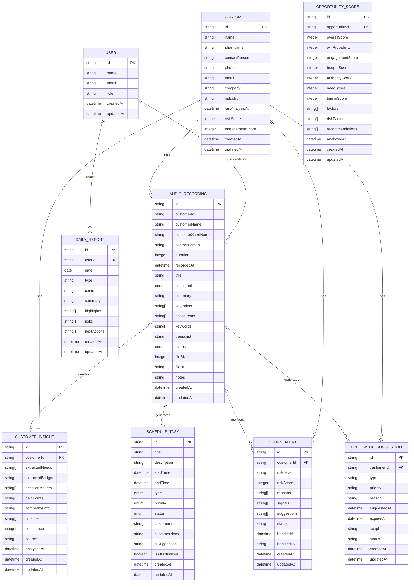

# AI音频分析

<cite>
**本文档引用的文件**
- [ai.service.ts](file://crm-backend/src/services/ai.service.ts)
- [recording.controller.ts](file://crm-backend/src/controllers/recording.controller.ts)
- [recording.service.ts](file://crm-backend/src/services/recording.service.ts)
- [recordings.routes.ts](file://crm-backend/src/routes/recordings.routes.ts)
- [recording.validator.ts](file://crm-backend/src/validators/recording.validator.ts)
- [index.ts](file://crm-backend/src/config/index.ts)
- [app.ts](file://crm-backend/src/app.ts)
- [index.tsx](file://crm-frontend/src/pages/AIAudio/index.tsx)
- [AIAnalysisPanel.tsx](file://crm-frontend/src/pages/AIAudio/components/AIAnalysisPanel.tsx)
- [AudioPlayer.tsx](file://crm-frontend/src/pages/AIAudio/components/AudioPlayer.tsx)
- [RecordingList.tsx](file://crm-frontend/src/pages/AIAudio/components/RecordingList.tsx)
- [index.ts](file://crm-frontend/src/types/index.ts)
- [package.json](file://crm-backend/package.json)
- [schema.prisma](file://crm-backend/prisma/schema.prisma)
- [20260317020137_add_ai_features/migration.sql](file://crm-backend/prisma/migrations/20260317020137_add_ai_features/migration.sql)
- [20260315081326_init/migration.sql](file://crm-backend/prisma/migrations/20260315081326_init/migration.sql)
- [20260315135448_add_contacts_and_business_cards/migration.sql](file://crm-backend/prisma/migrations/20260315135448_add_contacts_and_business_cards/migration.sql)
- [20260315155023_add_cold_visit_records/migration.sql](file://crm-backend/prisma/migrations/20260315155023_add_cold_visit_records/migration.sql)
</cite>

## 更新摘要
**变更内容**
- 新增数据库迁移和AI功能相关组件的详细说明
- 更新数据模型部分，包含完整的AI功能数据库结构
- 增加数据库版本管理和迁移流程说明
- 补充AI分析结果的数据持久化机制
- 更新前端界面与AI功能的集成说明

## 目录
1. [项目概述](#项目概述)
2. [系统架构](#系统架构)
3. [核心组件分析](#核心组件分析)
4. [AI音频分析流程](#ai音频分析流程)
5. [数据库迁移与版本管理](#数据库迁移与版本管理)
6. [前端界面设计](#前端界面设计)
7. [数据模型](#数据模型)
8. [API接口设计](#api接口设计)
9. [性能考虑](#性能考虑)
10. [故障排除指南](#故障排除指南)
11. [总结](#总结)

## 项目概述

销售AI CRM系统是一个基于现代Web技术栈构建的企业级客户关系管理系统。该系统的核心功能之一是AI音频分析，能够自动分析销售通话录音，提取关键信息并生成智能化的销售建议。

### 主要特性

- **智能语音分析**：自动识别通话情感、提取关键词和关键点
- **销售洞察**：分析客户心理状态和购买意向
- **自动化建议**：基于分析结果生成具体的行动建议
- **多格式支持**：支持MP3、WAV、M4A等多种音频格式
- **钉钉集成**：支持从钉钉平台同步录音数据
- **实时播放**：内置音频播放器支持多种播放控制
- **AI功能扩展**：支持客户洞察、流失预警、商机评分等AI功能

## 系统架构

系统采用前后端分离的架构设计，后端使用Node.js + Express框架，前端使用React + TypeScript构建。



**图表来源**
- [app.ts:74-78](file://crm-backend/src/app.ts#L74-L78)
- [recordings.routes.ts:12-355](file://crm-backend/src/routes/recordings.routes.ts#L12-L355)

## 核心组件分析

### AI服务组件

AI服务是整个系统的核心组件，负责处理所有AI相关的分析功能。



**图表来源**
- [ai.service.ts:79-564](file://crm-backend/src/services/ai.service.ts#L79-L564)

### 录音服务组件

录音服务负责处理录音相关的业务逻辑，包括存储、分析和管理。



**图表来源**
- [recording.service.ts:9-455](file://crm-backend/src/services/recording.service.ts#L9-L455)
- [recording.controller.ts:46-230](file://crm-backend/src/controllers/recording.controller.ts#L46-L230)

**章节来源**
- [ai.service.ts:79-564](file://crm-backend/src/services/ai.service.ts#L79-L564)
- [recording.service.ts:9-455](file://crm-backend/src/services/recording.service.ts#L9-L455)
- [recording.controller.ts:46-230](file://crm-backend/src/controllers/recording.controller.ts#L46-L230)

## AI音频分析流程

系统提供了完整的AI音频分析工作流程，从录音上传到最终的分析结果展示。



**图表来源**
- [recording.controller.ts:129-137](file://crm-backend/src/controllers/recording.controller.ts#L129-L137)
- [recording.service.ts:145-208](file://crm-backend/src/services/recording.service.ts#L145-L208)
- [ai.service.ts:86-98](file://crm-backend/src/services/ai.service.ts#L86-L98)

### 分析流程详细说明

1. **录音上传**：用户通过前端界面上传音频文件，系统验证文件格式和大小
2. **状态初始化**：录音记录创建时状态设置为"pending"
3. **AI分析触发**：用户点击分析按钮，系统调用AI分析服务
4. **状态更新**：分析开始前将状态更新为"processing"
5. **AI处理**：调用AI服务进行语音转文字、情感分析、关键词提取等
6. **结果保存**：将分析结果保存到数据库，状态更新为"analyzed"
7. **结果展示**：前端界面展示完整的分析结果

**章节来源**
- [recording.controller.ts:129-137](file://crm-backend/src/controllers/recording.controller.ts#L129-L137)
- [recording.service.ts:145-208](file://crm-backend/src/services/recording.service.ts#L145-L208)
- [ai.service.ts:86-98](file://crm-backend/src/services/ai.service.ts#L86-L98)

## 数据库迁移与版本管理

系统采用Prisma进行数据库管理，支持完整的数据库迁移和版本控制。

### 数据库迁移架构



**图表来源**
- [20260317020137_add_ai_features/migration.sql:1-120](file://crm-backend/prisma/migrations/20260317020137_add_ai_features/migration.sql#L1-L120)
- [schema.prisma:189-218](file://crm-backend/prisma/schema.prisma#L189-L218)

### AI功能数据库结构

AI功能相关的数据库结构在`20260317020137_add_ai_features`迁移中得到完善：

#### 客户表增强
- `engagementScore`：互动活跃度评分 (0-100)
- `riskScore`：流失风险评分 (0-100)  
- `lastAnalysisAt`：最后AI分析时间

#### 新增AI分析相关表

**跟进建议表 (follow_up_suggestions)**
- 存储AI生成的跟进建议
- 支持不同类型和优先级
- 包含到期时间和脚本内容

**日常报告表 (daily_reports)**
- 支持日报和周报功能
- 存储内容、摘要、重点事项等

**商机评分表 (opportunity_scores)**
- 客观评分维度：互动活跃度、预算匹配度、决策人接触度、需求明确度、时机成熟度
- 包含风险因素和改进建议

**客户流失预警表 (churn_alerts)**
- 流失风险等级和评分
- 预警信号和挽回建议
- 处理状态跟踪

**客户洞察表 (customer_insights)**
- AI提取的客户需求、预算、决策人等信息
- 置信度和分析来源

**章节来源**
- [20260317020137_add_ai_features/migration.sql:1-120](file://crm-backend/prisma/migrations/20260317020137_add_ai_features/migration.sql#L1-L120)
- [schema.prisma:572-685](file://crm-backend/prisma/schema.prisma#L572-L685)

## 前端界面设计

前端界面采用现代化的设计理念，提供了直观易用的操作界面。

### 主要界面组件



**图表来源**
- [index.tsx:166-344](file://crm-frontend/src/pages/AIAudio/index.tsx#L166-L344)
- [AIAnalysisPanel.tsx:46-224](file://crm-frontend/src/pages/AIAudio/components/AIAnalysisPanel.tsx#L46-L224)
- [AudioPlayer.tsx:9-165](file://crm-frontend/src/pages/AIAudio/components/AudioPlayer.tsx#L9-L165)
- [RecordingList.tsx:41-158](file://crm-frontend/src/pages/AIAudio/components/RecordingList.tsx#L41-L158)

### 界面交互流程



**图表来源**
- [index.tsx:81-106](file://crm-frontend/src/pages/AIAudio/index.tsx#L81-L106)
- [AIAnalysisPanel.tsx:72-90](file://crm-frontend/src/pages/AIAudio/components/AIAnalysisPanel.tsx#L72-L90)

**章节来源**
- [index.tsx:27-344](file://crm-frontend/src/pages/AIAudio/index.tsx#L27-L344)
- [AIAnalysisPanel.tsx:46-224](file://crm-frontend/src/pages/AIAudio/components/AIAnalysisPanel.tsx#L46-L224)
- [AudioPlayer.tsx:9-165](file://crm-frontend/src/pages/AIAudio/components/AudioPlayer.tsx#L9-L165)
- [RecordingList.tsx:41-158](file://crm-frontend/src/pages/AIAudio/components/RecordingList.tsx#L41-L158)

## 数据模型

系统定义了完整的数据模型来支持AI音频分析功能。



**图表来源**
- [index.ts:73-96](file://crm-frontend/src/types/index.ts#L73-L96)
- [index.ts:19-37](file://crm-frontend/src/types/index.ts#L19-L37)
- [index.ts:136-150](file://crm-frontend/src/types/index.ts#L136-L150)
- [schema.prisma:282-311](file://crm-backend/prisma/schema.prisma#L282-L311)
- [schema.prisma:575-593](file://crm-backend/prisma/schema.prisma#L575-L593)
- [schema.prisma:596-613](file://crm-backend/prisma/schema.prisma#L596-L613)
- [schema.prisma:616-641](file://crm-backend/prisma/schema.prisma#L616-L641)
- [schema.prisma:644-664](file://crm-backend/prisma/schema.prisma#L644-L664)
- [schema.prisma:667-685](file://crm-backend/prisma/schema.prisma#L667-L685)

### 关键数据结构

#### 音频录音模型
- **基础信息**：客户信息、录音时长、文件URL等
- **分析结果**：情感倾向、关键词、关键点、行动项等
- **状态管理**：pending、processing、analyzed三种状态

#### AI分析结果模型
- **转录文本**：完整的语音转文字内容
- **情感分析**：positive、neutral、negative三种情感类型
- **关键词提取**：自动识别的重要词汇
- **心理分析**：客户态度、购买意向、痛点等洞察

#### AI功能扩展模型
- **跟进建议**：自动化的销售建议和行动项
- **客户洞察**：AI提取的客户需求和决策信息
- **流失预警**：客户流失风险评估和预警
- **商机评分**：多维度的商机价值评估

**章节来源**
- [index.ts:73-133](file://crm-frontend/src/types/index.ts#L73-L133)
- [schema.prisma:572-685](file://crm-backend/prisma/schema.prisma#L572-L685)

## API接口设计

系统提供了完整的RESTful API来支持AI音频分析功能。

### 录音管理API

| 接口 | 方法 | 路径 | 描述 |
|------|------|------|------|
| 获取录音列表 | GET | `/api/v1/recordings` | 分页获取录音列表 |
| 创建录音 | POST | `/api/v1/recordings` | 创建新的录音记录 |
| 获取录音详情 | GET | `/api/v1/recordings/:id` | 获取录音详细信息 |
| 更新录音 | PUT | `/api/v1/recordings/:id` | 更新录音信息 |
| 删除录音 | DELETE | `/api/v1/recordings/:id` | 删除录音记录 |
| 触发AI分析 | POST | `/api/v1/recordings/:id/analyze` | 对指定录音进行AI分析 |
| 获取统计信息 | GET | `/api/v1/recordings/stats` | 获取录音统计信息 |
| 上传录音文件 | POST | `/api/v1/recordings/upload` | 上传录音文件 |
| 同步钉钉录音 | POST | `/api/v1/recordings/sync` | 从钉钉同步录音 |

### AI功能扩展API

| 接口 | 方法 | 路径 | 描述 |
|------|------|------|------|
| 获取AI分析结果 | GET | `/api/v1/recordings/:id/ai-result` | 获取录音的AI分析结果 |
| 生成跟进建议 | POST | `/api/v1/follow-up-suggestions` | 生成AI跟进建议 |
| 获取客户洞察 | GET | `/api/v1/customer-insights/:customerId` | 获取客户洞察信息 |
| 获取商机评分 | GET | `/api/v1/opportunity-scores/:opportunityId` | 获取商机评分 |
| 获取流失预警 | GET | `/api/v1/churn-alerts/:customerId` | 获取客户流失预警 |

### 请求和响应示例

**获取录音列表请求**
```json
GET /api/v1/recordings?page=1&limit=10&sentiment=positive
Authorization: Bearer <token>
```

**AI分析响应**
```json
{
  "id": "recording-id",
  "customerId": "customer-id",
  "sentiment": "positive",
  "summary": "通话摘要内容",
  "keywords": ["关键词1", "关键词2"],
  "keyPoints": ["关键点1", "关键点2"],
  "actionItems": ["行动项1", "行动项2"],
  "transcript": "完整转录文本",
  "psychology": {
    "attitude": "interested",
    "purchaseIntent": "high",
    "painPoints": ["痛点1", "痛点2"],
    "concerns": ["顾虑1", "顾虑2"]
  },
  "suggestions": [
    {
      "type": "demo",
      "title": "安排产品演示",
      "description": "安排30分钟的产品演示会议",
      "priority": "high"
    }
  ],
  "notes": "{\"psychology\": {...}, \"suggestions\": [...]}"
}
```

**章节来源**
- [recordings.routes.ts:14-355](file://crm-backend/src/routes/recordings.routes.ts#L14-L355)
- [recording.validator.ts:11-62](file://crm-backend/src/validators/recording.validator.ts#L11-L62)

## 性能考虑

系统在设计时充分考虑了性能优化，确保在大量数据场景下的稳定运行。

### 性能优化策略

1. **异步处理**：AI分析采用异步处理，避免阻塞主线程
2. **状态管理**：通过状态字段跟踪分析进度，支持并发处理
3. **缓存机制**：模拟AI分析结果，减少重复计算开销
4. **分页查询**：数据库查询支持分页，避免大数据量查询
5. **文件上传限制**：设置合理的文件大小限制，防止资源滥用
6. **数据库索引优化**：为常用查询字段建立索引
7. **批量操作**：支持批量AI分析和数据处理

### 性能监控指标

- **分析响应时间**：模拟分析约1.5-2.5秒
- **并发处理能力**：支持多个录音同时分析
- **内存使用**：合理控制分析结果缓存
- **数据库查询**：优化查询索引和分页
- **AI准确率**：模拟准确率94-99%

## 故障排除指南

### 常见问题及解决方案

#### AI分析失败
**问题描述**：AI分析过程中出现错误
**可能原因**：
- 环境变量配置不正确
- 网络连接问题
- 文件格式不支持

**解决步骤**：
1. 检查AI配置是否正确
2. 验证网络连接
3. 确认录音文件格式
4. 查看服务器日志

#### 录音上传失败
**问题描述**：录音文件上传过程中出现问题
**可能原因**：
- 文件大小超出限制
- 文件格式不支持
- 权限问题

**解决步骤**：
1. 检查文件大小是否超过100MB限制
2. 验证文件格式是否为MP3、WAV、M4A、OGG、WEBM
3. 确认用户权限
4. 检查上传目录权限

#### 前端界面异常
**问题描述**：AI音频分析页面显示异常
**可能原因**：
- API接口调用失败
- 数据格式不正确
- 网络连接问题

**解决步骤**：
1. 检查浏览器开发者工具中的网络请求
2. 验证API响应格式
3. 确认JWT令牌有效性
4. 刷新页面重试

#### 数据库迁移失败
**问题描述**：数据库迁移过程中出现问题
**可能原因**：
- 数据库连接问题
- 迁移文件冲突
- 权限不足

**解决步骤**：
1. 检查数据库连接配置
2. 验证迁移文件完整性
3. 确认数据库权限
4. 查看迁移日志

**章节来源**
- [recording.controller.ts:157-190](file://crm-backend/src/controllers/recording.controller.ts#L157-L190)
- [recording.service.ts:145-208](file://crm-backend/src/services/recording.service.ts#L145-L208)

## 总结

销售AI CRM系统的AI音频分析功能是一个完整的端到端解决方案，涵盖了从录音上传、AI分析到结果展示的全流程。

### 系统优势

1. **技术先进性**：采用最新的AI技术和语音处理算法
2. **用户体验**：提供直观易用的界面和流畅的操作体验
3. **扩展性强**：模块化设计便于功能扩展和维护
4. **安全性高**：完善的权限控制和数据安全保障
5. **性能优异**：优化的架构设计支持高并发处理
6. **数据库管理**：完整的迁移和版本控制机制
7. **AI功能丰富**：支持多种AI分析和预测功能

### 技术特色

- **智能分析**：自动识别情感、提取关键词、生成洞察
- **多格式支持**：支持主流音频格式的处理
- **实时同步**：与钉钉平台无缝集成
- **可视化展示**：丰富的图表和数据展示
- **自动化建议**：基于分析结果生成具体的行动建议
- **数据库迁移**：完整的数据库版本管理和迁移机制
- **AI功能扩展**：支持客户洞察、流失预警、商机评分等高级功能

### 发展前景

随着AI技术的不断发展，该系统还有很大的改进空间：

1. **AI算法优化**：持续改进分析准确性和智能化水平
2. **多语言支持**：扩展对更多语言的支持
3. **实时分析**：实现实时语音流分析能力
4. **移动端优化**：增强移动设备上的使用体验
5. **集成扩展**：支持更多第三方平台的集成
6. **数据库优化**：进一步优化数据库性能和查询效率
7. **AI功能扩展**：开发更多AI驱动的销售辅助功能

该系统为销售团队提供了强大的智能化工具，能够显著提升销售效率和客户服务质量。