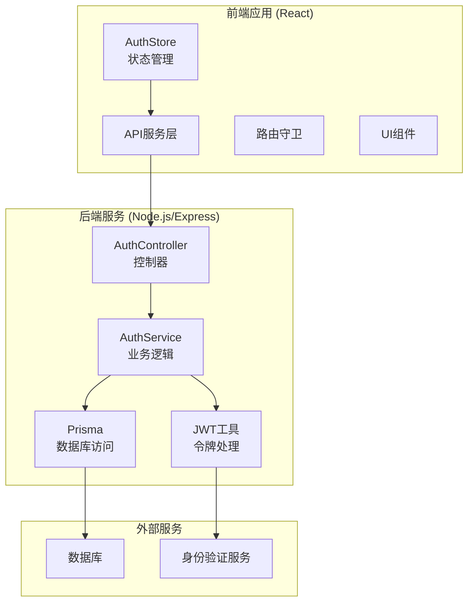
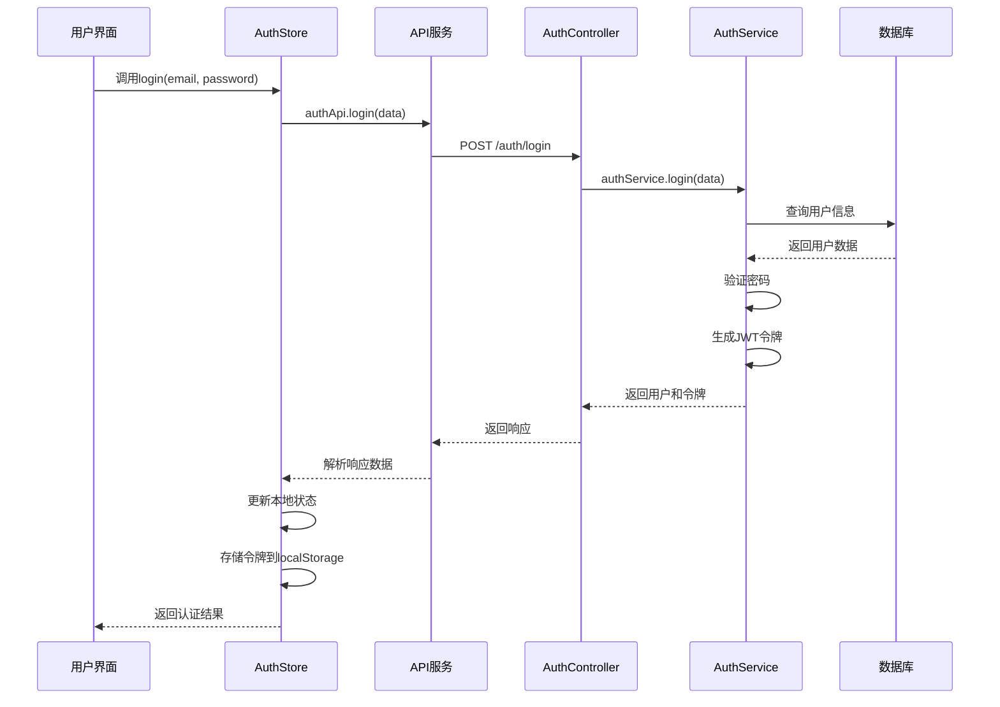
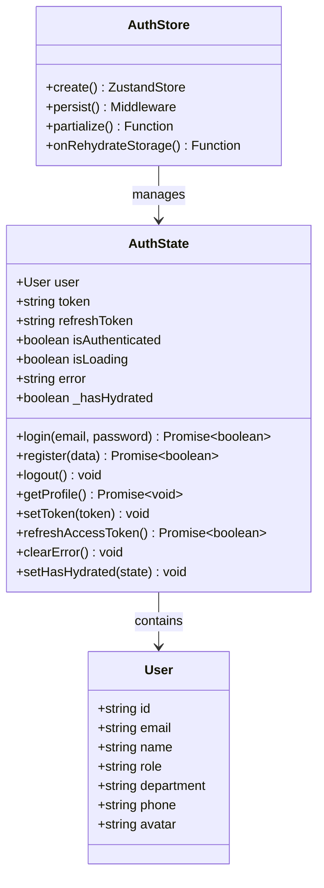
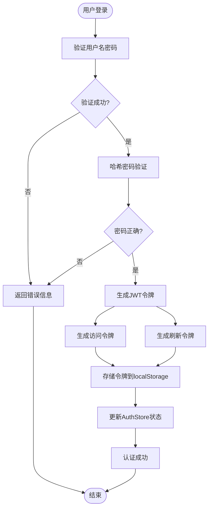
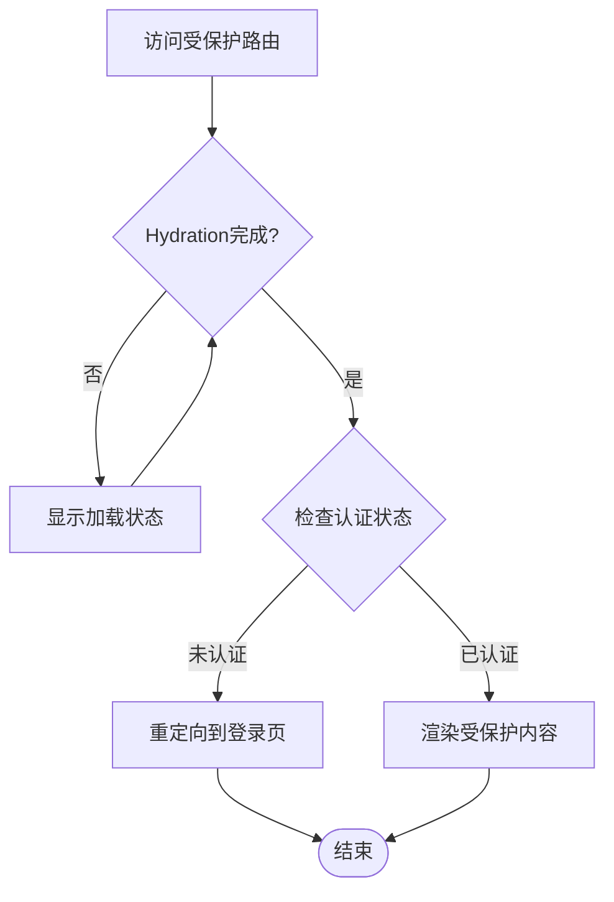
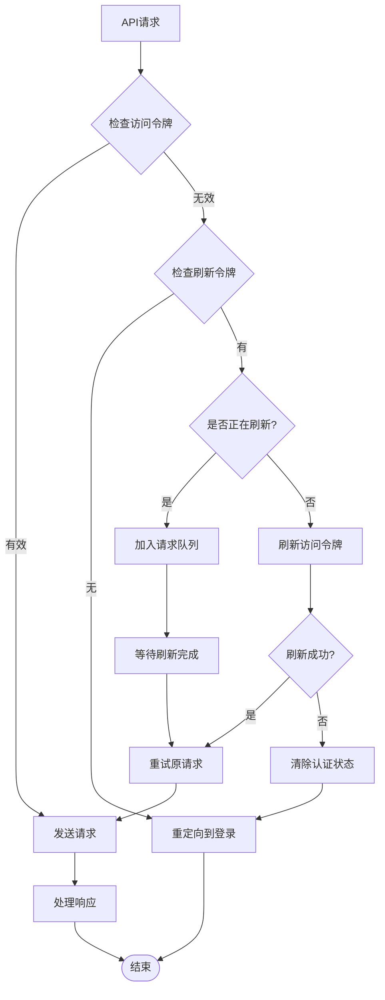
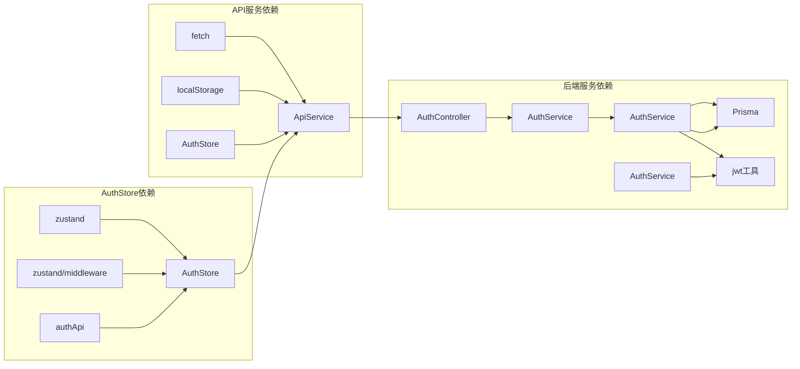

# AuthStore

<cite>
**本文档引用的文件**
- [authStore.ts](file://crm-frontend/src/stores/authStore.ts)
- [api.ts](file://crm-frontend/src/services/api.ts)
- [auth.controller.ts](file://crm-backend/src/controllers/auth.controller.ts)
- [auth.service.ts](file://crm-backend/src/services/auth.service.ts)
- [jwt.ts](file://crm-backend/src/utils/jwt.ts)
- [index.ts](file://crm-frontend/src/stores/index.ts)
- [App.tsx](file://crm-frontend/src/App.tsx)
- [Login/index.tsx](file://crm-frontend/src/pages/Login/index.tsx)
- [Header.tsx](file://crm-frontend/src/components/layout/Header.tsx)
- [package.json](file://crm-frontend/package.json)
</cite>

## 更新摘要
**变更内容**
- 增强了认证系统的令牌刷新机制，新增`refreshAccessToken`方法
- 新增了队列化的并发请求处理，支持`isRefreshing`标志和`failedQueue`队列
- 改进了前端状态管理，增加了`_hasHydrated`状态跟踪机制
- 增加了刷新令牌的持久化存储，支持`refresh_token`的完整生命周期管理

## 目录
1. [简介](#简介)
2. [项目结构](#项目结构)
3. [核心组件](#核心组件)
4. [架构概览](#架构概览)
5. [详细组件分析](#详细组件分析)
6. [依赖关系分析](#依赖关系分析)
7. [性能考虑](#性能考虑)
8. [故障排除指南](#故障排除指南)
9. [结论](#结论)

## 简介

AuthStore是SalesFlow CRM系统中的核心认证状态管理模块，基于Zustand状态管理库构建。该模块负责处理用户的认证状态、令牌管理、用户信息存储以及与后端API的交互。AuthStore采用持久化存储机制，确保用户在浏览器刷新或重新打开应用时能够保持登录状态。

该系统是一个现代化的销售管理CRM平台，集成了AI辅助功能，包括客户洞察、商机评分、流失预警等智能化特性。AuthStore在整个系统中扮演着至关重要的角色，为整个应用提供统一的认证状态管理和路由保护机制。

**更新** 系统现已增强令牌刷新机制，支持队列化的并发请求处理，提供更稳定的认证体验。

## 项目结构

SalesFlow CRM系统采用前后端分离架构，AuthStore位于前端React应用中，负责管理认证相关的所有状态。

**图表来源**
- [authStore.ts:1-175](file://crm-frontend/src/stores/authStore.ts#L1-L175)
- [api.ts:1-800](file://crm-frontend/src/services/api.ts#L1-L800)
- [auth.controller.ts:1-70](file://crm-backend/src/controllers/auth.controller.ts#L1-L70)

**章节来源**
- [authStore.ts:1-175](file://crm-frontend/src/stores/authStore.ts#L1-L175)
- [api.ts:1-800](file://crm-frontend/src/services/api.ts#L1-L800)

## 核心组件

AuthStore模块包含以下核心组件和功能：

### 状态结构
- **用户信息**: 包含用户的基本信息如ID、邮箱、姓名、角色等
- **认证令牌**: 存储访问令牌和刷新令牌
- **认证状态**: 标识用户是否已认证
- **加载状态**: 处理异步操作的状态指示
- **错误处理**: 统一的错误状态管理
- **水合状态**: 跟踪状态初始化完成状态

### 主要方法
- **登录**: 处理用户登录流程
- **注册**: 处理新用户注册
- **登出**: 清除认证状态
- **获取资料**: 拉取用户详细信息
- **设置令牌**: 更新令牌状态
- **刷新令牌**: 刷新访问令牌
- **清理错误**: 清除错误状态
- **设置水合状态**: 跟踪状态初始化

**更新** 新增了`refreshAccessToken`方法用于处理令牌刷新，以及`_hasHydrated`状态用于跟踪水合过程。

**章节来源**
- [authStore.ts:5-39](file://crm-frontend/src/stores/authStore.ts#L5-L39)
- [authStore.ts:41-175](file://crm-frontend/src/stores/authStore.ts#L41-L175)

## 架构概览

AuthStore采用了现代前端状态管理的最佳实践，结合了多种设计模式：

**更新** 架构现在支持双令牌机制，包括访问令牌和刷新令牌的完整生命周期管理。

**图表来源**
- [authStore.ts:54-73](file://crm-frontend/src/stores/authStore.ts#L54-L73)
- [api.ts:174-197](file://crm-frontend/src/services/api.ts#L174-L197)
- [auth.controller.ts:11-14](file://crm-backend/src/controllers/auth.controller.ts#L11-L14)
- [auth.service.ts:53-99](file://crm-backend/src/services/auth.service.ts#L53-L99)

## 详细组件分析

### Zustand Store配置

AuthStore使用Zustand的persist中间件实现状态持久化，确保用户状态在页面刷新后仍然保持。

**更新** 状态结构现在包含`refreshToken`字段和`_hasHydrated`状态，支持完整的令牌生命周期管理。

**图表来源**
- [authStore.ts:15-39](file://crm-frontend/src/stores/authStore.ts#L15-L39)
- [authStore.ts:41-175](file://crm-frontend/src/stores/authStore.ts#L41-L175)

### JWT令牌管理

系统使用JWT（JSON Web Token）进行身份验证，支持访问令牌和刷新令牌的双重机制。

**更新** 令牌管理现在支持刷新令牌的持久化存储，提供更长的会话保持能力。

**图表来源**
- [auth.service.ts:53-99](file://crm-backend/src/services/auth.service.ts#L53-L99)
- [jwt.ts:28-38](file://crm-backend/src/utils/jwt.ts#L28-L38)
- [authStore.ts:54-73](file://crm-frontend/src/stores/authStore.ts#L54-L73)

### 路由守卫机制

AuthStore与React Router集成，提供完整的路由保护功能。

**更新** 路由守卫现在使用`_hasHydrated`状态确保状态完全恢复后再进行认证检查。

**图表来源**
- [App.tsx:25-49](file://crm-frontend/src/App.tsx#L25-L49)
- [authStore.ts:164-172](file://crm-frontend/src/stores/authStore.ts#L164-L172)

### API集成层

AuthStore通过专门的API服务层与后端进行通信，实现了统一的请求处理和错误管理。

**更新** API服务现在支持队列化的并发请求处理，通过`isRefreshing`标志和`failedQueue`队列确保令牌刷新的原子性和一致性。

**图表来源**
- [api.ts:74-139](file://crm-frontend/src/services/api.ts#L74-L139)
- [authStore.ts:132-150](file://crm-frontend/src/stores/authStore.ts#L132-L150)

**章节来源**
- [authStore.ts:1-175](file://crm-frontend/src/stores/authStore.ts#L1-L175)
- [api.ts:174-197](file://crm-frontend/src/services/api.ts#L174-L197)
- [App.tsx:25-49](file://crm-frontend/src/App.tsx#L25-L49)

## 依赖关系分析

AuthStore模块的依赖关系清晰明确，遵循单一职责原则：

**更新** 依赖关系现在包括队列化处理机制，支持并发请求的安全处理。

**图表来源**
- [authStore.ts:1-3](file://crm-frontend/src/stores/authStore.ts#L1-L3)
- [api.ts:25-169](file://crm-frontend/src/services/api.ts#L25-L169)
- [auth.controller.ts:1-3](file://crm-backend/src/controllers/auth.controller.ts#L1-L3)

### 外部依赖

系统使用的主要外部依赖包括：
- **Zustand**: 轻量级状态管理库
- **React Router**: 路由管理
- **Tailwind CSS**: 样式框架
- **TypeScript**: 类型安全

**章节来源**
- [package.json:12-38](file://crm-frontend/package.json#L12-L38)
- [authStore.ts:1-3](file://crm-frontend/src/stores/authStore.ts#L1-L3)

## 性能考虑

AuthStore在设计时充分考虑了性能优化：

### 状态最小化
- 使用`partialize`函数只持久化必要的状态数据
- 避免存储大型对象或不必要的数据

### 异步操作优化
- 并发处理多个异步请求
- 实现请求去重机制
- 优化错误处理流程

### 内存管理
- 及时清理过期的认证状态
- 避免内存泄漏
- 优化状态更新频率

**更新** 性能考虑现在包括队列化处理的内存管理，确保并发请求不会导致内存泄漏。

## 故障排除指南

### 常见问题及解决方案

**认证状态不同步**
- 检查localStorage中的令牌是否存在
- 验证令牌格式和有效期
- 确认后端JWT密钥配置正确

**路由跳转异常**
- 确认`_hasHydrated`状态正确更新
- 检查路由守卫逻辑
- 验证认证状态同步机制

**API调用失败**
- 检查网络连接状态
- 验证API端点配置
- 确认CORS设置正确

**令牌刷新失败**
- 检查`refresh_token`是否存在于localStorage
- 验证后端令牌刷新端点
- 确认`isRefreshing`标志状态

**并发请求冲突**
- 检查`failedQueue`队列是否正确处理
- 验证`isRefreshing`标志的原子性
- 确认队列中的请求得到正确重试

**章节来源**
- [authStore.ts:164-172](file://crm-frontend/src/stores/authStore.ts#L164-L172)
- [api.ts:97-122](file://crm-frontend/src/services/api.ts#L97-L122)

## 结论

AuthStore作为SalesFlow CRM系统的核心认证模块，展现了现代前端状态管理的最佳实践。通过采用Zustand、JWT令牌管理和路由守卫等技术，实现了高效、可靠的用户认证体验。

**更新** 该模块现已显著增强，提供了更完善的令牌管理机制、队列化的并发请求处理和改进的状态管理功能。

该模块的主要优势包括：
- **简洁性**: 基于函数式编程范式的简单API设计
- **可维护性**: 清晰的职责分离和模块化设计
- **可扩展性**: 易于添加新的认证功能和状态管理
- **用户体验**: 平滑的认证流程和状态同步机制
- **稳定性**: 队列化的并发请求处理确保系统可靠性
- **持久化**: 完整的令牌生命周期管理

AuthStore不仅满足了当前的功能需求，还为未来的功能扩展奠定了坚实的基础。通过持续的优化和改进，该模块将继续为SalesFlow CRM系统提供稳定可靠的认证服务。