# 客户详情页面技术文档

<cite>
**本文档引用的文件**
- [CustomerDetail.tsx](file://crm-frontend/src/pages/Customers/CustomerDetail.tsx)
- [CreateOpportunityModal.tsx](file://crm-frontend/src/components/Customers/CreateOpportunityModal.tsx)
- [CreateCustomerModal.tsx](file://crm-frontend/src/components/Customers/CreateCustomerModal.tsx)
- [customerStore.ts](file://crm-frontend/src/stores/customerStore.ts)
- [customer.controller.ts](file://crm-backend/src/controllers/customer.controller.ts)
- [customer.service.ts](file://crm-backend/src/services/customer.service.ts)
- [companySearch.controller.ts](file://crm-backend/src/controllers/companySearch.controller.ts)
- [companySearch.service.ts](file://crm-backend/src/services/companySearch.service.ts)
- [companySearch.routes.ts](file://crm-backend/src/routes/companySearch.routes.ts)
- [opportunity.controller.ts](file://crm-backend/src/controllers/opportunity.controller.ts)
- [opportunity.service.ts](file://crm-backend/src/services/opportunity.service.ts)
- [opportunities.routes.ts](file://crm-backend/src/routes/opportunities.routes.ts)
- [opportunity.validator.ts](file://crm-backend/src/validators/opportunity.validator.ts)
- [CustomerInsightPanel.tsx](file://crm-frontend/src/components/AI/CustomerInsightPanel.tsx)
- [ChurnAlertCard.tsx](file://crm-frontend/src/components/AI/ChurnAlertCard.tsx)
- [index.ts](file://crm-frontend/src/types/index.ts)
- [api.ts](file://crm-frontend/src/services/api.ts)
- [customers.ts](file://crm-frontend/src/data/customers.ts)
- [aiService.ts](file://crm-frontend/src/services/aiService.ts)
- [ai.service.ts](file://crm-backend/src/services/ai.service.ts)
</cite>

## 更新摘要
**变更内容**
- 新增企业搜索集成，支持企业信息自动填充和智能搜索
- 增强客户创建表单的企业信息展示功能
- 完善企业客户信息展示和管理能力
- 集成完整的企业搜索API和数据验证

## 目录
1. [项目概述](#项目概述)
2. [项目结构](#项目结构)
3. [核心组件](#核心组件)
4. [架构概览](#架构概览)
5. [详细组件分析](#详细组件分析)
6. [企业搜索功能](#企业搜索功能)
7. [依赖关系分析](#依赖关系分析)
8. [性能考虑](#性能考虑)
9. [故障排除指南](#故障排除指南)
10. [结论](#结论)

## 项目概述

销售AI CRM系统是一个基于现代Web技术栈构建的企业客户关系管理平台。该系统集成了AI智能分析功能，为销售团队提供客户洞察、流失预警、商机评分等智能化服务。客户详情页面作为系统的核心界面之一，展示了完整的客户信息管理和AI辅助决策功能，现已集成了完整的商机创建和管理工作流以及企业搜索集成功能。

## 项目结构

系统采用前后端分离架构，前端使用React + TypeScript + TailwindCSS，后端使用Node.js + Express + Prisma ORM。

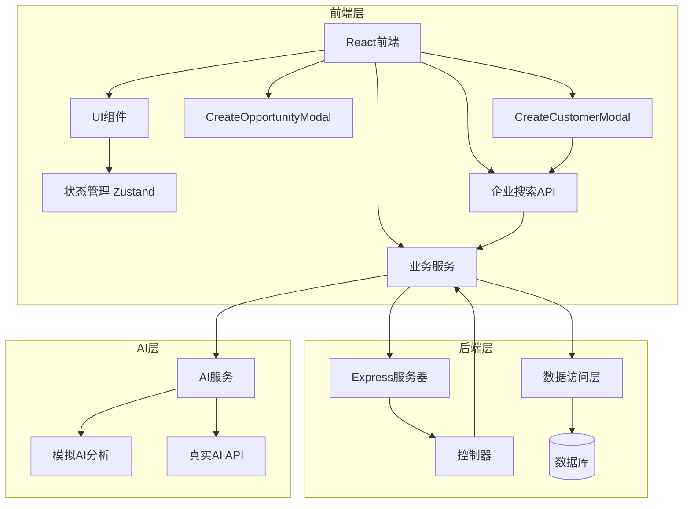

**图表来源**
- [CustomerDetail.tsx:1-337](file://crm-frontend/src/pages/Customers/CustomerDetail.tsx#L1-L337)
- [customer.controller.ts:1-59](file://crm-backend/src/controllers/customer.controller.ts#L1-L59)
- [opportunity.controller.ts:1-59](file://crm-backend/src/controllers/opportunity.controller.ts#L1-L59)
- [companySearch.controller.ts:1-46](file://crm-backend/src/controllers/companySearch.controller.ts#L1-L46)

## 核心组件

### 客户详情页面组件

客户详情页面是系统的核心功能模块，提供了完整的客户信息展示和管理界面。该组件实现了响应式设计，支持多种屏幕尺寸，并集成了AI智能分析功能和全新的商机创建工作流。

**章节来源**
- [CustomerDetail.tsx:48-337](file://crm-frontend/src/pages/Customers/CustomerDetail.tsx#L48-L337)

### 新建机会模态框组件

新增的CreateOpportunityModal组件提供了完整的商机创建界面，支持多种销售阶段、优先级设置和详细的项目信息输入。

**章节来源**
- [CreateOpportunityModal.tsx:1-316](file://crm-frontend/src/components/Customers/CreateOpportunityModal.tsx#L1-L316)

### 企业搜索集成组件

新增的企业搜索功能允许用户通过企业名称、简称或统一社会信用代码快速搜索和填充企业信息，显著提升了客户创建的效率和准确性。

**章节来源**
- [CreateCustomerModal.tsx:91-176](file://crm-frontend/src/components/Customers/CreateCustomerModal.tsx#L91-L176)

### 状态管理系统

系统使用Zustand作为轻量级状态管理解决方案，提供了高效的全局状态管理能力，现已扩展支持商机数据和企业搜索状态的本地管理。

**章节来源**
- [customerStore.ts:15-53](file://crm-frontend/src/stores/customerStore.ts#L15-L53)

### AI智能分析组件

系统集成了多个AI分析组件，包括客户画像分析和流失预警功能，为销售决策提供智能化支持。

**章节来源**
- [CustomerInsightPanel.tsx:80-381](file://crm-frontend/src/components/AI/CustomerInsightPanel.tsx#L80-L381)
- [ChurnAlertCard.tsx:62-326](file://crm-frontend/src/components/AI/ChurnAlertCard.tsx#L62-L326)

## 架构概览

系统采用分层架构设计，确保了代码的可维护性和扩展性。现已集成了完整的商机创建工作流和企业搜索功能。

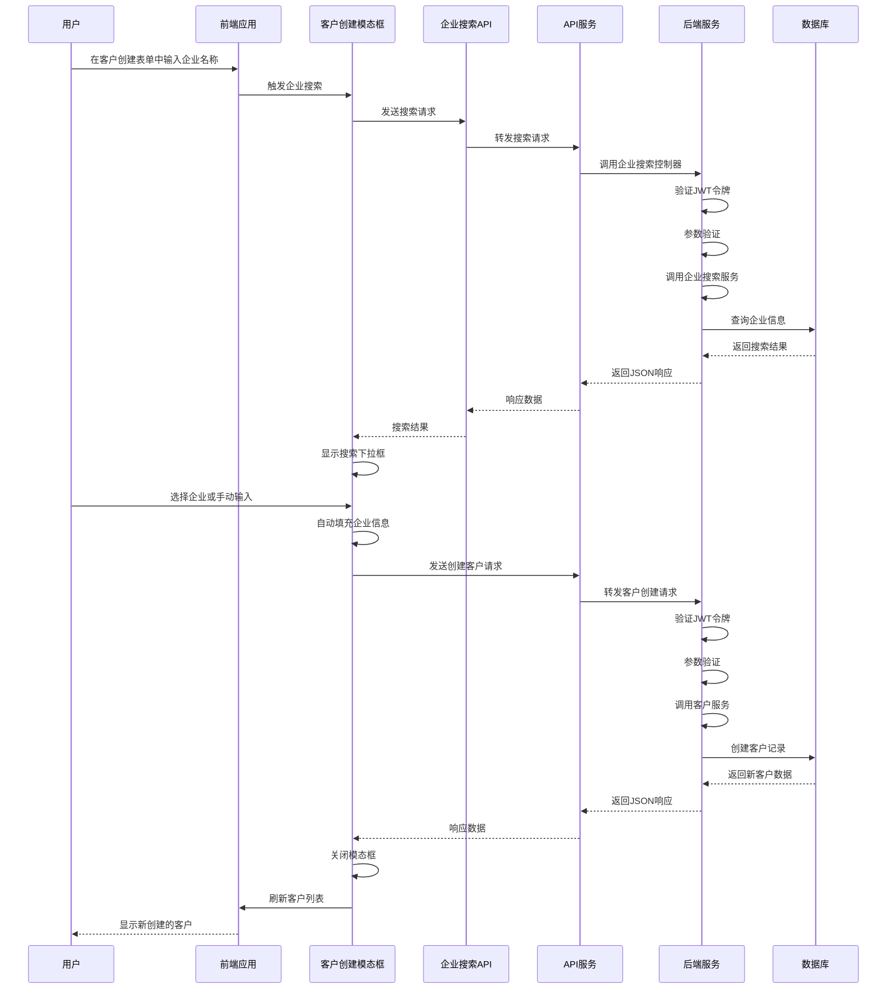

**图表来源**
- [CreateCustomerModal.tsx:100-136](file://crm-frontend/src/components/Customers/CreateCustomerModal.tsx#L100-L136)
- [companySearchApi.search:1221-1226](file://crm-frontend/src/services/api.ts#L1221-L1226)
- [companySearch.controller.search:10-21](file://crm-backend/src/controllers/companySearch.controller.ts#L10-L21)

## 详细组件分析

### 客户详情页面组件

客户详情页面组件是整个系统的核心界面，实现了以下主要功能：

#### 页面布局设计

页面采用卡片式布局，提供了清晰的信息层次结构。顶部包含客户基本信息展示和"新建商机"按钮，下方是功能丰富的操作区域。

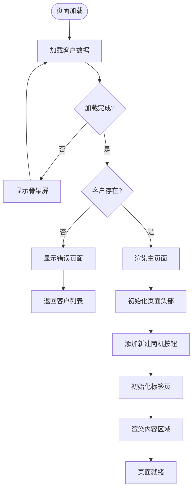

**图表来源**
- [CustomerDetail.tsx:57-103](file://crm-frontend/src/pages/Customers/CustomerDetail.tsx#L57-L103)

#### 标签页功能

页面包含四个主要标签页，每个标签页提供不同的功能视图：

1. **概览** - 展示客户基本信息和关联商机，现已集成商机列表更新
2. **客户画像** - AI生成的客户洞察分析
3. **流失预警** - 客户流失风险评估
4. **活动记录** - 客户互动历史

**章节来源**
- [CustomerDetail.tsx:195-305](file://crm-frontend/src/pages/Customers/CustomerDetail.tsx#L195-L305)

### 新建机会模态框组件

新增的CreateOpportunityModal组件提供了完整的商机创建界面，具有以下特性：

#### 表单设计

模态框包含完整的商机创建表单，支持多种输入类型：

1. **项目名称** - 必填字段，用于标识商机项目
2. **预计金额** - 数字输入，支持金额格式化显示
3. **销售阶段** - 单选按钮组，包含完整的销售阶段选择
4. **成交概率** - 滑块控件，支持0-100%范围调整
5. **优先级** - 三个优先级按钮（高、中、低）
6. **预计成交日期** - 日期选择器
7. **下一步行动** - 文本输入
8. **项目描述** - 多行文本域

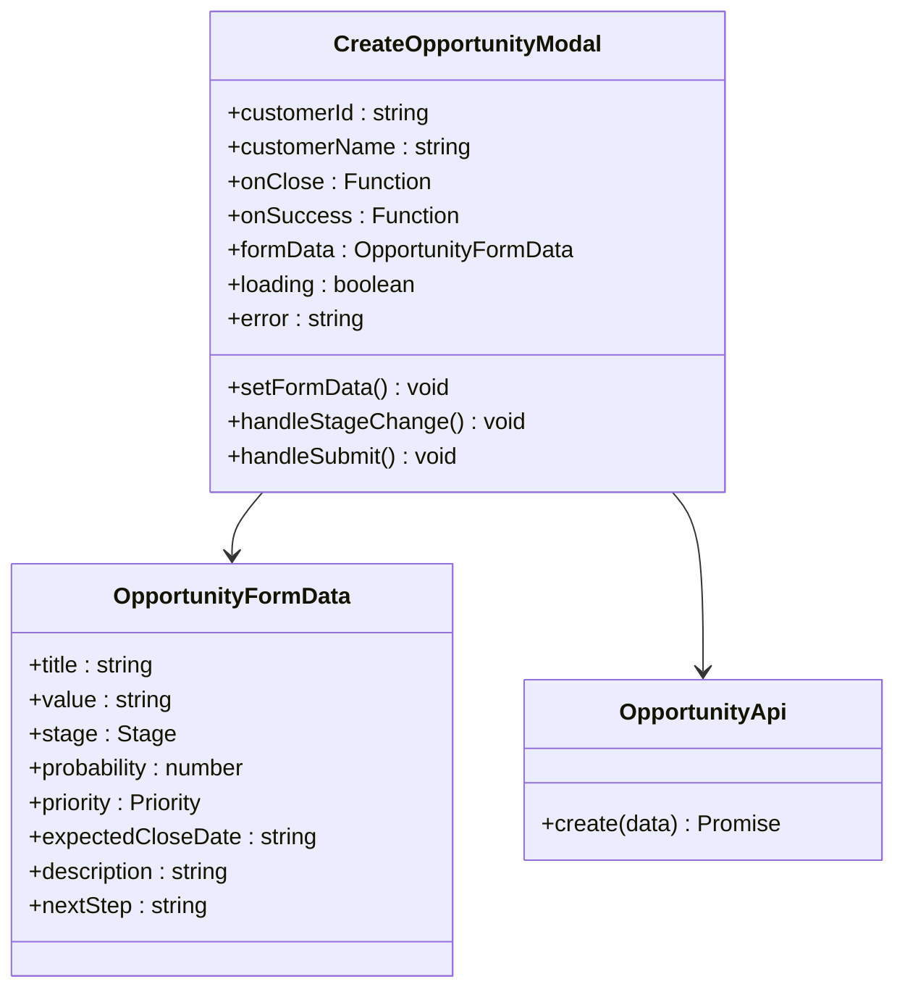

**图表来源**
- [CreateOpportunityModal.tsx:10-28](file://crm-frontend/src/components/Customers/CreateOpportunityModal.tsx#L10-L28)
- [api.ts:159-178](file://crm-frontend/src/services/api.ts#L159-L178)

**章节来源**
- [CreateOpportunityModal.tsx:50-316](file://crm-frontend/src/components/Customers/CreateOpportunityModal.tsx#L50-L316)

### 企业搜索集成组件

新增的企业搜索功能为客户提供了一站式的搜索体验，支持多种搜索方式和智能填充。

#### 搜索功能设计

组件实现了智能的企业搜索功能，包括：

1. **实时搜索** - 输入时自动触发搜索，支持防抖优化
2. **多字段匹配** - 支持企业名称、简称、统一社会信用代码搜索
3. **智能下拉** - 搜索结果以友好界面展示
4. **自动填充** - 选择企业后自动填充所有相关信息
5. **手动输入** - 支持手动输入企业名称作为备选方案

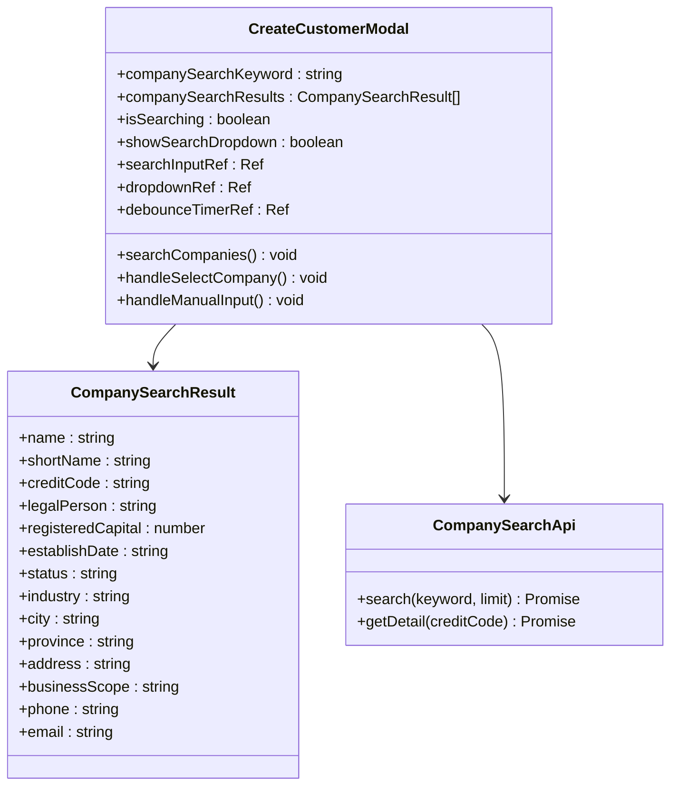

**图表来源**
- [CreateCustomerModal.tsx:91-176](file://crm-frontend/src/components/Customers/CreateCustomerModal.tsx#L91-L176)
- [api.ts:1219-1230](file://crm-frontend/src/services/api.ts#L1219-L1230)

**章节来源**
- [CreateCustomerModal.tsx:100-176](file://crm-frontend/src/components/Customers/CreateCustomerModal.tsx#L100-L176)

### AI智能分析组件

#### 客户画像分析组件

客户画像分析组件提供了全面的客户洞察信息，包括需求分析、决策人识别、痛点分析和竞品信息等。

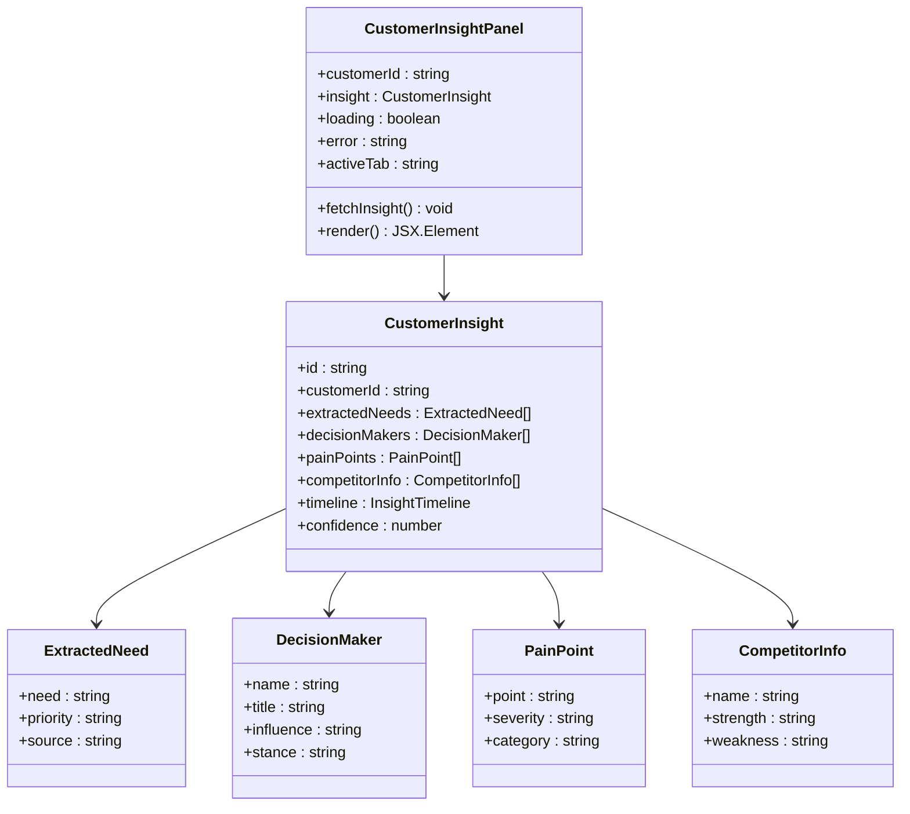

**图表来源**
- [CustomerInsightPanel.tsx:80-381](file://crm-frontend/src/components/AI/CustomerInsightPanel.tsx#L80-L381)
- [index.ts:607-671](file://crm-frontend/src/types/index.ts#L607-L671)

#### 流失预警组件

流失预警组件提供了客户流失风险的实时监控和预警功能，帮助销售团队及时采取挽留措施。

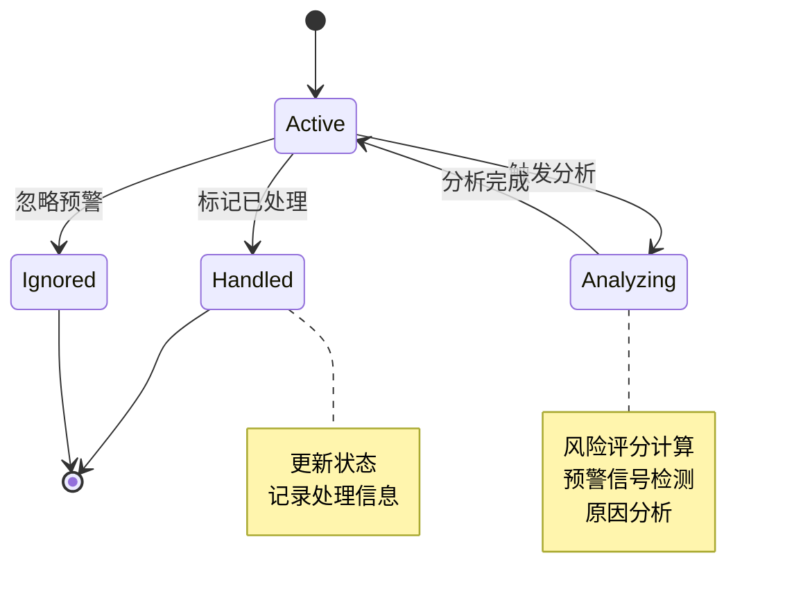

**图表来源**
- [ChurnAlertCard.tsx:62-326](file://crm-frontend/src/components/AI/ChurnAlertCard.tsx#L62-L326)

### 后端服务架构

#### 客户管理服务

后端提供了完整的客户管理API，支持CRUD操作、查询过滤和统计分析功能。

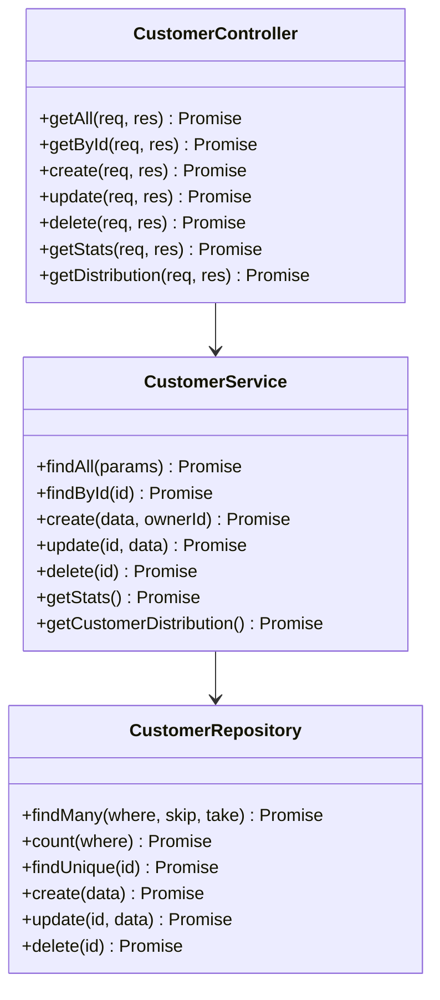

**图表来源**
- [customer.controller.ts:5-59](file://crm-backend/src/controllers/customer.controller.ts#L5-L59)
- [customer.service.ts:5-179](file://crm-backend/src/services/customer.service.ts#L5-L179)

#### 商机管理服务

新增的商机管理服务提供了完整的商机生命周期管理功能，支持创建、更新、删除和阶段移动操作。

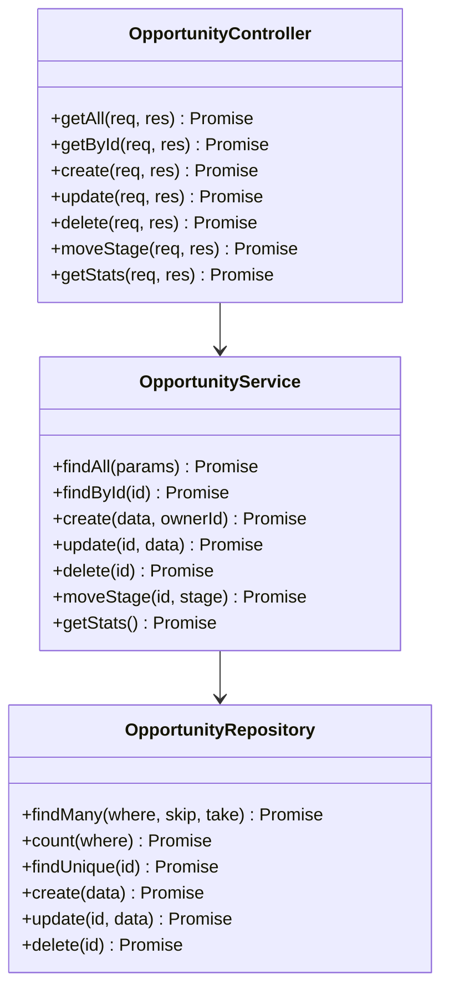

**图表来源**
- [opportunity.controller.ts:5-59](file://crm-backend/src/controllers/opportunity.controller.ts#L5-L59)
- [opportunity.service.ts:5-165](file://crm-backend/src/services/opportunity.service.ts#L5-L165)

#### 企业搜索服务

新增的企业搜索服务提供了智能的企业信息查询功能，支持多种搜索条件和精确匹配。

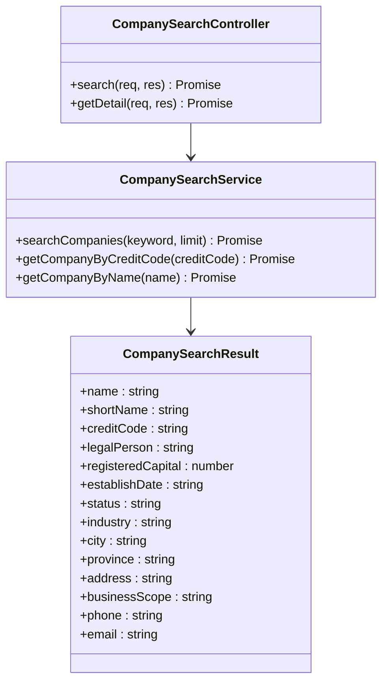

**图表来源**
- [companySearch.controller.ts:5-44](file://crm-backend/src/controllers/companySearch.controller.ts#L5-L44)
- [companySearch.service.ts:268-325](file://crm-backend/src/services/companySearch.service.ts#L268-L325)

**章节来源**
- [customer.controller.ts:1-59](file://crm-backend/src/controllers/customer.controller.ts#L1-L59)
- [opportunity.controller.ts:1-59](file://crm-backend/src/controllers/opportunity.controller.ts#L1-L59)
- [companySearch.controller.ts:1-46](file://crm-backend/src/controllers/companySearch.controller.ts#L1-L46)
- [customer.service.ts:1-179](file://crm-backend/src/services/customer.service.ts#L1-L179)
- [opportunity.service.ts:1-165](file://crm-backend/src/services/opportunity.service.ts#L1-L165)
- [companySearch.service.ts:1-327](file://crm-backend/src/services/companySearch.service.ts#L1-L327)

### 数据验证和类型安全

系统实现了严格的输入验证和类型安全机制，确保数据的完整性和一致性。

**章节来源**
- [customer.validator.ts:1-47](file://crm-backend/src/validators/customer.validator.ts#L1-L47)
- [opportunity.validator.ts:1-43](file://crm-backend/src/validators/opportunity.validator.ts#L1-L43)
- [index.ts:19-774](file://crm-frontend/src/types/index.ts#L19-L774)

## 企业搜索功能

### 功能概述

企业搜索功能是本次更新的重要组成部分，为用户提供了智能的企业信息搜索和填充能力。该功能支持多种搜索方式，包括企业名称、简称、统一社会信用代码等，并能够自动填充相关的企业信息。

### 技术实现

#### 前端实现

前端实现了智能的搜索组件，具有以下特性：

1. **防抖搜索** - 防止频繁的API调用，提升性能
2. **智能下拉** - 搜索结果显示友好的下拉菜单
3. **自动填充** - 选择企业后自动填充所有相关信息
4. **手动输入** - 支持手动输入企业名称作为备选方案
5. **错误处理** - 完善的错误处理和用户反馈机制

#### 后端实现

后端提供了完整的企业搜索API，支持：

1. **关键词搜索** - 支持模糊匹配企业名称、简称、信用代码
2. **精确查询** - 支持根据统一社会信用代码精确查询
3. **结果限制** - 支持搜索结果数量限制
4. **数据验证** - 完整的参数验证和错误处理

### API接口

#### 搜索企业

```
GET /api/v1/companies/search?keyword=华为&limit=10
```

**请求参数**：
- `keyword` (string, 必填): 搜索关键词
- `limit` (integer, 可选): 返回结果数量限制，默认10

**响应数据**：
```typescript
CompanySearchResult[] {
  name: string;              // 企业名称
  shortName: string;         // 企业简称
  creditCode: string;        // 统一社会信用代码
  legalPerson: string;       // 法人代表
  registeredCapital: number; // 注册资本（万元）
  establishDate: string;     // 成立日期
  status: string;            // 企业状态
  industry: string;          // 行业
  city: string;              // 城市
  province: string;          // 省份
  address: string;           // 详细地址
  businessScope: string;     // 经营范围
  phone?: string;            // 联系电话
  email?: string;            // 邮箱
}
```

#### 获取企业详情

```
GET /api/v1/companies/{creditCode}
```

**路径参数**：
- `creditCode` (string, 必填): 统一社会信用代码

**响应数据**：
与搜索结果相同的企业信息结构

**章节来源**
- [companySearch.controller.ts:10-43](file://crm-backend/src/controllers/companySearch.controller.ts#L10-L43)
- [companySearch.routes.ts:7-55](file://crm-backend/src/routes/companySearch.routes.ts#L7-L55)
- [companySearchApi.search:1221-1229](file://crm-frontend/src/services/api.ts#L1221-L1229)

## 依赖关系分析

系统各组件之间的依赖关系清晰明确，遵循了单一职责原则和依赖倒置原则。现已集成了商机创建和企业搜索相关的依赖关系。

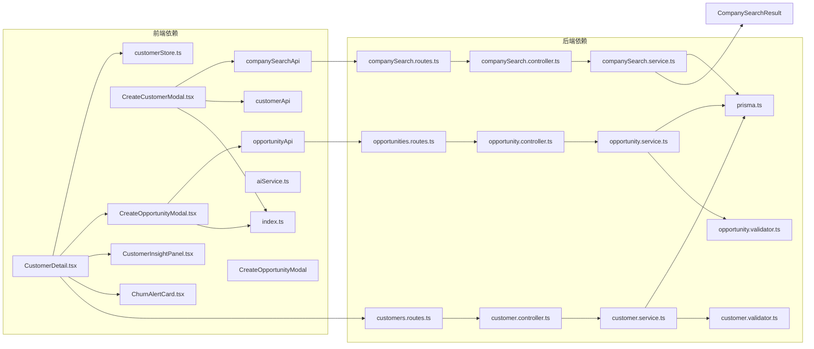

**图表来源**
- [CustomerDetail.tsx:8-11](file://crm-frontend/src/pages/Customers/CustomerDetail.tsx#L8-L11)
- [opportunity.controller.ts:2-3](file://crm-backend/src/controllers/opportunity.controller.ts#L2-L3)
- [companySearch.controller.ts:2-3](file://crm-backend/src/controllers/companySearch.controller.ts#L2-L3)

**章节来源**
- [CustomerDetail.tsx:1-337](file://crm-frontend/src/pages/Customers/CustomerDetail.tsx#L1-L337)
- [opportunity.controller.ts:1-59](file://crm-backend/src/controllers/opportunity.controller.ts#L1-L59)
- [companySearch.controller.ts:1-46](file://crm-backend/src/controllers/companySearch.controller.ts#L1-L46)

## 性能考虑

系统在设计时充分考虑了性能优化，采用了多种策略来提升用户体验。新增的商机创建功能和企业搜索功能也包含了相应的性能优化考虑：

### 前端性能优化

1. **懒加载组件** - AI分析组件按需加载，减少初始包体积
2. **骨架屏** - 数据加载时显示骨架屏，提升感知性能
3. **状态缓存** - 使用Zustand进行高效的状态管理
4. **虚拟滚动** - 对大量数据进行虚拟化处理
5. **模态框优化** - 模态框按需渲染，避免不必要的DOM操作
6. **防抖搜索** - 企业搜索实现防抖机制，减少API调用频率
7. **搜索结果缓存** - 搜索结果在一定时间内缓存，提升重复搜索性能

### 后端性能优化

1. **数据库索引** - 为常用查询字段建立索引
2. **查询优化** - 使用分页和条件过滤减少数据传输
3. **连接池** - 使用数据库连接池提高并发处理能力
4. **缓存策略** - 对静态数据进行缓存
5. **批量操作** - 支持批量商机创建和更新
6. **搜索优化** - 企业搜索实现模糊匹配优化
7. **响应压缩** - API响应数据进行压缩传输

## 故障排除指南

### 常见问题及解决方案

#### API调用失败

**问题症状**：页面无法加载或显示错误信息

**可能原因**：
1. JWT令牌过期或无效
2. 网络连接问题
3. 后端服务未启动

**解决步骤**：
1. 检查浏览器控制台的网络请求
2. 验证JWT令牌是否正确设置
3. 确认后端服务运行状态

#### 商机创建失败

**问题症状**：点击"新建商机"按钮后无响应或显示错误

**可能原因**：
1. 商机API服务不可用
2. 输入数据验证失败
3. 用户权限不足
4. 网络连接中断

**解决步骤**：
1. 检查浏览器控制台是否有JavaScript错误
2. 验证表单输入是否符合要求
3. 确认用户具有创建商机的权限
4. 检查网络连接状态
5. 查看后端服务日志

#### 企业搜索失败

**问题症状**：企业搜索功能无法正常工作

**可能原因**：
1. 企业搜索API服务不可用
2. 搜索关键词格式不正确
3. 网络连接问题
4. 后端数据库查询异常

**解决步骤**：
1. 检查浏览器控制台是否有JavaScript错误
2. 验证搜索关键词长度和格式
3. 确认网络连接状态
4. 检查后端服务日志
5. 验证数据库连接状态

#### AI功能异常

**问题症状**：AI分析组件显示加载失败或空白

**可能原因**：
1. AI服务配置缺失
2. 真实AI API调用失败
3. 模拟数据生成异常

**解决步骤**：
1. 检查环境变量配置
2. 验证AI服务密钥设置
3. 查看AI服务日志

**章节来源**
- [aiService.ts:24-31](file://crm-frontend/src/services/aiService.ts#L24-L31)
- [ai.service.ts:66-73](file://crm-backend/src/services/ai.service.ts#L66-L73)

### 调试技巧

1. **启用开发模式** - 使用`npm run dev`启动开发服务器
2. **查看控制台日志** - 检查JavaScript错误和警告
3. **使用浏览器开发者工具** - 分析网络请求和性能
4. **检查API响应** - 验证后端接口返回的数据格式
5. **监控模态框状态** - 确保模态框正确显示和关闭
6. **调试企业搜索** - 使用浏览器网络面板检查搜索请求
7. **验证数据流** - 确保企业搜索结果正确填充到表单

## 结论

客户详情页面作为销售AI CRM系统的核心功能模块，展现了现代Web应用的最佳实践。系统通过前后端分离架构、AI智能分析、状态管理和响应式设计，为用户提供了完整的客户管理体验。

**主要功能增强**：
1. **完整的商机创建工作流** - 新增"新建商机"按钮和模态框组件
2. **智能企业搜索功能** - 支持企业信息自动填充和智能搜索
3. **实时机会列表更新** - 创建成功后自动刷新商机列表
4. **企业客户信息管理** - 完整的企业信息展示和管理能力
5. **完整的数据验证** - 前后端双重验证确保数据完整性
6. **用户友好的界面设计** - 直观的表单设计和反馈机制

**系统优势**：
1. **完整的功能覆盖** - 从基础客户信息管理到高级AI分析、企业搜索和商机创建
2. **良好的用户体验** - 响应式设计和流畅的交互体验
3. **可扩展的架构** - 清晰的分层设计便于功能扩展
4. **类型安全保证** - TypeScript提供编译时类型检查
5. **性能优化** - 多种策略确保系统的高效运行
6. **智能搜索能力** - 企业搜索功能大幅提升工作效率

**未来发展方向**：
- 更丰富的AI分析功能
- 实时数据同步
- 移动端适配优化
- 更多的自定义配置选项
- 批量商机管理功能
- 商机预测和分析功能
- 企业信息深度分析功能
- 智能推荐和匹配功能