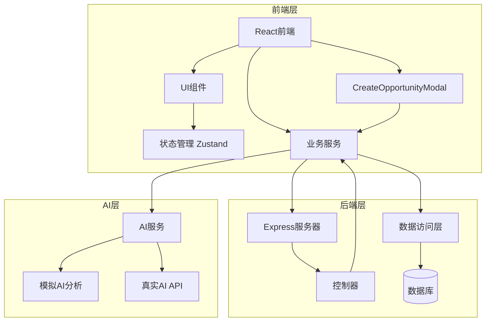
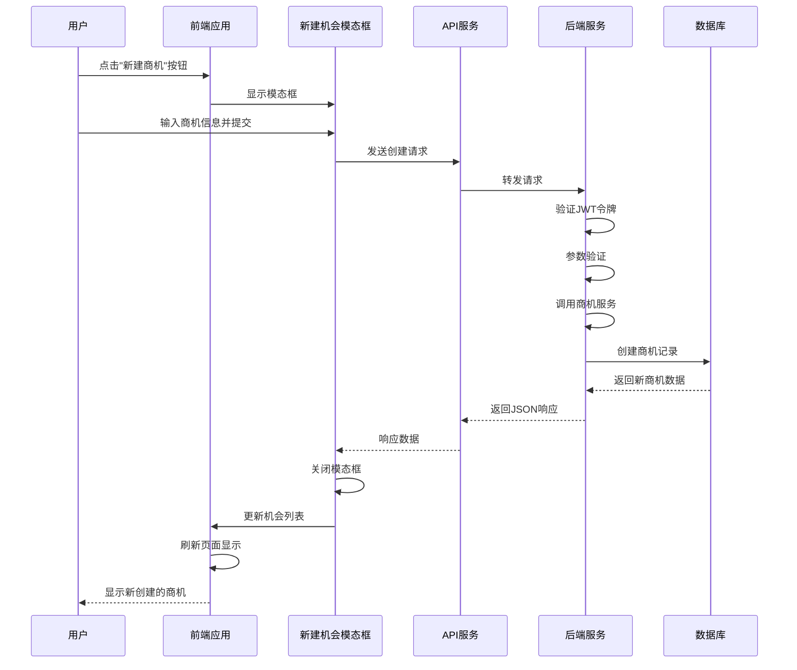
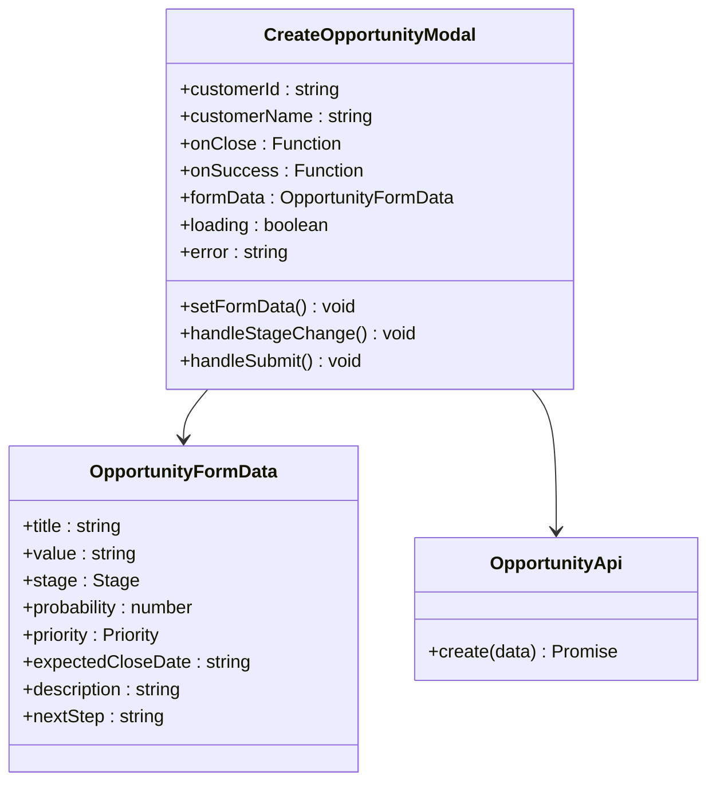
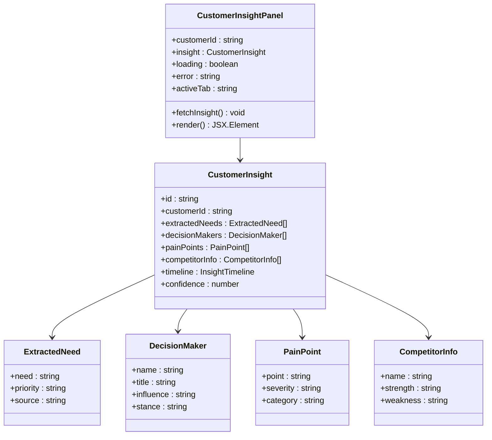
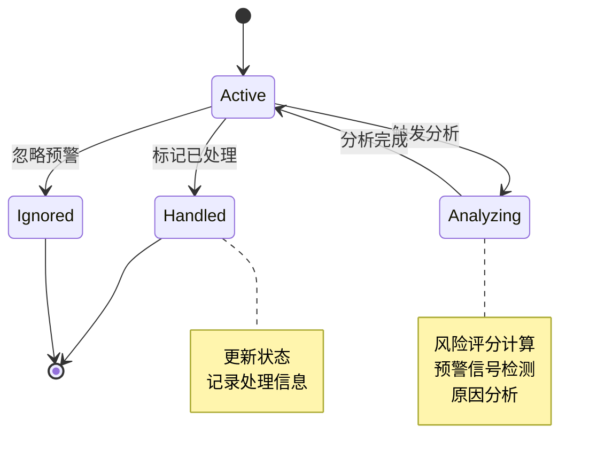
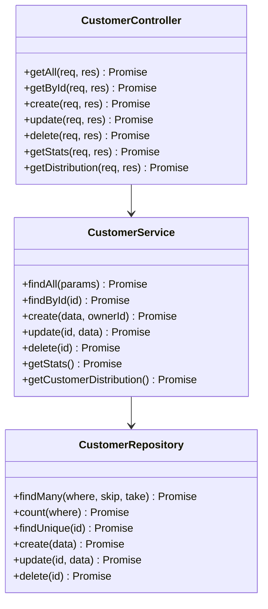
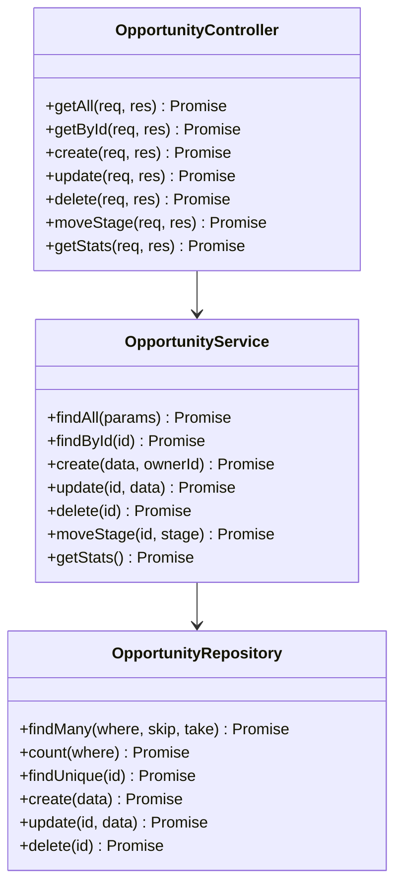
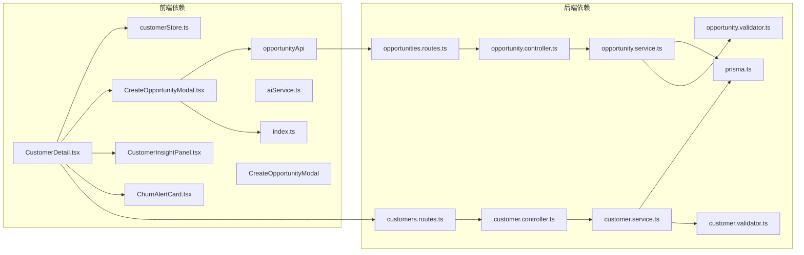

# 客户详情页面技术文档

<cite>
**本文档引用的文件**
- [CustomerDetail.tsx](file://crm-frontend/src/pages/Customers/CustomerDetail.tsx)
- [CreateOpportunityModal.tsx](file://crm-frontend/src/components/Customers/CreateOpportunityModal.tsx)
- [customerStore.ts](file://crm-frontend/src/stores/customerStore.ts)
- [customer.controller.ts](file://crm-backend/src/controllers/customer.controller.ts)
- [customer.service.ts](file://crm-backend/src/services/customer.service.ts)
- [opportunity.controller.ts](file://crm-backend/src/controllers/opportunity.controller.ts)
- [opportunity.service.ts](file://crm-backend/src/services/opportunity.service.ts)
- [opportunities.routes.ts](file://crm-backend/src/routes/opportunities.routes.ts)
- [opportunity.validator.ts](file://crm-backend/src/validators/opportunity.validator.ts)
- [CustomerInsightPanel.tsx](file://crm-frontend/src/components/AI/CustomerInsightPanel.tsx)
- [ChurnAlertCard.tsx](file://crm-frontend/src/components/AI/ChurnAlertCard.tsx)
- [index.ts](file://crm-frontend/src/types/index.ts)
- [api.ts](file://crm-frontend/src/services/api.ts)
- [customers.ts](file://crm-frontend/src/data/customers.ts)
- [aiService.ts](file://crm-frontend/src/services/aiService.ts)
- [ai.service.ts](file://crm-backend/src/services/ai.service.ts)
</cite>

## 更新摘要
**变更内容**
- 新增"新建机会"按钮和完整的创建机会工作流程
- 集成CreateOpportunityModal模态框组件
- 实现机会列表的实时更新和状态管理
- 完善商机API集成和数据验证

## 目录
1. [项目概述](#项目概述)
2. [项目结构](#项目结构)
3. [核心组件](#核心组件)
4. [架构概览](#架构概览)
5. [详细组件分析](#详细组件分析)
6. [依赖关系分析](#依赖关系分析)
7. [性能考虑](#性能考虑)
8. [故障排除指南](#故障排除指南)
9. [结论](#结论)

## 项目概述

销售AI CRM系统是一个基于现代Web技术栈构建的企业客户关系管理平台。该系统集成了AI智能分析功能，为销售团队提供客户洞察、流失预警、商机评分等智能化服务。客户详情页面作为系统的核心界面之一，展示了完整的客户信息管理和AI辅助决策功能，现已集成了完整的商机创建和管理工作流。

## 项目结构

系统采用前后端分离架构，前端使用React + TypeScript + TailwindCSS，后端使用Node.js + Express + Prisma ORM。

**图表来源**
- [CustomerDetail.tsx:1-337](file://crm-frontend/src/pages/Customers/CustomerDetail.tsx#L1-L337)
- [customer.controller.ts:1-59](file://crm-backend/src/controllers/customer.controller.ts#L1-L59)
- [opportunity.controller.ts:1-59](file://crm-backend/src/controllers/opportunity.controller.ts#L1-L59)

## 核心组件

### 客户详情页面组件

客户详情页面是系统的核心功能模块，提供了完整的客户信息展示和管理界面。该组件实现了响应式设计，支持多种屏幕尺寸，并集成了AI智能分析功能和全新的商机创建工作流。

**章节来源**
- [CustomerDetail.tsx:48-337](file://crm-frontend/src/pages/Customers/CustomerDetail.tsx#L48-L337)

### 新建机会模态框组件

新增的CreateOpportunityModal组件提供了完整的商机创建界面，支持多种销售阶段、优先级设置和详细的项目信息输入。

**章节来源**
- [CreateOpportunityModal.tsx:1-316](file://crm-frontend/src/components/Customers/CreateOpportunityModal.tsx#L1-L316)

### 状态管理系统

系统使用Zustand作为轻量级状态管理解决方案，提供了高效的全局状态管理能力，现已扩展支持商机数据的本地状态管理。

**章节来源**
- [customerStore.ts:15-53](file://crm-frontend/src/stores/customerStore.ts#L15-L53)

### AI智能分析组件

系统集成了多个AI分析组件，包括客户画像分析和流失预警功能，为销售决策提供智能化支持。

**章节来源**
- [CustomerInsightPanel.tsx:80-381](file://crm-frontend/src/components/AI/CustomerInsightPanel.tsx#L80-L381)
- [ChurnAlertCard.tsx:62-326](file://crm-frontend/src/components/AI/ChurnAlertCard.tsx#L62-L326)

## 架构概览

系统采用分层架构设计，确保了代码的可维护性和扩展性。现已集成了完整的商机创建工作流。

**图表来源**
- [CustomerDetail.tsx:162-168](file://crm-frontend/src/pages/Customers/CustomerDetail.tsx#L162-L168)
- [CreateOpportunityModal.tsx:80-109](file://crm-frontend/src/components/Customers/CreateOpportunityModal.tsx#L80-L109)

## 详细组件分析

### 客户详情页面组件

客户详情页面组件是整个系统的核心界面，实现了以下主要功能：

#### 页面布局设计

页面采用卡片式布局，提供了清晰的信息层次结构。顶部包含客户基本信息展示和"新建商机"按钮，下方是功能丰富的操作区域。

**图表来源**
- [CustomerDetail.tsx:57-103](file://crm-frontend/src/pages/Customers/CustomerDetail.tsx#L57-L103)

#### 标签页功能

页面包含四个主要标签页，每个标签页提供不同的功能视图：

1. **概览** - 展示客户基本信息和关联商机，现已集成商机列表更新
2. **客户画像** - AI生成的客户洞察分析
3. **流失预警** - 客户流失风险评估
4. **活动记录** - 客户互动历史

**章节来源**
- [CustomerDetail.tsx:195-305](file://crm-frontend/src/pages/Customers/CustomerDetail.tsx#L195-L305)

### 新建机会模态框组件

新增的CreateOpportunityModal组件提供了完整的商机创建界面，具有以下特性：

#### 表单设计

模态框包含完整的商机创建表单，支持多种输入类型：

1. **项目名称** - 必填字段，用于标识商机项目
2. **预计金额** - 数字输入，支持金额格式化显示
3. **销售阶段** - 单选按钮组，包含完整的销售阶段选择
4. **成交概率** - 滑块控件，支持0-100%范围调整
5. **优先级** - 三个优先级按钮（高、中、低）
6. **预计成交日期** - 日期选择器
7. **下一步行动** - 文本输入
8. **项目描述** - 多行文本域

**图表来源**
- [CreateOpportunityModal.tsx:10-28](file://crm-frontend/src/components/Customers/CreateOpportunityModal.tsx#L10-L28)
- [api.ts:159-178](file://crm-frontend/src/services/api.ts#L159-L178)

**章节来源**
- [CreateOpportunityModal.tsx:50-316](file://crm-frontend/src/components/Customers/CreateOpportunityModal.tsx#L50-L316)

### AI智能分析组件

#### 客户画像分析组件

客户画像分析组件提供了全面的客户洞察信息，包括需求分析、决策人识别、痛点分析和竞品信息等。

**图表来源**
- [CustomerInsightPanel.tsx:80-381](file://crm-frontend/src/components/AI/CustomerInsightPanel.tsx#L80-L381)
- [index.ts:607-671](file://crm-frontend/src/types/index.ts#L607-L671)

#### 流失预警组件

流失预警组件提供了客户流失风险的实时监控和预警功能，帮助销售团队及时采取挽留措施。

**图表来源**
- [ChurnAlertCard.tsx:62-326](file://crm-frontend/src/components/AI/ChurnAlertCard.tsx#L62-L326)

### 后端服务架构

#### 客户管理服务

后端提供了完整的客户管理API，支持CRUD操作、查询过滤和统计分析功能。

**图表来源**
- [customer.controller.ts:5-59](file://crm-backend/src/controllers/customer.controller.ts#L5-L59)
- [customer.service.ts:5-179](file://crm-backend/src/services/customer.service.ts#L5-L179)

#### 商机管理服务

新增的商机管理服务提供了完整的商机生命周期管理功能，支持创建、更新、删除和阶段移动操作。

**图表来源**
- [opportunity.controller.ts:5-59](file://crm-backend/src/controllers/opportunity.controller.ts#L5-L59)
- [opportunity.service.ts:5-165](file://crm-backend/src/services/opportunity.service.ts#L5-L165)

**章节来源**
- [customer.controller.ts:1-59](file://crm-backend/src/controllers/customer.controller.ts#L1-L59)
- [opportunity.controller.ts:1-59](file://crm-backend/src/controllers/opportunity.controller.ts#L1-L59)
- [customer.service.ts:1-179](file://crm-backend/src/services/customer.service.ts#L1-L179)
- [opportunity.service.ts:1-165](file://crm-backend/src/services/opportunity.service.ts#L1-L165)

### 数据验证和类型安全

系统实现了严格的输入验证和类型安全机制，确保数据的完整性和一致性。

**章节来源**
- [customer.validator.ts:1-47](file://crm-backend/src/validators/customer.validator.ts#L1-L47)
- [opportunity.validator.ts:1-43](file://crm-backend/src/validators/opportunity.validator.ts#L1-L43)
- [index.ts:19-677](file://crm-frontend/src/types/index.ts#L19-L677)

## 依赖关系分析

系统各组件之间的依赖关系清晰明确，遵循了单一职责原则和依赖倒置原则。现已集成了商机创建相关的依赖关系。

**图表来源**
- [CustomerDetail.tsx:8-11](file://crm-frontend/src/pages/Customers/CustomerDetail.tsx#L8-L11)
- [opportunity.controller.ts:2-3](file://crm-backend/src/controllers/opportunity.controller.ts#L2-L3)

**章节来源**
- [CustomerDetail.tsx:1-337](file://crm-frontend/src/pages/Customers/CustomerDetail.tsx#L1-L337)
- [opportunity.controller.ts:1-59](file://crm-backend/src/controllers/opportunity.controller.ts#L1-L59)

## 性能考虑

系统在设计时充分考虑了性能优化，采用了多种策略来提升用户体验。新增的商机创建功能也包含了相应的性能优化考虑：

### 前端性能优化

1. **懒加载组件** - AI分析组件按需加载，减少初始包体积
2. **骨架屏** - 数据加载时显示骨架屏，提升感知性能
3. **状态缓存** - 使用Zustand进行高效的状态管理
4. **虚拟滚动** - 对大量数据进行虚拟化处理
5. **模态框优化** - 模态框按需渲染，避免不必要的DOM操作

### 后端性能优化

1. **数据库索引** - 为常用查询字段建立索引
2. **查询优化** - 使用分页和条件过滤减少数据传输
3. **连接池** - 使用数据库连接池提高并发处理能力
4. **缓存策略** - 对静态数据进行缓存
5. **批量操作** - 支持批量商机创建和更新

## 故障排除指南

### 常见问题及解决方案

#### API调用失败

**问题症状**：页面无法加载或显示错误信息

**可能原因**：
1. JWT令牌过期或无效
2. 网络连接问题
3. 后端服务未启动

**解决步骤**：
1. 检查浏览器控制台的网络请求
2. 验证JWT令牌是否正确设置
3. 确认后端服务运行状态

#### 商机创建失败

**问题症状**：点击"新建商机"按钮后无响应或显示错误

**可能原因**：
1. 商机API服务不可用
2. 输入数据验证失败
3. 用户权限不足
4. 网络连接中断

**解决步骤**：
1. 检查浏览器控制台是否有JavaScript错误
2. 验证表单输入是否符合要求
3. 确认用户具有创建商机的权限
4. 检查网络连接状态
5. 查看后端服务日志

#### AI功能异常

**问题症状**：AI分析组件显示加载失败或空白

**可能原因**：
1. AI服务配置缺失
2. 真实AI API调用失败
3. 模拟数据生成异常

**解决步骤**：
1. 检查环境变量配置
2. 验证AI服务密钥设置
3. 查看AI服务日志

**章节来源**
- [aiService.ts:24-31](file://crm-frontend/src/services/aiService.ts#L24-L31)
- [ai.service.ts:66-73](file://crm-backend/src/services/ai.service.ts#L66-L73)

### 调试技巧

1. **启用开发模式** - 使用`npm run dev`启动开发服务器
2. **查看控制台日志** - 检查JavaScript错误和警告
3. **使用浏览器开发者工具** - 分析网络请求和性能
4. **检查API响应** - 验证后端接口返回的数据格式
5. **监控模态框状态** - 确保模态框正确显示和关闭

## 结论

客户详情页面作为销售AI CRM系统的核心功能模块，展现了现代Web应用的最佳实践。系统通过前后端分离架构、AI智能分析、状态管理和响应式设计，为用户提供了完整的客户管理体验。

**主要功能增强**：
1. **完整的商机创建工作流** - 新增"新建商机"按钮和模态框组件
2. **实时机会列表更新** - 创建成功后自动刷新商机列表
3. **完整的数据验证** - 前后端双重验证确保数据完整性
4. **用户友好的界面设计** - 直观的表单设计和反馈机制

**系统优势**：
1. **完整的功能覆盖** - 从基础客户信息管理到高级AI分析和商机创建
2. **良好的用户体验** - 响应式设计和流畅的交互体验
3. **可扩展的架构** - 清晰的分层设计便于功能扩展
4. **类型安全保证** - TypeScript提供编译时类型检查
5. **性能优化** - 多种策略确保系统的高效运行

**未来发展方向**：
- 更丰富的AI分析功能
- 实时数据同步
- 移动端适配优化
- 更多的自定义配置选项
- 批量商机管理功能
- 商机预测和分析功能