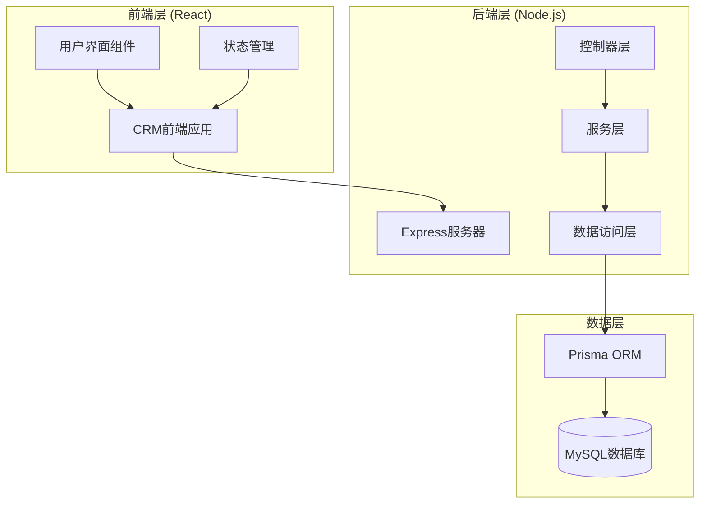
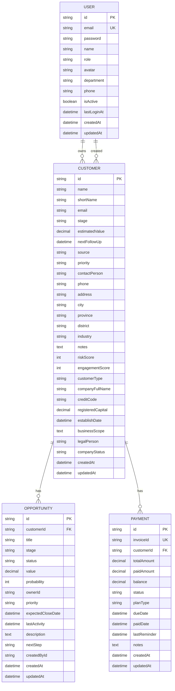
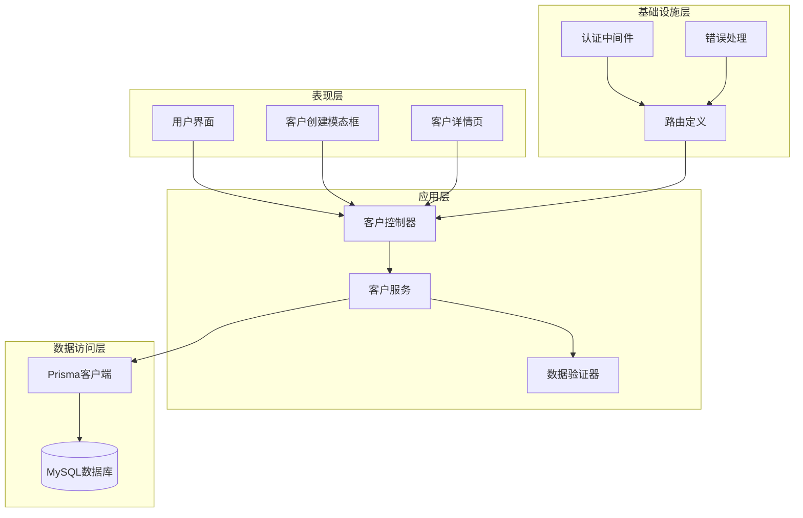
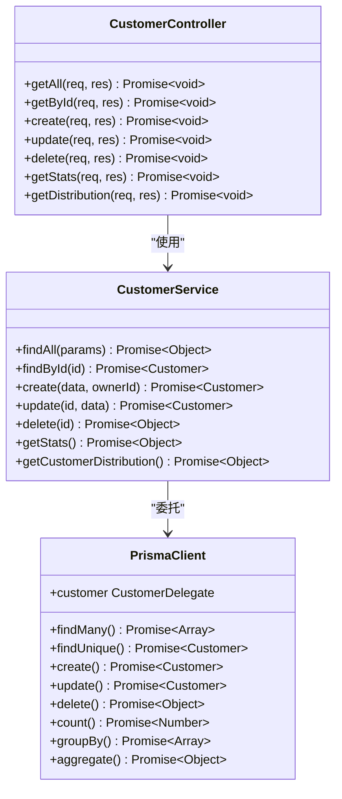
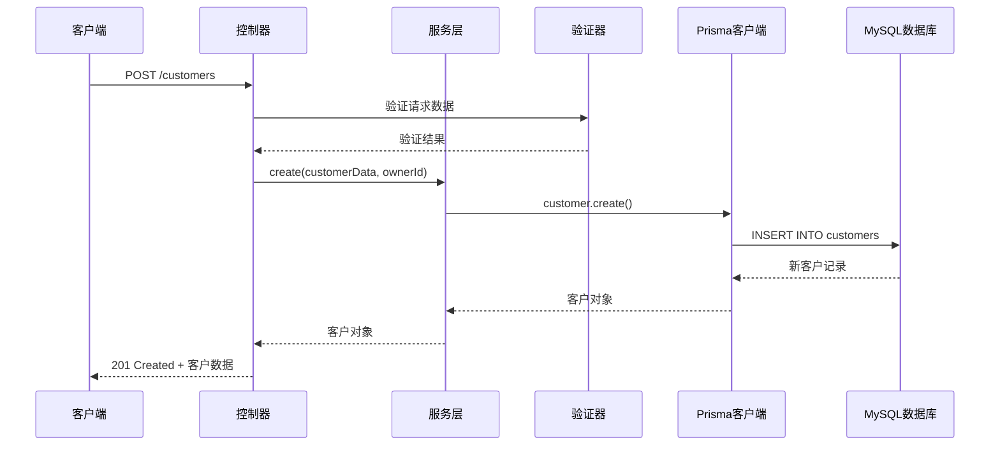
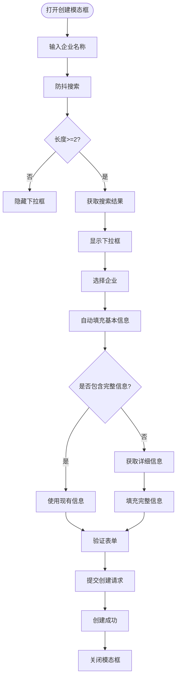
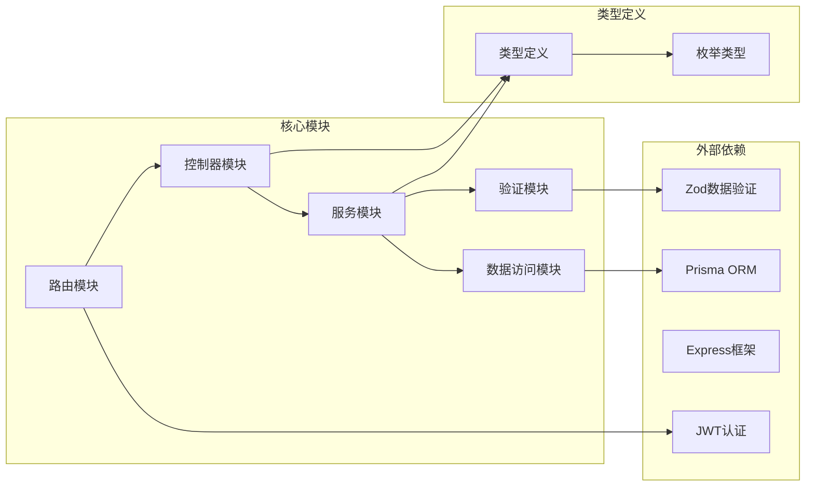
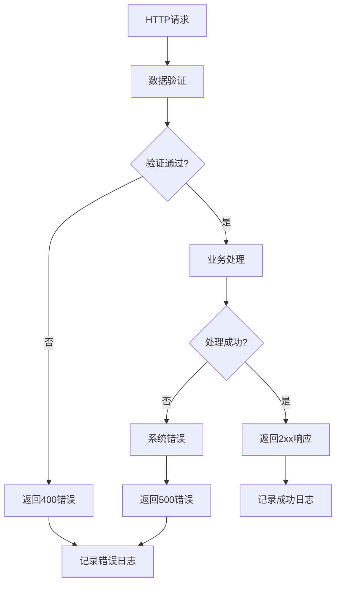

# 客户管理

<cite>
**本文档引用的文件**
- [customer.controller.ts](file://crm-backend/src/controllers/customer.controller.ts)
- [customer.service.ts](file://crm-backend/src/services/customer.service.ts)
- [customers.routes.ts](file://crm-backend/src/routes/customers.routes.ts)
- [prisma.ts](file://crm-backend/src/repositories/prisma.ts)
- [customer.validator.ts](file://crm-backend/src/validators/customer.validator.ts)
- [index.ts](file://crm-backend/src/types/index.ts)
- [auth.ts](file://crm-backend/src/middlewares/auth.ts)
- [response.ts](file://crm-backend/src/utils/response.ts)
- [app.ts](file://crm-backend/src/app.ts)
- [schema.prisma](file://crm-backend/prisma/schema.prisma)
- [CreateCustomerModal.tsx](file://crm-frontend/src/components/Customers/CreateCustomerModal.tsx)
- [CustomerDetail.tsx](file://crm-frontend/src/pages/Customers/CustomerDetail.tsx)
- [index.ts](file://crm-frontend/src/types/index.ts)
</cite>

## 目录
1. [简介](#简介)
2. [项目结构](#项目结构)
3. [核心组件](#核心组件)
4. [架构概览](#架构概览)
5. [详细组件分析](#详细组件分析)
6. [依赖关系分析](#依赖关系分析)
7. [性能考虑](#性能考虑)
8. [故障排除指南](#故障排除指南)
9. [结论](#结论)

## 简介

销售AI CRM系统是一个基于现代Web技术栈构建的企业级客户关系管理平台。该系统集成了人工智能功能，提供智能化的客户管理、商机跟踪、销售预测和团队协作能力。

客户管理模块是整个CRM系统的核心功能之一，负责维护和管理所有客户信息，包括基础信息、企业信息、联系人信息以及与客户相关的各种业务活动。

## 项目结构

系统采用前后端分离的架构设计，主要分为以下层次：

**图表来源**
- [app.ts:1-88](file://crm-backend/src/app.ts#L1-L88)
- [prisma.ts:1-9](file://crm-backend/src/repositories/prisma.ts#L1-L9)

**章节来源**
- [app.ts:1-88](file://crm-backend/src/app.ts#L1-L88)
- [prisma.ts:1-9](file://crm-backend/src/repositories/prisma.ts#L1-L9)

## 核心组件

### 数据模型设计

系统采用Prisma ORM进行数据库抽象，客户管理相关的数据模型设计如下：

**图表来源**
- [schema.prisma:194-265](file://crm-backend/prisma/schema.prisma#L194-L265)
- [schema.prisma:269-298](file://crm-backend/prisma/schema.prisma#L269-L298)
- [schema.prisma:302-325](file://crm-backend/prisma/schema.prisma#L302-L325)

### API接口设计

系统提供了完整的RESTful API接口来管理客户信息：

| 接口 | 方法 | 描述 | 认证 |
|------|------|------|------|
| `/customers` | GET | 获取所有客户列表 | 是 |
| `/customers/stats` | GET | 获取客户统计信息 | 是 |
| `/customers/distribution` | GET | 获取客户分布统计 | 是 |
| `/customers/:id` | GET | 获取指定客户详情 | 是 |
| `/customers` | POST | 创建新客户 | 是 |
| `/customers/:id` | PUT | 更新客户信息 | 是 |
| `/customers/:id` | DELETE | 删除客户 | 是 |

**章节来源**
- [customers.routes.ts:1-184](file://crm-backend/src/routes/customers.routes.ts#L1-L184)
- [customer.controller.ts:1-58](file://crm-backend/src/controllers/customer.controller.ts#L1-L58)

## 架构概览

系统采用经典的三层架构模式，确保了良好的可维护性和扩展性：

**图表来源**
- [customer.controller.ts:1-58](file://crm-backend/src/controllers/customer.controller.ts#L1-L58)
- [customer.service.ts:1-225](file://crm-backend/src/services/customer.service.ts#L1-L225)
- [customers.routes.ts:1-184](file://crm-backend/src/routes/customers.routes.ts#L1-L184)

**章节来源**
- [customer.controller.ts:1-58](file://crm-backend/src/controllers/customer.controller.ts#L1-L58)
- [customer.service.ts:1-225](file://crm-backend/src/services/customer.service.ts#L1-L225)
- [customers.routes.ts:1-184](file://crm-backend/src/routes/customers.routes.ts#L1-L184)

## 详细组件分析

### 客户控制器 (CustomerController)

客户控制器负责处理HTTP请求和响应，实现了标准的CRUD操作：

**图表来源**
- [customer.controller.ts:5-56](file://crm-backend/src/controllers/customer.controller.ts#L5-L56)
- [customer.service.ts:5-223](file://crm-backend/src/services/customer.service.ts#L5-L223)
- [prisma.ts:1-9](file://crm-backend/src/repositories/prisma.ts#L1-L9)

#### 核心功能实现

1. **分页查询功能**：支持按阶段、优先级、来源和搜索关键词进行过滤查询
2. **统计分析功能**：提供客户总数、活跃客户数、总价值等关键指标
3. **分布统计功能**：按城市、行业、来源维度统计客户分布情况
4. **数据验证**：使用Zod库进行输入参数的严格验证

**章节来源**
- [customer.controller.ts:6-55](file://crm-backend/src/controllers/customer.controller.ts#L6-L55)
- [customer.service.ts:6-222](file://crm-backend/src/services/customer.service.ts#L6-L222)

### 客户服务层 (CustomerService)

客户服务层封装了所有业务逻辑，提供了完整的数据操作能力：

**图表来源**
- [customer.controller.ts:29-33](file://crm-backend/src/controllers/customer.controller.ts#L29-L33)
- [customer.service.ts:76-109](file://crm-backend/src/services/customer.service.ts#L76-L109)
- [customer.validator.ts:6-33](file://crm-backend/src/validators/customer.validator.ts#L6-L33)

#### 业务逻辑特点

1. **异步处理**：所有数据库操作都使用Promise进行异步处理
2. **错误处理**：统一的错误处理机制，提供清晰的错误信息
3. **数据完整性**：确保所有必填字段都有默认值
4. **权限控制**：支持所有者和创建者的关联关系

**章节来源**
- [customer.service.ts:76-168](file://crm-backend/src/services/customer.service.ts#L76-L168)

### 数据验证器 (CustomerValidator)

使用Zod库实现强大的数据验证功能：

| 字段名 | 类型 | 必填 | 验证规则 | 默认值 |
|--------|------|------|----------|--------|
| name | string | 是 | min(1) | 无 |
| shortName | string | 是 | min(1), max(10) | 无 |
| email | string | 否 | email() | '' |
| stage | enum | 否 | new_lead, contacted, solution, negotiation, won | new_lead |
| estimatedValue | number | 否 | min(0) | 0 |
| priority | enum | 否 | high, medium, low | medium |
| contactPerson | string | 是 | min(1) | 无 |
| customerType | enum | 否 | user, non_user, valid_non_user, invalid_non_user | non_user |

**章节来源**
- [customer.validator.ts:1-74](file://crm-backend/src/validators/customer.validator.ts#L1-L74)

### 前端组件集成

#### 客户创建模态框

前端提供了直观的客户创建界面，集成了企业搜索和自动填充功能：

**图表来源**
- [CreateCustomerModal.tsx:101-218](file://crm-frontend/src/components/Customers/CreateCustomerModal.tsx#L101-L218)

#### 客户详情页面

提供全面的客户信息展示和管理功能：

| 功能模块 | 描述 | 实现方式 |
|----------|------|----------|
| 基本信息展示 | 显示客户核心信息 | 静态数据展示 |
| 客户画像 | AI生成的客户洞察 | 组件集成 |
| 流失预警 | 客户流失风险评估 | 组件集成 |
| 商机关联 | 展示相关销售机会 | 动态数据绑定 |
| 活动记录 | 客户互动历史 | 占位符功能 |

**章节来源**
- [CreateCustomerModal.tsx:1-749](file://crm-frontend/src/components/Customers/CreateCustomerModal.tsx#L1-L749)
- [CustomerDetail.tsx:1-337](file://crm-frontend/src/pages/Customers/CustomerDetail.tsx#L1-L337)

## 依赖关系分析

系统各组件之间的依赖关系如下：

**图表来源**
- [customers.routes.ts:1-6](file://crm-backend/src/routes/customers.routes.ts#L1-L6)
- [customer.controller.ts:1-4](file://crm-backend/src/controllers/customer.controller.ts#L1-L4)
- [customer.service.ts:1-4](file://crm-backend/src/services/customer.service.ts#L1-L4)

**章节来源**
- [customers.routes.ts:1-6](file://crm-backend/src/routes/customers.routes.ts#L1-L6)
- [customer.controller.ts:1-4](file://crm-backend/src/controllers/customer.controller.ts#L1-L4)
- [customer.service.ts:1-4](file://crm-backend/src/services/customer.service.ts#L1-L4)

## 性能考虑

### 数据库优化策略

1. **索引优化**：为常用查询字段建立索引
   - `stage` 字段索引用于快速筛选客户阶段
   - `priority` 字段索引用于优先级排序
   - `city` 字段索引用于地理位置查询

2. **查询优化**：使用分页和限制返回字段数量
   - 默认每页10条记录
   - 条件查询使用OR组合优化

3. **连接池管理**：合理配置数据库连接池大小

### 缓存策略

1. **API响应缓存**：对于静态统计数据可以考虑缓存
2. **会话管理**：JWT令牌的合理过期时间设置
3. **前端缓存**：用户界面组件的状态缓存

### 并发处理

1. **异步操作**：所有数据库操作都是异步的
2. **错误恢复**：完善的错误处理和重试机制
3. **资源清理**：及时释放数据库连接和内存资源

## 故障排除指南

### 常见问题及解决方案

| 问题类型 | 症状 | 可能原因 | 解决方案 |
|----------|------|----------|----------|
| 认证失败 | 401 Unauthorized | JWT令牌无效或过期 | 检查令牌格式和有效期 |
| 数据验证错误 | 400 Bad Request | 请求数据格式不正确 | 检查Zod验证规则 |
| 数据库连接失败 | 连接超时 | 数据库服务不可用 | 检查数据库连接配置 |
| 查询性能问题 | 响应时间过长 | 缺少索引或查询复杂 | 优化查询语句和添加索引 |

### 错误处理机制

系统实现了统一的错误处理机制：

**图表来源**
- [response.ts:19-61](file://crm-backend/src/utils/response.ts#L19-L61)
- [auth.ts:13-33](file://crm-backend/src/middlewares/auth.ts#L13-L33)

**章节来源**
- [response.ts:19-127](file://crm-backend/src/utils/response.ts#L19-L127)
- [auth.ts:13-69](file://crm-backend/src/middlewares/auth.ts#L13-L69)

## 结论

销售AI CRM系统的客户管理模块展现了现代Web应用的最佳实践：

1. **架构清晰**：采用分层架构，职责分离明确
2. **功能完整**：覆盖了客户管理的所有核心需求
3. **技术先进**：使用TypeScript、Prisma、React等现代技术栈
4. **用户体验**：提供直观易用的界面和流畅的操作体验
5. **可扩展性**：模块化设计便于功能扩展和维护

该系统为客户关系管理提供了强有力的技术支撑，通过AI功能的集成，进一步提升了销售效率和客户满意度。未来可以在实时通信、移动端支持、更多AI功能等方面继续优化和扩展。