# 数据库架构

<cite>
**本文档引用的文件**
- [schema.prisma](file://crm-backend/prisma/schema.prisma)
- [20260315081326_init/migration.sql](file://crm-backend/prisma/migrations/20260315081326_init/migration.sql)
- [20260315135448_add_contacts_and_business_cards/migration.sql](file://crm-backend/prisma/migrations/20260315135448_add_contacts_and_business_cards/migration.sql)
- [20260315155023_add_cold_visit_records/migration.sql](file://crm-backend/prisma/migrations/20260315155023_add_cold_visit_records/migration.sql)
- [20260317020137_add_ai_features/migration.sql](file://crm-backend/prisma/migrations/20260317020137_add_ai_features/migration.sql)
- [20260317051358_add_sales_performance_and_coaching/migration.sql](file://crm-backend/prisma/migrations/20260317051358_add_sales_performance_and_coaching/migration.sql)
- [customer.controller.ts](file://crm-backend/src/controllers/customer.controller.ts)
- [contact.controller.ts](file://crm-backend/src/controllers/contact.controller.ts)
- [opportunity.controller.ts](file://crm-backend/src/controllers/opportunity.controller.ts)
- [payment.controller.ts](file://crm-backend/src/controllers/payment.controller.ts)
- [schedule.controller.ts](file://crm-backend/src/controllers/schedule.controller.ts)
- [customer.service.ts](file://crm-backend/src/services/customer.service.ts)
- [contact.service.ts](file://crm-backend/src/services/contact.service.ts)
- [opportunity.service.ts](file://crm-backend/src/services/opportunity.service.ts)
- [payment.service.ts](file://crm-backend/src/services/payment.service.ts)
- [schedule.service.ts](file://crm-backend/src/services/schedule.service.ts)
</cite>

## 目录
1. [简介](#简介)
2. [项目结构](#项目结构)
3. [核心组件](#核心组件)
4. [架构概览](#架构概览)
5. [详细组件分析](#详细组件分析)
6. [依赖关系分析](#依赖关系分析)
7. [性能考虑](#性能考虑)
8. [故障排除指南](#故障排除指南)
9. [结论](#结论)

## 简介

这是一个基于Prisma ORM的销售AI CRM系统数据库架构文档。该系统采用MySQL 8.0作为数据库引擎，通过Prisma Schema定义了完整的数据模型，涵盖了客户管理、销售漏斗、财务管理、团队协作、AI智能分析等多个业务模块。

系统的核心特点包括：
- 全面的客户关系管理功能
- AI驱动的智能分析和建议
- 完整的销售生命周期跟踪
- 实时的团队协作和绩效监控
- 智能的资源匹配和预销售支持

## 项目结构

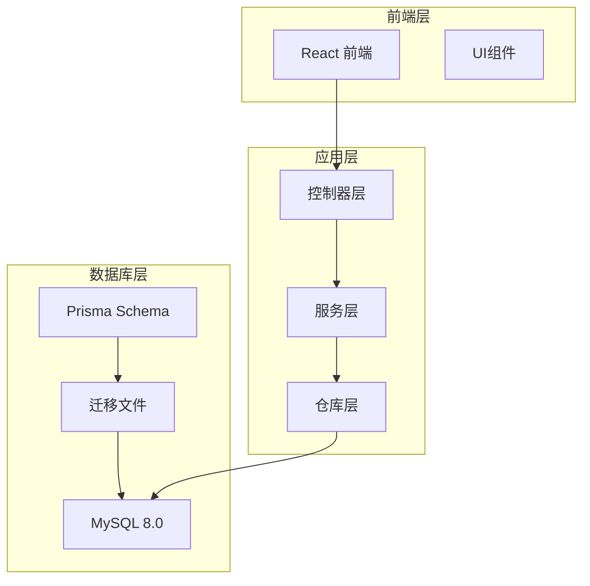

**图表来源**
- [schema.prisma:1-783](file://crm-backend/prisma/schema.prisma#L1-L783)
- [app.ts](file://crm-backend/src/app.ts)

**章节来源**
- [schema.prisma:1-783](file://crm-backend/prisma/schema.prisma#L1-L783)
- [20260315081326_init/migration.sql:1-381](file://crm-backend/prisma/migrations/20260315081326_init/migration.sql#L1-L381)

## 核心组件

### 数据库模型概述

系统包含以下主要数据模型：

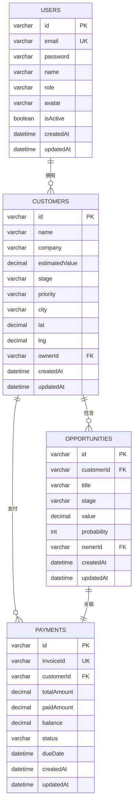

**图表来源**
- [schema.prisma:121-220](file://crm-backend/prisma/schema.prisma#L121-L220)
- [schema.prisma:224-253](file://crm-backend/prisma/schema.prisma#L224-L253)
- [schema.prisma:257-280](file://crm-backend/prisma/schema.prisma#L257-L280)

### 枚举类型系统

系统定义了丰富的枚举类型来确保数据的一致性和完整性：

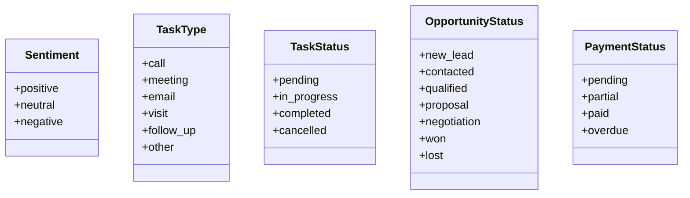

**图表来源**
- [schema.prisma:15-117](file://crm-backend/prisma/schema.prisma#L15-L117)

**章节来源**
- [schema.prisma:13-117](file://crm-backend/prisma/schema.prisma#L13-L117)

## 架构概览

### 数据流架构

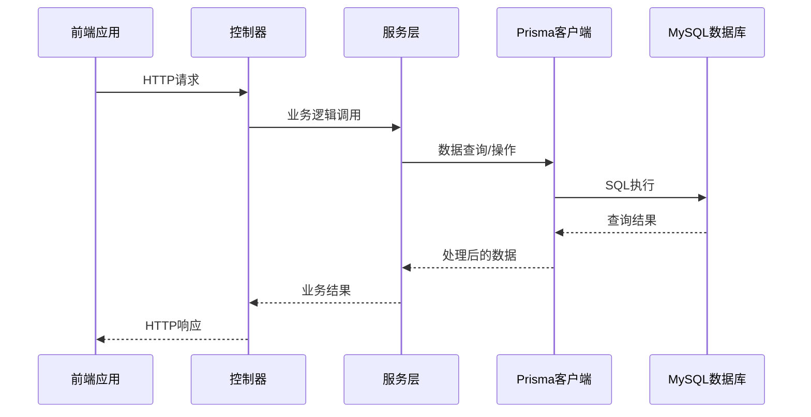

**图表来源**
- [customer.controller.ts:1-58](file://crm-backend/src/controllers/customer.controller.ts#L1-L58)
- [customer.service.ts:1-179](file://crm-backend/src/services/customer.service.ts#L1-L179)

### 数据库关系图

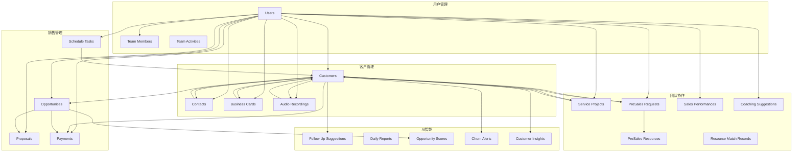

**图表来源**
- [schema.prisma:121-783](file://crm-backend/prisma/schema.prisma#L121-L783)

## 详细组件分析

### 客户管理系统

客户管理是整个CRM系统的核心模块，负责维护客户信息、联系人关系和业务往来。

#### 数据模型设计

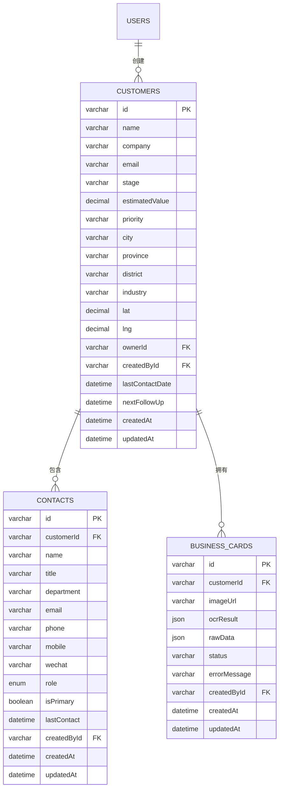

**图表来源**
- [schema.prisma:164-220](file://crm-backend/prisma/schema.prisma#L164-L220)
- [schema.prisma:525-551](file://crm-backend/prisma/schema.prisma#L525-L551)
- [schema.prisma:555-574](file://crm-backend/prisma/schema.prisma#L555-L574)

#### 业务流程分析

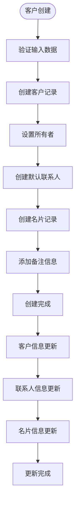

**图表来源**
- [customer.service.ts:76-86](file://crm-backend/src/services/customer.service.ts#L76-L86)
- [contact.service.ts:71-99](file://crm-backend/src/services/contact.service.ts#L71-L99)
- [contact.service.ts:180-204](file://crm-backend/src/services/contact.service.ts#L180-L204)

**章节来源**
- [customer.service.ts:1-179](file://crm-backend/src/services/customer.service.ts#L1-L179)
- [contact.service.ts:1-241](file://crm-backend/src/services/contact.service.ts#L1-L241)

### 销售漏斗管理

销售漏斗模块跟踪从潜在客户到成交的完整过程，提供实时的状态管理和预测分析。

#### 阶段化管理

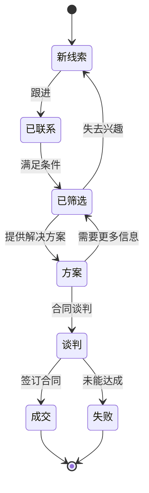

#### 机会评分机制

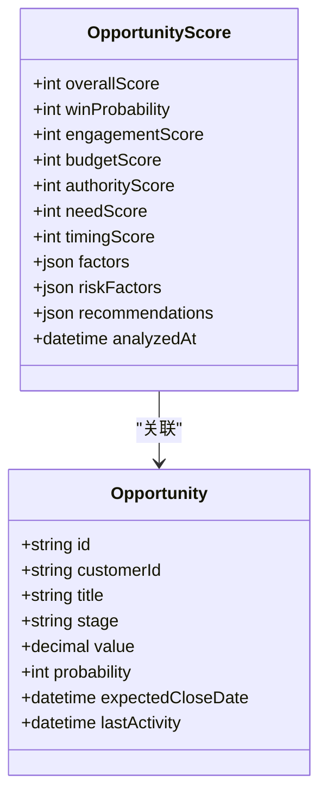

**图表来源**
- [schema.prisma:620-645](file://crm-backend/prisma/schema.prisma#L620-L645)
- [schema.prisma:224-253](file://crm-backend/prisma/schema.prisma#L224-L253)

**章节来源**
- [opportunity.service.ts:1-164](file://crm-backend/src/services/opportunity.service.ts#L1-L164)

### 财务管理

财务管理模块提供完整的应收账款跟踪、发票管理和现金流预测功能。

#### 支付状态流转

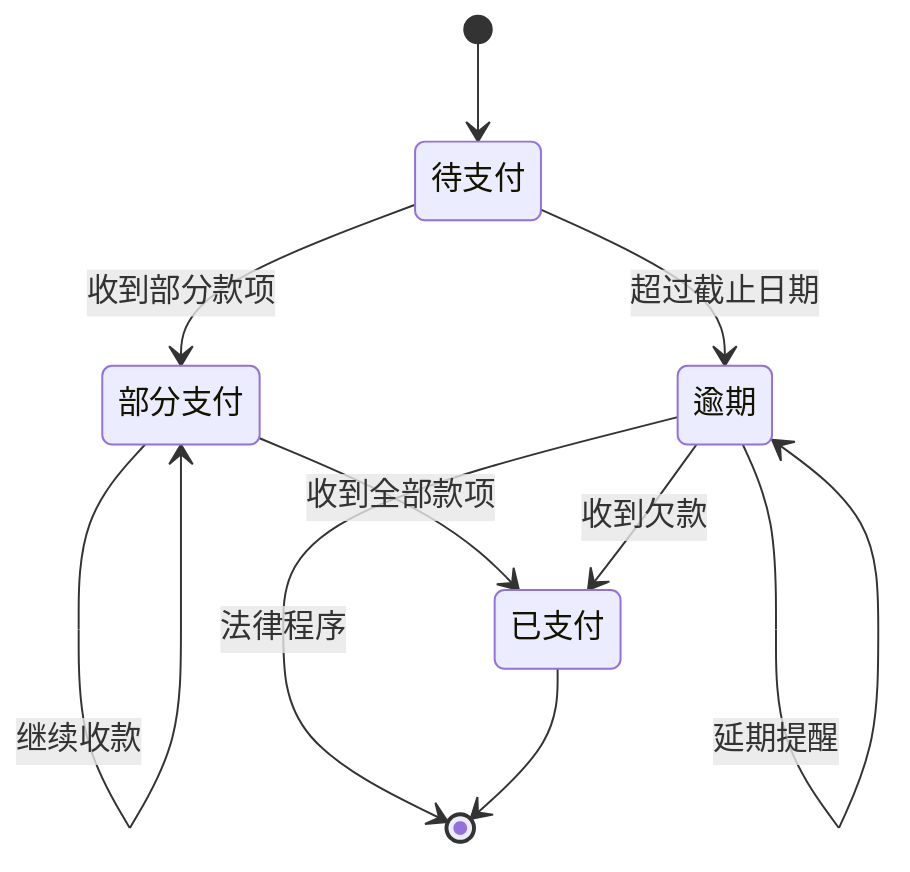

#### 财务预测分析

**图表来源**
- [payment.service.ts:147-175](file://crm-backend/src/services/payment.service.ts#L147-L175)

**章节来源**
- [payment.service.ts:1-178](file://crm-backend/src/services/payment.service.ts#L1-L178)

### AI智能分析

AI智能分析模块提供客户洞察、流失预警、跟进建议和销售教练等智能化功能。

#### 客户洞察提取

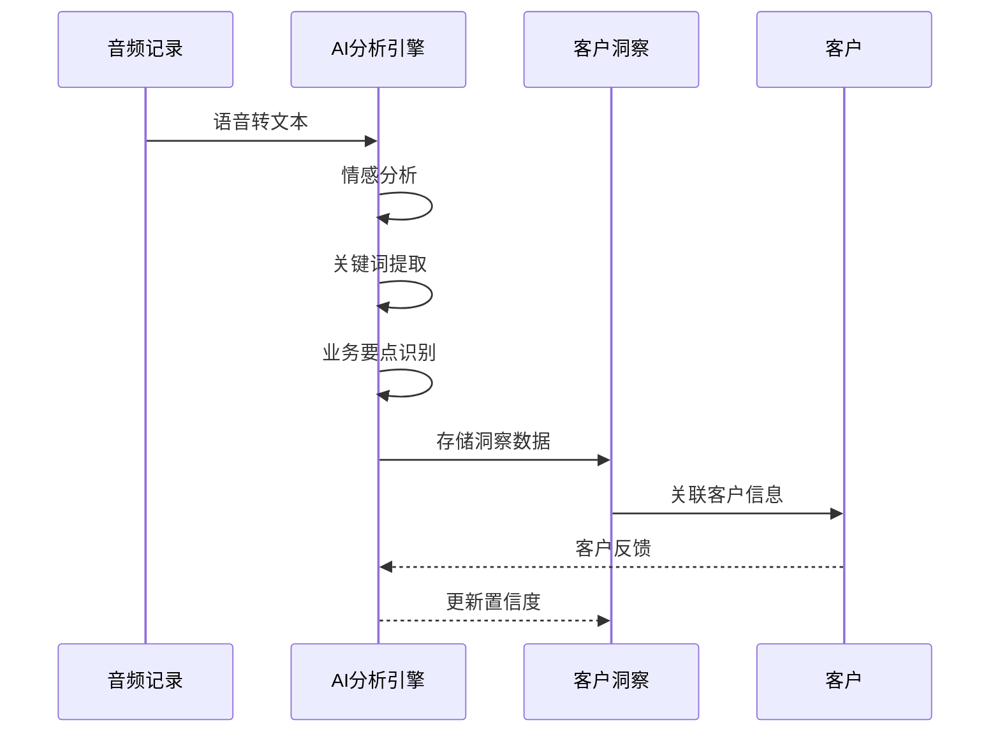

#### 流失预警机制

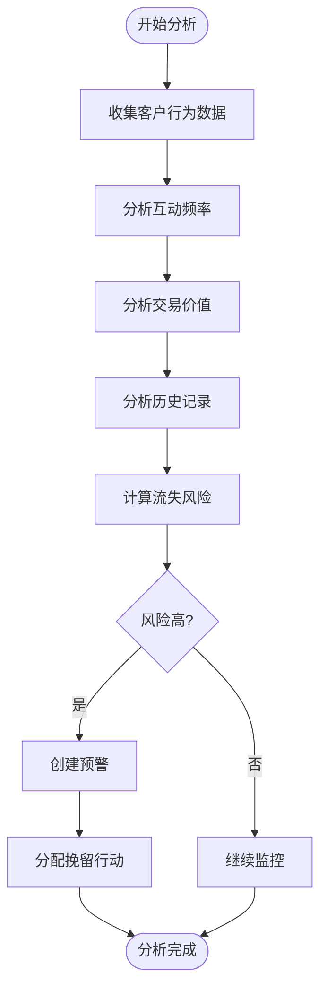

**图表来源**
- [schema.prisma:648-668](file://crm-backend/prisma/schema.prisma#L648-L668)
- [schema.prisma:671-689](file://crm-backend/prisma/schema.prisma#L671-L689)

**章节来源**
- [schema.prisma:576-783](file://crm-backend/prisma/schema.prisma#L576-L783)

### 团队协作与绩效

团队协作模块支持跨部门的项目管理和资源协调，同时提供个人和团队的绩效监控。

#### 资源匹配算法

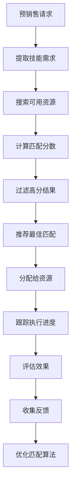

**图表来源**
- [schema.prisma:766-783](file://crm-backend/prisma/schema.prisma#L766-L783)

**章节来源**
- [schema.prisma:464-521](file://crm-backend/prisma/schema.prisma#L464-L521)

## 依赖关系分析

### 数据模型依赖

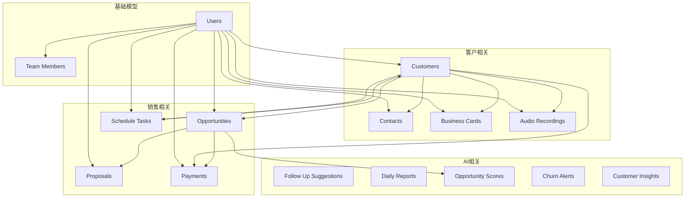

**图表来源**
- [schema.prisma:121-783](file://crm-backend/prisma/schema.prisma#L121-L783)

### 控制器-服务层依赖

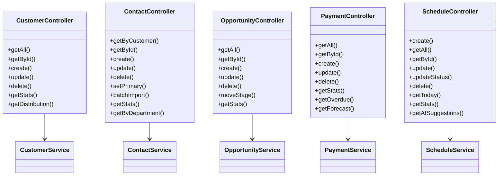

**图表来源**
- [customer.controller.ts:5-58](file://crm-backend/src/controllers/customer.controller.ts#L5-L58)
- [contact.controller.ts:5-81](file://crm-backend/src/controllers/contact.controller.ts#L5-L81)
- [opportunity.controller.ts:5-59](file://crm-backend/src/controllers/opportunity.controller.ts#L5-L59)
- [payment.controller.ts:5-60](file://crm-backend/src/controllers/payment.controller.ts#L5-L60)
- [schedule.controller.ts:9-153](file://crm-backend/src/controllers/schedule.controller.ts#L9-L153)

**章节来源**
- [customer.controller.ts:1-58](file://crm-backend/src/controllers/customer.controller.ts#L1-L58)
- [contact.controller.ts:1-81](file://crm-backend/src/controllers/contact.controller.ts#L1-L81)
- [opportunity.controller.ts:1-59](file://crm-backend/src/controllers/opportunity.controller.ts#L1-L59)
- [payment.controller.ts:1-60](file://crm-backend/src/controllers/payment.controller.ts#L1-L60)
- [schedule.controller.ts:1-153](file://crm-backend/src/controllers/schedule.controller.ts#L1-L153)

## 性能考虑

### 索引策略

系统在关键字段上建立了适当的索引以优化查询性能：

- **用户表**: email(唯一索引), role(普通索引)
- **客户表**: stage, priority, city, ownerId, createdById
- **机会表**: customerId, stage, ownerId, status
- **支付表**: customerId, status, dueDate(唯一索引)
- **音频记录表**: customerId, sentiment, status

### 查询优化

1. **分页查询**: 所有列表查询都支持分页参数，避免一次性加载大量数据
2. **条件过滤**: 支持多维度条件过滤，减少不必要的数据传输
3. **关联查询**: 使用include选项进行必要的关联数据加载
4. **聚合查询**: 使用groupBy和aggregate函数进行高效的数据统计

### 缓存策略

虽然当前实现中没有显式的缓存层，但可以考虑：
- 对于频繁访问的统计数据使用Redis缓存
- 对于静态配置数据进行内存缓存
- 对于复杂的聚合查询结果进行定期缓存更新

## 故障排除指南

### 常见问题诊断

#### 数据库连接问题
- 检查DATABASE_URL环境变量配置
- 验证MySQL服务状态和网络连通性
- 确认用户权限和密码正确性

#### 迁移失败
- 查看具体的SQL错误信息
- 确认MySQL版本兼容性
- 检查是否有重复的索引或约束

#### 查询超时
- 分析慢查询日志
- 检查WHERE条件是否使用了合适的索引
- 考虑添加复合索引优化复杂查询

### 错误处理机制

系统实现了统一的错误处理机制：

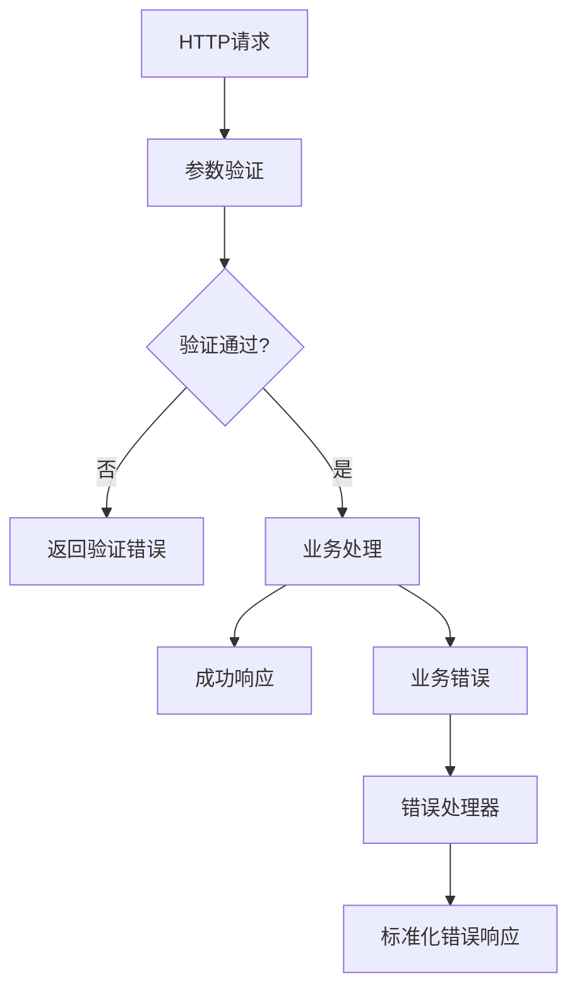

**章节来源**
- [errorHandler.ts](file://crm-backend/src/middlewares/errorHandler.ts)

## 结论

该销售AI CRM系统的数据库架构设计合理，具有以下优势：

1. **完整的业务覆盖**: 涵盖了从客户管理到销售分析的全生命周期
2. **灵活的扩展性**: 基于Prisma的Schema设计便于后续功能扩展
3. **强大的AI集成**: 内置的智能分析功能提升了系统的自动化水平
4. **良好的性能设计**: 合理的索引策略和查询优化保证了系统的响应速度
5. **清晰的架构分离**: 控制器-服务层-数据层的职责分离提高了代码的可维护性

建议的改进方向：
- 实施更完善的缓存策略以提升查询性能
- 添加数据备份和恢复机制
- 考虑引入审计日志功能
- 优化大数据量场景下的查询性能