# 数据库架构

<cite>
**本文档引用的文件**
- [schema.prisma](file://crm-backend/prisma/schema.prisma)
- [20260315081326_init/migration.sql](file://crm-backend/prisma/migrations/20260315081326_init/migration.sql)
- [20260315135448_add_contacts_and_business_cards/migration.sql](file://crm-backend/prisma/migrations/20260315135448_add_contacts_and_business_cards/migration.sql)
- [20260315155023_add_cold_visit_records/migration.sql](file://crm-backend/prisma/migrations/20260315155023_add_cold_visit_records/migration.sql)
- [20260317020137_add_ai_features/migration.sql](file://crm-backend/prisma/migrations/20260317020137_add_ai_features/migration.sql)
- [20260317051358_add_sales_performance_and_coaching/migration.sql](file://crm-backend/prisma/migrations/20260317051358_add_sales_performance_and_coaching/migration.sql)
- [20260317083220_add_presales_activity_management/migration.sql](file://crm-backend/prisma/migrations/20260317083220_add_presales_activity_management/migration.sql)
- [20260318060044_add_proposal_workflow_stages/migration.sql](file://crm-backend/prisma/migrations/20260318060044_add_proposal_workflow_stages/migration.sql)
- [20260318104850_add_customer_type_and_company_info/migration.sql](file://crm-backend/prisma/migrations/20260318104850_add_customer_type_and_company_info/migration.sql)
- [proposal.controller.ts](file://crm-backend/src/controllers/proposal.controller.ts)
- [proposal.service.ts](file://crm-backend/src/services/proposal.service.ts)
- [proposals.routes.ts](file://crm-backend/src/routes/proposals.routes.ts)
- [proposal.validator.ts](file://crm-backend/src/validators/proposal.validator.ts)
- [presalesActivity.controller.ts](file://crm-backend/src/controllers/presalesActivity.controller.ts)
- [presalesActivity.service.ts](file://crm-backend/src/services/presalesActivity.service.ts)
- [presalesActivity.routes.ts](file://crm-backend/src/routes/presalesActivity.routes.ts)
- [presalesActivity.validator.ts](file://crm-backend/src/validators/presalesActivity.validator.ts)
- [customer.controller.ts](file://crm-backend/src/controllers/customer.controller.ts)
- [contact.controller.ts](file://crm-backend/src/controllers/contact.controller.ts)
- [opportunity.controller.ts](file://crm-backend/src/controllers/opportunity.controller.ts)
- [payment.controller.ts](file://crm-backend/src/controllers/payment.controller.ts)
- [schedule.controller.ts](file://crm-backend/src/controllers/schedule.controller.ts)
- [customer.service.ts](file://crm-backend/src/services/customer.service.ts)
- [contact.service.ts](file://crm-backend/src/services/contact.service.ts)
- [opportunity.service.ts](file://crm-backend/src/services/opportunity.service.ts)
- [payment.service.ts](file://crm-backend/src/services/payment.service.ts)
- [schedule.service.ts](file://crm-backend/src/services/schedule.service.ts)
- [companySearch.controller.ts](file://crm-backend/src/controllers/companySearch.controller.ts)
- [companySearch.service.ts](file://crm-backend/src/services/companySearch.service.ts)
- [companySearch.routes.ts](file://crm-backend/src/routes/companySearch.routes.ts)
- [customer.validator.ts](file://crm-backend/src/validators/customer.validator.ts)
- [index.ts](file://crm-frontend/src/types/index.ts)
</cite>

## 更新摘要
**变更内容**
- 新增完整的企业客户管理功能，包括customerType、companyFullName、creditCode等九个新字段
- 新增完整的公司搜索API系统，支持企业信息查询和匹配
- 更新数据库关系图以反映新的企业客户分类和搜索功能
- 增强客户数据模型以支持B2B企业客户管理

## 目录
1. [简介](#简介)
2. [项目结构](#项目结构)
3. [核心组件](#核心组件)
4. [架构概览](#架构概览)
5. [详细组件分析](#详细组件分析)
6. [依赖关系分析](#依赖关系分析)
7. [性能考虑](#性能考虑)
8. [故障排除指南](#故障排除指南)
9. [结论](#结论)

## 简介

这是一个基于Prisma ORM的销售AI CRM系统数据库架构文档。该系统采用MySQL 8.0作为数据库引擎，通过Prisma Schema定义了完整的数据模型，涵盖了客户管理、销售漏斗、财务管理、团队协作、AI智能分析以及**预销售活动管理**、**提案工作流程管理**和**企业客户管理**等多个业务模块。

系统的核心特点包括：
- 全面的客户关系管理功能，支持个人和企业客户
- AI驱动的智能分析和建议
- 完整的销售生命周期跟踪
- 实时的团队协作和绩效监控
- 智能的资源匹配和预销售支持
- **完整的预销售活动管理功能**，包括活动创建、二维码签到、问题收集和统计分析
- **完整的提案工作流程管理**，涵盖从需求分析到商务谈判的全流程跟踪
- **完善的企业客户管理功能**，支持统一社会信用代码、企业全称、注册资本等企业信息管理
- **完整的公司搜索API系统**，提供企业信息查询和匹配功能

## 项目结构

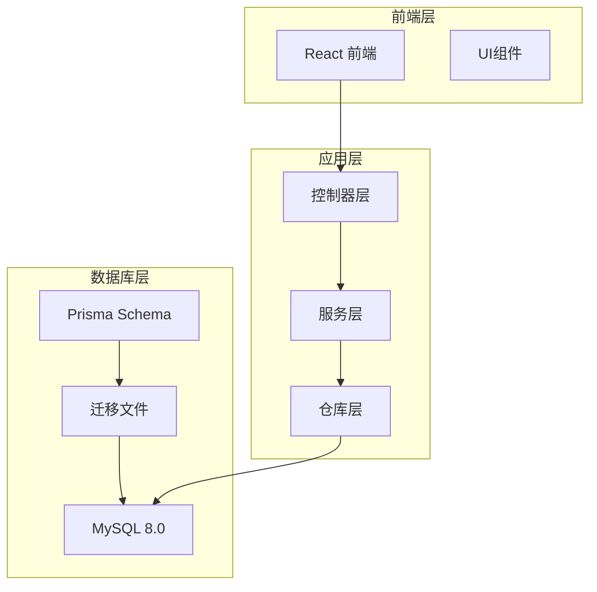

**图表来源**
- [schema.prisma:1-1088](file://crm-backend/prisma/schema.prisma#L1-L1088)
- [app.ts](file://crm-backend/src/app.ts)

**章节来源**
- [schema.prisma:1-1088](file://crm-backend/prisma/schema.prisma#L1-L1088)
- [20260315081326_init/migration.sql:1-381](file://crm-backend/prisma/migrations/20260315081326_init/migration.sql#L1-L381)

## 核心组件

### 数据库模型概述

系统包含以下主要数据模型：

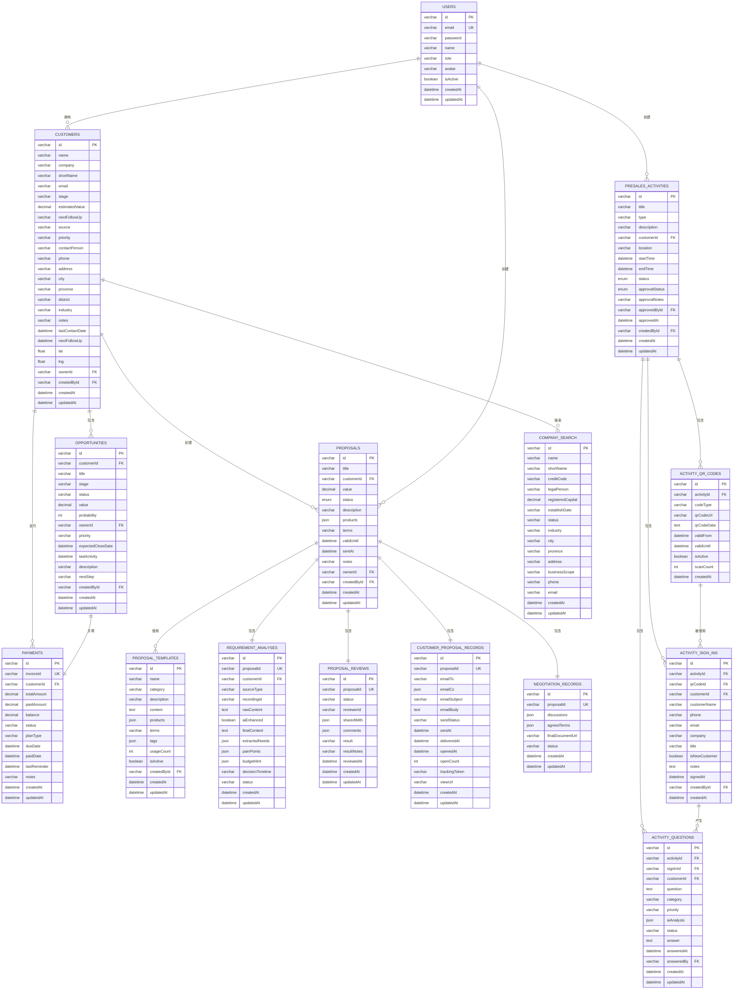

**图表来源**
- [schema.prisma:377-409](file://crm-backend/prisma/schema.prisma#L377-L409)
- [schema.prisma:936-985](file://crm-backend/prisma/schema.prisma#L936-L985)
- [schema.prisma:988-1017](file://crm-backend/prisma/schema.prisma#L988-L1017)
- [schema.prisma:1020-1049](file://crm-backend/prisma/schema.prisma#L1020-L1049)
- [schema.prisma:1052-1076](file://crm-backend/prisma/schema.prisma#L1052-L1076)
- [schema.prisma:822-853](file://crm-backend/prisma/schema.prisma#L822-L853)
- [schema.prisma:856-931](file://crm-backend/prisma/schema.prisma#L856-L931)
- [schema.prisma:1088](file://crm-backend/prisma/schema.prisma#L1088)

### 枚举类型系统

系统定义了丰富的枚举类型来确保数据的一致性和完整性：

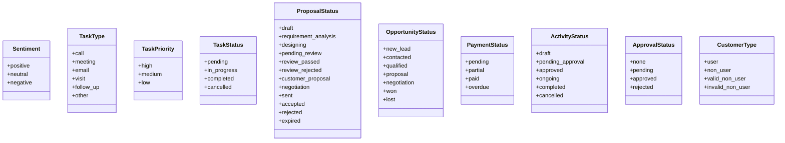

**图表来源**
- [schema.prisma:43-56](file://crm-backend/prisma/schema.prisma#L43-L56)
- [schema.prisma:15-140](file://crm-backend/prisma/schema.prisma#L15-L140)
- [customer.validator.ts:3-4](file://crm-backend/src/validators/customer.validator.ts#L3-L4)

**章节来源**
- [schema.prisma:13-140](file://crm-backend/prisma/schema.prisma#L13-L140)

## 架构概览

### 数据流架构

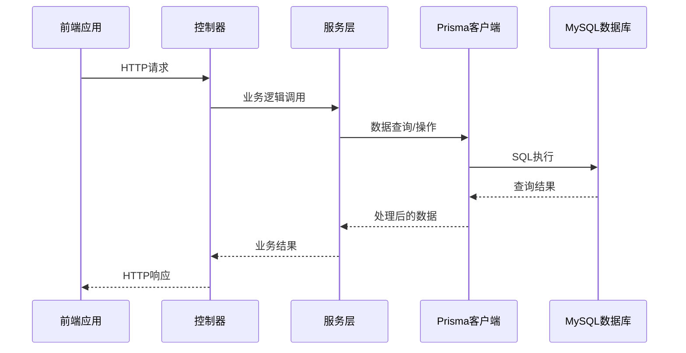

**图表来源**
- [customer.controller.ts:1-58](file://crm-backend/src/controllers/customer.controller.ts#L1-L58)
- [customer.service.ts:1-179](file://crm-backend/src/services/customer.service.ts#L1-L179)

### 数据库关系图

```mermaid
graph TB
subgraph "用户管理"
USERS[Users]
TEAM_MEMBERS[Team Members]
TEAM_ACTIVITIES[Team Activities]
end
subgraph "客户管理"
CUSTOMERS[Customers]
CONTACTS[Contacts]
BUSINESS_CARDS[Business Cards]
AUDIO_RECORDINGS[Audio Recordings]
COMPANY_SEARCH[Company Search]
end
subgraph "销售管理"
OPPORTUNITIES[Opportunities]
PROPOSALS[Proposals]
PAYMENTS[Payments]
SCHEDULE_TASKS[Schedule Tasks]
end
subgraph "AI智能"
FOLLOW_UP_SUGGESTIONS[Follow Up Suggestions]
DAILY_REPORTS[Daily Reports]
OPPORTUNITY_SCORES[Opportunity Scores]
CHURN_ALERTS[Churn Alerts]
CUSTOMER_INSIGHTS[Customer Insights]
end
subgraph "团队协作"
SERVICE_PROJECTS[Service Projects]
PRESALES_RESOURCES[PreSales Resources]
PRESALES_REQUESTS[PreSales Requests]
SALES_PERFORMANCES[Sales Performances]
COACHING_SUGGESTIONS[Coaching Suggestions]
RESOURCE_MATCH_RECORDS[Resource Match Records]
end
subgraph "预销售活动管理"
PRESALES_ACTIVITIES[Presales Activities]
ACTIVITY_QR_CODES[Activity QR Codes]
ACTIVITY_SIGN_INS[Activity Sign Ins]
ACTIVITY_QUESTIONS[Activity Questions]
end
subgraph "提案工作流程管理"
PROPOSALS[Proposals]
PROPOSAL_TEMPLATES[Proposal Templates]
REQUIREMENT_ANALYSES[Requirement Analyses]
PROPOSAL_REVIEWS[Proposal Reviews]
CUSTOMER_PROPOSAL_RECORDS[Customer Proposal Records]
NEGOTIATION_RECORDS[Negotiation Records]
end
USERS --> CUSTOMERS
USERS --> TEAM_MEMBERS
USERS --> SCHEDULE_TASKS
USERS --> AUDIO_RECORDINGS
USERS --> BUSINESS_CARDS
USERS --> CONTACTS
USERS --> OPPORTUNITIES
USERS --> PROPOSALS
USERS --> PAYMENTS
USERS --> SERVICE_PROJECTS
USERS --> PRESALES_REQUESTS
USERS --> SALES_PERFORMANCES
USERS --> COACHING_SUGGESTIONS
USERS --> PRESALES_ACTIVITIES
CUSTOMERS --> CONTACTS
CUSTOMERS --> BUSINESS_CARDS
CUSTOMERS --> AUDIO_RECORDINGS
CUSTOMERS --> OPPORTUNITIES
CUSTOMERS --> PAYMENTS
CUSTOMERS --> SERVICE_PROJECTS
CUSTOMERS --> PRESALES_REQUESTS
CUSTOMERS --> FOLLOW_UP_SUGGESTIONS
CUSTOMERS --> CHURN_ALERTS
CUSTOMERS --> CUSTOMER_INSIGHTS
CUSTOMERS --> PRESALES_ACTIVITIES
CUSTOMERS --> PROPOSALS
CUSTOMERS --> COMPANY_SEARCH
OPPORTUNITIES --> PROPOSALS
OPPORTUNITIES --> OPPORTUNITY_SCORES
OPPORTUNITIES --> PAYMENTS
SCHEDULE_TASKS --> CUSTOMERS
AUDIO_RECORDINGS --> CUSTOMERS
BUSINESS_CARDS --> CUSTOMERS
CONTACTS --> CUSTOMERS
SERVICE_PROJECTS --> CUSTOMERS
PRESALES_REQUESTS --> CUSTOMERS
PRESALES_REQUESTS --> PRESALES_RESOURCES
PRESALES_ACTIVITIES --> ACTIVITY_QR_CODES
PRESALES_ACTIVITIES --> ACTIVITY_SIGN_INS
PRESALES_ACTIVITIES --> ACTIVITY_QUESTIONS
ACTIVITY_QR_CODES --> ACTIVITY_SIGN_INS
ACTIVITY_SIGN_INS --> ACTIVITY_QUESTIONS
PROPOSALS --> PROPOSAL_TEMPLATES
PROPOSALS --> REQUIREMENT_ANALYSES
PROPOSALS --> PROPOSAL_REVIEWS
PROPOSALS --> CUSTOMER_PROPOSAL_RECORDS
PROPOSALS --> NEGOTIATION_RECORDS
REQUIREMENT_ANALYSES --> PROPOSALS
PROPOSAL_REVIEWS --> PROPOSALS
CUSTOMER_PROPOSAL_RECORDS --> PROPOSALS
NEGOTIATION_RECORDS --> PROPOSALS
```

**图表来源**
- [schema.prisma:377-1088](file://crm-backend/prisma/schema.prisma#L377-L1088)

## 详细组件分析

### 企业客户管理

**新增** 企业客户管理模块显著增强了系统的B2B客户支持能力，通过在Customer模型中添加九个企业相关信息字段，实现了完整的B2B客户信息管理。

#### 企业信息字段设计

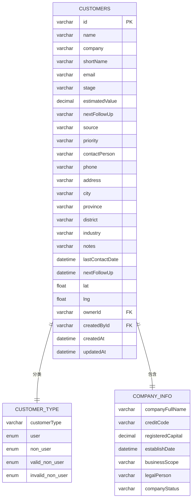

**图表来源**
- [schema.prisma:221-231](file://crm-backend/prisma/schema.prisma#L221-L231)
- [customer.validator.ts:23-32](file://crm-backend/src/validators/customer.validator.ts#L23-L32)

#### 企业客户分类系统

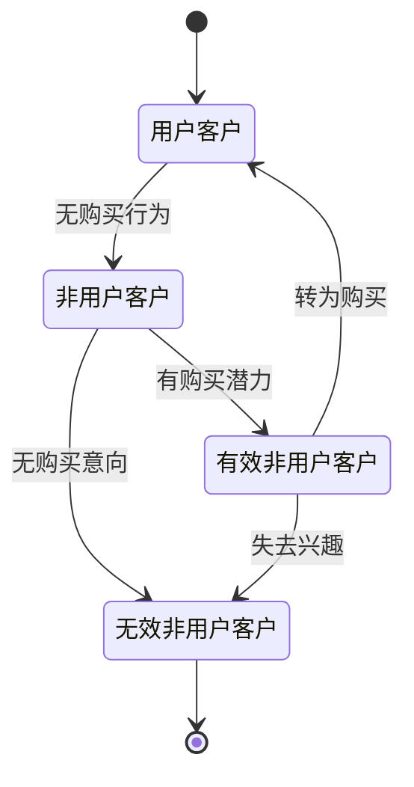

#### 企业信息验证规则

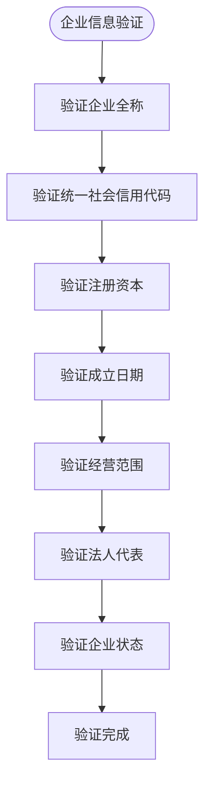

**章节来源**
- [schema.prisma:221-231](file://crm-backend/prisma/schema.prisma#L221-L231)
- [customer.validator.ts:23-32](file://crm-backend/src/validators/customer.validator.ts#L23-L32)
- [index.ts:41-48](file://crm-frontend/src/types/index.ts#L41-L48)

### 公司搜索API系统

**新增** 公司搜索API系统提供了完整的B2B企业信息查询功能，支持基于关键词的企业搜索和基于统一社会信用代码的企业详情查询。

#### 搜索功能架构

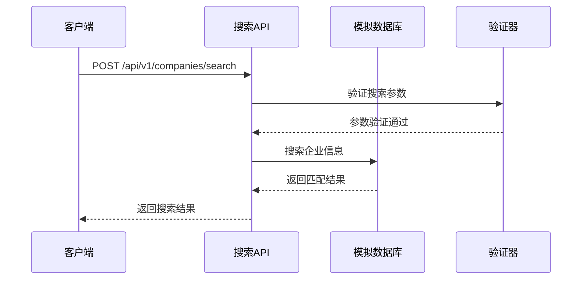

#### 企业详情查询流程

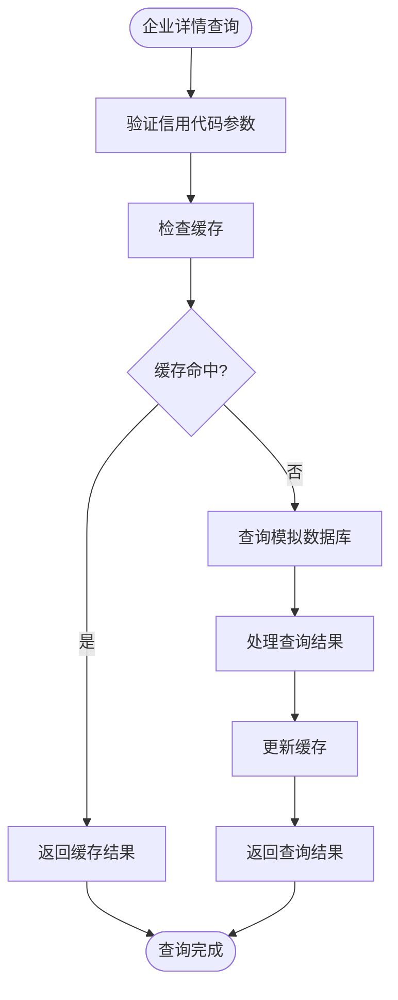

#### 搜索算法实现

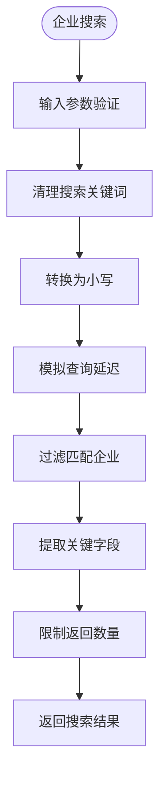

**图表来源**
- [companySearch.controller.ts:10-21](file://crm-backend/src/controllers/companySearch.controller.ts#L10-L21)
- [companySearch.service.ts:274-292](file://crm-backend/src/services/companySearch.service.ts#L274-L292)
- [companySearch.routes.ts:7-32](file://crm-backend/src/routes/companySearch.routes.ts#L7-L32)

**章节来源**
- [companySearch.controller.ts:1-46](file://crm-backend/src/controllers/companySearch.controller.ts#L1-L46)
- [companySearch.service.ts:1-327](file://crm-backend/src/services/companySearch.service.ts#L1-L327)
- [companySearch.routes.ts:1-57](file://crm-backend/src/routes/companySearch.routes.ts#L1-L57)

### 客户管理系统

客户管理是整个CRM系统的核心模块，负责维护客户信息、联系人关系和业务往来。

#### 数据模型设计

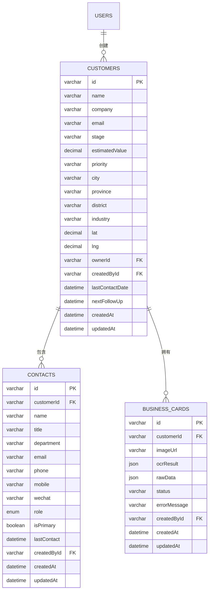

**图表来源**
- [schema.prisma:189-248](file://crm-backend/prisma/schema.prisma#L189-L248)
- [schema.prisma:589-608](file://crm-backend/prisma/schema.prisma#L589-L608)
- [schema.prisma:590-608](file://crm-backend/prisma/schema.prisma#L590-L608)

#### 业务流程分析


**图表来源**
- [customer.service.ts:76-86](file://crm-backend/src/services/customer.service.ts#L76-L86)
- [contact.service.ts:71-99](file://crm-backend/src/services/contact.service.ts#L71-L99)
- [contact.service.ts:180-204](file://crm-backend/src/services/contact.service.ts#L180-L204)

**章节来源**
- [customer.service.ts:1-179](file://crm-backend/src/services/customer.service.ts#L1-L179)
- [contact.service.ts:1-241](file://crm-backend/src/services/contact.service.ts#L1-L241)

### 销售漏斗管理

销售漏斗模块跟踪从潜在客户到成交的完整过程，提供实时的状态管理和预测分析。

#### 阶段化管理

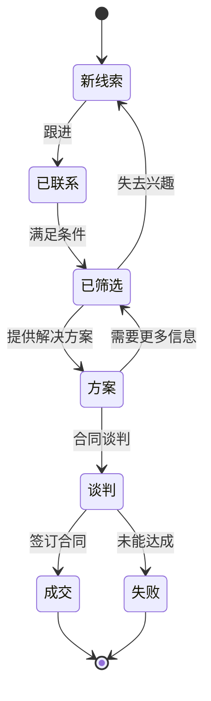

#### 机会评分机制

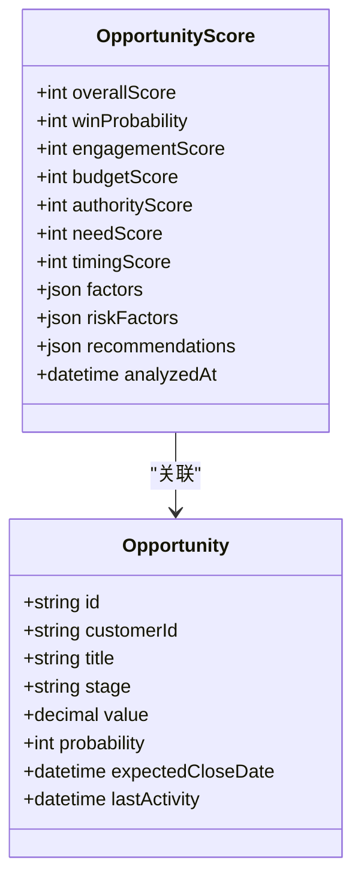

**图表来源**
- [schema.prisma:654-679](file://crm-backend/prisma/schema.prisma#L654-L679)
- [schema.prisma:252-281](file://crm-backend/prisma/schema.prisma#L252-L281)

**章节来源**
- [opportunity.service.ts:1-164](file://crm-backend/src/services/opportunity.service.ts#L1-L164)

### 财务管理

财务管理模块提供完整的应收账款跟踪、发票管理和现金流预测功能。

#### 支付状态流转

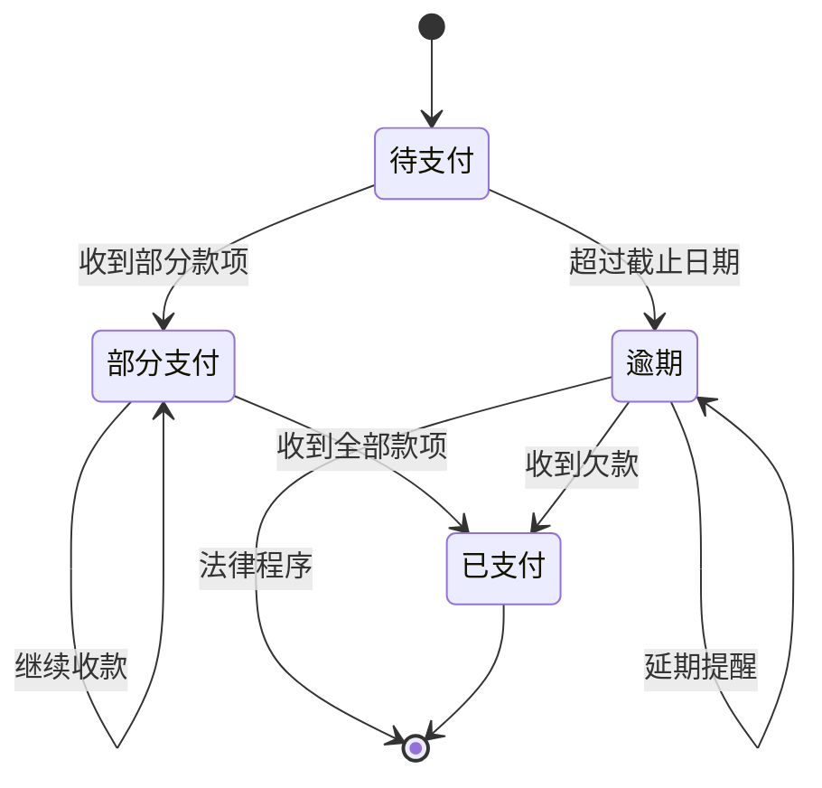

#### 财务预测分析

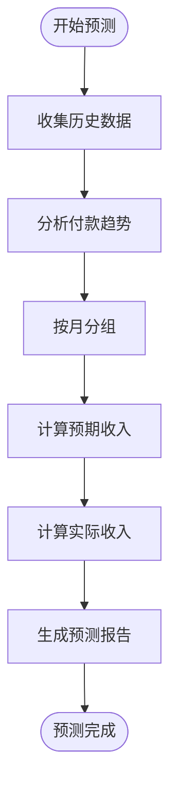

**图表来源**
- [payment.service.ts:147-175](file://crm-backend/src/services/payment.service.ts#L147-L175)

**章节来源**
- [payment.service.ts:1-178](file://crm-backend/src/services/payment.service.ts#L1-L178)

### 预销售活动管理

**新增** 预销售活动管理模块提供完整的售前活动生命周期管理，包括活动创建、二维码签到、问题收集和统计分析。

#### 活动生命周期管理

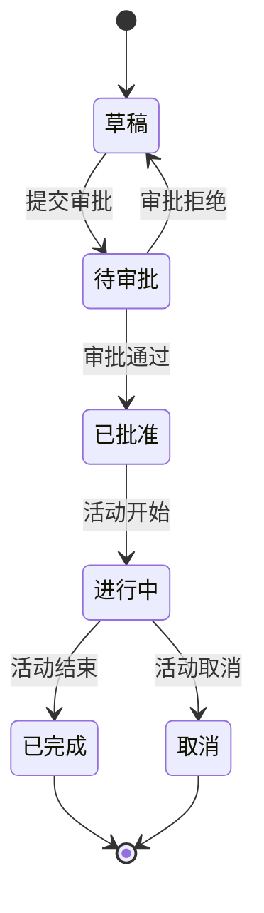

#### 二维码签到流程

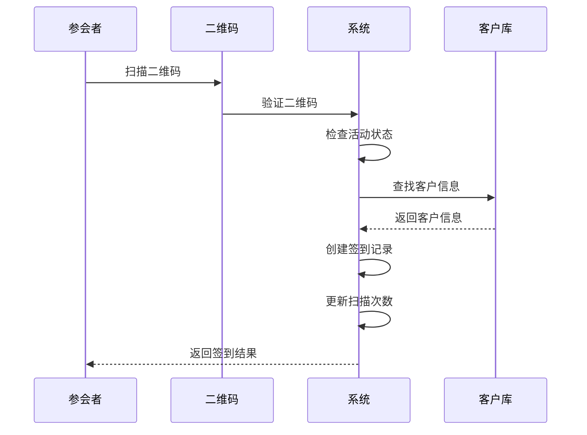

#### 问题收集与分析

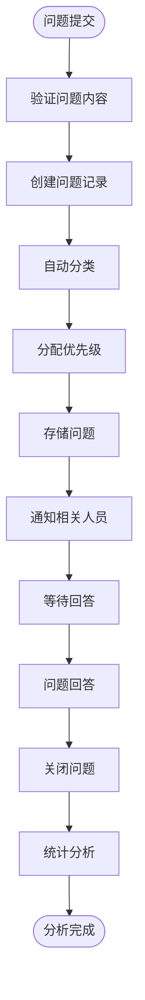

**图表来源**
- [presalesActivity.service.ts:409-489](file://crm-backend/src/services/presalesActivity.service.ts#L409-L489)
- [presalesActivity.service.ts:566-673](file://crm-backend/src/services/presalesActivity.service.ts#L566-L673)

**章节来源**
- [presalesActivity.controller.ts:1-338](file://crm-backend/src/controllers/presalesActivity.controller.ts#L1-L338)
- [presalesActivity.service.ts:1-766](file://crm-backend/src/services/presalesActivity.service.ts#L1-L766)

### 提案工作流程管理

**新增** 提案工作流程管理模块提供完整的商务提案生命周期管理，涵盖从需求分析到商务谈判的全流程跟踪。

#### 提案工作流程生命周期

```mermaid
stateDiagram-v2
[*] --> 草稿
草稿 --> 需求分析中 : 创建需求分析
需求分析中 --> 方案设计中 : 确认需求分析
方案设计中 --> 待内部评审 : 确认方案设计
待内部评审 --> 评审通过 : 评审通过
待内部评审 --> 评审驳回 : 评审驳回
评审通过 --> 客户提案中 : 创建客户提案
客户提案中 --> 已发送 : 发送提案
已发送 --> 商务谈判中 : 创建谈判记录
商务谈判中 --> 已接受 : 谈判完成
商务谈判中 --> 已拒绝 : 谈判失败
已接受 --> [*]
已拒绝 --> [*]
评审驳回 --> [*]
```

#### 需求分析流程

```mermaid
flowchart TD
Start([开始需求分析]) --> CollectData[收集客户数据]
CollectData --> ManualInput[手动输入需求]
ManualInput --> AIAnalysis[AI分析录音]
AIAnalysis --> ExtractNeeds[提取需求要点]
ExtractNeeds --> PainPointAnalysis[痛点分析]
PainPointAnalysis --> BudgetEstimate[预算估算]
BudgetEstimate --> TimelineAnalysis[决策时间线分析]
TimelineAnalysis --> Confirm[确认需求]
Confirm --> Design[进入方案设计]
Design --> End([需求分析完成])
```

#### 客户提案发送流程

```mermaid
sequenceDiagram
participant Sales as 销售人员
participant System as 系统
participant Email as 邮件服务器
participant Customer as 客户
Sales->>System : 创建客户提案
System->>System : 生成跟踪令牌
System->>Email : 发送邮件
Email->>Customer : 邮件送达
Customer->>System : 打开邮件
System->>System : 更新打开状态
System->>Sales : 发送统计更新
```

#### 商务谈判跟踪

```mermaid
flowchart TD
Start([开始谈判]) --> FirstMeeting[首次会议]
FirstMeeting --> Discussion1[讨论条款]
Discussion1 --> CounterOffer[还价]
CounterOffer --> FinalTerms[确定最终条款]
FinalTerms --> DocumentPreparation[准备最终文档]
DocumentPreparation --> Signature[签署协议]
Signature --> End([谈判完成])
```

**图表来源**
- [proposal.service.ts:588-715](file://crm-backend/src/services/proposal.service.ts#L588-L715)
- [proposal.service.ts:931-1048](file://crm-backend/src/services/proposal.service.ts#L931-L1048)
- [proposal.service.ts:1050-1126](file://crm-backend/src/services/proposal.service.ts#L1050-L1126)

**章节来源**
- [proposal.controller.ts:1-636](file://crm-backend/src/controllers/proposal.controller.ts#L1-L636)
- [proposal.service.ts:1-1178](file://crm-backend/src/services/proposal.service.ts#L1-L1178)

### AI智能分析

AI智能分析模块提供客户洞察、流失预警、跟进建议和销售教练等智能化功能。

#### 客户洞察提取

```mermaid
sequenceDiagram
participant Audio as 音频记录
participant AI as AI分析引擎
participant Insight as 客户洞察
participant Customer as 客户
Audio->>AI : 语音转文本
AI->>AI : 情感分析
AI->>AI : 关键词提取
AI->>AI : 业务要点识别
AI->>Insight : 存储洞察数据
Insight->>Customer : 关联客户信息
Customer-->>AI : 客户反馈
AI-->>Insight : 更新置信度
```

#### 流失预警机制

```mermaid
flowchart TD
Start([开始分析]) --> CollectData[收集客户行为数据]
CollectData --> AnalyzeEngagement[分析互动频率]
AnalyzeEngagement --> AnalyzeValue[分析交易价值]
AnalyzeValue --> AnalyzeHistory[分析历史记录]
AnalyzeHistory --> CalculateRisk[计算流失风险]
CalculateRisk --> RiskHigh{风险高?}
RiskHigh --> |是| CreateAlert[创建预警]
RiskHigh --> |否| Monitor[继续监控]
CreateAlert --> AssignAction[分配挽留行动]
AssignAction --> End([分析完成])
Monitor --> End
```

**图表来源**
- [schema.prisma:705-723](file://crm-backend/prisma/schema.prisma#L705-L723)
- [schema.prisma:682-702](file://crm-backend/prisma/schema.prisma#L682-L702)

**章节来源**
- [schema.prisma:612-723](file://crm-backend/prisma/schema.prisma#L612-L723)

### 团队协作与绩效

团队协作模块支持跨部门的项目管理和资源协调，同时提供个人和团队的绩效监控。

#### 资源匹配算法

```mermaid
flowchart TD
Request[预销售请求] --> ExtractSkills[提取技能需求]
ExtractSkills --> SearchResources[搜索可用资源]
SearchResources --> CalculateScore[计算匹配分数]
CalculateScore --> FilterResults[过滤高分结果]
FilterResults --> Recommend[推荐最佳匹配]
Recommend --> Assign[分配给资源]
Assign --> Track[跟踪执行进度]
Track --> Evaluate[评估效果]
Evaluate --> Feedback[收集反馈]
Feedback --> Improve[优化匹配算法]
```

**图表来源**
- [schema.prisma:800-817](file://crm-backend/prisma/schema.prisma#L800-L817)

**章节来源**
- [schema.prisma:498-555](file://crm-backend/prisma/schema.prisma#L498-L555)

## 依赖关系分析

### 数据模型依赖

```mermaid
graph TB
subgraph "基础模型"
Users[Users]
Teams[Team Members]
end
subgraph "客户相关"
Customers[Customers]
Contacts[Contacts]
BusinessCards[Business Cards]
AudioRecordings[Audio Recordings]
CompanySearch[Company Search]
end
subgraph "销售相关"
Opportunities[Opportunities]
Proposals[Proposals]
Payments[Payments]
ScheduleTasks[Schedule Tasks]
end
subgraph "AI相关"
FollowUpSuggestions[Follow Up Suggestions]
DailyReports[Daily Reports]
OpportunityScores[Opportunity Scores]
ChurnAlerts[Churn Alerts]
CustomerInsights[Customer Insights]
end
subgraph "预销售活动"
PresalesActivities[Presales Activities]
ActivityQrCodes[Activity QR Codes]
ActivitySignIns[Activity Sign Ins]
ActivityQuestions[Activity Questions]
end
subgraph "提案工作流程"
Proposals[Proposals]
ProposalTemplates[Proposal Templates]
RequirementAnalyses[Requirement Analyses]
ProposalReviews[Proposal Reviews]
CustomerProposalRecords[Customer Proposal Records]
NegotiationRecords[Negotiation Records]
end
Users --> Customers
Users --> Teams
Users --> ScheduleTasks
Users --> AudioRecordings
Users --> BusinessCards
Users --> Contacts
Users --> Opportunities
Users --> Proposals
Users --> Payments
Customers --> Contacts
Customers --> BusinessCards
Customers --> AudioRecordings
Customers --> Opportunities
Customers --> Payments
Customers --> ScheduleTasks
Customers --> PresalesActivities
Customers --> Proposals
Customers --> CompanySearch
Opportunities --> Proposals
Opportunities --> Payments
Opportunities --> OpportunityScores
ScheduleTasks --> Customers
PresalesActivities --> ActivityQrCodes
PresalesActivities --> ActivitySignIns
PresalesActivities --> ActivityQuestions
ActivityQrCodes --> ActivitySignIns
ActivitySignIns --> ActivityQuestions
Proposals --> ProposalTemplates
Proposals --> RequirementAnalyses
Proposals --> ProposalReviews
Proposals --> CustomerProposalRecords
Proposals --> NegotiationRecords
RequirementAnalyses --> Proposals
ProposalReviews --> Proposals
CustomerProposalRecords --> Proposals
NegotiationRecords --> Proposals
```

**图表来源**
- [schema.prisma:377-1088](file://crm-backend/prisma/schema.prisma#L377-L1088)

### 控制器-服务层依赖

```mermaid
classDiagram
class CustomerController {
+getAll()
+getById()
+create()
+update()
+delete()
+getStats()
+getDistribution()
}
class ContactController {
+getByCustomer()
+getById()
+create()
+update()
+delete()
+setPrimary()
+batchImport()
+getStats()
+getByDepartment()
}
class OpportunityController {
+getAll()
+getById()
+create()
+update()
+delete()
+moveStage()
+getStats()
}
class PaymentController {
+getAll()
+getById()
+create()
+update()
+delete()
+getStats()
+getOverdue()
+getForecast()
}
class ScheduleController {
+create()
+getAll()
+getById()
+update()
+updateStatus()
+delete()
+getToday()
+getStats()
+getAISuggestions()
}
class PresalesActivityController {
+createActivity()
+getActivities()
+getActivityById()
+updateActivity()
+deleteActivity()
+updateActivityStatus()
+submitForApproval()
+approveActivity()
+rejectActivity()
+createQrCode()
+getQrCodes()
+getQrCodeById()
+signIn()
+getSignIns()
+getSignInById()
+createQuestion()
+getQuestions()
+updateQuestion()
+answerQuestion()
+getActivityStats()
}
class ProposalController {
+create()
+getAll()
+getById()
+update()
+updateStatus()
+delete()
+generateWithAI()
+send()
+generateSmartProposal()
+getPricingStrategy()
+getRecommendedProducts()
+getStats()
+getTemplates()
+createTemplate()
+cloneTemplate()
+createRequirementAnalysis()
+getRequirementAnalysis()
+aiAnalyzeRequirement()
+aiEnhanceRequirement()
+updateRequirementAnalysis()
+confirmRequirementAnalysis()
+startDesign()
+matchTemplate()
+applyTemplate()
+updateDesign()
+confirmDesign()
+createReview()
+getReview()
+addReviewComment()
+approveReview()
+rejectReview()
+createCustomerProposalRecord()
+getCustomerProposalRecord()
+generateEmailTemplate()
+updateCustomerProposalEmail()
+sendCustomerProposal()
+trackEmailOpen()
+createNegotiation()
+getNegotiation()
+addDiscussion()
+updateAgreedTerms()
+completeNegotiation()
}
class CompanySearchController {
+search()
+getDetail()
}
CustomerController --> CustomerService
ContactController --> ContactService
OpportunityController --> OpportunityService
PaymentController --> PaymentService
ScheduleController --> ScheduleService
PresalesActivityController --> PresalesActivityService
ProposalController --> ProposalService
CompanySearchController --> CompanySearchService
```

**图表来源**
- [customer.controller.ts:5-58](file://crm-backend/src/controllers/customer.controller.ts#L5-L58)
- [contact.controller.ts:5-81](file://crm-backend/src/controllers/contact.controller.ts#L5-L81)
- [opportunity.controller.ts:5-59](file://crm-backend/src/controllers/opportunity.controller.ts#L5-L59)
- [payment.controller.ts:5-60](file://crm-backend/src/controllers/payment.controller.ts#L5-L60)
- [schedule.controller.ts:9-153](file://crm-backend/src/controllers/schedule.controller.ts#L9-L153)
- [presalesActivity.controller.ts:9-338](file://crm-backend/src/controllers/presalesActivity.controller.ts#L9-L338)
- [proposal.controller.ts:9-636](file://crm-backend/src/controllers/proposal.controller.ts#L9-L636)
- [companySearch.controller.ts:5-46](file://crm-backend/src/controllers/companySearch.controller.ts#L5-L46)

**章节来源**
- [customer.controller.ts:1-58](file://crm-backend/src/controllers/customer.controller.ts#L1-L58)
- [contact.controller.ts:1-81](file://crm-backend/src/controllers/contact.controller.ts#L1-L81)
- [opportunity.controller.ts:1-59](file://crm-backend/src/controllers/opportunity.controller.ts#L1-L59)
- [payment.controller.ts:1-60](file://crm-backend/src/controllers/payment.controller.ts#L1-L60)
- [schedule.controller.ts:1-153](file://crm-backend/src/controllers/schedule.controller.ts#L1-L153)
- [presalesActivity.controller.ts:1-338](file://crm-backend/src/controllers/presalesActivity.controller.ts#L1-L338)
- [proposal.controller.ts:1-636](file://crm-backend/src/controllers/proposal.controller.ts#L1-L636)
- [companySearch.controller.ts:1-46](file://crm-backend/src/controllers/companySearch.controller.ts#L1-L46)

## 性能考虑

### 索引策略

系统在关键字段上建立了适当的索引以优化查询性能：

- **用户表**: email(唯一索引), role(普通索引)
- **客户表**: stage, priority, city, ownerId, createdById, **新增**: customerType(复合索引)
- **机会表**: customerId, stage, ownerId, status
- **支付表**: customerId, status, dueDate(唯一索引)
- **音频记录表**: customerId, sentiment, status
- **提案表**: customerId, status, ownerId, validUntil(复合索引)
- **提案模板表**: category, isActive(复合索引)
- **需求分析表**: proposalId(唯一索引), customerId, status
- **内部评审表**: proposalId(唯一索引), status, reviewerId
- **客户提案表**: proposalId(唯一索引), sendStatus, trackingToken(唯一索引)
- **谈判记录表**: proposalId(唯一索引), status
- **预销售活动表**: type, status, approvalStatus, startTime(复合索引)
- **二维码表**: activityId, codeType(复合索引)
- **签到表**: activityId, customerId, phone(复合索引)
- **问题表**: activityId, signInId, customerId, category, status(复合索引)
- **企业搜索表**: name, shortName, creditCode(复合索引)

### 查询优化

1. **分页查询**: 所有列表查询都支持分页参数，避免一次性加载大量数据
2. **条件过滤**: 支持多维度条件过滤，减少不必要的数据传输
3. **关联查询**: 使用include选项进行必要的关联数据加载
4. **聚合查询**: 使用groupBy和aggregate函数进行高效的数据统计
5. **批量操作**: 支持批量分类和批量更新操作
6. ****新增** 企业搜索优化**: 企业搜索使用模糊匹配和索引优化，支持按名称、简称和统一社会信用代码的快速检索

### 缓存策略

虽然当前实现中没有显式的缓存层，但可以考虑：
- 对于频繁访问的统计数据使用Redis缓存
- 对于静态配置数据进行内存缓存
- 对于复杂的聚合查询结果进行定期缓存更新
- 对于二维码验证结果进行短期缓存
- **新增** 对于企业搜索结果进行缓存，提高搜索响应速度

## 故障排除指南

### 常见问题诊断

#### 数据库连接问题
- 检查DATABASE_URL环境变量配置
- 验证MySQL服务状态和网络连通性
- 确认用户权限和密码正确性

#### 迁移失败
- 查看具体的SQL错误信息
- 确认MySQL版本兼容性
- 检查是否有重复的索引或约束
- **新增**: 检查企业客户相关的新字段是否正确创建

#### 查询超时
- 分析慢查询日志
- 检查WHERE条件是否使用了合适的索引
- 考虑添加复合索引优化复杂查询
- **新增**: 检查企业搜索相关查询的索引使用情况

#### 企业搜索异常
- **新增**: 检查搜索关键词的长度和格式
- **新增**: 验证统一社会信用代码的格式正确性
- **新增**: 确认模拟数据库中的企业数据完整性

### 错误处理机制

系统实现了统一的错误处理机制：

```mermaid
flowchart TD
Request[HTTP请求] --> Validate[参数验证]
Validate --> Valid{验证通过?}
Valid --> |否| ValidationError[返回验证错误]
Valid --> |是| Process[业务处理]
Process --> Success[成功响应]
Process --> Error[业务错误]
Error --> ErrorHandler[错误处理器]
ErrorHandler --> Response[标准化错误响应]
```

**章节来源**
- [errorHandler.ts](file://crm-backend/src/middlewares/errorHandler.ts)

## 结论

该销售AI CRM系统的数据库架构设计合理，具有以下优势：

1. **完整的业务覆盖**: 涵盖了从客户管理到销售分析的全生命周期，**新增了企业客户管理和公司搜索API系统**
2. **灵活的扩展性**: 基于Prisma的Schema设计便于后续功能扩展
3. **强大的AI集成**: 内置的智能分析功能提升了系统的自动化水平
4. **良好的性能设计**: 合理的索引策略和查询优化保证了系统的响应速度
5. **清晰的架构分离**: 控制器-服务层-数据层的职责分离提高了代码的可维护性
6. **完整的API支持**: **新增了企业客户管理和公司搜索的完整RESTful API接口**

**新增功能优势**:
- **完整的B2B客户管理**: 支持企业客户分类、统一社会信用代码管理、注册资本等企业信息
- **智能企业搜索**: 支持按名称、简称、信用代码的快速企业信息查询
- **完整的提案生命周期管理**: 从需求分析到商务谈判的全流程跟踪
- **智能模板系统**: 支持模板创建、匹配和应用
- **AI驱动的需求分析**: 自动从录音和跟进记录中提取需求
- **邮件跟踪功能**: 支持客户提案的发送和打开跟踪
- **谈判记录管理**: 完整的商务谈判过程记录和条款确认
- **活动生命周期管理**: 从创建到结束的完整流程控制
- **二维码签到系统**: 支持多种类型的二维码和签到验证
- **问题收集与分析**: 自动分类和优先级管理
- **实时统计分析**: 多维度的活动效果评估

建议的改进方向：
- 实施更完善的缓存策略以提升查询性能
- 添加数据备份和恢复机制
- 考虑引入审计日志功能
- 优化大数据量场景下的查询性能
- **新增** 扩展企业搜索的实时数据源集成
- **新增** 增强AI分析功能以支持更多业务场景
- **新增** 优化提案工作流程的自动化程度
- **新增** 增加更多报表和分析功能
- **新增** 实现企业客户的分级管理和风险评估功能