# 销售漏斗存储（Funnel Store）

<cite>
**本文档引用的文件**
- [funnelStore.ts](file://crm-frontend/src/stores/funnelStore.ts)
- [index.tsx](file://crm-frontend/src/pages/SalesFunnel/index.tsx)
- [api.ts](file://crm-frontend/src/services/api.ts)
- [index.ts](file://crm-frontend/src/stores/index.ts)
- [index.ts](file://crm-frontend/src/types/index.ts)
- [opportunities.ts](file://crm-frontend/src/data/opportunities.ts)
- [app.ts](file://crm-backend/src/app.ts)
- [opportunities.routes.ts](file://crm-backend/src/routes/opportunities.routes.ts)
- [opportunity.controller.ts](file://crm-backend/src/controllers/opportunity.controller.ts)
- [opportunity.service.ts](file://crm-backend/src/services/opportunity.service.ts)
- [opportunity.validator.ts](file://crm-backend/src/validators/opportunity.validator.ts)
- [package.json](file://crm-frontend/package.json)
- [package.json](file://crm-backend/package.json)
</cite>

## 目录
1. [简介](#简介)
2. [项目结构](#项目结构)
3. [核心组件](#核心组件)
4. [架构概览](#架构概览)
5. [详细组件分析](#详细组件分析)
6. [依赖关系分析](#依赖关系分析)
7. [性能考虑](#性能考虑)
8. [故障排除指南](#故障排除指南)
9. [结论](#结论)

## 简介

销售漏斗存储是销售AI CRM系统中的核心状态管理模块，基于Zustand实现，负责管理销售机会（Opportunity）的完整生命周期。该模块提供了完整的CRUD操作、拖拽移动、实时统计计算等功能，支持React组件的状态共享和响应式更新。

系统采用前后端分离架构，前端使用React + TypeScript + Zustand，后端使用Node.js + Express + Prisma ORM，实现了完整的销售漏斗管理功能。

## 项目结构

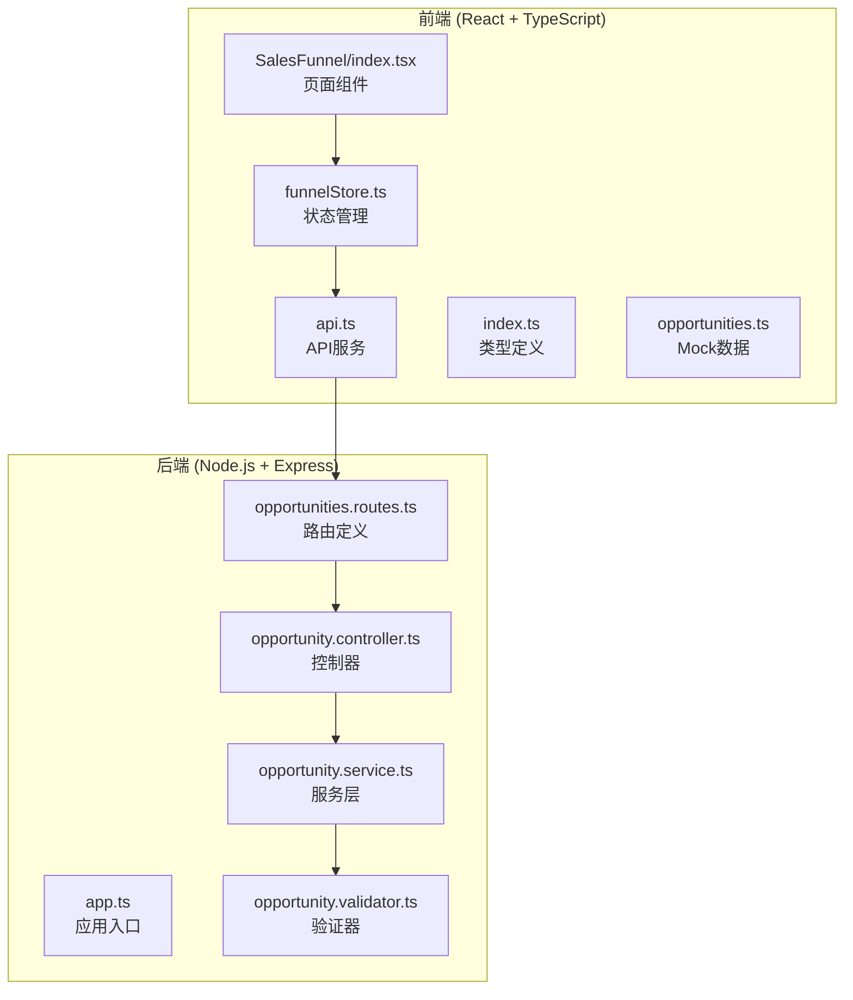

**图表来源**
- [funnelStore.ts:1-163](file://crm-frontend/src/stores/funnelStore.ts#L1-L163)
- [index.tsx:1-688](file://crm-frontend/src/pages/SalesFunnel/index.tsx#L1-L688)
- [api.ts:1-956](file://crm-frontend/src/services/api.ts#L1-L956)
- [app.ts:1-88](file://crm-backend/src/app.ts#L1-L88)

**章节来源**
- [funnelStore.ts:1-163](file://crm-frontend/src/stores/funnelStore.ts#L1-L163)
- [index.tsx:1-688](file://crm-frontend/src/pages/SalesFunnel/index.tsx#L1-L688)
- [package.json:1-39](file://crm-frontend/package.json#L1-L39)

## 核心组件

### 状态管理架构

销售漏斗存储采用Zustand的函数式状态管理模式，提供了完整的状态管理和业务逻辑：

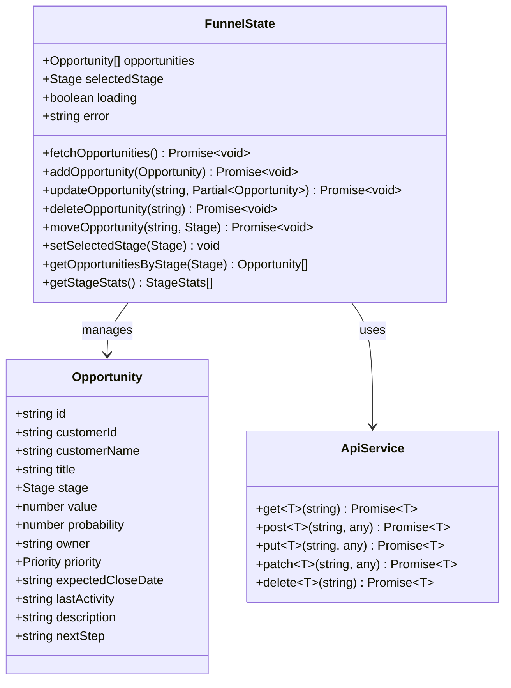

**图表来源**
- [funnelStore.ts:7-23](file://crm-frontend/src/stores/funnelStore.ts#L7-L23)
- [index.ts:39-55](file://crm-frontend/src/types/index.ts#L39-L55)
- [api.ts:23-99](file://crm-frontend/src/services/api.ts#L23-L99)

### 数据流架构

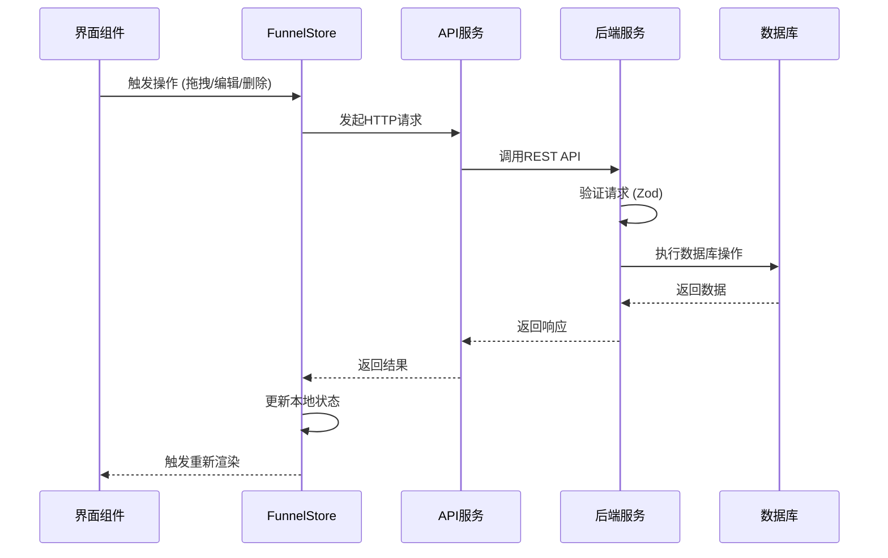

**图表来源**
- [index.tsx:542-688](file://crm-frontend/src/pages/SalesFunnel/index.tsx#L542-L688)
- [funnelStore.ts:34-137](file://crm-frontend/src/stores/funnelStore.ts#L34-L137)
- [api.ts:159-178](file://crm-frontend/src/services/api.ts#L159-L178)

**章节来源**
- [funnelStore.ts:25-163](file://crm-frontend/src/stores/funnelStore.ts#L25-L163)
- [index.ts:1-677](file://crm-frontend/src/types/index.ts#L1-L677)

## 架构概览

### 前端架构

前端采用现代化的React架构，结合TypeScript提供强类型支持：

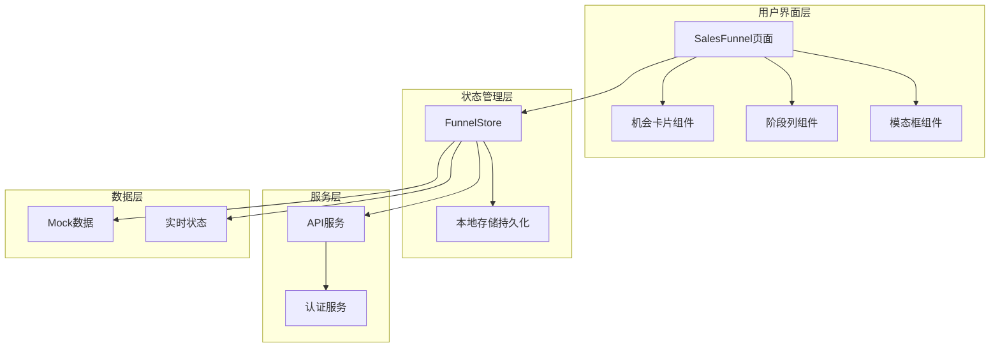

**图表来源**
- [index.tsx:244-509](file://crm-frontend/src/pages/SalesFunnel/index.tsx#L244-L509)
- [funnelStore.ts:25-163](file://crm-frontend/src/stores/funnelStore.ts#L25-L163)

### 后端架构

后端采用分层架构设计，确保关注点分离：

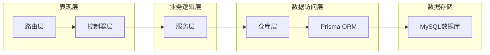

**图表来源**
- [app.ts:1-88](file://crm-backend/src/app.ts#L1-L88)
- [opportunities.routes.ts:1-17](file://crm-backend/src/routes/opportunities.routes.ts#L1-L17)
- [opportunity.controller.ts:1-59](file://crm-backend/src/controllers/opportunity.controller.ts#L1-L59)

**章节来源**
- [index.tsx:1-688](file://crm-frontend/src/pages/SalesFunnel/index.tsx#L1-L688)
- [app.ts:1-88](file://crm-backend/src/app.ts#L1-L88)

## 详细组件分析

### FunnelStore 实现分析

#### 状态结构设计

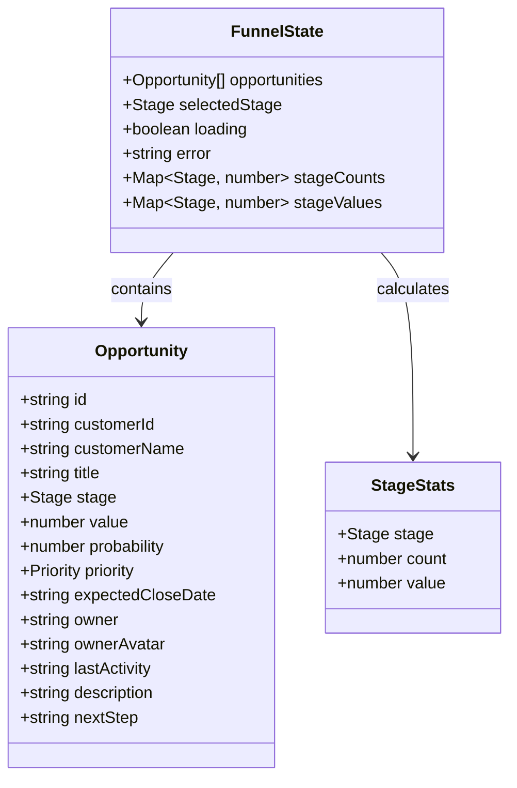

**图表来源**
- [funnelStore.ts:7-23](file://crm-frontend/src/stores/funnelStore.ts#L7-L23)
- [index.ts:39-55](file://crm-frontend/src/types/index.ts#L39-L55)

#### 核心操作流程

##### 获取商机列表流程

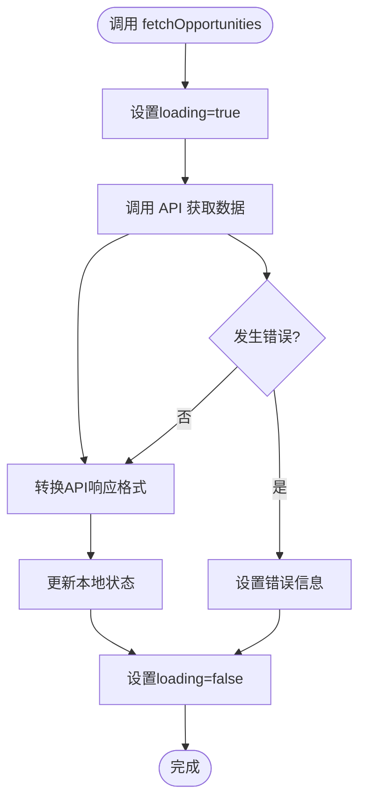

**图表来源**
- [funnelStore.ts:34-59](file://crm-frontend/src/stores/funnelStore.ts#L34-L59)

##### 商机拖拽移动流程

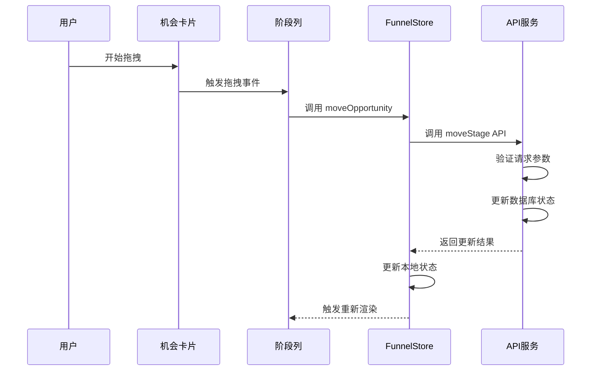

**图表来源**
- [index.tsx:567-580](file://crm-frontend/src/pages/SalesFunnel/index.tsx#L567-L580)
- [funnelStore.ts:124-137](file://crm-frontend/src/stores/funnelStore.ts#L124-L137)

#### 数据转换机制

前端需要将后端API响应转换为本地使用的数据格式：

| 字段名 | 后端字段 | 转换逻辑 |
|--------|----------|----------|
| id | id | 直接映射 |
| customerId | customerId | 直接映射 |
| customerName | customer.name | 使用三元运算符提供默认值 |
| title | title | 直接映射 |
| stage | stage | 强制类型转换为Stage枚举 |
| value | value | 转换为Number类型 |
| probability | probability | 直接映射 |
| owner | owner.name | 使用默认值'未分配' |
| ownerAvatar | owner.avatar | 直接映射 |
| priority | priority | 强制类型转换为Priority枚举 |
| expectedCloseDate | expectedCloseDate | 直接映射 |
| lastActivity | lastActivity或createdAt | 使用lastActivity，若为空则回退到createdAt |

**章节来源**
- [funnelStore.ts:34-54](file://crm-frontend/src/stores/funnelStore.ts#L34-L54)

### 页面组件分析

#### 销售漏斗看板组件

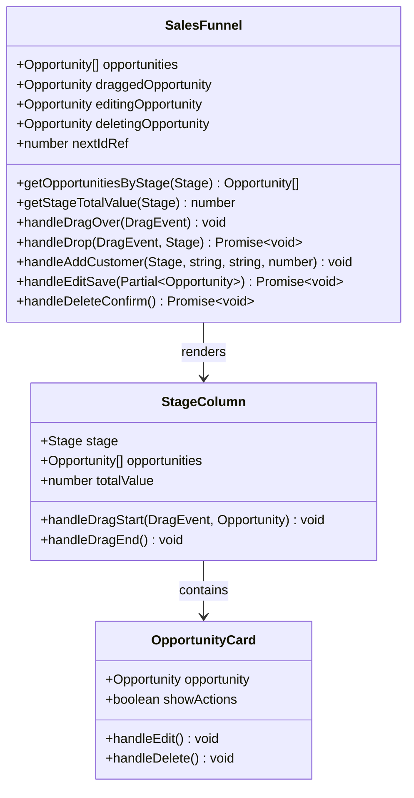

**图表来源**
- [index.tsx:542-688](file://crm-frontend/src/pages/SalesFunnel/index.tsx#L542-L688)
- [index.tsx:424-509](file://crm-frontend/src/pages/SalesFunnel/index.tsx#L424-L509)

#### 统计面板组件

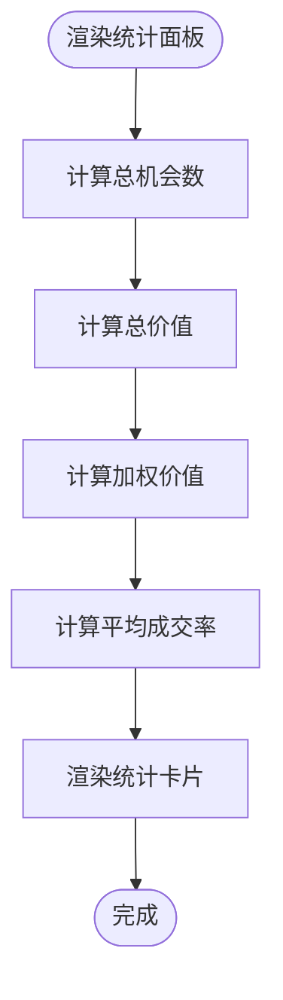

**图表来源**
- [index.tsx:512-540](file://crm-frontend/src/pages/SalesFunnel/index.tsx#L512-L540)

**章节来源**
- [index.tsx:1-688](file://crm-frontend/src/pages/SalesFunnel/index.tsx#L1-L688)

### API 服务层

#### 请求封装机制

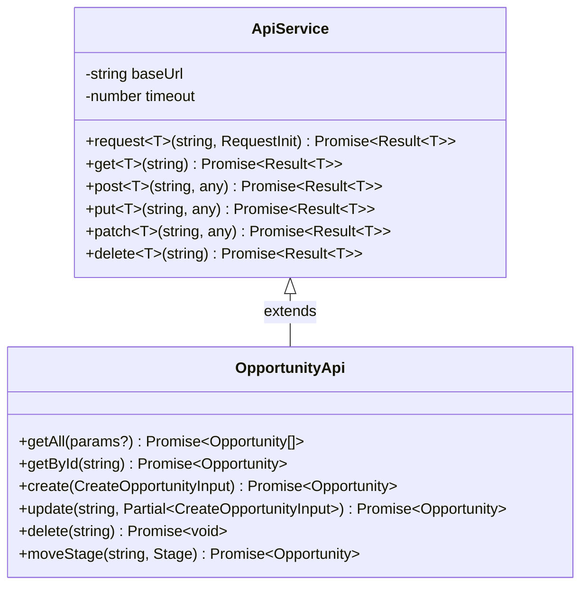

**图表来源**
- [api.ts:23-99](file://crm-frontend/src/services/api.ts#L23-L99)
- [api.ts:159-178](file://crm-frontend/src/services/api.ts#L159-L178)

#### 错误处理机制

API服务实现了完善的错误处理：

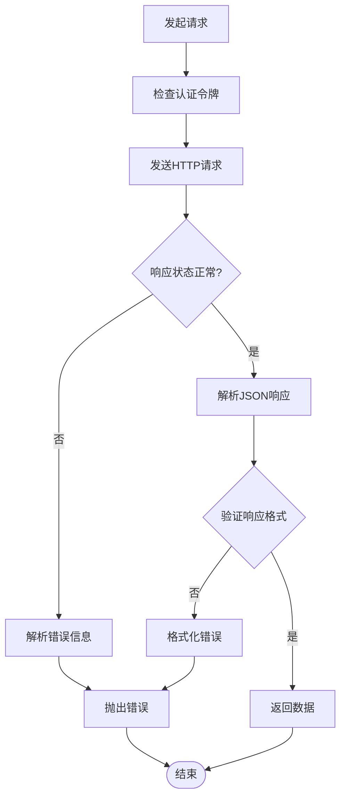

**图表来源**
- [api.ts:32-69](file://crm-frontend/src/services/api.ts#L32-L69)

**章节来源**
- [api.ts:1-956](file://crm-frontend/src/services/api.ts#L1-L956)

## 依赖关系分析

### 前端依赖关系

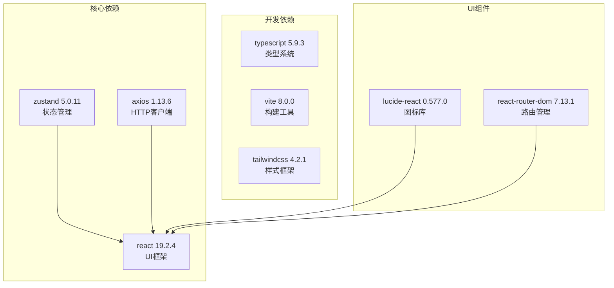

**图表来源**
- [package.json:12-38](file://crm-frontend/package.json#L12-L38)

### 后端依赖关系

```mermaid
graph TD
subgraph "核心依赖"
EXPRESS[express 4.18.2<br/>Web框架]
PRISMA[@prisma/client 5.10.0<br/>ORM工具]
ZOD[zod 3.22.4<br/>数据验证]
JWT[jsonwebtoken 9.0.2<br/>JWT处理]
end
subgraph "开发工具"
TYPESCRIPT[typescript 5.3.3<br/>类型系统]
JEST[jest 30.3.0<br/>测试框架]
SWAGGER[swagger-jsdoc 6.2.8<br/>API文档]
end
subgraph "安全与工具"
HELMET[helmet 7.1.0<br/>安全头部]
CORS[cors 2.8.5<br/>跨域处理]
MORGAN[morgan 1.10.0<br/>日志记录]
end
EXPRESS --> PRISMA
EXPRESS --> ZOD
EXPRESS --> JWT
EXPRESS --> HELMET
EXPRESS --> CORS
EXPRESS --> MORGAN
```

**图表来源**
- [package.json:17-54](file://crm-backend/package.json#L17-L54)

### 数据验证流程

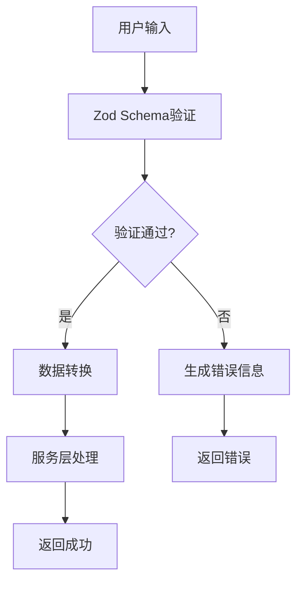

**图表来源**
- [opportunity.validator.ts:15-40](file://crm-backend/src/validators/opportunity.validator.ts#L15-L40)

**章节来源**
- [package.json:1-39](file://crm-frontend/package.json#L1-L39)
- [package.json:1-59](file://crm-backend/package.json#L1-L59)

## 性能考虑

### 状态管理优化

1. **选择性更新**: 使用Zustand的选择性订阅，只在相关状态变化时触发重新渲染
2. **批量操作**: 对于频繁的状态更新，使用批量更新减少重渲染次数
3. **缓存策略**: 利用persist中间件实现状态持久化，避免页面刷新丢失状态

### API调用优化

1. **请求去重**: 对重复的API请求进行去重处理
2. **超时控制**: 设置合理的请求超时时间，避免长时间阻塞
3. **错误重试**: 实现智能的错误重试机制

### 前端渲染优化

1. **虚拟滚动**: 对大量数据使用虚拟滚动技术
2. **懒加载**: 实现组件的懒加载和按需加载
3. **图片优化**: 对图片资源进行压缩和懒加载

## 故障排除指南

### 常见问题及解决方案

#### 状态不同步问题

**问题描述**: 前端状态与后端状态不一致

**解决方案**:
1. 检查API响应格式是否正确
2. 验证数据转换逻辑
3. 确认状态更新的时机

#### 拖拽功能异常

**问题描述**: 商机拖拽移动功能失效

**排查步骤**:
1. 检查浏览器控制台是否有JavaScript错误
2. 验证拖拽事件绑定是否正确
3. 确认API调用是否成功

#### 性能问题

**问题描述**: 页面渲染缓慢或卡顿

**优化措施**:
1. 实施虚拟滚动
2. 减少不必要的状态更新
3. 优化图片资源

**章节来源**
- [funnelStore.ts:34-137](file://crm-frontend/src/stores/funnelStore.ts#L34-L137)
- [index.tsx:561-580](file://crm-frontend/src/pages/SalesFunnel/index.tsx#L561-L580)

## 结论

销售漏斗存储模块展现了现代前端状态管理的最佳实践，通过Zustand实现了简洁高效的状态管理，结合TypeScript提供了强类型安全保障。模块设计具有以下特点：

1. **模块化设计**: 清晰的职责分离，便于维护和扩展
2. **类型安全**: 完整的TypeScript类型定义，提供编译时错误检测
3. **性能优化**: 合理的状态管理策略和渲染优化
4. **错误处理**: 完善的错误处理和用户体验设计
5. **可扩展性**: 良好的架构设计支持功能扩展

该模块为整个销售AI CRM系统提供了坚实的数据基础，支持高效的销售漏斗管理和实时协作功能。通过前后端的紧密配合，实现了流畅的用户体验和可靠的数据一致性。