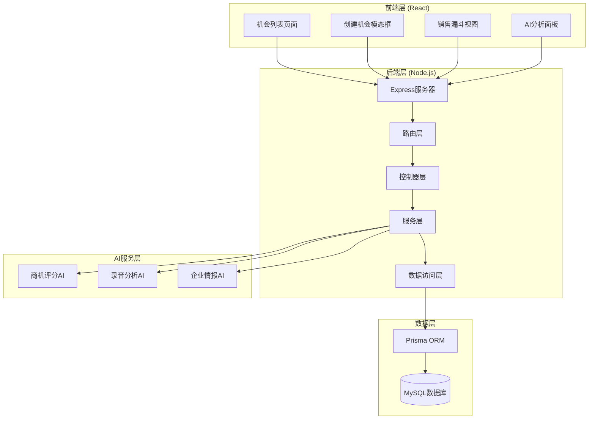
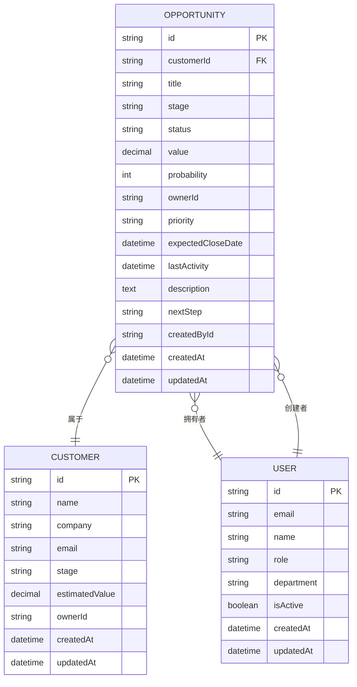
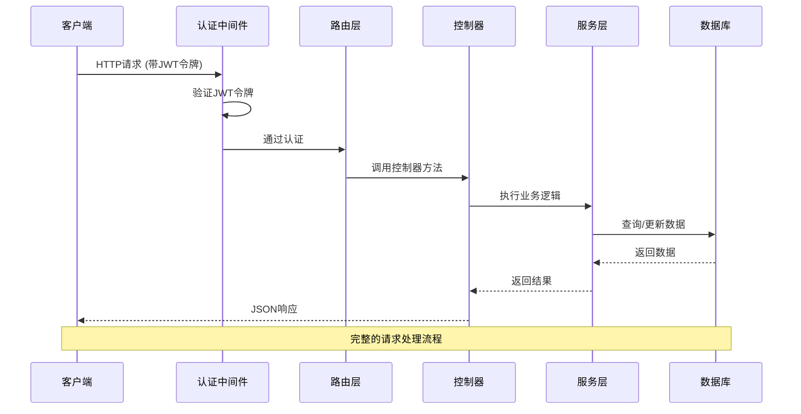
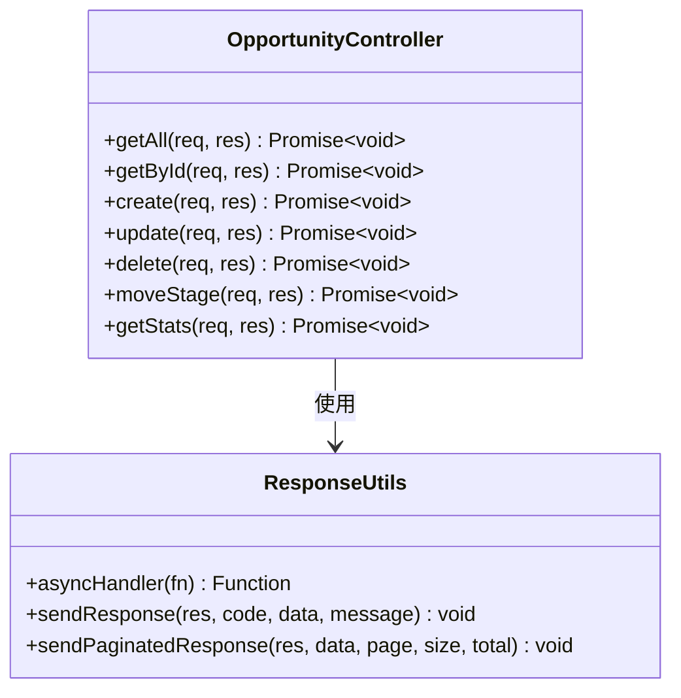
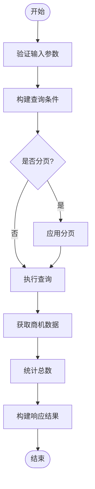
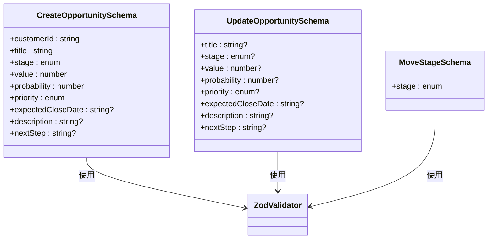
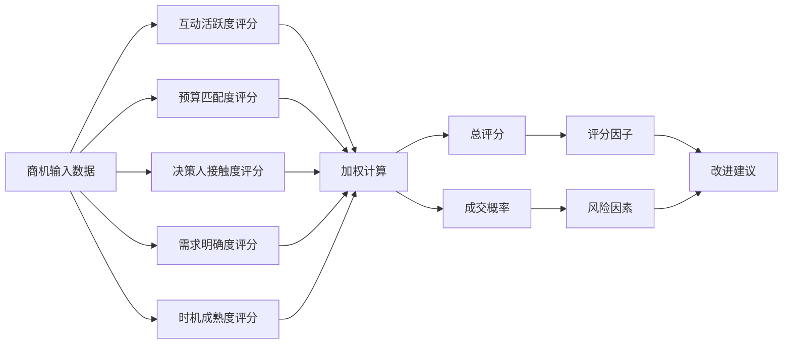
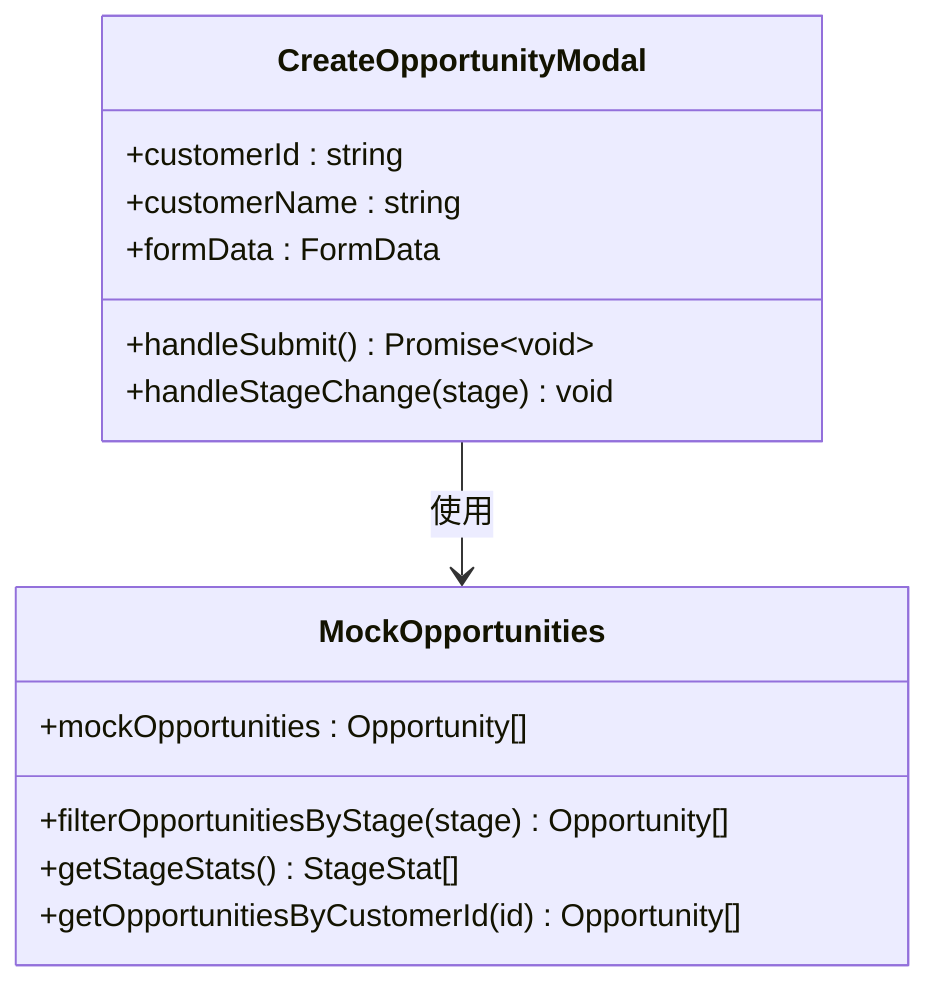
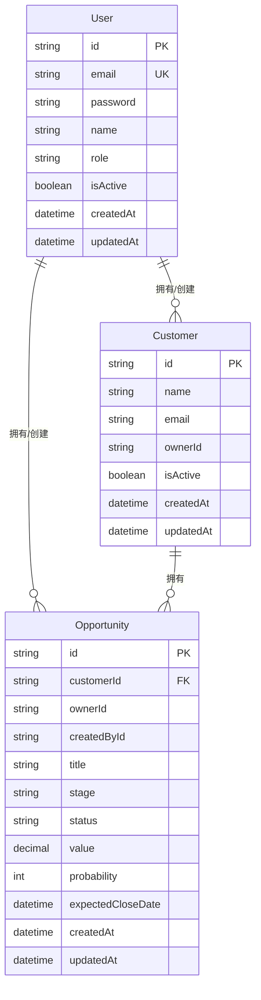
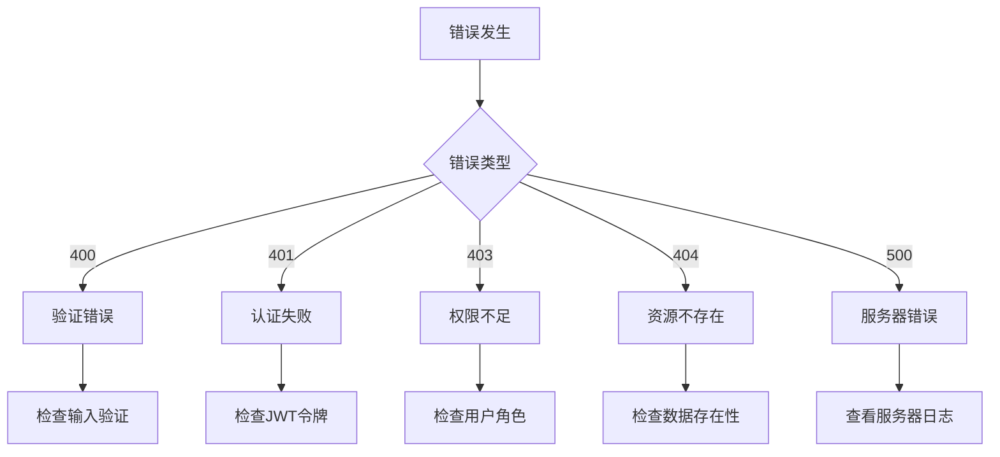

# 商机服务

<cite>
**本文档引用的文件**
- [opportunity.controller.ts](file://crm-backend/src/controllers/opportunity.controller.ts)
- [opportunity.service.ts](file://crm-backend/src/services/opportunity.service.ts)
- [opportunities.routes.ts](file://crm-backend/src/routes/opportunities.routes.ts)
- [opportunity.validator.ts](file://crm-backend/src/validators/opportunity.validator.ts)
- [schema.prisma](file://crm-backend/prisma/schema.prisma)
- [index.ts](file://crm-backend/src/types/index.ts)
- [prisma.ts](file://crm-backend/src/repositories/prisma.ts)
- [response.ts](file://crm-backend/src/utils/response.ts)
- [auth.ts](file://crm-backend/src/middlewares/auth.ts)
- [validate.ts](file://crm-backend/src/middlewares/validate.ts)
- [opportunityScoring.ts](file://crm-backend/src/services/ai/opportunityScoring.ts)
- [ai.service.ts](file://crm-backend/src/services/ai.service.ts)
- [opportunities.ts](file://crm-frontend/src/data/opportunities.ts)
- [CreateOpportunityModal.tsx](file://crm-frontend/src/components/Customers/CreateOpportunityModal.tsx)
</cite>

## 目录
1. [简介](#简介)
2. [项目结构](#项目结构)
3. [核心组件](#核心组件)
4. [架构概览](#架构概览)
5. [详细组件分析](#详细组件分析)
6. [依赖关系分析](#依赖关系分析)
7. [性能考虑](#性能考虑)
8. [故障排除指南](#故障排除指南)
9. [结论](#结论)

## 简介

销售AI CRM系统中的商机服务是一个完整的销售机会管理模块，基于现代Web技术栈构建，采用前后端分离架构。该系统提供了全面的商机生命周期管理功能，包括商机创建、编辑、删除、状态跟踪以及智能化的AI评分分析。

系统的核心特色包括：
- **完整的CRUD操作**：支持商机的全生命周期管理
- **智能评分系统**：基于BANT模型的AI驱动商机评分
- **销售漏斗分析**：实时统计和可视化销售机会状态
- **权限控制**：基于JWT的用户认证和授权机制
- **数据验证**：使用Zod进行严格的输入验证
- **响应格式标准化**：统一的API响应格式

## 项目结构



**图表来源**
- [app.ts](file://crm-backend/src/app.ts)
- [opportunities.routes.ts](file://crm-backend/src/routes/opportunities.routes.ts)
- [opportunity.controller.ts](file://crm-backend/src/controllers/opportunity.controller.ts)

**章节来源**
- [package.json:1-59](file://crm-backend/package.json#L1-L59)
- [schema.prisma:245-274](file://crm-backend/prisma/schema.prisma#L245-L274)

## 核心组件

### 数据模型设计

系统采用Prisma ORM进行数据库抽象，商机模型具有以下关键特性：



**图表来源**
- [schema.prisma:245-274](file://crm-backend/prisma/schema.prisma#L245-L274)
- [schema.prisma:182-241](file://crm-backend/prisma/schema.prisma#L182-L241)
- [schema.prisma:137-178](file://crm-backend/prisma/schema.prisma#L137-L178)

### 销售阶段管理

系统实现了完整的销售漏斗管理，包含8个标准销售阶段：

| 阶段代码 | 中文名称 | 描述 |
|---------|---------|------|
| new_lead | 新线索 | 初步接触的潜在客户 |
| contacted | 已联系 | 建立了初步联系 |
| solution | 方案建议 | 提供了初步解决方案 |
| quoted | 已报价 | 发送了正式报价单 |
| negotiation | 谈判中 | 正在进行商务谈判 |
| procurement_process | 采购流程 | 采购审批流程中 |
| contract_stage | 合同阶段 | 合同签署准备 |
| won | 已成交 | 商机成功转化 |

**章节来源**
- [opportunity.validator.ts:4-13](file://crm-backend/src/validators/opportunity.validator.ts#L4-L13)
- [opportunity.service.ts:125-125](file://crm-backend/src/services/opportunity.service.ts#L125-L125)

## 架构概览



**图表来源**
- [auth.ts:13-33](file://crm-backend/src/middlewares/auth.ts#L13-L33)
- [opportunities.routes.ts:9-15](file://crm-backend/src/routes/opportunities.routes.ts#L9-L15)
- [opportunity.controller.ts:6-56](file://crm-backend/src/controllers/opportunity.controller.ts#L6-L56)

### API端点设计

系统提供RESTful API接口，支持标准的CRUD操作：

| 方法 | 端点 | 功能 | 认证要求 |
|------|------|------|----------|
| GET | `/api/opportunities` | 获取所有商机 | ✅ |
| GET | `/api/opportunities/stats` | 获取统计信息 | ✅ |
| GET | `/api/opportunities/:id` | 获取指定商机 | ✅ |
| POST | `/api/opportunities` | 创建新商机 | ✅ |
| PUT | `/api/opportunities/:id` | 更新商机 | ✅ |
| DELETE | `/api/opportunities/:id` | 删除商机 | ✅ |
| PATCH | `/api/opportunities/:id/stage` | 移动商机阶段 | ✅ |

**章节来源**
- [opportunities.routes.ts:9-15](file://crm-backend/src/routes/opportunities.routes.ts#L9-L15)
- [opportunity.controller.ts:6-56](file://crm-backend/src/controllers/opportunity.controller.ts#L6-L56)

## 详细组件分析

### 商机控制器 (OpportunityController)

控制器层负责HTTP请求处理和响应格式化：



**图表来源**
- [opportunity.controller.ts:5-57](file://crm-backend/src/controllers/opportunity.controller.ts#L5-L57)
- [response.ts:63-103](file://crm-backend/src/utils/response.ts#L63-L103)

### 商机服务 (OpportunityService)

服务层实现核心业务逻辑，包含完整的数据访问和业务规则：



**图表来源**
- [opportunity.service.ts:6-53](file://crm-backend/src/services/opportunity.service.ts#L6-L53)

### 数据验证系统

使用Zod进行严格的输入验证，确保数据完整性：



**图表来源**
- [opportunity.validator.ts:15-40](file://crm-backend/src/validators/opportunity.validator.ts#L15-L40)

**章节来源**
- [opportunity.validator.ts:15-40](file://crm-backend/src/validators/opportunity.validator.ts#L15-L40)
- [validate.ts:6-33](file://crm-backend/src/middlewares/validate.ts#L6-L33)

### AI智能评分系统

基于BANT模型的商机评分算法：



**图表来源**
- [opportunityScoring.ts:46-105](file://crm-backend/src/services/ai/opportunityScoring.ts#L46-L105)

**章节来源**
- [opportunityScoring.ts:11-18](file://crm-backend/src/services/ai/opportunityScoring.ts#L11-L18)
- [opportunityScoring.ts:146-194](file://crm-backend/src/services/ai/opportunityScoring.ts#L146-L194)

### 前端集成组件



**图表来源**
- [CreateOpportunityModal.tsx:50-109](file://crm-frontend/src/components/Customers/CreateOpportunityModal.tsx#L50-L109)
- [opportunities.ts:4-140](file://crm-frontend/src/data/opportunities.ts#L4-L140)

**章节来源**
- [CreateOpportunityModal.tsx:50-109](file://crm-frontend/src/components/Customers/CreateOpportunityModal.tsx#L50-L109)
- [opportunities.ts:142-169](file://crm-frontend/src/data/opportunities.ts#L142-L169)

## 依赖关系分析

```mermaid
graph TB
subgraph "外部依赖"
ZOD[Zod - 输入验证]
JWT[jsonwebtoken - JWT处理]
PRISMA[@prisma/client - 数据库ORM]
EXPRESS[express - Web框架]
end
subgraph "内部模块"
ROUTES[路由模块]
CONTROLLERS[控制器模块]
SERVICES[服务模块]
VALIDATORS[验证器模块]
MIDDLEWARES[中间件模块]
REPOSITORIES[数据访问层]
end
ROUTES --> CONTROLLERS
CONTROLLERS --> SERVICES
SERVICES --> VALIDATORS
SERVICES --> REPOSITORIES
ROUTES --> MIDDLEWARES
MIDDLEWARES --> JWT
SERVICES --> PRISMA
VALIDATORS --> ZOD
ROUTES --> EXPRESS
```

**图表来源**
- [package.json:17-34](file://crm-backend/package.json#L17-L34)
- [opportunities.routes.ts:1-17](file://crm-backend/src/routes/opportunities.routes.ts#L1-L17)

### 数据库关系设计



**图表来源**
- [schema.prisma:137-178](file://crm-backend/prisma/schema.prisma#L137-L178)
- [schema.prisma:182-241](file://crm-backend/prisma/schema.prisma#L182-L241)
- [schema.prisma:245-274](file://crm-backend/prisma/schema.prisma#L245-L274)

**章节来源**
- [schema.prisma:137-178](file://crm-backend/prisma/schema.prisma#L137-L178)
- [schema.prisma:182-241](file://crm-backend/prisma/schema.prisma#L182-L241)
- [schema.prisma:245-274](file://crm-backend/prisma/schema.prisma#L245-L274)

## 性能考虑

### 数据库优化策略

1. **索引优化**
   - 在`customerId`、`stage`、`ownerId`、`status`字段上建立索引
   - 使用复合索引优化常用查询模式

2. **查询优化**
   - 使用`select`投影减少数据传输
   - 实现分页查询避免大量数据加载
   - 使用`Promise.all`并发执行独立查询

3. **缓存策略**
   - 对频繁访问的统计数据进行缓存
   - 实现查询结果缓存机制

### API性能优化

1. **响应时间优化**
   - 使用异步处理避免阻塞
   - 实现请求超时机制
   - 优化数据库连接池配置

2. **内存管理**
   - 及时释放数据库连接
   - 避免内存泄漏
   - 实现适当的错误处理

## 故障排除指南

### 常见错误类型



**图表来源**
- [response.ts:19-61](file://crm-backend/src/utils/response.ts#L19-L61)

### 调试技巧

1. **开发环境调试**
   - 启用Prisma查询日志
   - 使用Express调试中间件
   - 实现详细的错误堆栈跟踪

2. **生产环境监控**
   - 实施错误报告系统
   - 监控API响应时间
   - 设置性能指标告警

**章节来源**
- [response.ts:19-61](file://crm-backend/src/utils/response.ts#L19-L61)
- [prisma.ts:3-7](file://crm-backend/src/repositories/prisma.ts#L3-L7)

## 结论

销售AI CRM系统的商机服务模块展现了现代Web应用的最佳实践，具有以下显著特点：

### 技术优势
- **架构清晰**：采用分层架构，职责分离明确
- **数据安全**：完善的认证授权机制
- **数据质量**：严格的输入验证和数据完整性保证
- **扩展性强**：模块化设计便于功能扩展

### 业务价值
- **智能化程度高**：AI驱动的商机评分和分析
- **用户体验优秀**：直观的前端界面和流畅的操作体验
- **决策支持**：提供全面的销售漏斗分析和统计信息
- **自动化程度高**：减少重复性工作，提高销售效率

### 发展前景
该系统为销售团队提供了强大的数字化工具，通过AI技术的应用，能够显著提升销售转化率和客户满意度。随着业务的发展，可以进一步扩展AI功能，集成更多智能化特性，为企业创造更大的价值。