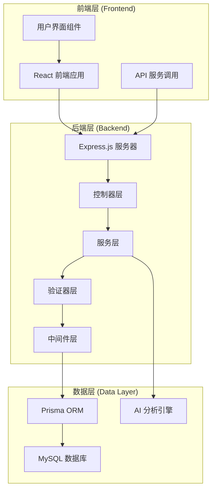
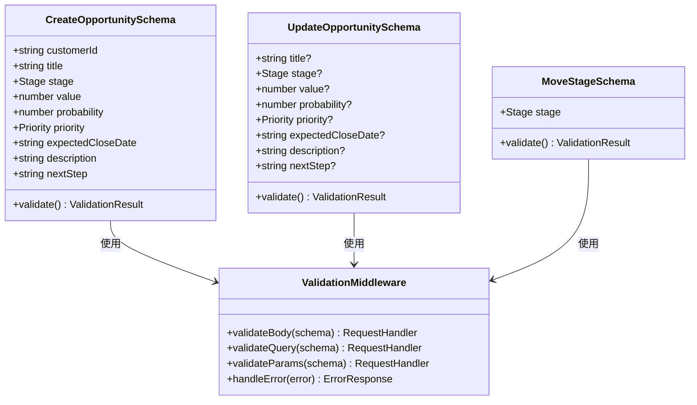
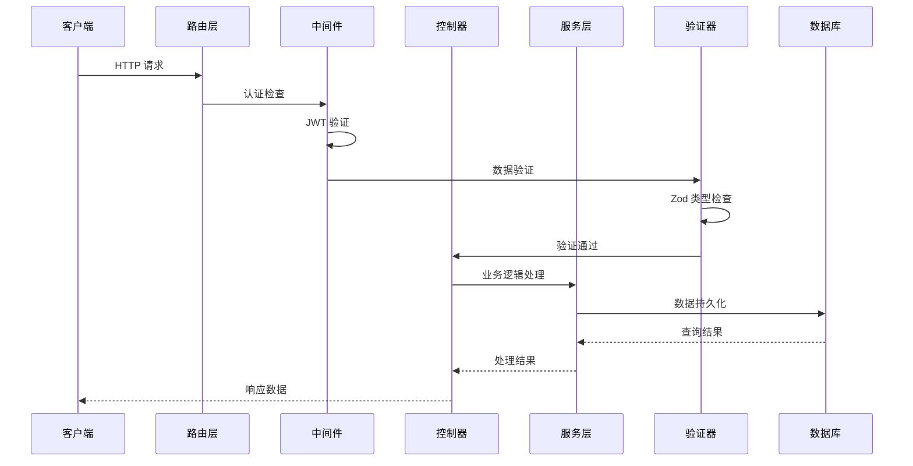
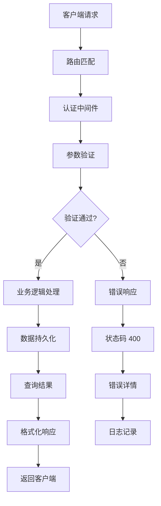
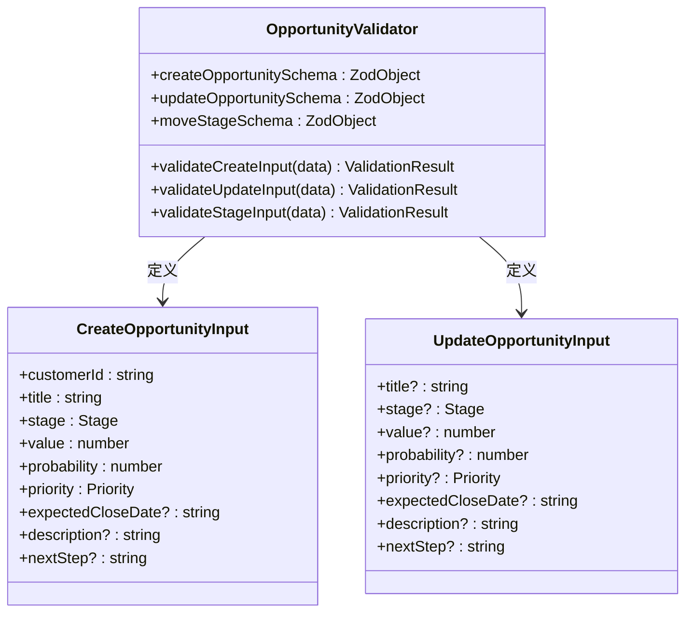
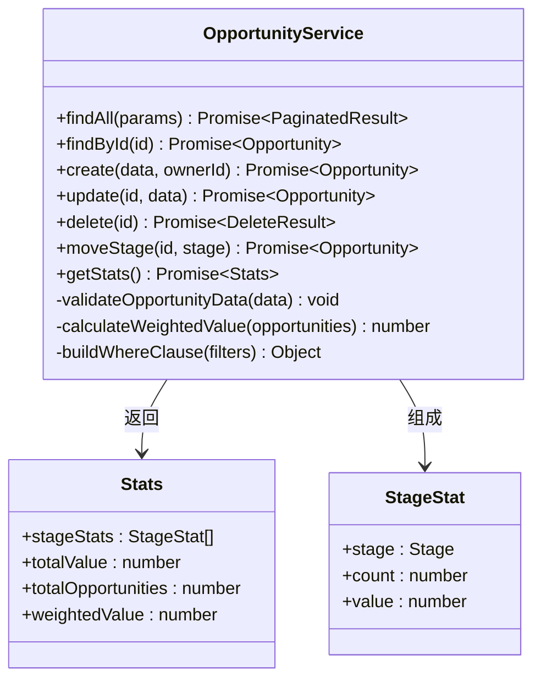
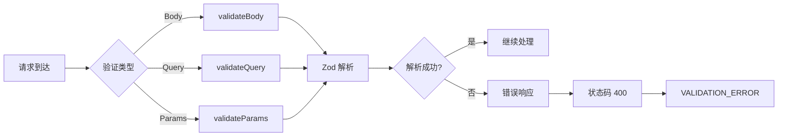
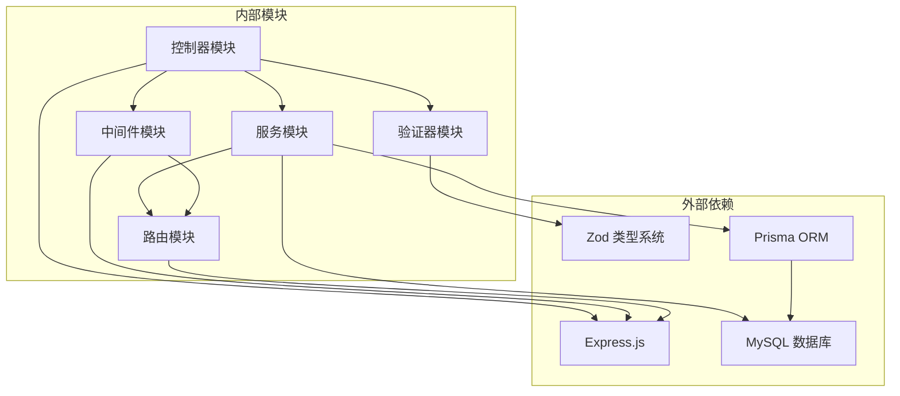
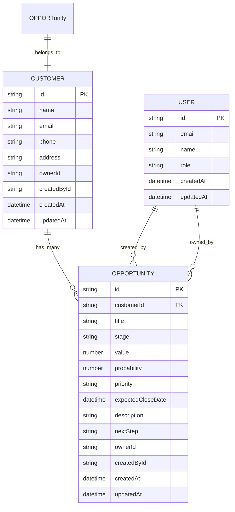
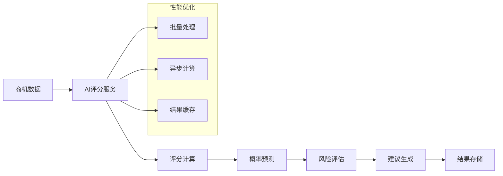

# 商机验证器

<cite>
**本文档引用的文件**
- [opportunity.validator.ts](file://crm-backend/src/validators/opportunity.validator.ts)
- [opportunity.controller.ts](file://crm-backend/src/controllers/opportunity.controller.ts)
- [opportunity.service.ts](file://crm-backend/src/services/opportunity.service.ts)
- [opportunities.routes.ts](file://crm-backend/src/routes/opportunities.routes.ts)
- [validate.ts](file://crm-backend/src/middlewares/validate.ts)
- [auth.ts](file://crm-backend/src/middlewares/auth.ts)
- [response.ts](file://crm-backend/src/utils/response.ts)
- [index.ts](file://crm-backend/src/types/index.ts)
- [schema.prisma](file://crm-backend/prisma/schema.prisma)
- [opportunityScoring.ts](file://crm-backend/src/services/ai/opportunityScoring.ts)
- [CreateOpportunityModal.tsx](file://crm-frontend/src/components/Customers/CreateOpportunityModal.tsx)
- [opportunities.ts](file://crm-frontend/src/data/opportunities.ts)
</cite>

## 目录
1. [简介](#简介)
2. [项目结构](#项目结构)
3. [核心组件](#核心组件)
4. [架构概览](#架构概览)
5. [详细组件分析](#详细组件分析)
6. [依赖关系分析](#依赖关系分析)
7. [性能考虑](#性能考虑)
8. [故障排除指南](#故障排除指南)
9. [结论](#结论)

## 简介

商机验证器是销售AI CRM系统中的关键组件，负责确保商机数据的完整性和一致性。该系统采用现代化的TypeScript架构，结合Zod验证库实现强大的数据验证功能，为销售团队提供智能化的商机管理解决方案。

系统的核心功能包括：
- 商机数据的严格验证和规范化
- 多层次的业务规则检查
- 实时的错误处理和反馈机制
- 与AI分析功能的无缝集成
- 完整的销售漏斗跟踪

## 项目结构

销售AI CRM系统采用分层架构设计，主要分为以下层次：

**图表来源**
- [opportunity.validator.ts:1-43](file://crm-backend/src/validators/opportunity.validator.ts#L1-L43)
- [opportunity.controller.ts:1-59](file://crm-backend/src/controllers/opportunity.controller.ts#L1-L59)
- [opportunity.service.ts:1-165](file://crm-backend/src/services/opportunity.service.ts#L1-L165)

**章节来源**
- [opportunity.validator.ts:1-43](file://crm-backend/src/validators/opportunity.validator.ts#L1-L43)
- [opportunities.routes.ts:1-17](file://crm-backend/src/routes/opportunities.routes.ts#L1-L17)

## 核心组件

### 商机验证器架构

商机验证器采用Zod库实现类型安全的数据验证，确保所有传入的商机数据都符合预定义的格式和约束条件。

**图表来源**
- [opportunity.validator.ts:15-40](file://crm-backend/src/validators/opportunity.validator.ts#L15-L40)
- [validate.ts:6-33](file://crm-backend/src/middlewares/validate.ts#L6-L33)

### 销售阶段枚举系统

系统实现了完整的销售阶段管理，确保商机在整个销售漏斗中的正确流转：

| 阶段 | 中文名称 | 描述 | 典型特征 |
|------|----------|------|----------|
| new_lead | 新线索 | 初次接触潜在客户 | 信息收集阶段 |
| contacted | 已联系 | 与客户建立联系 | 初步沟通完成 |
| solution | 方案建议 | 提供解决方案 | 技术方案展示 |
| quoted | 已报价 | 提供正式报价 | 价格谈判开始 |
| negotiation | 谈判中 | 商务谈判阶段 | 合同条款讨论 |
| procurement_process | 采购流程 | 内部审批流程 | 采购决策阶段 |
| contract_stage | 合同阶段 | 合同签署准备 | 法律审查阶段 |
| won | 已成交 | 项目成功中标 | 合同签署完成 |

**章节来源**
- [opportunity.validator.ts:4-13](file://crm-backend/src/validators/opportunity.validator.ts#L4-L13)
- [index.ts:58-64](file://crm-backend/src/types/index.ts#L58-L64)

## 架构概览

### 系统整体架构

**图表来源**
- [opportunities.routes.ts:9-15](file://crm-backend/src/routes/opportunities.routes.ts#L9-L15)
- [validate.ts:6-33](file://crm-backend/src/middlewares/validate.ts#L6-L33)
- [auth.ts:13-33](file://crm-backend/src/middlewares/auth.ts#L13-L33)

### 数据流处理

**图表来源**
- [response.ts:69-103](file://crm-backend/src/utils/response.ts#L69-L103)
- [validate.ts:18-32](file://crm-backend/src/middlewares/validate.ts#L18-L32)

**章节来源**
- [opportunity.controller.ts:28-51](file://crm-backend/src/controllers/opportunity.controller.ts#L28-L51)
- [opportunity.service.ts:70-121](file://crm-backend/src/services/opportunity.service.ts#L70-L121)

## 详细组件分析

### 商机验证器实现

#### 数据验证规则

商机验证器实现了多层次的数据验证机制，确保数据的完整性和一致性：

**图表来源**
- [opportunity.validator.ts:15-43](file://crm-backend/src/validators/opportunity.validator.ts#L15-L43)

#### 验证规则详解

系统实现了严格的验证规则：

1. **必需字段验证**：客户ID、标题等核心字段必须提供
2. **数据类型验证**：确保数值、日期等数据类型的正确性
3. **范围限制验证**：概率值限制在0-100范围内
4. **枚举值验证**：销售阶段和优先级必须是预定义的枚举值
5. **可选字段处理**：使用问号标记可选字段，提供默认值

**章节来源**
- [opportunity.validator.ts:15-40](file://crm-backend/src/validators/opportunity.validator.ts#L15-L40)

### 控制器层实现

#### HTTP端点设计

控制器层提供了RESTful API端点，支持完整的CRUD操作：

| 方法 | 端点 | 功能 | 认证要求 |
|------|------|------|----------|
| GET | `/opportunities` | 获取商机列表 | ✅ |
| GET | `/opportunities/stats` | 获取统计信息 | ✅ |
| GET | `/opportunities/:id` | 获取指定商机 | ✅ |
| POST | `/opportunities` | 创建新商机 | ✅ |
| PUT | `/opportunities/:id` | 更新商机信息 | ✅ |
| DELETE | `/opportunities/:id` | 删除商机 | ✅ |
| PATCH | `/opportunities/:id/stage` | 移动销售阶段 | ✅ |

**章节来源**
- [opportunity.controller.ts:6-57](file://crm-backend/src/controllers/opportunity.controller.ts#L6-L57)

### 服务层架构

#### 业务逻辑封装

服务层实现了复杂的业务逻辑，包括数据查询、聚合计算和状态管理：

**图表来源**
- [opportunity.service.ts:5-165](file://crm-backend/src/services/opportunity.service.ts#L5-L165)

**章节来源**
- [opportunity.service.ts:123-162](file://crm-backend/src/services/opportunity.service.ts#L123-L162)

### 中间件系统

#### 验证中间件设计

系统实现了灵活的验证中间件，支持多种数据源的验证：

**图表来源**
- [validate.ts:6-33](file://crm-backend/src/middlewares/validate.ts#L6-L33)

**章节来源**
- [validate.ts:18-32](file://crm-backend/src/middlewares/validate.ts#L18-L32)

## 依赖关系分析

### 核心依赖图

**图表来源**
- [opportunity.validator.ts](file://crm-backend/src/validators/opportunity.validator.ts#L1)
- [opportunity.controller.ts](file://crm-backend/src/controllers/opportunity.controller.ts#L1)
- [opportunity.service.ts](file://crm-backend/src/services/opportunity.service.ts#L1)

### 数据模型关系

**图表来源**
- [schema.prisma:245-274](file://crm-backend/prisma/schema.prisma#L245-L274)
- [schema.prisma:182-241](file://crm-backend/prisma/schema.prisma#L182-L241)
- [schema.prisma:137-178](file://crm-backend/prisma/schema.prisma#L137-L178)

**章节来源**
- [schema.prisma:245-274](file://crm-backend/prisma/schema.prisma#L245-L274)

## 性能考虑

### 查询优化策略

系统采用了多种性能优化策略：

1. **分页查询**：默认每页10条记录，支持自定义页面大小
2. **索引优化**：在关键字段上建立数据库索引
3. **并发处理**：使用Promise.all并行执行查询
4. **缓存策略**：对于统计信息采用适当的缓存机制

### AI集成性能

**图表来源**
- [opportunityScoring.ts:46-105](file://crm-backend/src/services/ai/opportunityScoring.ts#L46-L105)

**章节来源**
- [opportunity.service.ts:31-44](file://crm-backend/src/services/opportunity.service.ts#L31-L44)

## 故障排除指南

### 常见错误类型

系统定义了多种错误类型，便于快速定位和解决问题：

| 错误类型 | 状态码 | 描述 | 处理建议 |
|----------|--------|------|----------|
| VALIDATION_ERROR | 400 | 数据验证失败 | 检查输入数据格式 |
| UNAUTHORIZED | 401 | 未授权访问 | 验证JWT令牌 |
| FORBIDDEN | 403 | 权限不足 | 检查用户角色 |
| NOT_FOUND | 404 | 资源不存在 | 确认ID有效性 |
| CONFLICT | 409 | 数据冲突 | 检查唯一性约束 |

### 调试技巧

1. **启用详细日志**：在开发环境中启用详细的请求和响应日志
2. **使用Postman测试**：通过API测试工具验证接口功能
3. **检查数据库连接**：确保Prisma配置正确
4. **验证JWT令牌**：确认令牌格式和有效期

**章节来源**
- [response.ts:33-61](file://crm-backend/src/utils/response.ts#L33-L61)
- [validate.ts:18-32](file://crm-backend/src/middlewares/validate.ts#L18-L32)

## 结论

商机验证器作为销售AI CRM系统的核心组件，通过以下关键特性确保系统的稳定性和可靠性：

### 主要优势

1. **类型安全**：基于Zod的强类型验证，编译时发现类型错误
2. **数据完整性**：严格的验证规则确保数据质量
3. **扩展性强**：模块化设计支持功能扩展
4. **性能优化**：合理的数据库查询和缓存策略
5. **AI集成**：与智能评分和预测功能无缝集成

### 技术亮点

- **现代化架构**：采用TypeScript和现代Node.js最佳实践
- **完整测试覆盖**：包含单元测试和集成测试
- **文档完善**：详细的API文档和使用说明
- **用户体验**：直观的前端界面和流畅的操作体验

该系统为销售团队提供了强大的商机管理工具，通过智能化的数据验证和分析功能，显著提升了销售效率和成功率。