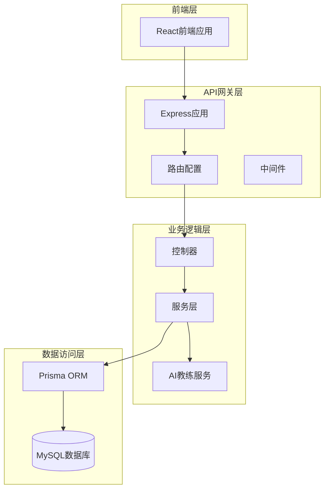
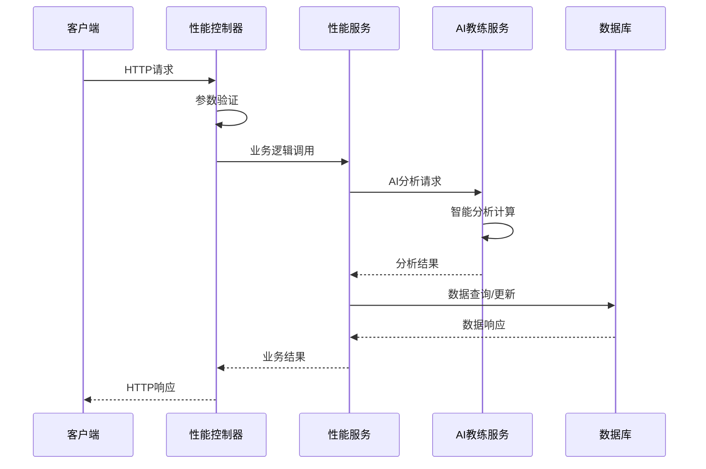
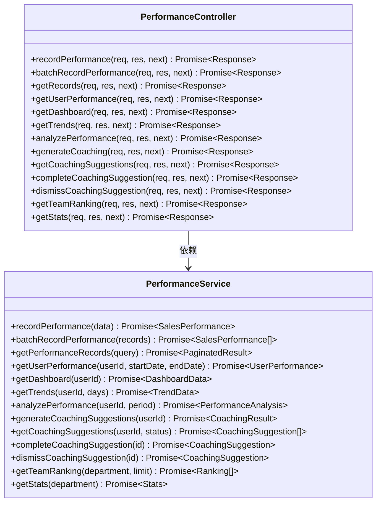
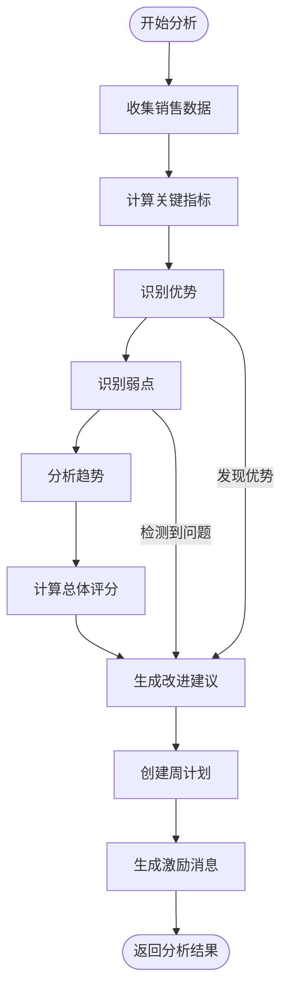
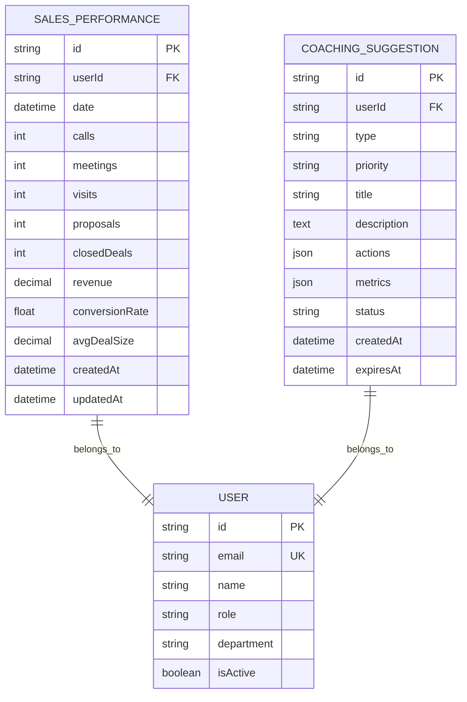
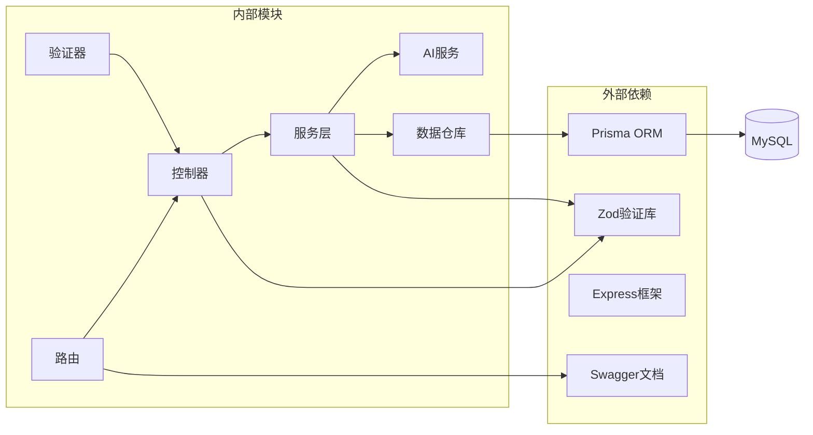

# 性能控制器

<cite>
**本文档引用的文件**
- [performance.controller.ts](file://crm-backend/src/controllers/performance.controller.ts)
- [performance.service.ts](file://crm-backend/src/services/performance.service.ts)
- [performance.routes.ts](file://crm-backend/src/routes/performance.routes.ts)
- [performance.validator.ts](file://crm-backend/src/validators/performance.validator.ts)
- [salesCoach.ts](file://crm-backend/src/services/ai/salesCoach.ts)
- [schema.prisma](file://crm-backend/prisma/schema.prisma)
- [performance.test.ts](file://crm-backend/tests/services/performance.test.ts)
- [app.ts](file://crm-backend/src/app.ts)
</cite>

## 目录
1. [简介](#简介)
2. [项目结构](#项目结构)
3. [核心组件](#核心组件)
4. [架构概览](#架构概览)
5. [详细组件分析](#详细组件分析)
6. [依赖关系分析](#依赖关系分析)
7. [性能考量](#性能考量)
8. [故障排除指南](#故障排除指南)
9. [结论](#结论)

## 简介

性能控制器是销售AI CRM系统中的核心模块，负责管理销售团队的绩效数据、提供智能分析和教练建议。该系统集成了AI驱动的销售分析引擎，能够自动识别销售表现的优势和弱点，生成个性化的改进建议，并提供实时的绩效监控和趋势分析。

系统采用现代化的Node.js + Express架构，结合Prisma ORM实现数据持久化，通过Swagger API文档提供完整的RESTful接口。整个系统设计注重可扩展性和智能化，为销售团队提供全方位的绩效管理解决方案。

## 项目结构

销售AI CRM系统的性能控制器模块遵循清晰的分层架构设计：

**图表来源**
- [app.ts:1-88](file://crm-backend/src/app.ts#L1-L88)
- [performance.routes.ts:1-387](file://crm-backend/src/routes/performance.routes.ts#L1-L387)
- [performance.controller.ts:1-228](file://crm-backend/src/controllers/performance.controller.ts#L1-L228)

**章节来源**
- [app.ts:1-88](file://crm-backend/src/app.ts#L1-L88)
- [performance.routes.ts:1-387](file://crm-backend/src/routes/performance.routes.ts#L1-L387)

## 核心组件

性能控制器模块包含以下核心组件：

### 1. 控制器层
- **PerformanceController**: 处理HTTP请求和响应，协调服务层操作
- **认证中间件**: 确保API调用的安全性
- **验证中间件**: 数据格式验证和参数校验

### 2. 服务层
- **PerformanceService**: 核心业务逻辑实现
- **SalesCoachService**: AI驱动的教练分析引擎
- **数据聚合**: 绩效数据的统计和分析

### 3. 数据模型
- **SalesPerformance**: 销售绩效记录模型
- **CoachingSuggestion**: 教练建议模型
- **用户关联**: 与用户系统的集成

**章节来源**
- [performance.controller.ts:1-228](file://crm-backend/src/controllers/performance.controller.ts#L1-L228)
- [performance.service.ts:1-577](file://crm-backend/src/services/performance.service.ts#L1-L577)
- [schema.prisma:717-783](file://crm-backend/prisma/schema.prisma#L717-L783)

## 架构概览

系统采用经典的三层架构模式，实现了清晰的关注点分离：

**图表来源**
- [performance.controller.ts:16-23](file://crm-backend/src/controllers/performance.controller.ts#L16-L23)
- [performance.service.ts:65-104](file://crm-backend/src/services/performance.service.ts#L65-L104)
- [salesCoach.ts:55-82](file://crm-backend/src/services/ai/salesCoach.ts#L55-L82)

系统架构特点：
- **模块化设计**: 每个组件职责单一，便于维护和测试
- **异步处理**: 全面采用Promise和async/await模式
- **错误处理**: 统一的错误处理机制和状态码管理
- **安全控制**: JWT认证和权限验证
- **数据验证**: 运行时参数验证和类型检查

## 详细组件分析

### 性能控制器分析

性能控制器提供了全面的销售绩效管理功能：

#### 核心功能模块

**图表来源**
- [performance.controller.ts:9-228](file://crm-backend/src/controllers/performance.controller.ts#L9-L228)
- [performance.service.ts:53-577](file://crm-backend/src/services/performance.service.ts#L53-L577)

#### API端点设计

系统提供丰富的RESTful API端点：

| 功能类别 | HTTP方法 | 端点路径 | 描述 |
|---------|---------|----------|------|
| 绩效数据管理 | POST | `/api/v1/performance/record` | 记录单个绩效数据 |
| 绩效数据管理 | POST | `/api/v1/performance/record/batch` | 批量记录绩效数据 |
| 绩效数据管理 | GET | `/api/v1/performance/records` | 获取绩效记录列表 |
| 绩效数据管理 | GET | `/api/v1/performance/user/:userId` | 获取用户绩效详情 |
| 绩效仪表盘 | GET | `/api/v1/performance/dashboard` | 获取仪表盘数据 |
| 绩效趋势分析 | GET | `/api/v1/performance/trends` | 获取趋势分析数据 |
| AI绩效分析 | GET | `/api/v1/performance/analysis` | 获取AI智能分析结果 |
| 教练建议管理 | POST | `/api/v1/performance/coaching/generate` | 生成教练建议 |
| 教练建议管理 | GET | `/api/v1/performance/coaching` | 获取教练建议列表 |
| 教练建议管理 | POST | `/api/v1/performance/coaching/:id/complete` | 标记建议完成 |
| 教练建议管理 | POST | `/api/v1/performance/coaching/:id/dismiss` | 忽略教练建议 |
| 团队排名统计 | GET | `/api/v1/performance/ranking` | 获取团队排名 |
| 统计概览 | GET | `/api/v1/performance/stats` | 获取统计概览 |

**章节来源**
- [performance.controller.ts:16-225](file://crm-backend/src/controllers/performance.controller.ts#L16-L225)
- [performance.routes.ts:25-385](file://crm-backend/src/routes/performance.routes.ts#L25-L385)

### AI教练服务分析

AI教练服务是系统的核心智能引擎，提供专业的销售分析和建议：

#### 智能分析流程

**图表来源**
- [salesCoach.ts:55-82](file://crm-backend/src/services/ai/salesCoach.ts#L55-L82)
- [salesCoach.ts:475-524](file://crm-backend/src/services/ai/salesCoach.ts#L475-L524)

#### 核心分析能力

AI教练服务具备以下分析能力：

1. **指标计算**: 收入达成率、成交转化率、活动效率等
2. **趋势分析**: 收入增长趋势、活动量变化趋势
3. **优势识别**: 自动识别销售表现的突出方面
4. **弱点诊断**: 精准定位需要改进的领域
5. **预测建模**: 基于历史数据预测未来表现
6. **个性化建议**: 根据个人情况生成定制化改进建议

**章节来源**
- [salesCoach.ts:14-780](file://crm-backend/src/services/ai/salesCoach.ts#L14-L780)

### 数据模型分析

系统采用Prisma ORM定义了完整的数据模型：

#### 销售绩效模型

**图表来源**
- [schema.prisma:717-783](file://crm-backend/prisma/schema.prisma#L717-L783)

#### 数据模型特性

- **唯一约束**: `userId_date`确保同一天同一用户的绩效记录唯一性
- **索引优化**: 为常用查询字段建立索引提高查询性能
- **关系映射**: 通过外键建立与用户表的关联关系
- **数据类型**: 使用Decimal类型精确存储财务数据

**章节来源**
- [schema.prisma:717-783](file://crm-backend/prisma/schema.prisma#L717-L783)

## 依赖关系分析

系统各组件之间的依赖关系清晰明确：

**图表来源**
- [performance.validator.ts:1-103](file://crm-backend/src/validators/performance.validator.ts#L1-L103)
- [performance.routes.ts:1-14](file://crm-backend/src/routes/performance.routes.ts#L1-L14)

### 关键依赖特性

1. **验证链路**: 输入数据通过Zod进行严格验证
2. **服务依赖**: 服务层依赖AI教练服务进行智能分析
3. **数据访问**: 通过Prisma ORM统一访问数据库
4. **API文档**: 自动生成Swagger文档便于API测试
5. **错误处理**: 统一的错误处理中间件

**章节来源**
- [performance.validator.ts:1-103](file://crm-backend/src/validators/performance.validator.ts#L1-L103)
- [performance.routes.ts:1-387](file://crm-backend/src/routes/performance.routes.ts#L1-L387)

## 性能考量

系统在设计时充分考虑了性能优化：

### 数据访问优化

1. **批量操作**: 支持批量记录和查询减少数据库往返
2. **分页查询**: 默认每页30条记录，支持自定义限制
3. **索引策略**: 为高频查询字段建立数据库索引
4. **并发处理**: 使用Promise.all并行查询提高响应速度

### AI分析性能

1. **延迟模拟**: AI分析包含随机延迟模拟真实处理时间
2. **缓存策略**: 可扩展的缓存机制减少重复计算
3. **算法优化**: 移动平均计算和趋势预测算法优化

### 系统监控

1. **健康检查**: 提供/health端点监控系统状态
2. **日志记录**: Morgan中间件记录请求日志
3. **错误追踪**: 统一错误处理和异常捕获

## 故障排除指南

### 常见问题及解决方案

#### 1. 认证失败
**症状**: 返回401未授权错误
**原因**: JWT令牌缺失或过期
**解决方案**: 
- 确保请求头包含Authorization: Bearer <token>
- 检查令牌有效期
- 重新登录获取新令牌

#### 2. 数据验证错误
**症状**: 返回400错误和验证错误信息
**原因**: 请求参数不符合Zod验证规则
**解决方案**:
- 检查必填字段是否完整
- 验证数据类型和格式
- 确认枚举值在允许范围内

#### 3. 数据库连接问题
**症状**: 数据库操作失败
**原因**: 数据库连接池耗尽或连接超时
**解决方案**:
- 检查DATABASE_URL配置
- 增加连接池大小
- 优化查询语句

#### 4. AI分析超时
**症状**: AI分析请求响应缓慢
**原因**: AI服务处理时间较长
**解决方案**:
- 增加服务器资源
- 实现异步处理机制
- 添加进度反馈

**章节来源**
- [performance.controller.ts:82-101](file://crm-backend/src/controllers/performance.controller.ts#L82-L101)
- [performance.validator.ts:6-15](file://crm-backend/src/validators/performance.validator.ts#L6-L15)

### 调试技巧

1. **启用详细日志**: 在开发环境中查看完整的请求响应日志
2. **API测试**: 使用Swagger UI测试各种API端点
3. **单元测试**: 运行测试套件验证功能正确性
4. **数据库监控**: 使用Prisma Studio查看数据状态

**章节来源**
- [performance.test.ts:1-287](file://crm-backend/tests/services/performance.test.ts#L1-L287)

## 结论

性能控制器模块展现了现代企业级应用的设计理念，通过清晰的分层架构、完善的错误处理机制和智能化的AI分析功能，为销售团队提供了全面的绩效管理解决方案。

系统的主要优势包括：

1. **模块化设计**: 清晰的职责分离便于维护和扩展
2. **智能化分析**: AI驱动的教练建议提供个性化指导
3. **完整的API**: 全面的RESTful接口满足各种使用场景
4. **数据安全保障**: 严格的验证和权限控制确保数据安全
5. **性能优化**: 合理的数据库设计和查询优化保证系统性能

未来可以考虑的功能扩展包括：
- 实时性能监控和告警机制
- 更丰富的AI分析模型
- 移动端支持
- 集成更多第三方服务