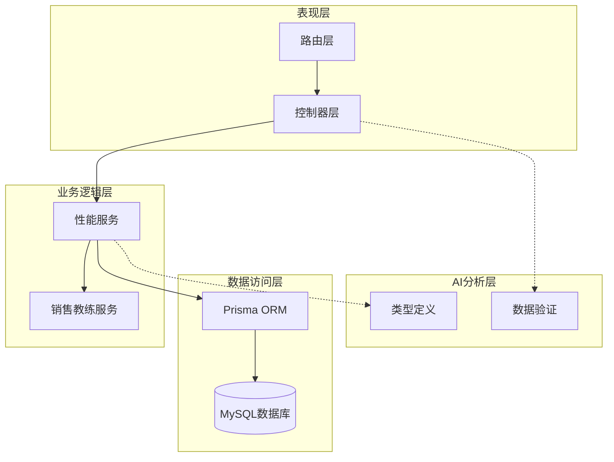
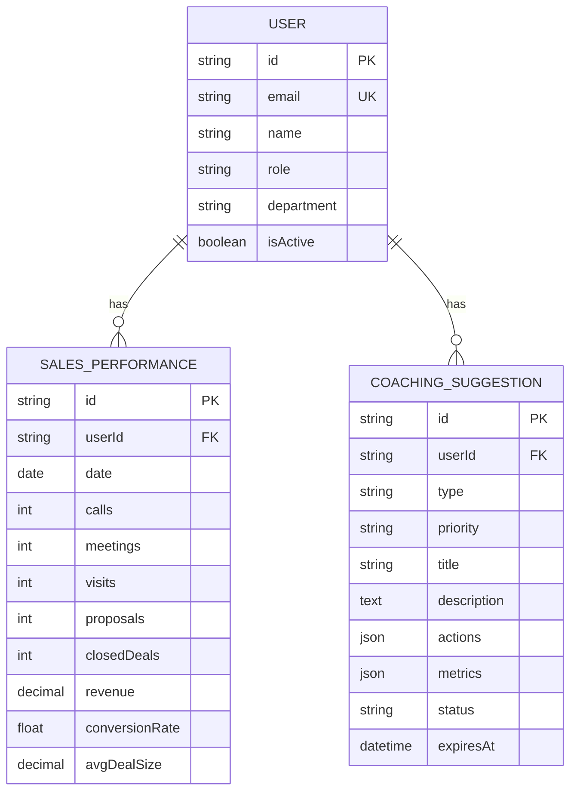
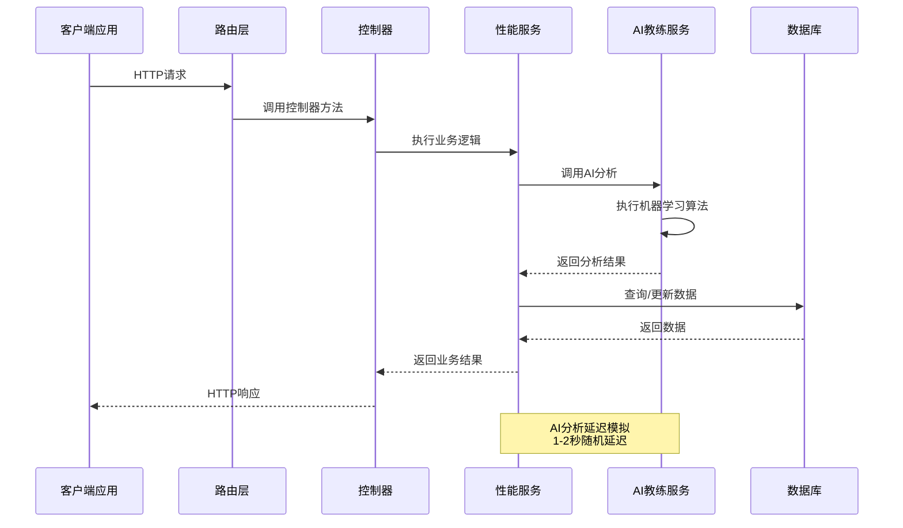
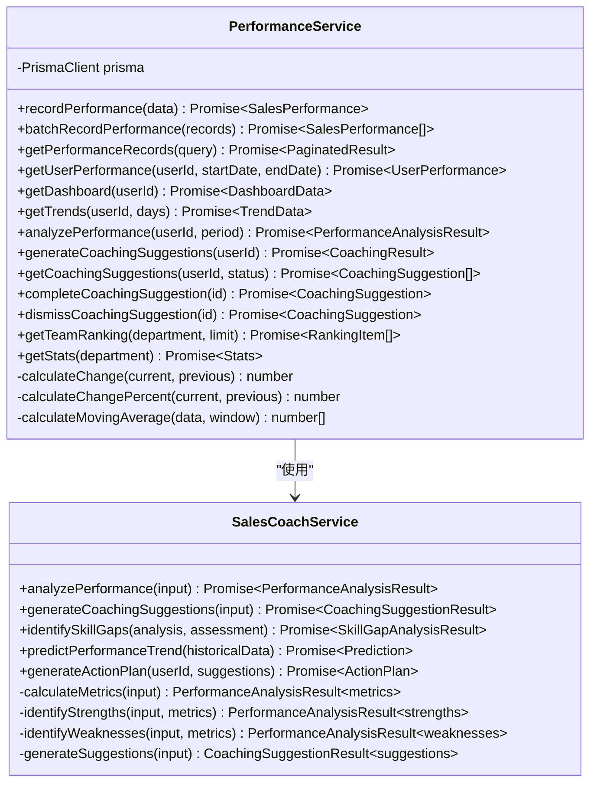
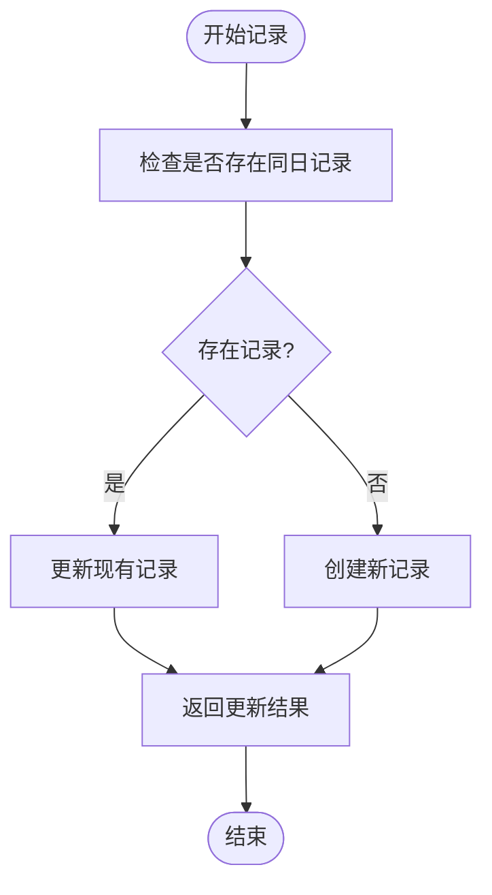
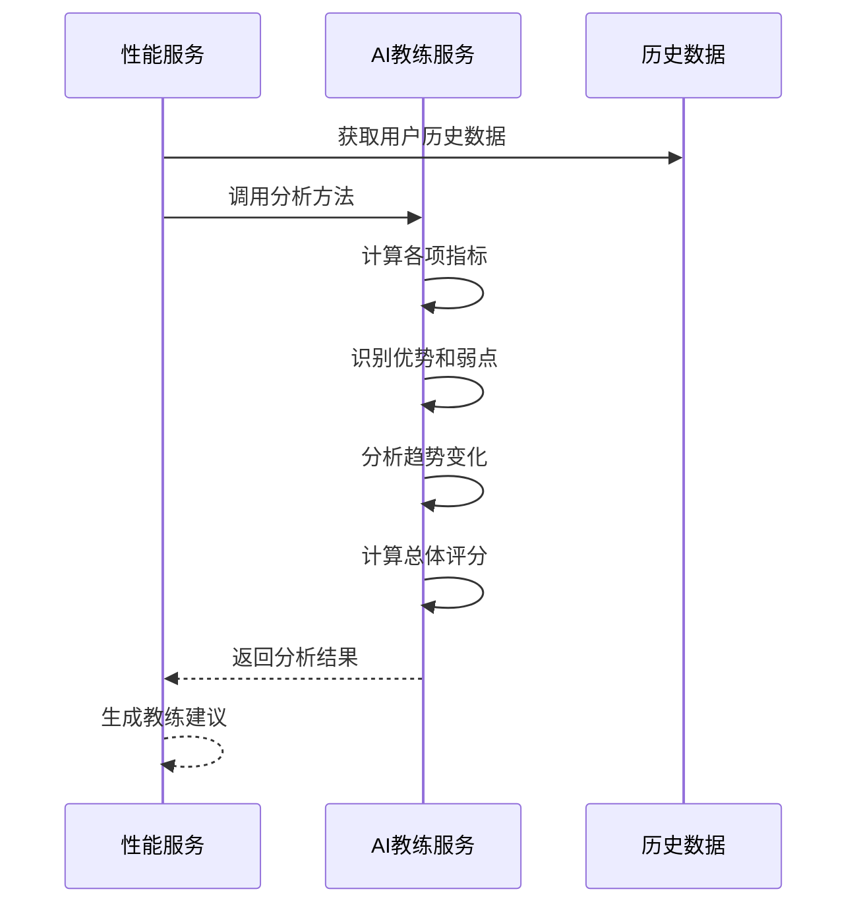
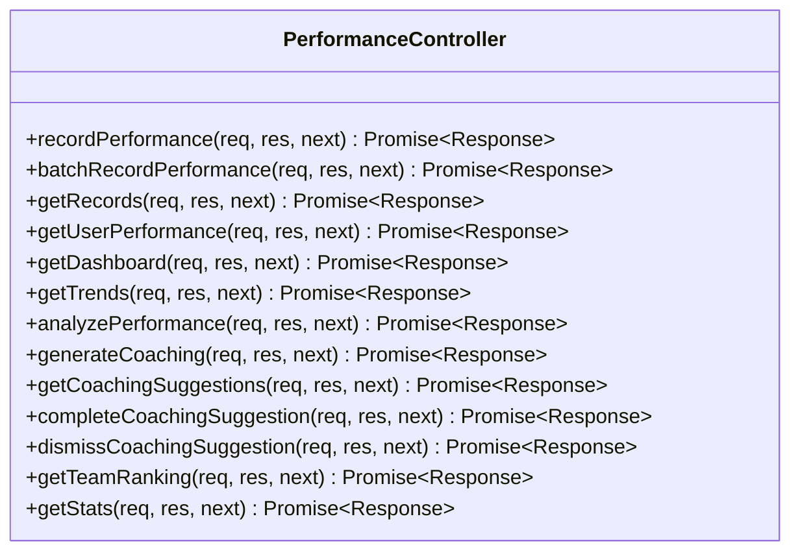
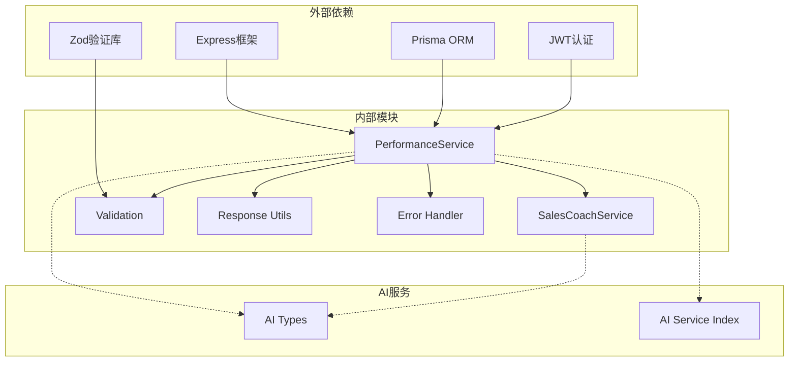

# 性能服务

<cite>
**本文档引用的文件**
- [performance.service.ts](file://crm-backend/src/services/performance.service.ts)
- [performance.controller.ts](file://crm-backend/src/controllers/performance.controller.ts)
- [performance.routes.ts](file://crm-backend/src/routes/performance.routes.ts)
- [performance.validator.ts](file://crm-backend/src/validators/performance.validator.ts)
- [salesCoach.ts](file://crm-backend/src/services/ai/salesCoach.ts)
- [ai/index.ts](file://crm-backend/src/services/ai/index.ts)
- [types.ts](file://crm-backend/src/services/ai/types.ts)
- [schema.prisma](file://crm-backend/prisma/schema.prisma)
- [performance.test.ts](file://crm-backend/tests/services/performance.test.ts)
</cite>

## 目录
1. [简介](#简介)
2. [项目结构](#项目结构)
3. [核心组件](#核心组件)
4. [架构概览](#架构概览)
5. [详细组件分析](#详细组件分析)
6. [依赖关系分析](#依赖关系分析)
7. [性能考量](#性能考量)
8. [故障排除指南](#故障排除指南)
9. [结论](#结论)

## 简介

性能服务是销售AI CRM系统的核心模块之一，负责管理销售绩效数据、提供AI驱动的绩效分析和教练建议功能。该服务集成了机器学习算法和人工智能技术，为销售人员提供个性化的绩效改进方案和实时的业务洞察。

系统通过收集销售活动数据（电话、会议、拜访、提案、成交等），结合AI分析引擎，生成详细的绩效报告和改进建议，帮助销售人员提升工作效率和业绩表现。

## 项目结构

性能服务采用典型的三层架构设计，包含控制器层、服务层和数据访问层：

**图表来源**
- [performance.routes.ts:1-387](file://crm-backend/src/routes/performance.routes.ts#L1-L387)
- [performance.controller.ts:1-228](file://crm-backend/src/controllers/performance.controller.ts#L1-L228)
- [performance.service.ts:1-577](file://crm-backend/src/services/performance.service.ts#L1-L577)

**章节来源**
- [performance.routes.ts:1-387](file://crm-backend/src/routes/performance.routes.ts#L1-L387)
- [performance.controller.ts:1-228](file://crm-backend/src/controllers/performance.controller.ts#L1-L228)
- [performance.service.ts:1-577](file://crm-backend/src/services/performance.service.ts#L1-L577)

## 核心组件

### 主要功能模块

性能服务包含以下核心功能模块：

1. **绩效数据管理** - 记录和查询销售活动数据
2. **AI绩效分析** - 基于机器学习的绩效评估
3. **教练建议系统** - 个性化改进建议生成
4. **团队排名统计** - 团队绩效对比分析
5. **趋势预测** - 基于历史数据的未来预测

### 数据模型

系统使用Prisma ORM管理数据模型，主要涉及以下实体：

**图表来源**
- [schema.prisma:718-761](file://crm-backend/prisma/schema.prisma#L718-L761)

**章节来源**
- [schema.prisma:718-761](file://crm-backend/prisma/schema.prisma#L718-L761)
- [performance.service.ts:14-48](file://crm-backend/src/services/performance.service.ts#L14-L48)

## 架构概览

性能服务采用微服务架构设计，通过清晰的分层和职责分离实现高内聚、低耦合：

**图表来源**
- [performance.controller.ts:16-227](file://crm-backend/src/controllers/performance.controller.ts#L16-L227)
- [performance.service.ts:65-424](file://crm-backend/src/services/performance.service.ts#L65-L424)
- [salesCoach.ts:55-99](file://crm-backend/src/services/ai/salesCoach.ts#L55-L99)

## 详细组件分析

### 性能服务类分析

性能服务类是整个系统的核心，提供了完整的销售绩效管理功能：

**图表来源**
- [performance.service.ts:53-577](file://crm-backend/src/services/performance.service.ts#L53-L577)
- [salesCoach.ts:51-780](file://crm-backend/src/services/ai/salesCoach.ts#L51-L780)

#### 绩效数据管理功能

性能服务提供了完整的数据管理功能：

**记录绩效数据流程**：

**图表来源**
- [performance.service.ts:65-104](file://crm-backend/src/services/performance.service.ts#L65-L104)

#### AI绩效分析功能

AI教练服务提供了智能化的绩效分析能力：

**分析流程**：

**图表来源**
- [salesCoach.ts:55-82](file://crm-backend/src/services/ai/salesCoach.ts#L55-L82)
- [performance.service.ts:283-384](file://crm-backend/src/services/performance.service.ts#L283-L384)

**章节来源**
- [performance.service.ts:65-424](file://crm-backend/src/services/performance.service.ts#L65-L424)
- [salesCoach.ts:55-780](file://crm-backend/src/services/ai/salesCoach.ts#L55-L780)

### 控制器层分析

控制器层负责HTTP请求的接收和响应处理：

**图表来源**
- [performance.controller.ts:9-227](file://crm-backend/src/controllers/performance.controller.ts#L9-L227)

**章节来源**
- [performance.controller.ts:9-227](file://crm-backend/src/controllers/performance.controller.ts#L9-L227)

### 路由层分析

路由层定义了完整的API接口规范：

| 接口 | 方法 | 描述 | 权限 |
|------|------|------|------|
| `/performance/records` | GET | 获取绩效记录列表 | 需要认证 |
| `/performance/record` | POST | 记录绩效数据 | 需要认证 |
| `/performance/record/batch` | POST | 批量记录绩效数据 | 需要认证 |
| `/performance/user/:userId` | GET | 获取用户绩效详情 | 需要认证 |
| `/performance/dashboard` | GET | 获取绩效仪表盘 | 需要认证 |
| `/performance/trends` | GET | 获取绩效趋势 | 需要认证 |
| `/performance/analysis` | GET | AI绩效分析 | 需要认证 |
| `/performance/coaching/generate` | POST | 生成AI教练建议 | 需要认证 |
| `/performance/coaching` | GET | 获取教练建议列表 | 需要认证 |
| `/performance/coaching/:id/complete` | POST | 完成教练建议 | 需要认证 |
| `/performance/coaching/:id/dismiss` | POST | 忽略教练建议 | 需要认证 |
| `/performance/ranking` | GET | 获取团队排名 | 需要认证 |
| `/performance/stats` | GET | 获取绩效统计概览 | 需要认证 |

**章节来源**
- [performance.routes.ts:25-387](file://crm-backend/src/routes/performance.routes.ts#L25-L387)

## 依赖关系分析

性能服务的依赖关系呈现清晰的层次结构：

**图表来源**
- [performance.service.ts:6-9](file://crm-backend/src/services/performance.service.ts#L6-L9)
- [performance.validator.ts:1-103](file://crm-backend/src/validators/performance.validator.ts#L1-L103)
- [ai/index.ts:1-57](file://crm-backend/src/services/ai/index.ts#L1-L57)

**章节来源**
- [performance.service.ts:6-9](file://crm-backend/src/services/performance.service.ts#L6-L9)
- [performance.validator.ts:1-103](file://crm-backend/src/validators/performance.validator.ts#L1-L103)
- [ai/index.ts:1-57](file://crm-backend/src/services/ai/index.ts#L1-L57)

## 性能考量

### 数据库性能优化

1. **索引策略**：为关键查询字段建立适当索引
   - `sales_performances(userId, date)` 复合索引
   - `coaching_suggestions(userId, status)` 复合索引
   - `users(department, isActive)` 复合索引

2. **查询优化**：使用分页和限制返回数量
   - 默认每页30条记录
   - 限制团队排名显示数量

3. **连接池管理**：合理配置数据库连接数

### AI分析性能

1. **异步处理**：AI分析操作使用异步非阻塞方式
2. **延迟模拟**：随机延迟1-2秒，避免过度频繁调用
3. **缓存策略**：对常用查询结果进行缓存

### 前端性能优化

1. **数据分页**：避免一次性加载大量数据
2. **增量更新**：只更新变化的数据
3. **防抖处理**：对频繁操作进行防抖

## 故障排除指南

### 常见错误及解决方案

**认证错误 (401)**
- 症状：用户未认证
- 解决方案：确保请求头包含有效的Bearer Token

**参数验证错误 (400)**
- 症状：输入参数格式不正确
- 解决方案：检查请求体格式，确保必填字段完整

**数据库连接错误**
- 症状：无法连接到数据库
- 解决方案：检查DATABASE_URL环境变量配置

**AI分析超时**
- 症状：AI分析响应缓慢
- 解决方案：检查网络连接，适当增加超时时间

### 调试建议

1. **启用详细日志**：在开发环境中启用详细日志输出
2. **监控API响应时间**：使用性能监控工具跟踪API性能
3. **数据库查询分析**：使用EXPLAIN分析慢查询

**章节来源**
- [performance.controller.ts:82-84](file://crm-backend/src/controllers/performance.controller.ts#L82-L84)
- [performance.validator.ts:6-15](file://crm-backend/src/validators/performance.validator.ts#L6-L15)

## 结论

性能服务作为销售AI CRM系统的核心模块，成功实现了以下目标：

1. **完整的绩效管理**：从数据收集到分析报告的全流程覆盖
2. **智能化AI分析**：基于机器学习的个性化绩效评估
3. **实时教练建议**：动态生成针对性的改进建议
4. **团队协作支持**：提供团队排名和对比分析功能

系统采用现代化的技术栈和架构设计，具有良好的扩展性和维护性。通过合理的性能优化和错误处理机制，能够满足生产环境的高可用性要求。

未来可以考虑的功能增强包括：
- 更丰富的AI分析算法
- 实时数据流处理
- 更精细的权限控制
- 多维度的报表生成功能