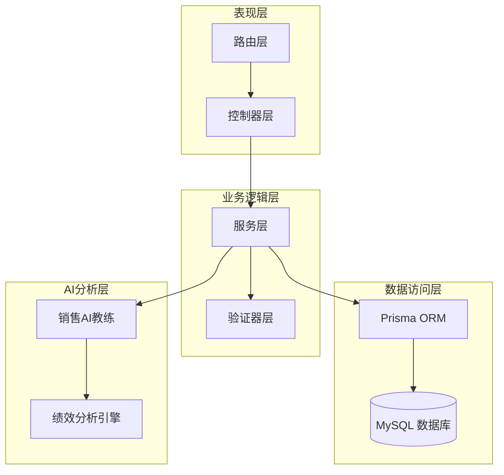
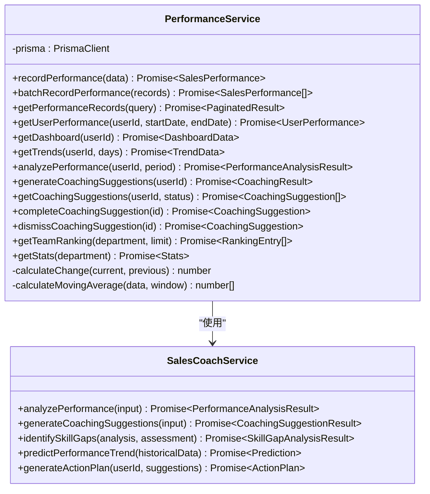
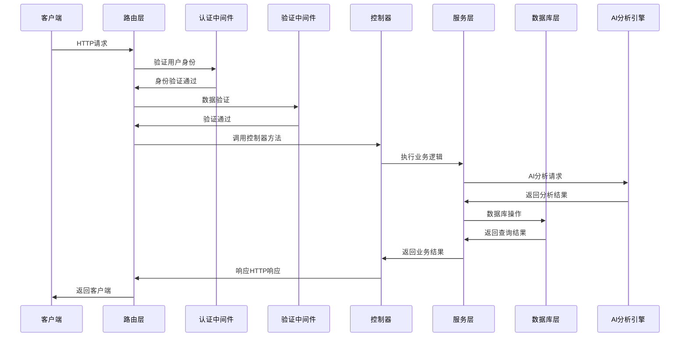
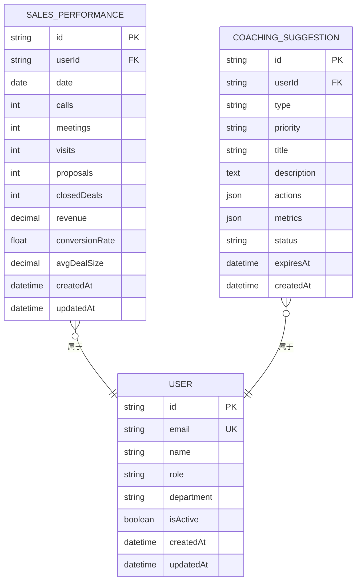
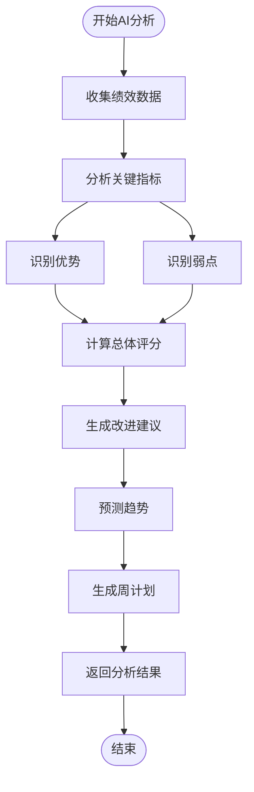
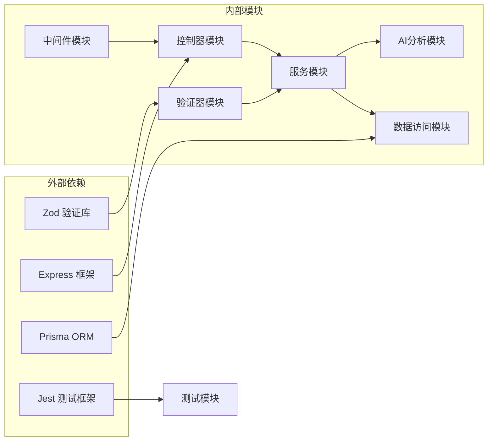
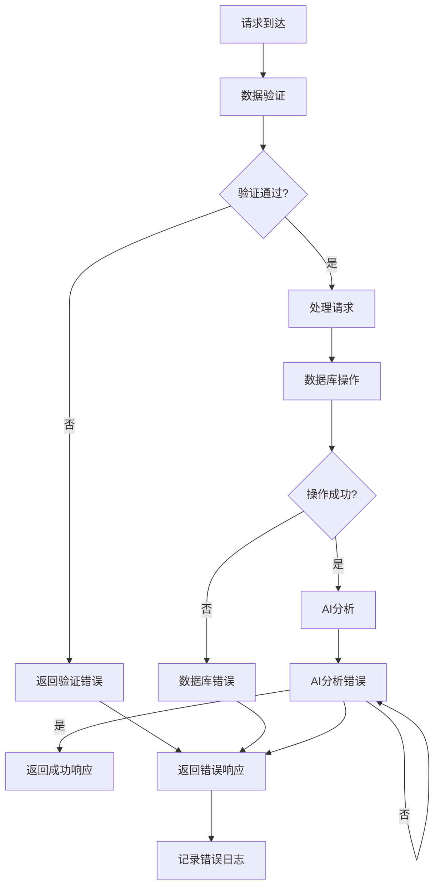

# 性能验证器

<cite>
**本文档引用的文件**
- [performance.validator.ts](file://crm-backend/src/validators/performance.validator.ts)
- [performance.service.ts](file://crm-backend/src/services/performance.service.ts)
- [performance.controller.ts](file://crm-backend/src/controllers/performance.controller.ts)
- [performance.routes.ts](file://crm-backend/src/routes/performance.routes.ts)
- [validate.ts](file://crm-backend/src/middlewares/validate.ts)
- [prisma.ts](file://crm-backend/src/repositories/prisma.ts)
- [schema.prisma](file://crm-backend/prisma/schema.prisma)
- [performance.test.ts](file://crm-backend/tests/services/performance.test.ts)
- [salesCoach.ts](file://crm-backend/src/services/ai/salesCoach.ts)
</cite>

## 目录
1. [简介](#简介)
2. [项目结构](#项目结构)
3. [核心组件](#核心组件)
4. [架构概览](#架构概览)
5. [详细组件分析](#详细组件分析)
6. [依赖关系分析](#依赖关系分析)
7. [性能考量](#性能考量)
8. [故障排除指南](#故障排除指南)
9. [结论](#结论)

## 简介

性能验证器是销售AI CRM系统中的核心组件，负责管理和验证销售绩效数据的完整性、准确性和一致性。该系统通过AI驱动的分析引擎提供实时的销售绩效监控、趋势预测和个性化教练建议，帮助销售团队提升工作效率和业绩表现。

系统采用现代化的微服务架构，结合Prisma ORM进行数据库操作，使用Zod进行数据验证，并集成了AI教练服务来提供智能化的绩效分析和改进建议。

## 项目结构

销售AI CRM系统的性能验证器组件遵循清晰的分层架构设计：

**图表来源**
- [performance.routes.ts:1-387](file://crm-backend/src/routes/performance.routes.ts#L1-L387)
- [performance.controller.ts:1-228](file://crm-backend/src/controllers/performance.controller.ts#L1-L228)
- [performance.service.ts:1-577](file://crm-backend/src/services/performance.service.ts#L1-L577)

**章节来源**
- [performance.validator.ts:1-103](file://crm-backend/src/validators/performance.validator.ts#L1-L103)
- [performance.service.ts:1-577](file://crm-backend/src/services/performance.service.ts#L1-L577)
- [performance.controller.ts:1-228](file://crm-backend/src/controllers/performance.controller.ts#L1-L228)

## 核心组件

### 数据验证器

性能验证器使用Zod库实现强类型的数据验证，确保所有输入数据的完整性和正确性：

| 验证器类型 | 功能描述 | 字段约束 |
|-----------|----------|----------|
| createPerformanceSchema | 绩效记录创建验证 | 用户ID、日期、通话数、会议数、拜访数、提案数、成交数、收入 |
| performanceQuerySchema | 绩效查询验证 | 用户ID、开始日期、结束日期、分页参数 |
| trendsQuerySchema | 趋势查询验证 | 查询天数参数 |
| coachingQuerySchema | 教练建议查询验证 | 用户ID、状态、类型过滤 |
| rankingQuerySchema | 排名查询验证 | 部门、限制数量 |

### 服务层架构

性能服务层采用单一职责原则，将不同的业务功能分离到专门的方法中：

**图表来源**
- [performance.service.ts:53-577](file://crm-backend/src/services/performance.service.ts#L53-L577)
- [salesCoach.ts:51-780](file://crm-backend/src/services/ai/salesCoach.ts#L51-L780)

**章节来源**
- [performance.validator.ts:1-103](file://crm-backend/src/validators/performance.validator.ts#L1-L103)
- [performance.service.ts:53-577](file://crm-backend/src/services/performance.service.ts#L53-L577)

## 架构概览

系统采用RESTful API架构，结合中间件模式实现请求处理流程：

**图表来源**
- [performance.routes.ts:1-387](file://crm-backend/src/routes/performance.routes.ts#L1-L387)
- [performance.controller.ts:1-228](file://crm-backend/src/controllers/performance.controller.ts#L1-L228)
- [validate.ts:1-77](file://crm-backend/src/middlewares/validate.ts#L1-L77)

## 详细组件分析

### 数据模型设计

系统使用Prisma定义了完整的数据模型，确保数据的一致性和完整性：

**图表来源**
- [schema.prisma:718-761](file://crm-backend/prisma/schema.prisma#L718-L761)

### API端点设计

系统提供了完整的RESTful API端点，覆盖所有性能管理功能：

| 端点 | 方法 | 功能 | 认证要求 |
|------|------|------|----------|
| `/performance/records` | GET | 获取绩效记录列表 | 是 |
| `/performance/record` | POST | 记录绩效数据 | 是 |
| `/performance/record/batch` | POST | 批量记录绩效数据 | 是 |
| `/performance/user/:userId` | GET | 获取用户绩效详情 | 是 |
| `/performance/dashboard` | GET | 获取绩效仪表盘 | 是 |
| `/performance/trends` | GET | 获取绩效趋势 | 是 |
| `/performance/analysis` | GET | AI绩效分析 | 是 |
| `/performance/coaching/generate` | POST | 生成AI教练建议 | 是 |
| `/performance/coaching` | GET | 获取教练建议列表 | 是 |
| `/performance/coaching/:id/complete` | POST | 完成教练建议 | 是 |
| `/performance/coaching/:id/dismiss` | POST | 忽略教练建议 | 是 |
| `/performance/ranking` | GET | 获取团队排名 | 是 |
| `/performance/stats` | GET | 获取绩效统计概览 | 是 |

**章节来源**
- [performance.routes.ts:25-387](file://crm-backend/src/routes/performance.routes.ts#L25-L387)

### AI教练分析引擎

系统集成了智能的AI教练分析引擎，提供多维度的绩效分析：

**图表来源**
- [salesCoach.ts:55-82](file://crm-backend/src/services/ai/salesCoach.ts#L55-L82)

**章节来源**
- [salesCoach.ts:51-780](file://crm-backend/src/services/ai/salesCoach.ts#L51-L780)

## 依赖关系分析

系统采用了模块化的依赖管理策略，确保各组件之间的松耦合：

**图表来源**
- [performance.validator.ts:1-103](file://crm-backend/src/validators/performance.validator.ts#L1-L103)
- [performance.service.ts:1-577](file://crm-backend/src/services/performance.service.ts#L1-L577)

**章节来源**
- [prisma.ts:1-9](file://crm-backend/src/repositories/prisma.ts#L1-L9)
- [validate.ts:1-77](file://crm-backend/src/middlewares/validate.ts#L1-L77)

## 性能考量

### 数据库优化策略

系统采用了多种数据库优化策略来确保高性能：

1. **索引优化**：为常用查询字段建立索引
   - `sales_performances(userId, date)` 复合索引
   - `coaching_suggestions(userId, status)` 复合索引
   - `users(email)` 唯一索引

2. **查询优化**：
   - 使用 `Promise.all()` 并行执行查询
   - 实现分页查询避免大数据集加载
   - 使用 `select` 限定查询字段

3. **缓存策略**：
   - AI分析结果短期缓存
   - 统计数据定期更新
   - 用户会话状态缓存

### 性能监控指标

系统监控以下关键性能指标：

| 指标类型 | 监控内容 | 阈值设置 |
|----------|----------|----------|
| 响应时间 | API请求响应时间 | < 500ms |
| 吞吐量 | 并发请求数 | > 100 RPS |
| 数据库 | 查询执行时间 | < 100ms |
| AI分析 | 分析完成时间 | < 2s |
| 内存使用 | 应用内存占用 | < 512MB |
| CPU使用 | 系统CPU负载 | < 80% |

### 错误处理机制

系统实现了完善的错误处理机制：

**图表来源**
- [performance.controller.ts:1-228](file://crm-backend/src/controllers/performance.controller.ts#L1-L228)
- [validate.ts:1-77](file://crm-backend/src/middlewares/validate.ts#L1-L77)

**章节来源**
- [performance.controller.ts:1-228](file://crm-backend/src/controllers/performance.controller.ts#L1-L228)
- [validate.ts:1-77](file://crm-backend/src/middlewares/validate.ts#L1-L77)

## 故障排除指南

### 常见问题及解决方案

| 问题类型 | 症状描述 | 可能原因 | 解决方案 |
|----------|----------|----------|----------|
| 验证错误 | 返回400错误，包含验证详情 | 输入数据格式不正确 | 检查Zod验证规则，修正数据格式 |
| 认证失败 | 返回401未授权 | JWT令牌无效或过期 | 重新登录获取新令牌 |
| 数据库连接 | 连接超时或拒绝 | 数据库服务不可用 | 检查数据库连接配置和网络连通性 |
| AI分析失败 | 分析结果为空或错误 | AI服务异常 | 检查AI服务状态，重试请求 |
| 性能问题 | 响应时间过长 | 查询复杂度高 | 优化查询语句，添加必要索引 |

### 调试工具和技巧

1. **日志分析**：
   - 开发环境启用详细日志
   - 生产环境使用结构化日志
   - 关键操作添加审计日志

2. **性能分析**：
   - 使用性能监控工具
   - 分析慢查询日志
   - 监控数据库连接池使用情况

3. **API测试**：
   - 使用Postman或curl测试API端点
   - 编写自动化测试用例
   - 集成测试环境验证功能

**章节来源**
- [performance.test.ts:1-287](file://crm-backend/tests/services/performance.test.ts#L1-L287)

## 结论

性能验证器作为销售AI CRM系统的核心组件，通过模块化的设计、强大的数据验证机制和智能化的AI分析功能，为销售团队提供了全面的绩效管理解决方案。

系统的主要优势包括：

1. **模块化架构**：清晰的分层设计便于维护和扩展
2. **强类型验证**：Zod确保数据的完整性和准确性
3. **AI智能分析**：提供个性化的绩效改进建议
4. **高性能设计**：优化的数据库查询和缓存策略
5. **完善的错误处理**：健壮的异常处理和恢复机制

通过持续的性能监控和优化，该系统能够为销售团队提供可靠、高效的绩效管理支持，帮助提升整体销售业绩和客户满意度。