# 售前仪表板

<cite>
**本文档引用的文件**
- [presales.controller.ts](file://crm-backend/src/controllers/presales.controller.ts)
- [presales.service.ts](file://crm-backend/src/services/presales.service.ts)
- [presales.routes.ts](file://crm-backend/src/routes/presales.routes.ts)
- [presales.validator.ts](file://crm-backend/src/validators/presales.validator.ts)
- [presalesActivity.controller.ts](file://crm-backend/src/controllers/presalesActivity.controller.ts)
- [presalesActivity.service.ts](file://crm-backend/src/services/presalesActivity.service.ts)
- [presalesActivity.routes.ts](file://crm-backend/src/routes/presalesActivity.routes.ts)
- [proposal.controller.ts](file://crm-backend/src/controllers/proposal.controller.ts)
- [proposal.service.ts](file://crm-backend/src/services/proposal.service.ts)
- [proposals.routes.ts](file://crm-backend/src/routes/proposals.routes.ts)
- [proposal.validator.ts](file://crm-backend/src/validators/proposal.validator.ts)
- [proposalAI.ts](file://crm-backend/src/services/ai/proposalAI.ts)
- [ai/index.ts](file://crm-backend/src/services/ai/index.ts)
- [index.tsx](file://crm-frontend/src/pages/Dashboard/index.tsx)
- [index.tsx](file://crm-frontend/src/pages/PreSales/index.tsx)
- [index.tsx](file://crm-frontend/src/pages/PreSales/Activities/index.tsx)
- [ActivityForm.tsx](file://crm-frontend/src/pages/PreSales/Activities/ActivityForm.tsx)
- [SignInPage.tsx](file://crm-frontend/src/pages/PreSales/SignIn/SignInPage.tsx)
- [Proposals/index.tsx](file://crm-frontend/src/pages/Proposals/index.tsx)
- [ProposalDetail/index.tsx](file://crm-frontend/src/pages/Proposals/ProposalDetail/index.tsx)
- [RequirementAnalysis.tsx](file://crm-frontend/src/pages/Proposals/ProposalDetail/components/RequirementAnalysis.tsx)
- [InternalReview.tsx](file://crm-frontend/src/pages/Proposals/ProposalDetail/components/InternalReview.tsx)
- [CustomerInsightPanel.tsx](file://crm-frontend/src/components/AI/CustomerInsightPanel.tsx)
- [Header.tsx](file://crm-frontend/src/components/layout/Header.tsx)
- [Sidebar.tsx](file://crm-frontend/src/components/layout/Sidebar.tsx)
- [funnelStore.ts](file://crm-frontend/src/stores/funnelStore.ts)
- [index.ts](file://crm-backend/src/types/index.ts)
- [index.ts](file://crm-frontend/src/types/index.ts)
</cite>

## 更新摘要
**所做更改**
- 新增售前资源管理系统，包括资源状态管理、技能匹配、工作负载监控等功能
- 更新售前活动管理界面，采用现代化的渐变设计和增强的交互体验
- 新增签到系统页面，支持二维码签到、问题收集和活动管理
- 更新统计卡片设计，采用全新的渐变背景和动画效果
- 增强资源概览卡片，提供更直观的资源状态可视化
- 新增快速操作模块，支持一键创建活动、签到入口等快捷功能

## 目录
1. [项目概述](#项目概述)
2. [系统架构](#系统架构)
3. [核心组件分析](#核心组件分析)
4. [售前资源管理](#售前资源管理)
5. [售前活动管理](#售前活动管理)
6. [签到系统](#签到系统)
7. [统计面板](#统计面板)
8. [快速操作](#快速操作)
9. [数据流分析](#数据流分析)
10. [前端组件设计](#前端组件设计)
11. [AI智能分析集成](#ai智能分析集成)
12. [视觉设计与现代化改造](#视觉设计与现代化改造)
13. [性能优化策略](#性能优化策略)
14. [故障排除指南](#故障排除指南)
15. [总结](#总结)

## 项目概述

销售AI CRM系统是一个集成了人工智能技术的客户关系管理系统，专注于销售流程的智能化管理。系统包含售前仪表板功能，为企业提供全面的售前活动监控和分析能力，现已集成了完整的资源管理系统和签到功能。

该系统采用前后端分离架构，后端基于Node.js + Express + Prisma ORM，前端使用React + TypeScript构建，实现了完整的售前生命周期管理，包括资源管理、活动管理、签到系统、AI智能分析、提案系统管理等功能模块。

## 系统架构

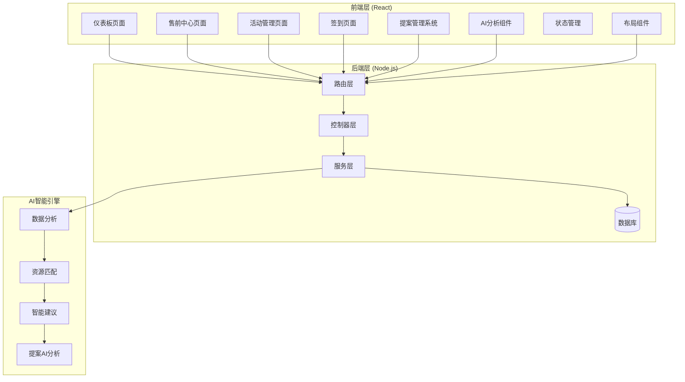

**图表来源**
- [presales.controller.ts:1-248](file://crm-backend/src/controllers/presales.controller.ts#L1-L248)
- [presalesActivity.controller.ts:1-338](file://crm-backend/src/controllers/presalesActivity.controller.ts#L1-L338)
- [proposal.controller.ts:1-636](file://crm-backend/src/controllers/proposal.controller.ts#L1-L636)

**章节来源**
- [presales.controller.ts:1-248](file://crm-backend/src/controllers/presales.controller.ts#L1-L248)
- [presalesActivity.controller.ts:1-338](file://crm-backend/src/controllers/presalesActivity.controller.ts#L1-L338)
- [proposal.controller.ts:1-636](file://crm-backend/src/controllers/proposal.controller.ts#L1-L636)

## 核心组件分析

### 后端架构组件

系统采用经典的三层架构模式，实现了清晰的职责分离，并新增了资源管理模块：

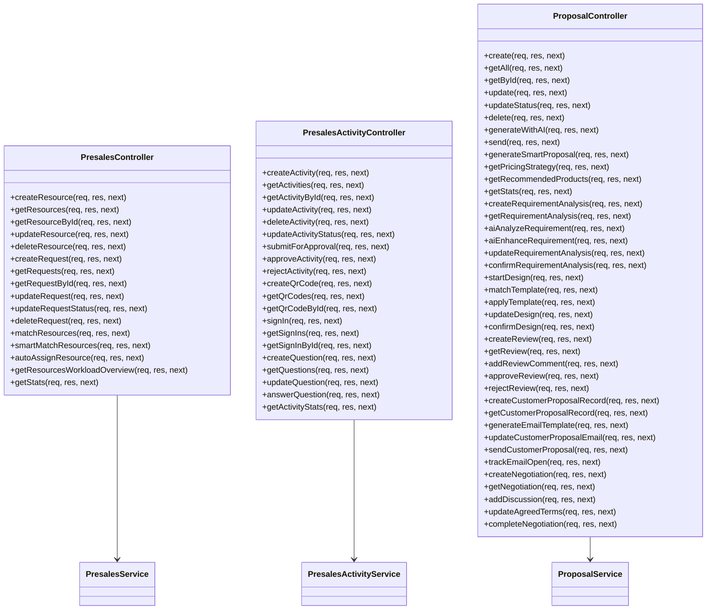

**图表来源**
- [presales.controller.ts:9-248](file://crm-backend/src/controllers/presales.controller.ts#L9-L248)
- [presalesActivity.controller.ts:9-338](file://crm-backend/src/controllers/presalesActivity.controller.ts#L9-L338)
- [proposal.controller.ts:9-636](file://crm-backend/src/controllers/proposal.controller.ts#L9-L636)

### 数据模型设计

系统使用Prisma ORM进行数据库操作，支持复杂的数据关联和查询，新增了资源管理相关数据模型：

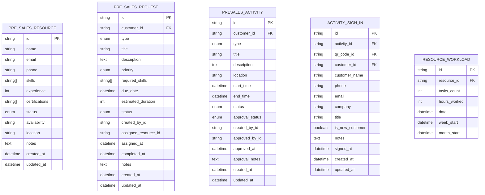

**图表来源**
- [presales.service.ts:17-43](file://crm-backend/src/services/presales.service.ts#L17-L43)
- [presalesActivity.service.ts:32-54](file://crm-backend/src/services/presalesActivity.service.ts#L32-L54)

**章节来源**
- [presales.service.ts:17-43](file://crm-backend/src/services/presales.service.ts#L17-L43)
- [presalesActivity.service.ts:32-54](file://crm-backend/src/services/presalesActivity.service.ts#L32-L54)

## 售前资源管理

### 资源状态管理

系统提供完整的售前资源管理功能，支持资源的创建、更新、删除和状态监控：

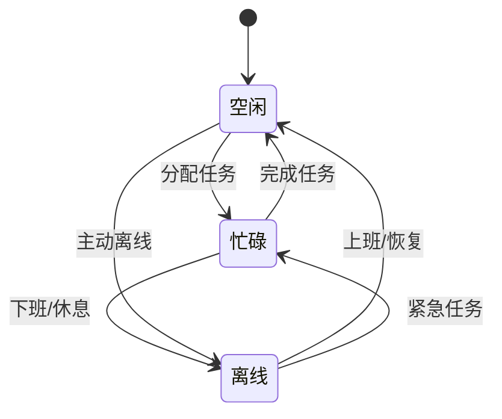

**图表来源**
- [presales.service.ts:440-503](file://crm-backend/src/services/presales.service.ts#L440-L503)

### 资源技能匹配

系统提供AI驱动的资源智能匹配功能，基于多维度评分算法实现精准匹配：

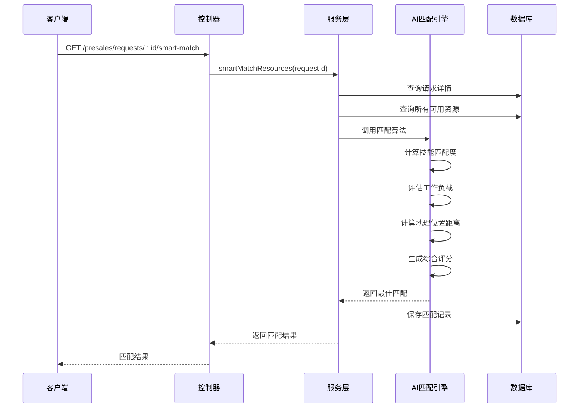

**图表来源**
- [presales.controller.ts:197-205](file://crm-backend/src/controllers/presales.controller.ts#L197-L205)
- [presales.service.ts:440-503](file://crm-backend/src/services/presales.service.ts#L440-L503)

### 资源工作负载监控

系统提供资源工作负载监控功能，帮助管理者合理分配任务：

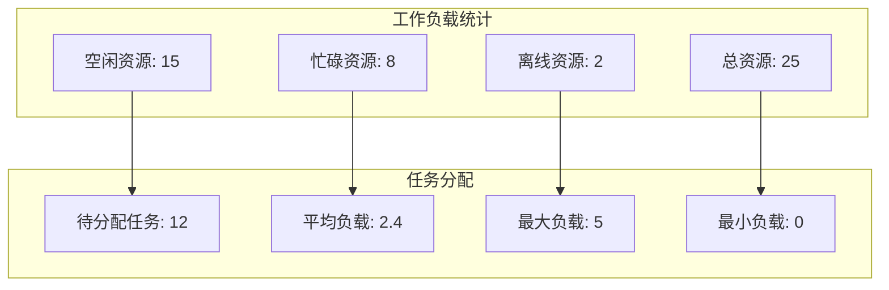

**图表来源**
- [presales.service.ts:440-503](file://crm-backend/src/services/presales.service.ts#L440-L503)

**章节来源**
- [presales.controller.ts:16-83](file://crm-backend/src/controllers/presales.controller.ts#L16-L83)
- [presales.service.ts:19-121](file://crm-backend/src/services/presales.service.ts#L19-L121)
- [presales.validator.ts:1-136](file://crm-backend/src/validators/presales.validator.ts#L1-L136)

## 售前活动管理

### 活动生命周期管理

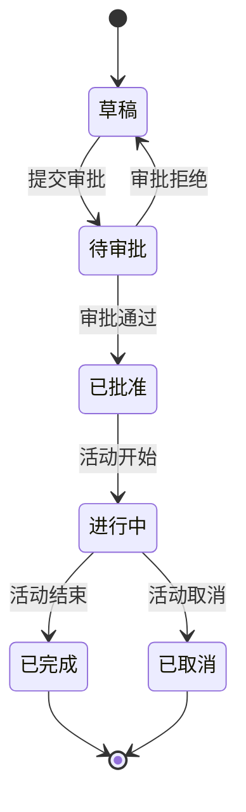

**图表来源**
- [presalesActivity.service.ts:221-280](file://crm-backend/src/services/presalesActivity.service.ts#L221-L280)

### 活动类型配置增强

系统支持五种不同的活动类型，每种类型都有独特的视觉标识和功能特性：

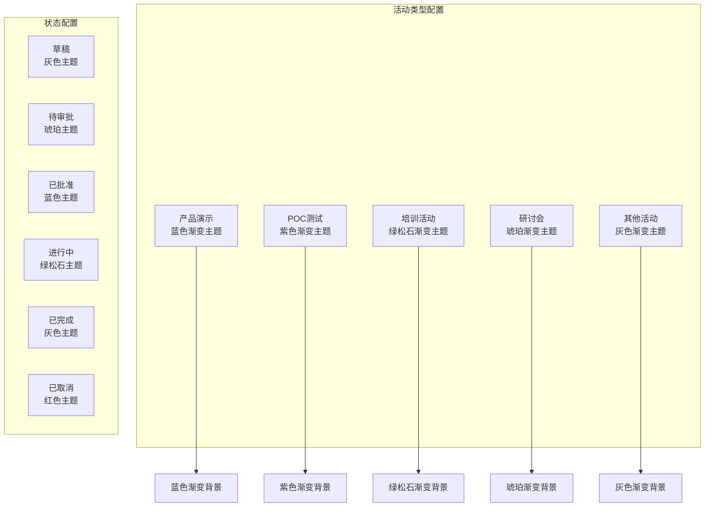

**图表来源**
- [index.tsx:32-48](file://crm-frontend/src/pages/PreSales/Activities/index.tsx#L32-L48)

### 活动卡片设计

系统采用现代化的卡片设计，提供丰富的视觉层次和交互体验：

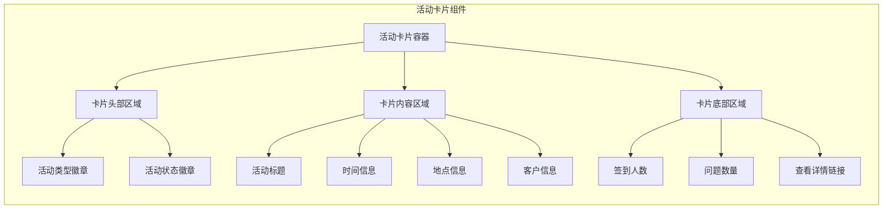

**图表来源**
- [index.tsx:51-121](file://crm-frontend/src/pages/PreSales/Activities/index.tsx#L51-L121)

**章节来源**
- [index.tsx:1-283](file://crm-frontend/src/pages/PreSales/Activities/index.tsx#L1-L283)
- [ActivityForm.tsx:1-242](file://crm-frontend/src/pages/PreSales/Activities/ActivityForm.tsx#L1-L242)

## 签到系统

### 签到流程设计

系统提供完整的签到流程，支持二维码验证、信息收集和问题反馈：

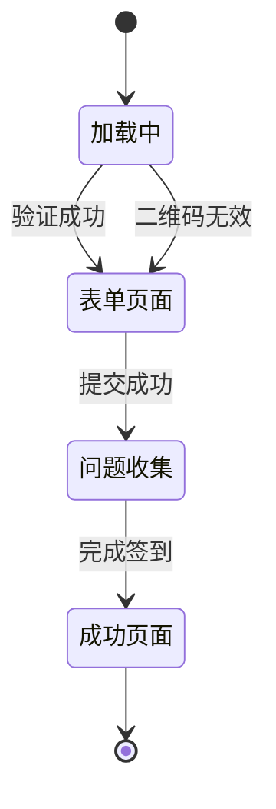

**图表来源**
- [SignInPage.tsx:34-167](file://crm-frontend/src/pages/PreSales/SignIn/SignInPage.tsx#L34-L167)

### 签到表单设计

系统提供简洁直观的签到表单，支持必填项验证和错误提示：

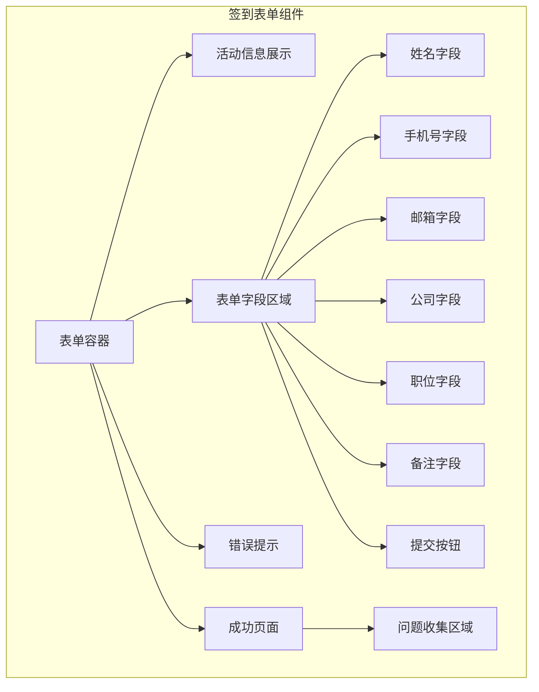

**图表来源**
- [SignInPage.tsx:212-305](file://crm-frontend/src/pages/PreSales/SignIn/SignInPage.tsx#L212-L305)

**章节来源**
- [SignInPage.tsx:1-366](file://crm-frontend/src/pages/PreSales/SignIn/SignInPage.tsx#L1-L366)

## 统计面板

### 业务统计卡片

系统提供四个核心业务统计卡片，采用现代化的渐变设计：

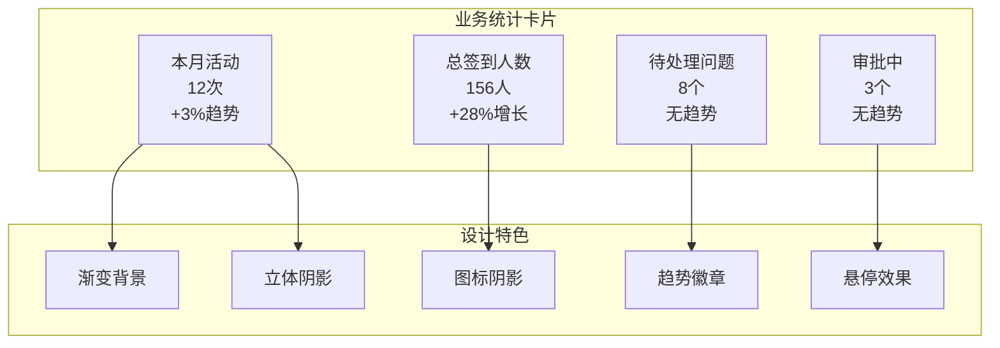

**图表来源**
- [index.tsx:111-180](file://crm-frontend/src/pages/PreSales/index.tsx#L111-L180)

### 今日活动卡片

系统提供今日活动卡片，突出显示正在进行的活动：

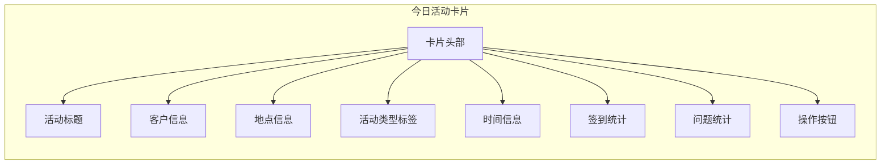

**图表来源**
- [index.tsx:183-260](file://crm-frontend/src/pages/PreSales/index.tsx#L183-L260)

### 资源概览卡片

系统提供增强版资源概览卡片，展示售前资源的详细信息：

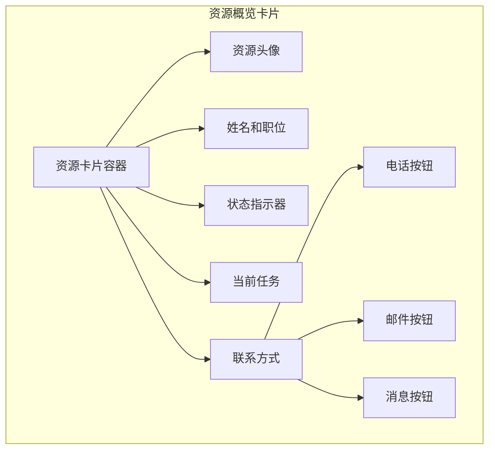

**图表来源**
- [index.tsx:410-520](file://crm-frontend/src/pages/PreSales/index.tsx#L410-L520)

**章节来源**
- [index.tsx:111-180](file://crm-frontend/src/pages/PreSales/index.tsx#L111-L180)
- [index.tsx:183-260](file://crm-frontend/src/pages/PreSales/index.tsx#L183-L260)
- [index.tsx:410-520](file://crm-frontend/src/pages/PreSales/index.tsx#L410-L520)

## 快速操作

### 快速操作模块

系统提供四个快速操作按钮，支持一键访问常用功能：

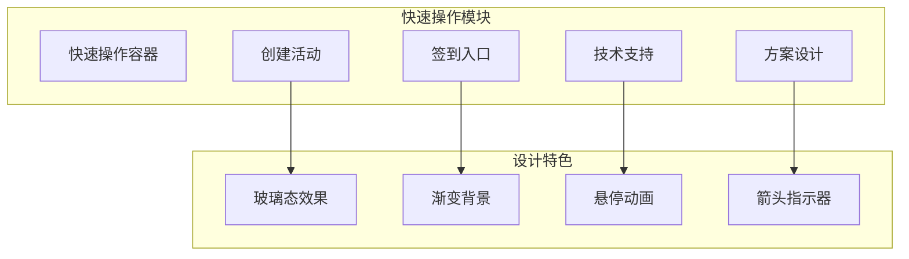

**图表来源**
- [index.tsx:522-555](file://crm-frontend/src/pages/PreSales/index.tsx#L522-L555)

**章节来源**
- [index.tsx:522-555](file://crm-frontend/src/pages/PreSales/index.tsx#L522-L555)

## 数据流分析

### 前端数据流

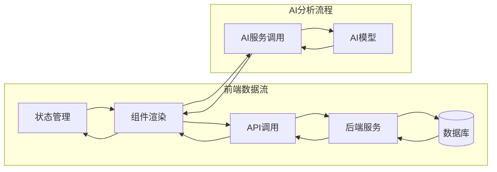

**图表来源**
- [index.tsx:343-357](file://crm-frontend/src/pages/Dashboard/index.tsx#L343-L357)
- [CustomerInsightPanel.tsx:86-110](file://crm-frontend/src/components/AI/CustomerInsightPanel.tsx#L86-L110)

### 后端数据流

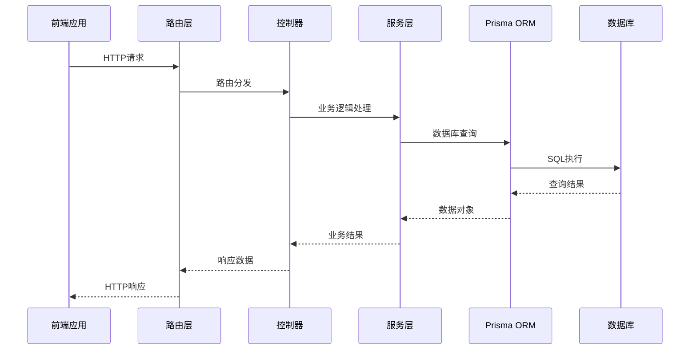

**图表来源**
- [presales.routes.ts:1-200](file://crm-backend/src/routes/presales.routes.ts#L1-L200)
- [presalesActivity.routes.ts:1-338](file://crm-backend/src/routes/presalesActivity.routes.ts#L1-L338)
- [proposals.routes.ts:1-653](file://crm-backend/src/routes/proposals.routes.ts#L1-L653)

**章节来源**
- [presales.routes.ts:1-200](file://crm-backend/src/routes/presales.routes.ts#L1-L200)
- [presalesActivity.routes.ts:1-338](file://crm-backend/src/routes/presalesActivity.routes.ts#L1-L338)
- [proposals.routes.ts:1-653](file://crm-backend/src/routes/proposals.routes.ts#L1-L653)

## 前端组件设计

### 售前中心布局

系统采用响应式设计，支持多种屏幕尺寸：

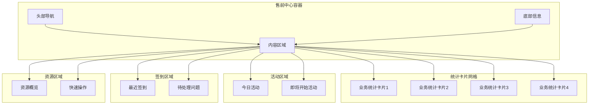

**图表来源**
- [index.tsx:557-613](file://crm-frontend/src/pages/PreSales/index.tsx#L557-L613)

### 活动管理界面

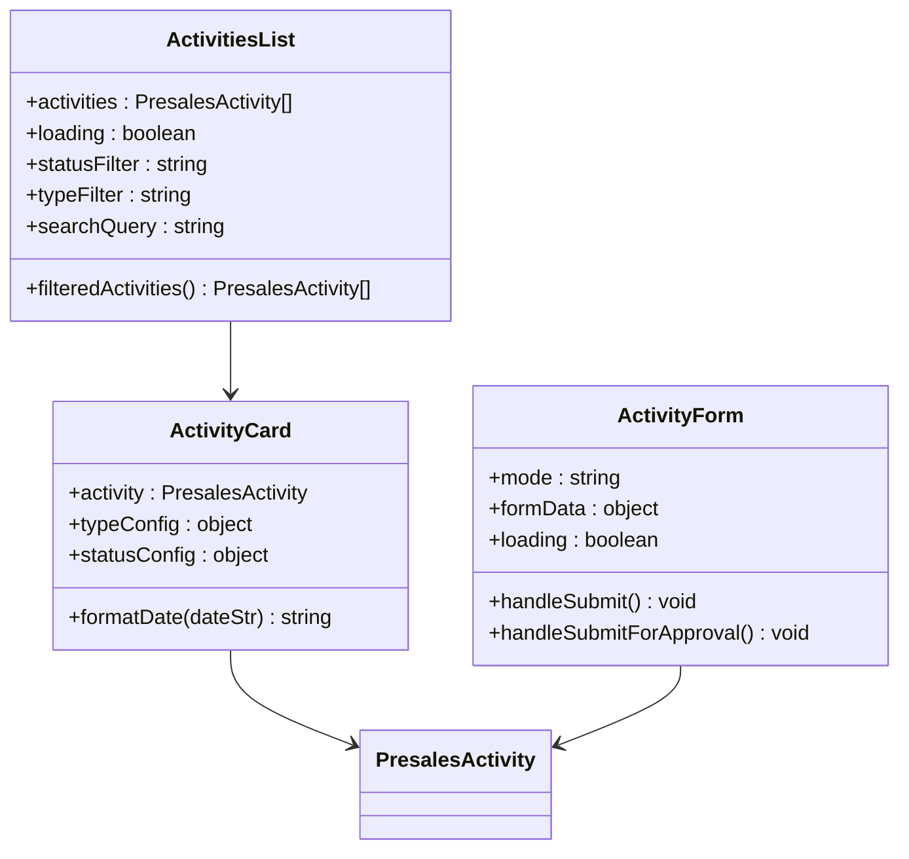

**图表来源**
- [index.tsx:1-283](file://crm-frontend/src/pages/PreSales/Activities/index.tsx#L1-L283)
- [ActivityForm.tsx:1-242](file://crm-frontend/src/pages/PreSales/Activities/ActivityForm.tsx#L1-L242)

### 签到页面设计

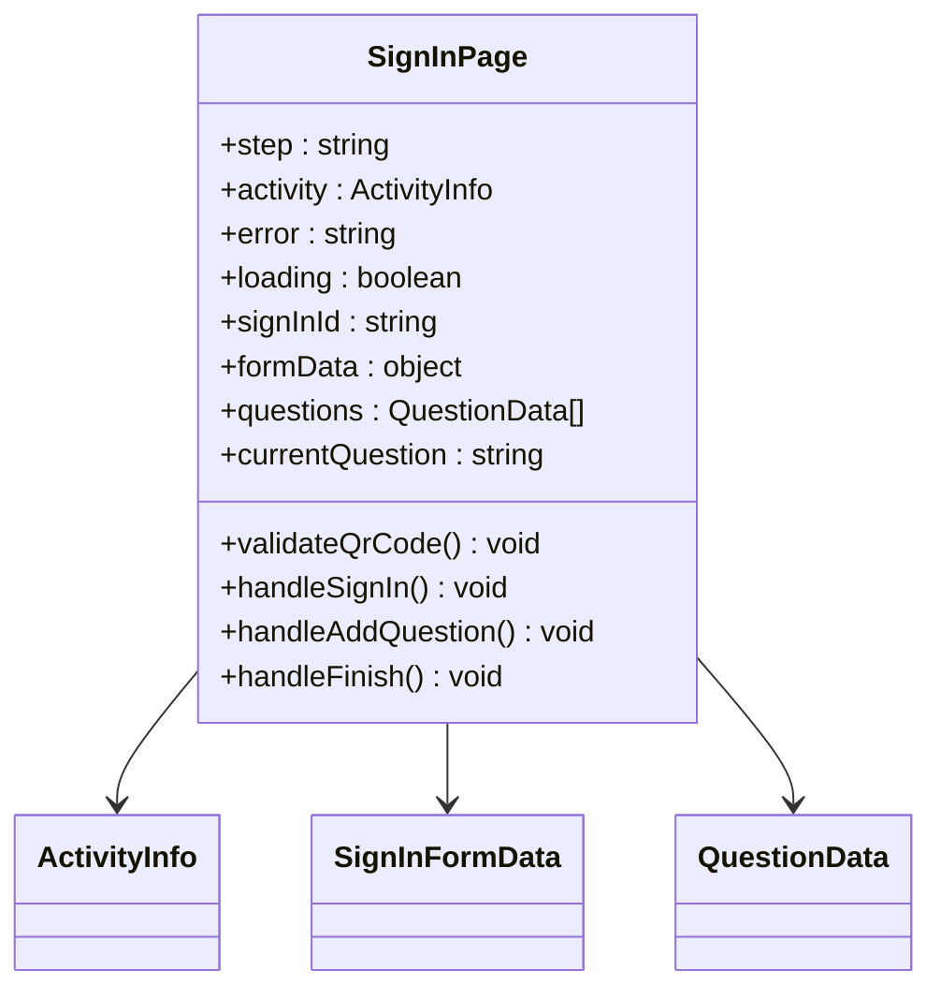

**图表来源**
- [SignInPage.tsx:34-366](file://crm-frontend/src/pages/PreSales/SignIn/SignInPage.tsx#L34-L366)

**章节来源**
- [index.tsx:1-613](file://crm-frontend/src/pages/PreSales/index.tsx#L1-L613)
- [index.tsx:1-283](file://crm-frontend/src/pages/PreSales/Activities/index.tsx#L1-L283)
- [ActivityForm.tsx:1-242](file://crm-frontend/src/pages/PreSales/Activities/ActivityForm.tsx#L1-L242)
- [SignInPage.tsx:1-366](file://crm-frontend/src/pages/PreSales/SignIn/SignInPage.tsx#L1-L366)

## AI智能分析集成

### 客户洞察分析

系统集成了AI智能分析功能，提供深度的客户洞察：

```mermaid
flowchart TD
Input[客户数据输入] --> Extract[AI提取特征]
Extract --> Analyze[智能分析]
Analyze --> Generate[生成洞察]
Generate --> Output[洞察结果输出]
Input --> Features[提取需求特征]
Input --> Decision[提取决策特征]
Input --> Pain[extract痛点特征]
Input --> Competitor[extract竞品特征]
Features --> Needs[需求分析]
Decision --> DecisionMaker[决策人分析]
Pain --> PainPoints[痛点分析]
Competitor --> CompetitorInfo[竞品分析]
Needs --> Confidence[置信度评估]
DecisionMaker --> Confidence
PainPoints --> Confidence
CompetitorInfo --> Confidence
Confidence --> FinalOutput[最终洞察报告]
```

**图表来源**
- [CustomerInsightPanel.tsx:80-110](file://crm-frontend/src/components/AI/CustomerInsightPanel.tsx#L80-L110)

### 商机评分系统

系统提供AI驱动的商机评分功能：

| 评分维度 | 权重 | 描述 |
|---------|------|------|
| 客户参与度 | 25% | 客户互动频率和质量 |
| 预算状况 | 20% | 客户财务能力和预算范围 |
| 决策权分析 | 20% | 决策者的影响力和立场 |
| 需求匹配度 | 15% | 产品与客户需求的契合度 |
| 时间敏感性 | 10% | 客户购买时机的重要性 |

### 提案AI分析系统

系统提供AI驱动的提案分析功能：

```mermaid
flowchart TD
Recording[录音数据] --> AIAnalysis[AI分析]
AIAnalysis --> ExtractedNeeds[提取需求]
AIAnalysis --> PainPoints[痛点分析]
AIAnalysis --> BudgetHint[预算线索]
AIAnalysis --> DecisionTimeline[决策时间线]
ExtractedNeeds --> Enhanced[AI增强]
PainPoints --> Enhanced
BudgetHint --> Enhanced
DecisionTimeline --> Enhanced
Enhanced --> FinalContent[最终内容]
FinalContent --> Proposal[生成提案]
```

**图表来源**
- [proposalAI.ts:58-106](file://crm-backend/src/services/ai/proposalAI.ts#L58-L106)
- [RequirementAnalysis.tsx:51-92](file://crm-frontend/src/pages/Proposals/ProposalDetail/components/RequirementAnalysis.tsx#L51-L92)

**章节来源**
- [CustomerInsightPanel.tsx:1-381](file://crm-frontend/src/components/AI/CustomerInsightPanel.tsx#L1-L381)
- [proposalAI.ts:1-599](file://crm-backend/src/services/ai/proposalAI.ts#L1-L599)

## 视觉设计与现代化改造

### 渐变设计系统

系统采用现代化的渐变设计，提供丰富的视觉层次：

```mermaid
graph LR
subgraph "渐变色彩系统"
BlueGradient[蓝色渐变: from-blue-500 to-cyan-500]
PurpleGradient[紫色渐变: from-violet-500 to-purple-600]
EmeraldGradient[绿松石渐变: from-emerald-500 to-teal-500]
AmberGradient[琥珀渐变: from-amber-500 to-orange-500]
VioletGradient[紫罗兰渐变: from-violet-500 to-purple-500]
end
subgraph "背景渐变系统"
LightBackground[浅色背景渐变]
DarkBackground[深色背景渐变]
GlassEffect[玻璃态效果]
ElevationShadow[立体阴影]
end
BlueGradient --> LightBackground
PurpleGradient --> DarkBackground
EmeraldGradient --> GlassEffect
AmberGradient --> ElevationShadow
VioletGradient --> LightBackground
```

**图表来源**
- [index.tsx:4-9](file://crm-frontend/src/pages/PreSales/index.tsx#L4-L9)
- [index.tsx:111-180](file://crm-frontend/src/pages/PreSales/index.tsx#L111-L180)

### 动画效果集成

系统集成了多种动画效果，提升用户体验：

```mermaid
graph TB
subgraph "动画效果"
HoverAnimation[悬停动画<br/>阴影和边框变化]
TransitionAnimation[过渡动画<br/>平滑的颜色变化]
ScaleAnimation[缩放动画<br/>卡片放大效果]
PulseAnimation[脉冲动画<br/>状态指示器]
RotateAnimation[旋转动画<br/>箭头指示器]
ShadowAnimation[阴影动画<br/>立体效果]
GlassAnimation[玻璃态动画<br/>背景透明度变化]
end
subgraph "触发条件"
Hover[鼠标悬停]
Click[点击操作]
Load[页面加载]
StatusChange[状态变化]
end
Hover --> HoverAnimation
Click --> TransitionAnimation
Load --> ScaleAnimation
StatusChange --> PulseAnimation
Hover --> RotateAnimation
Hover --> ShadowAnimation
Hover --> GlassAnimation
```

**图表来源**
- [index.tsx:522-555](file://crm-frontend/src/pages/PreSales/index.tsx#L522-L555)
- [index.tsx:183-260](file://crm-frontend/src/pages/PreSales/index.tsx#L183-L260)

### 暗色模式支持

系统完全支持暗色模式，提供一致的视觉体验：

```mermaid
graph LR
subgraph "暗色模式组件"
DarkCard[深色卡片背景<br/>dark:bg-slate-900]
DarkBorder[深色边框<br/>dark:border-slate-800]
DarkText[深色文字<br/>dark:text-white]
DarkTextGray[深色辅助文字<br/>dark:text-slate-400]
DarkHover[深色悬停效果<br/>dark:hover:border-primary/30]
DarkPlaceholder[深色占位符<br/>dark:text-slate-600]
DarkBackground[深色背景<br/>dark:bg-slate-800]
end
subgraph "渐变暗色模式"
DarkBlueGradient[深蓝渐变<br/>from-blue-950/50 to-indigo-950/50]
DarkEmeraldGradient[深绿渐变<br/>from-emerald-950/50 to-teal-950/50]
DarkAmberGradient[深琥珀渐变<br/>from-amber-950/50 to-orange-950/50]
DarkVioletGradient[深紫罗兰渐变<br/>from-violet-950/50 to-purple-950/50]
end
DarkCard --> DarkBlueGradient
DarkBorder --> DarkEmeraldGradient
DarkText --> DarkAmberGradient
DarkTextGray --> DarkVioletGradient
```

**图表来源**
- [index.tsx:111-180](file://crm-frontend/src/pages/PreSales/index.tsx#L111-L180)
- [index.tsx:410-520](file://crm-frontend/src/pages/PreSales/index.tsx#L410-L520)

### 响应式设计优化

系统采用移动优先的设计理念，支持多种屏幕尺寸：

```mermaid
graph TB
subgraph "响应式布局"
Mobile[移动端<br/>1列布局]
Tablet[平板端<br/>2列布局]
Desktop[桌面端<br/>3-4列布局]
LargeDesktop[大桌面端<br/>网格自适应]
end
subgraph "组件适配"
StatisticsCards[统计卡片<br/>1-4列自适应]
ActivityGrid[活动网格<br/>1-3列自适应]
ResourceGrid[资源网格<br/>1-5列自适应]
QuickActions[快速操作<br/>2-4列自适应]
end
Mobile --> StatisticsCards
Mobile --> ActivityGrid
Mobile --> ResourceGrid
Mobile --> QuickActions
Tablet --> StatisticsCards
Tablet --> ActivityGrid
Tablet --> ResourceGrid
Tablet --> QuickActions
Desktop --> StatisticsCards
Desktop --> ActivityGrid
Desktop --> ResourceGrid
Desktop --> QuickActions
LargeDesktop --> StatisticsCards
LargeDesktop --> ActivityGrid
LargeDesktop --> ResourceGrid
LargeDesktop --> QuickActions
```

**图表来源**
- [index.tsx:557-613](file://crm-frontend/src/pages/PreSales/index.tsx#L557-L613)
- [index.tsx:183-260](file://crm-frontend/src/pages/PreSales/index.tsx#L183-L260)
- [index.tsx:410-520](file://crm-frontend/src/pages/PreSales/index.tsx#L410-L520)

**章节来源**
- [index.tsx:4-9](file://crm-frontend/src/pages/PreSales/index.tsx#L4-L9)
- [index.tsx:111-180](file://crm-frontend/src/pages/PreSales/index.tsx#L111-L180)
- [index.tsx:522-555](file://crm-frontend/src/pages/PreSales/index.tsx#L522-L555)

## 性能优化策略

### 数据查询优化

系统采用了多种性能优化策略：

1. **批量查询优化**: 使用Promise.all并行执行多个数据库查询
2. **分页查询**: 对大量数据采用分页机制，避免一次性加载过多数据
3. **索引优化**: 在常用查询字段上建立数据库索引
4. **缓存策略**: 对静态数据和频繁访问的数据实施缓存

### 前端性能优化

```mermaid
graph LR
subgraph "前端优化策略"
LazyLoad[懒加载组件]
Memo[记忆化计算]
VirtualScroll[虚拟滚动]
Debounce[防抖处理]
OptimizedRender[优化渲染]
AnimationOptimization[动画性能优化]
DarkModeOptimization[暗色模式优化]
IconOptimization[图标系统优化]
ResourceOptimization[资源管理优化]
ActivityOptimization[活动管理优化]
SignInOptimization[签到系统优化]
ProposalOptimization[提案系统优化]
end
subgraph "AI性能优化"
ModelOptimization[模型优化]
BatchProcessing[批量处理]
Caching[结果缓存]
ParallelProcessing[并行处理]
end
LazyLoad --> OptimizedRender
Memo --> OptimizedRender
VirtualScroll --> OptimizedRender
Debounce --> OptimizedRender
AnimationOptimization --> OptimizedRender
DarkModeOptimization --> OptimizedRender
IconOptimization --> OptimizedRender
ResourceOptimization --> OptimizedRender
ActivityOptimization --> OptimizedRender
SignInOptimization --> OptimizedRender
ProposalOptimization --> OptimizedRender
ModelOptimization --> Caching
BatchProcessing --> Caching
ParallelProcessing --> Caching
```

**图表来源**
- [presales.service.ts:440-503](file://crm-backend/src/services/presales.service.ts#L440-L503)
- [presalesActivity.service.ts:221-280](file://crm-backend/src/services/presalesActivity.service.ts#L221-L280)

### 动画性能优化

系统特别优化了动画效果的性能：

- **硬件加速**: 使用transform属性而非改变布局属性
- **CSS动画**: 优先使用CSS动画而非JavaScript动画
- **帧率优化**: 保持60fps的流畅动画效果
- **内存管理**: 及时清理动画相关的事件监听器

**章节来源**
- [presales.service.ts:440-503](file://crm-backend/src/services/presales.service.ts#L440-L503)
- [presalesActivity.service.ts:221-280](file://crm-backend/src/services/presalesActivity.service.ts#L221-L280)

## 故障排除指南

### 常见问题及解决方案

#### 1. API请求失败

**问题症状**: 前端无法获取数据，控制台出现网络错误

**可能原因**:
- 服务器未启动或端口占用
- JWT令牌过期或无效
- 数据库连接异常

**解决步骤**:
1. 检查服务器启动状态
2. 验证JWT令牌有效性
3. 确认数据库连接正常

#### 2. 资源管理功能异常

**问题症状**: 资源状态无法更新或技能匹配失败

**可能原因**:
- 资源状态转换规则错误
- AI匹配算法异常
- 数据验证失败

**解决步骤**:
1. 检查资源状态转换逻辑
2. 验证AI匹配服务状态
3. 确认数据验证规则

#### 3. 活动管理问题

**问题症状**: 活动状态无法更新或二维码生成失败

**可能原因**:
- 审批流程配置错误
- 二维码生成服务异常
- 数据验证失败

**解决步骤**:
1. 检查审批流程配置
2. 验证二维码服务状态
3. 确认数据验证规则

#### 4. 签到系统问题

**问题症状**: 签到失败或二维码验证异常

**可能原因**:
- 二维码验证服务异常
- 数据库连接问题
- 前端表单验证错误

**解决步骤**:
1. 检查二维码验证服务状态
2. 确认数据库连接正常
3. 验证前端表单字段

#### 5. 视觉设计问题

**问题症状**: 图标显示异常或动画效果不流畅

**可能原因**:
- Material Icons CDN连接问题
- CSS类名冲突
- 动画性能问题

**解决步骤**:
1. 检查网络连接和CDN状态
2. 验证CSS类名的正确性
3. 优化动画性能设置

**章节来源**
- [presales.controller.ts:16-83](file://crm-backend/src/controllers/presales.controller.ts#L16-L83)
- [presalesActivity.controller.ts:19-21](file://crm-backend/src/controllers/presalesActivity.controller.ts#L19-L21)
- [proposal.controller.ts:172-184](file://crm-backend/src/controllers/proposal.controller.ts#L172-L184)

## 总结

售前仪表板是销售AI CRM系统的核心功能模块，通过集成AI智能分析技术和完善的业务流程管理，为企业提供了全面的售前活动监控和分析能力。**新增的资源管理系统和签到功能显著提升了用户体验和功能完整性**。

### 主要特性

1. **资源管理**: 完整的售前资源管理功能，支持状态监控、技能匹配、工作负载分析
2. **活动管理**: 增强的活动管理界面，采用现代化的渐变设计和交互体验
3. **签到系统**: 全新的签到流程，支持二维码验证、信息收集和问题反馈
4. **统计面板**: 现代化的统计卡片设计，提供业务指标的可视化展示
5. **快速操作**: 便捷的一键操作功能，支持常用功能的快速访问
6. **AI智能分析**: 深度集成AI功能，提供客户洞察和商机评分
7. **响应式设计**: 支持多种设备和屏幕尺寸的完美适配
8. **现代化视觉设计**: 全面的视觉重新设计，包含渐变色彩、动画效果、图标集成等现代化元素

### 技术优势

- **模块化架构**: 清晰的职责分离和模块化设计
- **高性能设计**: 多种性能优化策略确保系统响应速度
- **可扩展性**: 灵活的架构设计支持功能扩展和定制
- **安全性**: 完善的权限控制和数据安全保障
- **用户体验**: 现代化的视觉设计和流畅的交互体验
- **AI集成**: 深度集成AI智能分析功能，提供智能化业务支持

售前仪表板功能为企业售前管理提供了强有力的技术支撑，通过智能化的数据分析和业务流程自动化，显著提升了销售效率和客户满意度。**新增的资源管理和签到功能进一步增强了系统的专业性和用户体验**。