# 预售仪表板

<cite>
**本文档引用的文件**
- [dashboard.controller.ts](file://crm-backend/src/controllers/dashboard.controller.ts)
- [dashboard.service.ts](file://crm-backend/src/services/dashboard.service.ts)
- [dashboard.routes.ts](file://crm-backend/src/routes/dashboard.routes.ts)
- [presales.controller.ts](file://crm-backend/src/controllers/presales.controller.ts)
- [presales.service.ts](file://crm-backend/src/services/presales.service.ts)
- [presales.routes.ts](file://crm-backend/src/routes/presales.routes.ts)
- [presalesActivity.controller.ts](file://crm-backend/src/controllers/presalesActivity.controller.ts)
- [presalesActivity.service.ts](file://crm-backend/src/services/presalesActivity.service.ts)
- [presalesActivity.routes.ts](file://crm-backend/src/routes/presalesActivity.routes.ts)
- [proposal.controller.ts](file://crm-backend/src/controllers/proposal.controller.ts)
- [proposal.service.ts](file://crm-backend/src/services/proposal.service.ts)
- [proposals.routes.ts](file://crm-backend/src/routes/proposals.routes.ts)
- [proposal.validator.ts](file://crm-backend/src/validators/proposal.validator.ts)
- [proposalAI.ts](file://crm-backend/src/services/ai/proposalAI.ts)
- [ai/index.ts](file://crm-backend/src/services/ai/index.ts)
- [index.tsx](file://crm-frontend/src/pages/Dashboard/index.tsx)
- [index.tsx](file://crm-frontend/src/pages/PreSales/Activities/index.tsx)
- [Proposals/index.tsx](file://crm-frontend/src/pages/Proposals/index.tsx)
- [ProposalDetail/index.tsx](file://crm-frontend/src/pages/Proposals/ProposalDetail/index.tsx)
- [RequirementAnalysis.tsx](file://crm-frontend/src/pages/Proposals/ProposalDetail/components/RequirementAnalysis.tsx)
- [InternalReview.tsx](file://crm-frontend/src/pages/Proposals/ProposalDetail/components/InternalReview.tsx)
- [CustomerInsightPanel.tsx](file://crm-frontend/src/components/AI/CustomerInsightPanel.tsx)
- [Header.tsx](file://crm-frontend/src/components/layout/Header.tsx)
- [Sidebar.tsx](file://crm-frontend/src/components/layout/Sidebar.tsx)
- [funnelStore.ts](file://crm-frontend/src/stores/funnelStore.ts)
- [index.ts](file://crm-backend/src/types/index.ts)
- [index.ts](file://crm-frontend/src/types/index.ts)
</cite>

## 更新摘要
**所做更改**
- 新增提案系统功能集成，包括提案状态监控、AI智能分析、工作流程统计等与提案系统相关的功能模块
- 更新预售仪表板的视觉设计部分，反映全面的视觉重新设计和现代化改造
- 新增活动类型配置增强、统计卡片渐变设计、动画效果、图标集成等视觉改进
- 更新前端组件设计章节，包含新的Material Icons集成和暗色模式支持
- 增强性能优化策略，包含新的动画和过渡效果

## 目录
1. [项目概述](#项目概述)
2. [系统架构](#系统架构)
3. [核心组件分析](#核心组件分析)
4. [预售仪表板功能](#预售仪表板功能)
5. [提案系统集成](#提案系统集成)
6. [数据流分析](#数据流分析)
7. [前端组件设计](#前端组件设计)
8. [AI智能分析集成](#ai智能分析集成)
9. [视觉设计与现代化改造](#视觉设计与现代化改造)
10. [性能优化策略](#性能优化策略)
11. [故障排除指南](#故障排除指南)
12. [总结](#总结)

## 项目概述

销售AI CRM系统是一个集成了人工智能技术的客户关系管理系统，专注于销售流程的智能化管理。系统包含预售仪表板功能，为企业提供全面的销售活动监控和分析能力，现已集成了完整的提案管理系统。

该系统采用前后端分离架构，后端基于Node.js + Express + Prisma ORM，前端使用React + TypeScript构建，实现了完整的销售生命周期管理，包括客户管理、销售机会跟踪、预售活动管理、AI智能分析、**提案系统管理**等功能模块。

## 系统架构

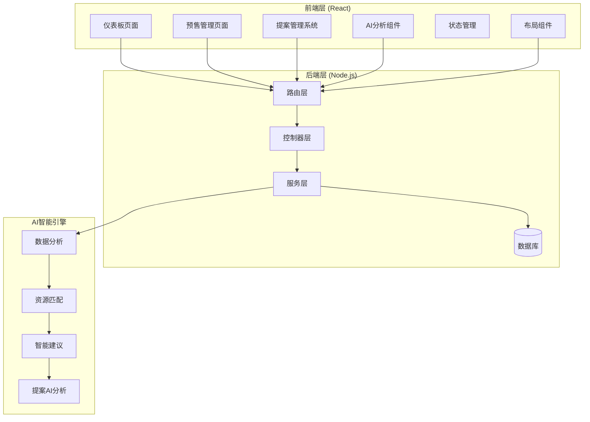

**图表来源**
- [dashboard.controller.ts:1-123](file://crm-backend/src/controllers/dashboard.controller.ts#L1-L123)
- [presales.controller.ts:1-248](file://crm-backend/src/controllers/presales.controller.ts#L1-L248)
- [proposal.controller.ts:1-636](file://crm-backend/src/controllers/proposal.controller.ts#L1-L636)
- [presalesActivity.controller.ts:1-338](file://crm-backend/src/controllers/presalesActivity.controller.ts#L1-L338)

**章节来源**
- [dashboard.controller.ts:1-123](file://crm-backend/src/controllers/dashboard.controller.ts#L1-L123)
- [presales.controller.ts:1-248](file://crm-backend/src/controllers/presales.controller.ts#L1-L248)
- [proposal.controller.ts:1-636](file://crm-backend/src/controllers/proposal.controller.ts#L1-L636)
- [presalesActivity.controller.ts:1-338](file://crm-backend/src/controllers/presalesActivity.controller.ts#L1-L338)

## 核心组件分析

### 后端架构组件

系统采用经典的三层架构模式，实现了清晰的职责分离，并新增了提案系统模块：

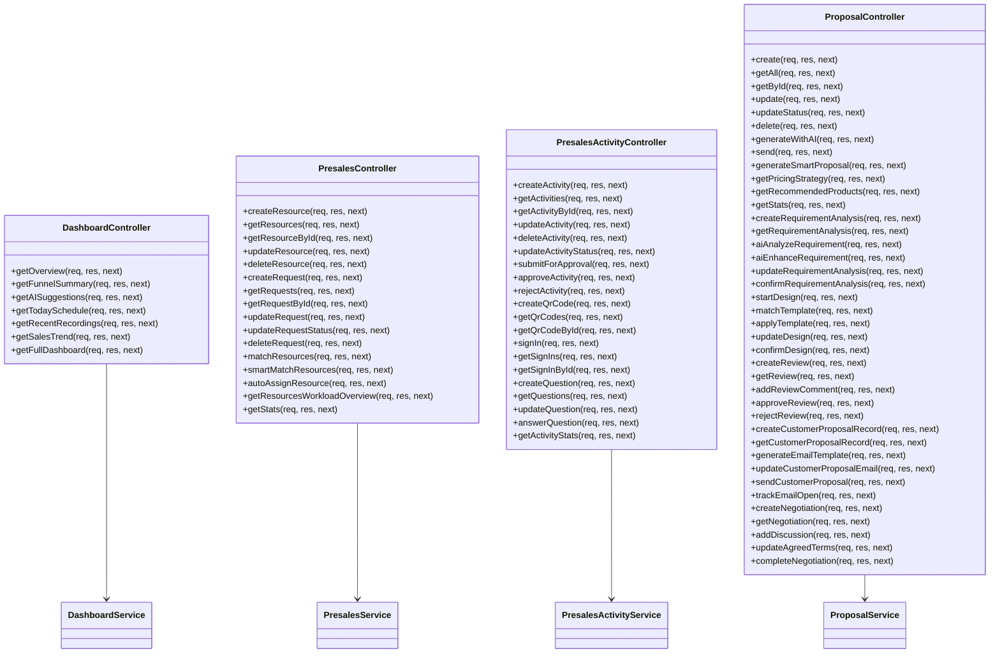

**图表来源**
- [dashboard.controller.ts:9-121](file://crm-backend/src/controllers/dashboard.controller.ts#L9-L121)
- [presales.controller.ts:9-248](file://crm-backend/src/controllers/presales.controller.ts#L9-L248)
- [presalesActivity.controller.ts:9-338](file://crm-backend/src/controllers/presalesActivity.controller.ts#L9-L338)
- [proposal.controller.ts:9-636](file://crm-backend/src/controllers/proposal.controller.ts#L9-L636)

### 数据模型设计

系统使用Prisma ORM进行数据库操作，支持复杂的数据关联和查询，新增了提案相关数据模型：

```mermaid
erDiagram
PRE_SALES_RESOURCE {
string id PK
string name
string email
string phone
string[] skills
int experience
string[] certifications
enum status
string availability
string location
text notes
datetime created_at
datetime updated_at
}
PRE_SALES_REQUEST {
string id PK
string customer_id FK
enum type
string title
text description
enum priority
string[] required_skills
datetime due_date
int estimated_duration
enum status
string created_by_id
string assigned_resource_id
datetime assigned_at
datetime completed_at
text notes
datetime created_at
datetime updated_at
}
PRESALES_ACTIVITY {
string id PK
string customer_id FK
enum type
string title
text description
string location
datetime start_time
datetime end_time
enum status
enum approval_status
string created_by_id
string approved_by_id
datetime approved_at
text approval_notes
datetime created_at
datetime updated_at
}
ACTIVITY_SIGN_IN {
string id PK
string activity_id FK
string qr_code_id FK
string customer_id FK
string customer_name
string phone
string email
string company
string title
boolean is_new_customer
text notes
datetime signed_at
datetime created_at
datetime updated_at
}
PROPOSAL {
string id PK
string customerId FK
string title
number value
string description
json products
string terms
datetime validUntil
string status
string notes
string createdById FK
datetime sentAt
datetime createdAt
datetime updatedAt
}
REQUIREMENT_ANALYSIS {
string id PK
string proposalId FK U
string customerId FK
string sourceType
string recordingId
string rawContent
boolean aiEnhanced
string finalContent
json extractedNeeds
json painPoints
string budgetHint
string decisionTimeline
string status
datetime createdAt
datetime updatedAt
}
PROPOSAL_REVIEW {
string id PK
string proposalId FK U
string reviewerId
string status
json comments
string resultNotes
datetime createdAt
datetime updatedAt
}
PRE_SALES_RESOURCE ||--o{ PRE_SALES_REQUEST : "assigned"
PRE_SALES_RESOURCE ||--o{ ACTIVITY_SIGN_IN : "created"
PRE_SALES_REQUEST ||--o{ ACTIVITY_SIGN_IN : "generated"
PROPOSAL ||--o{ REQUIREMENT_ANALYSIS : "has"
PROPOSAL ||--o{ PROPOSAL_REVIEW : "has"
```

**图表来源**
- [presales.service.ts:22-37](file://crm-backend/src/services/presales.service.ts#L22-L37)
- [presalesActivity.service.ts:32-54](file://crm-backend/src/services/presalesActivity.service.ts#L32-L54)
- [proposal.service.ts:587-715](file://crm-backend/src/services/proposal.service.ts#L587-L715)
- [schema.prisma:955-995](file://crm-backend/prisma/schema.prisma#L955-L995)

**章节来源**
- [dashboard.service.ts:7-12](file://crm-backend/src/services/dashboard.service.ts#L7-L12)
- [presales.service.ts:10-15](file://crm-backend/src/services/presales.service.ts#L10-L15)
- [presalesActivity.service.ts:20-25](file://crm-backend/src/services/presalesActivity.service.ts#L20-L25)
- [proposal.service.ts:17-43](file://crm-backend/src/services/proposal.service.ts#L17-L43)

## 预售仪表板功能

### 仪表板核心指标

预售仪表板提供了全面的销售活动监控功能，包括以下核心指标：

#### 1. 销售漏斗分析

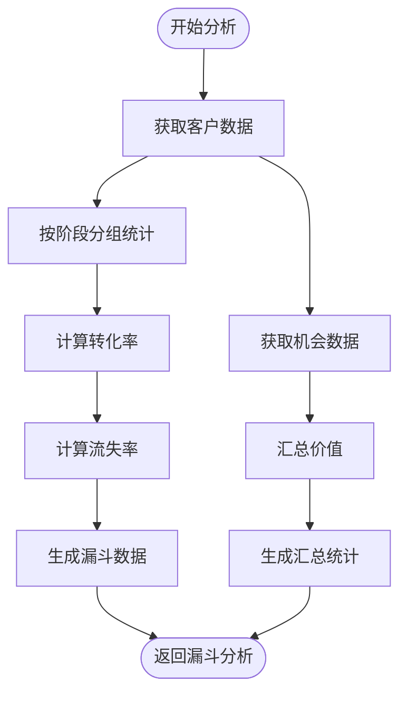

**图表来源**
- [dashboard.service.ts:101-154](file://crm-backend/src/services/dashboard.service.ts#L101-L154)

#### 2. AI智能建议系统

系统集成了AI智能分析功能，为销售人员提供实时的业务建议：

| 建议类型 | 触发条件 | 优先级 | 功能描述 |
|---------|---------|--------|----------|
| 客户跟进 | 超过7天未联系 | 高 | 推荐跟进潜在客户 |
| 逾期回款 | 发现逾期账款 | 高 | 提醒处理逾期款项 |
| 机会到期 | 机会即将到期 | 中 | 关注即将到期的销售机会 |
| 待办任务 | 存在未完成任务 | 中 | 处理积压的待办事项 |
| 业绩概览 | 每月统计 | 低 | 展示月度销售业绩 |

**章节来源**
- [dashboard.service.ts:160-281](file://crm-backend/src/services/dashboard.service.ts#L160-L281)

### 预售活动管理

#### 活动生命周期管理

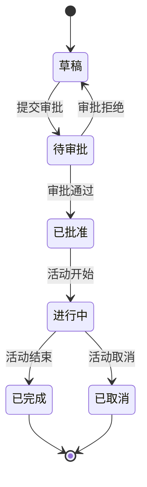

**图表来源**
- [presalesActivity.service.ts:221-280](file://crm-backend/src/services/presalesActivity.service.ts#L221-L280)

#### 资源智能匹配

系统提供AI驱动的资源智能匹配功能，基于多维度评分算法实现精准匹配：

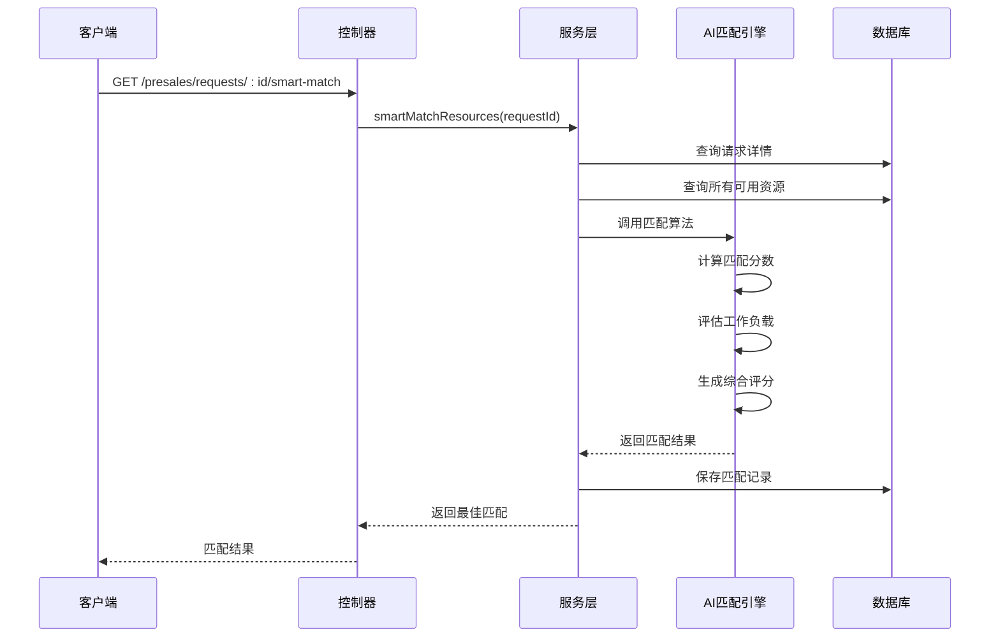

**图表来源**
- [presales.controller.ts:197-205](file://crm-backend/src/controllers/presales.controller.ts#L197-L205)
- [presales.service.ts:440-503](file://crm-backend/src/services/presales.service.ts#L440-L503)

**章节来源**
- [presalesActivity.controller.ts:1-338](file://crm-backend/src/controllers/presalesActivity.controller.ts#L1-L338)
- [presalesActivity.service.ts:1-766](file://crm-backend/src/services/presalesActivity.service.ts#L1-L766)

## 提案系统集成

### 提案工作流程管理

提案系统提供了完整的商务提案管理流程，包含五个主要阶段：

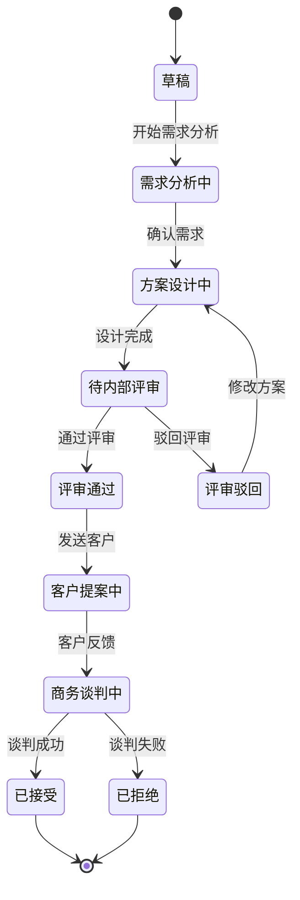

**图表来源**
- [proposal.validator.ts:6-19](file://crm-backend/src/validators/proposal.validator.ts#L6-L19)
- [ProposalDetail/index.tsx:14-27](file://crm-frontend/src/pages/Proposals/ProposalDetail/index.tsx#L14-L27)

### AI智能提案分析

系统集成了AI驱动的智能提案分析功能，提供深度的客户需求洞察：

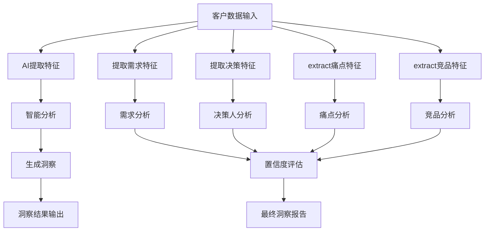

**图表来源**
- [RequirementAnalysis.tsx:51-92](file://crm-frontend/src/pages/Proposals/ProposalDetail/components/RequirementAnalysis.tsx#L51-L92)
- [proposalAI.ts:347-384](file://crm-backend/src/services/ai/proposalAI.ts#L347-L384)

### 提案统计分析

系统提供全面的提案统计分析功能：

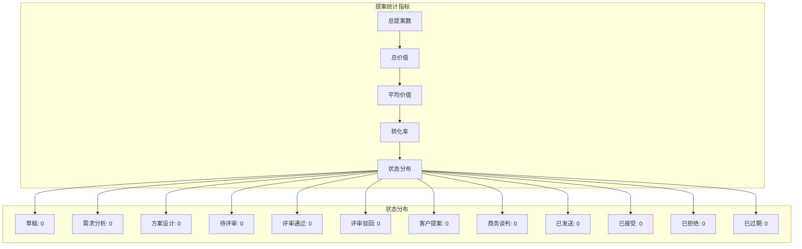

**图表来源**
- [proposal.service.ts:236-286](file://crm-backend/src/services/proposal.service.ts#L236-L286)

**章节来源**
- [proposal.controller.ts:172-184](file://crm-backend/src/controllers/proposal.controller.ts#L172-L184)
- [proposal.service.ts:236-286](file://crm-backend/src/services/proposal.service.ts#L236-L286)
- [RequirementAnalysis.tsx:1-301](file://crm-frontend/src/pages/Proposals/ProposalDetail/components/RequirementAnalysis.tsx#L1-L301)
- [InternalReview.tsx:1-356](file://crm-frontend/src/pages/Proposals/ProposalDetail/components/InternalReview.tsx#L1-L356)

## 数据流分析

### 前端数据流

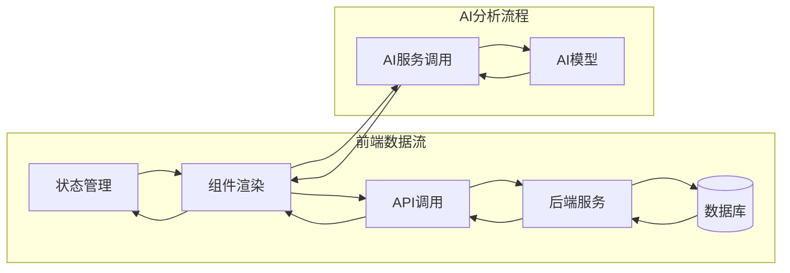

**图表来源**
- [index.tsx:343-357](file://crm-frontend/src/pages/Dashboard/index.tsx#L343-L357)
- [CustomerInsightPanel.tsx:86-110](file://crm-frontend/src/components/AI/CustomerInsightPanel.tsx#L86-L110)

### 后端数据流

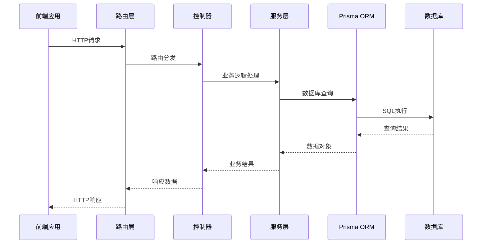

**图表来源**
- [dashboard.routes.ts:1-124](file://crm-backend/src/routes/dashboard.routes.ts#L1-L124)
- [presales.routes.ts:1-536](file://crm-backend/src/routes/presales.routes.ts#L1-L536)
- [proposals.routes.ts:1-653](file://crm-backend/src/routes/proposals.routes.ts#L1-L653)

**章节来源**
- [dashboard.routes.ts:1-124](file://crm-backend/src/routes/dashboard.routes.ts#L1-L124)
- [presales.routes.ts:1-536](file://crm-backend/src/routes/presales.routes.ts#L1-L536)
- [proposals.routes.ts:1-653](file://crm-backend/src/routes/proposals.routes.ts#L1-L653)

## 前端组件设计

### 仪表板布局结构

系统采用响应式设计，支持多种屏幕尺寸：

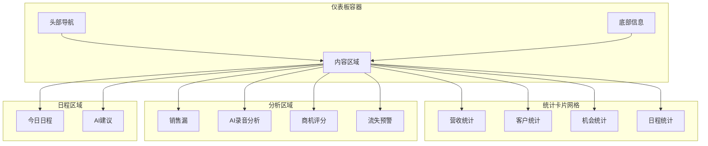

**图表来源**
- [index.tsx:523-593](file://crm-frontend/src/pages/Dashboard/index.tsx#L523-L593)

### 预售活动管理界面

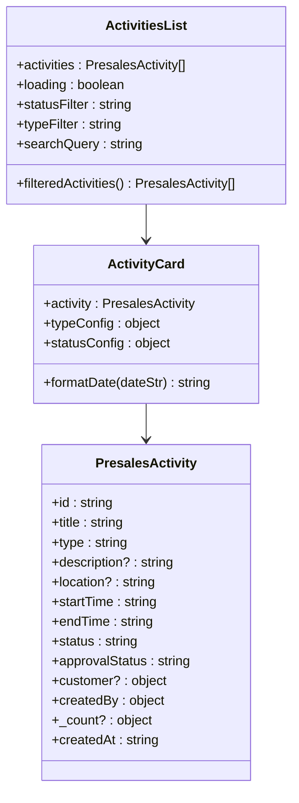

**图表来源**
- [index.tsx:1-283](file://crm-frontend/src/pages/PreSales/Activities/index.tsx#L1-L283)

### 提案管理系统界面

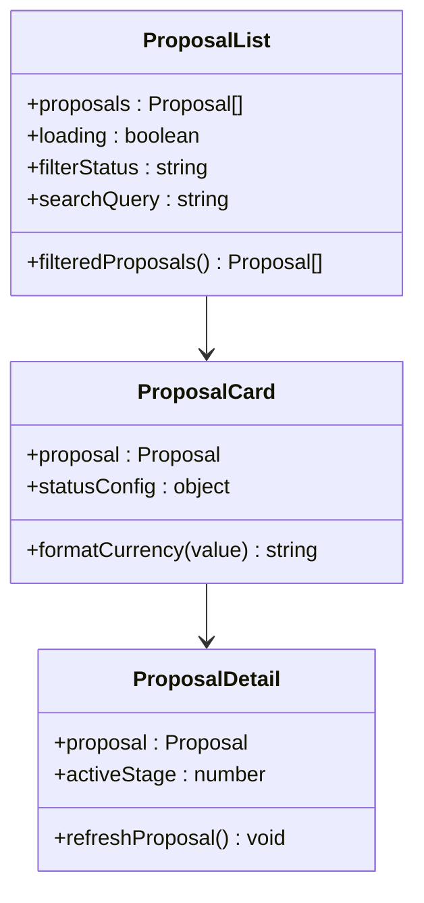

**图表来源**
- [Proposals/index.tsx:122-236](file://crm-frontend/src/pages/Proposals/index.tsx#L122-L236)
- [ProposalDetail/index.tsx:46-239](file://crm-frontend/src/pages/Proposals/ProposalDetail/index.tsx#L46-L239)

**章节来源**
- [index.tsx:1-593](file://crm-frontend/src/pages/Dashboard/index.tsx#L1-L593)
- [index.tsx:1-283](file://crm-frontend/src/pages/PreSales/Activities/index.tsx#L1-L283)
- [Proposals/index.tsx:1-236](file://crm-frontend/src/pages/Proposals/index.tsx#L1-L236)
- [ProposalDetail/index.tsx:1-239](file://crm-frontend/src/pages/Proposals/ProposalDetail/index.tsx#L1-L239)

### Material Icons 图标系统

系统全面集成了Material Icons图标系统，提供统一的视觉语言：

```mermaid
graph LR
subgraph "图标分类"
Schedule[schedule - 时间图标]
Location[location_on - 位置图标]
Business[business - 公司图标]
Add[add - 添加图标]
Search[search - 搜索图标]
Groups[groups - 团队图标]
Meeting[meeting - 会议图标]
Visit[location_on - 拜访图标]
Task[assignment - 任务图标]
Call[call - 电话图标]
Analytics[analytics - 分析图标]
Warning[warning - 警告图标]
Check[check_circle - 确认图标]
Person[person - 人员图标]
Error[error - 错误图标]
Compare[compare - 对比图标]
Rocket[rocket_launch - 升级图标]
Notifications[notifications - 通知图标]
Logout[logout - 登出图标]
Dashboard[dashboard - 仪表板图标]
Storefront[storefront - 售前中心图标]
Assignment[assignment - 提案图标]
RateReview[rate_review - 评审图标]
Send[send - 发送图标]
Handshake[handshake - 谈判图标]
```

**图表来源**
- [index.tsx:87-118](file://crm-frontend/src/pages/PreSales/Activities/index.tsx#L87-L118)
- [index.tsx:208-217](file://crm-frontend/src/pages/PreSales/Activities/index.tsx#L208-L217)
- [index.tsx:233-245](file://crm-frontend/src/pages/PreSales/Activities/index.tsx#L233-L245)
- [Proposals/index.tsx:45-49](file://crm-frontend/src/pages/Proposals/index.tsx#L45-L49)

**章节来源**
- [index.tsx:87-118](file://crm-frontend/src/pages/PreSales/Activities/index.tsx#L87-L118)
- [index.tsx:208-217](file://crm-frontend/src/pages/PreSales/Activities/index.tsx#L208-L217)
- [index.tsx:233-245](file://crm-frontend/src/pages/PreSales/Activities/index.tsx#L233-L245)
- [Proposals/index.tsx:45-73](file://crm-frontend/src/pages/Proposals/index.tsx#L45-L73)

## AI智能分析集成

### 客户洞察分析

系统集成了AI智能分析功能，提供深度的客户洞察：


**图表来源**
- [CustomerInsightPanel.tsx:80-110](file://crm-frontend/src/components/AI/CustomerInsightPanel.tsx#L80-L110)

### 商机评分系统

系统提供AI驱动的商机评分功能：

| 评分维度 | 权重 | 描述 |
|---------|------|------|
| 客户参与度 | 25% | 客户互动频率和质量 |
| 预算状况 | 20% | 客户财务能力和预算范围 |
| 决策权分析 | 20% | 决策者的影响力和立场 |
| 需求匹配度 | 15% | 产品与客户需求的契合度 |
| 时间敏感性 | 10% | 客户购买时机的重要性 |

### 提案AI分析系统

系统提供AI驱动的提案分析功能：

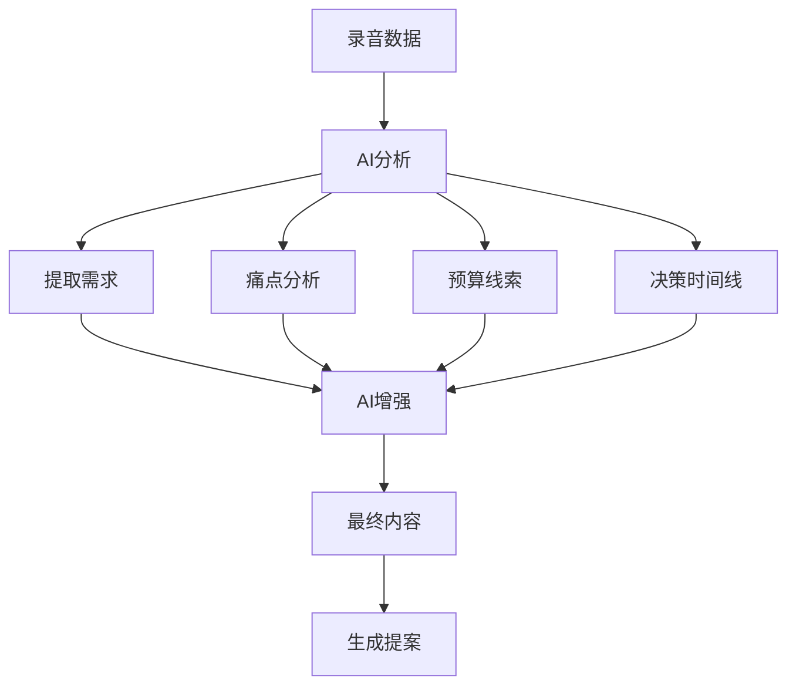

**图表来源**
- [proposalAI.ts:58-106](file://crm-backend/src/services/ai/proposalAI.ts#L58-L106)
- [RequirementAnalysis.tsx:51-92](file://crm-frontend/src/pages/Proposals/ProposalDetail/components/RequirementAnalysis.tsx#L51-L92)

**章节来源**
- [CustomerInsightPanel.tsx:1-381](file://crm-frontend/src/components/AI/CustomerInsightPanel.tsx#L1-L381)
- [proposalAI.ts:1-599](file://crm-backend/src/services/ai/proposalAI.ts#L1-L599)

## 视觉设计与现代化改造

### 活动类型配置增强

预售活动管理系统现在支持五种不同的活动类型，每种类型都有独特的视觉标识：

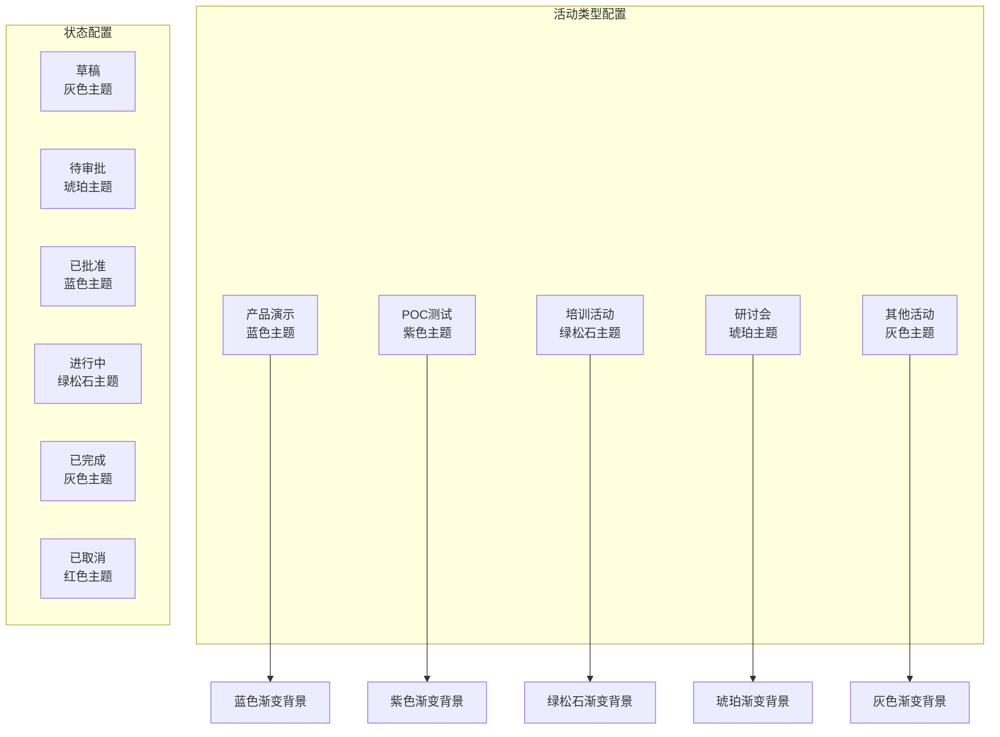

**图表来源**
- [index.tsx:32-48](file://crm-frontend/src/pages/PreSales/Activities/index.tsx#L32-L48)

### 统计卡片渐变设计

仪表板统计卡片采用了现代化的渐变设计，提供丰富的视觉层次：

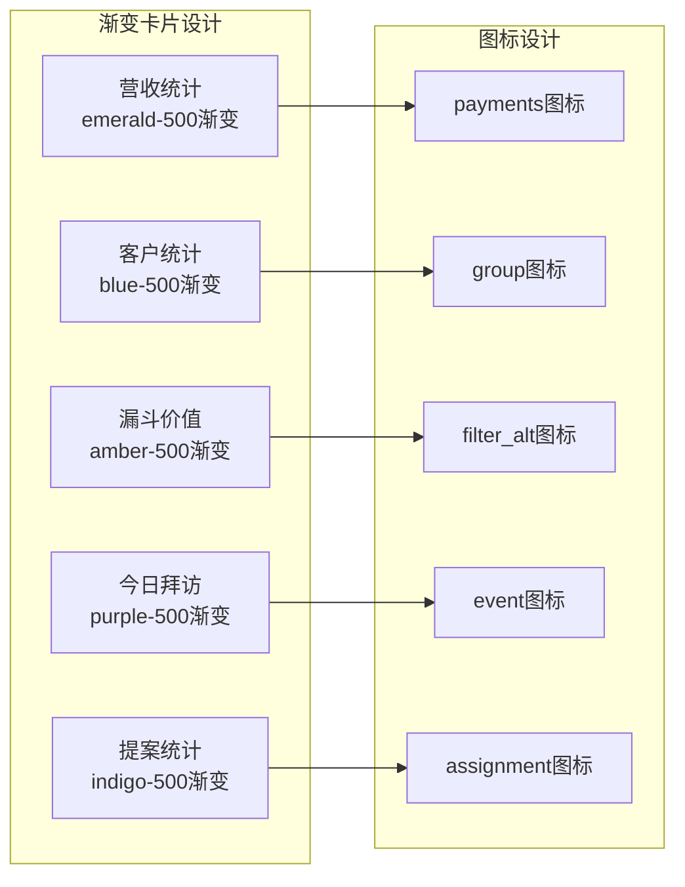

**图表来源**
- [index.tsx:540-569](file://crm-frontend/src/pages/Dashboard/index.tsx#L540-L569)

### 动画效果集成

系统集成了多种动画效果，提升用户体验：

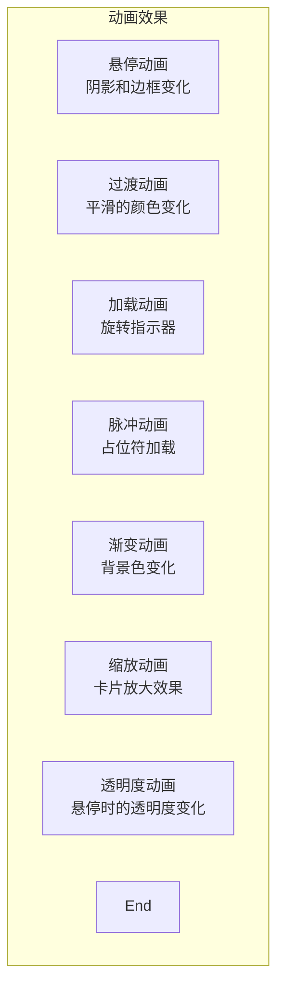

**图表来源**
- [index.tsx:68-69](file://crm-frontend/src/pages/PreSales/Activities/index.tsx#L68)
- [index.tsx:259](file://crm-frontend/src/pages/PreSales/Activities/index.tsx#L259)
- [index.tsx:362-367](file://crm-frontend/src/pages/Dashboard/index.tsx#L362-L367)

### 暗色模式支持

系统完全支持暗色模式，提供一致的视觉体验：

```mermaid
graph LR
subgraph "暗色模式组件"
DarkCard[深色卡片背景<br/>dark:bg-slate-900]
DarkBorder[深色边框<br/>dark:border-slate-800]
DarkText[深色文字<br/>dark:text-white]
DarkTextGray[深色辅助文字<br/>dark:text-slate-400]
DarkHover[深色悬停效果<br/>dark:hover:border-primary/30]
DarkPlaceholder[深色占位符<br/>dark:text-slate-600]
DarkBackground[深色背景<br/>dark:bg-slate-800]
End
end
```

**图表来源**
- [index.tsx:68-69](file://crm-frontend/src/pages/PreSales/Activities/index.tsx#L68)
- [index.tsx:32-32](file://crm-frontend/src/pages/Dashboard/index.tsx#L32)

### 响应式设计优化

系统采用移动优先的设计理念，支持多种屏幕尺寸：

```mermaid
graph TB
subgraph "响应式布局"
Mobile[移动端<br/>1列布局]
Tablet[平板端<br/>2列布局]
Desktop[桌面端<br/>4列布局]
LargeDesktop[大桌面端<br/>网格自适应]
End
end
```

**图表来源**
- [index.tsx:540-569](file://crm-frontend/src/pages/Dashboard/index.tsx#L540-L569)
- [index.tsx:275-280](file://crm-frontend/src/pages/PreSales/Activities/index.tsx#L275-L280)
- [Proposals/index.tsx:228-233](file://crm-frontend/src/pages/Proposals/index.tsx#L228-L233)

**章节来源**
- [index.tsx:32-48](file://crm-frontend/src/pages/PreSales/Activities/index.tsx#L32-L48)
- [index.tsx:540-569](file://crm-frontend/src/pages/Dashboard/index.tsx#L540-L569)
- [index.tsx:68-69](file://crm-frontend/src/pages/PreSales/Activities/index.tsx#L68)
- [index.tsx:259](file://crm-frontend/src/pages/PreSales/Activities/index.tsx#L259)
- [index.tsx:362-367](file://crm-frontend/src/pages/Dashboard/index.tsx#L362-L367)
- [Proposals/index.tsx:228-233](file://crm-frontend/src/pages/Proposals/index.tsx#L228-L233)

## 性能优化策略

### 数据查询优化

系统采用了多种性能优化策略：

1. **批量查询优化**: 使用Promise.all并行执行多个数据库查询
2. **分页查询**: 对大量数据采用分页机制，避免一次性加载过多数据
3. **索引优化**: 在常用查询字段上建立数据库索引
4. **缓存策略**: 对静态数据和频繁访问的数据实施缓存

### 前端性能优化

```mermaid
graph LR
subgraph "前端优化策略"
LazyLoad[懒加载组件]
Memo[记忆化计算]
VirtualScroll[虚拟滚动]
Debounce[防抖处理]
OptimizedRender[优化渲染]
AnimationOptimization[动画性能优化]
DarkModeOptimization[暗色模式优化]
IconOptimization[图标系统优化]
ProposalOptimization[提案系统优化]
end
subgraph "AI性能优化"
ModelOptimization[模型优化]
BatchProcessing[批量处理]
Caching[结果缓存]
ParallelProcessing[并行处理]
end
LazyLoad --> OptimizedRender
Memo --> OptimizedRender
VirtualScroll --> OptimizedRender
Debounce --> OptimizedRender
AnimationOptimization --> OptimizedRender
DarkModeOptimization --> OptimizedRender
IconOptimization --> OptimizedRender
ProposalOptimization --> OptimizedRender
ModelOptimization --> Caching
BatchProcessing --> Caching
ParallelProcessing --> Caching
```

**图表来源**
- [dashboard.service.ts:29-49](file://crm-backend/src/services/dashboard.service.ts#L29-L49)
- [presales.service.ts:440-503](file://crm-backend/src/services/presales.service.ts#L440-L503)
- [proposal.service.ts:236-286](file://crm-backend/src/services/proposal.service.ts#L236-L286)

### 动画性能优化

系统特别优化了动画效果的性能：

- **硬件加速**: 使用transform属性而非改变布局属性
- **CSS动画**: 优先使用CSS动画而非JavaScript动画
- **帧率优化**: 保持60fps的流畅动画效果
- **内存管理**: 及时清理动画相关的事件监听器

**章节来源**
- [dashboard.service.ts:29-49](file://crm-backend/src/services/dashboard.service.ts#L29-L49)
- [presales.service.ts:440-503](file://crm-backend/src/services/presales.service.ts#L440-L503)
- [proposal.service.ts:236-286](file://crm-backend/src/services/proposal.service.ts#L236-L286)

## 故障排除指南

### 常见问题及解决方案

#### 1. API请求失败

**问题症状**: 前端无法获取数据，控制台出现网络错误

**可能原因**:
- 服务器未启动或端口占用
- JWT令牌过期或无效
- 数据库连接异常

**解决步骤**:
1. 检查服务器启动状态
2. 验证JWT令牌有效性
3. 确认数据库连接正常

#### 2. AI分析功能异常

**问题症状**: 客户洞察面板显示"暂无数据"

**可能原因**:
- AI服务未正确配置
- 网络连接问题
- API密钥配置错误

**解决步骤**:
1. 检查AI服务配置
2. 验证网络连接
3. 确认API密钥设置

#### 3. 预售活动管理问题

**问题症状**: 活动状态无法更新或二维码生成失败

**可能原因**:
- 审批流程配置错误
- 二维码生成服务异常
- 数据验证失败

**解决步骤**:
1. 检查审批流程配置
2. 验证二维码服务状态
3. 确认数据验证规则

#### 4. 提案系统问题

**问题症状**: 提案状态无法更新或AI分析失败

**可能原因**:
- 提案状态转换规则错误
- AI分析服务异常
- 数据验证失败

**解决步骤**:
1. 检查提案状态转换逻辑
2. 验证AI分析服务状态
3. 确认数据验证规则

#### 5. 视觉设计问题

**问题症状**: 图标显示异常或动画效果不流畅

**可能原因**:
- Material Icons CDN连接问题
- CSS类名冲突
- 动画性能问题

**解决步骤**:
1. 检查网络连接和CDN状态
2. 验证CSS类名的正确性
3. 优化动画性能设置

**章节来源**
- [dashboard.controller.ts:45-47](file://crm-backend/src/controllers/dashboard.controller.ts#L45-L47)
- [presalesActivity.controller.ts:19-21](file://crm-backend/src/controllers/presalesActivity.controller.ts#L19-L21)
- [proposal.controller.ts:172-184](file://crm-backend/src/controllers/proposal.controller.ts#L172-L184)

## 总结

预售仪表板是销售AI CRM系统的核心功能模块，通过集成AI智能分析技术和完善的业务流程管理，为企业提供了全面的销售活动监控和分析能力。**新增的提案系统集成为仪表板增加了完整的商务提案管理功能**，包括提案状态监控、AI智能分析、工作流程统计等与提案系统相关的功能模块。

### 主要特性

1. **全方位数据监控**: 实时展示销售漏斗、客户统计、机会分析等关键指标
2. **AI智能分析**: 提供客户洞察、商机评分、流失预警等智能化分析功能
3. **预售活动管理**: 完整的活动生命周期管理，支持签到、问答、统计等功能
4. **资源智能匹配**: 基于AI算法的资源智能匹配和自动分配
5. **提案系统管理**: 完整的商务提案管理流程，包含需求分析、方案设计、内部评审、客户提案、商务谈判等阶段
6. **AI驱动的提案分析**: 基于客户洞察和历史数据的智能提案生成和定价策略
7. **响应式设计**: 支持多种设备和屏幕尺寸的完美适配
8. **现代化视觉设计**: 全面的视觉重新设计，包含渐变色彩、动画效果、图标集成等现代化元素

### 技术优势

- **模块化架构**: 清晰的职责分离和模块化设计
- **高性能设计**: 多种性能优化策略确保系统响应速度
- **可扩展性**: 灵活的架构设计支持功能扩展和定制
- **安全性**: 完善的权限控制和数据安全保障
- **用户体验**: 现代化的视觉设计和流畅的交互体验
- **AI集成**: 深度集成AI智能分析功能，提供智能化业务支持

预售仪表板功能为企业销售管理提供了强有力的技术支撑，通过智能化的数据分析和业务流程自动化，显著提升了销售效率和客户满意度。**新增的提案系统集成为企业提供了完整的商务提案管理能力，进一步增强了系统的专业性和用户体验**。