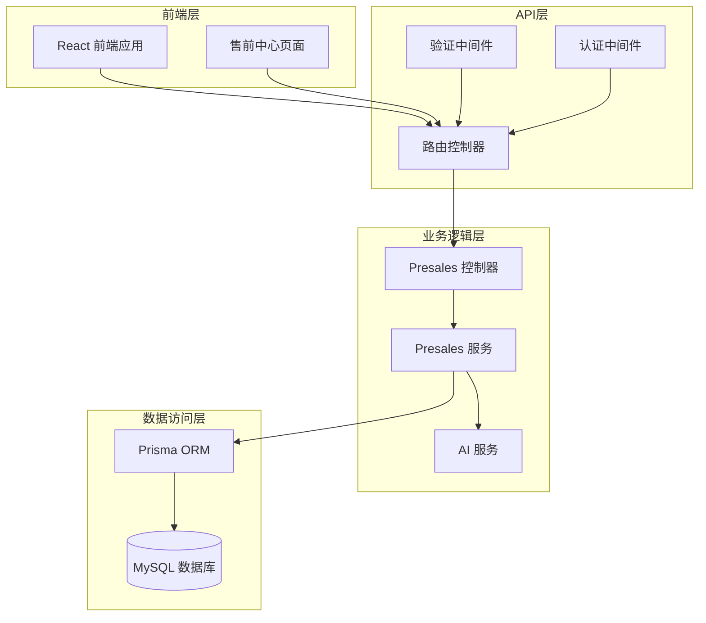
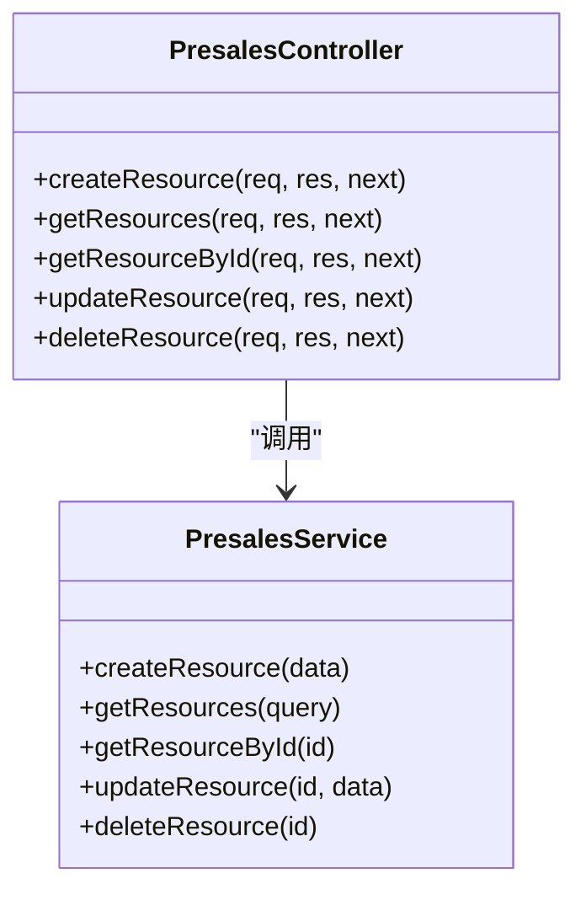
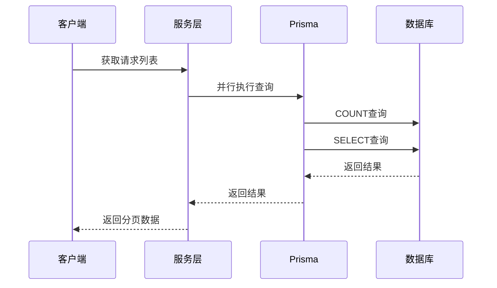
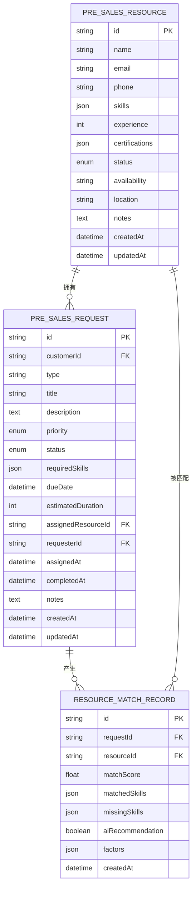
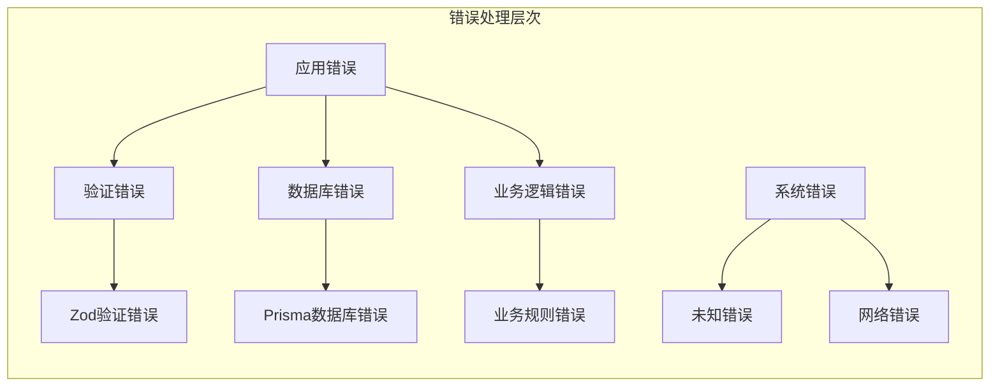
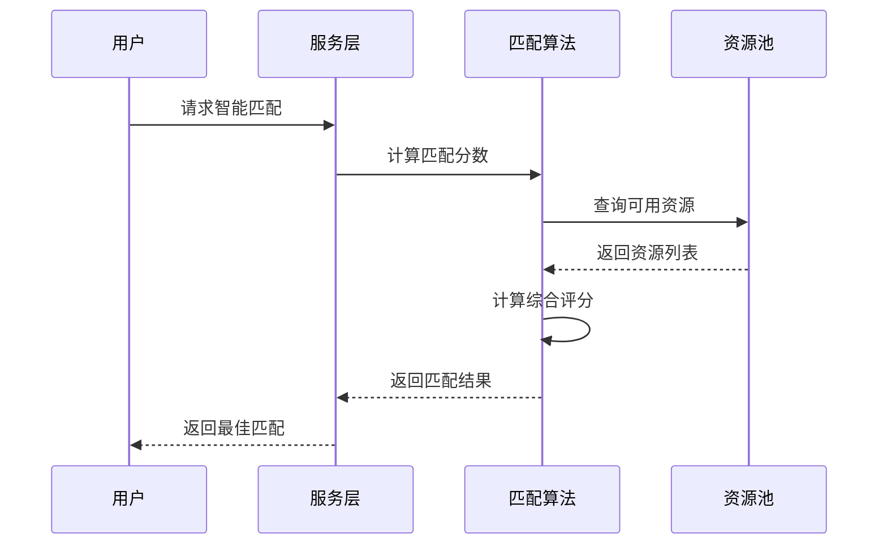
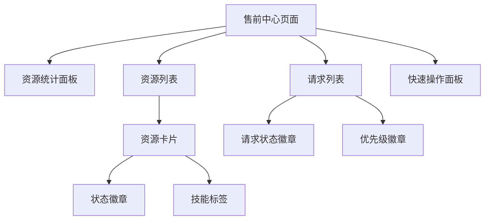

# 售前控制器（Presales Controller）技术文档

<cite>
**本文档引用的文件**
- [presales.controller.ts](file://crm-backend/src/controllers/presales.controller.ts)
- [presales.service.ts](file://crm-backend/src/services/presales.service.ts)
- [presales.routes.ts](file://crm-backend/src/routes/presales.routes.ts)
- [presales.validator.ts](file://crm-backend/src/validators/presales.validator.ts)
- [validate.ts](file://crm-backend/src/middlewares/validate.ts)
- [prisma.ts](file://crm-backend/src/repositories/prisma.ts)
- [response.ts](file://crm-backend/src/utils/response.ts)
- [errorHandler.ts](file://crm-backend/src/middlewares/errorHandler.ts)
- [schema.prisma](file://crm-backend/prisma/schema.prisma)
- [index.tsx](file://crm-frontend/src/pages/PreSales/index.tsx)
</cite>

## 目录
1. [项目概述](#项目概述)
2. [架构概览](#架构概览)
3. [核心组件分析](#核心组件分析)
4. [API接口规范](#api接口规范)
5. [数据模型设计](#数据模型设计)
6. [AI智能匹配功能](#ai智能匹配功能)
7. [错误处理机制](#错误处理机制)
8. [性能优化策略](#性能优化策略)
9. [前端集成指南](#前端集成指南)
10. [部署与配置](#部署与配置)

## 项目概述

售前控制器是销售AI CRM系统中的核心模块，负责管理售前资源和售前请求的完整生命周期。该系统通过智能化的资源匹配算法和AI辅助功能，为企业提供高效的售前支持管理解决方案。

### 主要功能特性

- **资源管理**：创建、查询、更新、删除售前资源信息
- **请求管理**：处理售前支持请求的全生命周期
- **智能匹配**：基于技能和经验的资源智能匹配
- **AI增强**：利用机器学习算法进行精准资源分配
- **统计分析**：提供实时的资源使用情况统计
- **工作负载监控**：跟踪资源的工作负载和可用性

## 架构概览

系统采用经典的三层架构设计，确保了良好的可维护性和扩展性。



**图表来源**
- [presales.controller.ts:1-248](file://crm-backend/src/controllers/presales.controller.ts#L1-L248)
- [presales.routes.ts:1-536](file://crm-backend/src/routes/presales.routes.ts#L1-L536)
- [presales.service.ts:1-695](file://crm-backend/src/services/presales.service.ts#L1-L695)

## 核心组件分析

### 控制器层（Controller Layer）

PresalesController作为业务逻辑的入口点，提供了完整的RESTful API接口。

#### 资源管理功能



**图表来源**
- [presales.controller.ts:12-83](file://crm-backend/src/controllers/presales.controller.ts#L12-L83)
- [presales.service.ts:19-121](file://crm-backend/src/services/presales.service.ts#L19-L121)

#### 请求管理功能

控制器实现了完整的请求生命周期管理：

- **创建请求**：支持多种请求类型（技术支持、方案设计、POC演示等）
- **状态管理**：支持请求状态的动态变更
- **权限控制**：基于用户身份的访问控制
- **智能分配**：自动化的资源分配机制

**章节来源**
- [presales.controller.ts:87-177](file://crm-backend/src/controllers/presales.controller.ts#L87-L177)

### 服务层（Service Layer）

PresalesService封装了复杂的业务逻辑，包括数据验证、查询优化和AI集成。

#### 查询优化策略

服务层采用了并行查询优化技术，显著提升了响应速度：



**图表来源**
- [presales.service.ts:154-218](file://crm-backend/src/services/presales.service.ts#L154-L218)

**章节来源**
- [presales.service.ts:1-695](file://crm-backend/src/services/presales.service.ts#L1-L695)

## API接口规范

### 资源管理API

| 方法 | 路径 | 功能描述 |
|------|------|----------|
| GET | `/api/v1/presales/resources` | 获取售前资源列表 |
| POST | `/api/v1/presales/resources` | 创建售前资源 |
| GET | `/api/v1/presales/resources/:id` | 获取资源详情 |
| PUT | `/api/v1/presales/resources/:id` | 更新资源信息 |
| DELETE | `/api/v1/presales/resources/:id` | 删除资源 |

### 请求管理API

| 方法 | 路径 | 功能描述 |
|------|------|----------|
| GET | `/api/v1/presales/requests` | 获取请求列表 |
| POST | `/api/v1/presales/requests` | 创建售前请求 |
| GET | `/api/v1/presales/requests/:id` | 获取请求详情 |
| PUT | `/api/v1/presales/requests/:id` | 更新请求信息 |
| PATCH | `/api/v1/presales/requests/:id/status` | 更新请求状态 |
| DELETE | `/api/v1/presales/requests/:id` | 删除请求 |

### 智能匹配API

| 方法 | 路径 | 功能描述 |
|------|------|----------|
| GET | `/api/v1/presales/requests/:id/match` | 基础技能匹配 |
| GET | `/api/v1/presales/requests/:id/smart-match` | AI智能匹配 |
| POST | `/api/v1/presales/requests/:id/auto-assign` | 自动分配资源 |

**章节来源**
- [presales.routes.ts:1-536](file://crm-backend/src/routes/presales.routes.ts#L1-L536)

## 数据模型设计

系统基于Prisma ORM设计，采用了强类型的数据模型定义。

### 核心数据模型



**图表来源**
- [schema.prisma:464-521](file://crm-backend/prisma/schema.prisma#L464-L521)
- [schema.prisma:766-783](file://crm-backend/prisma/schema.prisma#L766-L783)

### 数据验证规则

系统使用Zod进行严格的输入验证，确保数据完整性。

**章节来源**
- [presales.validator.ts:1-136](file://crm-backend/src/validators/presales.validator.ts#L1-L136)

## AI智能匹配功能

### 匹配算法实现

系统集成了多层次的智能匹配算法，从基础技能匹配到AI深度学习匹配。

#### 基础技能匹配算法

```mermaid
flowchart TD
Start([开始匹配]) --> LoadReq[加载请求信息]
LoadReq --> GetSkills[获取所需技能]
GetSkills --> LoadRes[加载可用资源]
LoadRes --> CalcScore[计算匹配分数]
CalcScore --> ScoreCalc{
匹配分数计算公式<br/>
matchScore = (匹配技能数/总技能数) × 100
}
ScoreCalc --> SortRes[按分数排序]
SortRes --> ReturnRes[返回匹配结果]
ReturnRes --> End([结束])
```

**图表来源**
- [presales.service.ts:399-432](file://crm-backend/src/services/presales.service.ts#L399-L432)

#### AI智能匹配算法

AI匹配算法考虑了更多维度的因素：

1. **技能匹配度**：基于技能重叠度计算
2. **工作经验**：考虑相关领域的工作经验
3. **资源负载**：避免过度分配
4. **地理位置**：考虑距离因素
5. **历史成功率**：基于历史表现预测成功率

**章节来源**
- [presales.service.ts:440-503](file://crm-backend/src/services/presales.service.ts#L440-L503)

## 错误处理机制

系统实现了完善的错误处理机制，确保了系统的稳定性和用户体验。

### 错误分类与处理



**图表来源**
- [errorHandler.ts:1-89](file://crm-backend/src/middlewares/errorHandler.ts#L1-L89)

### 错误响应格式

系统采用统一的错误响应格式，便于前端处理：

```typescript
interface ErrorResponse {
  success: false;
  message: string;
  error: {
    code: string;
    details?: unknown;
  };
}
```

**章节来源**
- [response.ts:1-127](file://crm-backend/src/utils/response.ts#L1-L127)

## 性能优化策略

### 查询优化

系统采用了多种查询优化策略：

1. **并行查询**：同时执行COUNT和SELECT查询
2. **分页查询**：支持大数量数据的分页处理
3. **索引优化**：为常用查询字段建立索引
4. **缓存策略**：对热点数据进行缓存

### 资源分配优化



**图表来源**
- [presales.service.ts:440-503](file://crm-backend/src/services/presales.service.ts#L440-L503)

**章节来源**
- [presales.service.ts:555-609](file://crm-backend/src/services/presales.service.ts#L555-L609)

## 前端集成指南

### 前端页面结构

前端售前中心页面采用了响应式设计，支持多种设备访问。

#### 页面组件结构



**图表来源**
- [index.tsx:1-254](file://crm-frontend/src/pages/PreSales/index.tsx#L1-L254)

### API集成示例

前端通过HTTP请求与后端API进行交互：

```javascript
// 获取资源列表
fetch('/api/v1/presales/resources?page=1&limit=10')
  .then(response => response.json())
  .then(data => console.log(data));

// 创建新请求
fetch('/api/v1/presales/requests', {
  method: 'POST',
  headers: {
    'Content-Type': 'application/json',
    'Authorization': 'Bearer ' + token
  },
  body: JSON.stringify({
    customerId: 'customer-id',
    type: '技术支持',
    title: '系统集成问题',
    priority: 'high'
  })
})
```

**章节来源**
- [index.tsx:1-254](file://crm-frontend/src/pages/PreSales/index.tsx#L1-L254)

## 部署与配置

### 环境配置

系统支持多种环境配置，包括开发、测试和生产环境。

#### 数据库配置

```typescript
// 数据库连接配置
const prisma = new PrismaClient({
  log: process.env.NODE_ENV === 'development' 
    ? ['query', 'info', 'warn', 'error']
    : ['error'],
});
```

#### API配置

```typescript
// API路由前缀
const API_PREFIX = '/api/v1';
const CORS_ORIGIN = process.env.CORS_ORIGIN || '*';
```

### 监控与日志

系统集成了完整的监控和日志功能：

- **请求日志**：记录所有API请求的详细信息
- **错误日志**：捕获和记录系统错误
- **性能监控**：监控API响应时间和数据库查询性能
- **健康检查**：提供系统健康状态检查接口

**章节来源**
- [app.ts:1-88](file://crm-backend/src/app.ts#L1-L88)
- [prisma.ts:1-9](file://crm-backend/src/repositories/prisma.ts#L1-L9)

## 总结

售前控制器模块是销售AI CRM系统的核心组成部分，通过其完善的架构设计和丰富的功能特性，为企业提供了高效的售前支持管理解决方案。系统不仅具备传统的企业资源规划功能，还集成了先进的AI智能匹配算法，能够根据业务需求自动分配最合适的资源。

### 主要优势

1. **智能化程度高**：通过AI算法实现精准的资源匹配和分配
2. **扩展性强**：模块化设计便于功能扩展和维护
3. **性能优异**：采用多种优化策略确保系统的高性能运行
4. **用户体验好**：前后端分离设计提供优秀的用户界面
5. **安全性可靠**：完善的认证授权和错误处理机制

该模块为企业的售前管理工作提供了强有力的技术支撑，有助于提升销售效率和服务质量。