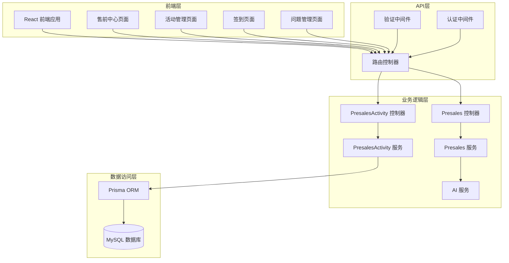
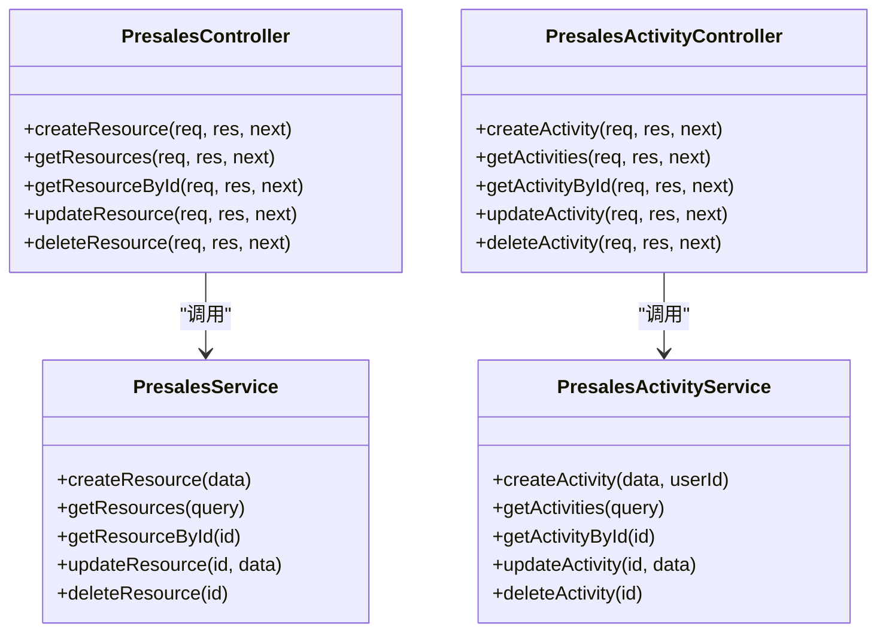
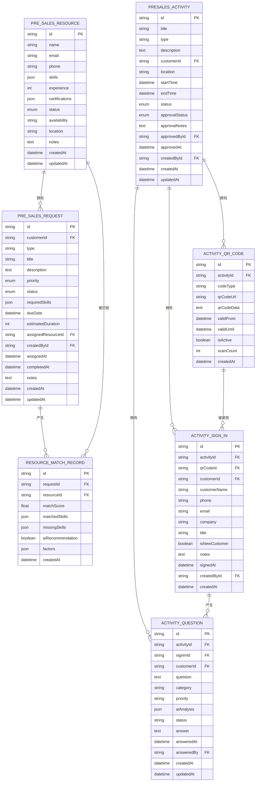
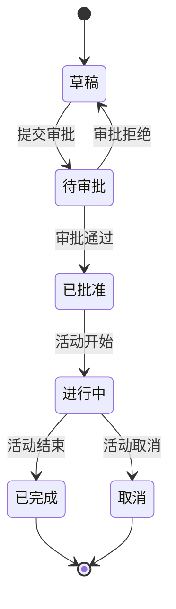
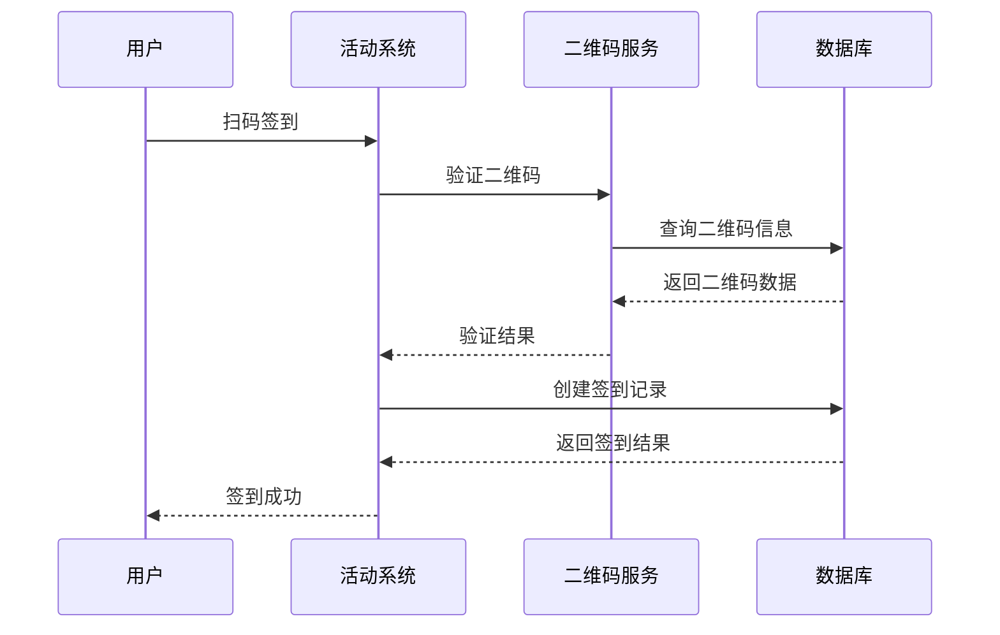
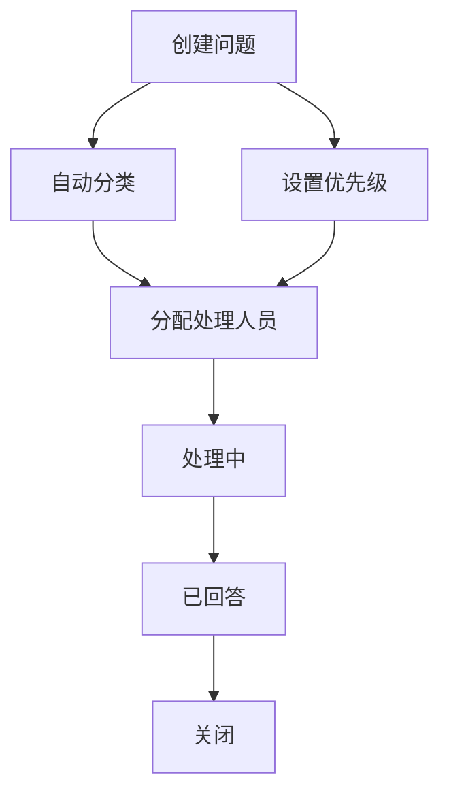
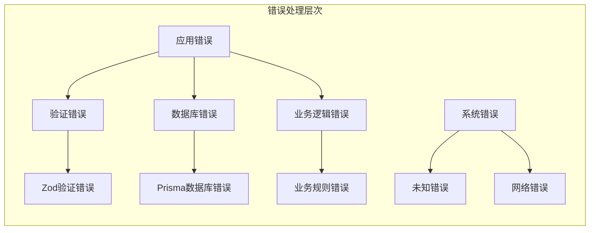
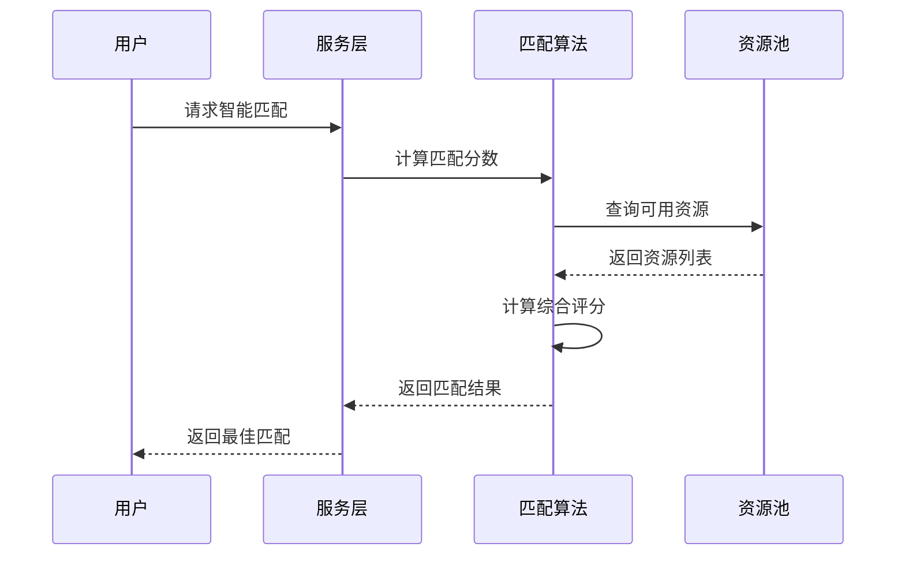
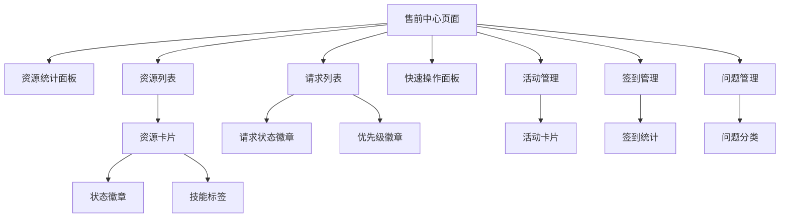

# 售前活动控制器

<cite>
**本文档引用的文件**
- [presales.controller.ts](file://crm-backend/src/controllers/presales.controller.ts)
- [presalesActivity.controller.ts](file://crm-backend/src/controllers/presalesActivity.controller.ts)
- [presales.service.ts](file://crm-backend/src/services/presales.service.ts)
- [presalesActivity.service.ts](file://crm-backend/src/services/presalesActivity.service.ts)
- [presales.routes.ts](file://crm-backend/src/routes/presales.routes.ts)
- [presalesActivity.routes.ts](file://crm-backend/src/routes/presalesActivity.routes.ts)
- [presales.validator.ts](file://crm-backend/src/validators/presales.validator.ts)
- [presalesActivity.validator.ts](file://crm-backend/src/validators/presalesActivity.validator.ts)
- [validate.ts](file://crm-backend/src/middlewares/validate.ts)
- [prisma.ts](file://crm-backend/src/repositories/prisma.ts)
- [response.ts](file://crm-backend/src/utils/response.ts)
- [errorHandler.ts](file://crm-backend/src/middlewares/errorHandler.ts)
- [schema.prisma](file://crm-backend/prisma/schema.prisma)
- [index.tsx](file://crm-frontend/src/pages/PreSales/index.tsx)
</cite>

## 更新摘要
**所做更改**
- 新增完整的预销售活动管理系统架构分析
- 添加活动生命周期管理、QR码签到、问题管理等新功能模块
- 更新API接口规范以包含活动管理相关接口
- 扩展数据模型设计以支持活动、签到、问题等新实体
- 更新前端集成指南以反映新的活动管理页面结构

## 目录
1. [项目概述](#项目概述)
2. [架构概览](#架构概览)
3. [核心组件分析](#核心组件分析)
4. [API接口规范](#api接口规范)
5. [数据模型设计](#数据模型设计)
6. [AI智能匹配功能](#ai智能匹配功能)
7. [活动生命周期管理](#活动生命周期管理)
8. [QR码签到系统](#qrcode签到系统)
9. [问题管理系统](#问题管理系统)
10. [错误处理机制](#错误处理机制)
11. [性能优化策略](#性能优化策略)
12. [前端集成指南](#前端集成指南)
13. [部署与配置](#部署与配置)

## 项目概述

预销售活动控制器是销售AI CRM系统中的核心模块，现已从基础的资源管理升级为完整的预销售活动管理系统。该系统通过智能化的资源匹配算法、完整的活动生命周期管理和丰富的互动功能，为企业提供全方位的售前支持管理解决方案。

### 主要功能特性

- **活动管理**：完整的活动生命周期管理（创建、审批、执行、完成）
- **QR码签到**：基于二维码的智能签到系统，支持客户信息管理和统计分析
- **问题管理**：活动过程中的问题收集、分类、处理和跟踪
- **资源管理**：售前资源的创建、查询、更新、删除
- **请求管理**：售前支持请求的全生命周期管理
- **智能匹配**：基于技能和经验的资源智能匹配
- **AI增强**：利用机器学习算法进行精准资源分配和问题分类
- **统计分析**：提供实时的活动参与情况和问题处理统计
- **工作负载监控**：跟踪资源的工作负载和可用性

## 架构概览

系统采用经典的三层架构设计，现已扩展为支持活动管理的完整架构，确保了良好的可维护性和扩展性。



**图表来源**
- [presales.controller.ts:1-248](file://crm-backend/src/controllers/presales.controller.ts#L1-L248)
- [presalesActivity.controller.ts:1-338](file://crm-backend/src/controllers/presalesActivity.controller.ts#L1-L338)
- [presales.routes.ts:1-536](file://crm-backend/src/routes/presales.routes.ts#L1-L536)
- [presalesActivity.routes.ts:1-692](file://crm-backend/src/routes/presalesActivity.routes.ts#L1-L692)

## 核心组件分析

### 控制器层（Controller Layer）

PresalesController和PresalesActivityController作为业务逻辑的入口点，提供了完整的RESTful API接口，现已扩展为支持活动管理的完整控制器体系。

#### 资源管理功能



**图表来源**
- [presales.controller.ts:12-83](file://crm-backend/src/controllers/presales.controller.ts#L12-L83)
- [presalesActivity.controller.ts:16-88](file://crm-backend/src/controllers/presalesActivity.controller.ts#L16-L88)
- [presales.service.ts:19-121](file://crm-backend/src/services/presales.service.ts#L19-L121)
- [presalesActivity.service.ts:32-204](file://crm-backend/src/services/presalesActivity.service.ts#L32-L204)

#### 请求管理功能

控制器实现了完整的请求生命周期管理：

- **创建请求**：支持多种请求类型（技术支持、方案设计、POC演示等）
- **状态管理**：支持请求状态的动态变更
- **权限控制**：基于用户身份的访问控制
- **智能分配**：自动化的资源分配机制

**章节来源**
- [presales.controller.ts:87-177](file://crm-backend/src/controllers/presales.controller.ts#L87-L177)

### 服务层（Service Layer）

PresalesService和PresalesActivityService封装了复杂的业务逻辑，包括数据验证、查询优化和AI集成。

#### 查询优化策略

服务层采用了并行查询优化技术，显著提升了响应速度：


**图表来源**
- [presalesActivity.service.ts:100-133](file://crm-backend/src/services/presalesActivity.service.ts#L100-L133)

**章节来源**
- [presalesActivity.service.ts:1-766](file://crm-backend/src/services/presalesActivity.service.ts#L1-L766)

## API接口规范

### 资源管理API

| 方法 | 路径 | 功能描述 |
|------|------|----------|
| GET | `/api/v1/presales/resources` | 获取售前资源列表 |
| POST | `/api/v1/presales/resources` | 创建售前资源 |
| GET | `/api/v1/presales/resources/:id` | 获取资源详情 |
| PUT | `/api/v1/presales/resources/:id` | 更新资源信息 |
| DELETE | `/api/v1/presales/resources/:id` | 删除资源 |

### 请求管理API

| 方法 | 路径 | 功能描述 |
|------|------|----------|
| GET | `/api/v1/presales/requests` | 获取请求列表 |
| POST | `/api/v1/presales/requests` | 创建售前请求 |
| GET | `/api/v1/presales/requests/:id` | 获取请求详情 |
| PUT | `/api/v1/presales/requests/:id` | 更新请求信息 |
| PATCH | `/api/v1/presales/requests/:id/status` | 更新请求状态 |
| DELETE | `/api/v1/presales/requests/:id` | 删除请求 |

### 智能匹配API

| 方法 | 路径 | 功能描述 |
|------|------|----------|
| GET | `/api/v1/presales/requests/:id/match` | 基础技能匹配 |
| GET | `/api/v1/presales/requests/:id/smart-match` | AI智能匹配 |
| POST | `/api/v1/presales/requests/:id/auto-assign` | 自动分配资源 |

### 活动管理API

| 方法 | 路径 | 功能描述 |
|------|------|----------|
| GET | `/api/v1/presales/activities` | 获取活动列表 |
| POST | `/api/v1/presales/activities` | 创建活动 |
| GET | `/api/v1/presales/activities/:id` | 获取活动详情 |
| PUT | `/api/v1/presales/activities/:id` | 更新活动信息 |
| DELETE | `/api/v1/presales/activities/:id` | 删除活动 |
| PATCH | `/api/v1/presales/activities/:id/status` | 更新活动状态 |

### 审批流程API

| 方法 | 路径 | 功能描述 |
|------|------|----------|
| POST | `/api/v1/presales/activities/:id/submit-approval` | 提交审批 |
| POST | `/api/v1/presales/activities/:id/approve` | 审批通过 |
| POST | `/api/v1/presales/activities/:id/reject` | 审批拒绝 |

### QR码管理API

| 方法 | 路径 | 功能描述 |
|------|------|----------|
| POST | `/api/v1/presales/activities/:id/qrcodes` | 生成二维码 |
| GET | `/api/v1/presales/activities/:id/qrcodes` | 获取二维码列表 |
| GET | `/api/v1/presales/qrcodes/:qrCodeId` | 获取二维码详情 |

### 签到功能API

| 方法 | 路径 | 功能描述 |
|------|------|----------|
| POST | `/api/v1/presales/sign-in` | 扫码签到 |
| GET | `/api/v1/presales/activities/:id/sign-ins` | 获取签到记录 |
| GET | `/api/v1/presales/sign-ins/:signInId` | 获取签到详情 |

### 问题管理API

| 方法 | 路径 | 功能描述 |
|------|------|----------|
| POST | `/api/v1/presales/sign-ins/:signInId/questions` | 提交问题 |
| GET | `/api/v1/presales/activities/:id/questions` | 获取问题列表 |
| PATCH | `/api/v1/presales/questions/:questionId` | 更新问题 |
| POST | `/api/v1/presales/questions/:questionId/answer` | 回答问题 |

**章节来源**
- [presales.routes.ts:1-536](file://crm-backend/src/routes/presales.routes.ts#L1-L536)
- [presalesActivity.routes.ts:1-692](file://crm-backend/src/routes/presalesActivity.routes.ts#L1-L692)

## 数据模型设计

系统基于Prisma ORM设计，现已扩展为支持活动管理的完整数据模型体系。

### 核心数据模型



**图表来源**
- [schema.prisma:809-918](file://crm-backend/prisma/schema.prisma#L809-L918)

### 数据验证规则

系统使用Zod进行严格的输入验证，确保数据完整性。

**章节来源**
- [presales.validator.ts:1-136](file://crm-backend/src/validators/presales.validator.ts#L1-L136)
- [presalesActivity.validator.ts:1-213](file://crm-backend/src/validators/presalesActivity.validator.ts#L1-L213)

## AI智能匹配功能

### 匹配算法实现

系统集成了多层次的智能匹配算法，从基础技能匹配到AI深度学习匹配。

#### 基础技能匹配算法

```mermaid
flowchart TD
Start([开始匹配]) --> LoadReq[加载请求信息]
LoadReq --> GetSkills[获取所需技能]
GetSkills --> LoadRes[加载可用资源]
LoadRes --> CalcScore[计算匹配分数]
CalcScore --> ScoreCalc{
匹配分数计算公式<br/>
matchScore = (匹配技能数/总技能数) × 100
}
ScoreCalc --> SortRes[按分数排序]
SortRes --> ReturnRes[返回匹配结果]
ReturnRes --> End([结束])
```

**图表来源**
- [presales.service.ts:399-432](file://crm-backend/src/services/presales.service.ts#L399-L432)

#### AI智能匹配算法

AI匹配算法考虑了更多维度的因素：

1. **技能匹配度**：基于技能重叠度计算
2. **工作经验**：考虑相关领域的工作经验
3. **资源负载**：避免过度分配
4. **地理位置**：考虑距离因素
5. **历史成功率**：基于历史表现预测成功率

**章节来源**
- [presales.service.ts:440-503](file://crm-backend/src/services/presales.service.ts#L440-L503)

## 活动生命周期管理

### 活动状态流转

系统实现了完整的活动生命周期管理，支持从草稿到完成的全流程管理。



**图表来源**
- [schema.prisma:119-126](file://crm-backend/prisma/schema.prisma#L119-L126)
- [presalesActivity.validator.ts:6-11](file://crm-backend/src/validators/presalesActivity.validator.ts#L6-L11)

### 审批流程

系统提供了完整的审批流程管理，支持多级审批和审批意见记录。

**章节来源**
- [presalesActivity.controller.ts:105-159](file://crm-backend/src/controllers/presalesActivity.controller.ts#L105-L159)
- [presalesActivity.service.ts:216-280](file://crm-backend/src/services/presalesActivity.service.ts#L216-L280)

## QR码签到系统

### 二维码生成与验证

系统支持生成不同类型的二维码，并提供完整的签到验证机制。



**图表来源**
- [presalesActivity.service.ts:404-489](file://crm-backend/src/services/presalesActivity.service.ts#L404-L489)

### 签到统计分析

系统提供详细的签到统计分析功能，支持新老客户识别和企业分布统计。

**章节来源**
- [presalesActivity.controller.ts:209-256](file://crm-backend/src/controllers/presalesActivity.controller.ts#L209-L256)
- [presalesActivity.service.ts:693-763](file://crm-backend/src/services/presalesActivity.service.ts#L693-L763)

## 问题管理系统

### 问题分类与处理

系统支持问题的分类、优先级管理和完整的处理流程。



**图表来源**
- [presalesActivity.validator.ts:24-36](file://crm-backend/src/validators/presalesActivity.validator.ts#L24-L36)

### AI智能分类

系统集成了AI智能分类功能，能够自动识别问题类型和优先级。

**章节来源**
- [presalesActivity.controller.ts:258-319](file://crm-backend/src/controllers/presalesActivity.controller.ts#L258-L319)
- [presalesActivity.service.ts:675-691](file://crm-backend/src/services/presalesActivity.service.ts#L675-L691)

## 错误处理机制

系统实现了完善的错误处理机制，确保了系统的稳定性和用户体验。

### 错误分类与处理



**图表来源**
- [errorHandler.ts:1-89](file://crm-backend/src/middlewares/errorHandler.ts#L1-L89)

### 错误响应格式

系统采用统一的错误响应格式，便于前端处理：

```typescript
interface ErrorResponse {
  success: false;
  message: string;
  error: {
    code: string;
    details?: unknown;
  };
}
```

**章节来源**
- [response.ts:1-127](file://crm-backend/src/utils/response.ts#L1-L127)

## 性能优化策略

### 查询优化

系统采用了多种查询优化策略：

1. **并行查询**：同时执行COUNT和SELECT查询
2. **分页查询**：支持大数量数据的分页处理
3. **索引优化**：为常用查询字段建立索引
4. **缓存策略**：对热点数据进行缓存

### 资源分配优化



**图表来源**
- [presales.service.ts:440-503](file://crm-backend/src/services/presales.service.ts#L440-L503)

**章节来源**
- [presales.service.ts:555-609](file://crm-backend/src/services/presales.service.ts#L555-L609)

## 前端集成指南

### 前端页面结构

前端售前中心页面采用了响应式设计，支持多种设备访问。

#### 页面组件结构



**图表来源**
- [index.tsx:1-447](file://crm-frontend/src/pages/PreSales/index.tsx#L1-L447)

### API集成示例

前端通过HTTP请求与后端API进行交互：

```javascript
// 获取活动列表
fetch('/api/v1/presales/activities?page=1&limit=10')
  .then(response => response.json())
  .then(data => console.log(data));

// 创建新活动
fetch('/api/v1/presales/activities', {
  method: 'POST',
  headers: {
    'Content-Type': 'application/json',
    'Authorization': 'Bearer ' + token
  },
  body: JSON.stringify({
    title: '产品演示活动',
    type: 'demo',
    startTime: '2026-03-25T14:00:00Z',
    endTime: '2026-03-25T16:00:00Z',
    location: '深圳华为基地'
  })
})
```

**章节来源**
- [index.tsx:1-447](file://crm-frontend/src/pages/PreSales/index.tsx#L1-L447)

## 部署与配置

### 环境配置

系统支持多种环境配置，包括开发、测试和生产环境。

#### 数据库配置

```typescript
// 数据库连接配置
const prisma = new PrismaClient({
  log: process.env.NODE_ENV === 'development' 
    ? ['query', 'info', 'warn', 'error']
    : ['error'],
});
```

#### API配置

```typescript
// API路由前缀
const API_PREFIX = '/api/v1';
const CORS_ORIGIN = process.env.CORS_ORIGIN || '*';
```

### 监控与日志

系统集成了完整的监控和日志功能：

- **请求日志**：记录所有API请求的详细信息
- **错误日志**：捕获和记录系统错误
- **性能监控**：监控API响应时间和数据库查询性能
- **健康检查**：提供系统健康状态检查接口

**章节来源**
- [app.ts:1-88](file://crm-backend/src/app.ts#L1-L88)
- [prisma.ts:1-9](file://crm-backend/src/repositories/prisma.ts#L1-L9)

## 总结

预销售活动控制器模块是销售AI CRM系统的核心组成部分，现已从基础的资源管理升级为完整的预销售活动管理系统。通过其完善的架构设计和丰富的功能特性，为企业提供了全方位的售前支持管理解决方案。

### 主要优势

1. **功能完整性高**：从资源管理扩展为完整的活动管理生态系统
2. **智能化程度高**：通过AI算法实现精准的资源匹配、问题分类和活动优化
3. **扩展性强**：模块化设计便于功能扩展和维护
4. **性能优异**：采用多种优化策略确保系统的高性能运行
5. **用户体验好**：前后端分离设计提供优秀的用户界面
6. **安全性可靠**：完善的认证授权和错误处理机制
7. **数据驱动**：提供全面的统计分析和业务洞察

该模块为企业的售前管理工作提供了强有力的技术支撑，有助于提升销售效率和服务质量，特别是在活动管理、客户互动和问题处理方面提供了完整的解决方案。