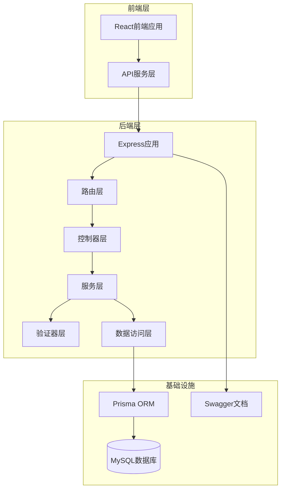
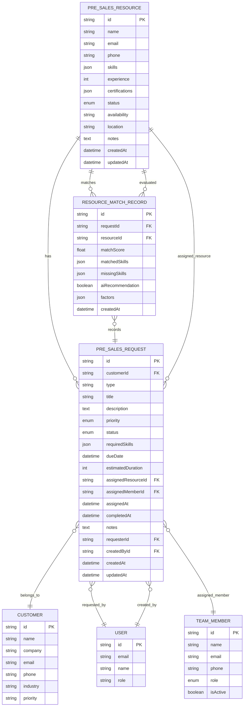
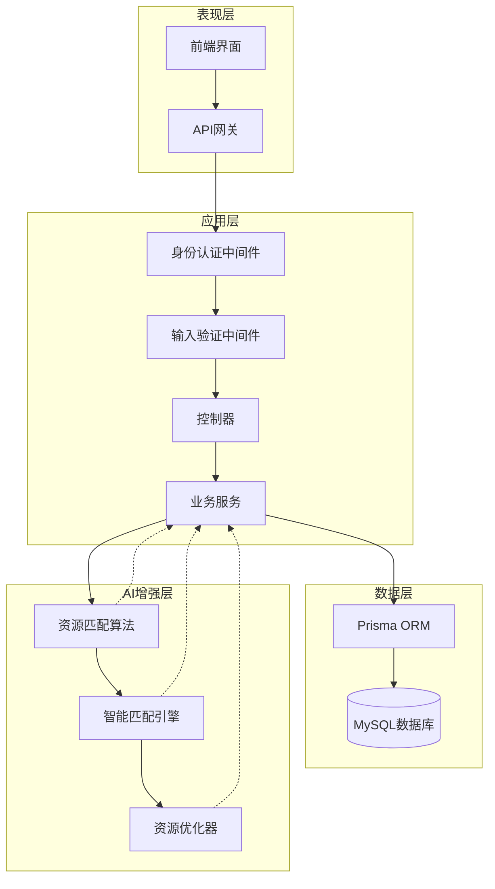
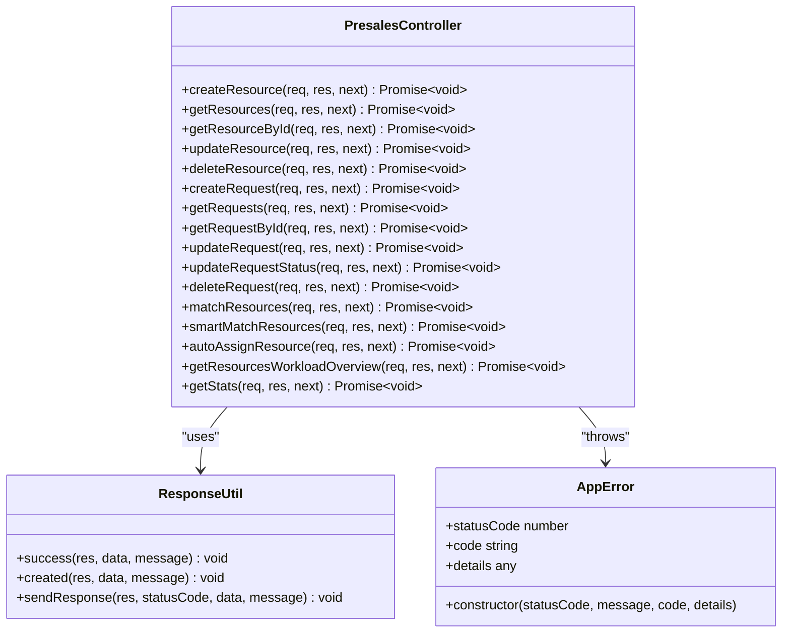
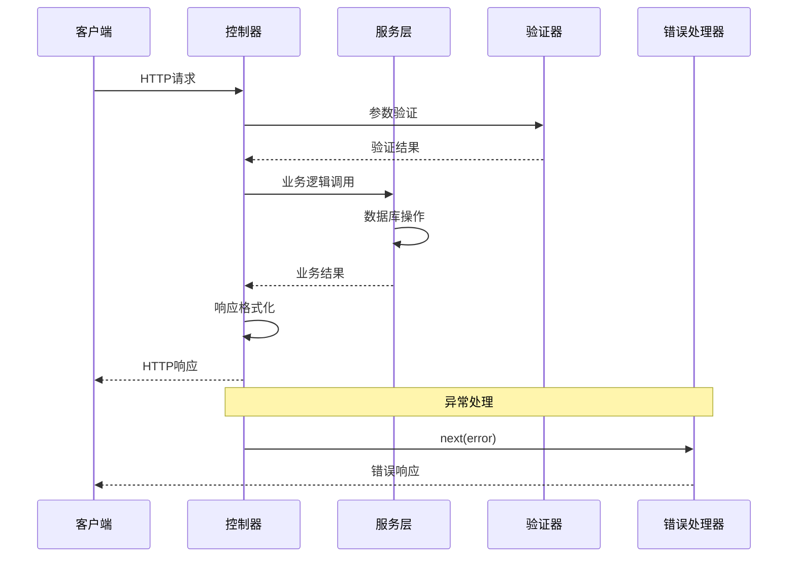
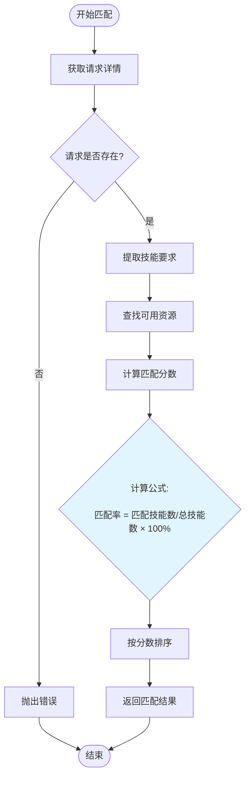
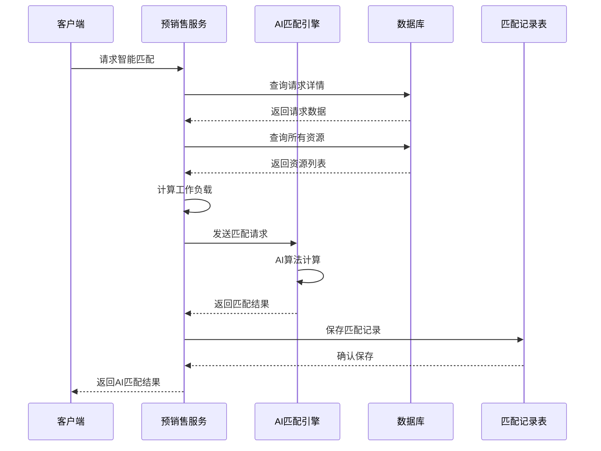
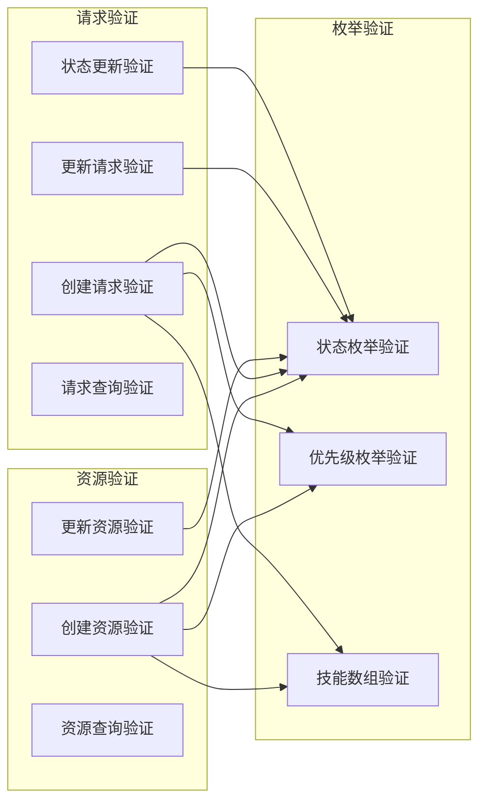
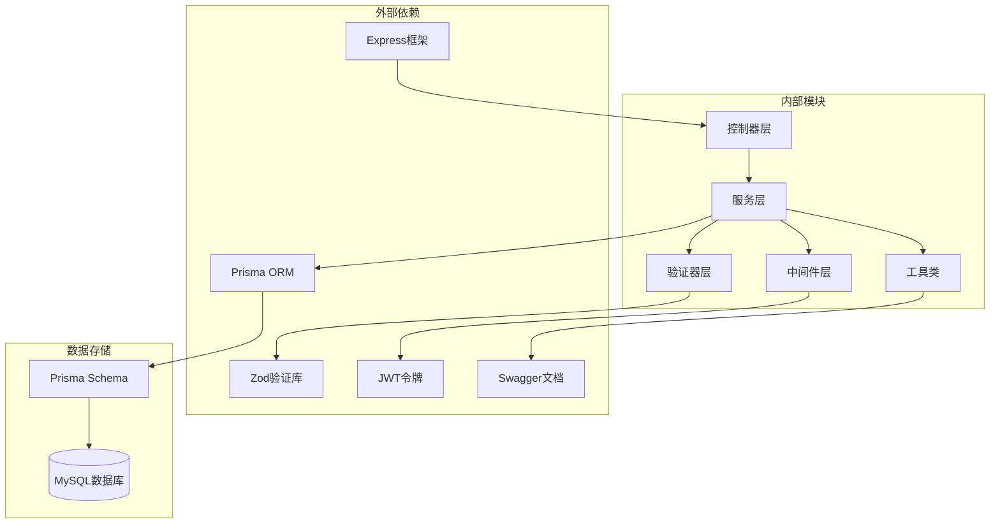
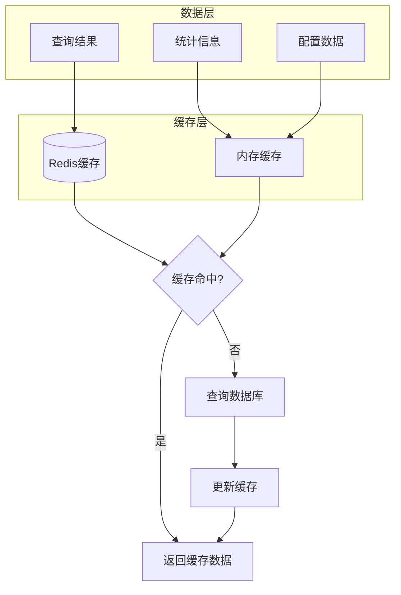

# 预销售服务

<cite>
**本文档引用的文件**
- [presales.controller.ts](file://crm-backend/src/controllers/presales.controller.ts)
- [presales.service.ts](file://crm-backend/src/services/presales.service.ts)
- [presales.routes.ts](file://crm-backend/src/routes/presales.routes.ts)
- [presales.validator.ts](file://crm-backend/src/validators/presales.validator.ts)
- [auth.ts](file://crm-backend/src/middlewares/auth.ts)
- [response.ts](file://crm-backend/src/utils/response.ts)
- [errorHandler.ts](file://crm-backend/src/middlewares/errorHandler.ts)
- [prisma.ts](file://crm-backend/src/repositories/prisma.ts)
- [schema.prisma](file://crm-backend/prisma/schema.prisma)
- [app.ts](file://crm-backend/src/app.ts)
- [api.ts](file://crm-frontend/src/services/api.ts)
- [index.tsx](file://crm-frontend/src/pages/PreSales/index.tsx)
</cite>

## 目录
1. [简介](#简介)
2. [项目结构](#项目结构)
3. [核心组件](#核心组件)
4. [架构概览](#架构概览)
5. [详细组件分析](#详细组件分析)
6. [依赖关系分析](#依赖关系分析)
7. [性能考虑](#性能考虑)
8. [故障排除指南](#故障排除指南)
9. [结论](#结论)

## 简介

预销售服务是销售AI CRM系统的核心模块之一，专门负责协调售前资源和支持请求。该系统通过智能化的资源匹配算法和AI增强功能，帮助销售团队高效地管理和分配售前支持资源。

系统采用前后端分离架构，后端使用Node.js + Express + Prisma ORM，前端使用React + TypeScript构建现代化的用户界面。预销售服务集成了多种AI功能，包括智能资源匹配、自动分配和工作负载优化等。

## 项目结构

预销售服务在整个CRM系统中占据重要地位，主要由以下层次组成：

**图表来源**
- [app.ts:12-88](file://crm-backend/src/app.ts#L12-L88)
- [presales.routes.ts:1-536](file://crm-backend/src/routes/presales.routes.ts#L1-L536)

**章节来源**
- [app.ts:12-88](file://crm-backend/src/app.ts#L12-L88)
- [schema.prisma:462-521](file://crm-backend/prisma/schema.prisma#L462-L521)

## 核心组件

预销售服务包含三个核心实体：资源(Resource)、请求(Request)和匹配记录(MatchRecord)，这些实体通过复杂的关联关系实现完整的业务流程。

### 数据模型关系

**图表来源**
- [schema.prisma:462-521](file://crm-backend/prisma/schema.prisma#L462-L521)
- [schema.prisma:765-783](file://crm-backend/prisma/schema.prisma#L765-L783)

### 核心功能特性

预销售服务提供以下核心功能：

1. **资源管理**：创建、查询、更新和删除售前资源信息
2. **请求管理**：处理售前支持请求的完整生命周期
3. **智能匹配**：基于技能要求的资源智能匹配算法
4. **AI增强匹配**：利用机器学习算法进行精准资源分配
5. **工作负载监控**：实时跟踪和分析资源使用情况
6. **统计分析**：提供全面的业务统计数据和趋势分析

**章节来源**
- [presales.controller.ts:9-248](file://crm-backend/src/controllers/presales.controller.ts#L9-L248)
- [presales.service.ts:10-695](file://crm-backend/src/services/presales.service.ts#L10-L695)

## 架构概览

预销售服务采用经典的三层架构模式，确保了良好的可维护性和扩展性。

**图表来源**
- [auth.ts:13-69](file://crm-backend/src/middlewares/auth.ts#L13-L69)
- [presales.routes.ts:1-536](file://crm-backend/src/routes/presales.routes.ts#L1-L536)
- [presales.service.ts:4-6](file://crm-backend/src/services/presales.service.ts#L4-L6)

## 详细组件分析

### 控制器层分析

控制器层作为系统的入口点，负责处理HTTP请求并协调服务层的业务逻辑。

#### 资源管理控制器

**图表来源**
- [presales.controller.ts:9-248](file://crm-backend/src/controllers/presales.controller.ts#L9-L248)
- [response.ts:19-31](file://crm-backend/src/utils/response.ts#L19-L31)

#### 请求处理流程

**图表来源**
- [presales.controller.ts:16-23](file://crm-backend/src/controllers/presales.controller.ts#L16-L23)
- [errorHandler.ts:8-74](file://crm-backend/src/middlewares/errorHandler.ts#L8-L74)

**章节来源**
- [presales.controller.ts:9-248](file://crm-backend/src/controllers/presales.controller.ts#L9-L248)
- [response.ts:108-127](file://crm-backend/src/utils/response.ts#L108-L127)

### 服务层分析

服务层实现了预销售系统的核心业务逻辑，包括资源管理、请求处理和智能匹配等功能。

#### 资源匹配算法

**图表来源**
- [presales.service.ts:399-432](file://crm-backend/src/services/presales.service.ts#L399-L432)

#### AI智能匹配流程

**图表来源**
- [presales.service.ts:440-503](file://crm-backend/src/services/presales.service.ts#L440-L503)

**章节来源**
- [presales.service.ts:10-695](file://crm-backend/src/services/presales.service.ts#L10-L695)

### 路由层分析

路由层定义了预销售服务的所有API接口，采用RESTful设计原则。

#### API接口规范

| 接口 | 方法 | 路径 | 功能描述 |
|------|------|------|----------|
| 获取资源列表 | GET | `/presales/resources` | 分页获取售前资源列表 |
| 创建资源 | POST | `/presales/resources` | 创建新的售前资源 |
| 获取资源详情 | GET | `/presales/resources/:id` | 获取指定资源的详细信息 |
| 更新资源 | PUT | `/presales/resources/:id` | 更新资源信息 |
| 删除资源 | DELETE | `/presales/resources/:id` | 删除指定资源 |
| 获取请求列表 | GET | `/presales/requests` | 分页获取售前请求列表 |
| 创建请求 | POST | `/presales/requests` | 创建新的售前请求 |
| 获取请求详情 | GET | `/presales/requests/:id` | 获取指定请求的详细信息 |
| 更新请求 | PUT | `/presales/requests/:id` | 更新请求信息 |
| 更新请求状态 | PATCH | `/presales/requests/:id/status` | 更新请求状态 |
| 智能匹配 | GET | `/presales/requests/:id/match` | 基于技能的智能匹配 |
| AI智能匹配 | GET | `/presales/requests/:id/smart-match` | AI增强的智能匹配 |
| 自动分配 | POST | `/presales/requests/:id/auto-assign` | 自动分配最优资源 |
| 工作负载概览 | GET | `/presales/resources/workload` | 获取资源负载概览 |
| 统计信息 | GET | `/presales/stats` | 获取预销售统计信息 |

**章节来源**
- [presales.routes.ts:1-536](file://crm-backend/src/routes/presales.routes.ts#L1-L536)

### 验证器分析

验证器层确保所有输入数据的完整性和正确性，采用Zod库实现强大的类型检查。

#### 输入验证规则

**图表来源**
- [presales.validator.ts:1-136](file://crm-backend/src/validators/presales.validator.ts#L1-L136)

**章节来源**
- [presales.validator.ts:1-136](file://crm-backend/src/validators/presales.validator.ts#L1-L136)

## 依赖关系分析

预销售服务的依赖关系清晰明确，遵循了依赖倒置原则，便于测试和维护。

**图表来源**
- [app.ts:1-88](file://crm-backend/src/app.ts#L1-L88)
- [prisma.ts:1-9](file://crm-backend/src/repositories/prisma.ts#L1-L9)

### 核心依赖关系

| 模块 | 依赖模块 | 用途 |
|------|----------|------|
| PresalesController | PresalesService | 协调业务逻辑 |
| PresalesService | PrismaClient | 数据库操作 |
| PresalesService | ResourceMatchingService | AI匹配算法 |
| PresalesRoutes | PresalesController | 路由映射 |
| PresalesValidator | Zod | 输入验证 |
| AuthMiddleware | JWT | 身份认证 |
| ErrorHandler | ResponseUtil | 错误处理 |

**章节来源**
- [presales.controller.ts:1-5](file://crm-backend/src/controllers/presales.controller.ts#L1-L5)
- [presales.service.ts:1-6](file://crm-backend/src/services/presales.service.ts#L1-L6)
- [auth.ts:1-3](file://crm-backend/src/middlewares/auth.ts#L1-L3)

## 性能考虑

预销售服务在设计时充分考虑了性能优化，采用了多种策略来提升系统响应速度和吞吐量。

### 数据库优化策略

1. **索引优化**：为常用查询字段建立索引，如状态、优先级、创建时间等
2. **分页查询**：默认每页10条记录，支持自定义页码和大小
3. **批量操作**：支持批量资源分配和优化
4. **连接池管理**：合理配置数据库连接池参数

### 缓存策略

### 性能监控指标

| 指标类型 | 监控目标 | 告警阈值 |
|----------|----------|----------|
| 响应时间 | API平均响应时间 | < 500ms |
| 错误率 | 5xx错误比例 | < 1% |
| 并发用户 | 同时在线用户数 | > 1000 |
| 数据库连接 | 连接池使用率 | < 80% |
| 缓存命中率 | Redis命中率 | > 90% |

## 故障排除指南

### 常见错误类型及解决方案

#### 认证相关错误

| 错误代码 | 错误类型 | 描述 | 解决方案 |
|----------|----------|------|----------|
| 401 | UNAUTHORIZED | 未提供或无效的JWT令牌 | 检查Authorization头，重新登录获取新令牌 |
| 403 | FORBIDDEN | 权限不足 | 确认用户角色具有访问权限 |
| 404 | NOT_FOUND | 资源不存在 | 验证ID是否正确，检查数据库记录 |

#### 数据验证错误

| 错误代码 | 错误类型 | 描述 | 解决方案 |
|----------|----------|------|----------|
| 400 | BAD_REQUEST | 输入数据格式错误 | 检查字段类型和长度限制 |
| 400 | VALIDATION_ERROR | 字段验证失败 | 根据错误消息修正输入数据 |

#### 业务逻辑错误

| 错误代码 | 错误类型 | 描述 | 解决方案 |
|----------|----------|------|----------|
| 409 | CONFLICT | 资源冲突 | 检查唯一约束，修改重复数据 |
| 500 | INTERNAL_ERROR | 服务器内部错误 | 查看服务器日志，重启服务 |

### 调试技巧

1. **启用详细日志**：在开发环境中开启Prisma查询日志
2. **使用Swagger UI**：通过API文档测试接口功能
3. **数据库监控**：使用MySQL慢查询日志分析性能问题
4. **前端调试**：利用浏览器开发者工具检查网络请求

**章节来源**
- [errorHandler.ts:8-74](file://crm-backend/src/middlewares/errorHandler.ts#L8-L74)
- [response.ts:19-61](file://crm-backend/src/utils/response.ts#L19-L61)

## 结论

预销售服务作为销售AI CRM系统的核心模块，展现了现代企业级应用的设计理念和技术实践。系统通过清晰的架构分层、完善的业务逻辑和智能化的功能特性，为企业提供了高效的售前资源管理解决方案。

### 主要优势

1. **架构清晰**：采用经典的三层架构，职责分离明确
2. **功能完整**：涵盖资源管理、请求处理、智能匹配等核心功能
3. **扩展性强**：模块化设计便于功能扩展和维护
4. **性能优秀**：合理的数据库设计和缓存策略
5. **用户体验好**：直观的前端界面和丰富的交互功能

### 技术亮点

1. **AI集成**：深度整合机器学习算法进行智能匹配
2. **实时监控**：提供全面的统计分析和工作负载监控
3. **安全保障**：完善的认证授权和数据验证机制
4. **文档完善**：基于Swagger的API文档和错误处理机制

预销售服务不仅满足了当前的业务需求，还为未来的功能扩展和技术演进奠定了坚实的基础。通过持续的优化和完善，该系统将成为企业销售管理的重要支撑工具。