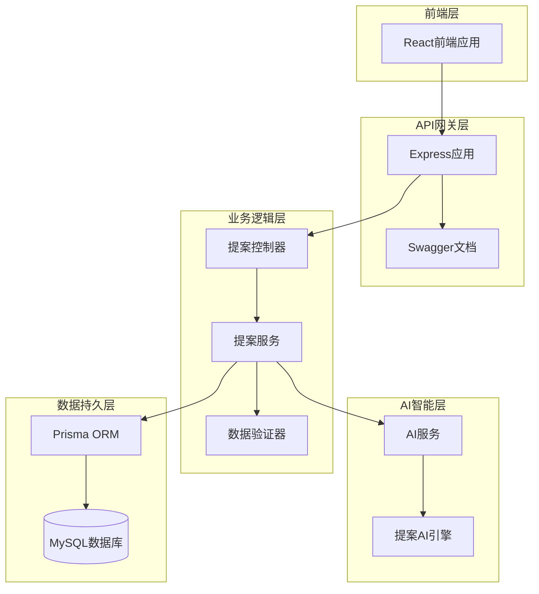
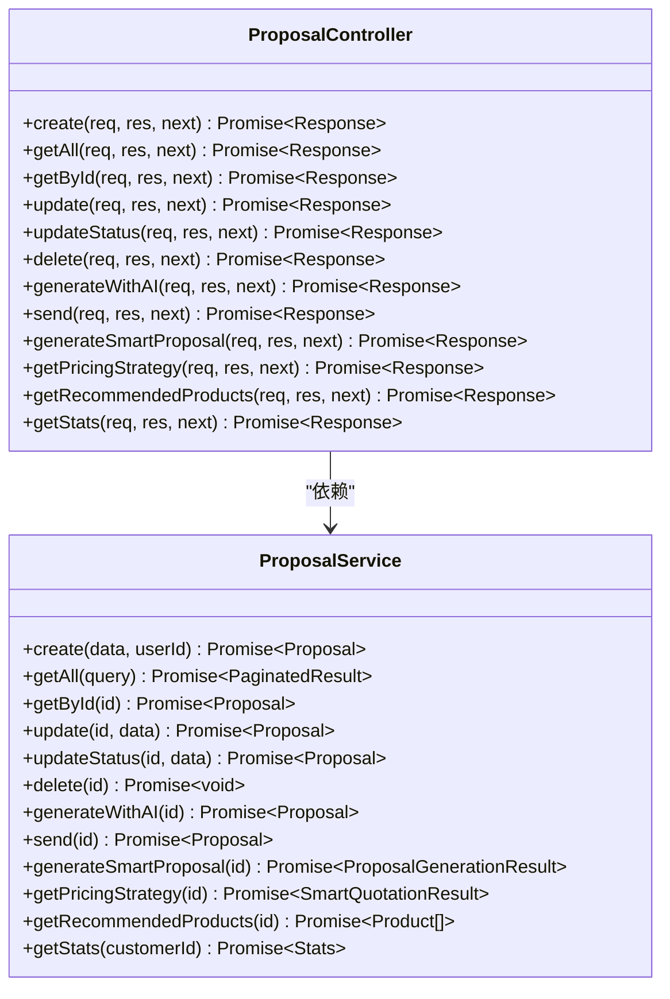
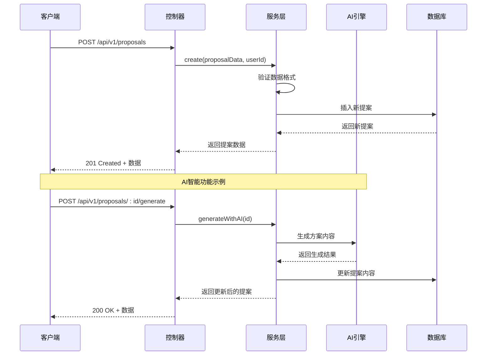
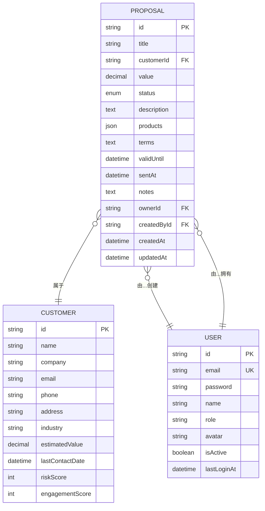
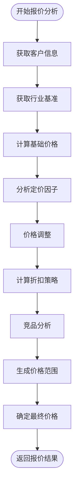
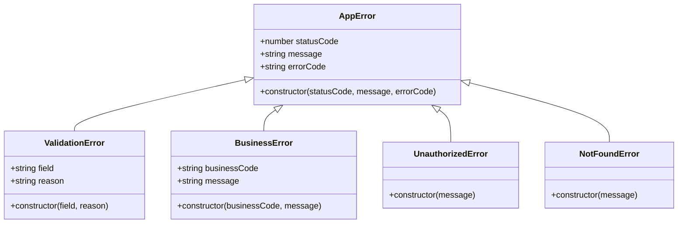
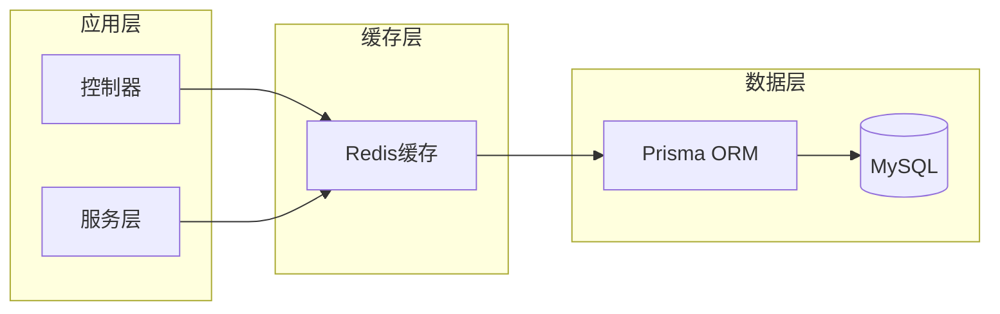
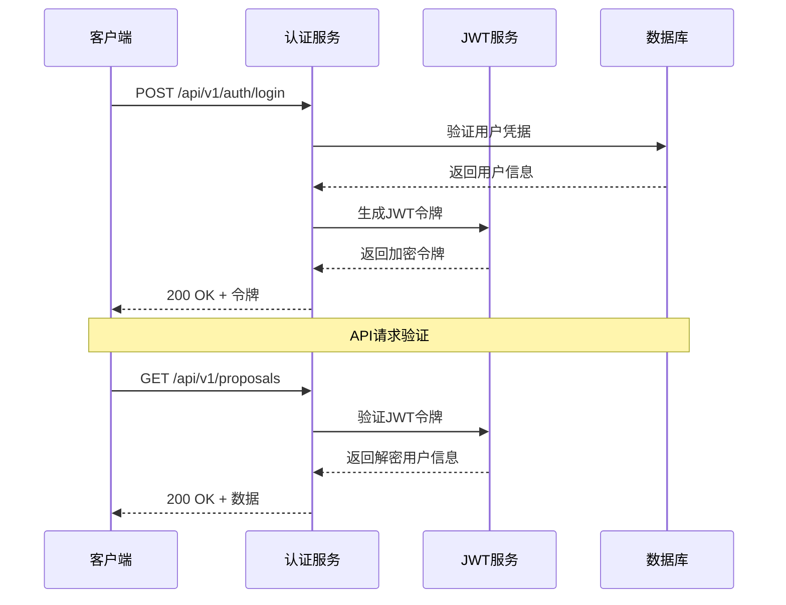

# 提案控制器（Proposal Controller）技术文档

<cite>
**本文档引用的文件**
- [proposal.controller.ts](file://crm-backend/src/controllers/proposal.controller.ts)
- [proposal.service.ts](file://crm-backend/src/services/proposal.service.ts)
- [proposals.routes.ts](file://crm-backend/src/routes/proposals.routes.ts)
- [proposal.validator.ts](file://crm-backend/src/validators/proposal.validator.ts)
- [proposalAI.ts](file://crm-backend/src/services/ai/proposalAI.ts)
- [types.ts](file://crm-backend/src/services/ai/types.ts)
- [schema.prisma](file://crm-backend/prisma/schema.prisma)
- [auth.ts](file://crm-backend/src/middlewares/auth.ts)
- [index.ts](file://crm-backend/src/routes/index.ts)
- [app.ts](file://crm-backend/src/app.ts)
</cite>

## 目录
1. [项目概述](#项目概述)
2. [系统架构](#系统架构)
3. [核心组件分析](#核心组件分析)
4. [API接口规范](#api接口规范)
5. [数据模型设计](#数据模型设计)
6. [AI智能功能](#ai智能功能)
7. [错误处理机制](#错误处理机制)
8. [性能优化策略](#性能优化策略)
9. [安全与权限控制](#安全与权限控制)
10. [测试与调试指南](#测试与调试指南)

## 项目概述

销售AI CRM系统中的提案控制器是整个CRM系统的核心模块之一，负责商务方案的全生命周期管理。该系统采用现代化的Node.js + Express架构，结合AI智能分析技术，为企业提供智能化的销售管理解决方案。

### 主要功能特性

- **完整的提案管理**：支持提案的创建、编辑、删除、状态跟踪
- **AI智能生成**：基于客户信息自动生成商务方案内容
- **智能定价策略**：提供最优报价建议和产品组合推荐
- **多维度统计分析**：实时监控销售转化效果
- **安全权限控制**：基于JWT的认证授权机制

## 系统架构

### 整体架构图



**架构图来源**
- [app.ts:1-88](file://crm-backend/src/app.ts#L1-L88)
- [proposal.controller.ts:1-187](file://crm-backend/src/controllers/proposal.controller.ts#L1-L187)
- [proposal.service.ts:1-519](file://crm-backend/src/services/proposal.service.ts#L1-L519)

### 层次化设计模式

系统采用经典的三层架构设计：

1. **表现层（Controller Layer）**：处理HTTP请求和响应
2. **业务层（Service Layer）**：封装核心业务逻辑
3. **数据访问层（Repository Layer）**：管理数据库交互

## 核心组件分析

### 提案控制器（ProposalController）

提案控制器是系统的核心入口，负责处理所有与提案相关的HTTP请求。

#### 主要职责

- **请求路由**：定义并处理所有提案相关的API端点
- **参数验证**：接收并验证客户端传入的数据
- **业务协调**：协调服务层执行具体的业务逻辑
- **响应处理**：统一格式化API响应

#### 核心方法概览



**类图来源**
- [proposal.controller.ts:9-187](file://crm-backend/src/controllers/proposal.controller.ts#L9-L187)
- [proposal.service.ts:10-519](file://crm-backend/src/services/proposal.service.ts#L10-L519)

**章节来源**
- [proposal.controller.ts:1-187](file://crm-backend/src/controllers/proposal.controller.ts#L1-L187)

### 提案服务（ProposalService）

提案服务层封装了所有业务逻辑，是系统的核心处理单元。

#### 核心功能模块

1. **基础CRUD操作**：标准的创建、读取、更新、删除功能
2. **AI智能集成**：与AI服务的深度集成
3. **数据统计分析**：提供多维度的业务统计
4. **权限验证**：确保数据访问的安全性

#### 数据流处理



**序列图来源**
- [proposal.controller.ts:14-114](file://crm-backend/src/controllers/proposal.controller.ts#L14-L114)
- [proposal.service.ts:20-231](file://crm-backend/src/services/proposal.service.ts#L20-L231)

**章节来源**
- [proposal.service.ts:1-519](file://crm-backend/src/services/proposal.service.ts#L1-L519)

## API接口规范

### 基础CRUD操作

#### 创建提案
- **URL**: `/api/v1/proposals`
- **方法**: POST
- **认证**: 需要JWT令牌
- **请求体**: 提案创建数据
- **响应**: 201 Created + 提案详情

#### 获取提案列表
- **URL**: `/api/v1/proposals`
- **方法**: GET
- **认证**: 需要JWT令牌
- **查询参数**: 分页、筛选条件
- **响应**: 200 OK + 分页数据

#### 获取单个提案
- **URL**: `/api/v1/proposals/:id`
- **方法**: GET
- **认证**: 需要JWT令牌
- **路径参数**: 提案ID
- **响应**: 200 OK + 提案详情

#### 更新提案
- **URL**: `/api/v1/proposals/:id`
- **方法**: PUT
- **认证**: 需要JWT令牌
- **路径参数**: 提案ID
- **请求体**: 更新数据
- **响应**: 200 OK + 更新后的提案

#### 删除提案
- **URL**: `/api/v1/proposals/:id`
- **方法**: DELETE
- **认证**: 需要JWT令牌
- **路径参数**: 提案ID
- **响应**: 200 OK + 删除确认

### AI智能功能

#### AI生成方案内容
- **URL**: `/api/v1/proposals/:id/generate`
- **方法**: POST
- **认证**: 需要JWT令牌
- **路径参数**: 提案ID
- **响应**: 200 OK + 生成的方案内容

#### 发送提案
- **URL**: `/api/v1/proposals/:id/send`
- **方法**: POST
- **认证**: 需要JWT令牌
- **路径参数**: 提案ID
- **响应**: 200 OK + 发送状态

#### 智能生成完整方案
- **URL**: `/api/v1/proposals/:id/smart-generate`
- **方法**: POST
- **认证**: 需要JWT令牌
- **路径参数**: 提案ID
- **响应**: 200 OK + 完整方案内容

#### 获取智能定价策略
- **URL**: `/api/v1/proposals/:id/pricing-strategy`
- **方法**: GET
- **认证**: 需要JWT令牌
- **路径参数**: 提案ID
- **响应**: 200 OK + 定价策略

#### 获取推荐产品组合
- **URL**: `/api/v1/proposals/:id/recommend-products`
- **方法**: GET
- **认证**: 需要JWT令牌
- **路径参数**: 提案ID
- **响应**: 200 OK + 产品推荐

#### 获取统计信息
- **URL**: `/api/v1/proposals/stats`
- **方法**: GET
- **认证**: 需要JWT令牌
- **查询参数**: 客户ID（可选）
- **响应**: 200 OK + 统计数据

**章节来源**
- [proposals.routes.ts:1-407](file://crm-backend/src/routes/proposals.routes.ts#L1-L407)

## 数据模型设计

### 提案实体模型



**ER图来源**
- [schema.prisma:349-375](file://crm-backend/prisma/schema.prisma#L349-L375)
- [schema.prisma:164-220](file://crm-backend/prisma/schema.prisma#L164-L220)
- [schema.prisma:121-160](file://crm-backend/prisma/schema.prisma#L121-L160)

### 数据验证规则

#### 提案创建验证
- **客户ID**: 必填，字符串格式
- **标题**: 必填，1-200字符
- **金额**: 必填，正数
- **描述**: 可选，文本格式
- **产品**: 可选，数组格式
- **有效期**: 可选，日期时间格式

#### 提案更新验证
- **标题**: 可选，1-200字符
- **金额**: 可选，正数
- **产品**: 可选，数组格式
- **状态**: 可选，枚举值

**章节来源**
- [proposal.validator.ts:1-80](file://crm-backend/src/validators/proposal.validator.ts#L1-L80)

## AI智能功能

### 智能报价系统

提案AI引擎提供了强大的智能报价功能，基于以下核心算法：

#### 定价策略算法



**流程图来源**
- [proposalAI.ts:58-106](file://crm-backend/src/services/ai/proposalAI.ts#L58-L106)

#### 产品推荐算法

系统根据客户行业和预算自动推荐最适合的产品组合：

| 行业类别 | 推荐产品组合 | 价格比例 |
|---------|-------------|----------|
| 信息技术 | 企业版许可 + API集成套件 + 数据分析模块 | 100% |
| 制造业 | 生产管理模块 + 质量控制套件 + 设备维护系统 | 120% |
| 金融服务业 | 基础服务包 + 高级功能模块 + 技术支持服务 | 90% |
| 默认行业 | 基础服务包 + 高级功能模块 + 培训服务 | 100% |

**章节来源**
- [proposalAI.ts:28-48](file://crm-backend/src/services/ai/proposalAI.ts#L28-L48)

### 方案生成引擎

AI引擎能够自动生成完整的商务方案，包含以下核心内容：

#### 方案内容结构

1. **执行摘要**：项目概述和价值主张
2. **问题陈述**：客户痛点和挑战分析
3. **解决方案**：定制化解决方案描述
4. **产品推荐**：详细的产品配置和价格
5. **实施计划**：分阶段实施时间表
6. **服务条款**：详细的合同条款
7. **服务等级**：支持和服务承诺
8. **ROI预测**：投资回报分析

**章节来源**
- [proposalAI.ts:112-154](file://crm-backend/src/services/ai/proposalAI.ts#L112-L154)

## 错误处理机制

### 错误分类体系

系统采用统一的错误处理机制，支持多种错误类型：



**类图来源**
- [proposal.controller.ts:4-4](file://crm-backend/src/controllers/proposal.controller.ts#L4-L4)
- [auth.ts:3-3](file://crm-backend/src/middlewares/auth.ts#L3-L3)

### 错误响应格式

所有API错误响应遵循统一的JSON格式：

```json
{
  "success": false,
  "error": {
    "code": "ERROR_CODE",
    "message": "错误描述",
    "details": {}
  }
}
```

**章节来源**
- [proposal.controller.ts:17-51](file://crm-backend/src/controllers/proposal.controller.ts#L17-L51)

## 性能优化策略

### 数据库优化

1. **索引优化**：为常用查询字段建立索引
2. **分页查询**：支持大数据量的分页处理
3. **连接池管理**：合理配置数据库连接池
4. **查询优化**：使用预编译语句和批量操作

### 缓存策略



### 并发处理

系统采用异步非阻塞I/O模型，支持高并发场景：

- **Promise链式调用**：避免回调地狱
- **并发查询**：使用Promise.all并行处理
- **流式处理**：大文件上传和下载
- **内存管理**：及时释放不再使用的资源

## 安全与权限控制

### JWT认证机制

系统采用JWT（JSON Web Token）进行身份认证：



**序列图来源**
- [auth.ts:13-33](file://crm-backend/src/middlewares/auth.ts#L13-L33)

### 权限控制

系统支持基于角色的权限控制（RBAC）：

| 角色 | 权限范围 | 可访问功能 |
|------|----------|------------|
| sales | 销售代表 | 查看自己的提案 |
| manager | 销售经理 | 查看团队提案 |
| admin | 系统管理员 | 完全访问权限 |
| presales | 售前顾问 | 特定提案操作 |

**章节来源**
- [auth.ts:55-69](file://crm-backend/src/middlewares/auth.ts#L55-L69)

## 测试与调试指南

### 单元测试策略

系统采用Jest进行单元测试，重点关注：

1. **控制器测试**：验证HTTP路由和响应
2. **服务层测试**：验证业务逻辑正确性
3. **数据验证测试**：验证输入数据的有效性
4. **AI功能测试**：验证智能算法输出

### API测试工具

推荐使用Postman进行API测试：

```bash
# 创建新提案
curl -X POST http://localhost:3000/api/v1/proposals \
  -H "Authorization: Bearer YOUR_JWT_TOKEN" \
  -H "Content-Type: application/json" \
  -d '{
    "customerId": "customer-id",
    "title": "测试提案",
    "value": 100000,
    "description": "测试描述"
  }'
```

### 调试技巧

1. **日志记录**：使用Morgan中间件记录请求日志
2. **错误追踪**：使用Winston进行结构化日志
3. **性能监控**：使用PM2进行进程管理和监控
4. **数据库调试**：使用Prisma Studio可视化数据库

**章节来源**
- [app.ts:24-30](file://crm-backend/src/app.ts#L24-L30)

## 总结

提案控制器作为销售AI CRM系统的核心模块，展现了现代Web应用的最佳实践：

### 技术亮点

- **架构清晰**：采用分层架构，职责分离明确
- **AI集成**：深度整合人工智能技术，提供智能化功能
- **安全性强**：完善的认证授权机制
- **扩展性好**：模块化设计，易于功能扩展
- **性能优秀**：异步处理和缓存策略

### 应用价值

该系统为企业销售管理提供了完整的数字化解决方案，通过AI智能分析和自动化流程，显著提升了销售效率和客户满意度。

### 未来发展

系统具备良好的扩展基础，可以进一步集成更多AI功能，如机器学习预测、自然语言处理等，为企业提供更加智能化的销售管理服务。