# 提案控制器（Proposal Controller）技术文档

<cite>
**本文档引用的文件**
- [proposal.controller.ts](file://crm-backend/src/controllers/proposal.controller.ts)
- [proposal.service.ts](file://crm-backend/src/services/proposal.service.ts)
- [proposals.routes.ts](file://crm-backend/src/routes/proposals.routes.ts)
- [proposal.validator.ts](file://crm-backend/src/validators/proposal.validator.ts)
- [proposalAI.ts](file://crm-backend/src/services/ai/proposalAI.ts)
- [schema.prisma](file://crm-backend/prisma/schema.prisma)
- [auth.ts](file://crm-backend/src/middlewares/auth.ts)
- [app.ts](file://crm-backend/src/app.ts)
</cite>

## 更新摘要
**变更内容**
- 新增完整的多阶段业务提案工作流程（需求分析、方案设计、内部评审、客户提案、商务谈判）
- 扩展AI智能生成功能，支持完整的提案工作流程
- 新增模板管理系统和AI分析功能
- 完善状态管理和流程控制机制

## 目录
1. [项目概述](#项目概述)
2. [系统架构](#系统架构)
3. [核心组件分析](#核心组件分析)
4. [API接口规范](#api接口规范)
5. [数据模型设计](#数据模型设计)
6. [多阶段工作流程](#多阶段工作流程)
7. [AI智能功能](#ai智能功能)
8. [错误处理机制](#错误处理机制)
9. [性能优化策略](#性能优化策略)
10. [安全与权限控制](#安全与权限控制)
11. [测试与调试指南](#测试与调试指南)

## 项目概述

销售AI CRM系统中的提案控制器是整个CRM系统的核心模块之一，负责商务方案的全生命周期管理。该系统采用现代化的Node.js + Express架构，结合AI智能分析技术，为企业提供智能化的销售管理解决方案。

### 主要功能特性

- **完整的提案管理**：支持提案的创建、编辑、删除、状态跟踪
- **多阶段工作流程**：需求分析、方案设计、内部评审、客户提案、商务谈判的完整流程
- **AI智能生成**：基于客户信息自动生成商务方案内容
- **智能定价策略**：提供最优报价建议和产品组合推荐
- **模板管理系统**：支持方案模板的创建、管理和应用
- **邮件跟踪功能**：支持客户提案的邮件发送和打开跟踪
- **多维度统计分析**：实时监控销售转化效果
- **安全权限控制**：基于JWT的认证授权机制

## 系统架构

### 整体架构图

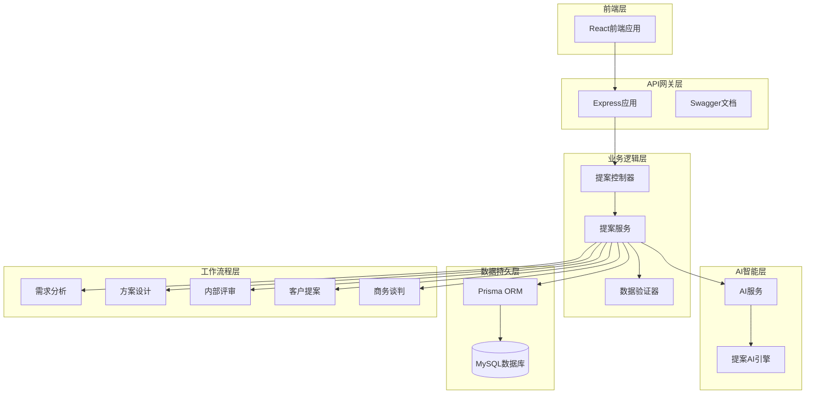

**架构图来源**
- [app.ts:1-88](file://crm-backend/src/app.ts#L1-L88)
- [proposal.controller.ts:1-636](file://crm-backend/src/controllers/proposal.controller.ts#L1-L636)
- [proposal.service.ts:1-1178](file://crm-backend/src/services/proposal.service.ts#L1-L1178)

### 层次化设计模式

系统采用经典的三层架构设计：

1. **表现层（Controller Layer）**：处理HTTP请求和响应
2. **业务层（Service Layer）**：封装核心业务逻辑和工作流程
3. **数据访问层（Repository Layer）**：管理数据库交互

## 核心组件分析

### 提案控制器（ProposalController）

提案控制器是系统的核心入口，负责处理所有与提案相关的HTTP请求。

#### 主要职责

- **请求路由**：定义并处理所有提案相关的API端点
- **参数验证**：接收并验证客户端传入的数据
- **业务协调**：协调服务层执行具体的业务逻辑
- **响应处理**：统一格式化API响应

#### 核心方法概览

```mermaid
classDiagram
class ProposalController {
+create(req, res, next) Promise~Response~
+getAll(req, res, next) Promise~Response~
+getById(req, res, next) Promise~Response~
+update(req, res, next) Promise~Response~
+updateStatus(req, res, next) Promise~Response~
+delete(req, res, next) Promise~Response~
+generateWithAI(req, res, next) Promise~Response~
+send(req, res, next) Promise~Response~
+generateSmartProposal(req, res, next) Promise~Response~
+getPricingStrategy(req, res, next) Promise~Response~
+getRecommendedProducts(req, res, next) Promise~Response~
+getStats(req, res, next) Promise~Response~
+getTemplates(req, res, next) Promise~Response~
+createTemplate(req, res, next) Promise~Response~
+cloneTemplate(req, res, next) Promise~Response~
+createRequirementAnalysis(req, res, next) Promise~Response~
+getRequirementAnalysis(req, res, next) Promise~Response~
+aiAnalyzeRequirement(req, res, next) Promise~Response~
+aiEnhanceRequirement(req, res, next) Promise~Response~
+updateRequirementAnalysis(req, res, next) Promise~Response~
+confirmRequirementAnalysis(req, res, next) Promise~Response~
+startDesign(req, res, next) Promise~Response~
+matchTemplate(req, res, next) Promise~Response~
+applyTemplate(req, res, next) Promise~Response~
+updateDesign(req, res, next) Promise~Response~
+confirmDesign(req, res, next) Promise~Response~
+createReview(req, res, next) Promise~Response~
+getReview(req, res, next) Promise~Response~
+addReviewComment(req, res, next) Promise~Response~
+approveReview(req, res, next) Promise~Response~
+rejectReview(req, res, next) Promise~Response~
+createCustomerProposalRecord(req, res, next) Promise~Response~
+getCustomerProposalRecord(req, res, next) Promise~Response~
+generateEmailTemplate(req, res, next) Promise~Response~
+updateCustomerProposalEmail(req, res, next) Promise~Response~
+sendCustomerProposal(req, res, next) Promise~Response~
+trackEmailOpen(req, res, next) Promise~Response~
+createNegotiation(req, res, next) Promise~Response~
+getNegotiation(req, res, next) Promise~Response~
+addDiscussion(req, res, next) Promise~Response~
+updateNegotiationTerms(req, res, next) Promise~Response~
+completeNegotiation(req, res, next) Promise~Response~
}
class ProposalService {
+create(data, userId) Promise~Proposal~
+getAll(query) Promise~PaginatedResult~
+getById(id) Promise~Proposal~
+update(id, data) Promise~Proposal~
+updateStatus(id, data) Promise~Proposal~
+delete(id) Promise~void~
+generateWithAI(id) Promise~Proposal~
+send(id) Promise~Proposal~
+generateSmartProposal(id) Promise~ProposalGenerationResult~
+getPricingStrategy(id) Promise~SmartQuotationResult~
+getRecommendedProducts(id) Promise~Product[]~
+getStats(customerId) Promise~Stats~
+getTemplates(query) Promise~PaginatedResult~
+createTemplate(data, userId) Promise~ProposalTemplate~
+cloneTemplate(templateId, userId) Promise~ProposalTemplate~
+createRequirementAnalysis(proposalId, data) Promise~RequirementAnalysis~
+getRequirementAnalysis(proposalId) Promise~RequirementAnalysis~
+aiAnalyzeRequirement(proposalId, sourceType, recordingId) Promise~AnalysisResult~
+aiEnhanceRequirement(proposalId) Promise~RequirementAnalysis~
+updateRequirementAnalysis(proposalId, data) Promise~RequirementAnalysis~
+confirmRequirementAnalysis(proposalId, finalContent) Promise~Proposal~
+startDesign(proposalId) Promise~Proposal~
+matchTemplate(proposalId, criteria) Promise~Template[]~
+applyTemplate(proposalId, templateId) Promise~Proposal~
+updateDesign(proposalId, data) Promise~Proposal~
+confirmDesign(proposalId) Promise~Proposal~
+createReview(proposalId, data) Promise~ProposalReview~
+getReview(proposalId) Promise~ProposalReview~
+addReviewComment(proposalId, userId, comment) Promise~ProposalReview~
+approveReview(proposalId, resultNotes) Promise~Proposal~
+rejectReview(proposalId, resultNotes) Promise~Proposal~
+createCustomerProposalRecord(proposalId, data) Promise~CustomerProposalRecord~
+getCustomerProposalRecord(proposalId) Promise~CustomerProposalRecord~
+generateEmailTemplate(proposalId) Promise~EmailTemplate~
+updateCustomerProposalEmail(proposalId, data) Promise~CustomerProposalRecord~
+sendCustomerProposal(proposalId) Promise~Proposal~
+trackEmailOpen(token) Promise~CustomerProposalRecord~
+createNegotiation(proposalId) Promise~NegotiationRecord~
+getNegotiation(proposalId) Promise~NegotiationRecord~
+addDiscussion(proposalId, data) Promise~NegotiationRecord~
+updateAgreedTerms(proposalId, agreedTerms) Promise~NegotiationRecord~
+completeNegotiation(proposalId) Promise~Proposal~
}
ProposalController --> ProposalService : "依赖"
```

**类图来源**
- [proposal.controller.ts:9-636](file://crm-backend/src/controllers/proposal.controller.ts#L9-L636)
- [proposal.service.ts:10-1178](file://crm-backend/src/services/proposal.service.ts#L10-L1178)

**章节来源**
- [proposal.controller.ts:1-636](file://crm-backend/src/controllers/proposal.controller.ts#L1-L636)

### 提案服务（ProposalService）

提案服务层封装了所有业务逻辑，是系统的核心处理单元。

#### 核心功能模块

1. **基础CRUD操作**：标准的创建、读取、更新、删除功能
2. **多阶段工作流程**：完整的提案生命周期管理
3. **AI智能集成**：与AI服务的深度集成
4. **模板管理**：方案模板的创建、管理和应用
5. **邮件跟踪**：客户提案的邮件发送和打开跟踪
6. **数据统计分析**：提供多维度的业务统计
7. **权限验证**：确保数据访问的安全性

#### 数据流处理

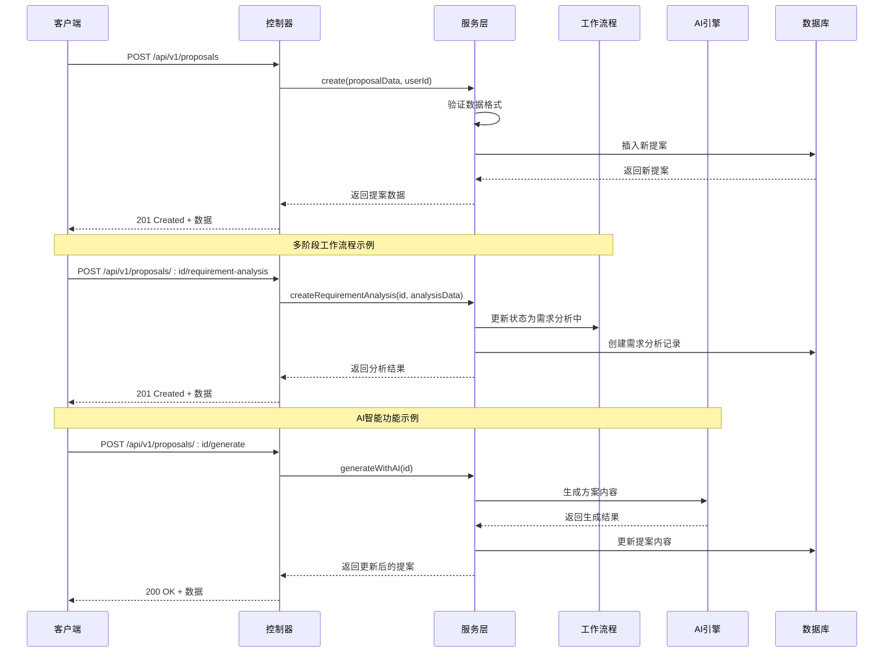

**序列图来源**
- [proposal.controller.ts:14-636](file://crm-backend/src/controllers/proposal.controller.ts#L14-L636)
- [proposal.service.ts:20-1178](file://crm-backend/src/services/proposal.service.ts#L20-L1178)

**章节来源**
- [proposal.service.ts:1-1178](file://crm-backend/src/services/proposal.service.ts#L1-L1178)

## API接口规范

### 基础CRUD操作

#### 创建提案
- **URL**: `/api/v1/proposals`
- **方法**: POST
- **认证**: 需要JWT令牌
- **请求体**: 提案创建数据
- **响应**: 201 Created + 提案详情

#### 获取提案列表
- **URL**: `/api/v1/proposals`
- **方法**: GET
- **认证**: 需要JWT令牌
- **查询参数**: 分页、筛选条件
- **响应**: 200 OK + 分页数据

#### 获取单个提案
- **URL**: `/api/v1/proposals/:id`
- **方法**: GET
- **认证**: 需要JWT令牌
- **路径参数**: 提案ID
- **响应**: 200 OK + 提案详情

#### 更新提案
- **URL**: `/api/v1/proposals/:id`
- **方法**: PUT
- **认证**: 需要JWT令牌
- **路径参数**: 提案ID
- **请求体**: 更新数据
- **响应**: 200 OK + 更新后的提案

#### 删除提案
- **URL**: `/api/v1/proposals/:id`
- **方法**: DELETE
- **认证**: 需要JWT令牌
- **路径参数**: 提案ID
- **响应**: 200 OK + 删除确认

### AI智能功能

#### AI生成方案内容
- **URL**: `/api/v1/proposals/:id/generate`
- **方法**: POST
- **认证**: 需要JWT令牌
- **路径参数**: 提案ID
- **响应**: 200 OK + 生成的方案内容

#### 发送提案
- **URL**: `/api/v1/proposals/:id/send`
- **方法**: POST
- **认证**: 需要JWT令牌
- **路径参数**: 提案ID
- **响应**: 200 OK + 发送状态

#### 智能生成完整方案
- **URL**: `/api/v1/proposals/:id/smart-generate`
- **方法**: POST
- **认证**: 需要JWT令牌
- **路径参数**: 提案ID
- **响应**: 200 OK + 完整方案内容

#### 获取智能定价策略
- **URL**: `/api/v1/proposals/:id/pricing-strategy`
- **方法**: GET
- **认证**: 需要JWT令牌
- **路径参数**: 提案ID
- **响应**: 200 OK + 定价策略

#### 获取推荐产品组合
- **URL**: `/api/v1/proposals/:id/recommend-products`
- **方法**: GET
- **认证**: 需要JWT令牌
- **路径参数**: 提案ID
- **响应**: 200 OK + 产品推荐

#### 获取统计信息
- **URL**: `/api/v1/proposals/stats`
- **方法**: GET
- **认证**: 需要JWT令牌
- **查询参数**: 客户ID（可选）
- **响应**: 200 OK + 统计数据

### 模板管理API

#### 获取模板列表
- **URL**: `/api/v1/proposals/templates`
- **方法**: GET
- **认证**: 需要JWT令牌
- **查询参数**: 分页、筛选条件
- **响应**: 200 OK + 模板列表

#### 创建模板
- **URL**: `/api/v1/proposals/templates`
- **方法**: POST
- **认证**: 需要JWT令牌
- **请求体**: 模板创建数据
- **响应**: 201 Created + 模板详情

#### 克隆模板
- **URL**: `/api/v1/proposals/templates/:id/clone`
- **方法**: POST
- **认证**: 需要JWT令牌
- **路径参数**: 模板ID
- **响应**: 200 OK + 克隆后的模板

### 需求分析阶段API

#### 创建需求分析
- **URL**: `/api/v1/proposals/:id/requirement-analysis`
- **方法**: POST
- **认证**: 需要JWT令牌
- **路径参数**: 提案ID
- **请求体**: 需求分析数据
- **响应**: 201 Created + 分析详情

#### 获取需求分析
- **URL**: `/api/v1/proposals/:id/requirement-analysis`
- **方法**: GET
- **认证**: 需要JWT令牌
- **路径参数**: 提案ID
- **响应**: 200 OK + 分析详情

#### AI分析需求
- **URL**: `/api/v1/proposals/:id/requirement-analysis/ai-analyze`
- **方法**: POST
- **认证**: 需要JWT令牌
- **路径参数**: 提案ID
- **请求体**: AI分析请求
- **响应**: 200 OK + 分析结果

#### AI补充需求
- **URL**: `/api/v1/proposals/:id/requirement-analysis/ai-enhance`
- **方法**: POST
- **认证**: 需要JWT令牌
- **路径参数**: 提案ID
- **响应**: 200 OK + 增强后的分析

#### 更新需求分析
- **URL**: `/api/v1/proposals/:id/requirement-analysis`
- **方法**: PUT
- **认证**: 需要JWT令牌
- **路径参数**: 提案ID
- **请求体**: 更新数据
- **响应**: 200 OK + 更新后的分析

#### 确认需求分析
- **URL**: `/api/v1/proposals/:id/requirement-analysis/confirm`
- **方法**: POST
- **认证**: 需要JWT令牌
- **路径参数**: 提案ID
- **请求体**: 确认内容
- **响应**: 200 OK + 确认后的提案

### 方案设计阶段API

#### 开始方案设计
- **URL**: `/api/v1/proposals/:id/design`
- **方法**: POST
- **认证**: 需要JWT令牌
- **路径参数**: 提案ID
- **响应**: 200 OK + 设计状态

#### AI匹配模板
- **URL**: `/api/v1/proposals/:id/design/match-template`
- **方法**: POST
- **认证**: 需要JWT令牌
- **路径参数**: 提案ID
- **请求体**: 匹配条件
- **响应**: 200 OK + 匹配结果

#### 应用模板生成方案
- **URL**: `/api/v1/proposals/:id/design/apply-template`
- **方法**: POST
- **认证**: 需要JWT令牌
- **路径参数**: 提案ID
- **请求体**: 模板ID
- **响应**: 200 OK + 应用后的提案

#### 更新方案设计
- **URL**: `/api/v1/proposals/:id/design`
- **方法**: PUT
- **认证**: 需要JWT令牌
- **路径参数**: 提案ID
- **请求体**: 设计更新数据
- **响应**: 200 OK + 更新后的提案

#### 确认方案设计
- **URL**: `/api/v1/proposals/:id/design/confirm`
- **方法**: POST
- **认证**: 需要JWT令牌
- **路径参数**: 提案ID
- **响应**: 200 OK + 确认后的提案

### 内部评审阶段API

#### 发起内部评审
- **URL**: `/api/v1/proposals/:id/review`
- **方法**: POST
- **认证**: 需要JWT令牌
- **路径参数**: 提案ID
- **请求体**: 评审配置
- **响应**: 201 Created + 评审详情

#### 获取评审信息
- **URL**: `/api/v1/proposals/:id/review`
- **方法**: GET
- **认证**: 需要JWT令牌
- **路径参数**: 提案ID
- **响应**: 200 OK + 评审详情

#### 添加评审意见
- **URL**: `/api/v1/proposals/:id/review/comment`
- **方法**: POST
- **认证**: 需要JWT令牌
- **路径参数**: 提案ID
- **请求体**: 评审意见
- **响应**: 200 OK + 更新后的评审

#### 评审通过
- **URL**: `/api/v1/proposals/:id/review/approve`
- **方法**: POST
- **认证**: 需要JWT令牌
- **路径参数**: 提案ID
- **请求体**: 评审结果
- **响应**: 200 OK + 评审后的提案

#### 评审驳回
- **URL**: `/api/v1/proposals/:id/review/reject`
- **方法**: POST
- **认证**: 需要JWT令牌
- **路径参数**: 提案ID
- **请求体**: 评审结果
- **响应**: 200 OK + 评审后的提案

### 客户提案阶段API

#### 创建客户提案
- **URL**: `/api/v1/proposals/:id/customer-proposal`
- **方法**: POST
- **认证**: 需要JWT令牌
- **路径参数**: 提案ID
- **请求体**: 提案邮件配置
- **响应**: 201 Created + 提案记录

#### 获取客户提案信息
- **URL**: `/api/v1/proposals/:id/customer-proposal`
- **方法**: GET
- **认证**: 需要JWT令牌
- **路径参数**: 提案ID
- **响应**: 200 OK + 提案详情

#### 生成邮件模板
- **URL**: `/api/v1/proposals/:id/customer-proposal/generate-email`
- **方法**: POST
- **认证**: 需要JWT令牌
- **路径参数**: 提案ID
- **响应**: 200 OK + 邮件模板

#### 更新邮件内容
- **URL**: `/api/v1/proposals/:id/customer-proposal/email`
- **方法**: PUT
- **认证**: 需要JWT令牌
- **路径参数**: 提案ID
- **请求体**: 邮件更新数据
- **响应**: 200 OK + 更新后的记录

#### 发送客户提案
- **URL**: `/api/v1/proposals/:id/customer-proposal/send`
- **方法**: POST
- **认证**: 需要JWT令牌
- **路径参数**: 提案ID
- **响应**: 200 OK + 发送后的提案

#### 邮件打开跟踪
- **URL**: `/api/v1/proposals/track/:token`
- **方法**: GET
- **路径参数**: 跟踪令牌
- **响应**: 200 OK + 跟踪结果

### 商务谈判阶段API

#### 创建商务谈判
- **URL**: `/api/v1/proposals/:id/negotiation`
- **方法**: POST
- **认证**: 需要JWT令牌
- **路径参数**: 提案ID
- **响应**: 201 Created + 谈判记录

#### 获取谈判记录
- **URL**: `/api/v1/proposals/:id/negotiation`
- **方法**: GET
- **认证**: 需要JWT令牌
- **路径参数**: 提案ID
- **响应**: 200 OK + 谈判详情

#### 添加讨论记录
- **URL**: `/api/v1/proposals/:id/negotiation/discussion`
- **方法**: POST
- **认证**: 需要JWT令牌
- **路径参数**: 提案ID
- **请求体**: 讨论内容
- **响应**: 200 OK + 更新后的记录

#### 更新条款
- **URL**: `/api/v1/proposals/:id/negotiation/terms`
- **方法**: PUT
- **认证**: 需要JWT令牌
- **路径参数**: 提案ID
- **请求体**: 条款更新
- **响应**: 200 OK + 更新后的记录

#### 完成谈判
- **URL**: `/api/v1/proposals/:id/negotiation/complete`
- **方法**: POST
- **认证**: 需要JWT令牌
- **路径参数**: 提案ID
- **响应**: 200 OK + 完成后的提案

**章节来源**
- [proposals.routes.ts:1-653](file://crm-backend/src/routes/proposals.routes.ts#L1-L653)

## 数据模型设计

### 提案实体模型

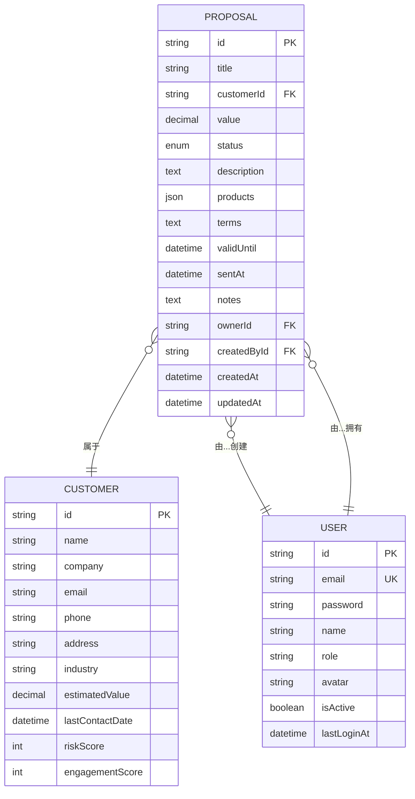

**ER图来源**
- [schema.prisma:377-409](file://crm-backend/prisma/schema.prisma#L377-L409)
- [schema.prisma:189-248](file://crm-backend/prisma/schema.prisma#L189-L248)
- [schema.prisma:144-185](file://crm-backend/prisma/schema.prisma#L144-L185)

### 工作流程相关实体模型

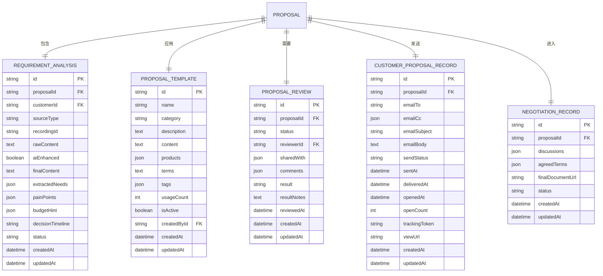

**ER图来源**
- [schema.prisma:956-985](file://crm-backend/prisma/schema.prisma#L956-L985)
- [schema.prisma:936-953](file://crm-backend/prisma/schema.prisma#L936-L953)
- [schema.prisma:988-1017](file://crm-backend/prisma/schema.prisma#L988-L1017)
- [schema.prisma:1020-1049](file://crm-backend/prisma/schema.prisma#L1020-L1049)
- [schema.prisma:1052-1076](file://crm-backend/prisma/schema.prisma#L1052-L1076)

### 数据验证规则

#### 提案创建验证
- **客户ID**: 必填，字符串格式
- **标题**: 必填，1-200字符
- **金额**: 必填，正数
- **描述**: 可选，文本格式
- **产品**: 可选，数组格式
- **有效期**: 可选，日期时间格式

#### 提案更新验证
- **标题**: 可选，1-200字符
- **金额**: 可选，正数
- **产品**: 可选，数组格式
- **状态**: 可选，枚举值

#### 工作流程验证
- **需求分析**: 支持手动输入、AI录音分析、AI跟进分析
- **模板匹配**: 支持按行业、需求、预算匹配
- **评审配置**: 支持评审人和共享团队设置
- **邮件配置**: 支持收件人、抄送、主题、正文配置

**章节来源**
- [proposal.validator.ts:1-240](file://crm-backend/src/validators/proposal.validator.ts#L1-L240)

## 多阶段工作流程

### 完整提案工作流程

系统实现了完整的多阶段业务提案工作流程，每个阶段都有明确的状态管理和控制机制：

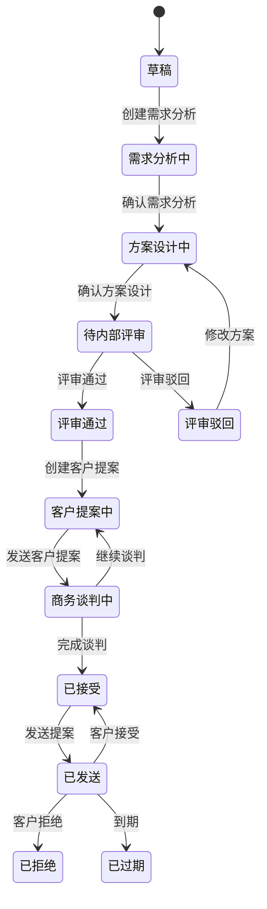

**状态流转图来源**
- [schema.prisma:43-56](file://crm-backend/prisma/schema.prisma#L43-L56)

### 需求分析阶段

#### 功能特性
- **多源需求收集**：支持手动输入、AI录音分析、AI跟进分析
- **AI智能分析**：自动提取需求、痛点、预算线索
- **需求确认**：支持最终需求确认和状态转换

#### 数据流程
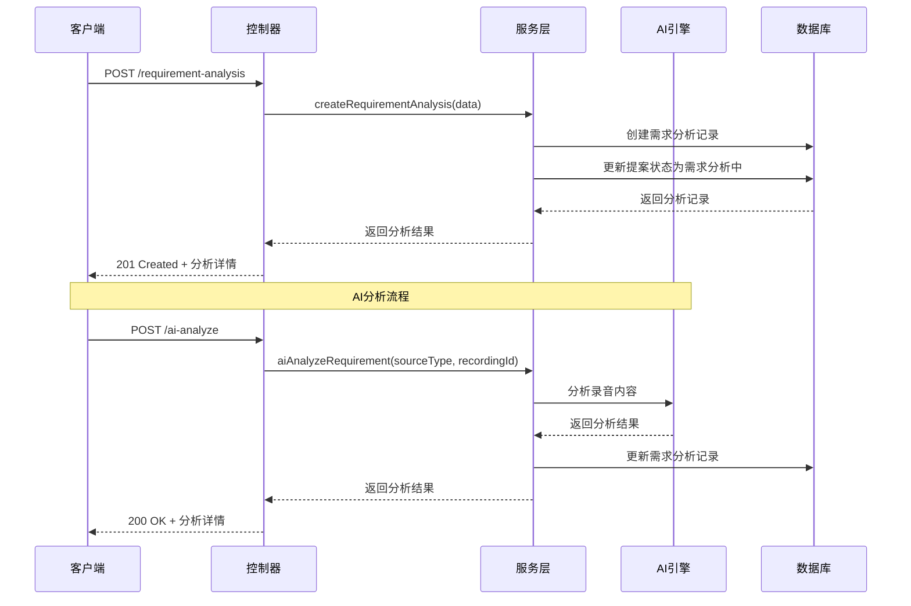

**序列图来源**
- [proposal.controller.ts:242-322](file://crm-backend/src/controllers/proposal.controller.ts#L242-L322)
- [proposal.service.ts:592-715](file://crm-backend/src/services/proposal.service.ts#L592-L715)

### 方案设计阶段

#### 功能特性
- **模板匹配**：基于行业、需求、预算智能匹配模板
- **模板应用**：一键应用模板生成完整方案
- **设计确认**：支持方案设计确认和状态转换

#### 模板匹配算法
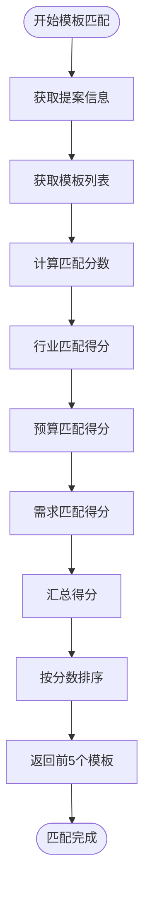

**流程图来源**
- [proposal.service.ts:732-774](file://crm-backend/src/services/proposal.service.ts#L732-L774)

### 内部评审阶段

#### 功能特性
- **评审发起**：支持指定评审人和共享团队
- **意见管理**：支持多人评审意见收集
- **结果处理**：支持评审通过和驳回两种结果

#### 评审流程
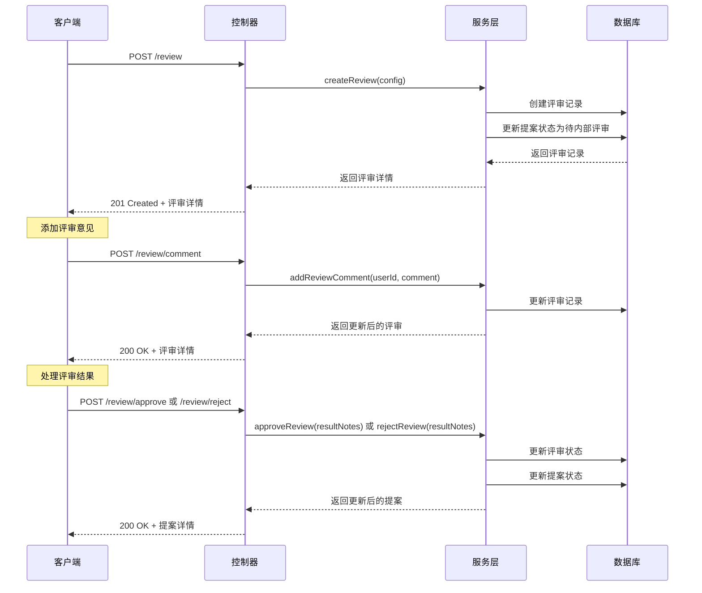

**序列图来源**
- [proposal.controller.ts:403-474](file://crm-backend/src/controllers/proposal.controller.ts#L403-L474)
- [proposal.service.ts:835-929](file://crm-backend/src/services/proposal.service.ts#L835-L929)

### 客户提案阶段

#### 功能特性
- **邮件模板生成**：自动生成客户提案邮件模板
- **邮件发送**：支持邮件发送和状态跟踪
- **打开跟踪**：支持邮件打开情况跟踪

#### 邮件跟踪机制
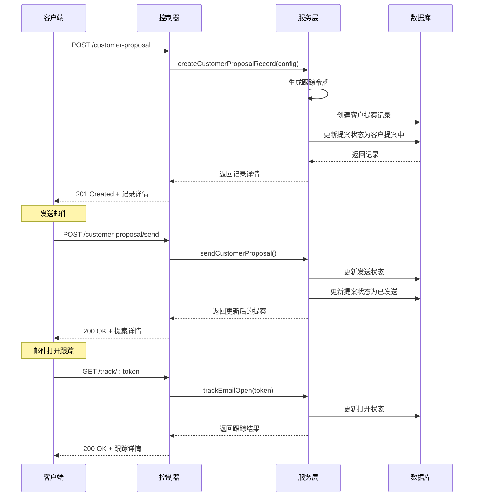

**序列图来源**
- [proposal.controller.ts:482-560](file://crm-backend/src/controllers/proposal.controller.ts#L482-L560)
- [proposal.service.ts:936-1048](file://crm-backend/src/services/proposal.service.ts#L936-L1048)

### 商务谈判阶段

#### 功能特性
- **谈判记录**：支持谈判过程记录和讨论管理
- **条款确认**：支持关键条款的确认和修改
- **状态管理**：支持谈判进行中和已完成状态

#### 谈判管理流程
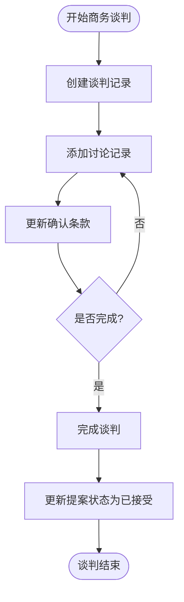

**流程图来源**
- [proposal.controller.ts:568-633](file://crm-backend/src/controllers/proposal.controller.ts#L568-L633)
- [proposal.service.ts:1055-1126](file://crm-backend/src/services/proposal.service.ts#L1055-L1126)

**章节来源**
- [proposal.service.ts:587-1178](file://crm-backend/src/services/proposal.service.ts#L587-1178)

## AI智能功能

### 智能报价系统

提案AI引擎提供了强大的智能报价功能，基于以下核心算法：

#### 定价策略算法


**流程图来源**
- [proposalAI.ts:58-106](file://crm-backend/src/services/ai/proposalAI.ts#L58-L106)

#### 产品推荐算法

系统根据客户行业和预算自动推荐最适合的产品组合：

| 行业类别 | 推荐产品组合 | 价格比例 |
|---------|-------------|----------|
| 信息技术 | 企业版许可 + API集成套件 + 数据分析模块 | 100% |
| 制造业 | 生产管理模块 + 质量控制套件 + 设备维护系统 | 120% |
| 金融服务业 | 基础服务包 + 高级功能模块 + 技术支持服务 | 90% |
| 默认行业 | 基础服务包 + 高级功能模块 + 培训服务 | 100% |

**章节来源**
- [proposalAI.ts:28-48](file://crm-backend/src/services/ai/proposalAI.ts#L28-L48)

### 方案生成引擎

AI引擎能够自动生成完整的商务方案，包含以下核心内容：

#### 方案内容结构

1. **执行摘要**：项目概述和价值主张
2. **问题陈述**：客户痛点和挑战分析
3. **解决方案**：定制化解决方案描述
4. **产品推荐**：详细的产品配置和价格
5. **实施计划**：分阶段实施时间表
6. **服务条款**：详细的合同条款
7. **服务等级**：支持和服务承诺
8. **ROI预测**：投资回报分析

#### AI分析功能

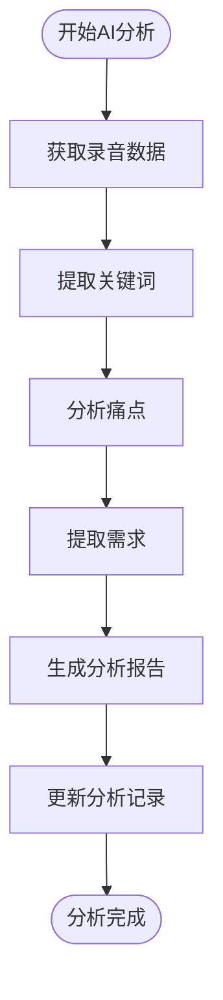

**流程图来源**
- [proposal.service.ts:1133-1165](file://crm-backend/src/services/proposal.service.ts#L1133-L1165)

**章节来源**
- [proposalAI.ts:112-154](file://crm-backend/src/services/ai/proposalAI.ts#L112-L154)

## 错误处理机制

### 错误分类体系

系统采用统一的错误处理机制，支持多种错误类型：

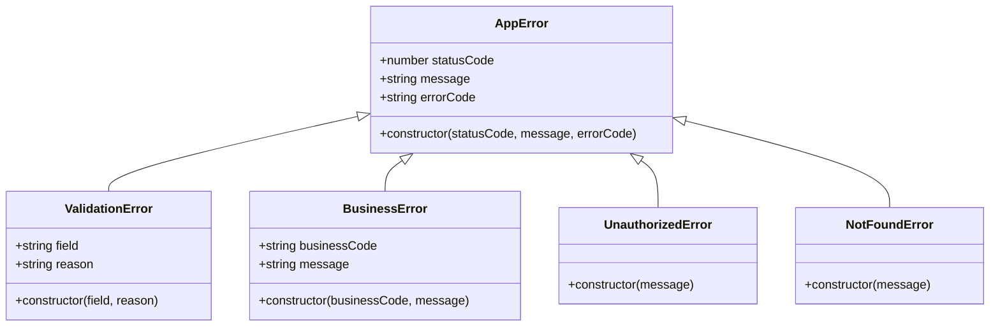

**类图来源**
- [proposal.controller.ts:4-4](file://crm-backend/src/controllers/proposal.controller.ts#L4-L4)
- [auth.ts:3-3](file://crm-backend/src/middlewares/auth.ts#L3-L3)

### 错误响应格式

所有API错误响应遵循统一的JSON格式：

```json
{
  "success": false,
  "error": {
    "code": "ERROR_CODE",
    "message": "错误描述",
    "details": {}
  }
}
```

**章节来源**
- [proposal.controller.ts:17-51](file://crm-backend/src/controllers/proposal.controller.ts#L17-L51)

## 性能优化策略

### 数据库优化

1. **索引优化**：为常用查询字段建立索引
2. **分页查询**：支持大数据量的分页处理
3. **连接池管理**：合理配置数据库连接池
4. **查询优化**：使用预编译语句和批量操作

### 缓存策略

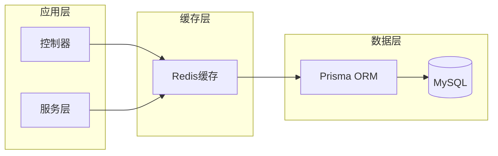

### 并发处理

系统采用异步非阻塞I/O模型，支持高并发场景：

- **Promise链式调用**：避免回调地狱
- **并发查询**：使用Promise.all并行处理
- **流式处理**：大文件上传和下载
- **内存管理**：及时释放不再使用的资源

## 安全与权限控制

### JWT认证机制

系统采用JWT（JSON Web Token）进行身份认证：

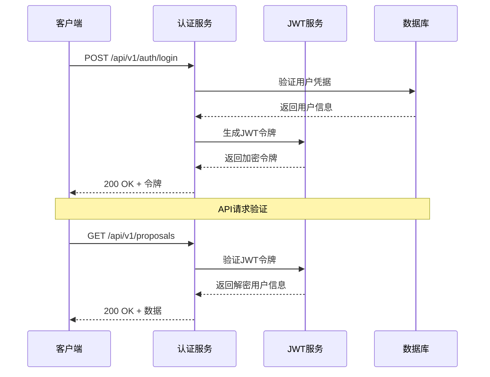

**序列图来源**
- [auth.ts:13-33](file://crm-backend/src/middlewares/auth.ts#L13-L33)

### 权限控制

系统支持基于角色的权限控制（RBAC）：

| 角色 | 权限范围 | 可访问功能 |
|------|----------|------------|
| sales | 销售代表 | 查看自己的提案 |
| manager | 销售经理 | 查看团队提案 |
| admin | 系统管理员 | 完全访问权限 |
| presales | 售前顾问 | 特定提案操作 |

**章节来源**
- [auth.ts:55-69](file://crm-backend/src/middlewares/auth.ts#L55-L69)

## 测试与调试指南

### 单元测试策略

系统采用Jest进行单元测试，重点关注：

1. **控制器测试**：验证HTTP路由和响应
2. **服务层测试**：验证业务逻辑正确性
3. **数据验证测试**：验证输入数据的有效性
4. **AI功能测试**：验证智能算法输出
5. **工作流程测试**：验证多阶段流程正确性

### API测试工具

推荐使用Postman进行API测试：

```bash
# 创建新提案
curl -X POST http://localhost:3000/api/v1/proposals \
  -H "Authorization: Bearer YOUR_JWT_TOKEN" \
  -H "Content-Type: application/json" \
  -d '{
    "customerId": "customer-id",
    "title": "测试提案",
    "value": 100000,
    "description": "测试描述"
  }'

# 创建需求分析
curl -X POST http://localhost:3000/api/v1/proposals/:id/requirement-analysis \
  -H "Authorization: Bearer YOUR_JWT_TOKEN" \
  -H "Content-Type: application/json" \
  -d '{
    "sourceType": "manual",
    "rawContent": "测试需求内容"
  }'
```

### 调试技巧

1. **日志记录**：使用Morgan中间件记录请求日志
2. **错误追踪**：使用Winston进行结构化日志
3. **性能监控**：使用PM2进行进程管理和监控
4. **数据库调试**：使用Prisma Studio可视化数据库

**章节来源**
- [app.ts:24-30](file://crm-backend/src/app.ts#L24-L30)

## 总结

提案控制器作为销售AI CRM系统的核心模块，展现了现代Web应用的最佳实践：

### 技术亮点

- **架构清晰**：采用分层架构，职责分离明确
- **AI集成**：深度整合人工智能技术，提供智能化功能
- **工作流程完整**：实现了从需求分析到商务谈判的完整流程
- **安全性强**：完善的认证授权机制
- **扩展性好**：模块化设计，易于功能扩展
- **性能优秀**：异步处理和缓存策略

### 应用价值

该系统为企业销售管理提供了完整的数字化解决方案，通过AI智能分析和自动化流程，显著提升了销售效率和客户满意度。

### 未来发展

系统具备良好的扩展基础，可以进一步集成更多AI功能，如机器学习预测、自然语言处理等，为企业提供更加智能化的销售管理服务。

**更新** 本次更新主要增加了完整的多阶段业务提案工作流程，包括需求分析、方案设计、内部评审、客户提案、商务谈判等完整流程，以及相应的AI智能生成功能和模板管理功能。