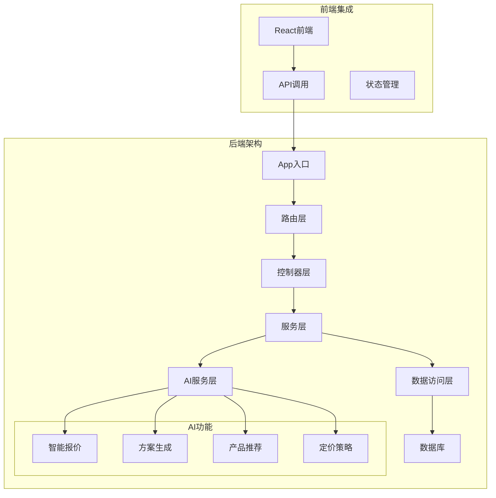
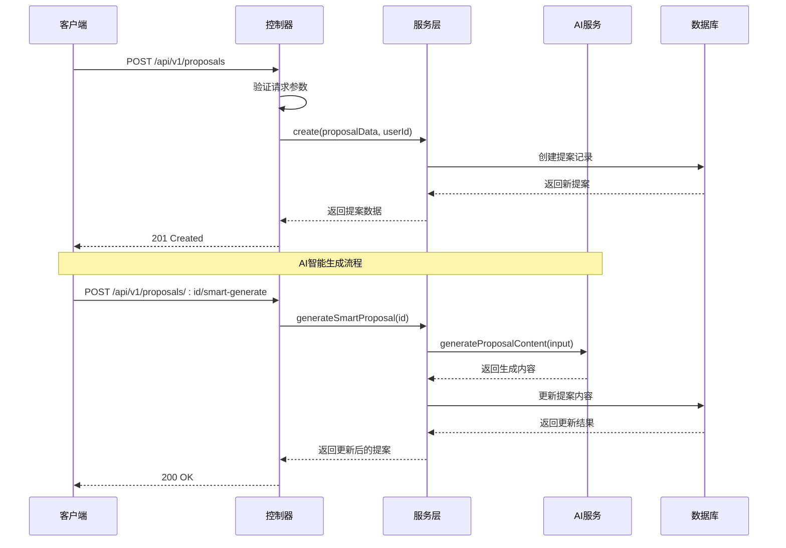
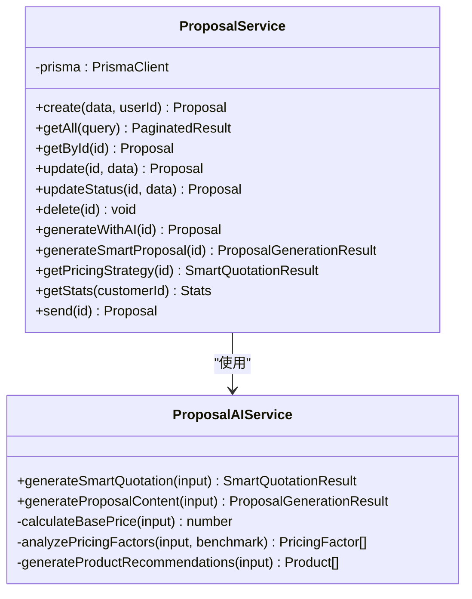
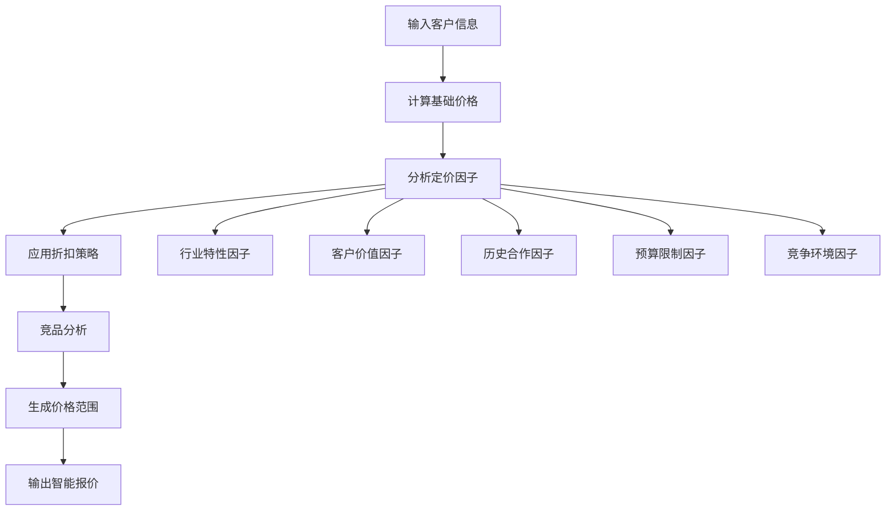
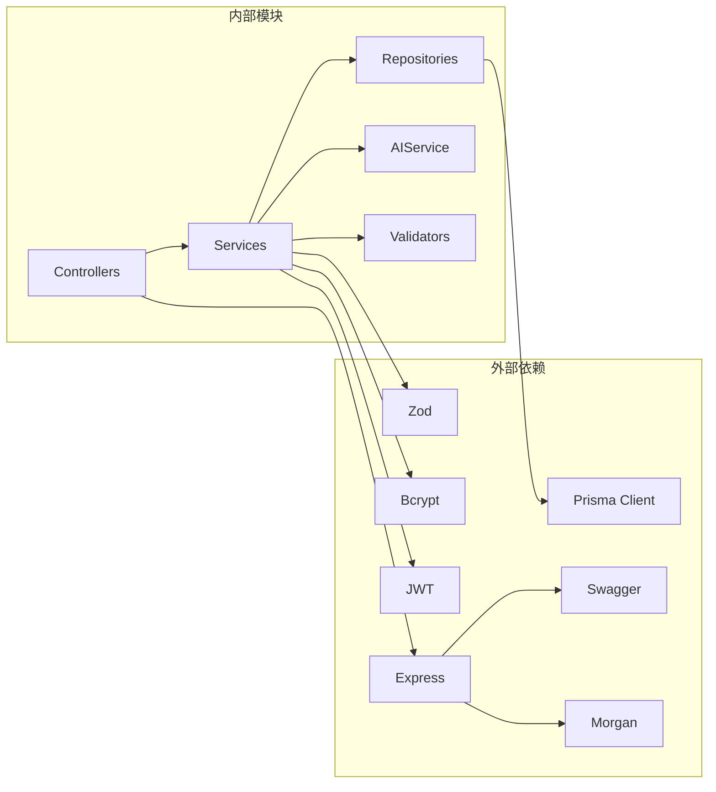

# 提案服务（Proposal Service）

<cite>
**本文档引用的文件**
- [proposal.controller.ts](file://crm-backend/src/controllers/proposal.controller.ts)
- [proposal.service.ts](file://crm-backend/src/services/proposal.service.ts)
- [proposals.routes.ts](file://crm-backend/src/routes/proposals.routes.ts)
- [proposal.validator.ts](file://crm-backend/src/validators/proposal.validator.ts)
- [prisma.ts](file://crm-backend/src/repositories/prisma.ts)
- [proposalAI.ts](file://crm-backend/src/services/ai/proposalAI.ts)
- [types.ts](file://crm-backend/src/services/ai/types.ts)
- [schema.prisma](file://crm-backend/prisma/schema.prisma)
- [app.ts](file://crm-backend/src/app.ts)
- [package.json](file://crm-backend/package.json)
</cite>

## 目录
1. [简介](#简介)
2. [项目结构](#项目结构)
3. [核心组件](#核心组件)
4. [架构概览](#架构概览)
5. [详细组件分析](#详细组件分析)
6. [依赖关系分析](#依赖关系分析)
7. [性能考虑](#性能考虑)
8. [故障排除指南](#故障排除指南)
9. [结论](#结论)

## 简介

提案服务是销售AI CRM系统中的核心业务模块，负责管理商务方案的全生命周期。该服务提供了完整的提案创建、编辑、发送、AI智能生成等功能，并集成了先进的AI分析能力，包括智能定价策略、产品推荐、方案内容生成等。

系统采用现代化的微服务架构，基于Node.js和TypeScript构建，使用Express框架提供RESTful API接口，配合Prisma ORM进行数据库操作，集成Swagger进行API文档自动生成。

## 项目结构

**图表来源**
- [app.ts:1-88](file://crm-backend/src/app.ts#L1-L88)
- [proposals.routes.ts:1-407](file://crm-backend/src/routes/proposals.routes.ts#L1-L407)

**章节来源**
- [app.ts:1-88](file://crm-backend/src/app.ts#L1-L88)
- [package.json:1-57](file://crm-backend/package.json#L1-L57)

## 核心组件

### 主要功能模块

提案服务包含以下核心功能模块：

1. **基础CRUD操作** - 创建、读取、更新、删除商务方案
2. **AI智能生成功能** - 基于客户信息的智能方案生成
3. **智能定价策略** - 基于市场分析的定价建议
4. **产品推荐系统** - 个性化产品组合推荐
5. **方案统计分析** - 提案状态和转化率统计
6. **发送和状态管理** - 方案发送和状态跟踪

### 数据模型

系统使用Prisma定义了完整的数据模型，其中提案模型包含以下关键字段：

- **基本信息**：标题、描述、价值、状态
- **产品信息**：JSON格式的产品数组，包含名称、数量、单价
- **条款信息**：详细的商务条款和条件
- **时间信息**：有效期、发送时间、创建时间
- **关联关系**：与客户和用户的关联关系

**章节来源**
- [proposal.service.ts:17-43](file://crm-backend/src/services/proposal.service.ts#L17-L43)
- [schema.prisma:349-375](file://crm-backend/prisma/schema.prisma#L349-L375)

## 架构概览

**图表来源**
- [proposal.controller.ts:14-26](file://crm-backend/src/controllers/proposal.controller.ts#L14-L26)
- [proposal.service.ts:327-383](file://crm-backend/src/services/proposal.service.ts#L327-L383)

## 详细组件分析

### 控制器层（ProposalController）

控制器层负责HTTP请求的接收和响应处理，实现了完整的RESTful API接口：

#### 核心方法分析

1. **创建提案** (`create`)
   - 验证用户认证状态
   - 调用服务层创建提案
   - 返回创建成功的响应

2. **获取提案列表** (`getAll`)
   - 支持分页、筛选、排序
   - 复杂的查询条件处理
   - 返回分页结果

3. **AI智能生成** (`generateSmartProposal`)
   - 集成AI服务生成完整方案
   - 返回详细的生成结果

4. **获取统计信息** (`getStats`)
   - 计算总数、总价值、平均值
   - 分析状态分布和转化率

**章节来源**
- [proposal.controller.ts:9-187](file://crm-backend/src/controllers/proposal.controller.ts#L9-L187)

### 服务层（ProposalService）

服务层是业务逻辑的核心，实现了复杂的业务规则和数据处理：

#### 主要功能模块

1. **基础CRUD操作**
   - 创建提案时自动设置状态为'draft'
   - 支持复杂查询条件的组合
   - 包含完整的数据验证

2. **AI集成功能**
   - 智能报价生成
   - 方案内容生成
   - 产品推荐算法
   - 定价策略分析

3. **统计分析**
   - 实时统计计算
   - 转化率分析
   - 状态分布统计

**图表来源**
- [proposal.service.ts:10-519](file://crm-backend/src/services/proposal.service.ts#L10-L519)
- [proposalAI.ts:53-599](file://crm-backend/src/services/ai/proposalAI.ts#L53-L599)

**章节来源**
- [proposal.service.ts:10-519](file://crm-backend/src/services/proposal.service.ts#L10-L519)

### AI服务层（ProposalAIService）

AI服务层提供了强大的人工智能功能，包括：

#### 智能报价系统

**图表来源**
- [proposalAI.ts:58-106](file://crm-backend/src/services/ai/proposalAI.ts#L58-L106)

#### 方案生成引擎

AI服务能够生成完整的商务方案，包括：
- 执行摘要
- 问题陈述
- 解决方案
- 产品推荐
- 实施计划
- 服务条款
- ROI预测

**章节来源**
- [proposalAI.ts:112-154](file://crm-backend/src/services/ai/proposalAI.ts#L112-L154)

### 路由层（Proposals Routes）

路由层定义了完整的API接口规范：

#### API端点设计

| 方法 | 路径 | 功能 | 安全要求 |
|------|------|------|----------|
| GET | `/proposals` | 获取提案列表 | Bearer Token |
| POST | `/proposals` | 创建新提案 | Bearer Token |
| GET | `/proposals/:id` | 获取提案详情 | Bearer Token |
| PUT | `/proposals/:id` | 更新提案 | Bearer Token |
| PATCH | `/proposals/:id/status` | 更新状态 | Bearer Token |
| POST | `/proposals/:id/send` | 发送提案 | Bearer Token |
| POST | `/proposals/:id/generate` | AI生成内容 | Bearer Token |
| POST | `/proposals/:id/smart-generate` | 智能生成方案 | Bearer Token |
| GET | `/proposals/:id/pricing-strategy` | 获取定价策略 | Bearer Token |
| GET | `/proposals/:id/recommend-products` | 获取产品推荐 | Bearer Token |
| GET | `/proposals/stats` | 获取统计信息 | Bearer Token |

**章节来源**
- [proposals.routes.ts:1-407](file://crm-backend/src/routes/proposals.routes.ts#L1-L407)

### 数据验证层（Zod Schema）

系统使用Zod进行严格的数据验证：

#### 核心验证规则

1. **提案创建验证**
   - 客户ID必填且非空
   - 标题长度限制（1-200字符）
   - 金额必须为正数
   - 产品数组格式验证

2. **查询参数验证**
   - 分页参数（page、limit）
   - 筛选条件（customerId、status）
   - 时间范围过滤
   - 搜索关键词

3. **状态枚举验证**
   - draft（草稿）
   - sent（已发送）
   - accepted（已接受）
   - rejected（已拒绝）
   - expired（已过期）

**章节来源**
- [proposal.validator.ts:1-80](file://crm-backend/src/validators/proposal.validator.ts#L1-L80)

## 依赖关系分析

**图表来源**
- [package.json:17-32](file://crm-backend/package.json#L17-L32)
- [proposal.controller.ts:1-5](file://crm-backend/src/controllers/proposal.controller.ts#L1-L5)

### 核心依赖说明

1. **Express** - Web框架，提供HTTP服务器功能
2. **Prisma** - ORM工具，简化数据库操作
3. **Zod** - 类型安全的验证库
4. **Swagger** - API文档自动生成
5. **Bcrypt** - 密码加密
6. **JWT** - 用户认证

**章节来源**
- [package.json:17-32](file://crm-backend/package.json#L17-L32)

## 性能考虑

### 数据库优化

1. **索引策略**
   - 在`customerId`、`status`、`ownerId`字段建立索引
   - 对常用查询字段建立复合索引
   - 优化分页查询的排序字段

2. **查询优化**
   - 使用`select`指定需要的字段
   - 避免N+1查询问题
   - 实现批量操作

### AI服务性能

1. **异步处理**
   - AI生成操作使用Promise并行处理
   - 避免阻塞主线程
   - 实现超时机制

2. **缓存策略**
   - 定价基准数据缓存
   - 产品推荐配置缓存
   - 频繁查询结果缓存

### API性能优化

1. **请求限制**
   - 实现速率限制防止滥用
   - 大文件上传限制
   - 请求体大小限制

2. **响应优化**
   - 分页返回大量数据
   - 压缩响应内容
   - 缓存静态资源

## 故障排除指南

### 常见错误处理

1. **认证失败**
   - 检查JWT令牌有效性
   - 验证用户权限
   - 处理令牌过期情况

2. **数据验证错误**
   - 检查请求参数格式
   - 验证数据类型和范围
   - 提供详细的错误信息

3. **数据库连接问题**
   - 检查数据库连接字符串
   - 验证数据库服务状态
   - 处理连接池耗尽

### 调试技巧

1. **日志记录**
   - 使用Morgan记录HTTP请求
   - Winston记录应用日志
   - 结构化错误日志

2. **监控指标**
   - API响应时间监控
   - 数据库查询性能
   - AI服务调用统计

**章节来源**
- [proposal.controller.ts:17-25](file://crm-backend/src/controllers/proposal.controller.ts#L17-L25)
- [proposal.service.ts:182-183](file://crm-backend/src/services/proposal.service.ts#L182-L183)

## 结论

提案服务作为销售AI CRM系统的核心模块，展现了现代企业级应用的设计理念和技术架构。系统通过清晰的分层架构、完善的AI集成、严格的验证机制和优秀的性能优化，为企业提供了强大的商务方案管理能力。

主要优势包括：
- **完整的功能覆盖**：从基础CRUD到AI智能生成
- **优秀的架构设计**：清晰的分层和职责分离
- **强大的AI能力**：智能定价、方案生成、产品推荐
- **完善的错误处理**：全面的异常捕获和处理机制
- **良好的扩展性**：模块化设计便于功能扩展

该系统为企业销售团队提供了智能化的提案管理工具，能够显著提升销售效率和客户转化率。