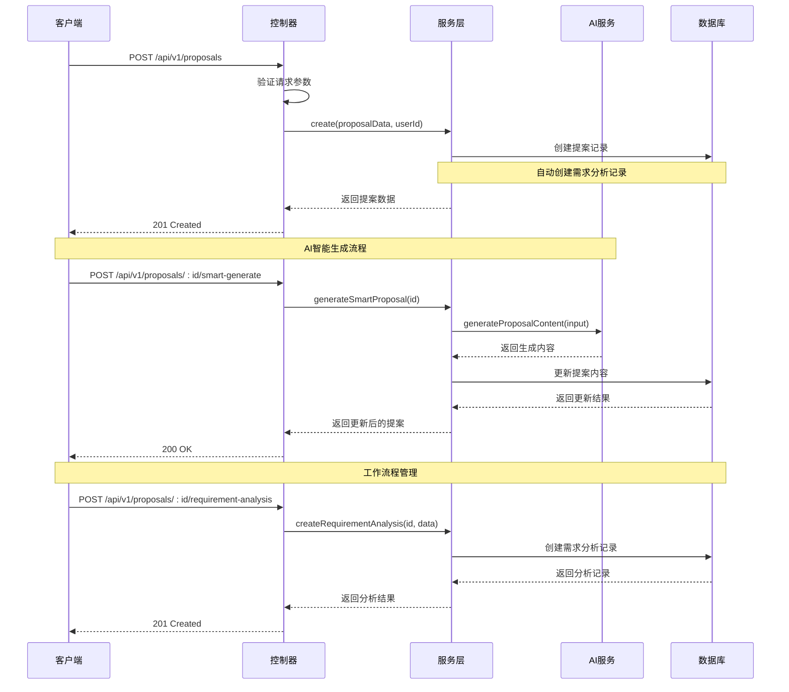
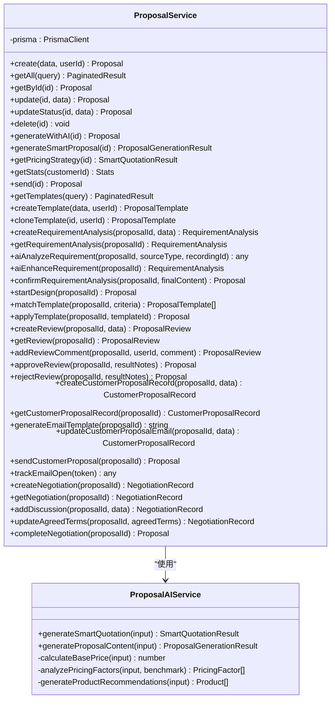
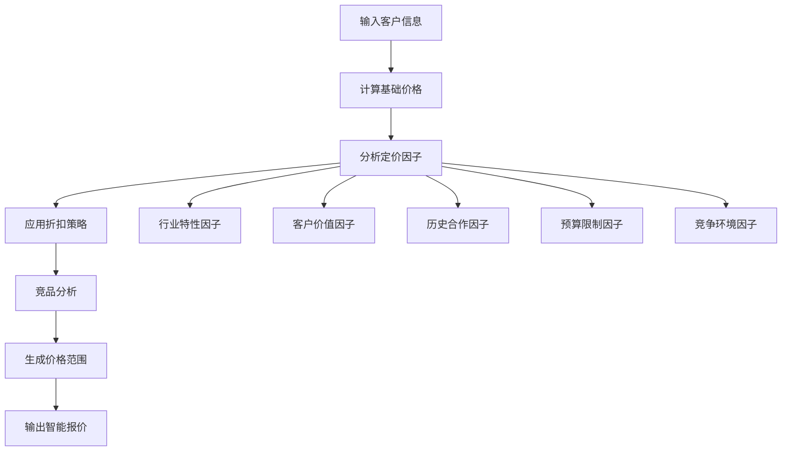
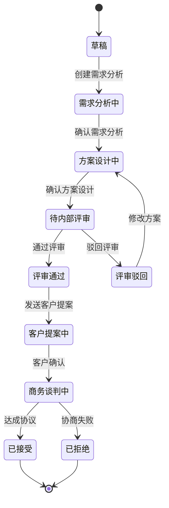
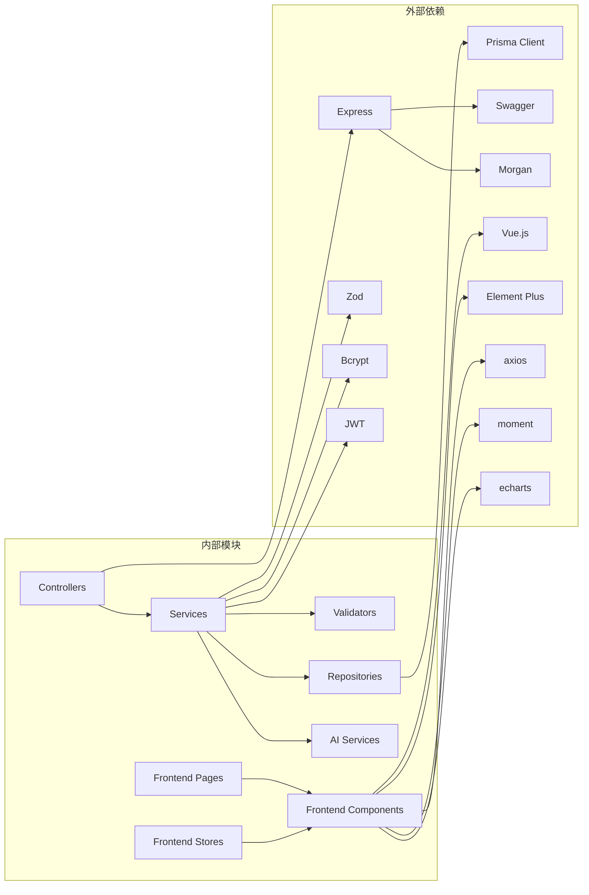

# 提案服务

<cite>
**本文档引用的文件**
- [proposal.controller.ts](file://crm-backend/src/controllers/proposal.controller.ts)
- [proposal.service.ts](file://crm-backend/src/services/proposal.service.ts)
- [proposals.routes.ts](file://crm-backend/src/routes/proposals.routes.ts)
- [proposal.validator.ts](file://crm-backend/src/validators/proposal.validator.ts)
- [prisma.ts](file://crm-backend/src/repositories/prisma.ts)
- [proposalAI.ts](file://crm-backend/src/services/ai/proposalAI.ts)
- [types.ts](file://crm-backend/src/services/ai/types.ts)
- [schema.prisma](file://crm-backend/prisma/schema.prisma)
- [app.ts](file://crm-backend/src/app.ts)
- [package.json](file://crm-backend/package.json)
- [index.tsx](file://crm-frontend/src/pages/Proposals/CreateProposal/index.tsx)
- [index.tsx](file://crm-frontend/src/pages/Proposals/ProposalDetail/index.tsx)
- [RequirementAnalysis.tsx](file://crm-frontend/src/pages/Proposals/ProposalDetail/components/RequirementAnalysis.tsx)
- [ProposalDesign.tsx](file://crm-frontend/src/pages/Proposals/ProposalDetail/components/ProposalDesign.tsx)
- [api.ts](file://crm-frontend/src/services/api.ts)
</cite>

## 更新摘要
**变更内容**
- 新增提案创建逻辑改进：直接进入需求分析阶段，简化初始流程
- 增强AI服务集成：智能报价、方案生成、需求分析、模板匹配等功能
- 简化前端工作流程：四步创建流程，从客户选择到确认创建
- 自动化提案生成和分析：AI驱动的需求提取、痛点分析、产品推荐
- 完整的工作流程管理：需求分析、方案设计、内部评审、客户提案、商务谈判的完整闭环

## 目录
1. [简介](#简介)
2. [项目结构](#项目结构)
3. [核心组件](#核心组件)
4. [架构概览](#架构概览)
5. [详细组件分析](#详细组件分析)
6. [AI智能功能](#ai智能功能)
7. [提案工作流程](#提案工作流程)
8. [前端工作流程](#前端工作流程)
9. [依赖关系分析](#依赖关系分析)
10. [性能考虑](#性能考虑)
11. [故障排除指南](#故障排除指南)
12. [结论](#结论)

## 简介

提案服务是销售AI CRM系统中的核心业务模块，负责管理商务方案的全生命周期。该服务提供了完整的提案创建、编辑、发送、AI智能生成等功能，并集成了先进的AI分析能力，包括智能定价策略、产品推荐、方案内容生成等。

系统采用现代化的微服务架构，基于Node.js和TypeScript构建，使用Express框架提供RESTful API接口，配合Prisma ORM进行数据库操作，集成Swagger进行API文档自动生成。**更新后的系统现已支持简化的提案创建流程，创建后直接进入需求分析阶段，大幅提升了用户体验和工作效率。**

## 项目结构

```mermaid
graph TB
subgraph "后端架构"
A[App入口] --> B[路由层]
B --> C[控制器层]
C --> D[服务层]
D --> E[AI服务层]
D --> F[数据访问层]
F --> G[数据库]
subgraph "AI功能"
E1[智能报价]
E2[方案生成]
E3[产品推荐]
E4[定价策略]
E5[需求分析]
E6[模板匹配]
end
E --> E1
E --> E2
E --> E3
E --> E4
E --> E5
E --> E6
end
subgraph "工作流程"
H[需求分析]
I[方案设计]
J[内部评审]
K[客户提案]
L[商务谈判]
end
H --> I
I --> J
J --> K
K --> L
end
subgraph "前端集成"
M[React前端]
N[API调用]
O[状态管理]
end
M --> N
N --> A
```

**图表来源**
- [app.ts:1-88](file://crm-backend/src/app.ts#L1-L88)
- [proposals.routes.ts:1-653](file://crm-backend/src/routes/proposals.routes.ts#L1-L653)

**章节来源**
- [app.ts:1-88](file://crm-backend/src/app.ts#L1-L88)
- [package.json:1-57](file://crm-backend/package.json#L1-L57)

## 核心组件

### 主要功能模块

提案服务包含以下核心功能模块：

1. **基础CRUD操作** - 创建、读取、更新、删除商务方案
2. **AI智能生成功能** - 基于客户信息的智能方案生成
3. **智能定价策略** - 基于市场分析的定价建议
4. **产品推荐系统** - 个性化产品组合推荐
5. **方案统计分析** - 提案状态和转化率统计
6. **发送和状态管理** - 方案发送和状态跟踪
7. **完整工作流程管理** - 需求分析、方案设计、内部评审、客户提案、商务谈判等阶段
8. **模板管理系统** - 方案模板创建、克隆和匹配
9. **邮件跟踪功能** - 客户提案邮件发送和打开跟踪

### 数据模型

系统使用Prisma定义了完整的数据模型，其中提案模型包含以下关键字段：

- **基本信息**：标题、描述、价值、状态
- **产品信息**：JSON格式的产品数组，包含名称、数量、单价
- **条款信息**：详细的商务条款和条件
- **时间信息**：有效期、发送时间、创建时间
- **关联关系**：与客户和用户的关联关系
- **工作流程关联**：需求分析、评审、客户提案、谈判等关联表

**章节来源**
- [proposal.service.ts:17-43](file://crm-backend/src/services/proposal.service.ts#L17-L43)
- [schema.prisma:376-409](file://crm-backend/prisma/schema.prisma#L376-L409)

## 架构概览



**图表来源**
- [proposal.controller.ts:14-26](file://crm-backend/src/controllers/proposal.controller.ts#L14-L26)
- [proposal.service.ts:327-383](file://crm-backend/src/services/proposal.service.ts#L327-L383)

## 详细组件分析

### 控制器层（ProposalController）

控制器层负责HTTP请求的接收和响应处理，实现了完整的RESTful API接口：

#### 核心方法分析

1. **创建提案** (`create`)
   - 验证用户认证状态
   - 调用服务层创建提案
   - **更新**：创建后直接进入需求分析阶段，状态设为'requirement_analysis'

2. **获取提案列表** (`getAll`)
   - 支持分页、筛选、排序
   - 复杂的查询条件处理
   - 返回分页结果

3. **AI智能生成** (`generateSmartProposal`)
   - 集成AI服务生成完整方案
   - 返回详细的生成结果

4. **获取统计信息** (`getStats`)
   - 计算总数、总价值、平均值
   - 分析状态分布和转化率

5. **工作流程管理** - 新增多个工作流程相关方法
   - 需求分析：创建、获取、AI分析、确认
   - 方案设计：开始设计、模板匹配、应用模板
   - 内部评审：创建评审、添加评论、批准/驳回
   - 客户提案：创建记录、生成邮件、发送邮件、跟踪
   - 商务谈判：创建记录、添加讨论、更新条款、完成谈判

**章节来源**
- [proposal.controller.ts:9-636](file://crm-backend/src/controllers/proposal.controller.ts#L9-L636)

### 服务层（ProposalService）

服务层是业务逻辑的核心，实现了复杂的业务规则和数据处理：

#### 主要功能模块

1. **基础CRUD操作**
   - 创建提案时自动设置状态为'requirement_analysis'
   - 支持复杂查询条件的组合
   - 包含完整的数据验证

2. **AI集成功能**
   - 智能报价生成
   - 方案内容生成
   - 产品推荐算法
   - 定价策略分析

3. **统计分析**
   - 实时统计计算
   - 转化率分析
   - 状态分布统计

4. **工作流程管理** - 新增完整的工作流程管理功能
   - 需求分析阶段：创建分析记录、AI提取需求、确认需求
   - 方案设计阶段：开始设计、模板匹配、应用模板
   - 内部评审阶段：创建评审、添加评论、审批决策
   - 客户提案阶段：创建记录、生成邮件、发送邮件、跟踪打开
   - 商务谈判阶段：创建记录、讨论记录、条款确认、完成谈判



**图表来源**
- [proposal.service.ts:10-1178](file://crm-backend/src/services/proposal.service.ts#L10-L1178)
- [proposalAI.ts:53-599](file://crm-backend/src/services/ai/proposalAI.ts#L53-L599)

**章节来源**
- [proposal.service.ts:10-1178](file://crm-backend/src/services/proposal.service.ts#L10-L1178)

### 路由层（Proposals Routes）

路由层定义了完整的API接口规范：

#### API端点设计

| 方法 | 路径 | 功能 | 安全要求 |
|------|------|------|----------|
| GET | `/proposals` | 获取提案列表 | Bearer Token |
| POST | `/proposals` | 创建新提案 | Bearer Token |
| GET | `/proposals/:id` | 获取提案详情 | Bearer Token |
| PUT | `/proposals/:id` | 更新提案 | Bearer Token |
| PATCH | `/proposals/:id/status` | 更新状态 | Bearer Token |
| POST | `/proposals/:id/send` | 发送提案 | Bearer Token |
| POST | `/proposals/:id/generate` | AI生成内容 | Bearer Token |
| POST | `/proposals/:id/smart-generate` | 智能生成方案 | Bearer Token |
| GET | `/proposals/:id/pricing-strategy` | 获取定价策略 | Bearer Token |
| GET | `/proposals/:id/recommend-products` | 获取产品推荐 | Bearer Token |
| GET | `/proposals/stats` | 获取统计信息 | Bearer Token |
| **新增工作流程端点** | | | |
| POST | `/proposals/:id/requirement-analysis` | 创建需求分析 | Bearer Token |
| GET | `/proposals/:id/requirement-analysis` | 获取需求分析 | Bearer Token |
| POST | `/proposals/:id/requirement-analysis/ai-analyze` | AI分析需求 | Bearer Token |
| POST | `/proposals/:id/requirement-analysis/ai-enhance` | AI补充需求 | Bearer Token |
| PUT | `/proposals/:id/requirement-analysis` | 更新需求分析 | Bearer Token |
| POST | `/proposals/:id/requirement-analysis/confirm` | 确认需求分析 | Bearer Token |
| POST | `/proposals/:id/design` | 开始方案设计 | Bearer Token |
| POST | `/proposals/:id/design/match-template` | AI匹配模板 | Bearer Token |
| POST | `/proposals/:id/design/apply-template` | 应用模板 | Bearer Token |
| PUT | `/proposals/:id/design` | 更新方案设计 | Bearer Token |
| POST | `/proposals/:id/design/confirm` | 确认方案设计 | Bearer Token |
| POST | `/proposals/:id/review` | 发起内部评审 | Bearer Token |
| GET | `/proposals/:id/review` | 获取评审信息 | Bearer Token |
| POST | `/proposals/:id/review/comment` | 添加评审意见 | Bearer Token |
| POST | `/proposals/:id/review/approve` | 评审通过 | Bearer Token |
| POST | `/proposals/:id/review/reject` | 评审驳回 | Bearer Token |
| POST | `/proposals/:id/customer-proposal` | 创建客户提案 | Bearer Token |
| GET | `/proposals/:id/customer-proposal` | 获取客户提案信息 | Bearer Token |
| POST | `/proposals/:id/customer-proposal/generate-email` | 生成邮件模板 | Bearer Token |
| PUT | `/proposals/:id/customer-proposal/email` | 更新邮件内容 | Bearer Token |
| POST | `/proposals/:id/customer-proposal/send` | 发送客户提案 | Bearer Token |
| GET | `/proposals/track/:token` | 邮件打开跟踪 | 无 |
| POST | `/proposals/:id/negotiation` | 创建商务谈判 | Bearer Token |
| GET | `/proposals/:id/negotiation` | 获取谈判记录 | Bearer Token |
| POST | `/proposals/:id/negotiation/discussion` | 添加讨论记录 | Bearer Token |
| PUT | `/proposals/:id/negotiation/terms` | 更新条款 | Bearer Token |
| POST | `/proposals/:id/negotiation/complete` | 完成谈判 | Bearer Token |

**章节来源**
- [proposals.routes.ts:1-653](file://crm-backend/src/routes/proposals.routes.ts#L1-L653)

### 数据验证层（Zod Schema）

系统使用Zod进行严格的数据验证：

#### 核心验证规则

1. **提案创建验证**
   - 客户ID必填且非空
   - 标题长度限制（1-200字符）
   - 金额必须为正数
   - 产品数组格式验证

2. **查询参数验证**
   - 分页参数（page、limit）
   - 筛选条件（customerId、status）
   - 时间范围过滤
   - 搜索关键词

3. **状态枚举验证**
   - draft（草稿）
   - requirement_analysis（需求分析中）
   - designing（方案设计中）
   - pending_review（待内部评审）
   - review_passed（评审通过）
   - review_rejected（评审驳回）
   - customer_proposal（客户提案中）
   - negotiation（商务谈判中）
   - sent（已发送）
   - accepted（已接受）
   - rejected（已拒绝）
   - expired（已过期）

4. **工作流程验证** - 新增工作流程相关验证
   - 需求分析：来源类型、录音ID、原始内容
   - 方案设计：模板ID、产品数组、条款
   - 内部评审：评审人ID、共享人员、评审意见
   - 客户提案：收件人邮箱、邮件主题、邮件正文
   - 商务谈判：讨论内容、参与者、确认条款

**章节来源**
- [proposal.validator.ts:1-240](file://crm-backend/src/validators/proposal.validator.ts#L1-L240)

## AI智能功能

### 智能报价系统



**图表来源**
- [proposalAI.ts:58-106](file://crm-backend/src/services/ai/proposalAI.ts#L58-L106)

### 方案生成引擎

AI服务能够生成完整的商务方案，包括：
- 执行摘要
- 问题陈述
- 解决方案
- 产品推荐
- 实施计划
- 服务条款
- ROI预测
- 下一步行动

### 产品推荐系统

基于行业特性和客户价值，系统提供个性化的产品推荐：
- 行业基准数据（11个行业）
- 产品配置模板
- 价格估算和调整
- 优先级排序（essential/recommended/optional）

### 定价策略分析

AI服务提供全面的定价策略分析：
- 基于行业基准的定价建议
- 客户价值评估
- 竞争对手分析
- 折扣策略制定
- ROI预测和风险评估

**章节来源**
- [proposalAI.ts:112-154](file://crm-backend/src/services/ai/proposalAI.ts#L112-L154)

## 提案工作流程

### 需求分析阶段

系统支持多种需求来源的AI分析：
- **手动输入**：人工录入需求
- **录音分析**：AI分析通话录音
- **跟进分析**：AI分析客户跟进记录

需求分析包括：
- 客户需求提取
- 痛点分析
- 预算线索识别
- 决策时间线预测

### 方案设计阶段

提供智能模板匹配和方案设计：
- **模板匹配**：基于行业、预算、需求匹配最佳模板
- **AI增强**：利用客户洞察增强方案内容
- **产品配置**：智能产品组合推荐
- **条款生成**：标准商务条款生成

### 内部评审阶段

完整的评审流程管理：
- **评审发起**：分配评审人和共享团队
- **意见收集**：多轮评审意见收集
- **决策审批**：批准或驳回决策
- **结果记录**：评审结果和备注

### 客户提案阶段

智能化的客户提案管理：
- **邮件模板生成**：AI生成个性化邮件
- **提案发送**：支持多种发送方式
- **邮件跟踪**：打开率和点击率跟踪
- **互动管理**：客户反馈和后续跟进

### 商务谈判阶段

全面的谈判管理：
- **讨论记录**：谈判过程记录
- **条款确认**：关键条款协商确认
- **文档生成**：最终协议文档
- **状态跟踪**：谈判进度和结果



**图表来源**
- [schema.prisma:43-56](file://crm-backend/prisma/schema.prisma#L43-L56)

**章节来源**
- [proposal.service.ts:588-1178](file://crm-backend/src/services/proposal.service.ts#L588-L1178)

## 前端工作流程

### 简化的创建流程

前端采用了全新的四步创建流程，大幅简化了用户操作：

1. **选择客户** - 从客户列表中选择目标客户
2. **选择模板** - 可选的模板选择，支持跳过
3. **填写基本信息** - 填写方案标题、金额、描述等
4. **确认创建** - 最终确认并创建提案

### 需求分析界面

需求分析界面提供了灵活的需求输入方式：
- **手动输入**：直接输入需求内容
- **AI分析录音**：从通话录音中提取需求
- **AI增强**：AI对需求内容进行补充和优化

### 方案设计界面

方案设计界面支持：
- **模板匹配**：AI智能匹配最适合的模板
- **产品配置**：灵活的产品组合配置
- **条款编辑**：详细的商务条款编辑
- **实时预览**：设计过程中的实时预览

**章节来源**
- [index.tsx:1-426](file://crm-frontend/src/pages/Proposals/CreateProposal/index.tsx#L1-L426)
- [index.tsx:1-236](file://crm-frontend/src/pages/Proposals/ProposalDetail/index.tsx#L1-L236)
- [RequirementAnalysis.tsx:1-301](file://crm-frontend/src/pages/Proposals/ProposalDetail/components/RequirementAnalysis.tsx#L1-L301)
- [ProposalDesign.tsx:1-323](file://crm-frontend/src/pages/Proposals/ProposalDetail/components/ProposalDesign.tsx#L1-L323)

## 依赖关系分析



**图表来源**
- [package.json:17-32](file://crm-backend/package.json#L17-L32)
- [proposal.controller.ts:1-5](file://crm-backend/src/controllers/proposal.controller.ts#L1-L5)

### 核心依赖说明

1. **Express** - Web框架，提供HTTP服务器功能
2. **Prisma** - ORM工具，简化数据库操作
3. **Zod** - 类型安全的验证库
4. **Swagger** - API文档自动生成
5. **Bcrypt** - 密码加密
6. **JWT** - 用户认证
7. **Vue.js** - 前端框架
8. **Element Plus** - UI组件库
9. **Axios** - HTTP客户端
10. **Moment.js** - 日期处理
11. **ECharts** - 图表可视化

**章节来源**
- [package.json:17-32](file://crm-backend/package.json#L17-L32)

## 性能考虑

### 数据库优化

1. **索引策略**
   - 在`customerId`、`status`、`ownerId`字段建立索引
   - 对常用查询字段建立复合索引
   - 优化分页查询的排序字段

2. **查询优化**
   - 使用`select`指定需要的字段
   - 避免N+1查询问题
   - 实现批量操作

### AI服务性能

1. **异步处理**
   - AI生成操作使用Promise并行处理
   - 避免阻塞主线程
   - 实现超时机制

2. **缓存策略**
   - 定价基准数据缓存
   - 产品推荐配置缓存
   - 频繁查询结果缓存

3. **延迟模拟**
   - AI处理过程模拟真实延迟
   - 提升用户体验一致性

### API性能优化

1. **请求限制**
   - 实现速率限制防止滥用
   - 大文件上传限制
   - 请求体大小限制

2. **响应优化**
   - 分页返回大量数据
   - 压缩响应内容
   - 缓存静态资源

3. **并发处理**
   - 工作流程阶段并行处理
   - AI分析异步执行
   - 邮件发送队列管理

## 故障排除指南

### 常见错误处理

1. **认证失败**
   - 检查JWT令牌有效性
   - 验证用户权限
   - 处理令牌过期情况

2. **数据验证错误**
   - 检查请求参数格式
   - 验证数据类型和范围
   - 提供详细的错误信息

3. **数据库连接问题**
   - 检查数据库连接字符串
   - 验证数据库服务状态
   - 处理连接池耗尽

4. **AI服务异常**
   - 检查AI服务可用性
   - 处理AI生成超时
   - 提供降级方案

### 调试技巧

1. **日志记录**
   - 使用Morgan记录HTTP请求
   - Winston记录应用日志
   - 结构化错误日志

2. **监控指标**
   - API响应时间监控
   - 数据库查询性能
   - AI服务调用统计
   - 工作流程状态跟踪

**章节来源**
- [proposal.controller.ts:17-25](file://crm-backend/src/controllers/proposal.controller.ts#L17-L25)
- [proposal.service.ts:182-183](file://crm-backend/src/services/proposal.service.ts#L182-L183)

## 结论

提案服务作为销售AI CRM系统的核心模块，展现了现代企业级应用的设计理念和技术架构。**经过本次更新，系统不仅具备了完整的AI智能功能，还实现了简化的提案创建流程和完整的工作流程管理。**

主要优势包括：
- **简化的创建流程**：四步创建流程，从客户选择到确认创建
- **智能的初始状态**：创建后直接进入需求分析阶段，无需手动切换
- **完整的AI能力**：智能定价、方案生成、产品推荐、需求分析、模板匹配
- **智能化的邮件跟踪**：客户互动和反馈管理
- **严格的验证机制**：全面的数据验证和状态管理
- **完善的错误处理**：全面的异常捕获和处理机制
- **良好的扩展性**：模块化设计便于功能扩展

该系统为企业销售团队提供了智能化的完整提案管理工具，能够显著提升销售效率和客户转化率，从需求发现到最终成交的全过程都得到了AI技术的强力支持。新的架构改进使得整个提案流程更加高效、直观和智能化，为用户提供了更好的使用体验。