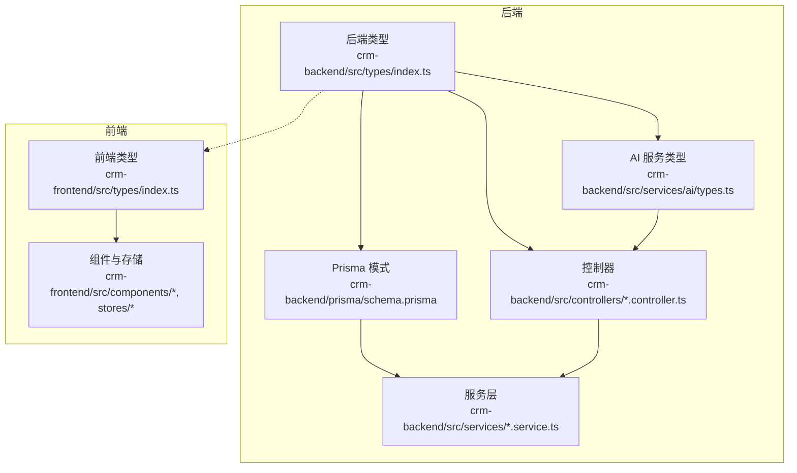
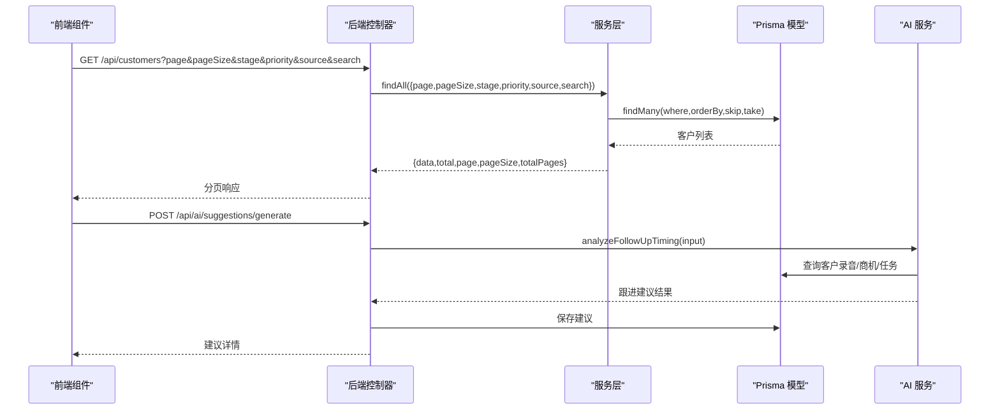
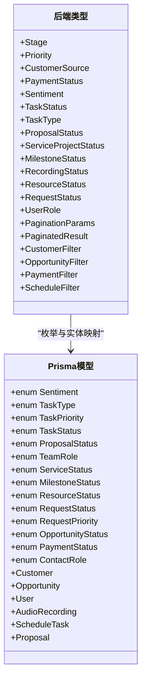
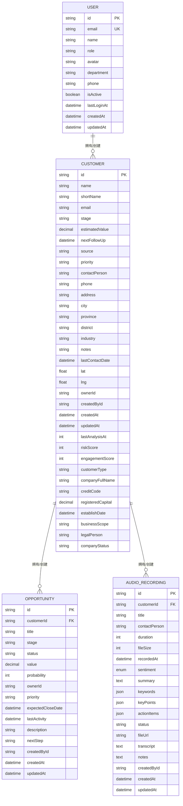
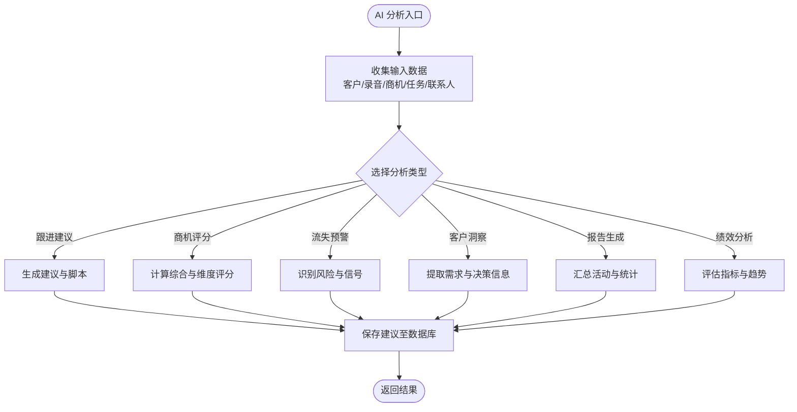
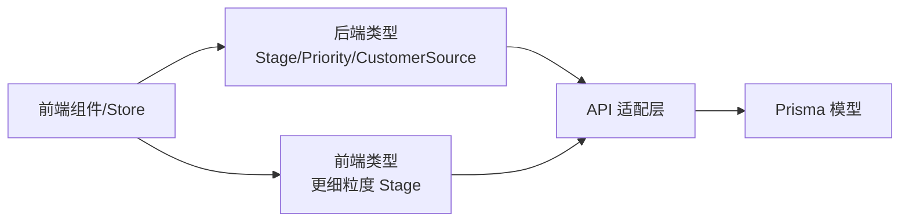
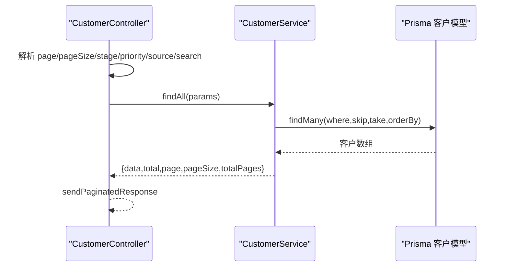
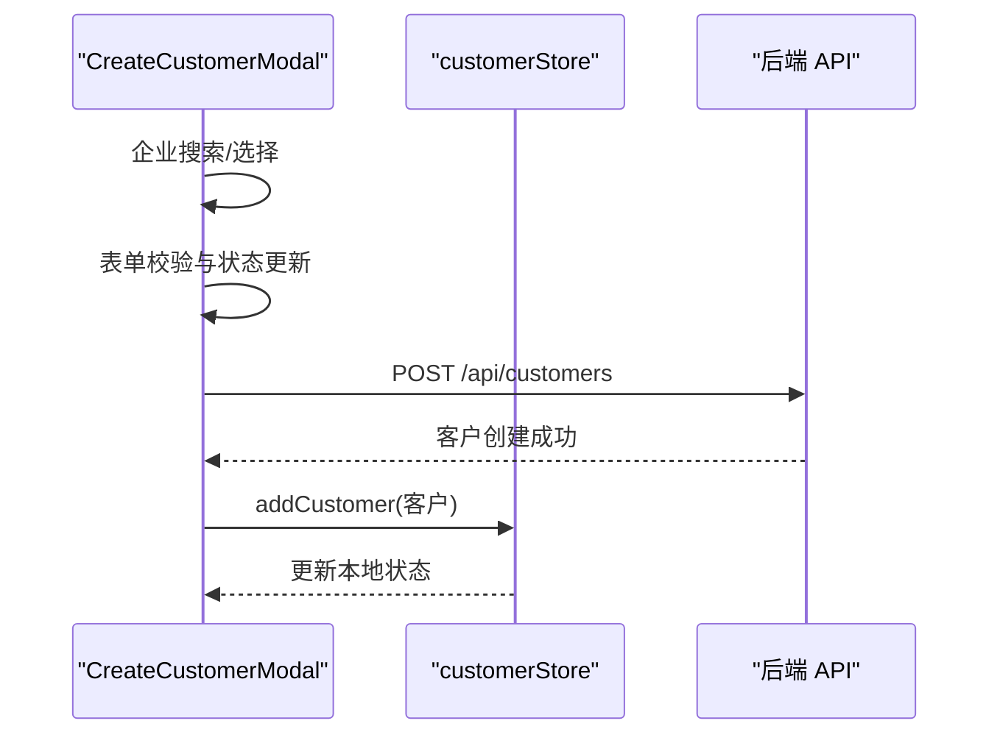
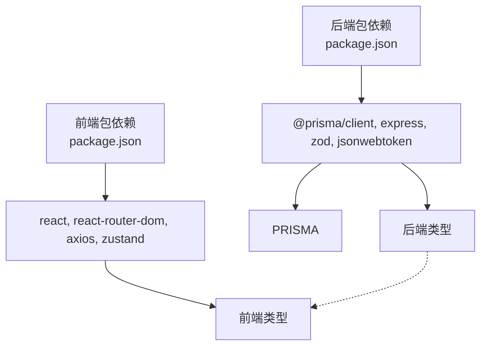

# 类型

<cite>
**本文档引用的文件**
- [crm-backend/src/types/index.ts](file://crm-backend/src/types/index.ts)
- [crm-frontend/src/types/index.ts](file://crm-frontend/src/types/index.ts)
- [crm-backend/prisma/schema.prisma](file://crm-backend/prisma/schema.prisma)
- [crm-backend/src/services/ai/types.ts](file://crm-backend/src/services/ai/types.ts)
- [crm-backend/src/controllers/customer.controller.ts](file://crm-backend/src/controllers/customer.controller.ts)
- [crm-backend/src/services/customer.service.ts](file://crm-backend/src/services/customer.service.ts)
- [crm-backend/src/controllers/ai.controller.ts](file://crm-backend/src/controllers/ai.controller.ts)
- [crm-frontend/src/components/Customers/CreateCustomerModal.tsx](file://crm-frontend/src/components/Customers/CreateCustomerModal.tsx)
- [crm-frontend/src/stores/customerStore.ts](file://crm-frontend/src/stores/customerStore.ts)
- [crm-backend/package.json](file://crm-backend/package.json)
- [crm-frontend/package.json](file://crm-frontend/package.json)
</cite>

## 目录
1. [简介](#简介)
2. [项目结构](#项目结构)
3. [核心类型系统](#核心类型系统)
4. [架构总览](#架构总览)
5. [详细类型分析](#详细类型分析)
6. [依赖关系分析](#依赖关系分析)
7. [性能考量](#性能考量)
8. [故障排除指南](#故障排除指南)
9. [结论](#结论)

## 简介
本文件系统性梳理销售AI CRM系统的类型定义与使用，覆盖后端 TypeScript 类型、Prisma 数据模型、前端 TS 类型以及跨端类型一致性策略。重点包括：
- 后端通用类型（枚举、分页、过滤器）
- Prisma 数据模型枚举与实体
- AI 服务专用类型
- 前后端类型映射与约束
- 实际业务组件中的类型使用示例

## 项目结构
系统采用前后端分离架构，类型分布在三个层面：
- 后端通用类型：位于 `crm-backend/src/types/index.ts`
- Prisma 数据模型：位于 `crm-backend/prisma/schema.prisma`
- 前端 TS 类型：位于 `crm-frontend/src/types/index.ts`
- AI 服务类型：位于 `crm-backend/src/services/ai/types.ts`

图表来源
- [crm-backend/src/types/index.ts:1-85](file://crm-backend/src/types/index.ts#L1-L85)
- [crm-backend/prisma/schema.prisma:1-140](file://crm-backend/prisma/schema.prisma#L1-L140)
- [crm-backend/src/services/ai/types.ts:1-657](file://crm-backend/src/services/ai/types.ts#L1-L657)
- [crm-frontend/src/types/index.ts:1-774](file://crm-frontend/src/types/index.ts#L1-L774)

章节来源
- [crm-backend/src/types/index.ts:1-85](file://crm-backend/src/types/index.ts#L1-L85)
- [crm-backend/prisma/schema.prisma:1-140](file://crm-backend/prisma/schema.prisma#L1-L140)
- [crm-frontend/src/types/index.ts:1-774](file://crm-frontend/src/types/index.ts#L1-L774)

## 核心类型系统
后端提供统一的类型定义，涵盖业务枚举、分页与过滤器：
- 枚举类型：Stage、Priority、CustomerSource、PaymentStatus、Sentiment、TaskStatus、TaskType、ProposalStatus、ServiceProjectStatus、MilestoneStatus、RecordingStatus、ResourceStatus、RequestStatus、UserRole
- 分页与过滤：PaginationParams、PaginatedResult、CustomerFilter、OpportunityFilter、PaymentFilter、ScheduleFilter
- 标签映射：STAGE_LABELS、PRIORITY_LABELS、PAYMENT_STATUS_LABELS、SOURCE_LABELS

这些类型为控制器、服务层与 Prisma 模型之间建立契约，确保数据一致性。

章节来源
- [crm-backend/src/types/index.ts:1-85](file://crm-backend/src/types/index.ts#L1-L85)

## 架构总览
类型在系统中的流转路径如下：
- 前端组件通过 API 请求携带查询参数（如分页、过滤），后端控制器解析并调用服务层
- 服务层根据类型定义构造查询条件，访问 Prisma 模型进行数据操作
- AI 服务使用专用类型进行分析与生成，结果写入 Prisma 模型
- 前端接收响应并渲染，同时维护本地状态 Store

图表来源
- [crm-backend/src/controllers/customer.controller.ts:1-58](file://crm-backend/src/controllers/customer.controller.ts#L1-L58)
- [crm-backend/src/services/customer.service.ts:1-225](file://crm-backend/src/services/customer.service.ts#L1-L225)
- [crm-backend/src/controllers/ai.controller.ts:1-800](file://crm-backend/src/controllers/ai.controller.ts#L1-L800)
- [crm-backend/src/services/ai/types.ts:1-657](file://crm-backend/src/services/ai/types.ts#L1-L657)

## 详细类型分析

### 后端通用类型
- 枚举与标签映射：统一了业务状态与显示文本，便于前后端一致展示
- 分页与过滤器：标准化查询参数，减少重复逻辑
- 与 Prisma 的对应关系：Prisma 枚举与后端类型保持一致，避免运行时错误

图表来源
- [crm-backend/src/types/index.ts:1-85](file://crm-backend/src/types/index.ts#L1-L85)
- [crm-backend/prisma/schema.prisma:13-140](file://crm-backend/prisma/schema.prisma#L13-L140)

章节来源
- [crm-backend/src/types/index.ts:1-85](file://crm-backend/src/types/index.ts#L1-L85)
- [crm-backend/prisma/schema.prisma:13-140](file://crm-backend/prisma/schema.prisma#L13-L140)

### Prisma 数据模型与枚举
- 枚举定义：包含 Sentiment、TaskType、TaskPriority、TaskStatus、ProposalStatus、TeamRole、ServiceStatus、MilestoneStatus、ResourceStatus、RequestStatus、RequestPriority、OpportunityStatus、PaymentStatus、ContactRole 等
- 实体关系：Customer、Opportunity、User、AudioRecording、ScheduleTask、Proposal 等模型之间的外键与索引
- 字段约束：数值精度（Decimal）、JSON 字段用于复杂对象存储（如需求分析、预算信息）

图表来源
- [crm-backend/prisma/schema.prisma:142-260](file://crm-backend/prisma/schema.prisma#L142-L260)
- [crm-backend/prisma/schema.prisma:264-293](file://crm-backend/prisma/schema.prisma#L264-L293)
- [crm-backend/prisma/schema.prisma:322-353](file://crm-backend/prisma/schema.prisma#L322-L353)

章节来源
- [crm-backend/prisma/schema.prisma:142-260](file://crm-backend/prisma/schema.prisma#L142-L260)
- [crm-backend/prisma/schema.prisma:264-293](file://crm-backend/prisma/schema.prisma#L264-L293)
- [crm-backend/prisma/schema.prisma:322-353](file://crm-backend/prisma/schema.prisma#L322-L353)

### AI 服务类型
AI 服务类型定义了分析与生成的输入输出结构，涵盖：
- 跟进建议：输入客户历史、录音、商机、任务；输出建议类型、优先级、理由与脚本
- 商机评分：输入客户与录音、联系人、任务；输出综合评分、维度评分、风险因素与改进建议
- 流失预警：输入客户状态、录音、商机、任务、联系人；输出风险等级、原因、信号与挽留建议
- 客户洞察：输入录音、联系人、备注；输出需求、预算、决策人、痛点、竞品与时间线
- 报告生成：输入用户与活动数据；输出日报/周报摘要、亮点、风险与下一步行动
- 销售绩效与教练：输入周期性指标；输出整体评分、能力矩阵、优势与劣势、趋势预测与教练建议

图表来源
- [crm-backend/src/services/ai/types.ts:1-657](file://crm-backend/src/services/ai/types.ts#L1-L657)
- [crm-backend/src/controllers/ai.controller.ts:1-800](file://crm-backend/src/controllers/ai.controller.ts#L1-L800)

章节来源
- [crm-backend/src/services/ai/types.ts:1-657](file://crm-backend/src/services/ai/types.ts#L1-L657)
- [crm-backend/src/controllers/ai.controller.ts:1-800](file://crm-backend/src/controllers/ai.controller.ts#L1-L800)

### 前后端类型一致性
- 前端类型与后端类型存在差异：例如前端 Stage 更细化（quoted、procurement_process、contract_stage），后端 Stage 较简化（new_lead、contacted、solution、negotiation、won）
- 建议策略：在控制器层进行类型转换或在 API 层做适配，保证数据库与前端展示的一致性
- 前端组件使用类型进行表单验证与状态管理，如创建客户模态框中的企业搜索、客户分类、优先级与来源选择

图表来源
- [crm-frontend/src/types/index.ts:1-774](file://crm-frontend/src/types/index.ts#L1-L774)
- [crm-backend/src/types/index.ts:1-85](file://crm-backend/src/types/index.ts#L1-L85)
- [crm-backend/prisma/schema.prisma:100-124](file://crm-backend/prisma/schema.prisma#L100-L124)

章节来源
- [crm-frontend/src/types/index.ts:1-774](file://crm-frontend/src/types/index.ts#L1-L774)
- [crm-backend/src/types/index.ts:1-85](file://crm-backend/src/types/index.ts#L1-L85)
- [crm-backend/prisma/schema.prisma:100-124](file://crm-backend/prisma/schema.prisma#L100-L124)

### 实际使用示例

#### 控制器与服务层
- 客户控制器解析分页与过滤参数，调用服务层执行查询与统计
- 服务层构建 Prisma 查询条件，处理空值与类型转换

图表来源
- [crm-backend/src/controllers/customer.controller.ts:1-58](file://crm-backend/src/controllers/customer.controller.ts#L1-L58)
- [crm-backend/src/services/customer.service.ts:1-225](file://crm-backend/src/services/customer.service.ts#L1-L225)

章节来源
- [crm-backend/src/controllers/customer.controller.ts:1-58](file://crm-backend/src/controllers/customer.controller.ts#L1-L58)
- [crm-backend/src/services/customer.service.ts:1-225](file://crm-backend/src/services/customer.service.ts#L1-L225)

#### 前端组件与状态管理
- 创建客户模态框使用前端类型进行表单校验与企业搜索
- Zustand Store 管理客户状态，提供增删改查与按阶段筛选

图表来源
- [crm-frontend/src/components/Customers/CreateCustomerModal.tsx:1-707](file://crm-frontend/src/components/Customers/CreateCustomerModal.tsx#L1-L707)
- [crm-frontend/src/stores/customerStore.ts:1-53](file://crm-frontend/src/stores/customerStore.ts#L1-L53)

章节来源
- [crm-frontend/src/components/Customers/CreateCustomerModal.tsx:1-707](file://crm-frontend/src/components/Customers/CreateCustomerModal.tsx#L1-L707)
- [crm-frontend/src/stores/customerStore.ts:1-53](file://crm-frontend/src/stores/customerStore.ts#L1-L53)

## 依赖关系分析
- 后端依赖：Express、Prisma Client、Zod、JWT、BcryptJS 等
- 前端依赖：React、React Router、Axios、Zustand 等
- 类型依赖：后端类型与 Prisma 枚举强绑定，前端类型与后端类型弱绑定（通过 API 适配）

图表来源
- [crm-backend/package.json:17-34](file://crm-backend/package.json#L17-L34)
- [crm-frontend/package.json:12-19](file://crm-frontend/package.json#L12-L19)

章节来源
- [crm-backend/package.json:17-34](file://crm-backend/package.json#L17-L34)
- [crm-frontend/package.json:12-19](file://crm-frontend/package.json#L12-L19)

## 性能考量
- 类型约束减少运行时错误，提升开发效率与稳定性
- Prisma JSON 字段适合存储动态结构，但查询性能需结合索引与投影优化
- 前端 Store 仅用于本地演示，生产环境应以 API 为主，避免状态膨胀
- AI 分析涉及多模型关联查询，建议在控制器层合并查询并限制返回字段

## 故障排除指南
- 类型不一致：若发现前端展示与数据库枚举不一致，检查 API 适配层是否正确转换
- 查询性能：对高频查询字段（如 stage、priority、status）建立索引，使用投影减少字段传输
- AI 分析异常：确认 Prisma 模型中 JSON 字段存在且结构一致，控制器层对空值进行保护

## 结论
本系统通过后端统一类型、Prisma 枚举与实体映射、前端类型与组件状态管理，形成完整的类型体系。建议进一步完善前后端类型映射与 API 适配，确保业务状态在全链路一致、可追踪、可维护。