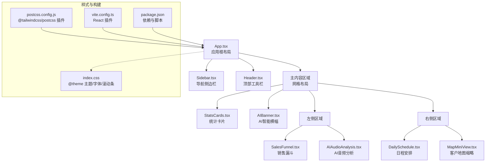
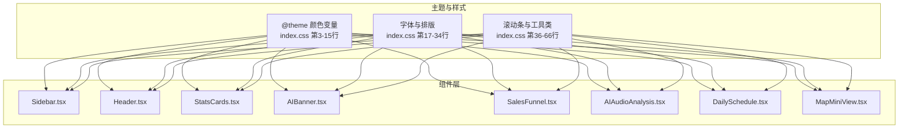
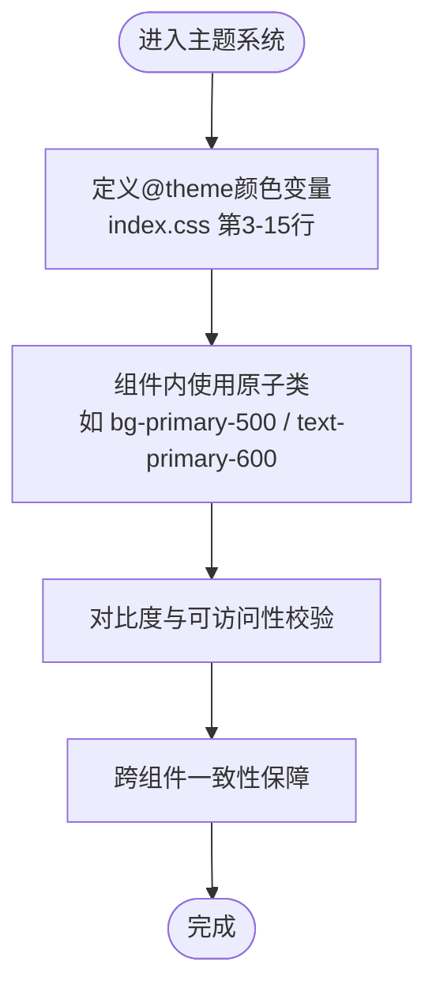
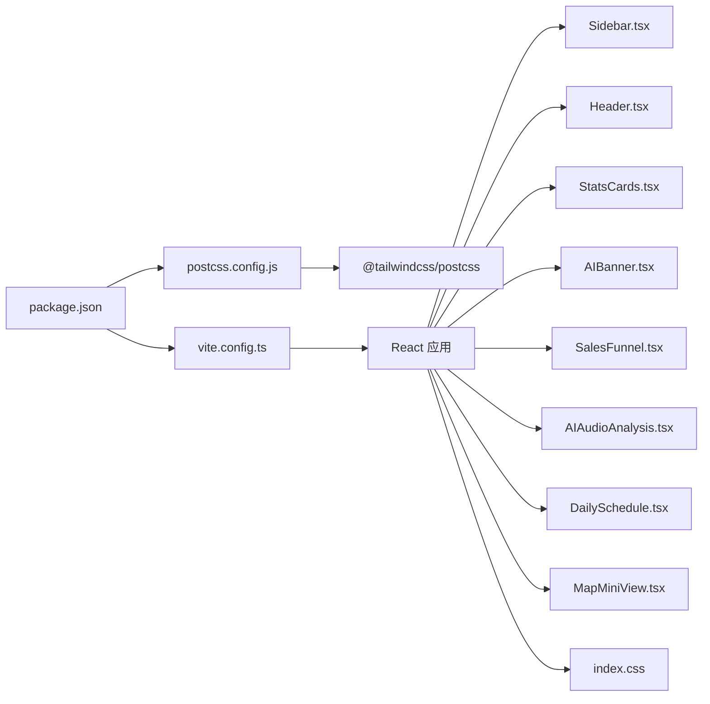

# UI/UX设计

<cite>
**本文引用的文件**
- [index.css](file://crm-frontend/src/index.css)
- [package.json](file://crm-frontend/package.json)
- [postcss.config.js](file://crm-frontend/postcss.config.js)
- [vite.config.ts](file://crm-frontend/vite.config.ts)
- [App.tsx](file://crm-frontend/src/App.tsx)
- [Header.tsx](file://crm-frontend/src/components/Header.tsx)
- [Sidebar.tsx](file://crm-frontend/src/components/Sidebar.tsx)
- [AIBanner.tsx](file://crm-frontend/src/components/AIBanner.tsx)
- [StatsCards.tsx](file://crm-frontend/src/components/StatsCards.tsx)
- [SalesFunnel.tsx](file://crm-frontend/src/components/SalesFunnel.tsx)
- [AIAudioAnalysis.tsx](file://crm-frontend/src/components/AIAudioAnalysis.tsx)
- [DailySchedule.tsx](file://crm-frontend/src/components/DailySchedule.tsx)
- [MapMiniView.tsx](file://crm-frontend/src/components/MapMiniView.tsx)
</cite>

## 目录
1. [引言](#引言)
2. [项目结构](#项目结构)
3. [核心组件](#核心组件)
4. [架构总览](#架构总览)
5. [详细组件分析](#详细组件分析)
6. [依赖分析](#依赖分析)
7. [性能考量](#性能考量)
8. [故障排查指南](#故障排查指南)
9. [结论](#结论)
10. [附录](#附录)

## 引言
本设计文档面向销售AI CRM系统的前端UI/UX设计，围绕基于Tailwind CSS v4的原子化设计原则与主题系统展开，结合项目中已实现的组件与样式，系统性地梳理颜色体系、字体规范、间距标准、响应式策略、交互模式与视觉层次，并给出可落地的设计系统规范与移动端、无障碍设计建议。文档同时提供组件级的类名使用路径与可视化图示，帮助设计师与开发者协同推进设计一致性与开发效率。

## 项目结构
前端采用Vite + React + Tailwind CSS v4（@theme原语）构建，PostCSS集成Tailwind v4插件，全局样式通过index.css集中定义，组件按功能模块拆分在src/components目录下，主应用布局由App.tsx组织侧边栏、头部、内容区与网格布局。

**图表来源**
- [App.tsx:10-55](file://crm-frontend/src/App.tsx#L10-L55)
- [Sidebar.tsx:37-82](file://crm-frontend/src/components/Sidebar.tsx#L37-L82)
- [Header.tsx:3-50](file://crm-frontend/src/components/Header.tsx#L3-L50)
- [StatsCards.tsx:35-78](file://crm-frontend/src/components/StatsCards.tsx#L35-L78)
- [AIBanner.tsx:3-43](file://crm-frontend/src/components/AIBanner.tsx#L3-L43)
- [SalesFunnel.tsx:29-62](file://crm-frontend/src/components/SalesFunnel.tsx#L29-L62)
- [AIAudioAnalysis.tsx:38-77](file://crm-frontend/src/components/AIAudioAnalysis.tsx#L38-L77)
- [DailySchedule.tsx:26-65](file://crm-frontend/src/components/DailySchedule.tsx#L26-L65)
- [MapMiniView.tsx:3-53](file://crm-frontend/src/components/MapMiniView.tsx#L3-L53)
- [index.css:1-66](file://crm-frontend/src/index.css#L1-L66)
- [postcss.config.js:1-6](file://crm-frontend/postcss.config.js#L1-L6)
- [vite.config.ts:1-8](file://crm-frontend/vite.config.ts#L1-L8)
- [package.json:1-36](file://crm-frontend/package.json#L1-L36)

**章节来源**
- [App.tsx:10-55](file://crm-frontend/src/App.tsx#L10-L55)
- [index.css:1-66](file://crm-frontend/src/index.css#L1-L66)
- [postcss.config.js:1-6](file://crm-frontend/postcss.config.js#L1-L6)
- [vite.config.ts:1-8](file://crm-frontend/vite.config.ts#L1-L8)
- [package.json:1-36](file://crm-frontend/package.json#L1-L36)

## 核心组件
- 布局容器：App.tsx负责整体布局，采用flex分栏，左侧固定宽度侧边栏，右侧主内容区自适应滚动。
- 导航与头部：Sidebar.tsx提供导航项与“新建线索”按钮；Header.tsx包含搜索框、升级按钮、通知与用户信息。
- 内容区块：StatsCards.tsx展示关键指标卡片；AIBanner.tsx用于AI智能提示；SalesFunnel.tsx展示销售漏斗；AIAudioAnalysis.tsx展示AI语音分析摘要；DailySchedule.tsx展示日程；MapMiniView.tsx展示客户分布。
- 样式基础：index.css定义@theme颜色变量、字体、滚动条与自定义工具类；Tailwind v4通过@tailwindcss/postcss插件编译。

**章节来源**
- [App.tsx:10-55](file://crm-frontend/src/App.tsx#L10-L55)
- [Sidebar.tsx:37-82](file://crm-frontend/src/components/Sidebar.tsx#L37-L82)
- [Header.tsx:3-50](file://crm-frontend/src/components/Header.tsx#L3-L50)
- [StatsCards.tsx:35-78](file://crm-frontend/src/components/StatsCards.tsx#L35-L78)
- [AIBanner.tsx:3-43](file://crm-frontend/src/components/AIBanner.tsx#L3-L43)
- [SalesFunnel.tsx:29-62](file://crm-frontend/src/components/SalesFunnel.tsx#L29-L62)
- [AIAudioAnalysis.tsx:38-77](file://crm-frontend/src/components/AIAudioAnalysis.tsx#L38-L77)
- [DailySchedule.tsx:26-65](file://crm-frontend/src/components/DailySchedule.tsx#L26-L65)
- [MapMiniView.tsx:3-53](file://crm-frontend/src/components/MapMiniView.tsx#L3-L53)
- [index.css:1-66](file://crm-frontend/src/index.css#L1-L66)

## 架构总览
系统采用“原子化类名 + @theme主题变量”的设计体系，所有颜色、字体、间距均通过原子类与主题变量统一约束，确保跨组件一致性和可维护性。组件间通过props传递状态与数据，交互以hover/focus/active等伪态与过渡动画增强反馈。

**图表来源**
- [index.css:3-15](file://crm-frontend/src/index.css#L3-L15)
- [index.css:17-34](file://crm-frontend/src/index.css#L17-L34)
- [index.css:36-66](file://crm-frontend/src/index.css#L36-L66)
- [Sidebar.tsx:37-82](file://crm-frontend/src/components/Sidebar.tsx#L37-L82)
- [Header.tsx:3-50](file://crm-frontend/src/components/Header.tsx#L3-L50)
- [StatsCards.tsx:35-78](file://crm-frontend/src/components/StatsCards.tsx#L35-L78)
- [AIBanner.tsx:3-43](file://crm-frontend/src/components/AIBanner.tsx#L3-L43)
- [SalesFunnel.tsx:29-62](file://crm-frontend/src/components/SalesFunnel.tsx#L29-L62)
- [AIAudioAnalysis.tsx:38-77](file://crm-frontend/src/components/AIAudioAnalysis.tsx#L38-L77)
- [DailySchedule.tsx:26-65](file://crm-frontend/src/components/DailySchedule.tsx#L26-L65)
- [MapMiniView.tsx:3-53](file://crm-frontend/src/components/MapMiniView.tsx#L3-L53)

## 详细组件分析

### 颜色体系与主题系统
- 主色阶：通过@theme定义primary系列从50到900的渐变，用于强调、状态与品牌一致性。
- 辅助色：在组件中使用emerald、violet、amber、cyan、orange等色阶表达业务语义（如成功、危险、警示）。
- 背景色与边框：大量使用white、slate-50、gray-200等浅色背景与边框，保证内容区清晰度。
- 状态色：green/yellow/red用于徽标与指示器，配合透明度与对比度确保可读性。

**图表来源**
- [index.css:3-15](file://crm-frontend/src/index.css#L3-L15)
- [Sidebar.tsx:25-29](file://crm-frontend/src/components/Sidebar.tsx#L25-L29)
- [StatsCards.tsx:13-17](file://crm-frontend/src/components/StatsCards.tsx#L13-L17)
- [AIBanner.tsx:25-26](file://crm-frontend/src/components/AIBanner.tsx#L25-L26)

**章节来源**
- [index.css:3-15](file://crm-frontend/src/index.css#L3-L15)
- [Sidebar.tsx:25-29](file://crm-frontend/src/components/Sidebar.tsx#L25-L29)
- [StatsCards.tsx:13-17](file://crm-frontend/src/components/StatsCards.tsx#L13-L17)
- [AIBanner.tsx:25-26](file://crm-frontend/src/components/AIBanner.tsx#L25-L26)

### 字体规范与排版
- 字体族：Inter作为主字体，提供400/500/600/700字重，兼顾清晰度与专业感。
- 行高与字号：标题使用较大字号与粗体，正文使用中等字号与较细字重，段落与标签使用较小字号，形成清晰的视觉层级。
- 可读性优化：启用Webkit与Firefox字体平滑，确保在不同设备上的一致呈现。

**章节来源**
- [index.css:17-34](file://crm-frontend/src/index.css#L17-L34)

### 间距与栅格
- 外边距与内边距：广泛使用p-/-m-与px/py组合，配合gap实现网格与列表的等距排列。
- 容器与最大宽度：主内容区使用max-w-7xl与mx-auto居中，确保在大屏下的最佳阅读宽度。
- 网格布局：采用grid-cols-3与gap-6实现左右两栏布局，左列占2/3，右列占1/3，满足信息密度与操作便捷性的平衡。

**章节来源**
- [App.tsx:22-51](file://crm-frontend/src/App.tsx#L22-L51)
- [StatsCards.tsx:72-77](file://crm-frontend/src/components/StatsCards.tsx#L72-L77)

### 响应式设计策略
- 移动端优先：组件普遍采用flex与gap，配合相对单位与百分比布局，在小屏下仍保持可读与可用。
- 滚动与溢出：主内容区设置overflow-y-auto，避免页面跳动；侧边栏与导航支持纵向滚动。
- 触控友好：按钮与链接具备合适的触摸目标尺寸与间距，提升移动端点击体验。

**章节来源**
- [App.tsx:12-55](file://crm-frontend/src/App.tsx#L12-L55)
- [index.css:36-66](file://crm-frontend/src/index.css#L36-L66)

### 交互模式与视觉反馈
- 悬停与焦点：导航项、按钮与卡片在hover时改变背景色或阴影，提供即时反馈。
- 进度与状态：销售漏斗通过进度条宽度与颜色变化直观展示转化率；AI分析卡片根据情感倾向切换徽标与指示器颜色。
- 动画与过渡：卡片hover阴影变化、按钮过渡色、脉冲动画用于地图标记，提升动态感知。

**章节来源**
- [Sidebar.tsx:24-34](file://crm-frontend/src/components/Sidebar.tsx#L24-L34)
- [StatsCards.tsx:20-32](file://crm-frontend/src/components/StatsCards.tsx#L20-L32)
- [SalesFunnel.tsx:18-24](file://crm-frontend/src/components/SalesFunnel.tsx#L18-L24)
- [AIAudioAnalysis.tsx:10-17](file://crm-frontend/src/components/AIAudioAnalysis.tsx#L10-L17)
- [MapMiniView.tsx:26-29](file://crm-frontend/src/components/MapMiniView.tsx#L26-L29)

### 组件规范与变体
- 导航项变体：通过active布尔值控制选中态的背景与文字色；图标与文本对齐，保证信息密度与可读性。
- 统计卡片变体：支持success/warning/danger三类徽标，图标背景色与数值颜色与主题一致。
- AI横幅变体：渐变背景与半透明装饰元素营造科技感；按钮组提供行动引导。
- 销售漏斗变体：阶段颜色独立配置，进度条宽度动态计算，数值与百分比并列显示。
- 日程与地图：时间轴与定位标记清晰，操作按钮采用虚线边框与悬停强调。

**章节来源**
- [Sidebar.tsx:22-35](file://crm-frontend/src/components/Sidebar.tsx#L22-L35)
- [StatsCards.tsx:12-33](file://crm-frontend/src/components/StatsCards.tsx#L12-L33)
- [AIBanner.tsx:5-42](file://crm-frontend/src/components/AIBanner.tsx#L5-L42)
- [SalesFunnel.tsx:9-27](file://crm-frontend/src/components/SalesFunnel.tsx#L9-L27)
- [DailySchedule.tsx:10-24](file://crm-frontend/src/components/DailySchedule.tsx#L10-L24)
- [MapMiniView.tsx:10-40](file://crm-frontend/src/components/MapMiniView.tsx#L10-L40)

### 设计系统文档（色彩、图标、组件变体）
- 色彩搭配
  - 主色：primary-500/600用于强调按钮与选中状态。
  - 成功：green-100/green-600用于正向指标与积极反馈。
  - 警告：yellow-100/yellow-600用于中性或需关注的状态。
  - 危险：red-100/red-600用于紧急或负面状态。
  - 背景：white/slate-50用于页面与卡片背景；gray-200用于分隔线与边框。
- 图标使用规范
  - 使用lucide-react图标库，尺寸统一为16/20，颜色遵循语义色板。
  - 图标与文字垂直居中对齐，间距使用gap或padding微调。
- 组件变体
  - 按钮：强调（bg-primary-500）、次要（hover态）、禁用（灰度与不可点）。
  - 卡片：默认（white+border），悬浮（hover: shadow-md）。
  - 徽标：success/warning/danger三类，圆角与紧凑字号。

**章节来源**
- [StatsCards.tsx:13-17](file://crm-frontend/src/components/StatsCards.tsx#L13-L17)
- [AIAudioAnalysis.tsx:11-15](file://crm-frontend/src/components/AIAudioAnalysis.tsx#L11-L15)
- [Sidebar.tsx:25-29](file://crm-frontend/src/components/Sidebar.tsx#L25-L29)
- [Header.tsx:21-23](file://crm-frontend/src/components/Header.tsx#L21-L23)

### Figma组件库设计理念与规范
- 原子化设计：以最小可复用单元（颜色、间距、字体、阴影、圆角）构建组件，降低变体数量，提升一致性。
- 语义化命名：颜色与状态命名遵循业务语义（success/warning/danger），便于跨团队协作。
- 组件抽象：将导航、卡片、徽标、按钮等抽象为可复用基元，通过props注入数据与状态。
- 视觉层次：通过字号、字重、行高与留白建立清晰的信息层级，确保复杂仪表盘的可读性。

（本节为概念性说明，不直接分析具体源码文件）

## 依赖分析
- 样式管线：Tailwind v4通过@tailwindcss/postcss在PostCSS阶段生成原子类；index.css集中定义主题与全局样式。
- 构建工具：Vite加载React插件，打包与预览；package.json声明依赖与脚本。
- 图标系统：lucide-react提供统一图标资源，组件中按需引入。

**图表来源**
- [package.json:12-34](file://crm-frontend/package.json#L12-L34)
- [postcss.config.js:1-6](file://crm-frontend/postcss.config.js#L1-L6)
- [vite.config.ts:1-8](file://crm-frontend/vite.config.ts#L1-L8)
- [Sidebar.tsx:1-14](file://crm-frontend/src/components/Sidebar.tsx#L1-L14)
- [Header.tsx:1](file://crm-frontend/src/components/Header.tsx#L1)
- [StatsCards.tsx:1](file://crm-frontend/src/components/StatsCards.tsx#L1)
- [AIBanner.tsx:1](file://crm-frontend/src/components/AIBanner.tsx#L1)
- [SalesFunnel.tsx:1](file://crm-frontend/src/components/SalesFunnel.tsx#L1)
- [AIAudioAnalysis.tsx:1](file://crm-frontend/src/components/AIAudioAnalysis.tsx#L1)
- [DailySchedule.tsx:1](file://crm-frontend/src/components/DailySchedule.tsx#L1)
- [MapMiniView.tsx:1](file://crm-frontend/src/components/MapMiniView.tsx#L1)
- [index.css:1-66](file://crm-frontend/src/index.css#L1-L66)

**章节来源**
- [package.json:12-34](file://crm-frontend/package.json#L12-L34)
- [postcss.config.js:1-6](file://crm-frontend/postcss.config.js#L1-L6)
- [vite.config.ts:1-8](file://crm-frontend/vite.config.ts#L1-L8)

## 性能考量
- 原子类体积：Tailwind v4按需生成类名，建议在生产构建中开启摇树优化与压缩，减少未使用类名。
- 图标按需引入：仅引入所需图标，避免全量导入导致包体增大。
- 渲染优化：列表渲染使用key稳定标识，避免不必要的重排；卡片与列表采用虚拟滚动（如需要）以提升长列表性能。
- 样式体积：集中定义@theme与全局样式，减少重复定义；利用工具类减少内联样式的使用。

（本节提供通用指导，不直接分析具体源码文件）

## 故障排查指南
- 样式未生效
  - 检查PostCSS配置是否正确加载@tailwindcss/postcss插件。
  - 确认index.css中的@theme与@import顺序正确。
- 颜色不一致
  - 统一使用@theme定义的颜色变量，避免硬编码十六进制值。
  - 在组件中通过原子类引用，避免覆盖主题变量。
- 字体显示异常
  - 确认Google Fonts加载成功，检查网络与CORS设置。
  - 如需离线部署，将字体资源内嵌至public目录并在index.css中本地引用。
- 滚动条样式无效
  - 确认浏览器支持Webkit滚动条伪元素；在非WebKit内核浏览器中降级处理。
- 图标缺失
  - 确认lucide-react版本与组件导入路径一致；检查ESLint与TypeScript配置。

**章节来源**
- [postcss.config.js:1-6](file://crm-frontend/postcss.config.js#L1-L6)
- [index.css:1-66](file://crm-frontend/src/index.css#L1-L66)
- [package.json:12-34](file://crm-frontend/package.json#L12-L34)

## 结论
本设计系统以Tailwind CSS v4的@theme为主题核心，结合原子化类名与语义化组件，实现了统一的颜色、字体、间距与交互反馈体系。通过明确的组件变体与设计规范，能够高效支撑销售AI CRM的复杂信息场景与多终端体验需求。建议后续在Figma中沉淀组件库与设计令牌，配合自动化测试与可访问性检查，持续提升设计与开发质量。

## 附录
- 快速参考
  - 主题颜色：在index.css中定义与使用，组件中通过bg-/text-/border-等原子类引用。
  - 字体：Inter字重400/500/600/700，全局设置于body。
  - 间距：使用p-/m-与gap实现内外边距与网格间距。
  - 响应式：采用flex与grid，配合max-w与overflow控制布局与滚动。
  - 图标：从lucide-react按需引入，尺寸与颜色遵循组件规范。

（本节为概览性总结，不直接分析具体源码文件）