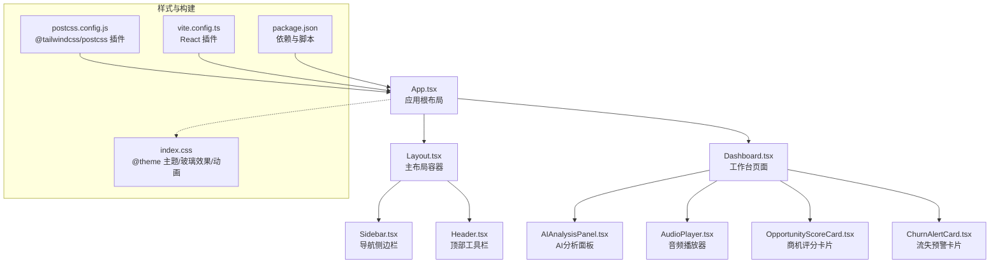
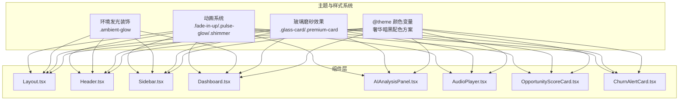
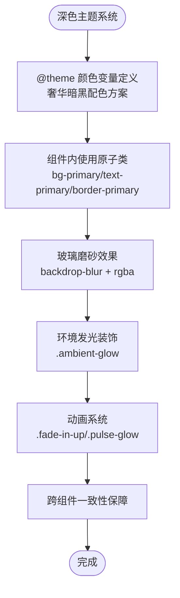
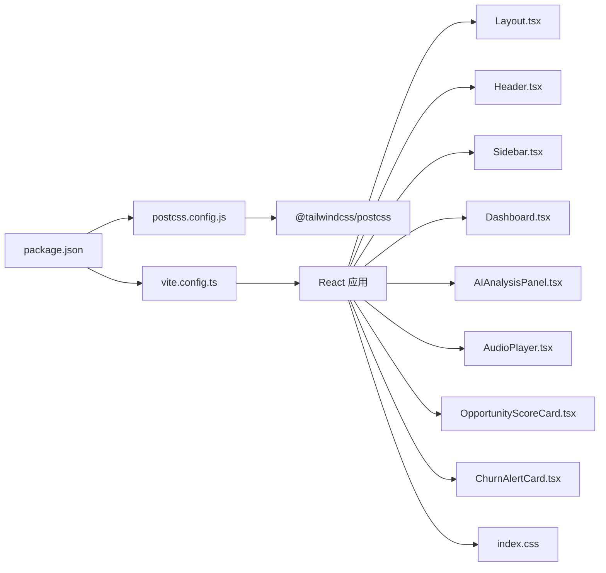

# UI/UX设计

<cite>
**本文引用的文件**
- [index.css](file://crm-frontend/src/index.css)
- [package.json](file://crm-frontend/package.json)
- [postcss.config.js](file://crm-frontend/postcss.config.js)
- [vite.config.ts](file://crm-frontend/vite.config.ts)
- [App.tsx](file://crm-frontend/src/App.tsx)
- [Layout.tsx](file://crm-frontend/src/components/layout/Layout.tsx)
- [Header.tsx](file://crm-frontend/src/components/layout/Header.tsx)
- [Sidebar.tsx](file://crm-frontend/src/components/layout/Sidebar.tsx)
- [AIAnalysisPanel.tsx](file://crm-frontend/src/pages/AIAudio/components/AIAnalysisPanel.tsx)
- [AudioPlayer.tsx](file://crm-frontend/src/pages/AIAudio/components/AudioPlayer.tsx)
- [OpportunityScoreCard.tsx](file://crm-frontend/src/components/AI/OpportunityScoreCard.tsx)
- [ChurnAlertCard.tsx](file://crm-frontend/src/components/AI/ChurnAlertCard.tsx)
- [Dashboard.tsx](file://crm-frontend/src/pages/Dashboard/index.tsx)
- [index.ts](file://crm-frontend/src/types/index.ts)
</cite>

## 更新摘要
**所做更改**
- 新增深色主题系统和奢华暗黑配色方案
- 添加玻璃磨砂效果和毛玻璃材质组件
- 引入环境发光效果和渐变背景装饰
- 更新动画系统和交互反馈机制
- 完善AI组件的视觉设计和状态管理
- 优化移动端适配和响应式布局

## 目录
1. [引言](#引言)
2. [项目结构](#项目结构)
3. [核心组件](#核心组件)
4. [架构总览](#架构总览)
5. [详细组件分析](#详细组件分析)
6. [依赖分析](#依赖分析)
7. [性能考量](#性能考量)
8. [故障排查指南](#故障排查指南)
9. [结论](#结论)
10. [附录](#附录)

## 引言
本设计文档面向销售AI CRM系统的前端UI/UX设计，围绕基于Tailwind CSS v4的原子化设计原则与现代化主题系统展开。系统采用深色奢华暗黑主题，结合玻璃磨砂效果、环境发光装饰、渐变色彩和丰富的动画系统，打造高端商务CRM的视觉体验。文档详细阐述颜色体系、字体规范、间距标准、响应式策略、交互模式与视觉层次，并提供可落地的设计系统规范与移动端、无障碍设计建议。

## 项目结构
前端采用Vite + React + Tailwind CSS v4（@theme原语）构建，PostCSS集成Tailwind v4插件，全局样式通过index.css集中定义。系统采用深色主题作为默认模式，通过@theme定义奢华暗黑配色方案，包括金橙色主色调和青蓝色辅助色。组件按功能模块拆分在src/components目录下，页面组件位于src/pages目录，布局组件位于src/components/layout目录。

**图表来源**
- [App.tsx:51-96](file://crm-frontend/src/App.tsx#L51-L96)
- [Layout.tsx:9-24](file://crm-frontend/src/components/layout/Layout.tsx#L9-L24)
- [Header.tsx:45-178](file://crm-frontend/src/components/layout/Header.tsx#L45-L178)
- [Sidebar.tsx:25-161](file://crm-frontend/src/components/layout/Sidebar.tsx#L25-L161)
- [Dashboard.tsx:618-699](file://crm-frontend/src/pages/Dashboard/index.tsx#L618-L699)
- [AIAnalysisPanel.tsx:46-224](file://crm-frontend/src/pages/AIAudio/components/AIAnalysisPanel.tsx#L46-L224)
- [AudioPlayer.tsx:9-165](file://crm-frontend/src/pages/AIAudio/components/AudioPlayer.tsx#L9-L165)
- [OpportunityScoreCard.tsx:54-336](file://crm-frontend/src/components/AI/OpportunityScoreCard.tsx#L54-L336)
- [ChurnAlertCard.tsx:62-326](file://crm-frontend/src/components/AI/ChurnAlertCard.tsx#L62-L326)
- [index.css:10-47](file://crm-frontend/src/index.css#L10-L47)
- [postcss.config.js:1-7](file://crm-frontend/postcss.config.js#L1-L7)
- [vite.config.ts:1-13](file://crm-frontend/vite.config.ts#L1-L13)
- [package.json:1-39](file://crm-frontend/package.json#L1-L39)

**章节来源**
- [App.tsx:51-96](file://crm-frontend/src/App.tsx#L51-L96)
- [Layout.tsx:9-24](file://crm-frontend/src/components/layout/Layout.tsx#L9-L24)
- [index.css:10-47](file://crm-frontend/src/index.css#L10-L47)
- [postcss.config.js:1-7](file://crm-frontend/postcss.config.js#L1-L7)
- [vite.config.ts:1-13](file://crm-frontend/vite.config.ts#L1-L13)
- [package.json:1-39](file://crm-frontend/package.json#L1-L39)

## 核心组件
- **深色主题系统**：通过@theme定义奢华暗黑配色方案，包括金橙色主色调(#f59e0b)和青蓝色辅助色(#06b6d4)，背景使用深蓝紫色渐变(#0a0f1a到#0f172a)。
- **玻璃磨砂效果**：大量使用backdrop-blur-xl和rgba背景实现毛玻璃材质，如Header组件的半透明背景和Sidebar的渐变背景。
- **环境发光装饰**：通过.ambient-glow类实现圆形发光效果，使用backdrop-filter和blur实现柔和的光晕。
- **动画系统**：包含淡入动画(fade-in-up)、浮动动画(float-animation)、脉冲发光(pulse-glow)、闪烁(shimmer)等多种动画效果。
- **AI组件**：包括AI分析面板、音频播放器、商机评分卡片、流失预警卡片等，均采用统一的玻璃磨砂设计语言。
- **布局容器**：Layout.tsx负责整体布局，采用flex分栏，左侧固定宽度侧边栏，右侧主内容区自适应滚动。

**章节来源**
- [index.css:10-47](file://crm-frontend/src/index.css#L10-L47)
- [index.css:63-104](file://crm-frontend/src/index.css#L63-L104)
- [index.css:135-185](file://crm-frontend/src/index.css#L135-L185)
- [Header.tsx:45-47](file://crm-frontend/src/components/layout/Header.tsx#L45-L47)
- [Sidebar.tsx:27-35](file://crm-frontend/src/components/layout/Sidebar.tsx#L27-L35)
- [Dashboard.tsx:69-107](file://crm-frontend/src/pages/Dashboard/index.tsx#L69-L107)
- [AIAnalysisPanel.tsx:46-224](file://crm-frontend/src/pages/AIAudio/components/AIAnalysisPanel.tsx#L46-L224)
- [AudioPlayer.tsx:9-165](file://crm-frontend/src/pages/AIAudio/components/AudioPlayer.tsx#L9-L165)
- [OpportunityScoreCard.tsx:54-336](file://crm-frontend/src/components/AI/OpportunityScoreCard.tsx#L54-L336)
- [ChurnAlertCard.tsx:62-326](file://crm-frontend/src/components/AI/ChurnAlertCard.tsx#L62-L326)

## 架构总览
系统采用"原子化类名 + @theme主题变量 + 玻璃磨砂效果"的设计体系，所有颜色、字体、间距均通过原子类与主题变量统一约束。深色主题作为默认模式，通过.ambient-glow类实现环境发光效果，通过backdrop-blur实现毛玻璃材质。组件间通过props传递状态与数据，交互以hover/focus/active等伪态与丰富的动画增强反馈。

**图表来源**
- [index.css:10-47](file://crm-frontend/src/index.css#L10-L47)
- [index.css:94-117](file://crm-frontend/src/index.css#L94-L117)
- [index.css:70-92](file://crm-frontend/src/index.css#L70-L92)
- [index.css:135-185](file://crm-frontend/src/index.css#L135-L185)
- [Layout.tsx:9-24](file://crm-frontend/src/components/layout/Layout.tsx#L9-L24)
- [Header.tsx:45-178](file://crm-frontend/src/components/layout/Header.tsx#L45-L178)
- [Sidebar.tsx:25-161](file://crm-frontend/src/components/layout/Sidebar.tsx#L25-L161)
- [Dashboard.tsx:618-699](file://crm-frontend/src/pages/Dashboard/index.tsx#L618-L699)
- [AIAnalysisPanel.tsx:46-224](file://crm-frontend/src/pages/AIAudio/components/AIAnalysisPanel.tsx#L46-L224)
- [AudioPlayer.tsx:9-165](file://crm-frontend/src/pages/AIAudio/components/AudioPlayer.tsx#L9-L165)
- [OpportunityScoreCard.tsx:54-336](file://crm-frontend/src/components/AI/OpportunityScoreCard.tsx#L54-L336)
- [ChurnAlertCard.tsx:62-326](file://crm-frontend/src/components/AI/ChurnAlertCard.tsx#L62-L326)

## 详细组件分析

### 深色主题系统与奢华配色
系统采用深色主题作为默认模式，通过@theme定义奢华暗黑配色方案：

- **主色调**：金橙色(#f59e0b/#fbbf24/#d97706)用于强调、状态与品牌一致性
- **辅助色**：青蓝色(#06b6d4/#22d3ee/#0891b2)用于AI功能和科技感元素
- **背景色**：深蓝紫色渐变(#0a0f1a到#0f172a)，使用linear-gradient实现层次感
- **文本色**：浅灰色(#f9fafb)用于主要文本，中灰色(#9ca3af)用于次要文本
- **边框色**：半透明灰色(#4b5563)用于分割线和边框

**图表来源**
- [index.css:10-47](file://crm-frontend/src/index.css#L10-L47)
- [index.css:63-68](file://crm-frontend/src/index.css#L63-L68)
- [index.css:94-104](file://crm-frontend/src/index.css#L94-L104)
- [index.css:70-92](file://crm-frontend/src/index.css#L70-L92)
- [index.css:135-185](file://crm-frontend/src/index.css#L135-L185)

**章节来源**
- [index.css:10-47](file://crm-frontend/src/index.css#L10-L47)
- [index.css:58-68](file://crm-frontend/src/index.css#L58-L68)

### 玻璃磨砂效果与毛玻璃材质
系统广泛使用backdrop-blur实现毛玻璃材质效果：

- **玻璃卡片**：.glass-card类实现半透明背景和模糊效果
- **Premium卡片**：.premium-card类在hover时增加深度阴影和边框发光
- **Header背景**：使用rgba(10,15,26,0.8)实现半透明背景
- **Sidebar渐变**：使用linear-gradient实现立体渐变背景
- **通知下拉**：.backdrop-blur-xl实现毛玻璃效果

**章节来源**
- [index.css:94-117](file://crm-frontend/src/index.css#L94-L117)
- [Header.tsx:47](file://crm-frontend/src/components/layout/Header.tsx#L47)
- [Sidebar.tsx:27-35](file://crm-frontend/src/components/layout/Sidebar.tsx#L27-L35)
- [Header.tsx:92](file://crm-frontend/src/components/layout/Header.tsx#L92)

### 环境发光装饰系统
通过.ambient-glow类实现柔和的环境发光效果：

- **发光位置**：使用fixed定位在页面四周，z-index: 0确保背景效果
- **发光颜色**：金橙色(#f59e0b)和青蓝色(#06b6d4)两种主色调
- **模糊效果**：使用filter: blur(120px)实现柔和边缘
- **动画效果**：配合opacity和animation实现动态发光

**章节来源**
- [index.css:70-92](file://crm-frontend/src/index.css#L70-L92)

### 动画系统与交互反馈
系统包含丰富的动画效果：

- **淡入动画**：.fade-in-up实现从底部淡入的效果，配合stagger延迟
- **脉冲发光**：.pulse-glow实现呼吸式的发光效果
- **闪烁效果**：.shimmer实现渐变背景的流动效果
- **浮动动画**：.float-animation实现轻微的上下浮动
- **悬停效果**：.premium-card在hover时增加阴影和边框发光

**章节来源**
- [index.css:135-185](file://crm-frontend/src/index.css#L135-L185)
- [Dashboard.tsx:35-42](file://crm-frontend/src/pages/Dashboard/index.tsx#L35-L42)

### AI组件设计系统
AI组件采用统一的设计语言：

- **AI分析面板**：使用深色背景(#111827)和半透明边框，支持分析状态显示
- **音频播放器**：采用圆角设计和渐变按钮，支持播放控制和进度显示
- **商机评分卡片**：使用圆形进度条和多维度评分展示
- **流失预警卡片**：采用风险等级颜色区分，支持状态管理和操作按钮

**章节来源**
- [AIAnalysisPanel.tsx:46-224](file://crm-frontend/src/pages/AIAudio/components/AIAnalysisPanel.tsx#L46-L224)
- [AudioPlayer.tsx:9-165](file://crm-frontend/src/pages/AIAudio/components/AudioPlayer.tsx#L9-L165)
- [OpportunityScoreCard.tsx:54-336](file://crm-frontend/src/components/AI/OpportunityScoreCard.tsx#L54-L336)
- [ChurnAlertCard.tsx:62-326](file://crm-frontend/src/components/AI/ChurnAlertCard.tsx#L62-L326)

### 字体规范与排版
- **字体家族**：使用Outfit作为标题字体，Space Grotesk作为正文字体
- **字重系统**：400/500/600/700字重，确保清晰度与专业感
- **行高优化**：标题使用较大行高，正文使用中等行高，标签使用较小行高
- **字体平滑**：启用Webkit和Firefox字体平滑，确保跨平台一致性

**章节来源**
- [index.css:3-7](file://crm-frontend/src/index.css#L3-L7)
- [index.css:38-39](file://crm-frontend/src/index.css#L38-L39)

### 间距与栅格系统
- **外边距内边距**：使用p-/-m-与px/py组合，配合gap实现等距排列
- **容器系统**：使用max-w-7xl与mx-auto居中，确保最佳阅读宽度
- **网格布局**：采用grid-cols-1/2/4实现响应式布局，左列占2/3，右列占1/3
- **动画延迟**：使用stagger类实现序列动画效果

**章节来源**
- [Dashboard.tsx:642-675](file://crm-frontend/src/pages/Dashboard/index.tsx#L642-L675)

### 响应式设计策略
- **移动端优先**：组件普遍采用flex与gap，配合相对单位实现自适应
- **深色模式**：.dark类作为默认模式，确保深色主题一致性
- **滚动优化**：主内容区设置overflow-y-auto，侧边栏支持纵向滚动
- **触控友好**：按钮与链接具备合适的目标尺寸和间距

**章节来源**
- [Layout.tsx:11](file://crm-frontend/src/components/layout/Layout.tsx#L11)
- [index.css:58-61](file://crm-frontend/src/index.css#L58-L61)

### 组件规范与变体
- **导航项变体**：通过active布尔值控制选中态，支持渐变背景和发光效果
- **统计卡片变体**：支持多种渐变背景，包含hover发光和边框效果
- **AI组件变体**：根据状态显示不同的颜色和图标，支持分析进度显示
- **按钮变体**：包含强调按钮(.btn-primary)和次要按钮(.btn-secondary)

**章节来源**
- [Sidebar.tsx:73-115](file://crm-frontend/src/components/layout/Sidebar.tsx#L73-L115)
- [Dashboard.tsx:34-65](file://crm-frontend/src/pages/Dashboard/index.tsx#L34-L65)
- [AIAnalysisPanel.tsx:72-90](file://crm-frontend/src/pages/AIAudio/components/AIAnalysisPanel.tsx#L72-L90)
- [index.css:224-248](file://crm-frontend/src/index.css#L224-L248)

### 设计系统文档（色彩、图标、组件变体）
- **色彩搭配**
  - 主色：金橙色(#f59e0b/#fbbf24/#d97706)用于强调和重要状态
  - 成功：emerald-500用于正向指标和积极反馈
  - 警告：amber-500用于中性或需关注的状态
  - 危险：red-500用于紧急或负面状态
  - 背景：深蓝紫色渐变(#0a0f1a到#0f172a)用于页面背景
- **图标使用规范**
  - 使用Material Symbols Outlined图标库，尺寸统一为24px
  - 颜色遵循语义化配色方案，与主题保持一致
  - 图标与文字垂直居中对齐，间距使用gap或padding调整
- **组件变体**
  - 卡片：默认使用玻璃磨砂效果，hover时增加深度和发光
  - 按钮：强调按钮使用渐变背景，次要按钮使用半透明边框
  - 徽标：success/warning/danger三类，圆角与紧凑字号

**章节来源**
- [index.css:10-47](file://crm-frontend/src/index.css#L10-L47)
- [Header.tsx:54-68](file://crm-frontend/src/components/layout/Header.tsx#L54-L68)

### Figma组件库设计理念与规范
- **原子化设计**：以最小可复用单元构建组件，降低变体数量，提升一致性
- **语义化命名**：颜色与状态命名遵循业务语义，便于跨团队协作
- **深色主题优先**：以深色主题为核心设计语言，确保在各种环境下的一致性
- **玻璃效果系统**：统一的毛玻璃材质规范，包括模糊强度和透明度
- **动画规范**：定义动画时序、缓动函数和触发条件，确保流畅的用户体验

## 依赖分析
- **样式管线**：Tailwind v4通过@tailwindcss/postcss在PostCSS阶段生成原子类；index.css集中定义@theme主题和玻璃效果
- **构建工具**：Vite加载React插件，支持热重载和快速开发；package.json声明依赖与脚本
- **图标系统**：Material Symbols Outlined提供统一图标资源，支持变体设置
- **动画系统**：CSS动画与JavaScript动画相结合，实现丰富的交互效果

**图表来源**
- [package.json:12-39](file://crm-frontend/package.json#L12-L39)
- [postcss.config.js:1-7](file://crm-frontend/postcss.config.js#L1-L7)
- [vite.config.ts:1-13](file://crm-frontend/vite.config.ts#L1-L13)
- [Layout.tsx:1-24](file://crm-frontend/src/components/layout/Layout.tsx#L1-L24)
- [Header.tsx:1-178](file://crm-frontend/src/components/layout/Header.tsx#L1-L178)
- [Sidebar.tsx:1-161](file://crm-frontend/src/components/layout/Sidebar.tsx#L1-L161)
- [Dashboard.tsx:1-699](file://crm-frontend/src/pages/Dashboard/index.tsx#L1-L699)
- [AIAnalysisPanel.tsx:1-224](file://crm-frontend/src/pages/AIAudio/components/AIAnalysisPanel.tsx#L1-L224)
- [AudioPlayer.tsx:1-165](file://crm-frontend/src/pages/AIAudio/components/AudioPlayer.tsx#L1-L165)
- [OpportunityScoreCard.tsx:1-336](file://crm-frontend/src/components/AI/OpportunityScoreCard.tsx#L1-L336)
- [ChurnAlertCard.tsx:1-326](file://crm-frontend/src/components/AI/ChurnAlertCard.tsx#L1-L326)
- [index.css:1-317](file://crm-frontend/src/index.css#L1-L317)

**章节来源**
- [package.json:12-39](file://crm-frontend/package.json#L12-L39)
- [postcss.config.js:1-7](file://crm-frontend/postcss.config.js#L1-L7)
- [vite.config.ts:1-13](file://crm-frontend/vite.config.ts#L1-L13)

## 性能考量
- **原子类体积**：Tailwind v4按需生成类名，建议在生产构建中开启摇树优化与压缩
- **玻璃效果优化**：backdrop-filter在某些设备上可能影响性能，建议在移动设备上适当简化
- **动画性能**：使用transform和opacity属性实现硬件加速，避免频繁重排
- **字体加载**：Material Symbols Outlined通过CDN加载，确保快速访问
- **图片优化**：SVG图标和渐变背景无需额外图片资源，减少HTTP请求

## 故障排查指南
- **样式未生效**
  - 检查PostCSS配置是否正确加载@tailwindcss/postcss插件
  - 确认index.css中的@theme与@import顺序正确
  - 验证Tailwind CSS版本兼容性
- **玻璃效果异常**
  - 检查浏览器对backdrop-filter的支持情况
  - 确认RGBA颜色值的透明度设置
  - 验证z-index层级关系
- **动画不流畅**
  - 检查CSS动画属性是否使用硬件加速属性
  - 确认动画时长和缓动函数设置合理
  - 验证是否有过多DOM操作影响性能
- **深色主题问题**
  - 确认.ambient-glow类的z-index设置
  - 检查深色模式下的颜色对比度
  - 验证响应式断点设置

**章节来源**
- [postcss.config.js:1-7](file://crm-frontend/postcss.config.js#L1-L7)
- [index.css:1-317](file://crm-frontend/src/index.css#L1-L317)
- [package.json:12-39](file://crm-frontend/package.json#L12-L39)

## 结论
本设计系统以Tailwind CSS v4的@theme为主题核心，结合深色奢华暗黑主题、玻璃磨砂效果和丰富的动画系统，实现了统一且具有现代感的UI/UX设计体系。通过明确的组件变体与设计规范，能够高效支撑销售AI CRM的复杂信息场景与多终端体验需求。系统在视觉层次、交互反馈和性能优化方面都达到了较高水准，为用户提供了专业且舒适的商务CRM使用体验。

## 附录
- **快速参考**
  - 深色主题：.dark类作为默认模式，确保深色主题一致性
  - 玻璃效果：.glass-card实现毛玻璃材质，.backdrop-blur-xl提供模糊效果
  - 动画系统：.fade-in-up实现淡入动画，.pulse-glow实现脉冲效果
  - 颜色体系：@theme定义奢华暗黑配色方案，包括金橙色和青蓝色主色调
  - 响应式：采用flex与grid布局，配合max-w与overflow控制响应式表现
  - 图标系统：Material Symbols Outlined提供统一图标资源，支持变体设置