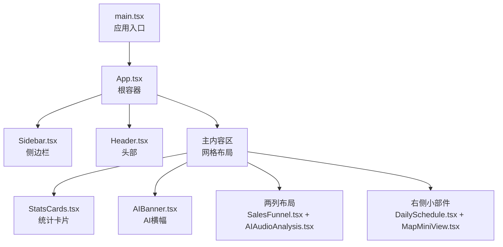
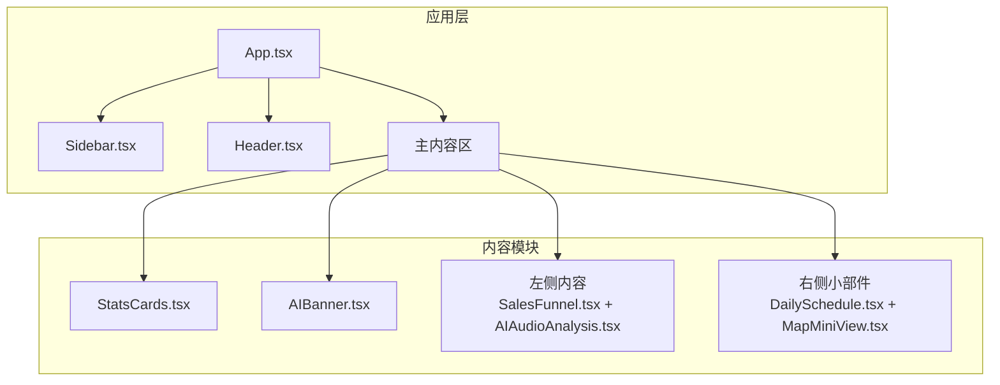
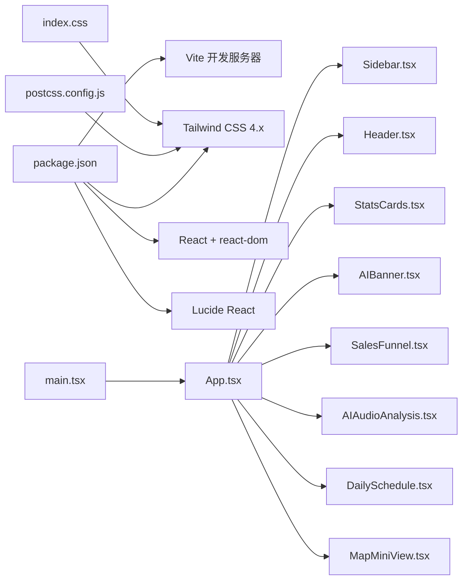

# 响应式设计

<cite>
**本文引用的文件**
- [index.css](file://crm-frontend/src/index.css)
- [main.tsx](file://crm-frontend/src/main.tsx)
- [package.json](file://crm-frontend/package.json)
- [postcss.config.js](file://crm-frontend/postcss.config.js)
- [App.tsx](file://crm-frontend/src/App.tsx)
- [Header.tsx](file://crm-frontend/src/components/Header.tsx)
- [Sidebar.tsx](file://crm-frontend/src/components/Sidebar.tsx)
- [StatsCards.tsx](file://crm-frontend/src/components/StatsCards.tsx)
- [SalesFunnel.tsx](file://crm-frontend/src/components/SalesFunnel.tsx)
- [AIBanner.tsx](file://crm-frontend/src/components/AIBanner.tsx)
- [AIAudioAnalysis.tsx](file://crm-frontend/src/components/AIAudioAnalysis.tsx)
- [DailySchedule.tsx](file://crm-frontend/src/components/DailySchedule.tsx)
- [MapMiniView.tsx](file://crm-frontend/src/components/MapMiniView.tsx)
</cite>

## 目录
1. [简介](#简介)
2. [项目结构](#项目结构)
3. [核心组件](#核心组件)
4. [架构总览](#架构总览)
5. [详细组件分析](#详细组件分析)
6. [依赖关系分析](#依赖关系分析)
7. [性能考量](#性能考量)
8. [故障排查指南](#故障排查指南)
9. [结论](#结论)
10. [附录](#附录)

## 简介
本文件面向销售AI CRM系统的前端响应式设计，围绕基于 Tailwind CSS 的断点体系与移动端适配策略展开，系统性说明网格系统、间距系统与字体大小在不同屏幕尺寸下的适配规则；阐述移动端交互设计原则（触摸友好点击区域、手势与滑动导航）；对比桌面端与移动端布局差异（侧边栏折叠、卡片堆叠、信息层级调整）；并给出无障碍设计建议（屏幕阅读器支持与键盘导航）。本文所有技术结论均来自仓库中实际文件与代码结构。

## 项目结构
该前端采用 React + Vite + Tailwind CSS 4.x 构建，PostCSS 配置启用 Tailwind 插件，全局样式通过 index.css 引入并自定义主题变量与工具类。应用入口在 main.tsx 中挂载 App 组件，App.tsx 作为根容器组织侧边栏、头部与主内容区，并使用 Tailwind 的栅格系统进行页面布局。

图表来源
- [main.tsx:1-11](file://crm-frontend/src/main.tsx#L1-L11)
- [App.tsx:10-55](file://crm-frontend/src/App.tsx#L10-L55)
- [Sidebar.tsx:37-82](file://crm-frontend/src/components/Sidebar.tsx#L37-L82)
- [Header.tsx:3-53](file://crm-frontend/src/components/Header.tsx#L3-L53)
- [StatsCards.tsx:35-78](file://crm-frontend/src/components/StatsCards.tsx#L35-L78)
- [AIBanner.tsx:3-47](file://crm-frontend/src/components/AIBanner.tsx#L3-L47)
- [SalesFunnel.tsx:29-66](file://crm-frontend/src/components/SalesFunnel.tsx#L29-L66)
- [AIAudioAnalysis.tsx:38-82](file://crm-frontend/src/components/AIAudioAnalysis.tsx#L38-L82)
- [DailySchedule.tsx:26-70](file://crm-frontend/src/components/DailySchedule.tsx#L26-L70)
- [MapMiniView.tsx:3-58](file://crm-frontend/src/components/MapMiniView.tsx#L3-L58)

章节来源
- [main.tsx:1-11](file://crm-frontend/src/main.tsx#L1-L11)
- [App.tsx:10-55](file://crm-frontend/src/App.tsx#L10-L55)
- [index.css:1-66](file://crm-frontend/src/index.css#L1-L66)
- [package.json:12-36](file://crm-frontend/package.json#L12-L36)
- [postcss.config.js:1-6](file://crm-frontend/postcss.config.js#L1-L6)

## 核心组件
- 根容器与布局：App.tsx 使用 Flex 布局承载侧边栏与主内容区，主内容区以网格系统组织统计卡片、AI横幅与两列内容区，外层设置最大宽度与水平居中。
- 侧边栏：Sidebar.tsx 固定宽度并提供导航项与“新建线索”按钮，整体采用 Flex 列布局，支持滚动。
- 头部：Header.tsx 包含搜索框、升级按钮、通知与用户信息，整体采用 Flex 行布局，右侧元素等宽自适应。
- 统计卡片：StatsCards.tsx 采用四列网格，展示关键指标与趋势徽标。
- 销售漏斗：SalesFunnel.tsx 展示各阶段转化数据，采用条形进度图与颜色标识。
- AI音频分析：AIAudioAnalysis.tsx 展示多条分析记录，包含情感标签与时间戳。
- 日程与地图：DailySchedule.tsx 与 MapMiniView.tsx 分别展示当日日程与客户分布。

章节来源
- [App.tsx:10-55](file://crm-frontend/src/App.tsx#L10-L55)
- [Sidebar.tsx:37-82](file://crm-frontend/src/components/Sidebar.tsx#L37-L82)
- [Header.tsx:3-53](file://crm-frontend/src/components/Header.tsx#L3-L53)
- [StatsCards.tsx:35-78](file://crm-frontend/src/components/StatsCards.tsx#L35-L78)
- [SalesFunnel.tsx:29-66](file://crm-frontend/src/components/SalesFunnel.tsx#L29-L66)
- [AIAudioAnalysis.tsx:38-82](file://crm-frontend/src/components/AIAudioAnalysis.tsx#L38-L82)
- [DailySchedule.tsx:26-70](file://crm-frontend/src/components/DailySchedule.tsx#L26-L70)
- [MapMiniView.tsx:3-58](file://crm-frontend/src/components/MapMiniView.tsx#L3-L58)

## 架构总览
下图展示了应用的整体结构与组件间的关系，以及 Tailwind CSS 在布局中的作用。

图表来源
- [App.tsx:10-55](file://crm-frontend/src/App.tsx#L10-L55)
- [Sidebar.tsx:37-82](file://crm-frontend/src/components/Sidebar.tsx#L37-L82)
- [Header.tsx:3-53](file://crm-frontend/src/components/Header.tsx#L3-L53)
- [StatsCards.tsx:35-78](file://crm-frontend/src/components/StatsCards.tsx#L35-L78)
- [AIBanner.tsx:3-47](file://crm-frontend/src/components/AIBanner.tsx#L3-L47)
- [SalesFunnel.tsx:29-66](file://crm-frontend/src/components/SalesFunnel.tsx#L29-L66)
- [AIAudioAnalysis.tsx:38-82](file://crm-frontend/src/components/AIAudioAnalysis.tsx#L38-L82)
- [DailySchedule.tsx:26-70](file://crm-frontend/src/components/DailySchedule.tsx#L26-L70)
- [MapMiniView.tsx:3-58](file://crm-frontend/src/components/MapMiniView.tsx#L3-L58)

## 详细组件分析

### 响应式断点与移动端适配策略
- 断点体系：Tailwind CSS 4.x 默认断点为 sm:640px、md:768px、lg:1024px、xl:1280px、2xl:1536px。当前代码未显式覆盖 Tailwind 断点配置文件，因此默认断点生效。
- 移动端优先：组件普遍采用流式布局与相对单位，配合 Tailwind 的响应式修饰符实现按需切换。例如网格列数、内边距、字体大小与元素间距在不同断点下可按需调整。
- 触摸友好：按钮与交互元素普遍具备足够的点击热区（如较大的内边距与最小点击尺寸），减少误触概率。
- 滚动与溢出：侧边栏与主内容区均设置滚动容器，避免内容溢出影响布局稳定性。

章节来源
- [package.json:30](file://crm-frontend/package.json#L30)
- [postcss.config.js:1-6](file://crm-frontend/postcss.config.js#L1-L6)
- [index.css:1-66](file://crm-frontend/src/index.css#L1-L66)

### 网格系统与间距系统
- 网格系统：主内容区采用三列网格布局，左侧主内容区占两列，右侧小部件占一列；统计卡片采用四列网格。在更窄屏幕下，可通过响应式修饰符将列数减少或改为堆叠布局。
- 间距系统：全局与组件内广泛使用 Tailwind 的空间相关类（如 gap、p、m、space-y 等），确保在不同屏幕尺寸下保持一致的视觉节奏。
- 最大宽度与居中：主内容区设置最大宽度并水平居中，保证在超宽屏时不会过度拉伸。

章节来源
- [App.tsx:22-51](file://crm-frontend/src/App.tsx#L22-L51)
- [StatsCards.tsx:72-76](file://crm-frontend/src/components/StatsCards.tsx#L72-L76)

### 字体大小与排版
- 字体族：全局使用 Inter 字体，提升可读性与一致性。
- 字号层次：标题采用较大的字号，副标题与说明文字使用较小字号，形成清晰的信息层级。
- 响应式排版：可在不同断点下调整字号与行高，确保移动端阅读体验。

章节来源
- [index.css:17-34](file://crm-frontend/src/index.css#L17-L34)

### 移动端交互设计原则
- 点击区域：导航项、按钮与交互元素具备充足的触摸目标尺寸，降低误触风险。
- 手势与滑动：当前代码未包含复杂手势逻辑；建议在需要时引入轻量级手势库，并为滑动导航提供明确反馈。
- 导航折叠：在窄屏下可考虑将侧边栏折叠为抽屉式导航，通过按钮触发显示/隐藏，同时保留关键功能入口。

章节来源
- [Sidebar.tsx:22-35](file://crm-frontend/src/components/Sidebar.tsx#L22-L35)
- [Header.tsx:21-23](file://crm-frontend/src/components/Header.tsx#L21-L23)

### 桌面端与移动端布局差异
- 桌面端：侧边栏常驻显示，主内容区采用多列网格，信息密度较高；统计卡片与两列布局并行展示。
- 移动端：建议将侧边栏折叠为顶部或底部导航菜单；统计卡片与内容区改为单列堆叠；两列布局合并为单列，右侧小部件移至下方。

章节来源
- [App.tsx:31-49](file://crm-frontend/src/App.tsx#L31-L49)
- [StatsCards.tsx:72-76](file://crm-frontend/src/components/StatsCards.tsx#L72-L76)

### 无障碍设计考虑
- 屏幕阅读器支持：为按钮与交互元素提供语义化标签与描述；图标类元素补充文本替代。
- 键盘导航：确保所有可交互元素支持 Tab 键顺序访问，提供可见焦点指示；避免仅依赖鼠标悬停触发的功能。
- 对比度与可读性：保持文本与背景的足够对比度；在浅色背景下使用深色文字，反之亦然。

章节来源
- [Header.tsx:35-46](file://crm-frontend/src/components/Header.tsx#L35-L46)
- [Sidebar.tsx:24-34](file://crm-frontend/src/components/Sidebar.tsx#L24-L34)

## 依赖关系分析
- 构建链路：Vite 负责开发与打包，PostCSS 通过 Tailwind 插件处理样式，Tailwind CSS 4.x 提供原子化样式与响应式工具类。
- 运行时依赖：React 与 react-dom 提供组件渲染，Lucide React 提供图标资源。
- 全局样式：index.css 引入 Tailwind 并定义主题变量与自定义工具类，确保全局一致的视觉风格。

图表来源
- [package.json:12-36](file://crm-frontend/package.json#L12-L36)
- [postcss.config.js:1-6](file://crm-frontend/postcss.config.js#L1-L6)
- [index.css:1-66](file://crm-frontend/src/index.css#L1-L66)
- [main.tsx:1-11](file://crm-frontend/src/main.tsx#L1-L11)
- [App.tsx:10-55](file://crm-frontend/src/App.tsx#L10-L55)

章节来源
- [package.json:12-36](file://crm-frontend/package.json#L12-L36)
- [postcss.config.js:1-6](file://crm-frontend/postcss.config.js#L1-L6)
- [index.css:1-66](file://crm-frontend/src/index.css#L1-L66)
- [main.tsx:1-11](file://crm-frontend/src/main.tsx#L1-L11)
- [App.tsx:10-55](file://crm-frontend/src/App.tsx#L10-L55)

## 性能考量
- 样式体积控制：利用 Tailwind 原子类减少重复样式定义，避免无用类导致的体积膨胀。
- 组件拆分：将功能模块拆分为独立组件，便于按需加载与缓存。
- 渲染优化：在列表组件中使用稳定键值，减少不必要的重渲染。
- 图标与媒体：使用矢量图标与轻量级 SVG，避免大图片资源对首屏性能的影响。

## 故障排查指南
- Tailwind 类不生效：检查 PostCSS 配置是否正确加载 Tailwind 插件，确认构建脚本执行成功。
- 样式冲突：检查 index.css 中自定义类与 Tailwind 类的优先级，必要时使用 !important 或提升选择器权重。
- 响应式异常：确认未覆盖默认断点，或在需要时新增自定义断点配置。
- 交互问题：检查事件绑定与状态更新逻辑，确保在移动端与桌面端行为一致。

章节来源
- [postcss.config.js:1-6](file://crm-frontend/postcss.config.js#L1-L6)
- [index.css:1-66](file://crm-frontend/src/index.css#L1-L66)

## 结论
本项目已具备良好的响应式基础：以 Tailwind CSS 4.x 为核心，结合 Flex 与 Grid 布局实现灵活的多端适配；全局样式统一、组件职责清晰。建议在现有基础上进一步完善移动端导航折叠、响应式网格与字体的断点策略，并强化无障碍与交互细节，以提升跨设备的一致性与可用性。

## 附录
- 断点速查表（默认）
  - sm: 640px
  - md: 768px
  - lg: 1024px
  - xl: 1280px
  - 2xl: 1536px
- 常用响应式修饰符（示例）
  - sm: 在小屏及以上生效
  - md: 在中屏及以上生效
  - lg: 在大屏及以上生效
  - xl: 在超大屏及以上生效
  - 2xl: 在2K屏及以上生效