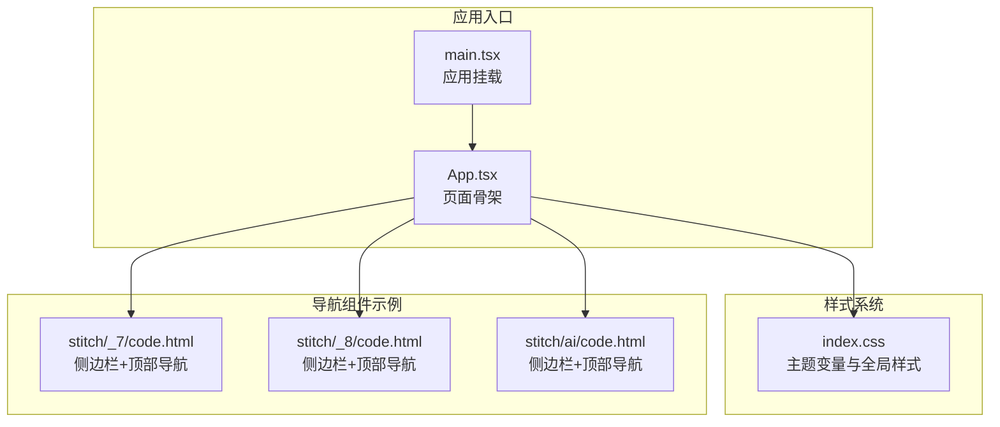
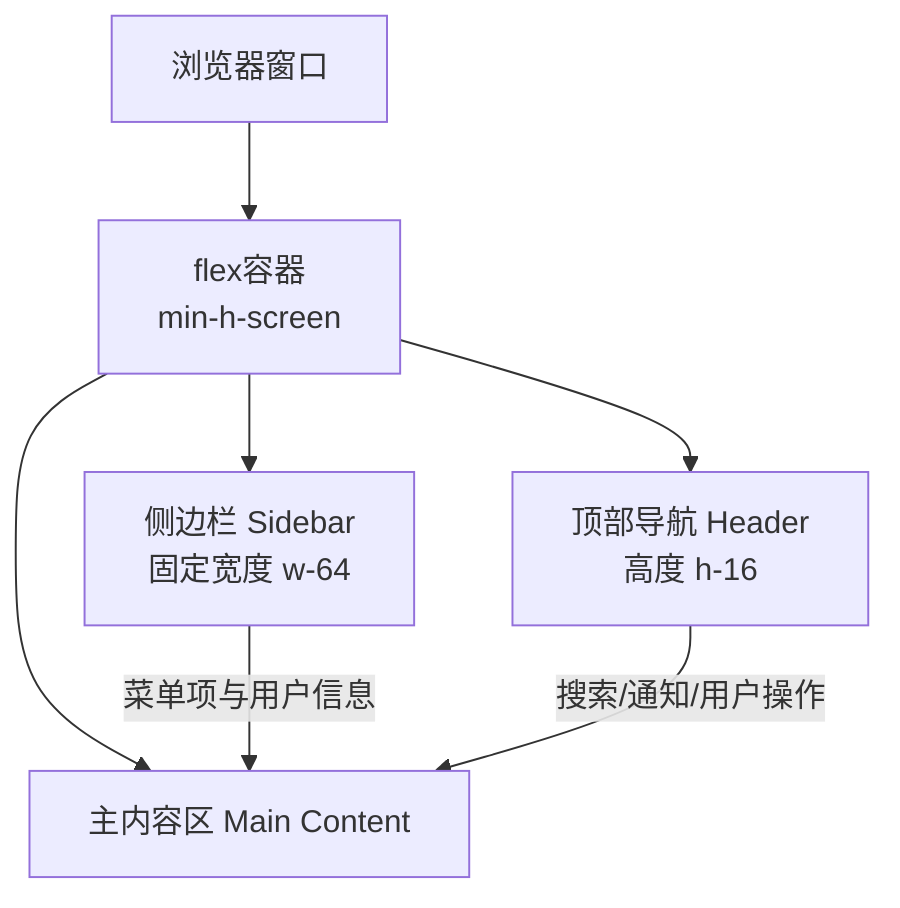
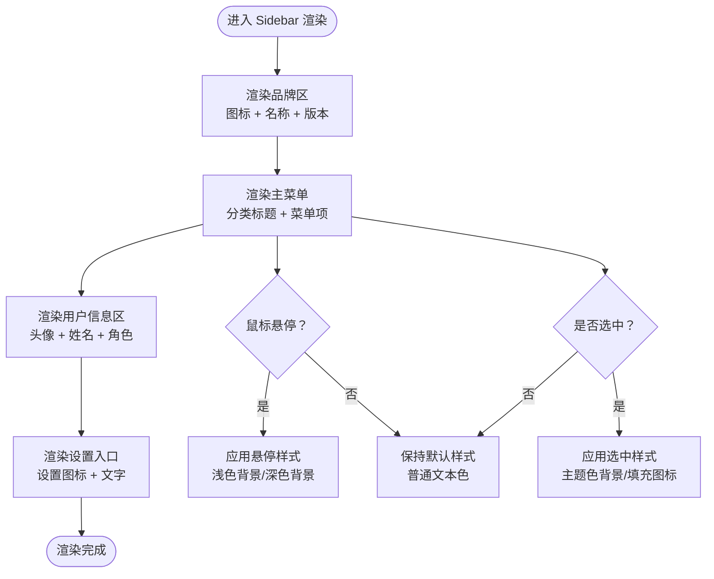
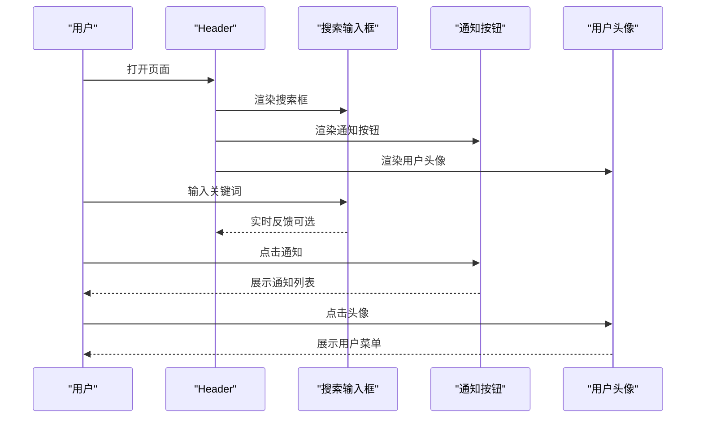
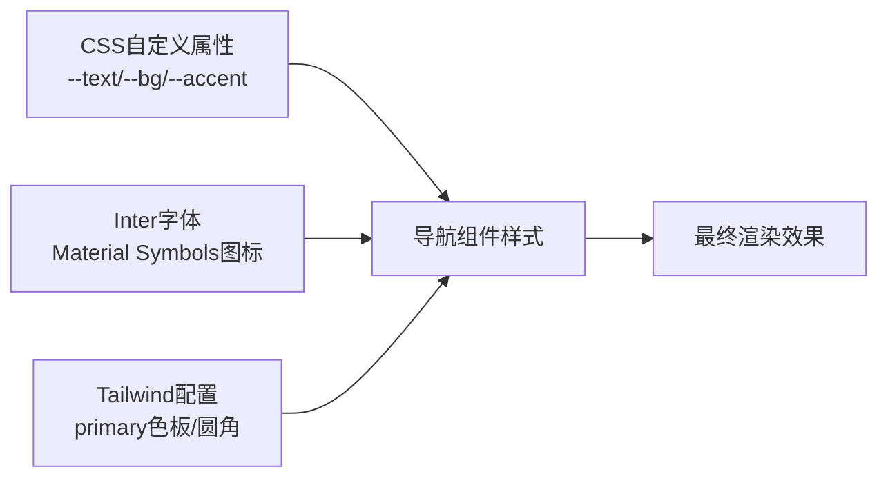

# 导航组件规范

<cite>
**本文档引用的文件**
- [index.css](file://crm-frontend/src/index.css)
- [App.tsx](file://crm-frontend/src/App.tsx)
- [main.tsx](file://crm-frontend/src/main.tsx)
- [_7/code.html](file://stitch/_7/code.html)
- [_8/code.html](file://stitch/_8/code.html)
- [ai/code.html](file://stitch/ai/code.html)
</cite>

## 目录
1. [简介](#简介)
2. [项目结构](#项目结构)
3. [核心组件](#核心组件)
4. [架构概览](#架构概览)
5. [详细组件分析](#详细组件分析)
6. [依赖关系分析](#依赖关系分析)
7. [性能考虑](#性能考虑)
8. [故障排除指南](#故障排除指南)
9. [结论](#结论)
10. [附录](#附录)

## 简介
本规范文档面向销售AI CRM系统的导航组件设计与实现，聚焦以下目标：
- Sidebar（侧边栏）导航组件：功能布局、菜单项设计、图标规范与交互状态
- Header（顶部导航）组件：布局结构、品牌标识、用户操作区域与响应式设计
- 组件的尺寸规格、颜色系统、字体规范与状态变化（悬停、选中、禁用）
- 组件使用示例与最佳实践，说明如何在不同页面中正确集成和配置导航组件

本规范以仓库中现有的样式变量、HTML结构与Tailwind类为基础，结合Material Symbols图标系统，形成统一的设计语言与实现标准。

## 项目结构
当前仓库包含基础的前端应用结构与多套导航组件的HTML示例。导航组件相关的关键信息主要来源于以下文件：
- 样式与主题变量：index.css
- 页面骨架与导航结构示例：stitch目录下的多个HTML文件
- 应用入口与渲染：main.tsx、App.tsx

**图表来源**
- [main.tsx:1-11](file://crm-frontend/src/main.tsx#L1-L11)
- [App.tsx:1-122](file://crm-frontend/src/App.tsx#L1-L122)
- [index.css:1-112](file://crm-frontend/src/index.css#L1-L112)
- [_7/code.html:1-289](file://stitch/_7/code.html#L1-L289)
- [_8/code.html:1-309](file://stitch/_8/code.html#L1-L309)
- [ai/code.html:1-294](file://stitch/ai/code.html#L1-L294)

**章节来源**
- [main.tsx:1-11](file://crm-frontend/src/main.tsx#L1-L11)
- [App.tsx:1-122](file://crm-frontend/src/App.tsx#L1-L122)
- [index.css:1-112](file://crm-frontend/src/index.css#L1-L112)

## 核心组件
本节概述导航组件的核心职责与通用规范：
- Sidebar（侧边栏）：承载品牌标识、主菜单、用户信息与设置入口；支持深浅色主题适配
- Header（顶部导航）：包含搜索输入、区域标签、通知与帮助按钮、用户头像等操作区域
- 图标系统：统一使用Material Symbols Outlined，确保视觉一致性与可访问性
- 响应式设计：在不同屏幕宽度下调整布局密度与可见元素

**章节来源**
- [_7/code.html:32-55](file://stitch/_7/code.html#L32-L55)
- [_8/code.html:38-63](file://stitch/_8/code.html#L38-L63)
- [ai/code.html:32-105](file://stitch/ai/code.html#L32-L105)

## 架构概览
导航组件在页面中的位置与交互流程如下：

**图表来源**
- [_7/code.html:31-57](file://stitch/_7/code.html#L31-L57)
- [_8/code.html:37-64](file://stitch/_8/code.html#L37-L64)
- [ai/code.html:31-108](file://stitch/ai/code.html#L31-L108)

## 详细组件分析

### Sidebar（侧边栏）导航组件
Sidebar负责承载品牌标识、主菜单、用户信息与设置入口。其设计要点如下：

- 尺寸规格
  - 固定宽度：w-64（约256px），在小屏设备上通过断点隐藏，大屏设备显示
  - 品牌区高度：包含品牌图标与版本标签，建议使用紧凑布局
  - 菜单项高度：px-3 py-2，图标与文字水平对齐，间距gap-3
  - 用户信息区：底部留白，使用圆角背景与分隔线

- 颜色系统
  - 背景色：浅色模式使用白色，深色模式使用深色背景
  - 主题色：primary（#1152d4）用于选中态与强调元素
  - 悬停态：浅色背景（如slate-100）与深色背景（如dark:salte-800）

- 字体规范
  - 文字大小：text-sm（14px），行高适中
  - 字重：medium（500），选中项使用semibold（600）
  - 大标题：品牌名称使用font-bold（700）

- 图标规范
  - 使用Material Symbols Outlined，尺寸统一为text-[20px]
  - 填充属性：部分图标使用fill-1（如地图），以突出选中态
  - 图标与文字垂直居中对齐

- 交互状态
  - 默认态：text-slate-600（浅色）/text-slate-400（深色）
  - 悬停态：hover:bg-slate-100（浅色）/hover:bg-slate-800（深色）
  - 选中态：bg-primary/10，text-primary，使用填充图标强调
  - 禁用态：可通过降低透明度或禁用点击事件实现

- 结构层次
  - 品牌区：品牌图标 + 品牌名称 + 版本标签
  - 主菜单：分类标题 + 菜单项列表
  - 用户信息区：头像 + 姓名 + 角色
  - 设置入口：设置图标 + 文字

**图表来源**
- [_7/code.html:34-54](file://stitch/_7/code.html#L34-L54)
- [_8/code.html:67-121](file://stitch/_8/code.html#L67-L121)
- [ai/code.html:43-105](file://stitch/ai/code.html#L43-L105)

**章节来源**
- [_7/code.html:32-55](file://stitch/_7/code.html#L32-L55)
- [_8/code.html:66-121](file://stitch/_8/code.html#L66-L121)
- [ai/code.html:32-105](file://stitch/ai/code.html#L32-L105)

### Header（顶部导航）组件
Header位于页面顶部，包含品牌标识、搜索区域、区域标签与用户操作按钮。其设计要点如下：

- 尺寸规格
  - 高度：h-16（约64px），保证足够的点击区域
  - 搜索框：最大宽度max-w-2xl，左侧内边距pl-10，右侧内边距pr-4
  - 操作按钮：size-10（40px），圆角半径rounded-lg

- 布局结构
  - 左侧：品牌标识（图标 + 标题）
  - 中间：搜索输入框，支持占满可用空间
  - 右侧：区域标签（px-3 py-1）、通知、帮助、用户头像

- 颜色系统
  - 背景色：浅色模式使用白色，深色模式使用深色背景
  - 模糊背景：backdrop-blur-md增强层级感
  - 边框：border-b border-slate-200（浅色）/border-slate-800（深色）

- 字体规范
  - 搜索框：text-sm，焦点时使用主题色ring
  - 区域标签：text-xs，font-medium，选中标签使用主题色

- 交互状态
  - 搜索框：focus-visible时添加ring-2主题色环
  - 操作按钮：hover:bg-slate-100（浅色）/hover:bg-slate-800（深色）
  - 通知按钮：支持红点徽章（absolute定位）

**图表来源**
- [_7/code.html:59-79](file://stitch/_7/code.html#L59-L79)
- [_8/code.html:39-63](file://stitch/_8/code.html#L39-L63)
- [ai/code.html:109-135](file://stitch/ai/code.html#L109-L135)

**章节来源**
- [_7/code.html:58-79](file://stitch/_7/code.html#L58-L79)
- [_8/code.html:38-63](file://stitch/_8/code.html#L38-L63)
- [ai/code.html:108-135](file://stitch/ai/code.html#L108-L135)

### 响应式设计
导航组件在不同断点下的行为：
- 小屏设备（< 1024px）
  - Sidebar隐藏，通过汉堡菜单或抽屉形式展示
  - Header内元素压缩，区域标签简化为简短标识
- 中屏设备（1024px及以上）
  - Sidebar常驻显示，菜单项完整展示
  - Header采用左右分区布局，搜索与操作按钮清晰分离

**章节来源**
- [_7/code.html:28-31](file://stitch/_7/code.html#L28-L31)
- [_8/code.html:29-34](file://stitch/_8/code.html#L29-L34)
- [ai/code.html:30](file://stitch/ai/code.html#L30)

## 依赖关系分析
导航组件与样式系统的关系：
- 主题变量：通过CSS自定义属性定义文本、背景、边框与阴影等颜色
- 字体系统：使用Inter作为显示字体，Material Symbols作为图标字体
- Tailwind扩展：定义primary色板与圆角半径，便于快速构建UI

**图表来源**
- [index.css:1-112](file://crm-frontend/src/index.css#L1-L112)
- [_7/code.html:10-27](file://stitch/_7/code.html#L10-L27)
- [_8/code.html:11-28](file://stitch/_8/code.html#L11-L28)
- [ai/code.html:10-27](file://stitch/ai/code.html#L10-L27)

**章节来源**
- [index.css:1-112](file://crm-frontend/src/index.css#L1-L112)

## 性能考虑
- 图标加载：使用Material Symbols在线字体，减少本地资源体积
- 样式复用：通过Tailwind工具类减少重复CSS，提升渲染效率
- 交互优化：悬停与焦点状态使用过渡动画，避免过度复杂的JavaScript逻辑
- 响应式策略：在小屏设备上减少DOM节点数量，优先展示关键信息

## 故障排除指南
- 图标不显示
  - 检查Material Symbols链接是否正确加载
  - 确认图标类名与fill属性使用一致
- 颜色不生效
  - 核对CSS自定义属性是否在当前主题下定义
  - 检查暗色模式切换时的变量覆盖
- 响应式异常
  - 确认断点设置与容器布局类名匹配
  - 检查媒体查询范围与设备宽度

**章节来源**
- [index.css:33-51](file://crm-frontend/src/index.css#L33-L51)
- [_7/code.html:8-9](file://stitch/_7/code.html#L8-L9)
- [_8/code.html:8-9](file://stitch/_8/code.html#L8-L9)
- [ai/code.html:8-9](file://stitch/ai/code.html#L8-L9)

## 结论
本规范基于现有HTML示例与样式变量，建立了Sidebar与Header导航组件的统一设计语言与实现标准。通过明确的尺寸、颜色、字体与交互规范，确保在不同页面中导航组件的一致性与可用性。建议在后续开发中：
- 将HTML示例转化为可复用的React组件
- 使用TypeScript增强类型安全
- 引入测试用例验证交互与响应式行为

## 附录
- 组件使用示例路径
  - Sidebar示例：[_7/code.html:32-55](file://stitch/_7/code.html#L32-L55)、[_8/code.html:66-121](file://stitch/_8/code.html#L66-L121)、[ai/code.html:32-105](file://stitch/ai/code.html#L32-L105)
  - Header示例：[_7/code.html:58-79](file://stitch/_7/code.html#L58-L79)、[_8/code.html:38-63](file://stitch/_8/code.html#L38-L63)、[ai/code.html:108-135](file://stitch/ai/code.html#L108-L135)
- 最佳实践
  - 保持图标与文字的垂直居中对齐
  - 在深色模式下使用较亮的悬停背景以提升对比度
  - 为交互元素提供明确的视觉反馈与键盘可达性