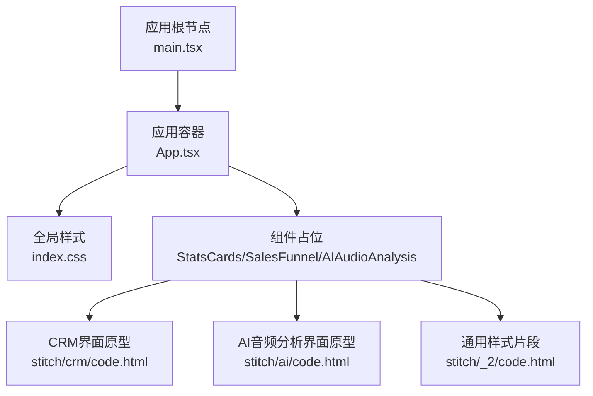
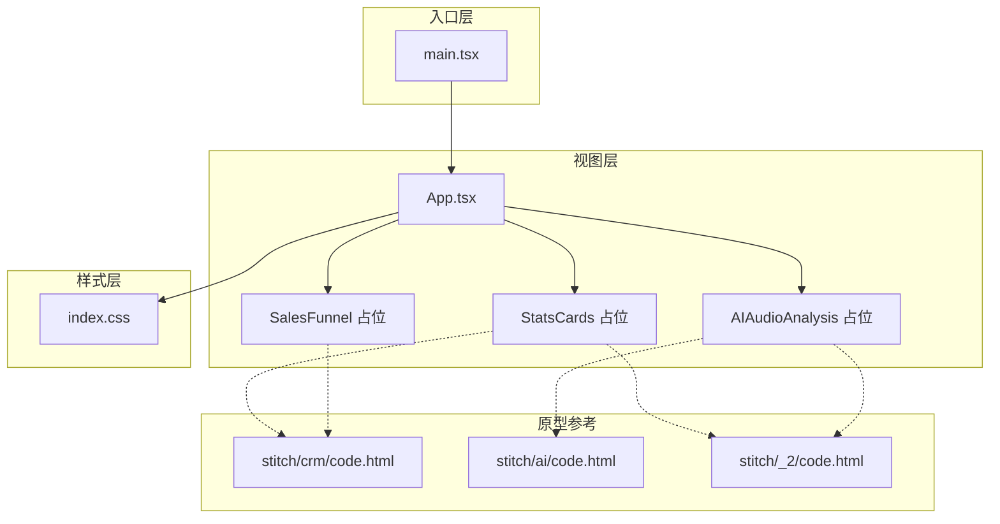
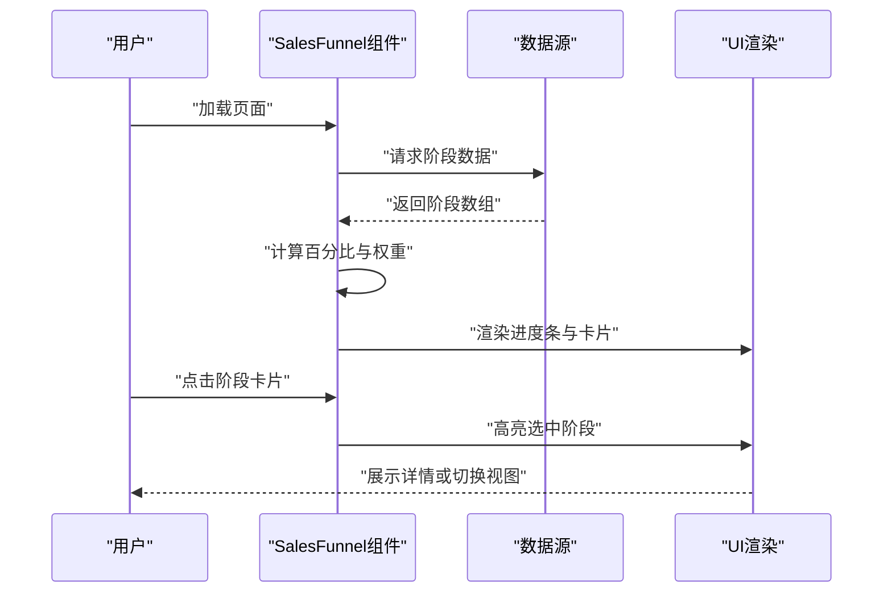
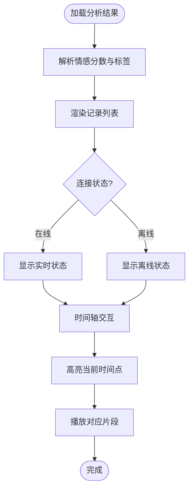
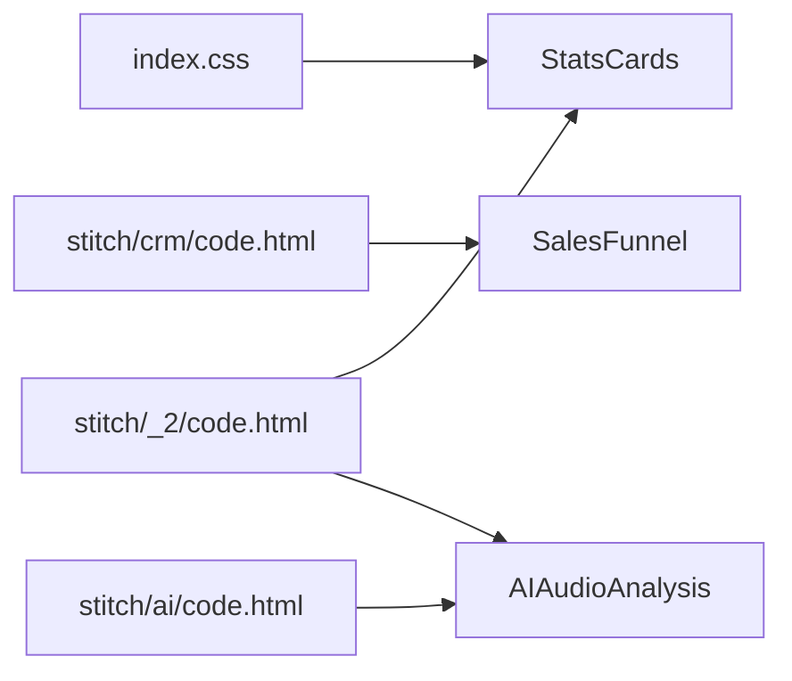

# 数据展示组件规范

<cite>
**本文档引用的文件**
- [index.css](file://crm-frontend/src/index.css)
- [main.tsx](file://crm-frontend/src/main.tsx)
- [App.tsx](file://crm-frontend/src/App.tsx)
- [code.html（CRM界面）](file://stitch/crm/code.html)
- [code.html（AI音频分析界面）](file://stitch/ai/code.html)
- [code.html（通用样式片段）](file://stitch/_2/code.html)
</cite>

## 目录
1. [简介](#简介)
2. [项目结构](#项目结构)
3. [核心组件](#核心组件)
4. [架构概览](#架构概览)
5. [详细组件分析](#详细组件分析)
6. [依赖分析](#依赖分析)
7. [性能考虑](#性能考虑)
8. [故障排除指南](#故障排除指南)
9. [结论](#结论)
10. [附录](#附录)

## 简介
本规范文档面向销售AI CRM系统的数据展示组件，重点覆盖以下三个核心组件的设计与实现要点：
- StatsCards 统计卡片：用于展示关键业务指标，强调数据可视化设计、指标格式化与交互效果
- SalesFunnel 销售漏斗：用于流程可视化展示，包含阶段转换动画与数据绑定规则
- AIAudioAnalysis 音频分析：用于内容展示、情感分析可视化与时间轴交互

同时，本规范提供统一的主题色彩、字体大小、间距规范以及响应式布局策略，并给出组件配置选项、数据格式要求与集成示例。

## 项目结构
前端采用 React + TailwindCSS 架构，通过 main.tsx 渲染根组件 App.tsx，全局样式由 index.css 提供。界面原型来自 stitch 目录中的 HTML 片段，展示了组件在真实场景中的布局与视觉风格。

**图表来源**
- [main.tsx:1-11](file://crm-frontend/src/main.tsx#L1-L11)
- [App.tsx:1-122](file://crm-frontend/src/App.tsx#L1-L122)
- [index.css:1-112](file://crm-frontend/src/index.css#L1-L112)

**章节来源**
- [main.tsx:1-11](file://crm-frontend/src/main.tsx#L1-L11)
- [App.tsx:1-122](file://crm-frontend/src/App.tsx#L1-L122)
- [index.css:1-112](file://crm-frontend/src/index.css#L1-L112)

## 核心组件
本节概述三个组件的功能定位与设计目标：
- StatsCards：以卡片形式聚合关键指标，强调可读性与对比性，支持悬停交互与数值格式化
- SalesFunnel：以漏斗图或进度条形式展示销售阶段转化率，突出阶段权重与趋势变化
- AIAudioAnalysis：以列表与情感标签形式呈现音频分析结果，支持时间轴交互与状态指示

**章节来源**
- [code.html（CRM界面）:197-256](file://stitch/crm/code.html#L197-L256)
- [code.html（AI音频分析界面）:150-281](file://stitch/ai/code.html#L150-L281)

## 架构概览
组件在整体架构中的位置如下：
- 入口层：main.tsx 负责挂载根组件
- 视图层：App.tsx 作为页面容器，承载各组件区域
- 样式层：index.css 定义主题变量、字体与响应式断点
- 原型参考：stitch 目录中的 HTML 片段提供组件布局与视觉规范

**图表来源**
- [main.tsx:1-11](file://crm-frontend/src/main.tsx#L1-L11)
- [App.tsx:1-122](file://crm-frontend/src/App.tsx#L1-L122)
- [index.css:1-112](file://crm-frontend/src/index.css#L1-L112)
- [code.html（CRM界面）:197-256](file://stitch/crm/code.html#L197-L256)
- [code.html（AI音频分析界面）:150-281](file://stitch/ai/code.html#L150-L281)
- [code.html（通用样式片段）:143-271](file://stitch/_2/code.html#L143-L271)

## 详细组件分析

### StatsCards 统计卡片组件
- 设计目标
  - 展示关键业务指标，如总金额、转化率、增长率等
  - 通过卡片布局提升信息密度与可读性
  - 支持悬停态与过渡动画，增强交互体验
- 可视化设计
  - 使用圆角边框与浅阴影营造卡片质感
  - 采用主色背景与对比文字，确保高可读性
  - 数值与标签分层排布，避免信息拥挤
- 指标展示格式
  - 金额类指标使用货币符号与千分位分隔
  - 百分比类指标保留一位小数并标注正负方向
  - 时间类指标使用相对时间表达（如“2天前”）
- 交互效果
  - 悬停时阴影加深与颜色过渡，提升反馈感
  - 支持点击进入详情页或展开更多维度
- 主题与排版
  - 主题色：主色用于强调与图标
  - 字体：标题使用粗体，正文使用常规字重
  - 间距：卡片内边距与卡片间间距保持一致
- 响应式布局
  - 在小屏设备上采用单列或两列自适应
  - 图标与文本垂直居中对齐，保证紧凑性
- 数据格式要求
  - 数值字段：number 类型，支持正负与小数
  - 文本字段：string 类型，用于标签与描述
  - 时间字段：ISO 8601 字符串或时间戳
- 集成示例
  - 在 App.tsx 中引入组件并传入指标数组
  - 使用 Tailwind 类名控制尺寸与间距
  - 通过 props 接收数据源并进行格式化渲染

**图表来源**
- [code.html（通用样式片段）:143-176](file://stitch/_2/code.html#L143-L176)
- [index.css:1-112](file://crm-frontend/src/index.css#L1-L112)

**章节来源**
- [code.html（通用样式片段）:143-176](file://stitch/_2/code.html#L143-L176)
- [index.css:1-112](file://crm-frontend/src/index.css#L1-L112)

### SalesFunnel 销售漏斗组件
- 设计目标
  - 可视化销售阶段转化路径，突出关键阶段与流失点
  - 通过进度条与百分比展示阶段健康度
  - 支持阶段切换与动态更新
- 流程可视化设计
  - 采用多列布局展示各阶段卡片
  - 每列包含阶段标题、数量统计与金额汇总
  - 使用不同饱和度的颜色区分阶段权重
- 阶段转换动画
  - 进度条宽度通过 CSS 动画从 0 到目标值平滑过渡
  - 颜色透明度随阶段递进逐步降低，形成渐变效果
- 数据绑定规则
  - 阶段名称与权重通过 props 注入
  - 数值与百分比根据阶段内记录动态计算
  - 点击阶段卡片触发路由或弹窗展示详情
- 主题与排版
  - 主题色：主色用于进度条与高亮元素
  - 字体：标题使用粗体，标签使用细体
  - 间距：列间与行间保持一致的栅格间距
- 响应式布局
  - 在小屏设备上将阶段卡片堆叠为单列
  - 进度条在窄屏下适当缩短以保证可读性
- 数据格式要求
  - 阶段数组：包含阶段名称、权重、数量与金额
  - 总金额：用于计算阶段占比与整体趋势
  - 时间范围：用于筛选阶段内的记录
- 集成示例
  - 在 CRM 页面中引入组件并传入阶段数据
  - 使用 Tailwind 类名控制列宽与卡片样式
  - 通过事件回调处理阶段点击与详情展示

**图表来源**
- [code.html（CRM界面）:197-256](file://stitch/crm/code.html#L197-L256)

**章节来源**
- [code.html（CRM界面）:197-256](file://stitch/crm/code.html#L197-L256)

### AIAudioAnalysis 音频分析组件
- 设计目标
  - 将音频转写与情感分析结果以卡片形式展示
  - 提供时间轴交互，支持快速定位到特定时间点
  - 实时连接状态指示，确保用户感知系统可用性
- 内容展示
  - 每条记录包含会议主题、摘要与情感标签
  - 使用语义化图标与颜色标识情感倾向
- 情感分析可视化
  - 正面：使用绿色系图标与标签
  - 中性：使用灰色系图标与标签
  - 负面：使用红色系图标与标签
- 时间轴交互
  - 支持拖拽与点击选择时间点
  - 高亮当前时间点并同步播放进度
- 主题与排版
  - 主题色：主色用于按钮与高亮元素
  - 字体：标题使用粗体，摘要使用常规字重
  - 间距：卡片内外边距与列表项间距统一
- 响应式布局
  - 在小屏设备上采用垂直列表布局
  - 时间轴控件在窄屏下简化为基本交互
- 数据格式要求
  - 记录数组：包含会议主题、摘要、时间戳与情感分数
  - 情感标签：枚举值（正面/中性/负面）
  - 连接状态：布尔值或状态枚举
- 集成示例
  - 在 AI 页面中引入组件并传入分析结果
  - 使用 Tailwind 类名控制卡片与图标样式
  - 通过事件回调处理时间轴选择与播放控制

**图表来源**
- [code.html（AI音频分析界面）:150-281](file://stitch/ai/code.html#L150-L281)

**章节来源**
- [code.html（AI音频分析界面）:150-281](file://stitch/ai/code.html#L150-L281)

## 依赖分析
- 组件依赖关系
  - StatsCards 依赖全局样式与主题变量
  - SalesFunnel 依赖 CRM 原型中的布局与颜色体系
  - AIAudioAnalysis 依赖 AI 界面原型中的交互模式
- 外部依赖
  - TailwindCSS：提供原子化样式与响应式工具类
  - React：组件生命周期与状态管理
- 潜在循环依赖
  - 当前结构为单向依赖，无循环风险
- 接口契约
  - 所有组件通过 props 接收数据，避免内部耦合

**图表来源**
- [index.css:1-112](file://crm-frontend/src/index.css#L1-L112)
- [code.html（CRM界面）:197-256](file://stitch/crm/code.html#L197-L256)
- [code.html（AI音频分析界面）:150-281](file://stitch/ai/code.html#L150-L281)
- [code.html（通用样式片段）:143-176](file://stitch/_2/code.html#L143-L176)

**章节来源**
- [index.css:1-112](file://crm-frontend/src/index.css#L1-L112)
- [code.html（CRM界面）:197-256](file://stitch/crm/code.html#L197-L256)
- [code.html（AI音频分析界面）:150-281](file://stitch/ai/code.html#L150-L281)
- [code.html（通用样式片段）:143-176](file://stitch/_2/code.html#L143-L176)

## 性能考虑
- 渲染优化
  - 使用虚拟滚动处理长列表（如销售记录与音频分析结果）
  - 对进度条动画使用 requestAnimationFrame 控制帧率
- 数据缓存
  - 缓存阶段统计数据，避免重复计算
  - 对情感分析结果进行本地缓存，减少网络请求
- 交互响应
  - 防抖处理时间轴拖拽事件
  - 节流处理窗口尺寸变化导致的重排

## 故障排除指南
- 样式异常
  - 检查主题变量是否正确导入（index.css）
  - 确认 Tailwind 类名拼写与版本兼容
- 数据为空
  - 校验 props 数据结构与字段命名
  - 添加空状态占位与加载提示
- 交互失效
  - 检查事件绑定与回调函数签名
  - 确认组件在不同屏幕尺寸下的行为一致性

**章节来源**
- [index.css:1-112](file://crm-frontend/src/index.css#L1-L112)
- [code.html（CRM界面）:197-256](file://stitch/crm/code.html#L197-L256)
- [code.html（AI音频分析界面）:150-281](file://stitch/ai/code.html#L150-L281)

## 结论
本规范文档基于现有原型与样式资源，为 StatsCards、SalesFunnel 与 AIAudioAnalysis 三个组件提供了统一的设计语言与实现指导。通过明确的主题色彩、字体与间距规范，以及响应式布局策略，确保组件在不同设备与场景下的一致体验。建议在后续开发中严格遵循本规范，以提升系统的可维护性与用户体验。

## 附录
- 组件配置选项
  - StatsCards：指标数组、格式化函数、交互回调
  - SalesFunnel：阶段数组、权重映射、点击回调
  - AIAudioAnalysis：分析结果数组、时间轴配置、播放控制
- 数据格式要求
  - 统一使用 JSON Schema 校验输入数据
  - 对日期与金额字段提供默认格式化器
- 集成示例
  - 在 App.tsx 中按需引入组件并传递数据
  - 使用 Tailwind 工具类快速调整布局与样式