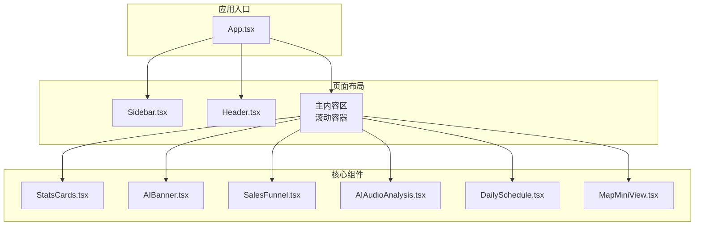
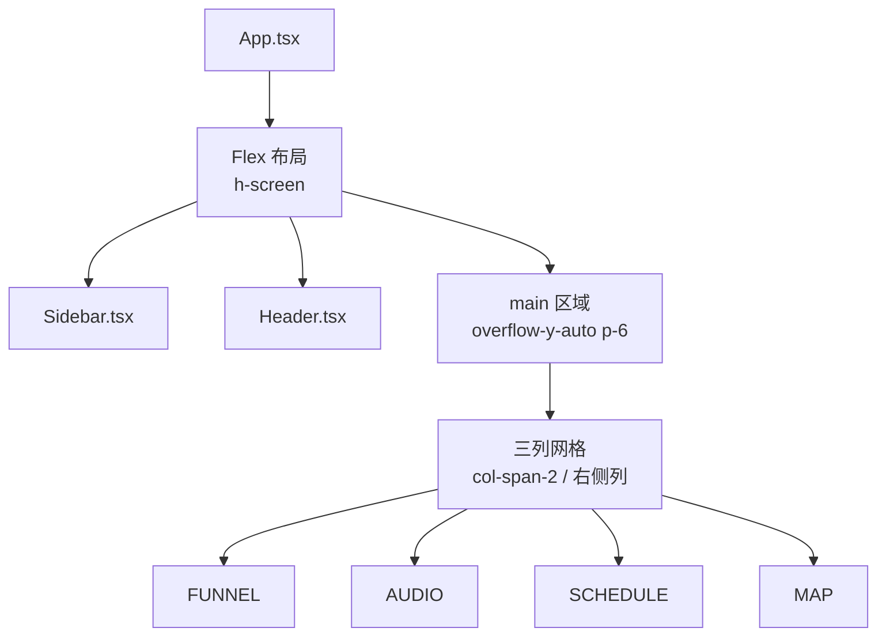
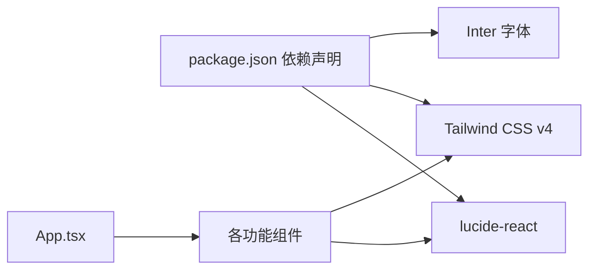

# 组件库规范

<cite>
**本文引用的文件**
- [Sidebar.tsx](file://crm-frontend/src/components/Sidebar.tsx)
- [Header.tsx](file://crm-frontend/src/components/Header.tsx)
- [StatsCards.tsx](file://crm-frontend/src/components/StatsCards.tsx)
- [SalesFunnel.tsx](file://crm-frontend/src/components/SalesFunnel.tsx)
- [AIAudioAnalysis.tsx](file://crm-frontend/src/components/AIAudioAnalysis.tsx)
- [DailySchedule.tsx](file://crm-frontend/src/components/DailySchedule.tsx)
- [MapMiniView.tsx](file://crm-frontend/src/components/MapMiniView.tsx)
- [AIBanner.tsx](file://crm-frontend/src/components/AIBanner.tsx)
- [App.tsx](file://crm-frontend/src/App.tsx)
- [index.css](file://crm-frontend/src/index.css)
- [package.json](file://crm-frontend/package.json)
</cite>

## 目录
1. [简介](#简介)
2. [项目结构](#项目结构)
3. [核心组件](#核心组件)
4. [架构总览](#架构总览)
5. [组件详细分析](#组件详细分析)
6. [依赖关系分析](#依赖关系分析)
7. [性能与可访问性考虑](#性能与可访问性考虑)
8. [故障排查指南](#故障排查指南)
9. [结论](#结论)
10. [附录：设计与使用规范](#附录设计与使用规范)

## 简介
本规范文档面向销售AI CRM系统的前端组件库，基于现有代码实现，定义了Sidebar导航、Header头部、StatsCards统计卡片、SalesFunnel销售漏斗、AIAudioAnalysis音频分析、DailySchedule日程管理、MapMiniView地图视图、AIBanner智能横幅等核心组件的设计原则、视觉样式、交互行为、尺寸规格与状态变化。文档同时提供组件组合模式与布局规范，帮助开发者在保持一致性的前提下扩展与维护UI。

## 项目结构
组件库采用按功能模块划分的组织方式，核心组件位于 src/components 目录，应用入口在 src/App.tsx 中进行整体布局编排。样式通过 Tailwind CSS 与自定义主题变量实现，字体与滚动条等全局样式在 src/index.css 中统一配置。

图表来源
- [App.tsx:10-55](file://crm-frontend/src/App.tsx#L10-L55)
- [Sidebar.tsx:37-82](file://crm-frontend/src/components/Sidebar.tsx#L37-L82)
- [Header.tsx:3-53](file://crm-frontend/src/components/Header.tsx#L3-L53)
- [StatsCards.tsx:35-81](file://crm-frontend/src/components/StatsCards.tsx#L35-L81)
- [AIBanner.tsx:3-47](file://crm-frontend/src/components/AIBanner.tsx#L3-L47)
- [SalesFunnel.tsx:29-66](file://crm-frontend/src/components/SalesFunnel.tsx#L29-L66)
- [AIAudioAnalysis.tsx:38-82](file://crm-frontend/src/components/AIAudioAnalysis.tsx#L38-L82)
- [DailySchedule.tsx:26-70](file://crm-frontend/src/components/DailySchedule.tsx#L26-L70)
- [MapMiniView.tsx:3-58](file://crm-frontend/src/components/MapMiniView.tsx#L3-L58)

章节来源
- [App.tsx:10-55](file://crm-frontend/src/App.tsx#L10-L55)
- [index.css:1-66](file://crm-frontend/src/index.css#L1-L66)
- [package.json:12-34](file://crm-frontend/package.json#L12-L34)

## 核心组件
本节对各组件的职责、数据结构、交互与样式要点进行概览式说明，便于快速理解与复用。

- Sidebar 导航组件：提供左侧导航栏，包含品牌区、导航项列表与“新建线索”按钮；支持图标与文本展示，当前激活项高亮。
- Header 头部组件：包含搜索框、升级按钮、通知铃铛与用户信息区，右侧头像带下拉指示。
- StatsCards 统计卡片：以网格布局展示关键指标卡片，每张卡片包含图标背景色、标签、数值与趋势徽章。
- SalesFunnel 销售漏斗：展示销售阶段的百分比进度条与累计金额，支持趋势指示。
- AIAudioAnalysis 音频分析：以时间线形式展示AI生成的通话摘要与情感倾向，支持查看更多。
- DailySchedule 日程管理：以时间轴形式展示当日任务，支持添加新任务。
- MapMiniView 地图视图：展示客户位置的简化地图占位符与标记点，支持跳转全图。
- AIBanner 智能横幅：展示AI建议的行动提示，包含操作按钮与关闭按钮。

章节来源
- [Sidebar.tsx:16-82](file://crm-frontend/src/components/Sidebar.tsx#L16-L82)
- [Header.tsx:3-53](file://crm-frontend/src/components/Header.tsx#L3-L53)
- [StatsCards.tsx:3-81](file://crm-frontend/src/components/StatsCards.tsx#L3-L81)
- [SalesFunnel.tsx:3-66](file://crm-frontend/src/components/SalesFunnel.tsx#L3-L66)
- [AIAudioAnalysis.tsx:3-82](file://crm-frontend/src/components/AIAudioAnalysis.tsx#L3-L82)
- [DailySchedule.tsx:3-70](file://crm-frontend/src/components/DailySchedule.tsx#L3-L70)
- [MapMiniView.tsx:3-58](file://crm-frontend/src/components/MapMiniView.tsx#L3-L58)
- [AIBanner.tsx:3-47](file://crm-frontend/src/components/AIBanner.tsx#L3-L47)

## 架构总览
组件库遵循“布局容器 + 功能组件”的分层结构。App.tsx 负责整体布局（侧边栏 + 主内容区），主内容区内部通过网格与列布局组织多个功能组件，确保信息密度与可读性的平衡。

图表来源
- [App.tsx:12-54](file://crm-frontend/src/App.tsx#L12-L54)
- [SalesFunnel.tsx:29-66](file://crm-frontend/src/components/SalesFunnel.tsx#L29-L66)
- [AIAudioAnalysis.tsx:38-82](file://crm-frontend/src/components/AIAudioAnalysis.tsx#L38-L82)
- [DailySchedule.tsx:26-70](file://crm-frontend/src/components/DailySchedule.tsx#L26-L70)
- [MapMiniView.tsx:3-58](file://crm-frontend/src/components/MapMiniView.tsx#L3-L58)

## 组件详细分析

### Sidebar 导航组件
- 视觉样式
  - 宽度固定为 64 个单位，白色背景与右侧边框分隔。
  - 品牌区使用主色调背景与白色文字，营造品牌识别感。
  - 导航项采用左右内边距与上下间距，图标与文字水平对齐，圆角过渡。
  - 激活态使用主色填充与白色文字，非激活态悬停浅灰背景。
  - “新建线索”按钮使用主色背景、白色文字、圆角与阴影。
- 交互行为
  - 导航项点击切换激活状态（由父级控制 active 属性）。
  - 悬停时有过渡动画与颜色变化。
- 尺寸规格
  - 导航项高度约 40px（含内边距），图标尺寸 20px。
  - 品牌区圆角半径与内边距适中，按钮高度约 40px。
- 状态变化
  - active 状态与 hover 状态的颜色与背景切换。
- 使用建议
  - 在路由切换时同步更新 active 状态。
  - 图标与文案需语义化，避免仅用图标表达。

章节来源
- [Sidebar.tsx:37-82](file://crm-frontend/src/components/Sidebar.tsx#L37-L82)

### Header 头部组件
- 视觉样式
  - 固定高度，白色背景与底部边框。
  - 搜索框前置图标，输入框聚焦时出现主色环形光晕。
  - 升级按钮使用主色浅背景与深色文字，悬停加深。
  - 通知按钮相对定位，右上角红点表示未读。
  - 用户区右侧文本与头像卡片，头像使用渐变背景与双色圆角徽章。
- 交互行为
  - 搜索框获得焦点时背景与边框高亮。
  - 通知按钮与用户区悬停改变背景色。
- 尺寸规格
  - 头部高度 64px（16 单位），搜索框内边距适中，头像 40x40px。
- 状态变化
  - 搜索框聚焦态、通知红点可见态、用户区悬停态。
- 使用建议
  - 搜索框 placeholder 文案应与业务场景匹配。
  - 用户头像可替换为真实头像资源。

章节来源
- [Header.tsx:3-53](file://crm-frontend/src/components/Header.tsx#L3-L53)

### StatsCards 统计卡片
- 视觉样式
  - 卡片圆角、边框与阴影，网格布局四列。
  - 每张卡片左上角图标背景块，包含图标与徽章。
  - 徽章根据类型（成功/警告/危险）使用不同配色。
- 数据结构
  - icon、label、value、badge、badgeType、iconBgColor。
- 交互行为
  - 卡片悬停时阴影加深，提升可点击感知。
- 尺寸规格
  - 卡片内边距与标题字号、数值字号明确。
- 状态变化
  - badgeType 决定徽章颜色与文本色。
- 使用建议
  - badgeType 与业务指标正负向关联，保持一致性。

章节来源
- [StatsCards.tsx:3-81](file://crm-frontend/src/components/StatsCards.tsx#L3-L81)

### SalesFunnel 销售漏斗
- 视觉样式
  - 卡片容器圆角与边框，标题与副标题清晰。
  - 每个阶段包含颜色指示点、标签、百分比与进度条。
  - 进度条宽度随百分比动态计算，过渡动画持续 500ms。
- 数据结构
  - label、percentage、color。
- 交互行为
  - 百分比与进度条动态渲染，无额外交互。
- 尺寸规格
  - 进度条高度 8px，长度固定 128px。
- 状态变化
  - percentage 改变时进度条宽度与文本同步更新。
- 使用建议
  - 颜色与阶段语义对应，避免混淆。

章节来源
- [SalesFunnel.tsx:3-66](file://crm-frontend/src/components/SalesFunnel.tsx#L3-L66)

### AIAudioAnalysis 音频分析
- 视觉样式
  - 列表项外层卡片背景与边框，悬停边框加深。
  - 左侧情感指示点，右侧内容区域包含标题、摘要与时间。
  - 情感徽章根据 Positive/Neutral/Negative 使用不同配色。
- 数据结构
  - title、summary、time、sentiment。
- 交互行为
  - 查看全部按钮悬停变色。
- 尺寸规格
  - 列表项内边距与标题/摘要字号明确。
- 状态变化
  - sentiment 决定指示点与徽章颜色。
- 使用建议
  - 摘要使用省略与换行策略，保证可读性。

章节来源
- [AIAudioAnalysis.tsx:3-82](file://crm-frontend/src/components/AIAudioAnalysis.tsx#L3-L82)

### DailySchedule 日程管理
- 视觉样式
  - 时间轴样式，左侧小圆点与垂直连线，右侧内容区域。
  - 不同任务使用不同颜色标识，增强区分度。
  - 添加任务按钮使用虚线边框与悬停主色过渡。
- 数据结构
  - time、title、description、color。
- 交互行为
  - 添加任务按钮悬停变色。
- 尺寸规格
  - 圆点直径 12px，连线细灰线。
- 状态变化
  - 新增任务后刷新列表。
- 使用建议
  - 时间段与描述需简洁明确，避免过长文本。

章节来源
- [DailySchedule.tsx:3-70](file://crm-frontend/src/components/DailySchedule.tsx#L3-L70)

### MapMiniView 地图视图
- 视觉样式
  - 地图占位符使用网格背景 SVG，三个定位标记点。
  - 标记点使用主色背景与白色图标，带阴影与脉冲动画。
  - 底部信息区包含数量提示与“全图查看”按钮。
- 交互行为
  - 全图查看按钮悬停变色。
- 尺寸规格
  - 地图容器高度 160px，标记点 24x24px。
- 状态变化
  - 标记点数量与位置可动态更新。
- 使用建议
  - 实际项目中替换为真实地图服务，保留占位符样式。

章节来源
- [MapMiniView.tsx:3-58](file://crm-frontend/src/components/MapMiniView.tsx#L3-L58)

### AIBanner 智能横幅
- 视觉样式
  - 渐变背景，装饰圆形元素，内容区相对层级高于装饰。
  - 标题与描述使用白色系文字，按钮使用对比色。
  - 关闭按钮绝对定位，悬停加深背景。
- 交互行为
  - 两个操作按钮悬停变色，关闭按钮可隐藏横幅。
- 尺寸规格
  - 圆角半径与内边距适中，按钮高度约 40px。
- 状态变化
  - 可被用户关闭，关闭后从布局中移除。
- 使用建议
  - 建议加入持久化关闭偏好，避免重复打扰。

章节来源
- [AIBanner.tsx:3-47](file://crm-frontend/src/components/AIBanner.tsx#L3-L47)

## 依赖关系分析
- 组件间依赖
  - App.tsx 作为根容器，直接引入并组合所有功能组件。
  - 各功能组件均为纯展示型，不互相依赖，耦合度低。
- 外部依赖
  - lucide-react 提供图标集，用于导航、操作与装饰。
  - Tailwind CSS v4 提供原子化样式与响应式工具类。
  - Inter 字体提供现代易读的排版基础。
- 样式与主题
  - 自定义主色变量集中于全局样式，便于主题统一。
  - 滚动条样式与工具类在全局样式中定义。

图表来源
- [package.json:12-34](file://crm-frontend/package.json#L12-L34)
- [App.tsx:1-9](file://crm-frontend/src/App.tsx#L1-L9)
- [index.css:1-16](file://crm-frontend/src/index.css#L1-L16)

章节来源
- [package.json:12-34](file://crm-frontend/package.json#L12-L34)
- [index.css:1-66](file://crm-frontend/src/index.css#L1-L66)
- [App.tsx:10-55](file://crm-frontend/src/App.tsx#L10-L55)

## 性能与可访问性考虑
- 性能
  - 组件均采用轻量渲染，避免不必要的重绘与回流。
  - 进度条动画时长可控，建议在大数据量场景下限制更新频率。
  - 图标来自 lucide-react，按需引入，减少打包体积。
- 可访问性
  - 所有交互元素具备键盘可达性与焦点可见性。
  - 文字对比度满足基本要求，建议在深色背景下测试可读性。
  - 图标与按钮提供语义化文本，避免仅图标表达。

## 故障排查指南
- 样式未生效
  - 检查 Tailwind CSS 是否正确安装与构建。
  - 确认全局样式文件已加载且无语法错误。
- 图标显示异常
  - 确认 lucide-react 版本兼容性与导入路径正确。
- 布局溢出
  - 检查 App.tsx 的根容器是否设置为全屏高度与滚动。
  - 确认主内容区 overflow-y-auto 生效。
- 主题色不一致
  - 检查自定义主色变量是否在全局样式中定义并被组件引用。

章节来源
- [index.css:1-66](file://crm-frontend/src/index.css#L1-L66)
- [package.json:12-34](file://crm-frontend/package.json#L12-L34)
- [App.tsx:12-54](file://crm-frontend/src/App.tsx#L12-L54)

## 结论
本组件库规范以现有代码实现为基础，明确了各组件的视觉、交互与布局规范，并提供了组合与使用建议。建议在后续迭代中补充类型约束、测试用例与无障碍属性，以进一步提升质量与可维护性。

## 附录：设计与使用规范
- 设计原则
  - 一致性：颜色、字号、间距与圆角风格统一。
  - 可读性：对比度充足，字体易读，信息层级清晰。
  - 可交互性：状态反馈及时，操作路径明确。
- 尺寸与间距
  - 常用单位：1 单位 ≈ 4px；导航项高度约 40px；图标尺寸 20px。
  - 卡片内边距与标题字号、数值字号明确，适合信息密度适中的展示。
- 组合模式与布局
  - 主页采用“侧边栏 + 头部 + 主内容区”的三段式布局。
  - 主内容区使用网格与列布局，左侧为主功能区，右侧为辅助信息区。
  - 统计卡片四列网格，漏斗与分析卡片横向排列，日程与地图卡片纵向堆叠。
- 最佳实践
  - 为每个组件提供清晰的 props 接口与默认值，便于复用。
  - 对关键交互（如搜索、通知、用户区）提供可访问性标签。
  - 在多语言环境下，确保文案可替换与文本截断策略一致。