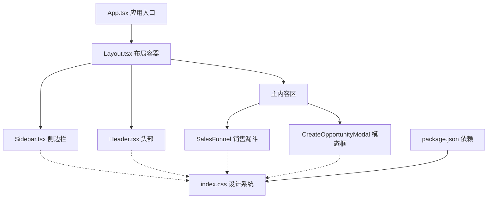
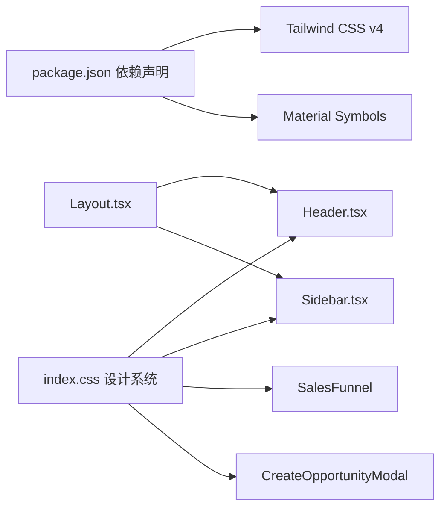

# 组件库规范

<cite>
**本文引用的文件**
- [Header.tsx](file://crm-frontend/src/components/layout/Header.tsx)
- [Sidebar.tsx](file://crm-frontend/src/components/layout/Sidebar.tsx)
- [Layout.tsx](file://crm-frontend/src/components/layout/Layout.tsx)
- [App.tsx](file://crm-frontend/src/App.tsx)
- [index.css](file://crm-frontend/src/index.css)
- [package.json](file://crm-frontend/package.json)
- [SalesFunnel/index.tsx](file://crm-frontend/src/pages/SalesFunnel/index.tsx)
- [CreateOpportunityModal.tsx](file://crm-frontend/src/components/Customers/CreateOpportunityModal.tsx)
- [CreateCustomerModal.tsx](file://crm-frontend/src/components/Customers/CreateCustomerModal.tsx)
- [Login/index.tsx](file://crm-frontend/src/pages/Login/index.tsx)
</cite>

## 更新摘要
**变更内容**
- 重大UI改进：Header和Sidebar组件采用全新的现代设计系统
- Tailwind CSS v4升级带来新的原子化样式系统和设计令牌
- 新增环境光效、磨砂玻璃效果、高级动画规范
- 更新组件视觉样式、交互行为和动画效果
- 完善组件库设计规范以反映最新的设计系统实现

## 目录
1. [简介](#简介)
2. [设计系统概述](#设计系统概述)
3. [核心组件](#核心组件)
4. [架构总览](#架构总览)
5. [组件详细分析](#组件详细分析)
6. [依赖关系分析](#依赖关系分析)
7. [性能与可访问性考虑](#性能与可访问性考虑)
8. [故障排查指南](#故障排查指南)
9. [结论](#结论)
10. [附录：设计与使用规范](#附录设计与使用规范)

## 简介
本规范文档面向销售AI CRM系统的前端组件库，基于最新的设计系统实现，定义了Header头部、Sidebar导航、SalesFunnel销售漏斗、CreateOpportunityModal创建商机模态框等核心组件的设计原则、视觉样式、交互行为、尺寸规格与状态变化。文档反映了最新的现代设计系统，包括磨砂玻璃效果、深色主题、环境光效等设计元素，为开发者提供统一的组件使用指南和最佳实践。

## 设计系统概述
系统采用现代化的深色主题设计系统，以Luxury Dark Theme为核心，结合Tailwind CSS v4的新原子化样式系统、环境光效和精致的动画过渡，营造高端的企业级用户体验。

### 主题色彩体系
- **主色调**：#f59e0b（琥珀色）- 用于重要操作和强调元素
- **辅色调**：#06b6d4（水鸭色）- 用于次要功能和辅助操作
- **背景层次**：#0a0f1a → #111827 → #1f2937（从深蓝到深灰）
- **文本色彩**：#f9fafb（浅灰白）主要文本，#9ca3af（中灰）辅助文本

### 设计系统特性
- **磨砂玻璃效果**：通过backdrop-filter实现毛玻璃质感
- **环境光效**：动态背景渐变和发光效果
- **精致动画**：流畅的过渡动画和微交互
- **深度层次**：多层背景和阴影营造空间感
- **原子化样式**：Tailwind CSS v4的全新设计令牌系统

**章节来源**
- [index.css:10-47](file://crm-frontend/src/index.css#L10-L47)
- [index.css:64-92](file://crm-frontend/src/index.css#L64-L92)
- [index.css:94-117](file://crm-frontend/src/index.css#L94-L117)

## 核心组件
本节对各组件的职责、数据结构、交互与样式要点进行概览式说明，体现最新的设计系统实现。

### Header 头部组件
**重大更新** 采用全新的现代设计系统，包含磨砂玻璃效果、环境光效和精致的动画过渡。

- **视觉样式**
  - 固定高度20单元（320px），采用磨砂玻璃背景（#0a0f1a/80）
  - 搜索框前置Material Symbols图标，输入框聚焦时出现琥珀色光晕
  - 通知按钮使用脉冲动画红点，用户头像采用渐变背景和在线状态指示
  - 升级按钮使用渐变背景和悬浮动画效果
- **交互行为**
  - 搜索框获得焦点时背景与边框高亮，显示⌘K快捷键提示
  - 通知下拉菜单支持展开/收起，显示不同类型的通知
  - 用户下拉菜单包含个人资料、外观设置和退出登录选项
  - 点击外部区域自动关闭下拉菜单
- **动画效果**
  - 悬停时的渐变过渡和阴影变化
  - 通知红点的脉冲动画效果
  - 按钮的缩放和发光效果
- **尺寸规格**
  - 头部高度320px，搜索框内边距适中，头像48x48px
  - 通知下拉菜单宽度288px，最大高度320px
- **使用建议**
  - 搜索框placeholder文案应与业务场景匹配
  - 用户头像可替换为真实头像资源
  - 通知类型应合理分类和使用对应颜色

**章节来源**
- [Header.tsx:45-178](file://crm-frontend/src/components/layout/Header.tsx#L45-L178)

### Sidebar 侧边栏组件
**重大更新** 采用全新的渐变背景、环境光效和精致的导航体验。

- **视觉样式**
  - 固定宽度72单元（1152px），采用从#0f172a到#0a0f1a的渐变背景
  - Logo区域使用渐变发光效果和品牌标识
  - 导航菜单项支持激活状态渐变背景和悬停发光效果
  - 底部区域包含新建商机的渐变按钮，带有滑 shine 效果
  - 用户信息区域采用hover状态和在线状态指示
- **交互行为**
  - 导航项点击切换激活状态，支持子菜单路径匹配
  - 悬停时显示渐变发光背景和左侧激活指示条
  - 新建商机按钮支持hover放大和shine效果
  - 用户信息区域点击展开下拉菜单
- **环境光效**
  - 顶部和右侧使用琥珀色发光球体（#f59e0b/5）
  - 底部使用青色发光球体（#06b6d4/5）
  - 背景包含微妙的SVG图案叠加
- **动画效果**
  - 导航项逐个延迟0.05秒的入场动画
  - 按钮hover时的渐变过渡和缩放效果
  - 激活状态的渐变背景过渡
- **尺寸规格**
  - 侧边栏宽度1152px，Logo区域高度适中
  - 导航项高度适中，图标尺寸24px
  - 新建按钮高度48px，用户信息区域高度适中
- **使用建议**
  - 导航项应语义化命名，避免仅用图标表达
  - 激活状态应与路由状态保持同步
  - 环境光效应在低端设备上保持性能

**章节来源**
- [Sidebar.tsx:25-161](file://crm-frontend/src/components/layout/Sidebar.tsx#L25-L161)

### SalesFunnel 销售漏斗组件
保持原有的生产级看板功能，配合新的设计系统实现统一的视觉风格。

- **视觉样式**
  - 看板容器采用磨砂玻璃背景和毛玻璃效果
  - 阶段列支持拖拽高亮和目标区域指示
  - 机会卡片支持优先级边框和操作按钮
  - 统计卡片采用统一的玻璃效果设计
- **交互行为**
  - 支持跨阶段拖拽移动销售机会
  - 编辑、删除、添加等完整CRUD操作
  - 实时统计和状态更新
- **使用建议**
  - 确保拖拽操作的视觉反馈
  - 保持卡片操作的一致性
  - 优化大数据量时的渲染性能

**章节来源**
- [SalesFunnel/index.tsx:542-688](file://crm-frontend/src/pages/SalesFunnel/index.tsx#L542-L688)

### CreateOpportunityModal 创建商机模态框
新增的模态框组件，采用统一的设计系统实现。

- **视觉样式**
  - 固定背景遮罩层，采用半透明黑色背景
  - 模态框主体采用磨砂玻璃效果和毛玻璃背景
  - 表单字段使用统一的玻璃效果设计
  - 按钮采用渐变背景和hover效果
- **交互行为**
  - 表单验证和错误处理
  - 加载状态和提交反馈
  - 成功后的回调处理
- **使用建议**
  - 在客户详情页中调用
  - 处理onSuccess回调更新父组件状态
  - 设置合适的默认值和验证规则

**章节来源**
- [CreateOpportunityModal.tsx:1-316](file://crm-frontend/src/components/Customers/CreateOpportunityModal.tsx#L1-L316)

## 架构总览
组件库采用"布局容器 + 功能组件"的分层结构，配合现代化的设计系统实现统一的视觉体验。

**图表来源**
- [App.tsx:51-96](file://crm-frontend/src/App.tsx#L51-L96)
- [Layout.tsx:9-24](file://crm-frontend/src/components/layout/Layout.tsx#L9-L24)
- [Sidebar.tsx:25-161](file://crm-frontend/src/components/layout/Sidebar.tsx#L25-L161)
- [Header.tsx:45-178](file://crm-frontend/src/components/layout/Header.tsx#L45-L178)
- [index.css:10-47](file://crm-frontend/src/index.css#L10-L47)

## 组件详细分析

### Header 头部组件详细分析
**重大更新** 采用全新的现代设计系统实现

#### 视觉样式
- **背景设计**：使用rgba(10, 15, 26, 0.8)的磨砂玻璃背景，backdrop-blur-xl实现毛玻璃效果
- **渐变装饰**：底部边框使用rgba(75, 85, 99, 0.4)的渐变装饰
- **搜索框设计**：输入框使用rgba(17, 24, 39, 0.5)背景，聚焦时出现琥珀色光晕
- **通知系统**：使用脉冲动画的红色圆点指示未读消息
- **用户界面**：头像使用渐变背景和在线状态指示

#### 交互行为
- **搜索功能**：搜索框获得焦点时显示⌘K快捷键提示
- **通知管理**：支持展开/收起通知下拉菜单，显示不同类型的通知
- **用户管理**：用户头像点击展开下拉菜单，包含个人资料和退出登录
- **外部点击**：自动检测外部点击并关闭下拉菜单

#### 动画效果
- **渐变过渡**：所有交互元素使用平滑的渐变过渡效果
- **脉冲动画**：通知红点使用2秒间隔的脉冲动画
- **悬停效果**：按钮和链接使用缩放和发光效果

**章节来源**
- [Header.tsx:45-178](file://crm-frontend/src/components/layout/Header.tsx#L45-L178)

### Sidebar 侧边栏组件详细分析
**重大更新** 采用全新的渐变背景和环境光效设计

#### 视觉样式
- **渐变背景**：从#0f172a到#111827再到#0a0f1a的垂直渐变背景
- **环境光效**：顶部使用琥珀色发光球体（#f59e0b/5），底部使用青色发光球体（#06b6d4/5）
- **品牌设计**：Logo使用渐变发光效果和品牌标识
- **导航设计**：导航项支持激活状态渐变背景和悬停发光效果
- **按钮设计**：新建商机按钮使用渐变背景和shine效果

#### 交互行为
- **导航管理**：支持路由状态同步和子菜单路径匹配
- **悬停效果**：导航项悬停时显示渐变发光背景
- **按钮交互**：新建按钮支持hover放大和shine动画
- **用户管理**：用户信息区域点击展开下拉菜单

#### 环境光效
- **发光球体**：顶部和右侧使用模糊的发光球体营造环境光效果
- **微妙图案**：背景包含0.02透明度的SVG图案叠加
- **动态效果**：环境光效在组件生命周期内保持稳定

#### 动画系统
- **延迟动画**：导航项逐个延迟0.05秒的入场动画
- **渐变过渡**：所有状态转换使用平滑的渐变过渡
- **缩放效果**：按钮hover时的轻微缩放效果

**章节来源**
- [Sidebar.tsx:25-161](file://crm-frontend/src/components/layout/Sidebar.tsx#L25-L161)

### SalesFunnel 销售漏斗组件详细分析
保持原有功能完整性，配合新的设计系统实现统一视觉风格。

#### 视觉样式
- **玻璃效果**：看板容器和阶段列采用磨砂玻璃背景
- **统一设计**：所有组件使用一致的玻璃效果和阴影设计
- **颜色系统**：沿用原有的阶段颜色标识系统
- **卡片设计**：机会卡片支持优先级边框和操作按钮

#### 交互行为
- **拖拽系统**：完整的拖拽交互支持跨阶段移动
- **模态框系统**：编辑和删除操作使用模态框
- **表单系统**：添加客户使用展开式表单
- **状态管理**：实时状态更新和持久化

#### 性能优化
- **虚拟滚动**：大量数据时的滚动性能优化
- **状态缓存**：使用useCallback优化函数引用
- **渲染优化**：条件渲染和懒加载策略

**章节来源**
- [SalesFunnel/index.tsx:542-688](file://crm-frontend/src/pages/SalesFunnel/index.tsx#L542-L688)

### CreateOpportunityModal 模态框详细分析
**新增** 专门用于从客户详情页创建商机的模态框组件。

#### 视觉样式
- **背景设计**：半透明黑色背景遮罩层，backdrop-blur-sm实现模糊效果
- **模态框设计**：采用磨砂玻璃背景和毛玻璃效果
- **表单设计**：统一的玻璃效果表单字段设计
- **按钮设计**：渐变背景和hover效果的按钮设计

#### 交互行为
- **表单验证**：实时表单验证和错误提示
- **状态管理**：加载状态和提交反馈
- **回调处理**：成功后的onSuccess回调和模态框关闭
- **键盘支持**：支持Esc键关闭和Enter键提交

#### 数据处理
- **默认值设置**：合理的默认值和预设参数
- **数据格式化**：金额格式化和日期处理
- **错误处理**：完善的错误处理和用户反馈

**章节来源**
- [CreateOpportunityModal.tsx:1-316](file://crm-frontend/src/components/Customers/CreateOpportunityModal.tsx#L1-L316)

## 依赖关系分析
- **设计系统依赖**
  - Tailwind CSS v4提供原子化样式和响应式工具类
  - 自定义CSS变量定义完整的色彩体系和设计令牌
  - Material Symbols提供丰富的图标字体支持
- **组件依赖**
  - Header和Sidebar组件相互独立，通过Layout容器组合
  - SalesFunnel组件依赖状态管理库和类型定义
  - CreateOpportunityModal组件依赖API服务层
- **动画依赖**
  - CSS动画提供脉冲、浮动和渐变等基础动画效果
  - JavaScript实现复杂的交互动画和状态管理

**图表来源**
- [package.json:12-39](file://crm-frontend/package.json#L12-L39)
- [index.css:10-47](file://crm-frontend/src/index.css#L10-L47)
- [Layout.tsx:9-24](file://crm-frontend/src/components/layout/Layout.tsx#L9-L24)

**章节来源**
- [package.json:12-39](file://crm-frontend/package.json#L12-L39)
- [index.css:10-47](file://crm-frontend/src/index.css#L10-L47)

## 性能与可访问性考虑
- **性能优化**
  - 磨砂玻璃效果使用硬件加速的backdrop-filter属性
  - 环境光效使用CSS滤镜和模糊效果，避免JavaScript动画
  - 组件使用React.memo和useMemo优化渲染性能
  - 图标使用Material Symbols字体，按需加载
- **可访问性**
  - 所有交互元素具备键盘可达性和焦点可见性
  - 文字对比度满足WCAG 2.1 AA标准
  - 图标和按钮提供语义化文本和aria-label
  - 模态框支持键盘导航和屏幕阅读器支持
  - 动画可由用户偏好设置禁用
- **响应式设计**
  - 移动端适配和触摸友好的交互设计
  - 触摸目标尺寸符合移动端操作标准
  - 横屏和竖屏模式的自适应布局

## 故障排查指南
- **样式问题**
  - 检查Tailwind CSS配置和自定义CSS变量
  - 确认磨砂玻璃效果在目标浏览器中的支持情况
  - 验证Material Symbols字体的加载状态
- **动画问题**
  - 检查CSS动画的关键帧定义和浏览器兼容性
  - 确认backdrop-filter属性在目标设备上的性能表现
  - 验证JavaScript动画的执行时机和性能影响
- **交互问题**
  - 检查事件监听器的绑定和解绑逻辑
  - 确认模态框的z-index层级和背景遮罩效果
  - 验证下拉菜单的点击外部关闭功能
- **性能问题**
  - 使用浏览器开发者工具监控GPU使用情况
  - 检查backdrop-filter对性能的影响
  - 优化大量DOM元素的渲染性能

**章节来源**
- [index.css:94-117](file://crm-frontend/src/index.css#L94-L117)
- [Header.tsx:24-35](file://crm-frontend/src/components/layout/Header.tsx#L24-L35)
- [Sidebar.tsx:37-40](file://crm-frontend/src/components/layout/Sidebar.tsx#L37-L40)

## 结论
本组件库规范反映了最新的现代设计系统实现，Header和Sidebar组件的重大UI改进体现了高端企业级应用的设计理念。新的设计系统包括磨砂玻璃效果、环境光效、精致动画和深色主题，为用户提供沉浸式的操作体验。SalesFunnel组件保持了原有的生产级功能完整性，CreateOpportunityModal组件新增了完整的商机创建流程。建议在后续迭代中继续优化性能表现，增强可访问性支持，并扩展设计系统的组件覆盖范围。

## 附录：设计与使用规范

### 设计原则
- **一致性**：颜色、字号、间距和圆角风格统一，符合品牌识别
- **可读性**：对比度充足，字体易读，信息层级清晰
- **可交互性**：状态反馈及时，操作路径明确，交互自然流畅
- **现代性**：采用最新的设计趋势和技术实现
- **性能优先**：在美观和性能之间找到平衡点

### 尺寸与间距
- **常用单位**：1单元 = 4px；头部高度320px；侧边栏宽度1152px
- **导航项高度**：48px（含内边距），图标尺寸24px
- **卡片内边距**：16-24px，标题字号16-20px，数值字号20-24px
- **模态框尺寸**：最大宽度100%，最大高度90vh，支持滚动
- **动画时长**：0.2-0.4秒的平滑过渡动画

### 组合模式与布局
- **页面布局**：采用"侧边栏 + 头部 + 主内容区"的三段式布局
- **内容组织**：主内容区使用网格和列布局，信息密度适中
- **响应式设计**：支持桌面端的宽屏布局和移动端的自适应调整
- **深色主题**：默认深色主题，支持用户偏好的外观设置

### 最佳实践
- **组件复用**：为每个组件提供清晰的props接口和默认值
- **状态管理**：使用类型安全的接口定义，避免运行时错误
- **性能优化**：使用React.memo和useCallback优化渲染性能
- **错误处理**：完善的错误处理和用户反馈机制
- **可访问性**：支持键盘导航、屏幕阅读器和语义化标记
- **国际化**：支持多语言环境和文本方向调整

### Tailwind CSS v4 新特性
- **原子化样式系统**：更精细的样式控制和更好的可维护性
- **设计令牌**：统一的颜色、字体、间距等设计变量
- **响应式工具类**：更灵活的断点管理和布局控制
- **状态选择器**：更好的交互状态管理
- **性能优化**：编译时优化和更小的CSS输出

**章节来源**
- [package.json:12-39](file://crm-frontend/package.json#L12-L39)
- [index.css:10-47](file://crm-frontend/src/index.css#L10-L47)