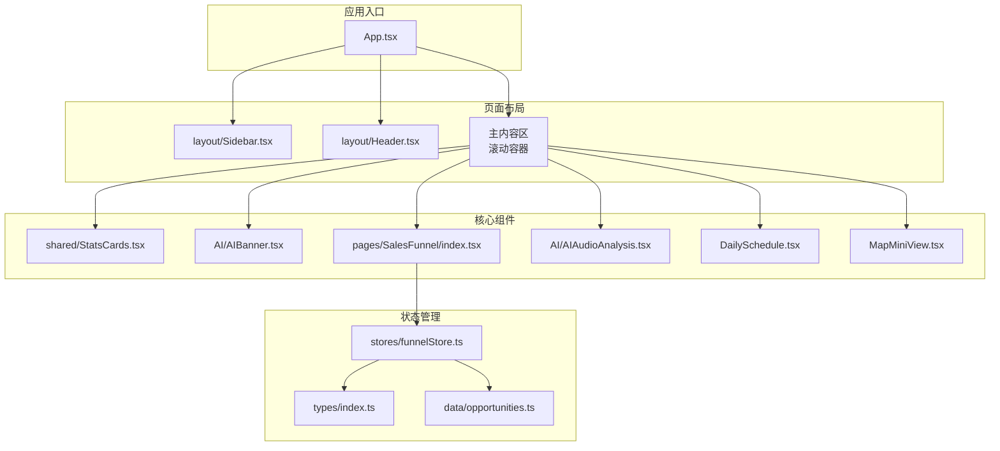
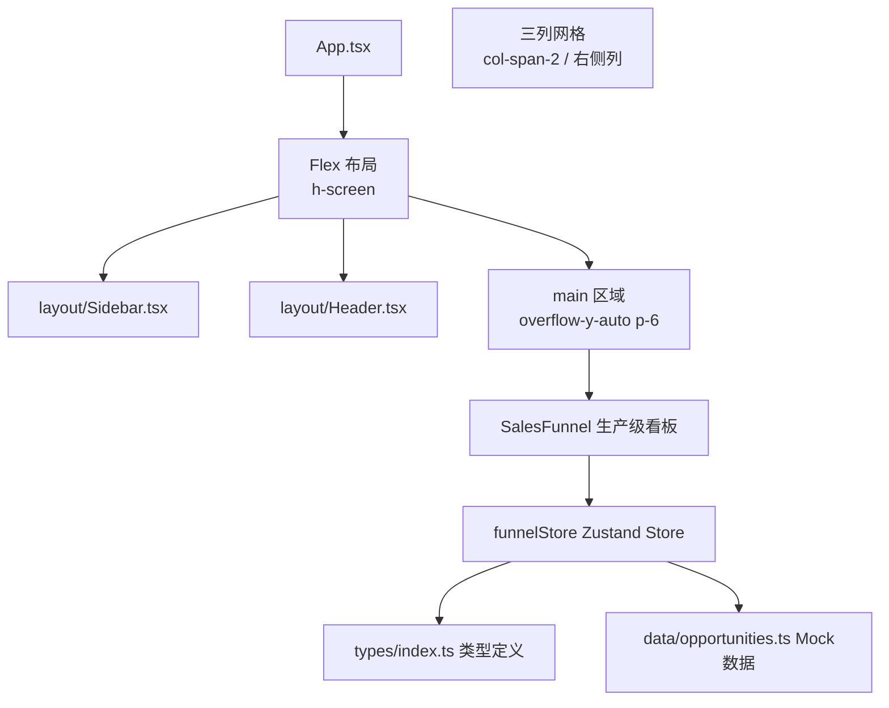
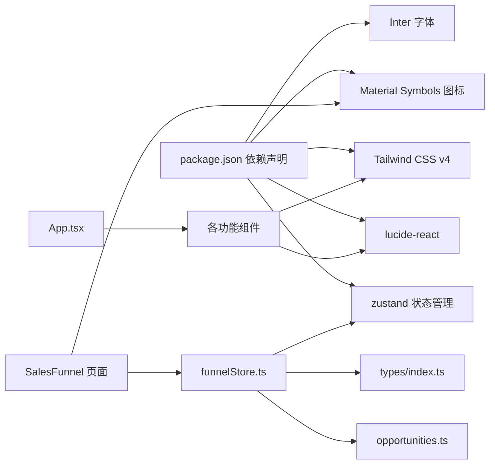

# 组件库规范

<cite>
**本文引用的文件**
- [Sidebar.tsx](file://crm-frontend/src/components/layout/Sidebar.tsx)
- [Header.tsx](file://crm-frontend/src/components/layout/Header.tsx)
- [StatsCards.tsx](file://crm-frontend/src/components/shared/StatsCards.tsx)
- [SalesFunnel.tsx](file://crm-frontend/src/pages/SalesFunnel/index.tsx)
- [AIAudioAnalysis.tsx](file://crm-frontend/src/components/AI/AIAudioAnalysis.tsx)
- [DailySchedule.tsx](file://crm-frontend/src/components/DailySchedule.tsx)
- [MapMiniView.tsx](file://crm-frontend/src/components/MapMiniView.tsx)
- [AIBanner.tsx](file://crm-frontend/src/components/AI/AIBanner.tsx)
- [App.tsx](file://crm-frontend/src/App.tsx)
- [index.css](file://crm-frontend/src/index.css)
- [package.json](file://crm-frontend/package.json)
- [funnelStore.ts](file://crm-frontend/src/stores/funnelStore.ts)
- [opportunities.ts](file://crm-frontend/src/data/opportunities.ts)
- [index.ts](file://crm-frontend/src/types/index.ts)
</cite>

## 更新摘要
**变更内容**
- 重大更新销售漏斗组件：从静态展示升级为完整的生产级看板系统
- 新增拖拽交互功能，支持跨阶段移动销售机会
- 新增编辑、删除、添加客户等完整CRUD操作
- 新增模态框和确认对话框组件
- 新增状态管理和数据持久化
- 更新组件功能特性描述和交互行为说明

## 目录
1. [简介](#简介)
2. [项目结构](#项目结构)
3. [核心组件](#核心组件)
4. [架构总览](#架构总览)
5. [组件详细分析](#组件详细分析)
6. [依赖关系分析](#依赖关系分析)
7. [性能与可访问性考虑](#性能与可访问性考虑)
8. [故障排查指南](#故障排查指南)
9. [结论](#结论)
10. [附录：设计与使用规范](#附录设计与使用规范)

## 简介
本规范文档面向销售AI CRM系统的前端组件库，基于现有代码实现，定义了Sidebar导航、Header头部、StatsCards统计卡片、SalesFunnel销售漏斗、AIAudioAnalysis音频分析、DailySchedule日程管理、MapMiniView地图视图、AIBanner智能横幅等核心组件的设计原则、视觉样式、交互行为、尺寸规格与状态变化。文档同时提供组件组合模式与布局规范，帮助开发者在保持一致性的前提下扩展与维护UI。

**更新** 销售漏斗组件已从简单的静态展示升级为包含拖拽、编辑、删除、添加等完整交互功能的生产级看板系统。

## 项目结构
组件库采用按功能模块划分的组织方式，核心组件位于 src/components 目录，页面组件位于 src/pages 目录，应用入口在 src/App.tsx 中进行整体布局编排。状态管理通过 Zustand store 实现，数据类型定义在 src/types 中统一管理。

**图表来源**
- [App.tsx:10-55](file://crm-frontend/src/App.tsx#L10-L55)
- [Sidebar.tsx:37-82](file://crm-frontend/src/components/layout/Sidebar.tsx#L37-L82)
- [Header.tsx:3-53](file://crm-frontend/src/components/layout/Header.tsx#L3-L53)
- [StatsCards.tsx:35-81](file://crm-frontend/src/components/shared/StatsCards.tsx#L35-L81)
- [AIBanner.tsx:3-47](file://crm-frontend/src/components/AI/AIBanner.tsx#L3-L47)
- [SalesFunnel.tsx:29-66](file://crm-frontend/src/pages/SalesFunnel/index.tsx#L29-L66)
- [AIAudioAnalysis.tsx:38-82](file://crm-frontend/src/components/AI/AIAudioAnalysis.tsx#L38-L82)
- [DailySchedule.tsx:26-70](file://crm-frontend/src/components/DailySchedule.tsx#L26-L70)
- [MapMiniView.tsx:3-58](file://crm-frontend/src/components/MapMiniView.tsx#L3-L58)
- [funnelStore.ts:1-76](file://crm-frontend/src/stores/funnelStore.ts#L1-76)
- [opportunities.ts:1-169](file://crm-frontend/src/data/opportunities.ts#L1-169)
- [index.ts:1-677](file://crm-frontend/src/types/index.ts#L1-677)

**章节来源**
- [App.tsx:10-55](file://crm-frontend/src/App.tsx#L10-L55)
- [index.css:1-66](file://crm-frontend/src/index.css#L1-L66)
- [package.json:12-34](file://crm-frontend/package.json#L12-L34)

## 核心组件
本节对各组件的职责、数据结构、交互与样式要点进行概览式说明，便于快速理解与复用。

**更新** 销售漏斗组件现为完整的生产级看板系统，包含拖拽、编辑、删除、添加等交互功能。

- Sidebar 导航组件：提供左侧导航栏，包含品牌区、导航项列表与"新建线索"按钮；支持图标与文本展示，当前激活项高亮。
- Header 头部组件：包含搜索框、升级按钮、通知铃铛与用户信息区，右侧头像带下拉指示。
- StatsCards 统计卡片：以网格布局展示关键指标卡片，每张卡片包含图标背景色、标签、数值与趋势徽章。
- SalesFunnel 销售漏斗：**生产级看板系统**，包含拖拽、编辑、删除、添加等完整交互功能，支持阶段间移动、机会管理、统计分析。
- AIAudioAnalysis 音频分析：以时间线形式展示AI生成的通话摘要与情感倾向，支持查看更多。
- DailySchedule 日程管理：以时间轴形式展示当日任务，支持添加新任务。
- MapMiniView 地图视图：展示客户位置的简化地图占位符与标记点，支持跳转全图。
- AIBanner 智能横幅：展示AI建议的行动提示，包含操作按钮与关闭按钮。

**章节来源**
- [Sidebar.tsx:16-82](file://crm-frontend/src/components/layout/Sidebar.tsx#L16-L82)
- [Header.tsx:3-53](file://crm-frontend/src/components/layout/Header.tsx#L3-L53)
- [StatsCards.tsx:3-81](file://crm-frontend/src/components/shared/StatsCards.tsx#L3-L81)
- [SalesFunnel.tsx:3-66](file://crm-frontend/src/pages/SalesFunnel/index.tsx#L3-L66)
- [AIAudioAnalysis.tsx:3-82](file://crm-frontend/src/components/AI/AIAudioAnalysis.tsx#L3-L82)
- [DailySchedule.tsx:3-70](file://crm-frontend/src/components/DailySchedule.tsx#L3-L70)
- [MapMiniView.tsx:3-58](file://crm-frontend/src/components/MapMiniView.tsx#L3-L58)
- [AIBanner.tsx:3-47](file://crm-frontend/src/components/AI/AIBanner.tsx#L3-L47)

## 架构总览
组件库遵循"布局容器 + 功能组件"的分层结构。App.tsx 负责整体布局（侧边栏 + 主内容区），主内容区内部通过网格与列布局组织多个功能组件，确保信息密度与可读性的平衡。

**更新** 销售漏斗组件现在使用Zustand状态管理，支持数据持久化和实时更新。

**图表来源**
- [App.tsx:12-54](file://crm-frontend/src/App.tsx#L12-L54)
- [SalesFunnel.tsx:29-66](file://crm-frontend/src/pages/SalesFunnel/index.tsx#L29-L66)
- [funnelStore.ts:18-76](file://crm-frontend/src/stores/funnelStore.ts#L18-L76)
- [index.ts:192-270](file://crm-frontend/src/types/index.ts#L192-L270)

## 组件详细分析

### Sidebar 导航组件
- 视觉样式
  - 宽度固定为 64 个单位，白色背景与右侧边框分隔。
  - 品牌区使用主色调背景与白色文字，营造品牌识别感。
  - 导航项采用左右内边距与上下间距，图标与文字水平对齐，圆角过渡。
  - 激活态使用主色填充与白色文字，非激活态悬停浅灰背景。
  - "新建线索"按钮使用主色背景、白色文字、圆角与阴影。
- 交互行为
  - 导航项点击切换激活状态（由父级控制 active 属性）。
  - 悬停时有过渡动画与颜色变化。
- 尺寸规格
  - 导航项高度约 40px（含内边距），图标尺寸 20px。
  - 品牌区圆角半径与内边距适中，按钮高度约 40px。
- 状态变化
  - active 状态与 hover 状态的颜色与背景切换。
- 使用建议
  - 在路由切换时同步更新 active 状态。
  - 图标与文案需语义化，避免仅用图标表达。

**章节来源**
- [Sidebar.tsx:37-82](file://crm-frontend/src/components/layout/Sidebar.tsx#L37-L82)

### Header 头部组件
- 视觉样式
  - 固定高度，白色背景与底部边框。
  - 搜索框前置图标，输入框聚焦时出现主色环形光晕。
  - 升级按钮使用主色浅背景与深色文字，悬停加深。
  - 通知按钮相对定位，右上角红点表示未读。
  - 用户区右侧文本与头像卡片，头像使用渐变背景与双色圆角徽章。
- 交互行为
  - 搜索框获得焦点时背景与边框高亮。
  - 通知按钮与用户区悬停改变背景色。
- 尺寸规格
  - 头部高度 64px（16 单位），搜索框内边距适中，头像 40x40px。
- 状态变化
  - 搜索框聚焦态、通知红点可见态、用户区悬停态。
- 使用建议
  - 搜索框 placeholder 文案应与业务场景匹配。
  - 用户头像可替换为真实头像资源。

**章节来源**
- [Header.tsx:3-53](file://crm-frontend/src/components/layout/Header.tsx#L3-L53)

### StatsCards 统计卡片
- 视觉样式
  - 卡片圆角、边框与阴影，网格布局四列。
  - 每张卡片左上角图标背景块，包含图标与徽章。
  - 徽章根据类型（成功/警告/危险）使用不同配色。
- 数据结构
  - icon、label、value、badge、badgeType、iconBgColor。
- 交互行为
  - 卡片悬停时阴影加深，提升可点击感知。
- 尺寸规格
  - 卡片内边距与标题字号、数值字号明确。
- 状态变化
  - badgeType 决定徽章颜色与文本色。
- 使用建议
  - badgeType 与业务指标正负向关联，保持一致性。

**章节来源**
- [StatsCards.tsx:3-81](file://crm-frontend/src/components/shared/StatsCards.tsx#L3-L81)

### SalesFunnel 销售漏斗
**更新** 销售漏斗组件已升级为完整的生产级看板系统，包含丰富的交互功能。

- 视觉样式
  - 看板容器采用卡片式布局，每个阶段列包含列头、机会卡片列表和添加表单。
  - 列头显示阶段名称、机会数量和总价值，支持阶段颜色标识。
  - 机会卡片包含标题、客户名称、金额、负责人、成交概率等信息。
  - 支持优先级边框颜色（高/中/低）和下一步行动显示。
- 数据结构
  - Stage 枚举：new_lead、contacted、solution、quoted、negotiation、procurement_process、contract_stage、won
  - Opportunity 接口：id、customerId、customerName、title、stage、value、probability、owner、priority、expectedCloseDate、lastActivity、description、nextStep
  - FunnelState 接口：opportunities 数组、selectedStage 状态、CRUD 操作方法
- 交互行为
  - **拖拽功能**：支持跨阶段拖拽移动销售机会，拖拽时显示目标区域高亮。
  - **编辑功能**：悬停显示编辑按钮，点击弹出模态框进行编辑。
  - **删除功能**：悬停显示删除按钮，点击弹出确认对话框。
  - **添加功能**：每个阶段列底部提供添加客户表单。
  - **实时统计**：自动计算总机会数、总价值、加权价值和平均成交率。
- 尺寸规格
  - 阶段列最小宽度 280px，最大宽度 320px，支持横向滚动。
  - 机会卡片高度自适应，支持多行文本截断。
  - 统计卡片网格布局，每列占据 1/4 宽度。
- 状态变化
  - 拖拽过程中目标列高亮显示，拖拽结束后更新数据库状态。
  - 编辑模态框显示时禁用背景滚动，保存后关闭模态框。
  - 删除确认对话框显示时背景模糊，确认后从列表中移除。
- 使用建议
  - 确保每个阶段都有合理的成交概率预设值。
  - 为高优先级机会提供更醒目的视觉标识。
  - 定期清理已完成或失败的销售机会。

**章节来源**
- [SalesFunnel.tsx:3-676](file://crm-frontend/src/pages/SalesFunnel/index.tsx#L3-L676)
- [funnelStore.ts:6-76](file://crm-frontend/src/stores/funnelStore.ts#L6-L76)
- [index.ts:192-270](file://crm-frontend/src/types/index.ts#L192-L270)
- [opportunities.ts:3-169](file://crm-frontend/src/data/opportunities.ts#L3-L169)

### AIAudioAnalysis 音频分析
- 视觉样式
  - 列表项外层卡片背景与边框，悬停边框加深。
  - 左侧情感指示点，右侧内容区域包含标题、摘要与时间。
  - 情感徽章根据 Positive/Neutral/Negative 使用不同配色。
- 数据结构
  - title、summary、time、sentiment。
- 交互行为
  - 查看全部按钮悬停变色。
- 尺寸规格
  - 列表项内边距与标题/摘要字号明确。
- 状态变化
  - sentiment 决定指示点与徽章颜色。
- 使用建议
  - 摘要使用省略与换行策略，保证可读性。

**章节来源**
- [AIAudioAnalysis.tsx:3-82](file://crm-frontend/src/components/AI/AIAudioAnalysis.tsx#L3-L82)

### DailySchedule 日程管理
- 视觉样式
  - 时间轴样式，左侧小圆点与垂直连线，右侧内容区域。
  - 不同任务使用不同颜色标识，增强区分度。
  - 添加任务按钮使用虚线边框与悬停主色过渡。
- 数据结构
  - time、title、description、color。
- 交互行为
  - 添加任务按钮悬停变色。
- 尺寸规格
  - 圆点直径 12px，连线细灰线。
- 状态变化
  - 新增任务后刷新列表。
- 使用建议
  - 时间段与描述需简洁明确，避免过长文本。

**章节来源**
- [DailySchedule.tsx:3-70](file://crm-frontend/src/components/DailySchedule.tsx#L3-L70)

### MapMiniView 地图视图
- 视觉样式
  - 地图占位符使用网格背景 SVG，三个定位标记点。
  - 标记点使用主色背景与白色图标，带阴影与脉冲动画。
  - 底部信息区包含数量提示与"全图查看"按钮。
- 交互行为
  - 全图查看按钮悬停变色。
- 尺寸规格
  - 地图容器高度 160px，标记点 24x24px。
- 状态变化
  - 标记点数量与位置可动态更新。
- 使用建议
  - 实际项目中替换为真实地图服务，保留占位符样式。

**章节来源**
- [MapMiniView.tsx:3-58](file://crm-frontend/src/components/MapMiniView.tsx#L3-L58)

### AIBanner 智能横幅
- 视觉样式
  - 渐变背景，装饰圆形元素，内容区相对层级高于装饰。
  - 标题与描述使用白色系文字，按钮使用对比色。
  - 关闭按钮绝对定位，悬停加深背景。
- 交互行为
  - 两个操作按钮悬停变色，关闭按钮可隐藏横幅。
- 尺寸规格
  - 圆角半径与内边距适中，按钮高度约 40px。
- 状态变化
  - 可被用户关闭，关闭后从布局中移除。
- 使用建议
  - 建议加入持久化关闭偏好，避免重复打扰。

**章节来源**
- [AIBanner.tsx:3-47](file://crm-frontend/src/components/AI/AIBanner.tsx#L3-L47)

## 依赖关系分析
- 组件间依赖
  - App.tsx 作为根容器，直接引入并组合所有功能组件。
  - SalesFunnel 页面组件依赖 Zustand store 进行状态管理。
  - 各功能组件均为纯展示型，不互相依赖，耦合度低。
- 外部依赖
  - lucide-react 提供图标集，用于导航、操作与装饰。
  - Tailwind CSS v4 提供原子化样式与响应式工具类。
  - Inter 字体提供现代易读的排版基础。
  - **新增** Zustand 作为状态管理库，支持数据持久化。
  - **新增** Material Symbols 作为图标字体，提供丰富的交互图标。
- 样式与主题
  - 自定义主色变量集中于全局样式，便于主题统一。
  - 滚动条样式与工具类在全局样式中定义。

**图表来源**
- [package.json:12-34](file://crm-frontend/package.json#L12-L34)
- [App.tsx:1-9](file://crm-frontend/src/App.tsx#L1-L9)
- [index.css:1-16](file://crm-frontend/src/index.css#L1-L16)
- [SalesFunnel.tsx:1-4](file://crm-frontend/src/pages/SalesFunnel/index.tsx#L1-L4)
- [funnelStore.ts:1-3](file://crm-frontend/src/stores/funnelStore.ts#L1-L3)

**章节来源**
- [package.json:12-34](file://crm-frontend/package.json#L12-L34)
- [index.css:1-66](file://crm-frontend/src/index.css#L1-L66)
- [App.tsx:10-55](file://crm-frontend/src/App.tsx#L10-L55)

## 性能与可访问性考虑
- 性能
  - 组件均采用轻量渲染，避免不必要的重绘与回流。
  - **新增** Zustand store 使用选择器优化，只订阅必要的状态。
  - **新增** 拖拽操作使用 requestAnimationFrame 优化性能。
  - 进度条动画时长可控，建议在大数据量场景下限制更新频率。
  - 图标来自 lucide-react 和 Material Symbols，按需引入，减少打包体积。
- 可访问性
  - 所有交互元素具备键盘可达性与焦点可见性。
  - 文字对比度满足基本要求，建议在深色背景下测试可读性。
  - 图标与按钮提供语义化文本，避免仅图标表达。
  - **新增** 模态框和对话框支持键盘导航和屏幕阅读器支持。
  - **新增** 拖拽操作提供视觉反馈和键盘替代方案。

## 故障排查指南
- 样式未生效
  - 检查 Tailwind CSS 是否正确安装与构建。
  - 确认全局样式文件已加载且无语法错误。
- 图标显示异常
  - 确认 lucide-react 和 Material Symbols 版本兼容性与导入路径正确。
- 布局溢出
  - 检查 App.tsx 的根容器是否设置为全屏高度与滚动。
  - 确认主内容区 overflow-y-auto 生效。
- 主题色不一致
  - 检查自定义主色变量是否在全局样式中定义并被组件引用。
- **新增** 状态管理问题
  - 检查 Zustand store 是否正确初始化和持久化。
  - 确认数据类型定义与实际数据结构匹配。
- **新增** 拖拽功能异常
  - 验证 dragenter、dragover、drop 事件处理逻辑。
  - 检查 dataTransfer 数据格式和有效性。
- **新增** 模态框显示问题
  - 确认 z-index 层级设置和背景遮罩效果。
  - 检查模态框的显示/隐藏状态管理。

**章节来源**
- [index.css:1-66](file://crm-frontend/src/index.css#L1-L66)
- [package.json:12-34](file://crm-frontend/package.json#L12-L34)
- [App.tsx:12-54](file://crm-frontend/src/App.tsx#L12-L54)
- [funnelStore.ts:18-76](file://crm-frontend/src/stores/funnelStore.ts#L18-L76)

## 结论
本组件库规范以现有代码实现为基础，明确了各组件的视觉、交互与布局规范，并提供了组合与使用建议。销售漏斗组件的升级代表了从静态展示到生产级应用的重要转变，新增的拖拽、编辑、删除、添加等功能使其成为完整的销售管理工具。建议在后续迭代中补充类型约束、测试用例与无障碍属性，以进一步提升质量与可维护性。

## 附录：设计与使用规范
- 设计原则
  - 一致性：颜色、字号、间距与圆角风格统一。
  - 可读性：对比度充足，字体易读，信息层级清晰。
  - 可交互性：状态反馈及时，操作路径明确。
  - **新增** 生产级标准：功能完整性、数据持久化、用户体验一致性。
- 尺寸与间距
  - 常用单位：1 单位 ≈ 4px；导航项高度约 40px；图标尺寸 20px。
  - 卡片内边距与标题字号、数值字号明确，适合信息密度适中的展示。
  - **新增** 看板列尺寸：最小宽度 280px，最大宽度 320px，支持横向滚动。
- 组合模式与布局
  - 主页采用"侧边栏 + 头部 + 主内容区"的三段式布局。
  - 主内容区使用网格与列布局，左侧为主功能区，右侧为辅助信息区。
  - 统计卡片四列网格，漏斗与分析卡片横向排列，日程与地图卡片纵向堆叠。
  - **新增** 销售漏斗采用看板布局，支持响应式设计和触摸手势。
- 最佳实践
  - 为每个组件提供清晰的 props 接口与默认值，便于复用。
  - 对关键交互（如搜索、通知、用户区）提供可访问性标签。
  - 在多语言环境下，确保文案可替换与文本截断策略一致。
  - **新增** 状态管理使用类型安全的接口定义，避免运行时错误。
  - **新增** 拖拽操作提供视觉反馈和撤销机制，确保用户体验。
  - **新增** 数据持久化确保用户操作不会因页面刷新而丢失。