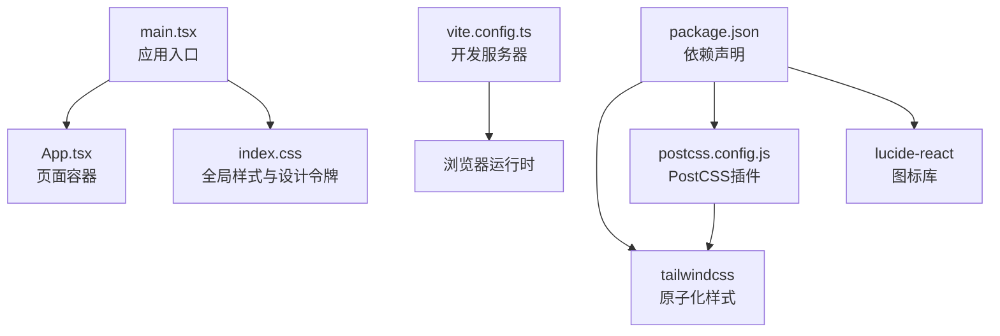
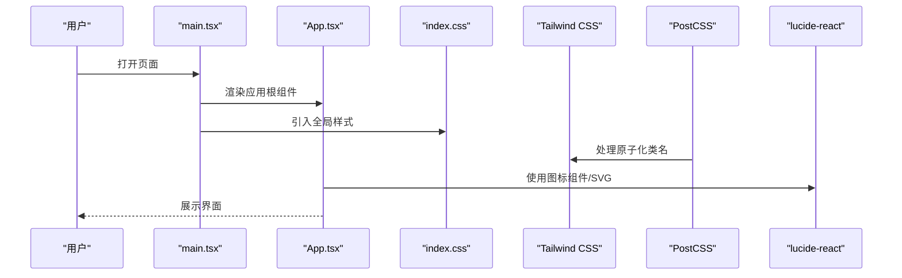
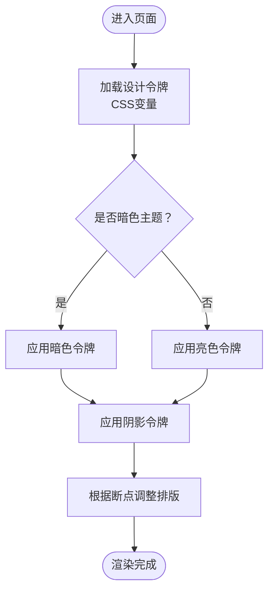
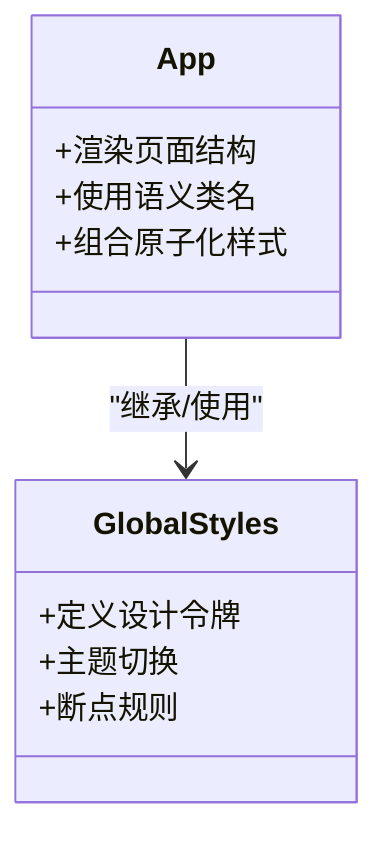
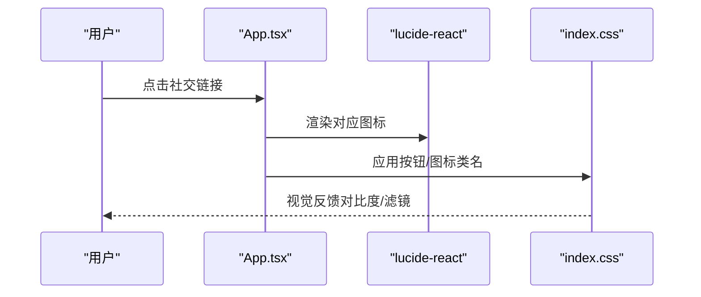
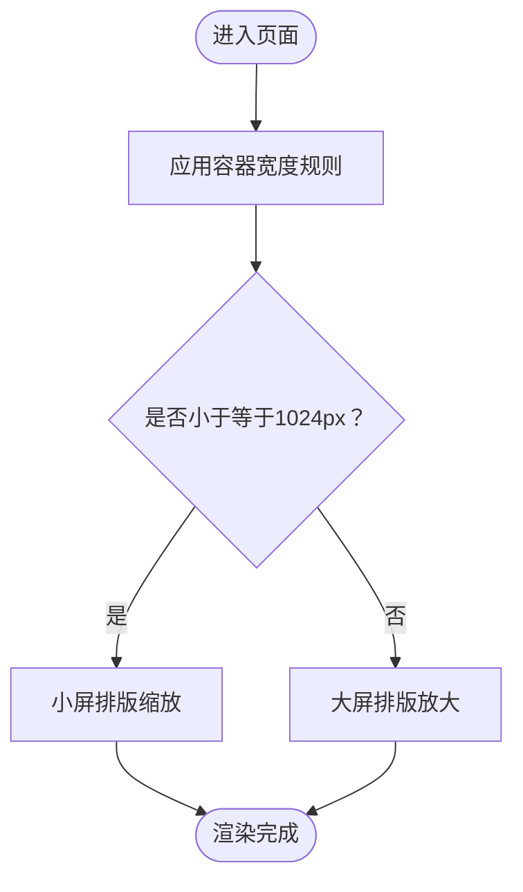
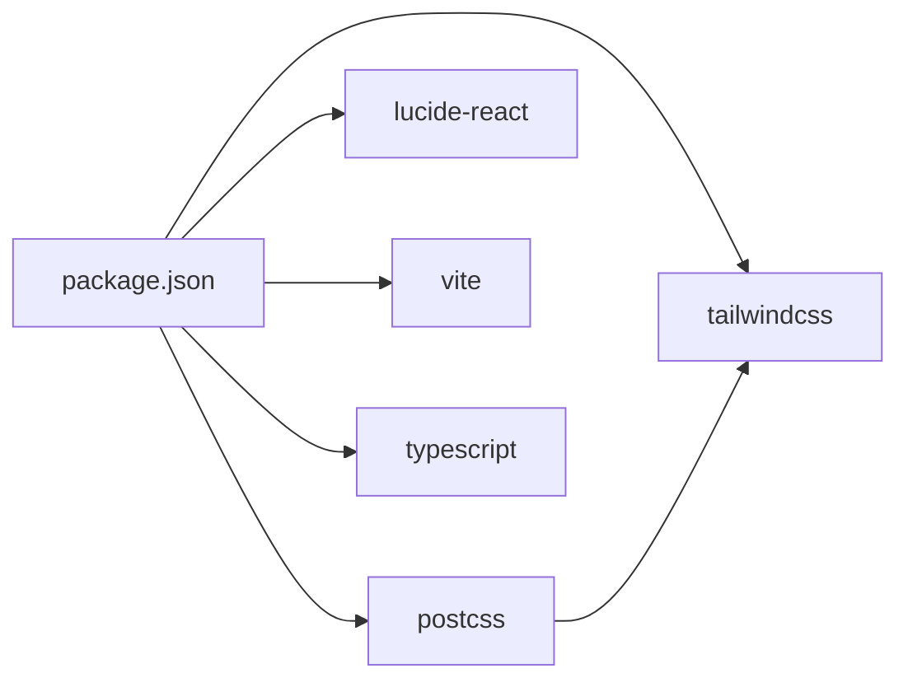

# 设计系统与规范

<cite>
**本文引用的文件**
- [index.css](file://crm-frontend/src/index.css)
- [App.tsx](file://crm-frontend/src/App.tsx)
- [main.tsx](file://crm-frontend/src/main.tsx)
- [package.json](file://crm-frontend/package.json)
- [postcss.config.js](file://crm-frontend/postcss.config.js)
- [vite.config.ts](file://crm-frontend/vite.config.ts)
- [README.md](file://crm-frontend/README.md)
</cite>

## 目录
1. [简介](#简介)
2. [项目结构](#项目结构)
3. [核心组件](#核心组件)
4. [架构总览](#架构总览)
5. [详细组件分析](#详细组件分析)
6. [依赖分析](#依赖分析)
7. [性能考虑](#性能考虑)
8. [故障排除指南](#故障排除指南)
9. [结论](#结论)
10. [附录](#附录)

## 简介
本设计系统与规范文档面向销售AI CRM前端工程，基于现有CSS变量、原子化样式与图标体系，定义统一的设计语言、色彩系统、字体规范、间距标准与响应式策略。文档同时给出Tailwind CSS的使用原则、组件样式继承与主题定制方法，并提供设计令牌（Design Tokens）管理建议与一致性保障方案。

## 项目结构
前端采用 React + TypeScript + Vite 构建，PostCSS 集成 Tailwind CSS 与 autoprefixer。全局样式通过 CSS 变量集中管理，组件层面以原子化类名为主，配合少量语义化类名提升可读性与复用性。

图表来源
- [main.tsx:1-11](file://crm-frontend/src/main.tsx#L1-L11)
- [App.tsx:1-122](file://crm-frontend/src/App.tsx#L1-L122)
- [index.css:1-112](file://crm-frontend/src/index.css#L1-L112)
- [postcss.config.js:1-7](file://crm-frontend/postcss.config.js#L1-L7)
- [vite.config.ts:1-8](file://crm-frontend/vite.config.ts#L1-L8)
- [package.json:1-36](file://crm-frontend/package.json#L1-L36)

章节来源
- [main.tsx:1-11](file://crm-frontend/src/main.tsx#L1-L11)
- [App.tsx:1-122](file://crm-frontend/src/App.tsx#L1-L122)
- [index.css:1-112](file://crm-frontend/src/index.css#L1-L112)
- [postcss.config.js:1-7](file://crm-frontend/postcss.config.js#L1-L7)
- [vite.config.ts:1-8](file://crm-frontend/vite.config.ts#L1-L8)
- [package.json:1-36](file://crm-frontend/package.json#L1-L36)

## 核心组件
- 全局设计令牌：通过 CSS 变量集中定义文本色、背景色、边框色、强调色、阴影与字体族等，支持明暗主题切换。
- 原子化样式：以 Tailwind 类名为主，结合少量语义化类名（如按钮、计数器、标题）提升可维护性。
- 图标系统：使用 lucide-react 提供的 SVG 图标，通过语义化类名控制尺寸与视觉风格。
- 响应式基础：在全局样式中定义断点与排版缩放，确保在不同屏幕宽度下的阅读体验。

章节来源
- [index.css:1-112](file://crm-frontend/src/index.css#L1-L112)
- [App.tsx:1-122](file://crm-frontend/src/App.tsx#L1-L122)
- [package.json:12-17](file://crm-frontend/package.json#L12-L17)

## 架构总览
下图展示从入口到渲染的关键流程，以及样式与图标的集成方式。

图表来源
- [main.tsx:1-11](file://crm-frontend/src/main.tsx#L1-L11)
- [App.tsx:1-122](file://crm-frontend/src/App.tsx#L1-L122)
- [index.css:1-112](file://crm-frontend/src/index.css#L1-L112)
- [postcss.config.js:1-7](file://crm-frontend/postcss.config.js#L1-L7)
- [package.json:12-17](file://crm-frontend/package.json#L12-L17)

## 详细组件分析

### 设计令牌与主题系统
- 令牌类型
  - 色彩：文本色、高亮文本、背景、边框、代码背景、强调色及其透明度版本、社交区域背景。
  - 阴影：投影参数，支持明暗主题差异。
  - 字体：无衬线、标题、等宽字体族，字号与行高、字距设定。
  - 视觉：颜色模式指示、抗锯齿与字体合成优化。
- 主题切换
  - 明/暗两套令牌，通过媒体查询自动切换；暗色主题对特定元素（如社交区图标）进行滤镜增强。
- 断点与排版
  - 在较大屏下提供更大字号与行高，小屏下适度缩小以提升可读性。

图表来源
- [index.css:1-51](file://crm-frontend/src/index.css#L1-L51)

章节来源
- [index.css:1-51](file://crm-frontend/src/index.css#L1-L51)

### 原子化样式与组件继承
- 原子化优先：使用 Tailwind 类名组织布局、间距、颜色与排版，减少自定义样式的重复。
- 语义化补充：为常用结构（如计数器、代码块）定义语义类名，便于跨组件复用。
- 组件继承：在 App.tsx 中通过类名组合实现卡片、列表、按钮等常见布局，避免在单个组件内重复定义样式。

图表来源
- [App.tsx:1-122](file://crm-frontend/src/App.tsx#L1-L122)
- [index.css:1-112](file://crm-frontend/src/index.css#L1-L112)

章节来源
- [App.tsx:1-122](file://crm-frontend/src/App.tsx#L1-L122)
- [index.css:94-112](file://crm-frontend/src/index.css#L94-L112)

### 图标与交互反馈
- 图标来源：通过 lucide-react 的 SVG 组件与雪碧图（/icons.svg）两种方式使用图标。
- 交互反馈：按钮与链接通过类名组合实现悬停、聚焦与禁用态的基础样式；具体状态可通过原子化类名快速叠加。
- 社交区适配：针对暗色主题对社交区图标进行滤镜增强，确保对比度与可识别性。

图表来源
- [App.tsx:56-112](file://crm-frontend/src/App.tsx#L56-L112)
- [index.css:48-50](file://crm-frontend/src/index.css#L48-L50)
- [package.json:14](file://crm-frontend/package.json#L14)

章节来源
- [App.tsx:56-112](file://crm-frontend/src/App.tsx#L56-L112)
- [index.css:48-50](file://crm-frontend/src/index.css#L48-L50)
- [package.json:14](file://crm-frontend/package.json#L14)

### 响应式设计与移动端适配
- 容器宽度：页面主体容器在桌面端限定最大宽度，在移动端自适应铺满。
- 排版缩放：在较大屏提供更大字号与更宽松行高，小屏下缩小字号以提升可读性。
- 边框与阴影：在小屏下保持一致的视觉权重，避免因容器收缩导致的视觉失衡。

图表来源
- [index.css:53-93](file://crm-frontend/src/index.css#L53-L93)

章节来源
- [index.css:53-93](file://crm-frontend/src/index.css#L53-L93)

### 动画时序与交互反馈标准
- 当前实现：未发现显式的动画或过渡类名；交互反馈主要通过类名组合与主题切换实现。
- 建议：在需要的状态切换（如按钮激活、模态弹出）引入过渡类名，统一时长与缓动曲线，确保跨组件一致性。

章节来源
- [index.css:1-112](file://crm-frontend/src/index.css#L1-L112)
- [App.tsx:1-122](file://crm-frontend/src/App.tsx#L1-L122)

## 依赖分析
- 核心依赖
  - Tailwind CSS：提供原子化类名与响应式工具。
  - PostCSS：与 Tailwind CSS 协同处理类名转换与浏览器兼容。
  - lucide-react：提供高质量图标资源，支持按需引入。
- 开发依赖
  - Vite：快速开发与构建工具。
  - TypeScript：类型安全与开发体验。
  - ESLint：代码质量与风格约束。

图表来源
- [package.json:12-34](file://crm-frontend/package.json#L12-L34)

章节来源
- [package.json:12-34](file://crm-frontend/package.json#L12-L34)

## 性能考虑
- 原子化样式体积：Tailwind 默认包含全量类名，建议在生产环境启用摇树优化与按需生成，避免冗余样式。
- 图标加载：优先使用 SVG 组件而非雪碧图，减少HTTP请求与解析成本。
- 主题切换：CSS 变量切换比重绘更轻量，保持主题切换的流畅性。

## 故障排除指南
- 样式不生效
  - 检查是否正确引入全局样式文件。
  - 确认 PostCSS 插件已启用 Tailwind CSS。
- 图标显示异常
  - 确认图标路径与雪碧图可用。
  - 检查暗色主题下的滤镜设置是否影响预期效果。
- 响应式问题
  - 确认断点规则与容器宽度设置符合预期。
  - 检查媒体查询顺序与优先级。

章节来源
- [postcss.config.js:1-7](file://crm-frontend/postcss.config.js#L1-L7)
- [index.css:28-31](file://crm-frontend/src/index.css#L28-L31)
- [index.css:48-50](file://crm-frontend/src/index.css#L48-L50)

## 结论
本设计系统以 CSS 变量为核心，结合 Tailwind 原子化类名与 lucide-react 图标，形成统一的设计语言与主题体系。通过明确的断点与排版策略，确保在多设备上的良好体验。建议后续完善动画与过渡规范，并在生产环境优化样式体积与加载性能。

## 附录
- 设计令牌清单（基于当前实现）
  - 文本色、高亮文本、背景、边框、代码背景、强调色及透明度版本、社交区背景、阴影参数、字体族、字号与行高、字距、颜色模式指示。
- 使用建议
  - 统一通过 CSS 变量引用令牌，避免硬编码值。
  - 在组件层仅使用语义类名与原子化类名组合，减少重复定义。
  - 对于复杂交互，引入统一的过渡与动画类名，确保一致性。

章节来源
- [index.css:1-112](file://crm-frontend/src/index.css#L1-L112)
- [App.tsx:1-122](file://crm-frontend/src/App.tsx#L1-L122)
- [README.md:1-74](file://crm-frontend/README.md#L1-L74)