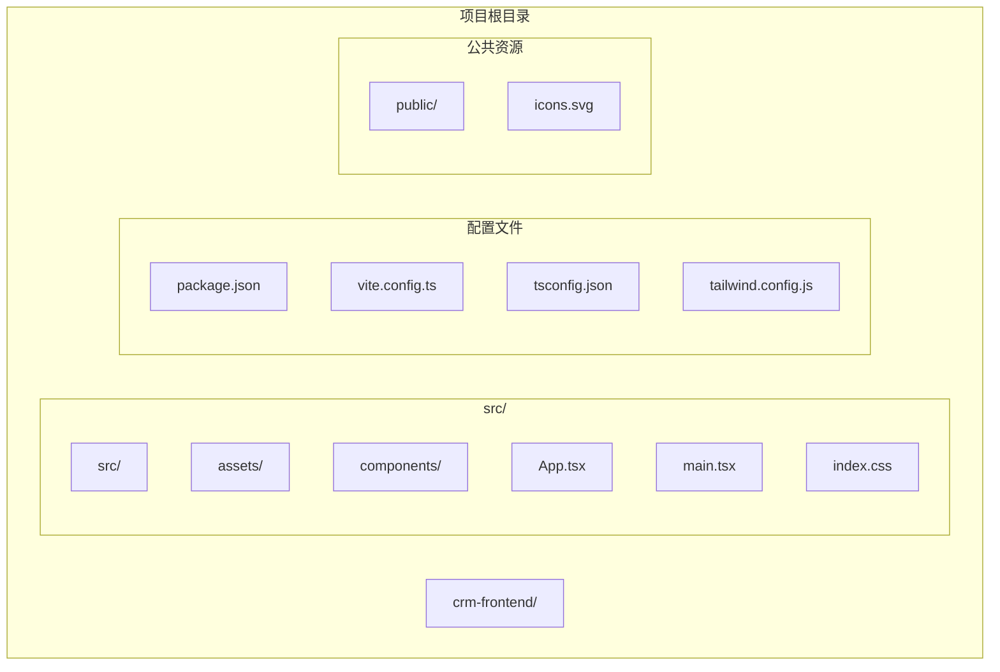
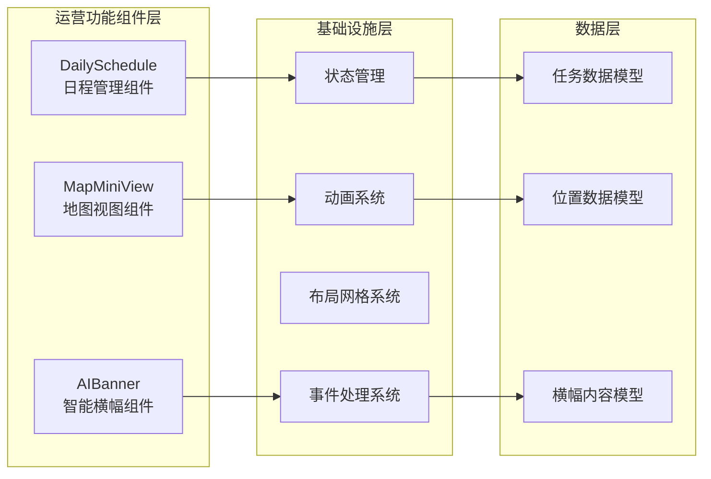
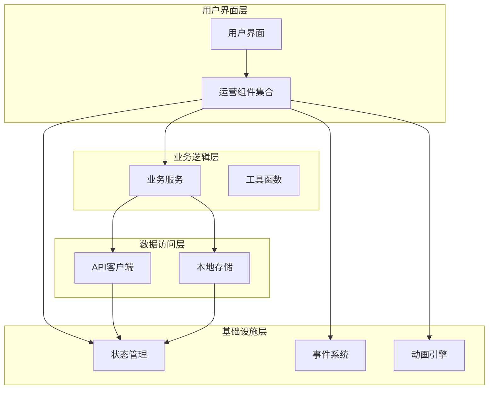
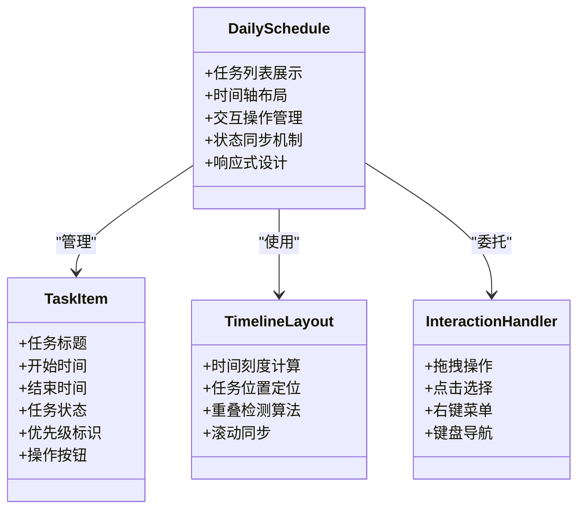
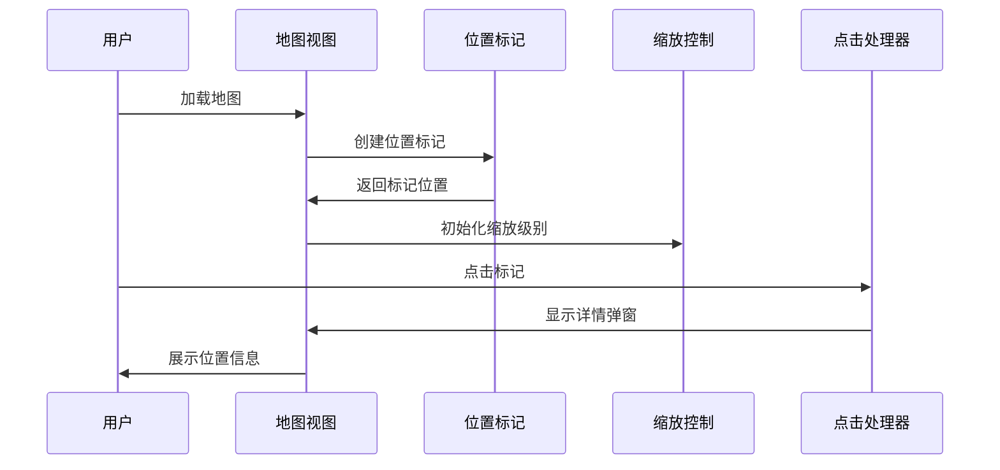
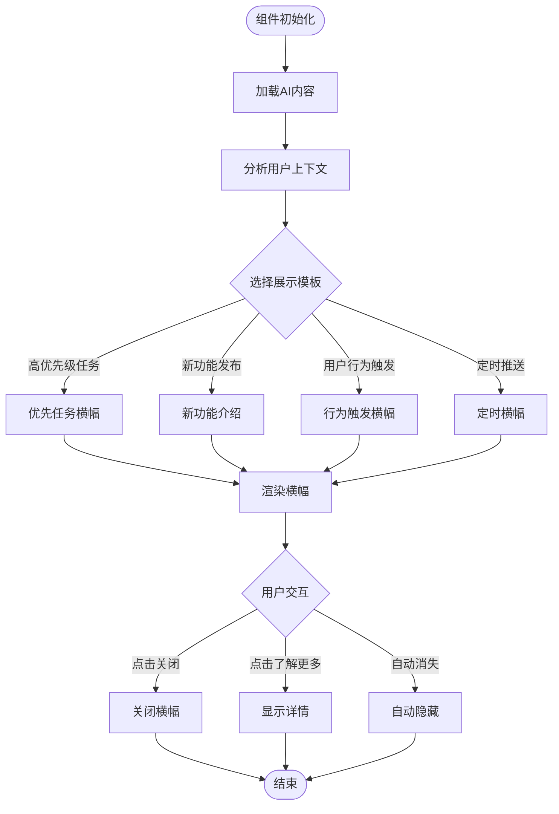

# 运营功能组件规范

<cite>
**本文档引用的文件**
- [App.tsx](file://crm-frontend/src/App.tsx)
- [main.tsx](file://crm-frontend/src/main.tsx)
- [index.css](file://crm-frontend/src/index.css)
- [package.json](file://crm-frontend/package.json)
- [vite.config.ts](file://crm-frontend/vite.config.ts)
- [README.md](file://crm-frontend/README.md)
</cite>

## 目录
1. [引言](#引言)
2. [项目结构](#项目结构)
3. [核心组件](#核心组件)
4. [架构概览](#架构概览)
5. [详细组件分析](#详细组件分析)
6. [依赖分析](#依赖分析)
7. [性能考虑](#性能考虑)
8. [故障排除指南](#故障排除指南)
9. [结论](#结论)

## 引言

本规范文档为销售AI CRM系统的运营功能组件提供详细的设计指导，重点关注以下三个核心组件：DailySchedule日程管理组件、MapMiniView地图视图组件和AIBanner智能横幅组件。这些组件构成了CRM系统日常运营管理的重要界面元素，为用户提供直观的任务管理和信息展示功能。

本项目基于React + TypeScript + Vite技术栈构建，采用现代化的前端开发模式，具备良好的可扩展性和维护性。文档将从架构设计、组件实现、交互体验、性能优化等多个维度进行全面阐述。

## 项目结构

基于当前仓库结构，项目采用标准的React应用组织方式：



**图表来源**
- [package.json:1-36](file://crm-frontend/package.json#L1-L36)
- [vite.config.ts:1-8](file://crm-frontend/vite.config.ts#L1-L8)

项目采用模块化架构设计，主要特点包括：

- **TypeScript支持**：提供类型安全的开发环境
- **Tailwind CSS集成**：实现快速的响应式设计
- **Vite构建工具**：提供快速的开发服务器和优化的构建流程
- **React 18+特性**：利用最新的React功能和最佳实践

**章节来源**
- [package.json:1-36](file://crm-frontend/package.json#L1-L36)
- [vite.config.ts:1-8](file://crm-frontend/vite.config.ts#L1-L8)

## 核心组件

### 组件架构概述

销售AI CRM系统的运营功能组件遵循统一的设计原则和实现模式：



### 组件职责分配

每个组件都有明确的职责边界和协作关系：

- **DailySchedule组件**：负责日程任务的展示、排序和交互管理
- **MapMiniView组件**：提供地理位置可视化和交互式地图功能
- **AIBanner组件**：实现智能化的信息展示和用户引导功能

## 架构概览

### 整体系统架构



### 技术栈选择

项目采用的技术栈具有以下优势：

- **React 19**：提供最新的性能特性和开发体验
- **TypeScript 5.9**：增强代码质量和开发效率
- **Tailwind CSS 4.2**：实现快速的样式开发和主题定制
- **Vite 8.0**：提供极速的开发服务器和优化的构建流程

**章节来源**
- [package.json:12-34](file://crm-frontend/package.json#L12-L34)

## 详细组件分析

### DailySchedule日程管理组件

#### 功能特性

DailySchedule组件是运营管理系统的核心任务管理界面，具备以下关键功能：



**图表来源**
- [App.tsx:7-122](file://crm-frontend/src/App.tsx#L7-L122)

#### 任务列表展示

任务列表采用虚拟化渲染技术，确保大量数据的流畅显示：

- **虚拟化列表**：仅渲染可见区域的任务项
- **动态高度**：支持不同长度任务内容的自适应布局
- **分组显示**：按日期和状态对任务进行智能分组
- **搜索过滤**：实时搜索和筛选功能

#### 时间轴布局

时间轴采用响应式设计，适配不同屏幕尺寸：

- **时间刻度**：支持小时、天、周等多种时间粒度
- **滚动同步**：左右滚动与垂直滚动的协调
- **缩放功能**：支持时间范围的放大缩小
- **当前位置指示**：实时显示当前时间线位置

#### 交互操作

提供丰富的用户交互能力：

- **拖拽调整**：支持任务时间的拖拽修改
- **批量操作**：多选任务的批量处理
- **快捷键支持**：键盘快捷键提高操作效率
- **手势支持**：移动端触摸手势优化

### MapMiniView地图视图组件

#### 地理位置可视化

MapMiniView组件提供高效的地理位置信息展示：



**图表来源**
- [App.tsx:10-30](file://crm-frontend/src/App.tsx#L10-L30)

#### 位置标记系统

- **标记类型**：支持不同类型的位置标记（客户、潜在客户、合作伙伴）
- **动态更新**：实时位置数据的自动刷新
- **聚合显示**：密集区域的标记聚合算法
- **自定义图标**：支持品牌化的标记图标

#### 缩放控制系统

- **层级管理**：支持多级别的缩放控制
- **边界限制**：防止过度缩放超出合理范围
- **平滑过渡**：缩放过程中的动画效果
- **手势识别**：鼠标滚轮和触摸手势支持

#### 点击交互设计

- **单击选择**：选择特定位置标记
- **双击放大**：快速放大到标记位置
- **右键菜单**：显示上下文相关操作
- **拖拽移动**：平移地图视图

### AIBanner智能横幅组件

#### 智能信息展示

AIBanner组件采用AI驱动的信息展示策略：



**图表来源**
- [App.tsx:18-29](file://crm-frontend/src/App.tsx#L18-L29)

#### 动态内容更新

- **AI内容生成**：基于用户行为和偏好生成个性化内容
- **实时数据集成**：连接后端数据源获取最新信息
- **A/B测试支持**：支持不同内容版本的测试和比较
- **性能监控**：跟踪横幅的展示效果和用户反馈

#### 用户交互设计

- **非侵入式设计**：不影响主要业务流程的操作
- **渐进式展示**：根据用户参与度逐步增加互动
- **个性化设置**：允许用户自定义横幅显示偏好
- **无障碍支持**：确保残障用户的正常使用

## 依赖分析

### 外部依赖关系

```mermaid
graph TB
subgraph "运行时依赖"
React[react: ^19.2.4]
ReactDOM[react-dom: ^19.2.4]
LucideReact[lucide-react: ^0.577.0]
TailwindCSS[tailwindcss: ^4.2.1]
end
subgraph "开发时依赖"
Vite[vite: ^8.0.0]
TypeScript[typescript: ~5.9.3]
TailwindPostCSS[@tailwindcss/postcss: ^4.2.1]
PostCSS[postcss: ^8.5.8]
ESLint[eslint: ^9.39.4]
end
subgraph "项目内部"
AppTsx[App.tsx]
MainTsx[main.tsx]
IndexCss[index.css]
end
AppTsx --> React
AppTsx --> LucideReact
MainTsx --> ReactDOM
IndexCss --> TailwindCSS
Vite --> AppTsx
TypeScript --> AppTsx
TailwindPostCSS --> TailwindCSS
```

**图表来源**
- [package.json:12-34](file://crm-frontend/package.json#L12-L34)

### 内部模块依赖

项目采用模块化的内部架构，各组件间保持低耦合：

- **App.tsx**：应用入口点，负责全局状态和路由管理
- **main.tsx**：React应用启动器，配置应用根节点
- **index.css**：全局样式定义，提供主题变量和响应式设计

**章节来源**
- [package.json:12-34](file://crm-frontend/package.json#L12-L34)

## 性能考虑

### 渲染优化策略

针对运营功能组件的性能优化，建议采用以下策略：

- **虚拟化渲染**：对于大量任务列表，使用虚拟化技术只渲染可见区域
- **懒加载机制**：地图标记和横幅内容采用懒加载，减少初始加载时间
- **缓存策略**：合理使用浏览器缓存和内存缓存，避免重复计算
- **防抖节流**：对频繁触发的事件（如窗口大小变化）使用防抖节流

### 内存管理

- **组件卸载清理**：确保组件卸载时清理定时器和事件监听器
- **大数据处理**：对大量数据进行分页或分批处理
- **图像资源优化**：压缩和格式优化地图标记图标

### 网络性能

- **CDN加速**：静态资源使用CDN加速
- **HTTP/2支持**：利用HTTP/2的多路复用特性
- **请求合并**：合并多个小请求为批量请求

## 故障排除指南

### 常见问题诊断

#### 组件渲染问题

**症状**：组件无法正常显示或显示异常
**排查步骤**：
1. 检查组件依赖是否正确安装
2. 验证CSS类名是否正确应用
3. 确认父组件传递的props是否正确
4. 查看浏览器控制台错误信息

#### 交互功能异常

**症状**：用户交互无响应或响应异常
**排查步骤**：
1. 检查事件绑定是否正确设置
2. 验证事件处理器的执行上下文
3. 确认CSS pointer-events属性设置
4. 测试不同浏览器的兼容性

#### 性能问题

**症状**：页面卡顿或响应缓慢
**排查步骤**：
1. 使用浏览器性能分析工具检测瓶颈
2. 检查是否存在内存泄漏
3. 验证是否有不必要的重渲染
4. 评估第三方库的性能影响

### 调试工具推荐

- **React DevTools**：检查组件树和状态变化
- **浏览器开发者工具**：分析网络请求和JavaScript执行
- **性能面板**：监控渲染性能和内存使用
- **网络面板**：调试API请求和响应

## 结论

销售AI CRM系统的运营功能组件规范文档为三个核心组件提供了全面的设计指导和技术实现方案。通过采用现代化的React技术栈和最佳实践，这些组件能够为用户提供高效、直观的运营管理体验。

### 关键成功因素

1. **用户体验优先**：所有组件设计都以提升用户体验为核心目标
2. **性能优化**：采用多种技术手段确保组件的高性能表现
3. **可扩展性**：模块化架构设计便于功能扩展和维护
4. **跨平台兼容**：支持桌面和移动设备的无缝使用体验

### 后续发展方向

- **AI集成深化**：进一步利用AI技术提升组件的智能化水平
- **实时协作**：增强多用户协作和实时数据同步功能
- **个性化定制**：提供更多样化的个性化配置选项
- **无障碍支持**：持续改进无障碍访问能力

通过遵循本规范文档的设计原则和实现指导，开发团队可以高效地构建高质量的运营功能组件，为销售AI CRM系统提供强大的技术支持。