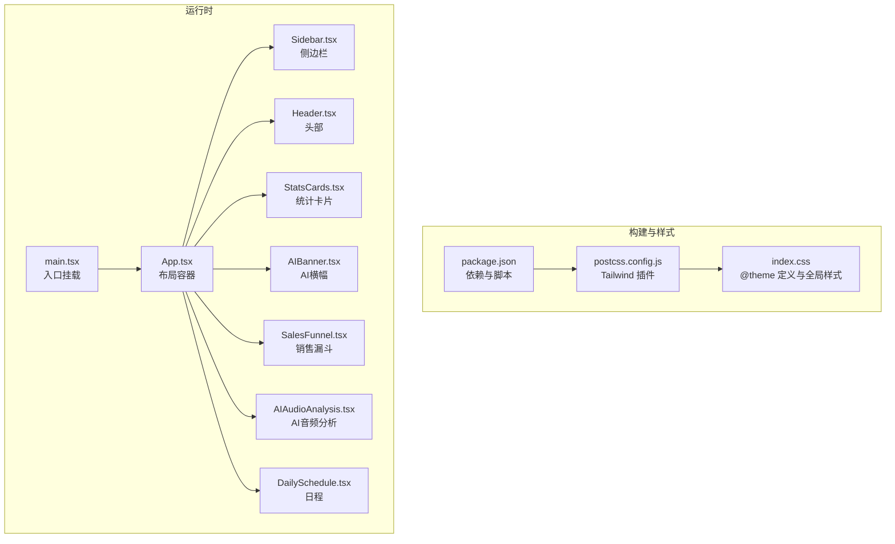
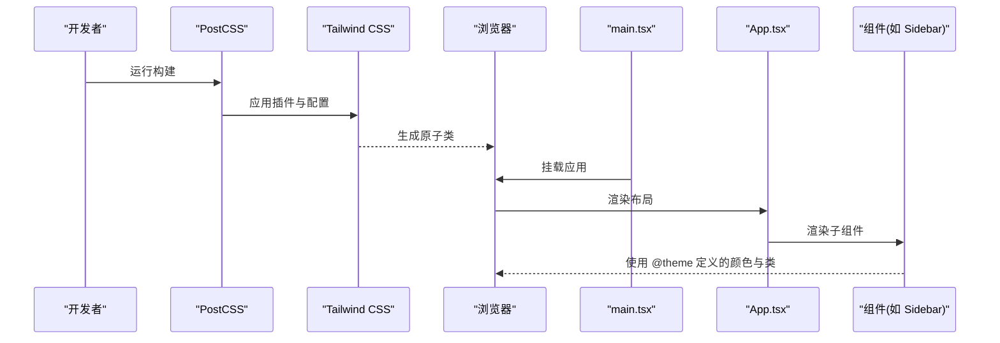
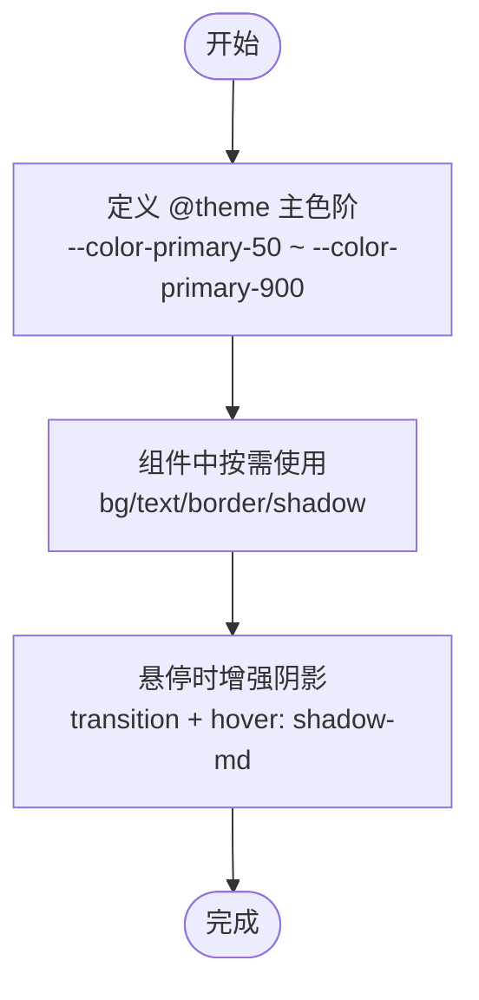
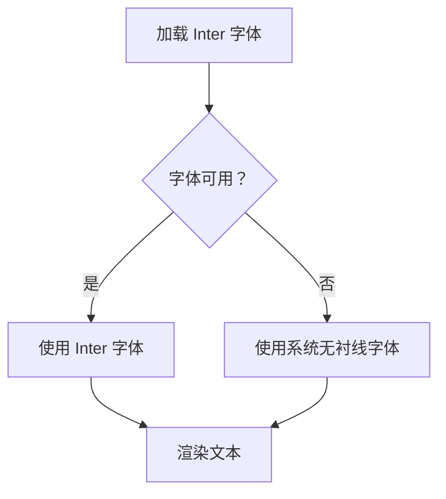
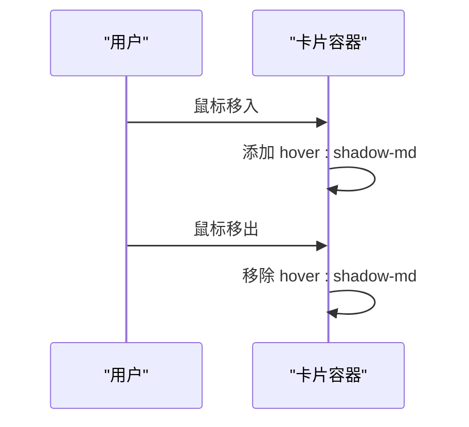
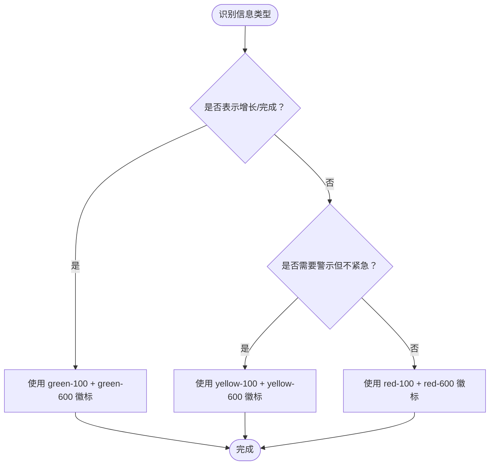
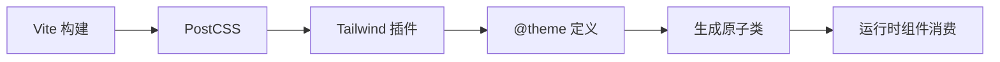

# 设计系统

<cite>
**本文引用的文件**
- [index.css](file://crm-frontend/src/index.css)
- [postcss.config.js](file://crm-frontend/postcss.config.js)
- [package.json](file://crm-frontend/package.json)
- [main.tsx](file://crm-frontend/src/main.tsx)
- [App.tsx](file://crm-frontend/src/App.tsx)
- [Sidebar.tsx](file://crm-frontend/src/components/Sidebar.tsx)
- [Header.tsx](file://crm-frontend/src/components/Header.tsx)
- [StatsCards.tsx](file://crm-frontend/src/components/StatsCards.tsx)
- [AIBanner.tsx](file://crm-frontend/src/components/AIBanner.tsx)
- [SalesFunnel.tsx](file://crm-frontend/src/components/SalesFunnel.tsx)
- [AIAudioAnalysis.tsx](file://crm-frontend/src/components/AIAudioAnalysis.tsx)
- [DailySchedule.tsx](file://crm-frontend/src/components/DailySchedule.tsx)
</cite>

## 目录
1. [简介](#简介)
2. [项目结构](#项目结构)
3. [核心组件](#核心组件)
4. [架构总览](#架构总览)
5. [详细组件分析](#详细组件分析)
6. [依赖分析](#依赖分析)
7. [性能考虑](#性能考虑)
8. [故障排查指南](#故障排查指南)
9. [结论](#结论)
10. [附录](#附录)

## 简介
本设计系统文档面向销售AI CRM前端工程，聚焦于基于 Tailwind CSS 的设计系统落地实践，涵盖颜色体系（主色、侧边栏、卡片、文本等）、字体系统（Inter 与系统回退）、阴影系统（卡片阴影与悬停阴影）、语义化颜色（success/warning/danger）的使用场景、以及设计令牌的命名规范与使用原则。本文通过源码级分析，帮助开发者在保持一致性的同时提升开发效率与可维护性。

## 项目结构
前端采用 Vite + React + Tailwind CSS 4.x 构建，PostCSS 配置启用 Tailwind 插件，全局样式通过 @theme 定义设计令牌，并在各组件中以原子类形式消费。应用入口引入全局样式后挂载根组件，页面布局由 App 组合多个业务组件构成。

**图表来源**
- [package.json:1-36](file://crm-frontend/package.json#L1-L36)
- [postcss.config.js:1-6](file://crm-frontend/postcss.config.js#L1-L6)
- [index.css:1-66](file://crm-frontend/src/index.css#L1-L66)
- [main.tsx:1-11](file://crm-frontend/src/main.tsx#L1-L11)
- [App.tsx:1-58](file://crm-frontend/src/App.tsx#L1-L58)

**章节来源**
- [package.json:1-36](file://crm-frontend/package.json#L1-L36)
- [postcss.config.js:1-6](file://crm-frontend/postcss.config.js#L1-L6)
- [index.css:1-66](file://crm-frontend/src/index.css#L1-L66)
- [main.tsx:1-11](file://crm-frontend/src/main.tsx#L1-L11)
- [App.tsx:1-58](file://crm-frontend/src/App.tsx#L1-L58)

## 核心组件
- 颜色体系：通过 @theme 定义 primary 主色阶（50–900），并在组件中广泛用于背景、文本、边框、阴影等视觉元素。
- 字体系统：默认使用 Inter，回退到系统无衬线字体，确保跨平台一致体验。
- 阴影系统：卡片统一使用轻量阴影，交互悬停时增强阴影层级，提升反馈感。
- 语义化颜色：success/warning/danger 使用品牌色阶或语义专用色阶，配合徽标与图标实现信息传达。
- 设计令牌：以 --color-* 命名，遵循“主色阶 + 变体”的组织方式，便于主题扩展与维护。

**章节来源**
- [index.css:3-15](file://crm-frontend/src/index.css#L3-L15)
- [index.css:30-34](file://crm-frontend/src/index.css#L30-L34)
- [Sidebar.tsx:53-81](file://crm-frontend/src/components/Sidebar.tsx#L53-L81)
- [StatsCards.tsx:19-32](file://crm-frontend/src/components/StatsCards.tsx#L19-L32)
- [AIAudioAnalysis.tsx:20-35](file://crm-frontend/src/components/AIAudioAnalysis.tsx#L20-L35)

## 架构总览
下图展示从构建配置到运行时组件如何消费设计令牌与样式类：

**图表来源**
- [postcss.config.js:1-6](file://crm-frontend/postcss.config.js#L1-L6)
- [package.json:12-17](file://crm-frontend/package.json#L12-L17)
- [main.tsx:1-11](file://crm-frontend/src/main.tsx#L1-L11)
- [App.tsx:10-55](file://crm-frontend/src/App.tsx#L10-L55)
- [Sidebar.tsx:37-85](file://crm-frontend/src/components/Sidebar.tsx#L37-L85)

## 详细组件分析

### 颜色体系与设计令牌
- 主色阶（primary）：通过 @theme 定义 50–900 多级色阶，组件中以 bg-primary-500、text-primary-600、border-primary-200 等形式使用，形成统一的品牌视觉。
- 侧边栏：Logo 区域使用 primary-500 背景与白色文字；导航项激活态使用 primary-500，未激活使用 hover 的灰阶背景，体现层级与状态。
- 卡片：通用卡片容器使用 white 背景、gray-200 边框与轻量阴影，hover 时增强阴影，提升交互反馈。
- 文本：正文使用 gray-900，辅助信息使用 gray-500/600，强调信息使用 primary-600 或语义色。
- 语义化颜色：success 使用 green-100/green-600，warning 使用 yellow-100/yellow-600，danger 使用 red-100/red-600，配合徽标与图标传达状态。

**图表来源**
- [index.css:3-15](file://crm-frontend/src/index.css#L3-L15)
- [Sidebar.tsx:24-35](file://crm-frontend/src/components/Sidebar.tsx#L24-L35)
- [StatsCards.tsx:19-32](file://crm-frontend/src/components/StatsCards.tsx#L19-L32)
- [AIAudioAnalysis.tsx:11-15](file://crm-frontend/src/components/AIAudioAnalysis.tsx#L11-L15)

**章节来源**
- [index.css:3-15](file://crm-frontend/src/index.css#L3-L15)
- [Sidebar.tsx:24-35](file://crm-frontend/src/components/Sidebar.tsx#L24-L35)
- [StatsCards.tsx:19-32](file://crm-frontend/src/components/StatsCards.tsx#L19-L32)
- [AIAudioAnalysis.tsx:11-15](file://crm-frontend/src/components/AIAudioAnalysis.tsx#L11-L15)

### 字体系统与回退机制
- 字体：默认使用 Inter，权重覆盖 400/500/600/700，满足正文、标题与强调文本需求。
- 回退：当网络异常或字体加载失败时，自动回退至系统无衬线字体，保证可读性与稳定性。
- 平滑渲染：开启 WebKit 与 Firefox 的字体平滑渲染，提升阅读体验。

**图表来源**
- [index.css:17-17](file://crm-frontend/src/index.css#L17-L17)
- [index.css:30-34](file://crm-frontend/src/index.css#L30-L34)

**章节来源**
- [index.css:17-17](file://crm-frontend/src/index.css#L17-L17)
- [index.css:30-34](file://crm-frontend/src/index.css#L30-L34)

### 阴影系统与交互反馈
- 卡片阴影：统一使用轻量阴影，营造悬浮感与层次感。
- 悬停阴影：hover 时过渡到更强的阴影，提供即时反馈。
- 阴影强度：通过 hover:shadow-md 实现，避免过度阴影影响可读性。

**图表来源**
- [StatsCards.tsx:20-20](file://crm-frontend/src/components/StatsCards.tsx#L20-L20)
- [AIAudioAnalysis.tsx:20-20](file://crm-frontend/src/components/AIAudioAnalysis.tsx#L20-L20)

**章节来源**
- [StatsCards.tsx:20-20](file://crm-frontend/src/components/StatsCards.tsx#L20-L20)
- [AIAudioAnalysis.tsx:20-20](file://crm-frontend/src/components/AIAudioAnalysis.tsx#L20-L20)

### 语义化颜色使用指南
- success（成功）：用于增长趋势、完成状态、积极结果。示例：徽标使用 green-100 文本 green-600，图标与进度条使用 emerald-500/violet-500 等。
- warning（警告）：用于待处理、需关注但非紧急的状态。示例：徽标使用 yellow-100 文本 yellow-600。
- danger（危险/错误）：用于风险、失败、紧急事项。示例：徽标使用 red-100 文本 red-600，常用于“今日拜访”等紧急提醒。

**图表来源**
- [StatsCards.tsx:13-17](file://crm-frontend/src/components/StatsCards.tsx#L13-L17)
- [AIAudioAnalysis.tsx:11-15](file://crm-frontend/src/components/AIAudioAnalysis.tsx#L11-L15)

**章节来源**
- [StatsCards.tsx:13-17](file://crm-frontend/src/components/StatsCards.tsx#L13-L17)
- [AIAudioAnalysis.tsx:11-15](file://crm-frontend/src/components/AIAudioAnalysis.tsx#L11-L15)

### 设计令牌命名规范与使用原则
- 命名规范：以 --color-primary-* 作为主色阶前缀，按明度/饱和度分级（如 50/100/200…/900），语义色使用 --color-* 专用命名（如 --color-success-*）。
- 使用原则：
  - 优先使用 @theme 定义的令牌，避免硬编码十六进制值。
  - 在组件中通过原子类组合使用，如 bg-primary-500、text-primary-600、border-primary-200。
  - 语义化颜色仅用于传达状态，不用于装饰性用途。
  - 阴影与交互保持一致的过渡时长与强度，确保动效一致性。

**章节来源**
- [index.css:3-15](file://crm-frontend/src/index.css#L3-L15)
- [Sidebar.tsx:24-35](file://crm-frontend/src/components/Sidebar.tsx#L24-L35)
- [StatsCards.tsx:19-32](file://crm-frontend/src/components/StatsCards.tsx#L19-L32)

## 依赖分析
- 构建链路：Vite 调用 PostCSS，PostCSS 加载 Tailwind 插件，Tailwind 依据 @theme 生成原子类。
- 运行时：main.tsx 引入 index.css 后挂载 App，App 组合多个业务组件，组件内直接使用 Tailwind 原子类与 @theme 令牌。

**图表来源**
- [postcss.config.js:1-6](file://crm-frontend/postcss.config.js#L1-L6)
- [package.json:12-17](file://crm-frontend/package.json#L12-L17)
- [index.css:1-1](file://crm-frontend/src/index.css#L1-L1)

**章节来源**
- [postcss.config.js:1-6](file://crm-frontend/postcss.config.js#L1-L6)
- [package.json:12-17](file://crm-frontend/package.json#L12-L17)
- [index.css:1-1](file://crm-frontend/src/index.css#L1-L1)

## 性能考虑
- 原子类体积控制：仅引入所需类，避免无谓的样式膨胀。
- 字体加载优化：Inter 通过外部链接加载，建议在生产环境配置 CDN 与缓存策略，减少阻塞。
- 动画性能：阴影过渡使用 CSS 属性而非复杂滤镜，确保硬件加速友好。
- 组件复用：通过统一的卡片、徽标、按钮样式，减少重复定义，提升构建与运行效率。

## 故障排查指南
- 颜色不生效
  - 检查 @theme 是否正确编译输出，确认类名拼写与令牌名称一致。
  - 确认组件中未被更高优先级样式覆盖。
- 字体显示异常
  - 检查网络是否可访问 Google Fonts，确认回退链路正常。
  - 确认浏览器字体平滑渲染设置未被禁用。
- 阴影不出现
  - 检查 hover:shadow-md 是否与其他类冲突。
  - 确认未被全局 reset 或第三方样式覆盖。
- 构建报错
  - 确认 Tailwind 与 PostCSS 插件版本兼容。
  - 检查 postcss.config.js 中插件配置是否正确。

**章节来源**
- [index.css:1-1](file://crm-frontend/src/index.css#L1-L1)
- [postcss.config.js:1-6](file://crm-frontend/postcss.config.js#L1-L6)
- [package.json:12-17](file://crm-frontend/package.json#L12-L17)

## 结论
本设计系统以 @theme 为核心，结合 Tailwind 原子类与语义化颜色，实现了主色阶、字体、阴影与交互反馈的一致性。通过明确的命名规范与使用原则，开发者可在保证视觉统一的前提下快速迭代功能模块。建议后续在设计令牌层面补充语义色阶（如 --color-success-*），并完善暗色模式下的令牌映射，以支持更丰富的主题场景。

## 附录
- 关键文件路径参考
  - 全局样式与令牌：[index.css](file://crm-frontend/src/index.css)
  - 构建配置：[postcss.config.js](file://crm-frontend/postcss.config.js)
  - 依赖与脚本：[package.json](file://crm-frontend/package.json)
  - 入口挂载：[main.tsx](file://crm-frontend/src/main.tsx)
  - 布局容器：[App.tsx](file://crm-frontend/src/App.tsx)
  - 侧边栏组件：[Sidebar.tsx](file://crm-frontend/src/components/Sidebar.tsx)
  - 头部组件：[Header.tsx](file://crm-frontend/src/components/Header.tsx)
  - 统计卡片组件：[StatsCards.tsx](file://crm-frontend/src/components/StatsCards.tsx)
  - AI横幅组件：[AIBanner.tsx](file://crm-frontend/src/components/AIBanner.tsx)
  - 销售漏斗组件：[SalesFunnel.tsx](file://crm-frontend/src/components/SalesFunnel.tsx)
  - AI音频分析组件：[AIAudioAnalysis.tsx](file://crm-frontend/src/components/AIAudioAnalysis.tsx)
  - 日程组件：[DailySchedule.tsx](file://crm-frontend/src/components/DailySchedule.tsx)