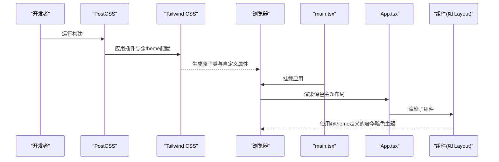
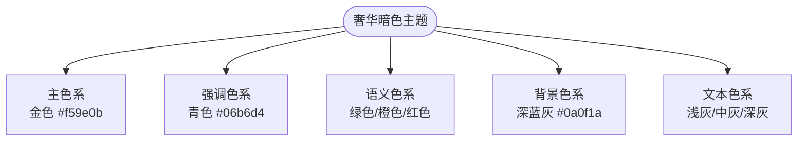
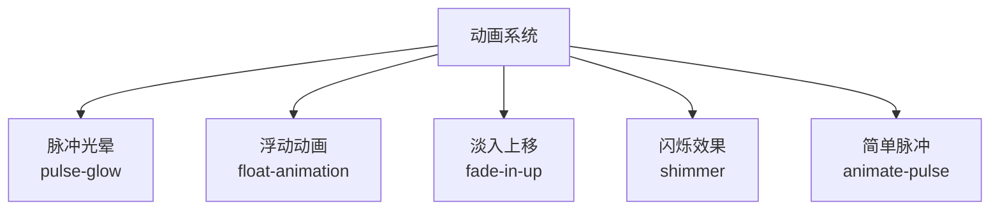
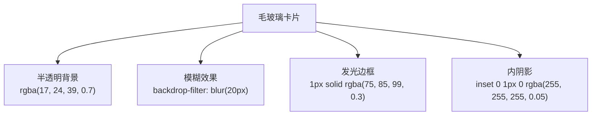
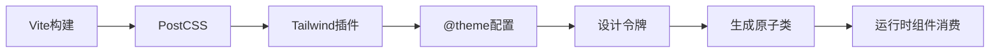

# 设计系统

<cite>
**本文引用的文件**
- [index.css](file://crm-frontend/src/index.css)
- [postcss.config.js](file://crm-frontend/postcss.config.js)
- [package.json](file://crm-frontend/package.json)
- [main.tsx](file://crm-frontend/src/main.tsx)
- [App.tsx](file://crm-frontend/src/App.tsx)
- [Layout.tsx](file://crm-frontend/src/components/layout/Layout.tsx)
- [Sidebar.tsx](file://crm-frontend/src/components/layout/Sidebar.tsx)
- [Header.tsx](file://crm-frontend/src/components/layout/Header.tsx)
- [ChurnAlertCard.tsx](file://crm-frontend/src/components/AI/ChurnAlertCard.tsx)
- [CustomerInsightPanel.tsx](file://crm-frontend/src/components/AI/CustomerInsightPanel.tsx)
- [OpportunityScoreCard.tsx](file://crm-frontend/src/components/AI/OpportunityScoreCard.tsx)
- [StatsOverview.tsx](file://crm-frontend/src/pages/AIAudio/components/StatsOverview.tsx)
- [DingTalkStatusCard.tsx](file://crm-frontend/src/pages/AIAudio/components/DingTalkStatusCard.tsx)
- [RecordingList.tsx](file://crm-frontend/src/pages/AIAudio/components/RecordingList.tsx)
- [AIAnalysisPanel.tsx](file://crm-frontend/src/pages/AIAudio/components/AIAnalysisPanel.tsx)
- [AudioPlayer.tsx](file://crm-frontend/src/pages/AIAudio/components/AudioPlayer.tsx)
</cite>

## 更新摘要
**所做更改**
- 新增深色主题完整实现章节，包含奢华暗色主题配色方案
- 新增动画系统章节，涵盖脉冲光晕、浮动、淡入等多种动画效果
- 新增玻璃效果章节，详细说明毛玻璃卡片和边框发光效果
- 新增渐变色彩章节，介绍渐变文本和按钮设计
- 更新颜色体系为完整的奢华暗色主题，包含主色、强调色、语义色
- 新增Ambient Glow环境光效和Luxury Background背景渐变
- 扩展设计令牌命名规范，增加动画、渐变、玻璃等新类别

## 目录
1. [简介](#简介)
2. [项目结构](#项目结构)
3. [核心组件](#核心组件)
4. [架构总览](#架构总览)
5. [详细组件分析](#详细组件分析)
6. [依赖分析](#依赖分析)
7. [性能考虑](#性能考虑)
8. [故障排查指南](#故障排查指南)
9. [结论](#结论)
10. [附录](#附录)

## 简介
本设计系统文档面向销售AI CRM前端工程，基于Tailwind CSS 4.x构建了完整的视觉设计规范。系统采用奢华暗色主题设计语言，包含深色主题实现、动画系统、玻璃效果、渐变色彩等现代设计元素。文档详细说明了颜色体系（主色、强调色、语义色、背景色、文本色、边框色）、字体系统（Outfit与Space Grotesk字体）、阴影系统、动画系统、玻璃效果、渐变色彩以及设计令牌的命名规范与使用原则。

## 项目结构
前端采用Vite + React + Tailwind CSS 4.x构建，PostCSS配置启用Tailwind插件，全局样式通过@theme定义奢华暗色主题设计令牌。应用入口引入全局样式后挂载根组件，页面布局由App组合多个业务组件构成，支持深色主题默认模式。

```mermaid
graph TB
subgraph "构建与样式系统"
P["package.json<br/>依赖与脚本"]
PC["postcss.config.js<br/>Tailwind插件配置"]
ICSS["index.css<br/>@theme奢华暗色主题"]
end
subgraph "运行时系统"
MAIN["main.tsx<br/>入口挂载"]
APP["App.tsx<br/>路由容器"]
LAYOUT["Layout.tsx<br/>布局容器"]
SB["Sidebar.tsx<br/>侧边栏"]
HD["Header.tsx<br/>头部"]
END
P --> PC --> ICSS
MAIN --> APP
APP --> LAYOUT
LAYOUT --> SB
LAYOUT --> HD
```

**图表来源**
- [package.json:1-39](file://crm-frontend/package.json#L1-L39)
- [postcss.config.js:1-7](file://crm-frontend/postcss.config.js#L1-L7)
- [index.css:1-47](file://crm-frontend/src/index.css#L1-L47)
- [main.tsx:1-11](file://crm-frontend/src/main.tsx#L1-L11)
- [App.tsx:1-96](file://crm-frontend/src/App.tsx#L1-L96)

**章节来源**
- [package.json:1-39](file://crm-frontend/package.json#L1-L39)
- [postcss.config.js:1-7](file://crm-frontend/postcss.config.js#L1-L7)
- [index.css:1-47](file://crm-frontend/src/index.css#L1-L47)
- [main.tsx:1-11](file://crm-frontend/src/main.tsx#L1-L11)
- [App.tsx:1-96](file://crm-frontend/src/App.tsx#L1-L96)

## 核心组件
- **奢华暗色主题**：深色背景（#0a0f1a/#111827/#0f172a）搭配金色主色（#f59e0b）和青色强调色（#06b6d4），营造高端商务氛围
- **动画系统**：包含脉冲光晕、浮动、淡入、闪烁等多种动画效果，提供丰富的交互反馈
- **玻璃效果**：毛玻璃卡片（backdrop-filter: blur(20px)）和边框发光效果，增强层次感
- **渐变色彩**：渐变文本、渐变按钮、环境光效，创造现代视觉体验
- **字体系统**：Outfit用于标题，Space Grotesk用于正文，支持系统字体回退
- **设计令牌**：完整的颜色、半径、动画令牌体系，支持主题扩展

**章节来源**
- [index.css:10-47](file://crm-frontend/src/index.css#L10-L47)
- [index.css:64-92](file://crm-frontend/src/index.css#L64-L92)
- [index.css:135-185](file://crm-frontend/src/index.css#L135-L185)
- [index.css:224-248](file://crm-frontend/src/index.css#L224-L248)

## 架构总览
下图展示从构建配置到运行时组件如何消费奢华暗色主题设计令牌：



**图表来源**
- [postcss.config.js:1-7](file://crm-frontend/postcss.config.js#L1-L7)
- [package.json:12-17](file://crm-frontend/package.json#L12-L17)
- [main.tsx:1-11](file://crm-frontend/src/main.tsx#L1-L11)
- [App.tsx:51-94](file://crm-frontend/src/App.tsx#L51-L94)
- [index.css:10-47](file://crm-frontend/src/index.css#L10-L47)

## 详细组件分析

### 奢华暗色主题设计系统

#### 主题配色方案
系统采用奢华暗色主题，包含以下核心色彩：

- **主色系**：金色（#f59e0b/#fbbf24/#d97706）用于强调和重要操作
- **强调色系**：青色（#06b6d4/#22d3ee/#0891b2）用于技术元素和链接
- **语义色系**：绿色（#10b981）成功状态，橙色（#f59e0b）警告状态，红色（#ef4444）危险状态
- **背景色系**：深蓝灰（#0a0f1a/#111827/#1f2937）营造专业商务氛围
- **文本色系**：浅灰（#f9fafb）主要文本，中灰（#9ca3af）次要文本，深灰（#6b7280）辅助文本



**图表来源**
- [index.css:11-31](file://crm-frontend/src/index.css#L11-L31)

**章节来源**
- [index.css:11-31](file://crm-frontend/src/index.css#L11-L31)

#### 背景渐变与环境光效
系统采用多层次背景渐变和环境光效增强视觉深度：

- **背景渐变**：深蓝到深紫的渐变背景，营造科技感
- **环境光效**：两个大型径向渐变光晕，分别使用金色和青色
- **最小高度**：确保全屏覆盖，提供沉浸式体验

**章节来源**
- [index.css:64-92](file://crm-frontend/src/index.css#L64-L92)

### 动画系统设计

#### 动画效果分类
系统提供多种动画效果，每种都有特定的使用场景：

- **脉冲光晕**：`pulse-glow` - 持续的光晕效果，用于重要元素强调
- **浮动动画**：`float-animation` - 缓慢的上下浮动，用于装饰元素
- **淡入上移**：`fade-in-up` - 渐显的上移效果，用于内容加载
- **闪烁效果**：`shimmer` - 从左到右的闪烁，用于加载状态
- **脉冲动画**：`animate-pulse` - 简单的透明度脉冲



**图表来源**
- [index.css:151-185](file://crm-frontend/src/index.css#L151-L185)

#### 动画参数与性能
所有动画都经过精心调优，确保性能和视觉效果的平衡：

- **缓动函数**：使用cubic-bezier(0.4, 0, 0.2, 1)等专业缓动
- **持续时间**：0.3s到4s不等，适应不同交互场景
- **延迟系统**：`stagger-1`到`stagger-6`支持序列动画
- **硬件加速**：优先使用transform和opacity属性

**章节来源**
- [index.css:151-194](file://crm-frontend/src/index.css#L151-L194)

### 玻璃效果设计

#### 毛玻璃卡片系统
系统实现了一套完整的毛玻璃效果，提供现代的透明质感：

- **基础玻璃卡片**：`glass-card` - 半透明深色背景，模糊效果
- **边框发光**：`gold-border` - 金边发光边框，悬停时显示
- **内阴影**：微妙的内阴影增强立体感
- **多层阴影**：外阴影和内阴影结合创造深度



**图表来源**
- [index.css:95-104](file://crm-frontend/src/index.css#L95-L104)

#### 金边发光效果
`gold-border`类实现精美的边框发光效果：

- **伪元素技术**：使用::before伪元素创建发光边框
- **渐变背景**：金色渐变从浅黄到深橙的过渡
- **遮罩技术**：复杂的webkit-mask实现精确的发光形状
- **过渡动画**：0.3秒的平滑显示/隐藏动画

**章节来源**
- [index.css:95-104](file://crm-frontend/src/index.css#L95-L104)
- [index.css:196-221](file://crm-frontend/src/index.css#L196-L221)

### 渐变色彩系统

#### 渐变文本效果
系统提供两种渐变文本效果：

- **金色渐变文本**：`gradient-text` - 从浅黄到深橙的金色渐变
- **青色渐变文本**：`gradient-text-cyan` - 从浅青到深青的蓝色渐变
- **文本裁剪**：使用-webkit-background-clip实现文本渐变

#### 渐变按钮设计
主按钮采用全渐变设计：

- **主按钮**：`btn-primary` - 从金黄到深橙的渐变背景
- **次按钮**：`btn-secondary` - 半透明背景和发光边框
- **悬停效果**：增强的阴影和轻微的位移动画

**章节来源**
- [index.css:120-132](file://crm-frontend/src/index.css#L120-L132)
- [index.css:224-248](file://crm-frontend/src/index.css#L224-L248)

### 字体系统与排版

#### 字体选择策略
系统采用专业的字体组合：

- **标题字体**：Outfit，提供现代感和专业性
- **正文字体**：Space Grotesk，具有几何美感
- **系统回退**：所有字体都支持system-ui回退
- **字重范围**：300到800，满足各种排版需求

#### 排版优化
- **字体平滑**：启用-webkit-font-smoothing和-moz-osx-font-smoothing
- **渲染优化**：使用optimizeLegibility提升可读性
- **合成控制**：禁用font-synthesis确保字体质量

**章节来源**
- [index.css:37-56](file://crm-frontend/src/index.css#L37-L56)

### 设计令牌命名规范

#### 命名体系
系统采用统一的设计令牌命名规范：

- **颜色令牌**：`--color-[category]-[variant]`（如--color-primary-light）
- **背景令牌**：`--color-bg-[level]`（如--color-bg-primary）
- **文本令牌**：`--color-text-[level]`（如--color-text-primary）
- **动画令牌**：`--animation-[effect]-[duration]`（如--animation-fade-in-0.3s）
- **半径令牌**：`--radius-[size]`（如--radius-lg）

#### 使用原则
- **语义化命名**：优先使用语义化的颜色名称而非视觉描述
- **层次化组织**：按照功能层次组织令牌，便于维护
- **主题一致性**：确保所有组件使用相同的令牌名称
- **可扩展性**：为未来主题扩展预留命名空间

**章节来源**
- [index.css:10-47](file://crm-frontend/src/index.css#L10-L47)

## 依赖分析
- **构建链路**：Vite调用PostCSS，PostCSS加载Tailwind插件，Tailwind依据@theme生成原子类和自定义属性
- **运行时**：main.tsx引入index.css后挂载App，App组合多个业务组件，组件内直接使用Tailwind原子类与@theme令牌
- **主题系统**：深色主题通过.dark类和color-scheme: dark实现



**图表来源**
- [postcss.config.js:1-7](file://crm-frontend/postcss.config.js#L1-L7)
- [package.json:12-17](file://crm-frontend/package.json#L12-L17)
- [index.css:10-47](file://crm-frontend/src/index.css#L10-L47)

**章节来源**
- [postcss.config.js:1-7](file://crm-frontend/postcss.config.js#L1-L7)
- [package.json:12-17](file://crm-frontend/package.json#L12-L17)
- [index.css:10-47](file://crm-frontend/src/index.css#L10-L47)

## 性能考虑
- **动画性能**：使用transform和opacity属性，避免触发重排
- **模糊效果优化**：backdrop-filter在支持的浏览器中使用硬件加速
- **渐变性能**：CSS渐变比图片更高效，支持硬件加速
- **字体优化**：Google Fonts预连接，支持CDN缓存
- **构建优化**：按需引入动画类，避免不必要的样式体积

## 故障排查指南
- **主题不生效**
  - 检查@theme配置是否正确编译
  - 确认.dark类是否正确应用
  - 验证颜色令牌名称是否匹配
- **动画效果异常**
  - 检查浏览器对CSS动画的支持
  - 确认动画类名拼写正确
  - 验证硬件加速是否启用
- **玻璃效果问题**
  - 检查backdrop-filter支持情况
  - 确认浏览器兼容性
  - 验证z-index层级设置
- **渐变显示异常**
  - 检查浏览器对渐变的支持
  - 确认渐变语法正确
  - 验证文本裁剪属性支持

**章节来源**
- [index.css:10-47](file://crm-frontend/src/index.css#L10-L47)
- [postcss.config.js:1-7](file://crm-frontend/postcss.config.js#L1-L7)
- [package.json:12-17](file://crm-frontend/package.json#L12-L17)

## 结论
本设计系统以奢华暗色主题为核心，结合完整的动画系统、玻璃效果、渐变色彩和专业字体系统，构建了现代化的销售AI CRM视觉设计规范。通过统一的设计令牌命名和使用原则，确保了设计的一致性和可维护性。系统支持深色主题默认模式，提供了丰富的交互反馈和视觉层次，为用户创造了专业、现代的使用体验。

## 附录
- **关键文件路径参考**
  - 全局样式与令牌：[index.css](file://crm-frontend/src/index.css)
  - 构建配置：[postcss.config.js](file://crm-frontend/postcss.config.js)
  - 依赖与脚本：[package.json](file://crm-frontend/package.json)
  - 入口挂载：[main.tsx](file://crm-frontend/src/main.tsx)
  - 布局容器：[App.tsx](file://crm-frontend/src/App.tsx)
  - 布局组件：[Layout.tsx](file://crm-frontend/src/components/layout/Layout.tsx)
  - 侧边栏组件：[Sidebar.tsx](file://crm-frontend/src/components/layout/Sidebar.tsx)
  - 头部组件：[Header.tsx](file://crm-frontend/src/components/layout/Header.tsx)
  - AI预警卡片：[ChurnAlertCard.tsx](file://crm-frontend/src/components/AI/ChurnAlertCard.tsx)
  - 客户洞察面板：[CustomerInsightPanel.tsx](file://crm-frontend/src/components/AI/CustomerInsightPanel.tsx)
  - 商机评分卡片：[OpportunityScoreCard.tsx](file://crm-frontend/src/components/AI/OpportunityScoreCard.tsx)
  - AI统计概览：[StatsOverview.tsx](file://crm-frontend/src/pages/AIAudio/components/StatsOverview.tsx)
  - 钉钉状态卡片：[DingTalkStatusCard.tsx](file://crm-frontend/src/pages/AIAudio/components/DingTalkStatusCard.tsx)
  - 录音列表：[RecordingList.tsx](file://crm-frontend/src/pages/AIAudio/components/RecordingList.tsx)
  - AI分析面板：[AIAnalysisPanel.tsx](file://crm-frontend/src/pages/AIAudio/components/AIAnalysisPanel.tsx)
  - 音频播放器：[AudioPlayer.tsx](file://crm-frontend/src/pages/AIAudio/components/AudioPlayer.tsx)