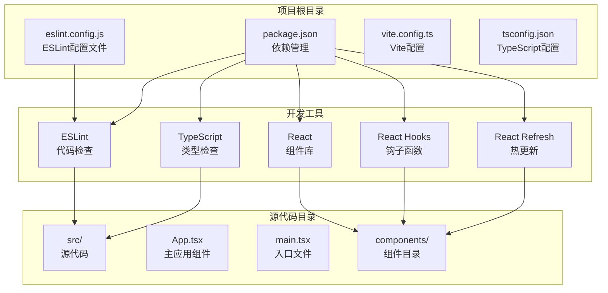
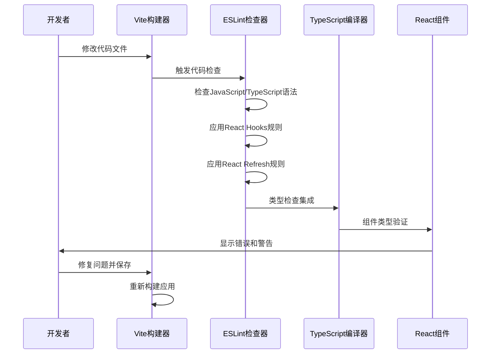
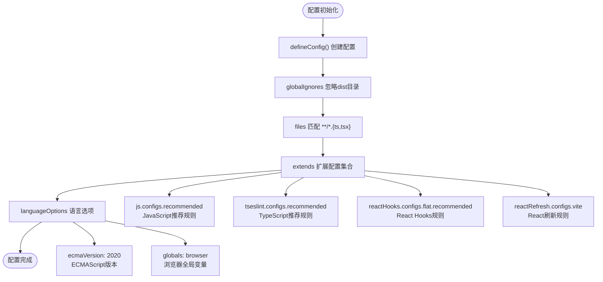
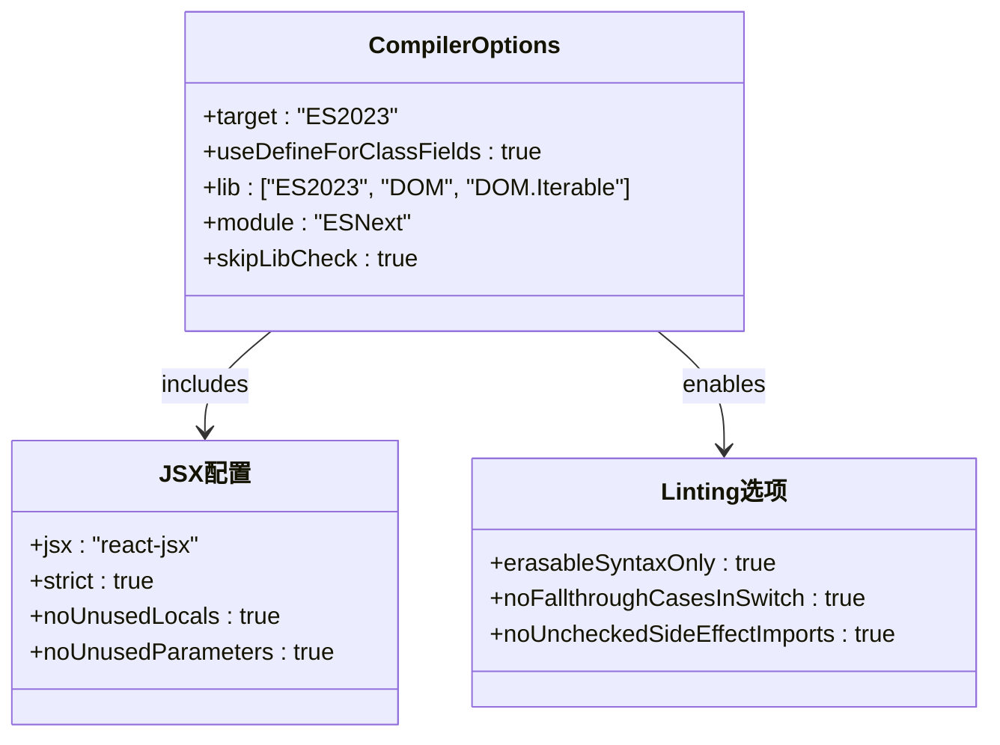
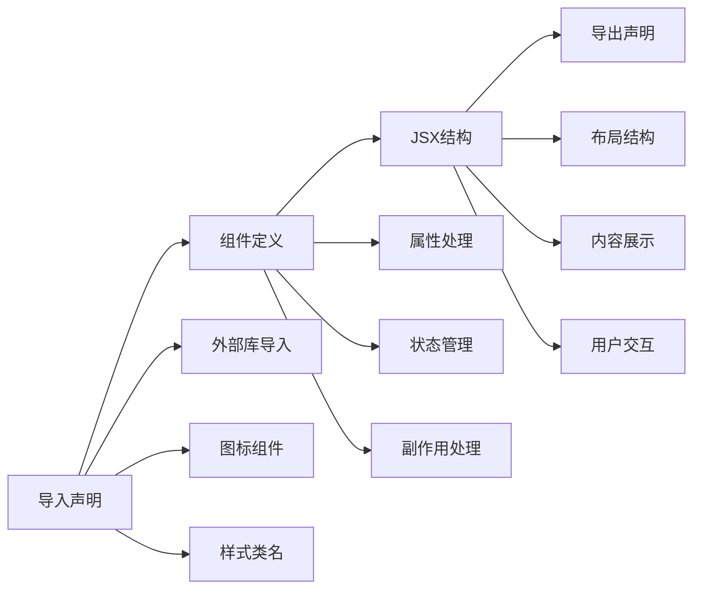
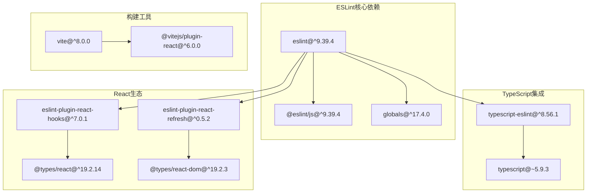
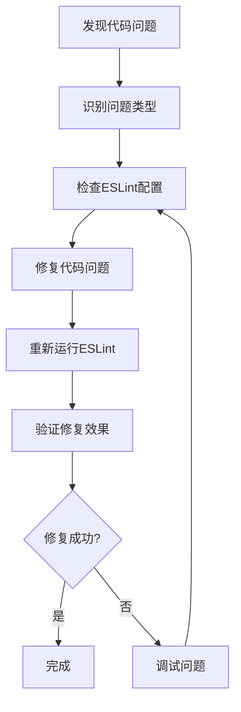

# ESLint配置

<cite>
**本文档引用的文件**
- [eslint.config.js](file://crm-frontend/eslint.config.js)
- [package.json](file://crm-frontend/package.json)
- [README.md](file://crm-frontend/README.md)
- [tsconfig.app.json](file://crm-frontend/tsconfig.app.json)
- [vite.config.ts](file://crm-frontend/vite.config.ts)
- [App.tsx](file://crm-frontend/src/App.tsx)
- [Header.tsx](file://crm-frontend/src/components/Header.tsx)
- [main.tsx](file://crm-frontend/src/main.tsx)
</cite>

## 目录
1. [简介](#简介)
2. [项目结构](#项目结构)
3. [核心组件](#核心组件)
4. [架构概览](#架构概览)
5. [详细组件分析](#详细组件分析)
6. [依赖关系分析](#依赖关系分析)
7. [性能考虑](#性能考虑)
8. [故障排除指南](#故障排除指南)
9. [结论](#结论)

## 简介

本项目使用ESLint作为代码质量检查工具，结合TypeScript和React技术栈，为前端开发提供统一的代码规范和质量保证。ESLint配置采用现代化的flat配置格式，支持JavaScript和TypeScript文件的智能linting检查。

该项目基于Vite构建工具，集成了React Hooks和React Refresh插件，提供了完整的开发体验。通过合理的配置，确保代码的一致性、可维护性和性能优化。

## 项目结构

项目采用标准的Vite + React + TypeScript模板结构，ESLint配置位于项目根目录的配置文件中。



**图表来源**
- [eslint.config.js:1-24](file://crm-frontend/eslint.config.js#L1-L24)
- [package.json:1-36](file://crm-frontend/package.json#L1-L36)
- [vite.config.ts:1-8](file://crm-frontend/vite.config.ts#L1-L8)

**章节来源**
- [eslint.config.js:1-24](file://crm-frontend/eslint.config.js#L1-L24)
- [package.json:1-36](file://crm-frontend/package.json#L1-L36)

## 核心组件

### ESLint配置核心组件

项目的核心ESLint配置由以下关键组件构成：

#### 配置文件结构
- **配置格式**: 使用ESLint 9.x的flat配置格式
- **文件范围**: 专门针对TypeScript和TSX文件进行linting
- **忽略规则**: 自动忽略dist目录输出文件

#### 扩展配置集合
配置通过多个扩展包提供全面的代码检查能力：

```mermaid
classDiagram
class ESLintConfig {
+defineConfig() Config
+globalIgnores() Array
+files : "**/*.{ts,tsx}"
}
class BaseConfigs {
+js.configs.recommended
+tseslint.configs.recommended
+reactHooks.configs.flat.recommended
+reactRefresh.configs.vite
}
class LanguageOptions {
+ecmaVersion : 2020
+globals : browser
}
ESLintConfig --> BaseConfigs : extends
ESLintConfig --> LanguageOptions : uses
```

**图表来源**
- [eslint.config.js:8-23](file://crm-frontend/eslint.config.js#L8-L23)

**章节来源**
- [eslint.config.js:8-23](file://crm-frontend/eslint.config.js#L8-L23)

## 架构概览

ESLint在整个开发流程中的作用和集成方式如下：



**图表来源**
- [eslint.config.js:10-22](file://crm-frontend/eslint.config.js#L10-L22)
- [package.json:9](file://crm-frontend/package.json#L9)

## 详细组件分析

### ESLint配置文件分析

#### 导入模块和依赖
配置文件导入了必要的ESLint核心模块和第三方插件：

- **@eslint/js**: 提供JavaScript基础规则配置
- **globals**: 定义全局变量环境
- **eslint-plugin-react-hooks**: React Hooks专用规则
- **eslint-plugin-react-refresh**: React组件热更新规则
- **typescript-eslint**: TypeScript语言特定规则
- **eslint/config**: ES6模块化配置支持

#### 配置结构详解



**图表来源**
- [eslint.config.js:8-23](file://crm-frontend/eslint.config.js#L8-L23)

#### 语言选项配置
配置文件的语言选项设置确保了正确的代码解析和检查：

- **ECMAScript版本**: 2020，支持现代JavaScript特性
- **全局变量**: 浏览器环境，包含DOM和BOM相关API
- **文件匹配**: 仅对TypeScript和TSX文件生效

**章节来源**
- [eslint.config.js:18-22](file://crm-frontend/eslint.config.js#L18-L22)

### TypeScript配置集成

#### 编译选项分析
TypeScript配置提供了严格的类型检查和代码质量保证：



**图表来源**
- [tsconfig.app.json:2-26](file://crm-frontend/tsconfig.app.json#L2-L26)

#### 严格模式配置
TypeScript配置启用了多项严格检查选项：

- **严格模式**: 全面的类型安全检查
- **未使用本地变量**: 检测未使用的局部变量
- **未使用参数**: 检测未使用的函数参数
- **开关语句无遗漏**: 确保switch语句的完整性
- **副作用导入**: 检测不安全的导入模式

**章节来源**
- [tsconfig.app.json:19-25](file://crm-frontend/tsconfig.app.json#L19-L25)

### React组件代码风格

#### 组件结构规范
React组件遵循统一的代码风格和组织原则：



**图表来源**
- [App.tsx:1-58](file://crm-frontend/src/App.tsx#L1-L58)
- [Header.tsx:1-53](file://crm-frontend/src/components/Header.tsx#L1-L53)

#### 代码组织最佳实践
组件代码体现了良好的组织结构：

- **导入顺序**: 外部库、内部组件、样式文件的清晰分离
- **注释规范**: 关键部分添加详细的代码注释
- **结构层次**: 清晰的嵌套结构和逻辑分组
- **样式类名**: 使用Tailwind CSS的实用类命名约定

**章节来源**
- [Header.tsx:1-53](file://crm-frontend/src/components/Header.tsx#L1-L53)

## 依赖关系分析

### 开发依赖关系



**图表来源**
- [package.json:18-34](file://crm-frontend/package.json#L18-L34)

### 版本兼容性
所有依赖项都保持了良好的版本兼容性：

- **Node.js版本**: 支持18.18.0及以上版本
- **ESLint版本**: 9.x系列，提供最新的配置格式
- **TypeScript版本**: 5.9.x系列，支持最新的语言特性
- **React版本**: 19.2.x系列，使用最新的React特性

**章节来源**
- [package.json:18-34](file://crm-frontend/package.json#L18-L34)

## 性能考虑

### 配置优化策略

#### 忽略规则优化
配置文件使用`globalIgnores`自动忽略构建输出目录，避免不必要的检查：

- **忽略目标**: dist目录的构建产物
- **性能收益**: 减少文件扫描和检查时间
- **适用场景**: 生产构建和开发环境的区分

#### 并行处理能力
ESLint配置支持并行处理多个文件：

- **多文件检查**: 同时检查多个TypeScript文件
- **缓存机制**: 利用TypeScript的增量编译优势
- **增量检查**: 只检查修改过的文件

### 开发体验优化

#### 实时反馈机制
通过与Vite的集成，提供实时的代码质量反馈：

- **热更新集成**: 代码修改后立即触发检查
- **错误聚合**: 将多个错误信息聚合显示
- **快速定位**: 精确的错误位置和修复建议

## 故障排除指南

### 常见配置问题

#### 类型检查失败
当遇到TypeScript类型检查问题时：

1. **检查tsconfig配置**: 确认编译选项设置正确
2. **验证导入路径**: 检查相对路径和模块解析
3. **清理缓存**: 删除node_modules和重新安装依赖

#### React Hooks规则冲突
解决React Hooks相关的linting冲突：

1. **检查Hook调用位置**: 确保在顶层调用Hook
2. **验证依赖数组**: 检查useEffect的依赖项
3. **使用正确的Hook**: 确保使用相应的Hook类型

### 修复建议流程



**章节来源**
- [README.md:14-74](file://crm-frontend/README.md#L14-L74)

### 最佳实践建议

#### 代码质量检查流程
建立完整的代码质量检查流程：

1. **预提交检查**: 在提交前运行ESLint检查
2. **持续集成**: 在CI/CD管道中集成代码检查
3. **定期审查**: 定期审查和更新ESLint配置
4. **团队培训**: 确保团队成员了解代码规范

#### 常见错误预防
预防常见的代码质量问题：

- **类型安全**: 充分利用TypeScript的类型系统
- **代码重复**: 避免重复的代码逻辑
- **性能问题**: 注意潜在的性能瓶颈
- **可维护性**: 保持代码的简洁和清晰

## 结论

本项目的ESLint配置提供了全面而高效的代码质量保证体系。通过合理的配置选择和工具集成，实现了以下目标：

### 配置优势
- **现代化配置格式**: 使用ESLint 9.x的flat配置，提供更好的开发体验
- **全面的规则覆盖**: 涵盖JavaScript、TypeScript、React和React Hooks的检查
- **性能优化**: 通过忽略规则和并行处理提升检查效率
- **类型安全**: 与TypeScript深度集成，提供完整的类型检查

### 技术特色
- **React生态集成**: 专门为React项目定制的规则配置
- **开发工具链**: 与Vite、TypeScript等工具的无缝集成
- **可扩展性**: 支持自定义规则和插件的扩展
- **维护性**: 清晰的配置结构和良好的文档支持

### 发展建议
随着项目的发展，可以考虑：
- **增强规则配置**: 根据项目需求添加更严格的规则
- **自定义插件**: 开发或集成特定领域的检查规则
- **性能监控**: 建立ESLint性能监控和优化机制
- **团队协作**: 建立统一的代码规范和质量标准

通过持续的优化和完善，本ESLint配置将成为项目高质量发展的坚实基础。