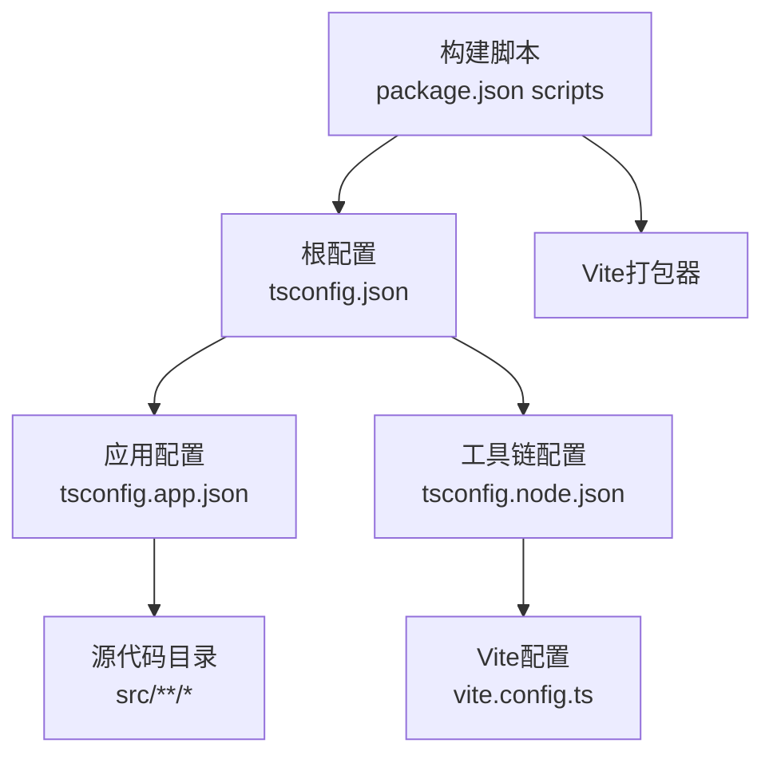
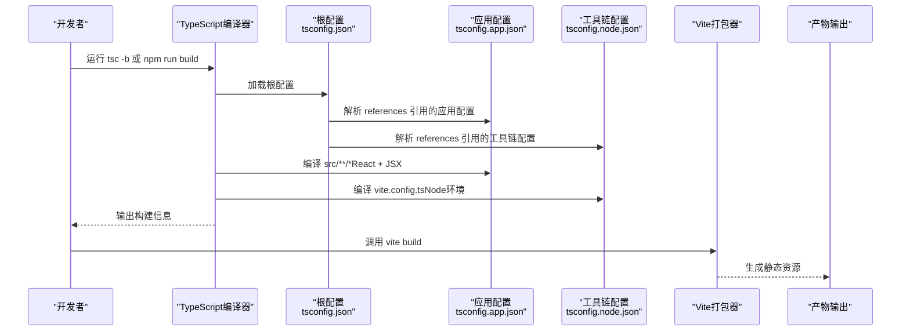
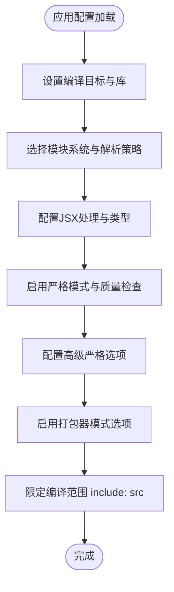
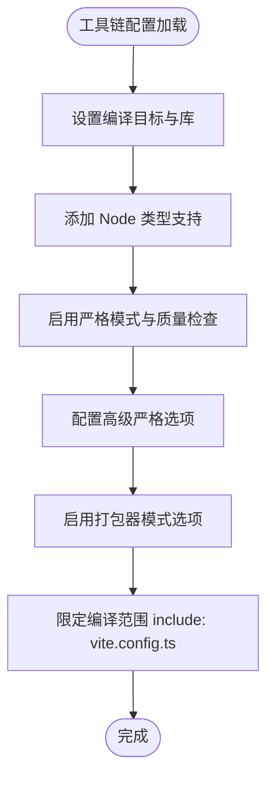
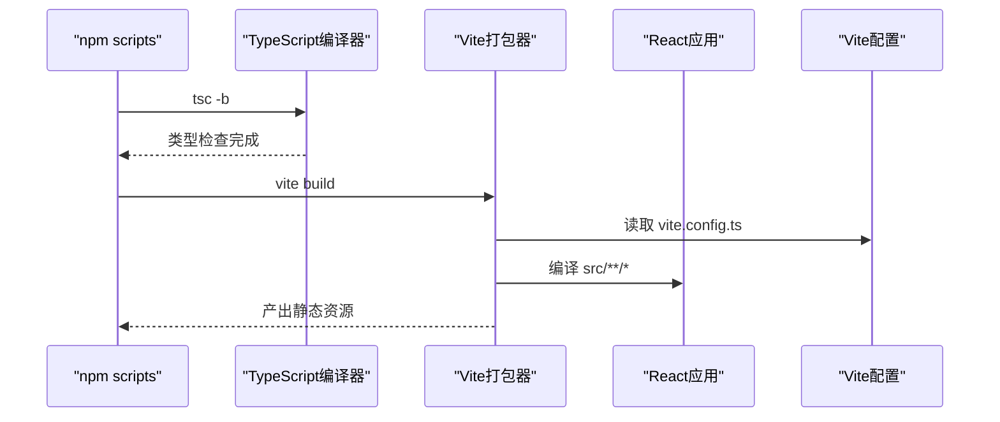
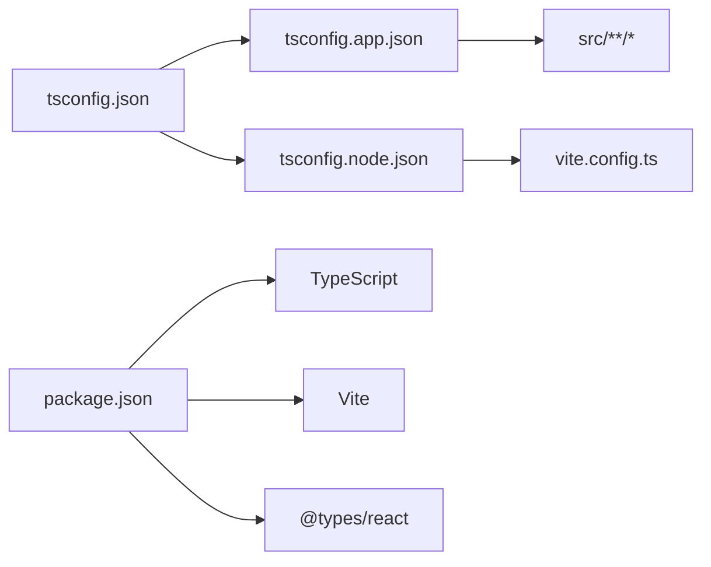

# TypeScript配置

<cite>
**本文档引用的文件**
- [tsconfig.json](file://crm-frontend/tsconfig.json)
- [tsconfig.app.json](file://crm-frontend/tsconfig.app.json)
- [tsconfig.node.json](file://crm-frontend/tsconfig.node.json)
- [package.json](file://crm-frontend/package.json)
- [vite.config.ts](file://crm-frontend/vite.config.ts)
- [src/main.tsx](file://crm-frontend/src/main.tsx)
- [src/App.tsx](file://crm-frontend/src/App.tsx)
- [src/types/index.ts](file://crm-frontend/src/types/index.ts)
- [src/stores/index.ts](file://crm-frontend/src/stores/index.ts)
</cite>

## 更新摘要
**所做更改**
- 更新了应用配置中的严格模式选项说明，新增了erasableSyntaxOnly和noUncheckedSideEffectImports配置
- 补充了类型定义文件的详细分析，展示项目中的完整类型系统
- 更新了构建流程图，反映最新的配置继承关系
- 增强了最佳实践建议，涵盖现代TypeScript特性

## 目录
1. [简介](#简介)
2. [项目结构](#项目结构)
3. [核心组件](#核心组件)
4. [架构总览](#架构总览)
5. [详细组件分析](#详细组件分析)
6. [类型系统与最佳实践](#类型系统与最佳实践)
7. [依赖分析](#依赖分析)
8. [性能考虑](#性能考虑)
9. [故障排除指南](#故障排除指南)
10. [结论](#结论)
11. [附录](#附录)

## 简介
本文件面向TypeScript初学者与进阶用户，系统性解析本CRM前端工程中的三套TypeScript配置文件：根配置tsconfig.json、应用编译配置tsconfig.app.json、Node.js工具链配置tsconfig.node.json。我们将从配置继承关系、编译目标与模块系统、严格模式与路径映射、以及与Vite构建工具的集成等方面进行深入剖析，并给出可操作的最佳实践建议，帮助读者在实际项目中高效落地TypeScript工程化。

**更新** 本版本新增了对现代TypeScript严格模式特性的详细说明，包括erasableSyntaxOnly和noUncheckedSideEffectImports等高级选项。

## 项目结构
本项目采用"根配置 + 多子配置"的分层组织方式：
- 根配置文件通过references声明包含两个子配置，形成清晰的职责分离：应用侧（浏览器端）与工具链侧（Node.js环境下的Vite配置）。
- 应用配置负责React应用的编译、JSX处理、严格检查与打包模式；工具链配置负责Vite配置文件的类型检查与Node运行时支持。
- 构建脚本通过tsc -b并行构建多个项目，再交由Vite执行打包，实现TypeScript与现代打包器的协同。

**图表来源**
- [tsconfig.json:1-8](file://crm-frontend/tsconfig.json#L1-L8)
- [tsconfig.app.json:27-28](file://crm-frontend/tsconfig.app.json#L27-L28)
- [tsconfig.node.json:25-26](file://crm-frontend/tsconfig.node.json#L25-L26)
- [package.json:6-11](file://crm-frontend/package.json#L6-L11)

**章节来源**
- [tsconfig.json:1-8](file://crm-frontend/tsconfig.json#L1-L8)
- [package.json:6-11](file://crm-frontend/package.json#L6-L11)

## 核心组件
本节聚焦三份配置文件的关键选项与作用域，帮助快速理解每一份配置的职责边界与优化点。

- 根配置（tsconfig.json）
  - 作用：聚合应用配置与工具链配置，作为TypeScript项目的入口配置，供IDE与构建工具统一识别。
  - 关键点：使用references声明包含两个子配置，避免重复定义公共选项；files为空，确保仅通过references加载子配置。
  - 适用场景：多项目或多工具链的TypeScript工程，推荐采用此模式以提升可维护性。

- 应用配置（tsconfig.app.json）
  - 作用：面向浏览器端React应用的编译配置，覆盖目标平台、模块系统、JSX处理、严格检查与打包器模式。
  - 关键点：
    - 编译目标与库：ES2023与DOM/DOM.Iterable，适配现代浏览器与React生态。
    - 模块系统：ESNext配合bundler解析策略，结合noEmit与Vite实现零额外输出。
    - JSX：react-jsx，配合@vitejs/plugin-react使用。
    - 严格模式：启用严格检查与未使用变量/参数等规则，包括新增的erasableSyntaxOnly和noUncheckedSideEffectImports。
    - 打包器模式：allowImportingTsExtensions、verbatimModuleSyntax、moduleDetection等，确保与Vite的按需解析一致。
  - 适用场景：React单页应用或现代Web应用的TypeScript编译。

- 工具链配置（tsconfig.node.json）
  - 作用：为Vite配置文件提供类型检查与Node运行时支持，确保开发体验与类型安全。
  - 关键点：
    - 目标与库：ES2023，满足Vite配置所需的Node能力。
    - 类型：types包含node，确保process、require等Node全局可用。
    - 打包器模式：与应用配置一致的bundler模式，保证一致性。
  - 适用场景：需要对Vite配置文件进行类型检查的工程。

**章节来源**
- [tsconfig.json:1-8](file://crm-frontend/tsconfig.json#L1-L8)
- [tsconfig.app.json:2-29](file://crm-frontend/tsconfig.app.json#L2-L29)
- [tsconfig.node.json:2-27](file://crm-frontend/tsconfig.node.json#L2-L27)

## 架构总览
下图展示了TypeScript配置与构建流程的交互关系：根配置聚合两个子配置，应用配置驱动React源码编译，工具链配置保障Vite配置文件的类型安全，最终由Vite完成打包与预览。

**图表来源**
- [tsconfig.json:3-6](file://crm-frontend/tsconfig.json#L3-L6)
- [tsconfig.app.json:27-28](file://crm-frontend/tsconfig.app.json#L27-L28)
- [tsconfig.node.json:25-26](file://crm-frontend/tsconfig.node.json#L25-L26)
- [package.json:8](file://crm-frontend/package.json#L8)
- [vite.config.ts:5-7](file://crm-frontend/vite.config.ts#L5-L7)

## 详细组件分析

### 根配置（tsconfig.json）分析
- 配置要点
  - 使用references声明包含应用配置与工具链配置，形成父子关系。
  - files为空，避免直接列出文件，减少维护成本。
- 继承与优先级
  - 子配置会继承根配置中的公共选项（如compilerOptions中的基础设置），但可通过子配置覆盖。
  - 子配置的include/exclude规则独立生效，不会被根配置影响。
- 最佳实践
  - 将通用的编译选项放在根配置，具体项目细节放在子配置，保持层次清晰。
  - 使用references而非手动复制选项，降低耦合度。

**章节来源**
- [tsconfig.json:1-8](file://crm-frontend/tsconfig.json#L1-L8)

### 应用配置（tsconfig.app.json）分析
- 编译目标与模块系统
  - 目标：ES2023，适配现代浏览器与React生态。
  - 模块：ESNext，结合bundler解析策略，与Vite按需解析一致。
- JSX与类型
  - jsx设为react-jsx，配合@vitejs/plugin-react插件。
  - types包含vite/client，提供Vite特有的类型支持。
- 严格模式与代码质量
  - 启用strict、未使用局部变量/参数检查、switch穷举检查、不可达分支检查等，提升代码健壮性。
  - 新增erasableSyntaxOnly选项，确保仅保留可擦除的语法元素。
  - 新增noUncheckedSideEffectImports选项，防止未检查的副作用导入。
- 打包器模式
  - allowImportingTsExtensions、verbatimModuleSyntax、moduleDetection等，确保与Vite的模块解析行为一致。
- include范围
  - include指向src，仅编译应用源码，避免误编译测试或工具文件。

**图表来源**
- [tsconfig.app.json:2-29](file://crm-frontend/tsconfig.app.json#L2-L29)

**章节来源**
- [tsconfig.app.json:2-29](file://crm-frontend/tsconfig.app.json#L2-L29)

### 工具链配置（tsconfig.node.json）分析
- 目标与库
  - 目标：ES2023，满足Vite配置所需的Node能力。
  - lib：ES2023，提供Node内置API类型。
- 类型与环境
  - types包含node，确保Vite配置文件可访问Node运行时类型。
- 严格模式与代码质量
  - 启用strict、未使用局部变量/参数检查、switch穷举检查等，确保配置文件的类型安全。
  - 新增erasableSyntaxOnly和noUncheckedSideEffectImports选项，提升配置文件的可靠性。
- 打包器模式
  - 与应用配置一致的bundler模式选项，保证类型检查与实际解析一致。
- include范围
  - include指向vite.config.ts，仅对Vite配置文件进行类型检查。

**图表来源**
- [tsconfig.node.json:2-27](file://crm-frontend/tsconfig.node.json#L2-L27)

**章节来源**
- [tsconfig.node.json:2-27](file://crm-frontend/tsconfig.node.json#L2-L27)

### 与Vite的集成与最佳实践
- 构建脚本
  - build脚本先执行tsc -b并行构建多个项目，再调用vite build进行打包，确保类型检查与打包分离。
- 插件与配置
  - vite.config.ts使用@vitejs/plugin-react，与应用配置中的react-jsx保持一致。
- 源码组织
  - src/main.tsx与src/App.tsx体现React应用的典型入口与根组件结构，组件间通过导入导出组织模块关系。

**图表来源**
- [package.json:8](file://crm-frontend/package.json#L8)
- [vite.config.ts:5-7](file://crm-frontend/vite.config.ts#L5-L7)
- [tsconfig.app.json:27-28](file://crm-frontend/tsconfig.app.json#L27-L28)
- [tsconfig.node.json:25-26](file://crm-frontend/tsconfig.node.json#L25-L26)

**章节来源**
- [package.json:6-11](file://crm-frontend/package.json#L6-L11)
- [vite.config.ts:1-13](file://crm-frontend/vite.config.ts#L1-L13)
- [src/main.tsx:1-11](file://crm-frontend/src/main.tsx#L1-L11)
- [src/App.tsx:1-68](file://crm-frontend/src/App.tsx#L1-L68)

## 类型系统与最佳实践

### 类型定义架构
项目采用了完整的类型系统架构，通过集中化的类型定义文件提供强类型支持：

- **枚举类型**：Stage、Priority、CustomerSource等业务枚举，确保数据的一致性和安全性
- **接口设计**：Customer、Opportunity、Payment等核心业务实体的完整接口定义
- **复合类型**：AISuggestion、CustomerPsychology等复杂业务对象的嵌套类型结构
- **工具类型**：颜色映射、标签映射等辅助类型的定义

### 类型组织策略
- **集中管理**：所有类型定义集中在src/types/index.ts中，便于维护和查找
- **业务导向**：类型定义按照业务领域进行分组，如联系人相关、名片扫描相关等
- **可扩展性**：支持可选属性和条件类型，适应业务需求的变化

### 最佳实践建议
- **使用联合类型**：对于枚举值使用联合类型，提供更好的类型安全保障
- **接口继承**：合理使用接口继承，避免重复定义相同的属性
- **可选属性**：对于可能不存在的数据使用可选属性标记
- **类型守卫**：在运行时使用类型守卫确保数据的完整性

**章节来源**
- [src/types/index.ts:1-497](file://crm-frontend/src/types/index.ts#L1-L497)

## 依赖分析
- 配置间的依赖关系
  - 根配置通过references依赖应用配置与工具链配置，形成"聚合-拆分"的结构。
- 工具链依赖
  - package.json中的devDependencies包含TypeScript、Vite与React相关类型，确保配置文件与工具链版本匹配。
- 模块解析一致性
  - 应用配置与工具链配置均采用bundler模式，避免因解析策略不同导致的类型不一致问题。

**图表来源**
- [tsconfig.json:3-6](file://crm-frontend/tsconfig.json#L3-L6)
- [tsconfig.app.json:27-28](file://crm-frontend/tsconfig.app.json#L27-L28)
- [tsconfig.node.json:25-26](file://crm-frontend/tsconfig.node.json#L25-L26)
- [package.json:18-36](file://crm-frontend/package.json#L18-L36)

**章节来源**
- [package.json:18-36](file://crm-frontend/package.json#L18-L36)

## 性能考虑
- 并行构建
  - 通过tsc -b并行构建多个项目，缩短整体构建时间。
- 打包器模式
  - 使用bundler解析策略与noEmit，避免重复输出，提升开发与构建效率。
- 严格模式
  - 启用严格检查与未使用项检测，可在早期发现潜在问题，减少运行时错误带来的性能损耗。
- 构建缓存
  - 通过tsBuildInfoFile配置构建信息缓存，提升增量构建速度。

**更新** 新增了对构建缓存机制的说明，这是现代TypeScript项目的重要性能优化手段。

## 故障排除指南
- 常见问题与定位
  - 类型检查失败：确认应用配置与工具链配置的types与lib是否覆盖到所需API。
  - 模块解析异常：检查moduleResolution、moduleDetection与allowImportingTsExtensions是否一致。
  - 构建失败：核对build脚本顺序与Vite配置文件的类型检查结果。
  - 严格模式错误：检查erasableSyntaxOnly和noUncheckedSideEffectImports相关的代码问题。
- 排查步骤
  - 先运行tsc -b单独验证类型检查，再执行vite build。
  - 检查references路径是否正确，确保子配置文件存在且可读。
  - 对比应用配置与工具链配置的bundler模式选项，确保一致。
  - 检查tsBuildInfoFile缓存文件是否正常工作。

**更新** 新增了对严格模式相关错误的排查指导，特别是针对新增的高级严格选项。

**章节来源**
- [tsconfig.app.json:11-16](file://crm-frontend/tsconfig.app.json#L11-L16)
- [tsconfig.node.json:10-14](file://crm-frontend/tsconfig.node.json#L10-L14)
- [package.json:8](file://crm-frontend/package.json#L8)

## 结论
本工程的TypeScript配置采用"根聚合 + 子配置拆分"的架构，既保证了配置的可维护性，又实现了应用侧与工具链侧的职责分离。通过ES2023目标、ESNext模块系统、bundler解析策略与严格检查，配合Vite的现代打包能力，形成了高效的前端工程化体系。

**更新** 本版本特别强调了现代TypeScript严格模式特性的重要性，包括erasableSyntaxOnly和noUncheckedSideEffectImports等高级选项，这些特性能够显著提升代码质量和运行时安全性。

建议在类似项目中延续该模式，并根据团队规范进一步细化命名与注释，以提升长期可维护性。同时，建议充分利用现代TypeScript的严格模式特性，确保代码质量达到行业最佳实践标准。

## 附录
- 配置继承与优先级规则
  - 子配置继承根配置的公共选项，但可通过子配置覆盖。
  - include/exclude在子配置内独立生效，不影响其他子配置。
  - references仅用于聚合，不改变子配置的独立性。
- 最佳实践清单
  - 使用references组织多配置，避免重复选项。
  - 在应用配置中启用严格模式与质量检查，在工具链配置中保持最小必要类型。
  - 与打包器（Vite）的模块解析策略保持一致，减少类型不一致问题。
  - 将构建脚本拆分为类型检查与打包两步，提升反馈速度与稳定性。
  - 合理使用现代TypeScript严格模式特性，包括erasableSyntaxOnly和noUncheckedSideEffectImports。
  - 建立完善的类型定义体系，确保业务逻辑的类型安全。
  - 利用构建缓存机制提升开发效率，定期清理过期的构建信息文件。

**更新** 新增了关于现代TypeScript严格模式特性和类型定义体系的最佳实践建议。